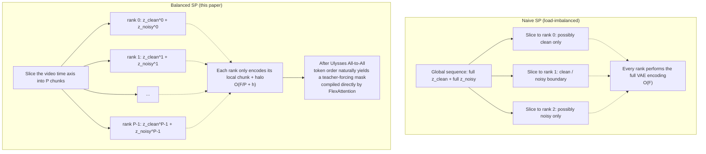
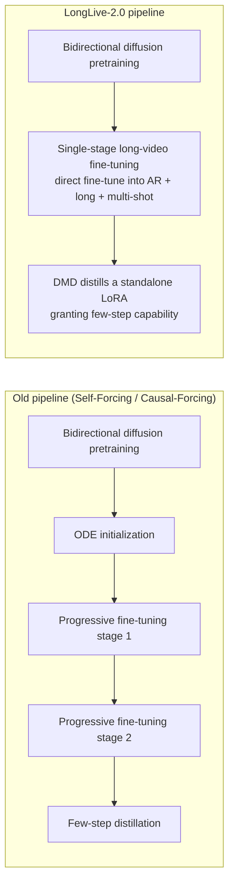
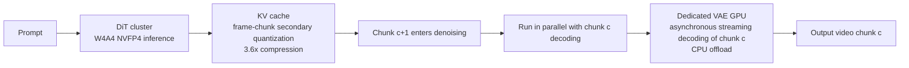
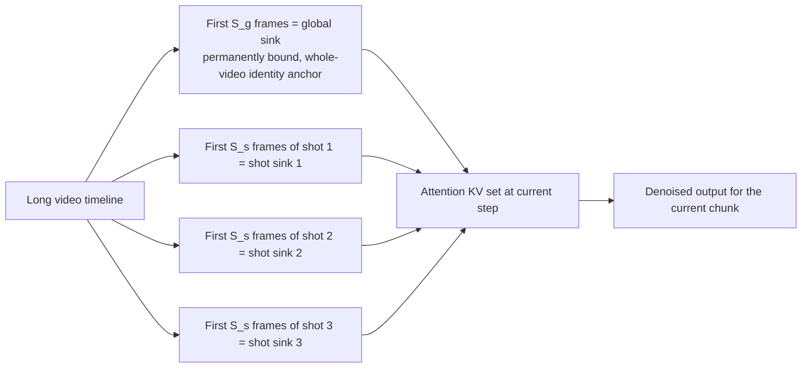

# LongLive-2.0: An NVFP4 Parallel Infrastructure for Long Video Generation

> **Original title**: LongLive-2.0: An NVFP4 Parallel Infrastructure for Long Video Generation
> **Authors**: Yukang Chen, Luozhou Wang, Wei Huang, Shuai Yang, Bohan Zhang, Yicheng Xiao, Ruihang Chu, Weian Mao, Qixin Hu, Shaoteng Liu, Yuyang Zhao, Huizi Mao, Ying-Cong Chen, Enze Xie, Xiaojuan Qi, Song Han
> **Institutions**: Not stated on the public page
> **Year**: 2026 (arxiv ID 2605.18739)
> **Subject**: cs.CV
> **Link**: https://arxiv.org/abs/2605.18739
> **Reading date**: 2026-05-19

## Reading guide

### Where this paper sits in the field

Video generation has traced a remarkably steep curve over the past two or three years. The earliest wave of work was generally able to produce clips whose length was measured in "seconds", and a few-second sequence already counted as impressive. A subsequent line of research grounded in diffusion models then pushed quality to a respectable level, but the cost was that memory consumption and generation time climbed just as non-linearly. Generating a video longer than one minute often produced OOM errors during training (Out Of Memory, meaning the GPU memory is exhausted), and at inference time achieving real-time or near-real-time interactive response was equally difficult. The research community has explored two complementary directions in response. The first attacks long-range consistency from the algorithmic side, for example by adopting autoregressive generation or anchoring on historical frames. The second attacks the cost from the engineering side, for example by distilling diffusion from dozens of steps down to a handful, or by applying PTQ (Post-Training Quantization, a quantization step performed after training has finished) to the model weights.

The position of LongLive-2.0 is that it no longer treats algorithm and engineering as separable concerns. Instead, it redesigns both training and inference around the NVFP4 4-bit floating-point format, and it introduces a parallel training scheme called Balanced SP (Balanced Sequence Parallelism) so that the long-video task is prepared from the training end for low-bit execution at inference time. Put differently, the previous two-stage practice of "train in high precision, then apply PTQ before inference" is fused into a single pipeline in which "training already uses the format that inference will use". This is a paper from the systems-engineering side, yet the design choices it makes will in turn shape how the algorithm side writes training loops in the future.

### What you will be able to answer

After finishing this note you should be able to answer the following five questions. First, in what specific ways NVFP4, this 4-bit floating-point format, surpasses the previously common BF16 (Brain Float 16) and INT4 quantization at each layer. Second, how exactly the load-imbalance problem arises in long-video autoregressive training when the "clean history concatenated with the noisy target, then sliced" arrangement is used, and how Balanced SP flattens that imbalance by having every GPU rank simultaneously hold a paired chunk of clean and noisy content. Third, how much memory and latency are saved by the three inference-side optimizations, namely W4A4 for weights and activations, secondary quantization of the KV cache at the frame-chunk granularity, and asynchronous decoding of the 3D VAE on a dedicated GPU. Fourth, how multi-shot video uses two sets of anchors, the global sink and the shot-level sink, to prevent identity drift across cuts. Fifth, how much the engineering footprint shrinks once the training pipeline is collapsed from "multi-stage ODE initialization plus progressive fine-tuning" down to "single-stage fine-tuning plus a LoRA distillation that confers few-step capability".

### Prerequisites

The reader is assumed to be familiar with the basic mechanics of diffusion models (forward noising, reverse denoising, the x_0 prediction objective), to be familiar with the attention operator and the KV cache in Transformers, and to have a working notion of autoregressive generation (conditioning each step on previously emitted output to predict the next segment). The reader is assumed to know roughly how BF16 and FP32 differ in training precision, but is not assumed to have personally performed low-bit quantization in production. The reader is also not assumed to be fluent in video-specific terms such as 3D VAE, teacher-forcing, or shot-level control, and these will be filled in where they appear.

### Glossary

| Acronym | Full form | Explanation |
|---|---|---|
| **NVFP4** | NVIDIA FP4 | NVIDIA's proposed 4-bit floating-point format, encoded as E2M1 (2 exponent bits, 1 mantissa bit, 1 sign bit) |
| **SP** | Sequence Parallelism | A parallelism scheme that partitions tensors along the sequence dimension across GPUs |
| **AR** | Autoregressive | Autoregressive generation, conditioning each step on prior outputs to predict the next |
| **DMD** | Distribution Matching Distillation | A distillation method that compresses diffusion from dozens of steps to a few |
| **VAE** | Variational AutoEncoder | A variational autoencoder, used in this paper in its 3D form to compress raw pixels into a latent representation |
| **DiT** | Diffusion Transformer | An architecture that replaces the U-Net backbone of diffusion models with a Transformer |
| **KV cache** | Key-Value cache | A cache of the K and V matrices of historical steps during autoregressive inference, used to avoid recomputation |
| **PTQ** | Post-Training Quantization | Quantization performed after training has finished, not participating in the training process |
| **W4A4** | Weight-4-bit / Activation-4-bit | Both weights and activations are represented in 4 bits |
| **LoRA** | Low-Rank Adaptation | A parameter-efficient fine-tuning method that trains only a low-rank matrix laid on top of a frozen backbone |
| **VBench** | Video Benchmark | A benchmark suite for video generation quality, covering visual fidelity, semantics, long videos and more |
| **FlexAttention** | PyTorch FlexAttention | A programmable attention block scheduler shipped with PyTorch that supports arbitrary mask patterns |
| **Blackwell / GB200** | NVIDIA Blackwell GPU | NVIDIA's latest GPU architecture, with native support for NVFP4 |
| **OOM** | Out Of Memory | Memory exhaustion, meaning training or inference cannot proceed due to insufficient GPU memory |

## I. The Problem

### Why this problem matters

To make the problem concrete, consider what "generate a sixty-second high-definition video" means for a real product. Creators on short-video platforms are already using AI tools to generate footage of a few to a dozen seconds, but as soon as the duration is pushed past one minute the problems pile up. The first segment may look fine, but at the thirty-second mark the protagonist's face suddenly turns into someone else's. After a cut the outfit quietly changes style. On the server side the per-GPU memory is consumed by a tens-of-gigabyte KV cache together with a heavy 3D VAE, and each segment takes minutes to produce, ruling out any real interactive experience. The common root cause underneath these symptoms is a single binding constraint, which is that current training and inference algorithms for diffusion models have never been specifically optimized for long duration, so every engineering metric balloons linearly or even non-linearly once the video crosses the minute-long threshold.

The mainstream lines of work on this track over the past several years can be grouped into three. The first is a purely algorithmic line that studies how to keep the model consistent over long ranges. A representative recipe reshapes video generation into an autoregressive form, conditioning each step on the previously generated frames as history before predicting the next segment. This family of work solves "long-range inconsistency" at the algorithm layer but does nothing for "engineering intractability". The second is a purely engineering line, for example applying PTQ after training to compress the model to 4 bits before deployment. Latency and memory shrink, but the training distribution and the inference distribution no longer agree, and the quality drop is non-negligible. The third is the few-step line that distills the number of diffusion steps down to a handful, for example DMD, which can recover a large fraction of inference time but generally requires an intricate multi-stage training pipeline, namely ODE initialization followed by progressive fine-tuning, which is fragile in engineering and hard to tune.

The reason none of these three lines fully suffices is that they all treat training and inference as two decoupled problems. All parameter updates during training are performed in BF16, and quantization, distillation and KV compression are bolted on separately before inference. On paper the division of labor is clean, but in practice the training distribution and the inference distribution fail to align in the low-bit regime, and the resulting quality loss is forced to surface entirely on the inference side. What LongLive-2.0 aims to address is precisely the cost imposed by this "training and inference are divorced" split.

### Three concrete technical questions

Translating the high-level motivation above into testable technical questions, the agenda breaks into three concrete items.

The first item concerns **parallel efficiency and memory on the training side**. Long-video training concatenates the clean history and the noisy target into one long sequence before feeding it to the autoregressive model, and a naive sequence-parallel slice along the sequence dimension creates load imbalance, where some ranks receive only history while others receive only target, and on top of that every rank is forced to repeat the full VAE encoding. The paper asks how to ensure that each GPU rank holds a locally paired chunk of history and target while performing only the VAE work that its own temporal block requires.

The second item concerns **the triangle of latency, memory and quality on the inference side**. Low-bit execution saves time and memory but inevitably hurts quality. KV cache compression saves memory but its benefits are wiped out if decompression becomes expensive. Compressing diffusion to 2-4 steps saves latency but can easily destroy image quality. The question to answer is whether all three of these optimizations can be stacked simultaneously, at the scale of one-minute 720p video, while remaining fast, frugal and visibly indistinguishable in quality.

The third item concerns **simplifying the training pipeline itself**. Can a bidirectional diffusion model be fine-tuned directly into a long-video, interactive, multi-shot AR model without going through the old route of two-stage ODE initialization and progressive fine-tuning. Cutting out one stage means one fewer place where things can go wrong and one fewer experiment whose hyperparameters need tuning.

## II. Method

The full method decomposes into five blocks: the NVFP4 quantization format, Balanced SP training, simplification of the training pipeline, the inference infrastructure, and multi-shot attention anchors.

### The NVFP4 quantization format

Begin with what NVFP4 actually is. It is a 4-bit floating-point format proposed by NVIDIA, encoded as E2M1, meaning 1 sign bit, 2 exponent bits and 1 mantissa bit, for a total of 4 bits. Compared with INT4 quantization of the same 4-bit width, NVFP4 has a non-uniform step size. The exponent bits keep dense step sizes near small values while spanning the gaps between large values with coarser steps, a behavior that is exceptionally well matched to the statistics of neural networks, where the distribution is long-tailed and the overwhelming majority of weights cluster near zero.

At the level of how a tensor is stored, NVFP4 employs a three-level hierarchical scaling:

- a tensor-wide FP32 scaling factor α^FP32, which normalizes the global dynamic range
- a block-level FP8 E4M3 scaling factor α^FP8 for every block of 16 elements within the tensor, which aligns local dynamic range
- the per-element FP4 value X^FP4 itself

The dequantization formula is therefore:

$$
\text{Dequant}(X) = X^{\text{FP4}} \cdot \alpha^{\text{FP8}} \cdot \alpha^{\text{FP32}}
$$

The advantage of this layered scaling is that it preserves the element-level 4-bit storage compression while letting FP8 and FP32 bound the error at their respective scales.

### Balanced Sequence-Parallel AR Training

The second block is Balanced SP. This is the paper's central training-side innovation, and the problem needs to be stated clearly before the solution.

Long-video autoregressive training has a special arrangement. Each training step needs to look at a chunk of clean history (frames already finalized) as conditioning, together with a chunk of noisy target (frames still being denoised) as the prediction target. The naive approach concatenates the two along the time axis, written as $[z_{\text{clean}}; z_{\text{noisy}}]$, and then slices the result across GPUs using standard sequence parallelism along the sequence dimension. The problem arises precisely at this slicing step. The clean-history segment and the noisy-target segment are typically of unequal length, so after slicing some ranks receive only the clean part while other ranks receive only the noisy part. The token counts handled by different ranks differ markedly, the computational complexity per rank diverges accordingly, and the overall training step is dragged down by the slowest rank. Worse, the VAE encoding step usually has to see the entire set of video frames to function, which forces every rank to replicate a full VAE encoding pass, wasting both memory and compute.

The design of Balanced SP is to let every rank locally hold its own paired chunk of clean and noisy content directly, rather than having some ranks hold only clean and others only noisy. Concretely, the full video is sliced along the time axis into $P$ chunks, each GPU rank holds the clean-history and noisy-target pair for one chunk, and the global token order becomes:

```
[z_clean^(0), z_noisy^(0), z_clean^(1), z_noisy^(1), ..., z_clean^(P-1), z_noisy^(P-1)]
```

This arrangement yields three consequences. First, the number of context and target tokens processed by each rank is equal, so the load is flattened. Second, every rank only needs to perform VAE encoding on its own temporal chunk plus a small halo at the boundary, dropping the VAE cost from $O(F)$ to $O(F/P + h)$. Third, after a Ulysses All-to-All communication step, the global ordering of tokens naturally forms a teacher-forcing attention mask, where clean positions can see all earlier clean and noisy positions and noisy positions can only see content within their own temporal chunk and earlier. This mask can be compiled directly into an efficient kernel by FlexAttention, with no need to materialize an explicit permutation matrix.

The figure below contrasts Balanced SP with naive SP:



### Engineering details of NVFP4 training

Applying NVFP4 to AR training comes with several engineering considerations. Both weights and activations go through W4A4 quantization, and the paper writes its own CUDA kernels for this purpose. Weights use 2D block-level scaling (blocks defined along two dimensions), while activations and gradients use 1D block-level scaling. A few categories of operations are numerically sensitive, however, and the paper keeps them at higher precision. Reduction operations, normalization layers and the internal state of the optimizer are all retained at higher bit width. On the gradient path, a Random Hadamard Transform is applied before the weight-gradient GEMM is quantized, in order to stabilize the numerical distribution.

The few-step distillation component takes the form of "freeze the backbone and train a LoRA adapter". The LoRA rank is set to 128 and alpha is also set to 128. The distillation introduces a technique called adaptive scale search, with the candidate scale magnitudes drawn from the set $\{4, 6\}$, used to keep the scale choices during distillation compatible with the backbone.

### Simplifying the training pipeline

The third block is the simplification of the pipeline itself. Prior work of the same family (Self-Forcing, Causal-Forcing and others) required a complex multi-stage process: first ODE initialization to obtain a starting point, then progressive fine-tuning to incrementally equip the model with long-video capability, and finally few-step distillation. LongLive-2.0 collapses this entire flow into a single fine-tuning stage. A model that was originally a bidirectional diffusion pretraining checkpoint is fine-tuned directly on long-video data into a long, interactive, multi-shot AR model. The few-step capability is then distilled separately from DMD into a set of LoRA weights, with no need to revisit ODE initialization or progressive fine-tuning.

The figure below contrasts the old and new pipelines:



### The inference infrastructure

The fourth block is the three stacked optimizations on the inference side.

The first is NVFP4 inference. Weights are stored at 4 bits after materialization, activations are also at 4 bits, and the theoretical throughput is 4 times higher than BF16.

The second is parallel KV quantization. The KV cache for long-video autoregressive inference can balloon to a considerable size. What the paper does is "secondary quantization at the frame-chunk granularity". Every 8 frames are packed into one chunk, and K-smoothing and adaptive scale selection are applied to the K and V respectively within that chunk. The storage cost shrinks from the original $4 T_c \cdot H \cdot d$ bytes to $\frac{9}{8} T_c \cdot H \cdot d$ bytes, roughly a 3.6x compression. The matching dequantization is performed in a hand-written CUDA kernel, and the overall overhead is kept below 2%.

The third is asynchronous streaming decoding of the 3D VAE. The original 3D VAE decoding had to view all chunks at once, with memory occupancy of $O(C \cdot T_c)$. The new version decodes chunk by chunk, so per-chunk GPU memory occupancy drops to $O(T_c)$. The paper goes further and dedicates one GPU exclusively to VAE decoding work, so that while the DiT cluster is denoising chunk $c+1$, the VAE GPU is decoding chunk $c$, overlapping the two so that VAE latency is hidden behind DiT computation.

The figure below links the three layers of optimization along the inference path:



### Multi-shot attention sinks

The fifth block addresses the identity-drift problem in multi-shot video. Once a generated video extends past a few dozen seconds, the protagonist's face, clothing and accessories frequently "turn into someone else's" after one of the shot changes. LongLive-2.0 introduces two sets of anchors:

- **Global sink**: the first $S_g$ frames at the beginning of the video are permanently bound as the identity anchor for the entire piece, and every attention computation across the video includes them as reference
- **Shot-level sink**: the first $S_s$ frames at the beginning of the current shot, rebound at every scene change

The effective KV set used by attention is:

$$
A_g \cup A_s \cup KV[t - W, t)
$$

with deduplication applied. The shot-level sink is essentially free in memory terms, since it only needs to track a pair of scalar pointers and does not require additional KV copies. This mechanism also dovetails naturally with chunk-wise prompting, since a prompt change itself defines a shot boundary.

The figure below sketches the dual-anchor mechanism:



## III. Experiments

### Datasets

The training data is a self-curated dataset of 120k long videos assembled by the authors, partitioned by duration into three groups: 16-32 seconds, 32-64 seconds, and over 64 seconds. Every clip carries shot-level annotations. Quality filtering uses MANIQA as the perceptual indicator, and samples containing logos, watermarks, obvious blur or camera shake are removed.

### Training efficiency

The table below compares per-step training time across three configurations, BF16 with naive SP, Balanced SP, and NVFP4 plus Balanced SP, for several video lengths.

| Video length | BF16 + naive SP | Balanced SP | NVFP4 + Balanced SP | Total speedup |
|---|---|---|---|---|
| 16 seconds | 52.2 s | 45.8 s | 40.1 s | 1.3x |
| 32 seconds | 162.7 s | 136.8 s | 119.3 s | 1.4x |
| 64 seconds | OOM | 1196.5 s | 639.5 s | 2.1x |

The 64-second row deserves a separate call-out. BF16 with naive SP simply runs out of memory and cannot proceed at all; Balanced SP rescues the configuration; and stacking NVFP4 on top of that halves the per-step time once more. Put differently, for video training beyond 64 seconds this infrastructure is a necessary condition rather than a performance optimization.

### Inference efficiency

End-to-end inference comparison on 64-second video:

- BF16 baseline: 36.4 seconds per step, 112.9 GB memory
- NVFP4 plus secondary KV-cache quantization plus asynchronous VAE decoding: 19.4 seconds per step, 19.4 GB memory
- 2-step NVFP4: 36.3 seconds end-to-end, 45.7 FPS throughput

Memory drops from 112.9 GB to 19.4 GB, raising significantly the upper bound on video length that a single GPU can handle. For real-time interactive product shapes (the user types a prompt and waits a few dozen seconds to see the full segment), this set of numbers has direct deployment value.

### Video quality (VBench 720p)

| Configuration | Total | Visual | Semantic |
|---|---|---|---|
| 4-step BF16 | 85.06 | 86.67 | 78.63 |
| 4-step NVFP4 | 84.51 | 86.43 | 76.81 |
| 2-step NVFP4 | 83.14 | 85.40 | 74.12 |

The total-score gap between 4-step NVFP4 and 4-step BF16 is 0.55 points (85.06 vs 84.51), at the cost of squeezing both weights and activations down to 4 bits and dropping memory from 112.9 GB to 19.4 GB. This is a remarkably favorable trade-off. Going to 2 steps further halves latency, with another 1.37-point quality drop, and the operating point depends on the product's relative preference for responsiveness versus visual quality.

### Long-video benchmark

On VBench-Long, the specialized 60-second video evaluation, the BF16 variant of LongLive-2.0 attains the best average rank of 3.67 overall. Its NVFP4 variant achieves the highest subject consistency at 97.62%, and the BF16 variant achieves the highest background consistency at 97.00%. These two metrics are proxies, respectively, for "the protagonist does not change faces" and "the scene does not drift".

### Key ablations

- Peak memory during DMD distillation: BF16 reaches 70.5 GB while NVFP4 with LoRA reaches 49.0 GB, a ratio of 0.69. This shows that NVFP4 saves memory not only at inference but also during the distillation stage of training
- NVFP4 training versus PTQ inference: pretraining directly in W4A4 yields a 84.51 VBench total score, whereas applying PTQ alone reaches only 84.04. The gap between them is precisely the dividend produced by aligning training with inference
- Visual ablation of the multi-shot attention sinks: removing the global sink makes identity drift directly observable; with it in place, the protagonist's face and clothing remain stable across shot transitions

## IV. Limitations

### What the authors acknowledge

- **Hardware dependence**: the NVFP4 acceleration is bound to the Blackwell generation of GPUs (GB200). The A100 and H100 generations lack the natively optimized kernels and can only fall back to sequence-parallel inference, sharply reducing the throughput dividend
- **Architecture-specific quantization gains**: relative to generic 4-bit quantization such as INT4, the advantage of NVFP4 is wholly coupled to specific hardware, and cross-architecture portability has not been explored

### What a careful reader can identify

A first potential concern is the scope of generalization. All experiments in the paper are conducted on the authors' self-curated 120k long-video dataset, whose content distribution, duration distribution and shot-transition style are all decided by the data-curation process. Whether this infrastructure carries the same training efficiency and quality to another genre of video, for example real-person dialogue, first-person motion, or surveillance footage, is not supported by external benchmarks.

A second potential concern is engineering complexity. The implementation of Balanced SP involves a custom Ulysses All-to-All communication path, custom FlexAttention masks, and the matching VAE halo handling, all of which rely on the paper's private infrastructure. The barrier to reuse is non-trivial, and the engineering and documentation quality of the open-source release will directly determine whether the community can follow on.

A third potential concern is the credibility of quality evaluation. Automated metrics such as VBench have inherent limits in their coverage of "how good a video actually looks", and the 0.55-point gap between 4-step BF16 and 4-step NVFP4 is small on the score but the question of whether it is truly imperceptible to users requires more systematic subjective evaluation. The paper does not report large-scale human evaluation results.

A fourth potential concern is the robustness of the LoRA few-step path. The size of the LoRA adapter and the distillation target on the backbone are set by the paper, and whether the distillation curve remains smooth and stably converges in 2 to 4 steps when applied to a different backbone or a different category of video data requires further verification.

## One Sentence

By redesigning both training and inference around NVFP4, flattening long-video training load through Balanced SP, and stacking secondary KV quantization with asynchronous VAE decoding, LongLive-2.0 cuts 64-second inference memory from 113 GB to 19 GB and collapses the pipeline into single-stage fine-tuning plus LoRA distillation.
