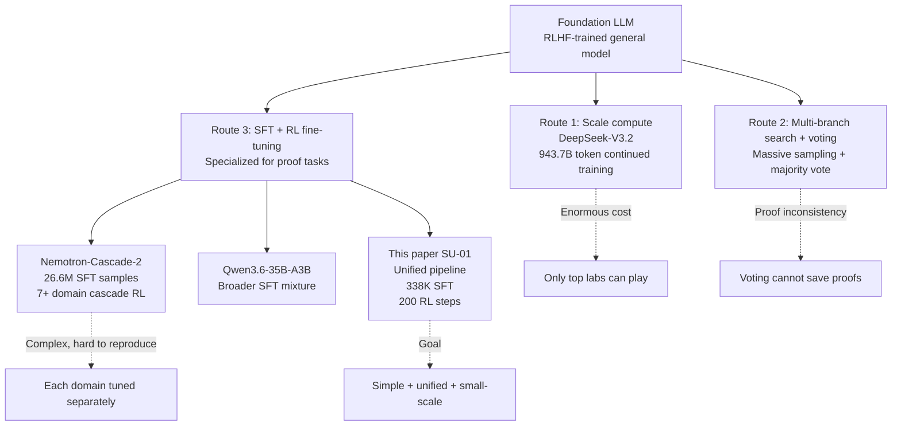
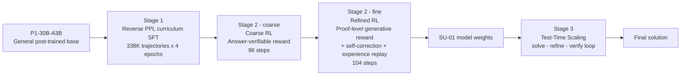
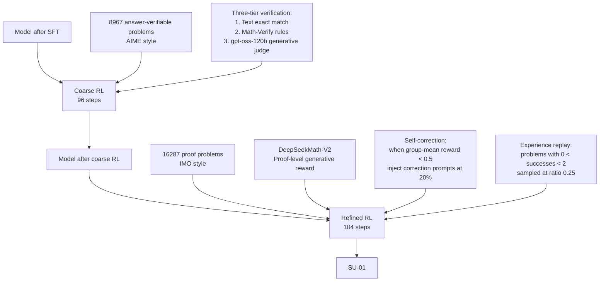
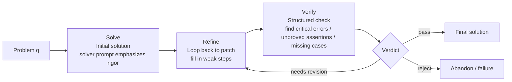

# Reaching Gold-Medal-Level Olympiad Reasoning Through Simple and Unified Scaling

> **Original title**: Achieving Gold-Medal-Level Olympiad Reasoning via Simple and Unified Scaling
> **Authors**: Yafu Li, Runzhe Zhan, Haoran Zhang and 25 others (28 total)
> **Institutions**: Shanghai AI Laboratory, Chinese University of Hong Kong, Tsinghua University, Shanghai Jiao Tong University, Peking University
> **Year**: 2026 (arxiv ID 2605.13301, submitted 2026-05-13)
> **Subject**: cs.AI / cs.CL
> **Link**: [https://arxiv.org/abs/2605.13301](https://arxiv.org/abs/2605.13301)
> **Reading date**: 2026-05-17

## Reading guide

### Where this paper sits in the field

Across the past two years, the line of work on "getting large language models to do rigorous mathematical proofs" has roughly split into two camps. The first camp follows a symbolic route: it translates problems into formal systems such as Lean or Coq and then uses neural networks as a heuristic guide for tactic search. AlphaProof and AlphaGeometry both belong to this branch. The advantage of these methods is that once a proof goes through, correctness is machine-verifiable; the disadvantage is narrow coverage, sensitivity to problem type, and a dependency on specialized formalized corpora. The second camp takes the natural language route: it lets models write solutions directly in human-readable prose interleaved with formulas, and pours "rigor" into the model itself through post-training. General frontier models such as DeepSeek-V3.2, Gemini Deep Think, and GPT-5.5 all run along this second line.

The present paper belongs to the second camp, but it tries to push that line into a much more specific position: can a simple, unified, search-free recipe of post-training and inference convert a 30B-scale sparse model that has already gone through general post-training directly into a dual-track gold-medal solver on both IMO and IPhO? In contrast to DeepSeek-V3.2 which throws compute at extending the reasoning chain, and in contrast to Nemotron-Cascade-2 which cascades RL separately across seven or eight domains, the keywords here are simple and unified: a reverse-perplexity-curriculum SFT, plus a coarse-to-fine two-stage RL, plus one layer of test-time self-checking.

### What you will be able to answer

1. Why "olympiad-level proofs" are so much harder than "AIME-style short answers", and which specific abilities account for the gap.
2. Why adding plain SFT on top of an already post-trained base tends to damage the base, and how the "reverse perplexity curriculum" addresses that.
3. What each of the two RL stages is meant to solve (coarse stage with answer-verifiable rewards, fine stage with proof-level rewards), and how the reward signals are defined.
4. How the solve-refine-verify loop at test time differs in essence from ordinary best-of-N sampling.
5. How much SU-01 saves on training scale relative to DeepSeek-V3.2 and Nemotron-Cascade-2, and what is given up in exchange.

### Prerequisites

The reader is assumed to be familiar with the basic Transformer architecture, to understand the cross-entropy loss of next-token prediction, to have done or read about the standard SFT and RLHF pipelines, and to have some grasp of policy gradient algorithms such as PPO. No prior knowledge of the sparse activation details of Mixture-of-Experts is assumed, no familiarity with the scoring procedure for mathematical olympiads is required, and the reader is not expected to have read the specific predecessor works of this sub-area (GSPO, GRPO, ExGRPO will all be introduced in context).

### Glossary

| Acronym | Full form | Explanation |
|---|---|---|
| **IMO** | International Mathematical Olympiad | The international math olympiad. Six problems per year, seven points each, full score 42; the gold cutoff floats with problem difficulty, and in 2025 the cutoff was 35. |
| **IPhO** | International Physics Olympiad | The international physics olympiad. Theory and experiment portions; this paper evaluates only the theory portion. |
| **USAMO** | USA Mathematical Olympiad | The U.S. national math olympiad, comparable in difficulty to the IMO. |
| **AIME** | American Invitational Mathematics Examination | A U.S. high school invitational with short numeric answers only; substantially easier than USAMO. |
| **SFT** | Supervised Fine-Tuning | Supervised fine-tuning. Feed high-quality human or synthetic solutions to the model with standard cross-entropy loss so that it learns to imitate the demonstrated behavior. |
| **RL** | Reinforcement Learning | Reinforcement learning. Let the model sample its own solutions, then use a reward signal to infer which were good and which were bad, and update parameters accordingly. |
| **RLHF** | Reinforcement Learning from Human Feedback | RL with rewards derived from human preferences; this is the dominant alignment method for current general dialogue models. |
| **PPL** | Perplexity | Perplexity. For a piece of text, it is the exponential of the average negative log-likelihood assigned by the model. Intuitively, it captures how unfamiliar that text feels to the model. |
| **MoE** | Mixture of Experts | The Mixture-of-Experts architecture: the feed-forward layer is split into several parallel experts, and each token only activates a small subset, so the total parameter count is large but the per-token compute is small. |
| **A3B** | Active 3 Billion parameters | A sparse configuration in which only 3 billion parameters activate per token; the model in this paper has 30B parameters in total and 3B active per token. |
| **GSPO** | Group Sequence Policy Optimization | A policy optimization algorithm that, relative to PPO, replaces the importance sampling ratio with a sequence-level, length-normalized version, which is particularly well suited to scenarios where outputs can run to 100K tokens and the model itself is MoE. |
| **GRPO** | Group Relative Policy Optimization | An algorithm proposed in DeepSeekMath that updates the policy using the relative advantage within a sampled group, removing the need for a critic network. |
| **PPO** | Proximal Policy Optimization | The classical policy gradient algorithm; it uses importance sampling with clipping to keep updates stable. |
| **TTS** | Test-Time Scaling | Test-time scaling. Spend additional compute at inference time to trade for higher answer quality; common forms are sampling, voting, self-correction, and self-verification. |
| **CoT** | Chain-of-Thought | Chain-of-thought prompting. Have the model write out its reasoning step by step before producing a final answer. |
| **DP** | Dynamic Programming | Dynamic programming. It comes up several times in the case analyses below. |
| **AoPS** | Art of Problem Solving | A math competition community and problem bank; the paper uses it as one of the SFT data sources. |

## I. The Problem

### Why this problem matters

Olympiad-level math and physics reasoning has long been treated as a touchstone for "rigorous reasoning" in the history of large language models, and for very concrete reasons. An IMO problem is not like an AIME problem where submitting a single numeric answer is enough to win; the grader reads through the proof line by line, and every logical skip, every unproved lemma, every missing case, every broken invariant costs points. Put differently, a perfect AIME score only requires getting the number right; a perfect IMO score requires proving correctly, writing clearly, and being verifiable line by line by another reader.

Failing to solve this issue produces three concrete pain points. First, the model becomes unreliable as a research or engineering assistant: a user asks a "why" question, the model gives a smooth-sounding explanation, but one of the steps cites a non-existent theorem or skips over a step that should have been a case analysis, and the user has no way to detect it, so the error slips through. Second, the model's internal consistency on long-horizon tasks is unstable: an olympiad proof routinely spans 100K+ tokens of reasoning, and throughout that span the model must maintain consistent notation, leave no case unexplored, and never break an invariant. This is precisely what ordinary dialogue models struggle with. Third, from the standpoint of model evaluation, short-answer benchmarks of the AIME variety have been saturated by large models, with top systems now routinely above 90% on AIME 2025, leaving no room to distinguish among the top contenders. Only an exam like the IMO, which demands complete proofs, can still pull apart the genuine capability differences.

Over the past year or two, the mainstream responses have split roughly into three approaches. The first is to throw raw compute at the problem and brute-force long reasoning chains through sheer scale. The continued-training phase of DeepSeek-V3.2 consumed 943.7 billion tokens. In absolute terms this is strong enough, but the training cost is enormous and the barrier to reproduction is only accessible to the handful of largest labs. The second approach is multi-branch search combined with voting: sample dozens or hundreds of solutions per problem, then aggregate the scattered correct paths through majority voting. This works on short-answer problems but fails on proof problems: voting picks the most frequent final answer, with no guarantee that the specific path under that answer is internally rigorous from start to finish. The third approach is to leverage the chain-of-thought capability that general models already possess and add targeted SFT plus RL fine-tuning. In principle this direction is correct, but in practice there is an awkward paradox: a post-trained base has already been through RLHF on general conversation, and tacking on more SFT tends to undo the instruction-following and self-checking abilities the base already had.

This is the gap the paper is trying to fill. The question it asks is: can one do this without search, without 26M-scale SFT data, without cascading RL across seven or eight domains, using only a single, unified, relatively small post-training pipeline, to convert a 30B-A3B sparse MoE base (specifically the P1-30B-A3B model, which has already been post-trained) into a dual-track gold-medal reasoner across IMO and IPhO?

### Relationships among the older approaches

The diagram below places the three approaches mentioned above alongside the position this paper stakes out.

Brought down to an empirically testable technical statement, the core claim of this paper reads as follows. Given a post-trained P1-30B-A3B base, with 338K solution trajectories for SFT, 25K prompts for RL, and one extra layer of a test-time self-verification loop, the final model SU-01 reaches the gold cutoff on IMO 2025, USAMO 2026, IPhO 2024, and IPhO 2025, and is no worse than comparably sized contemporary models on AIME and IMO-ProofBench. Put differently, olympiad-level reasoning does not necessarily require search or two-orders-of-magnitude more training scale; the key is to get each step of a simple pipeline right.

## II. Method

The full recipe has three segments: a reverse perplexity curriculum SFT, a two-stage RL, and test-time scaling. The three segments follow one thread: first restore and reshape behavioral patterns, then anchor the rigor of proofs with reward signals, and finally add a layer of self-review at inference time as a safety net. The overview diagram below sketches the skeleton; the subsequent subsections unpack each piece.

### Reverse perplexity curriculum SFT

What the SFT stage needs to accomplish is to teach the base model a new set of behavioral patterns: first attempt the problem, then go back to self-check, then correct the errors. Being able to write a finished answer in one go is not enough; what is scarcer in olympiad problems is the ability to see, after writing, where one's own writing went wrong. To this end, the authors prepared 338K solution trajectories shorter than 8K tokens as training examples. The 8K cutoff is not arbitrary: if the model were to face 100K-token trajectories at the start of SFT, its parameters would be dominated by the long examples, and the model would be pushed to imitate verbose versions before learning the compact writing style appropriate for shorter trajectories, making convergence difficult.

The sample composition itself (Figure 3 in the paper) consists of four classes of directly generated data plus two classes of self-improvement data. Within direct generation, math takes 40%, STEM 15%, code 10%, and instruction following 10%; within self-improvement, self-verification trajectories take 15% and self-correction trajectories take 10%. A self-verification trajectory is produced by letting the strong external model DeepSeek-V3.2-Speciale write a step-by-step verification commentary for each solution; a self-correction trajectory is generated as a corrected version after the commentary points out errors. Put differently, by the time SFT concludes, the model has already seen the three-act pattern of "solve once, then go back and check, then revise" many times over, so when asked to do the same thing at test time it does not need to learn from scratch and simply re-runs an action it already knows.

The real key is not the data itself, but the curriculum order. It is worth pausing to explain what a "perplexity curriculum" is. Perplexity is defined as the exponential of the average negative log-likelihood that the model assigns to a piece of text, PPL = exp(-1/T · Σ log π(y|x)), and intuitively it captures how unfamiliar the text feels to the model. The higher the PPL, the less familiar the sample is, and the harder it is to learn. The usual curriculum-learning instinct is to sort by PPL from low to high, showing the model easy examples first and harder ones later, mimicking how humans learn something new.

This paper goes in the opposite direction. Within every epoch, all samples are sorted by PPL from high to low; the model trains on the most unfamiliar examples first and the most familiar ones last. The reason for this design is that the goal of the recipe is not to teach new knowledge from a blank base, but to reshape a post-trained model that already has capability without breaking its existing abilities. If one were to train on the low-PPL samples first, the parts the model already knows, and then pour high-PPL unfamiliar samples in toward the end of training, those final gradient steps would disturb the model significantly and pull the base's conversational and instruction-following abilities off course. Conversely, putting the new behaviors of self-verification and self-correction into the model first via the high-PPL unfamiliar samples, and then setting the existing skills with the low-PPL familiar samples, lets the base's original abilities be reinforced rather than overwritten during the later stages of SFT.

The empirical gap is large enough to make this clear at a glance. On AnswerBench, the reverse PPL curriculum scores 55.8%, random ordering 39.5%, and the forward PPL curriculum (low to high) only 24.3%. The truncation rate, the fraction of outputs cut off for exceeding the length limit, is 0.3% for reverse, 7.3% for random, and substantially worse for forward. The reverse PPL curriculum is not an optional small trick; it is one of the decisive factors determining whether the entire recipe works.

SFT hyperparameters: 4 epochs, batch size 128, learning rate 1e-5 with cosine decay to 1e-6, warmup over 10% of training, weight decay 0.1, Adam β₁=0.9, β₂=0.95.

### Two-stage RL pipeline

What follows SFT is RL, but unlike the general RLHF practice of scoring whole outputs by human preference, this paper splits RL into a coarse-then-fine two-stage pipeline. First it trains on a batch of problems whose answers are machine-checkable to instill the ability to "get the answer right", then it trains on a batch of problems whose statements begin with "Prove that" to instill the ability to "prove with rigor". The diagram below shows the input-output relationships of the two stages.

**Coarse stage (Coarse RL, 96 steps, answer-verifiable reward)**: uses 8967 problems whose answers can be machine-checked as prompts. In each episode the model generates a full solution, and only the final answer is examined; correct gets reward 1, incorrect gets 0. The point of this stage is not to teach the model to prove, but to anchor the new behavioral patterns introduced during SFT under the simplest possible objective: producing correct answers.

The optimizer chosen here is GSPO (Group Sequence Policy Optimization). GSPO is a policy optimization algorithm designed for MoE models plus long-output settings; its main difference from PPO is that it moves the importance sampling ratio from the token level to the sequence level, with length normalization:

sᵢ(θ) = exp{(1/|oᵢ|) · Σₜ log[πθ(oᵢ,ₜ | q, oᵢ,<ₜ) / πθ_old(oᵢ,ₜ | q, oᵢ,<ₜ)]}

where oᵢ is the i-th sampled complete output, |oᵢ| is its token count, and q is the problem. Written this way, long outputs do not get their importance ratios blown up to the ceiling simply because the product runs over many tokens, which would otherwise lead to gradient explosion. The group-relative advantage is computed as Âᵢ = r(q, oᵢ) - μ_Gq, where μ_Gq is the mean reward over the sampled group; this is equivalent to using "compare against siblings in the same group" as the baseline, removing the need for a critic network.

The reward judgment uses a three-tier cascade: first do normalized exact text matching; if that fails, use the Math-Verify rule engine for semantic judgment (recognizing equivalent algebraic expressions, units, fraction simplification, and so on); and if that still cannot decide, call the external model gpt-oss-120b for a generative judgment. The point of the three-tier cascade is to handle obviously correct or obviously wrong answers with cheap means, and only send ambiguous cases to the expensive generative judge, so as to save RL throughput cost.

**Fine stage (Refined RL, 104 steps, proof-level reward)**: switches to 16287 problems whose answers cannot be machine-checked, for example IMO-style propositions that begin with "Prove that...". This stage layers in three additional mechanisms.

**The first is the generative proof reward**. The external scoring model DeepSeekMath-V2 grades the entire proof, with judgment criteria not based on whether the final number matches, but on whether the reasoning path is mathematically valid, sufficiently rigorous, and complete. In other words, the reward signal shifts from outcome-based to process-based. The paper highlights one anti-hacking preprocessing step: visibly malformed outputs (such as text with no mathematical content and only markdown decoration) are filtered out before being sent to the reward model, preventing the model from gaming a high score through formatting tricks.

**The second is the self-correction mechanism**. Within each batch, given a prompt q, the model samples several outputs oᵢ and computes the group's mean reward. When that group mean falls below τ_ref = 0.5, the model is consistently wrong on this problem, and pure sampling cannot find a correct path. At that point, with probability η_ref = 0.2 (i.e. 20%), a correction prompt is injected into subsequent batches; that prompt contains the original problem, the previous incorrect solution, and an instruction asking the model to critique and revise. In other words, the model is required to do more than solve from scratch; it must also produce a correct version after being shown its own incorrect version.

**The third is experience replay**. When a problem q has between 1 and 2 successful samples across multiple attempts (denoted in the paper as 0 < n₊(q) < 2, meaning "rare success"), its successful trajectory is saved to a buffer. These problems are the most informative: problems the model cannot solve at all yield no useful gradient, and problems the model always solves carry nothing left to learn, but a problem that the model only occasionally gets right tells it "this path is rare but feasible". In subsequent training, the buffer is sampled into the batch at ratio ρ = 0.25, and the chosen trajectory is always the lowest-entropy one (the success path the model is most confident in), selected via o* = arg min H(o; πθ). When n₊(q) ≥ 4, the problem has been firmly learned, and its trajectory is retired from the buffer to make room for new problems.

The final fine-stage optimization objective weights the "fresh sampling" and "replayed trajectory" batches together:

𝒥_refined(θ) = (1 - ρ) · 𝔼[𝒥_GSPO(fresh)] + ρ · 𝔼[𝒥_GSPO(replayed)]

RL hyperparameters: 200 total steps, 64 GPUs, batch size 128, 8 samples per prompt, maximum response length 160K tokens, temperature 1.0, 4 policy update steps per rollout; learning rate 1e-6 constant, weight decay 0.1, Adam β₁=0.9, β₂=0.98. One detail worth noting is that during the RL stage the MoE router is frozen and only the experts and attention parameters are updated. The reason for this design is that once the router is perturbed by high-variance policy gradients during RL, expert assignment drifts sharply and disrupts training; freezing the router is a cheap way to maintain stability.

### Test-Time Scaling (TTS)

At inference time the recipe adds a self-review loop. Given a problem, the model does not finish in one shot, but instead loops through the steps shown in the diagram below for several rounds.

The paper illustrates what a complete TTS trajectory looks like using the median over USAMO 2026: 106K tokens for the initial solution, 83K tokens for the refinement stage, 28.7K tokens for the verification stage, and 404 tokens for the final verdict, with the full problem extending to roughly 220K tokens. Put differently, single-problem inference cost under TTS is roughly tens of times that of a typical short reasoning task. This loop differs in essence from ordinary best-of-N sampling: best-of-N samples in parallel and then picks one; in the loop each step is conditioned on the output of the previous step, and the model is actually reading what it just wrote, finding faults, and trying again.

## III. Experiments

The main results fall into four categories: answer-verifiable benchmarks, proof-level benchmarks, physics olympiad, and full math olympiad exams scored end to end. The table below collects the core numbers at a glance.

| Dimension | Benchmark | SU-01 direct inference | SU-01 + TTS | Notes |
|---|---|---|---|---|
| Answer-verifiable | AnswerBench | 77.5% | - | Essentially tied with Qwen3.6-35B-A3B at 77.4% |
| Answer-verifiable | AMO-Bench | 59.8% | - | Best at the same scale |
| Answer-verifiable | AIME 2025 / 2026 | 94.6% / 93.3% | - | Best at the same scale |
| Answer-verifiable | FrontierScience-Olympiad | 62.5% | - | - |
| Proof-level | IMO-ProofBench total | 57.6% | 70.2% | TTS gain +12.6 |
| Proof-level | IMO-ProofBench basic | 77.1% | 91.0% | TTS gain +13.9 |
| Proof-level | IMO-ProofBench advanced | 38.1% | 49.5% | The class that truly stresses rigor |
| Proof-level | FrontierScience-Research | 11.7% | - | Best at the same scale, but absolute level still low |
| Physics olympiad | IPhO 2024 | 23.5 | 25.3 | Gold cutoff 20.8 |
| Physics olympiad | IPhO 2025 | 20.3 | 21.7 | Gold cutoff 19.7 |
| Math olympiad | IMO 2025 | 21 (bronze) | 35 (gold cutoff) | 5 of 6 problems perfect, P6 zero |
| Math olympiad | USAMO 2026 | 15 (bronze) | 35 (gold cutoff 25) | P2 zero, the rest perfect; tied with the highest human contestant |

Reading this table line by line surfaces several points. First, SU-01's composite average of 77.3% on the answer-verifiable benchmarks is essentially tied with Qwen3.6-35B-A3B at 77.4%, its main same-scale competitor. That is, this recipe, despite being optimized for proof ability, does not sacrifice the short-answer ability, which has historically been hard to maintain in prior specialized-model work. Second, on the proof-level benchmarks, the TTS gain falls primarily on the advanced problems (+11.4 percentage points), while the basic problems also see large gains but bump against a lower ceiling, suggesting that the self-review mechanism is most useful for problems that genuinely demand rigor. Third, the full-exam scores on IMO 2025 and USAMO 2026 land exactly at or above the gold cutoff. The paper notes that the 35 points on USAMO 2026 ties the highest score reported among the 340 human contestants, which is a quite specific point of comparison.

### Progressive Reasoning: marginal contribution of each stage

The most persuasive group in the ablations is the stage-by-stage comparison in Figure 4. The table below lists the effect of each step on three indicators.

| Stage | AnswerBench | ProofBench basic | ProofBench advanced |
|---|---|---|---|
| P1-30B (base) | 69.2% | 33.8% | 6.2% |
| After SFT | 59.8% | 57.6% | 14.8% |
| After Coarse RL | 77.2% | 76.7% | 25.2% |
| SU-01 (after Refined RL) | 77.5% | 77.1% | 38.1% |
| + TTS | 77.5% | 91.0% | 49.5% |

This table contains one counter-intuitive point worth flagging: after SFT, AnswerBench temporarily drops from 69.2% to 59.8%, a decline of nearly 10 percentage points. Looking only at this stage one might conclude that SFT broke the model, but the picture clears once one also reads the Coarse RL stage. SFT intentionally reshapes the base's behavioral patterns, turning it from "writing answers in one stroke" into "solve then check then correct", and during this stage the precision of answer extraction temporarily degrades. Coarse RL then uses answer-level rewards to pull this precision back up, past the base, to 77.2%; Refined RL then pushes proof ability further without affecting AnswerBench. The three stages contribute +8.6, +10.4, and +12.9 percentage points respectively to advanced proofs, a nearly uniform progression in which no step is decoration.

### Controlled experiment on curriculum order

The numbers from the reverse PPL curriculum were already mentioned earlier. The table below places three curriculum orderings side by side:

| Curriculum order | AnswerBench | AMO-Bench | Truncation rate |
|---|---|---|---|
| Reverse (high to low PPL) | 55.8% | 40.0% | 0.3% |
| Random | 39.5% | 31.0% | 7.3% |
| Forward (low to high PPL) | 24.3% | 15.0% | Severely degraded |

The differences in truncation rate are especially striking. The forward PPL curriculum produces high truncation rates because the base's original habit of writing short, compact answers is repeatedly battered by long high-PPL samples toward the end of training, and the model begins producing verbose outputs that cannot finish within max-length. The reverse PPL curriculum sidesteps this entirely, dropping the truncation rate from 7.3% to 0.3%.

### Training scale comparison

The final comparison worth highlighting is training scale. SU-01 uses 338K SFT trajectories trained for 4 epochs, together with 25K RL prompts trained for 200 steps. By contrast, DeepSeek-V3.2 consumed 943.7 billion tokens during its continued-training phase, and Nemotron-Cascade-2 used 26.6M SFT samples, 33K training steps, 256K token packing, and a cascade RL spanning more than seven domains. Put differently, SU-01's training data scale is more than two orders of magnitude smaller than the comparison systems at the same tier, while achieving equal or better olympiad results. This is the paper's headline claim.

## IV. Limitations

### Limitations the authors acknowledge

The authors themselves call out two classes of failure cases. On IMO 2025 P6, the model produced an "invalid column-permutation reduction" and scored zero on the entire problem; on USAMO 2026 P2, the model failed to "maintain a finely tuned procedural invariant" and again scored zero. The authors trace these failures to a common pattern: the model handles problems that "reduce to a rigid formal representation" very well (such as geometry by complex numbers, number theory by modular arithmetic, or digit DP via automata), but is unreliable on problems whose "core challenge lies in preserving combinatorial structure or proving a delicate procedural invariant". This observation has directional value for future work: combinatorics and discrete procedural invariants remain the hardest bones for LLM-based rigorous reasoning to chew on.

The authors also concede that the generative reward model itself introduces "judge artifacts": the reward model can be wrong, and once the model learns to cater to its preferences, it may drift away from genuine mathematical rigor. The self-correction mechanism is also powerless against cases where the chosen approach is fundamentally wrong; it can only patch within an existing approach and cannot switch routes.

### Latent issues a careful reader can see

First, the entire training pipeline relies heavily on external strong models as both reward signal and data source. The generative proof reward comes from DeepSeekMath-V2, the Coarse RL verification at the self-correction stage comes from gpt-oss-120b, and the self-verification trajectories in the SFT data are generated by DeepSeek-V3.2-Speciale. If one folds the cost of these external strong models into the training budget, the claim that the training data scale is two orders of magnitude smaller than comparison systems has to be discounted. The SU-01 pipeline is genuinely concise in engineering effort, but its effectiveness rests on reward models such as DeepSeekMath-V2 that prior work has already spent considerable money to train.

Second, single-problem inference in TTS mode runs to nearly 220K tokens, and the corresponding actual inference cost and latency are quite substantial. Looking purely at the score in an offline benchmark setting it looks beautiful, but placed in a setting like ChatGPT where users expect a response in a few seconds, it is entirely impractical. Put differently, the "gold cutoff" is a capability upper-bound indicator under unlimited time and unlimited compute, and it is still some distance from "deployable in production".

Third, the IMO and USAMO full-exam scores the paper reports rely on human graders. While the grading procedure is disclosed, the paper does not provide complete rubrics, grader identities, or multi-rater agreement metrics, and independently reproducing those two specific scores externally would require substantial resources. Whether it is truly "35 points" rather than "34 or 36" cannot currently be judged by an outside third party.

Fourth, the 30B-A3B sparse activation architecture is itself a relatively niche choice. The paper does not discuss how this recipe transfers to a dense 30B model or to a larger sparse model, and the generality of the recipe remains to be verified. In particular, whether the effectiveness of the reverse PPL curriculum depends on the post-trained state of the base is not investigated through counterfactual experiments (if one started from a base that had never been through RLHF, would reverse PPL still help this much?).

## One Sentence

A concise pipeline of reverse-PPL-curriculum SFT plus two-stage RL plus a test-time self-check loop pushes a 30B sparse model to the gold cutoff on both IMO and IPhO.
