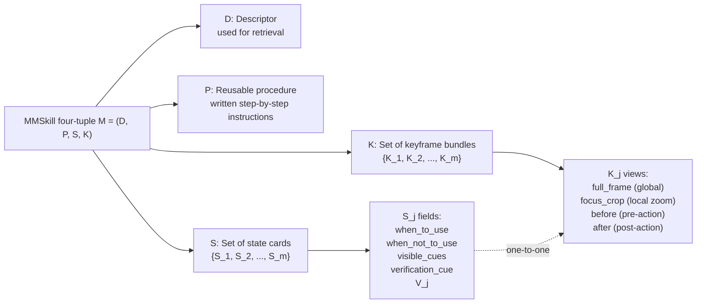
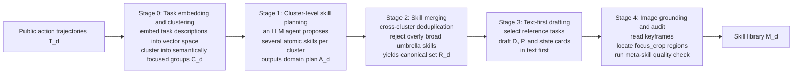
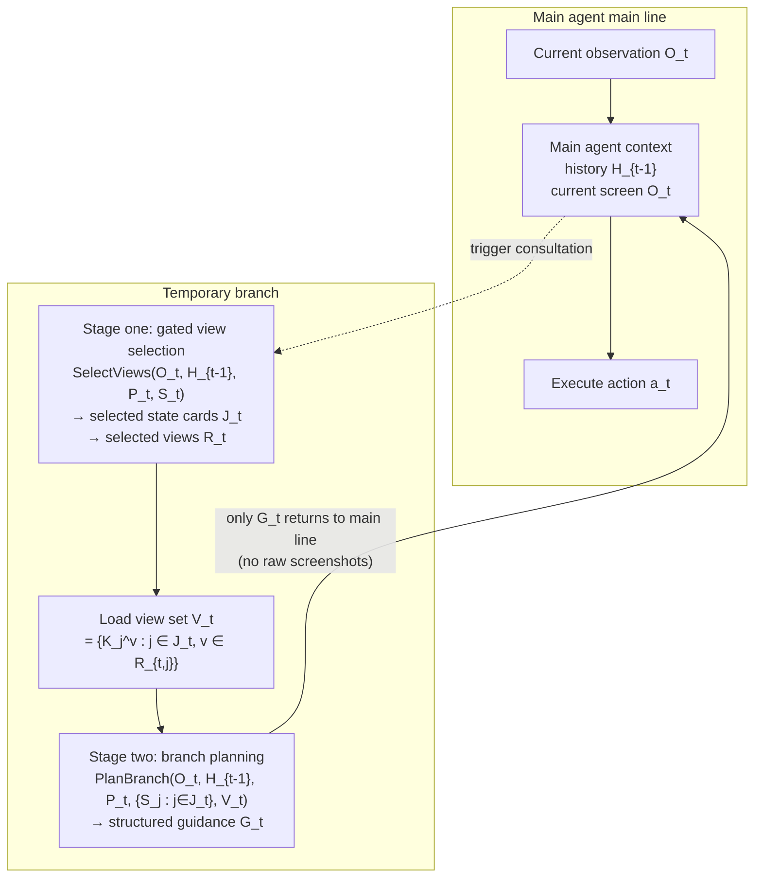
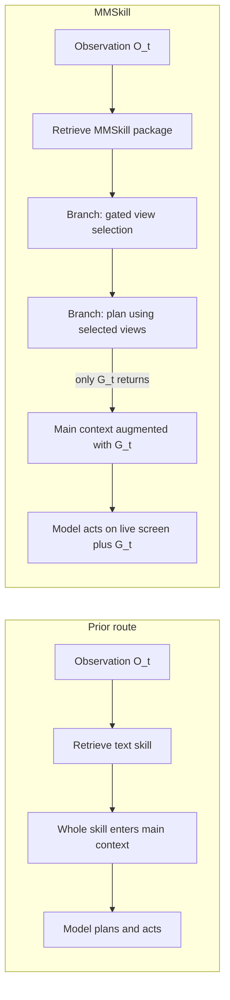

# MMSkills: Multimodal Skills for General Visual Agents

> **Original title**: MMSkills: Towards Multimodal Skills for General Visual Agents
> **Authors**: Kangning Zhang, Shuai Shao, Qingyao Li, Jianghao Lin, Lingyue Fu, Shijian Wang, Wenxiang Jiao, Yuan Lu, Weiwen Liu, Weinan Zhang, Yong Yu
> **Affiliation**: Not given on the public page
> **Year**: 2026 (arxiv ID 2605.13527)
> **Category**: cs.AI
> **Link**: https://arxiv.org/abs/2605.13527
> **Close-read date**: 2026-05-18

## Reading guide

### Where this paper sits in the field

Over the past two to three years, getting large models to "act on their own" has gradually emerged as a major research direction. The earliest wave of work concentrated on textual environments, for example invoking a browser search interface, calling external APIs, or writing a snippet of script to compute something. Researchers then shifted attention toward scenarios that hew closer to how a real human uses a computer: getting a model to behave like a person looking at screenshots, deciding where to move the mouse next, which keys to press, and when the task is finished. Systems of this kind are collectively referred to as visual agents, and the standard benchmarks for evaluating them include **OSWorld** (a suite of Ubuntu desktop tasks), **macOSWorld** (a suite of macOS desktop tasks), the Minecraft subset of **VAB** (Visual Agent Bench), and LMGame-Bench, which is built from game levels. The throughline of this research is clear: the visual understanding capability of the models themselves keeps climbing, yet relying on model priors alone is far from sufficient, and the engineering still requires bolting on procedural knowledge to help the model break tasks down properly and recognize states correctly.

The most common way to externalize procedural knowledge is called a skill library. Each entry describes a reusable operating procedure, and when a new task arrives the model first retrieves a suitable skill from the library and then executes against it. This route works when an **LLM** (Large Language Model) handles pure-text tasks, because the whole interaction takes place in text and writing the procedure out in words is itself enough to guide execution. Once the setting shifts to visual agents, however, pure-text skills begin to chafe against the environment. The question this paper, MMSkills, sets out to answer is what a skill library should look like in the visual era. Its position can be understood as a thoroughgoing rewrite, oriented toward vision, of the "external skill memory" paradigm that the text-agent line of work has validated over the past several years.

### What you will be able to answer

After finishing this note, you should be able to answer the following five things. First, why directly porting an off-the-shelf text skill library onto a visual agent fails to work well. Second, what each component of the **MMSkill** four-tuple M = (D, P, S, K) is responsible for, and what is lost when any one of them is missing. Third, how the authors automatically distill this structured skill from publicly available action trajectories, and what each of the five stages does. Fourth, why one cannot simply stuff the entire skill package into the context at inference time, and how the "branch loading" mechanism sidesteps that problem. Fifth, on the experimental side, how large a lift MMSkills delivers across four benchmarks including **OSWorld**, and why smaller models benefit more.

### Prerequisites

The note assumes a reader familiar with the basic playbook for LLM inference (prompting, context window, tool calls), familiar in broad engineering terms with how a vision-language model accepts an image plus text as input, and conceptually acquainted with the overall shape of an agent system (observe, think, act, feedback). It does not assume the reader has done GUI automation or has read papers on benchmarks such as OSWorld or VAB; relevant background is filled in at the appropriate points. Nor does it assume familiarity with the "external memory" research line beyond RAG; the skill library branch will be introduced from first principles.

### Glossary

| Acronym | Full form | Explanation |
|---|---|---|
| **MMSkill** | MultiModal Skill | The multimodal skill package proposed in this paper, formalized as a four-tuple M = (D, P, S, K) |
| **LLM** | Large Language Model | Refers in this paper both to the underlying large model and to the call patterns used to drive the generator and the planner |
| **VLM** | Vision-Language Model | A model that takes image-plus-text input and produces text output |
| **GUI** | Graphical User Interface | Corresponds to the desktop and browser interaction scenarios in this paper |
| **OSWorld** | OSWorld benchmark | Ubuntu desktop agent benchmark, containing 360 tasks |
| **macOSWorld** | macOSWorld benchmark | macOS desktop agent benchmark, containing 143 tasks |
| **VAB** | Visual Agent Bench | A comprehensive visual agent benchmark; this paper uses its Minecraft subset |
| **D** | Descriptor | The descriptor field in the MMSkill four-tuple, used for retrieval |
| **P** | Procedure | The reusable procedure in the MMSkill four-tuple, a step-by-step instruction written in natural language |
| **S** | State cards | The set of state cards in the MMSkill four-tuple, containing multiple state cards |
| **K** | Keyframe bundles | The set of keyframe bundles in the MMSkill four-tuple, in one-to-one correspondence with the state cards |
| **G_t** | Guidance at step t | The structured guidance returned to the main agent by the branch planner at step t during inference |
| **O_t** | Observation at step t | The current screen the main agent sees at step t |
| **H_{t-1}** | History up to t-1 | The history of actions and observations prior to step t |
| **focus_crop** | (view type) | A view type within a keyframe bundle that crops and magnifies the region around the target widget |
| **full_frame** | (view type) | A view type within a keyframe bundle that preserves the full screen for global context |
| **before / after** | (view type) | Optional view types within a keyframe bundle, recording the screen respectively before and after a particular action is triggered |

## I. The Problem

### Why this problem matters

Begin by grounding the scenario in a concrete product. Imagine a desktop assistant running inside a company intranet, tasked with "update the figures in yesterday's quarterly report to match the version I have from this morning." For a human, the task is not hard: open the file manager, locate the corresponding spreadsheet, place the cursor in the relevant cells, type the new numbers, save. For a visual agent, what it actually faces is a sequence of screenshots, and at every step it has to recognize from the picture which step of the procedure it is on, which button is the right one to press, and whether the previous action took effect. The model has likely seen similar tasks during pretraining, but the specific software in a production environment, along with its fonts and the positions of its widgets, will differ from what was seen during training, and the model's own priors are unlikely to be enough to get it right every time. This is the most everyday version of the "why we need external skills" pain point: the model already understands the procedure in broad strokes, but it still needs a trustworthy, retrievable procedural reference tailored to the application at hand.

Three mainstream routes have emerged in this direction over the past few years. The first writes procedural knowledge as natural-language prompts, retrieves them via RAG, and pastes them into the context so the model can follow along. The second writes the knowledge as executable scripts or code snippets, which the model inserts into its tool-call chain when needed. The third learns a policy from demonstration data, in effect compressing procedural knowledge into network weights. Each route has its share of successes on pure-text tasks, but all three share a common stumbling block when transplanted to visual agents: they describe only what should be done, almost never what the screen looks like when it should be done, and even less what the screen will look like after it is done. This is precisely the layer where visual tasks differ most from textual ones. Local state on the screen is not a set of discrete labels but a continuous patch of pixels, and judging whether an action took effect requires seeing whether a button's color changed, whether a dialog popped up, whether a progress bar advanced. Text-only skills are mute at this layer.

The reason failing to fix this keeps causing problems is that many of the failure modes of visual agents are about misidentifying state rather than not knowing what to do. The model may know perfectly well that "saving a file means Cmd+S or clicking the save button," yet on the screen it is uncertain whether the file is currently in a "modified and saveable" state, and as a result it either hesitates to press or presses in the wrong place. Put differently, the bottleneck where visual agents get stuck is often state recognition, which happens to be precisely where a text-only skill library cannot help. What MMSkills sets out to do is move state recognition itself into the reusable body of knowledge.

### Prior routes vs the new route

The diagram below lays out the relationship between the three prior routes and MMSkills, as a setup for the method section that follows.

```mermaid
flowchart TB
    A[Externalizing procedural knowledge] --> B1[Text-prompt skills]
    A --> B2[Executable-script skills]
    A --> B3[End-to-end learned policy]
    A --> C[MMSkills: multimodal skill package]

    B1 -- describes only "what to do" --> X[Visual agent stuck on<br/>"cannot recognize current state"]
    B2 -- describes only "what to execute" --> X
    B3 -- knowledge baked into weights,<br/>hard to retrieve, hard to edit --> X

    C -- descriptor + procedure + state cards + keyframes --> Y[Incorporates "what the screen looks like"<br/>into the skill itself]
```

### Three concrete technical questions

Translating the high-level motivation above into the questions the paper actually answers, the matter splits into three concrete pieces. The first is the representation question: what should a piece of multimodal procedural knowledge look like, which fields should it contain, and which specific capability is lost if a given field is missing. The second is the generation question: can skills be distilled automatically from existing public action trajectories rather than written by hand, and how can the distillation process avoid two well-known traps, the first being to keep demonstrations as skills, which inflates the library and overfits, the second being to produce a heap of "save file" or "open file" umbrella skills so broad that anything can be slotted under them. The third is the usage question: at inference time, how to put multimodal evidence into the model's hands without blowing out the context, and without letting reference screenshots anchor the model's attention away from the live screen.

Each of the three has nontrivial design surface, and the three are also coupled. Make the representation too complex and the generator fails to converge. Compress too aggressively during generation and there is not enough evidence to draw on during usage. Stuff everything into the context at usage time and the gains from representation and generation are wiped out. MMSkills proposes one design for each of the three: the four-tuple structure, the five-stage generation pipeline, and the two-stage branch loading.

## II. Method

### The structure of a multimodal skill package

Begin with the representation. Each MMSkill is written as a four-tuple:

```
M = (D, P, S, K)
```

D is the descriptor, the "nameplate" of a skill, used to be found at retrieval time. It is a short piece of text that states what the skill does and which class of tasks it applies to. P is the reusable procedure, a written manual of operational steps. Taken together these two correspond to the form of prior text-only skills. What MMSkills genuinely adds are the latter two fields.

S is the set of runtime state cards. Since the concept of a state card appears here for the first time in the literature, some scaffolding is in order. The problem it is meant to solve is that a skill, while being executed, typically passes through several semantically distinct phases, for example "file not yet saved," "save dialog popped up," "file successfully saved," and each phase calls for different judgments. State cards make these phases explicit one by one, with each card corresponding to a phase and recording the logic appropriate for that phase. The internal fields of each state card are formalized in the paper as:

```
S_j = (when_to_use_j, when_not_to_use_j,
       visible_cues_j, verification_cue_j, V_j)
```

The first field states "under what condition this skill should be used," the second states "under what condition, even if it looks applicable, it should not be used," which is there to block spurious triggers. The third lists "visible cues that confirm this state." The fourth lists "cues that confirm the action took effect." The fifth, V_j, enumerates the views available under this state card. Put differently, a state card is an on-scene identification card written for the visual agent, telling it when to engage the skill, when to stop, and where to look to verify the outcome.

K is the set of keyframe bundles, in one-to-one correspondence with the state cards. The notion of a keyframe bundle also requires a brief setup: it is essentially the visual evidence attached to a state card, so that the text descriptions above (visible_cues, verification_cue) are not merely abstract claims but are anchored by actual screenshots. Each keyframe bundle contains several views of the same moment on screen, and the paper defines four view types. **full_frame** preserves the entire screen and lets the model grasp global context. **focus_crop** zooms in on the target widget so the model can see fine detail. **before** and **after** are optional, showing the screen before and after a particular action respectively, in order to expose the state transition itself.

The diagram below sketches the four-tuple structure, emphasizing the one-to-one correspondence between state cards and keyframe bundles.



The reason for this design is that state cards and keyframe bundles are functionally complementary. State cards are responsible for "telling the agent when to engage, where to look, and how to verify," which is direction at the textual layer. Keyframe bundles are responsible for "giving those 'where to look' descriptions actual pictures to back them up," which is anchoring at the visual layer. Put differently, without state cards the model does not know when to engage, and the multimodal evidence has no target to attach to. Without keyframe bundles the "visible cues" in the state cards are nothing more than dry prose, and the model cannot match them against the current screen. The two together form the smallest unit of multimodal procedural knowledge.

### The five-stage skill generation pipeline

Now turn to generation. The objective of MMSkills is to avoid having humans write skills, and to instead mine skills automatically from publicly available action trajectories. By "publicly available action trajectories" the paper means existing open-source datasets in the research community, which store recordings and logs of either real users or existing agents performing tasks across various applications. Each trajectory typically includes a task description, a sequence of screenshots, a sequence of actions, and sometimes metadata. The problem is that such trajectories are demonstrations, not skills. Demonstrations contain a large amount of detail incidental to the specific task, and a pipeline is needed to refine them into reusable, structured knowledge.

The full generation pipeline consists of five stages, all driven by LLM calls.



Stage 0 clusters the heap of trajectories by task semantics. The task description of each trajectory, along with several pieces of metadata, is embedded into a vector space, and a clustering algorithm groups them, producing the cluster set C_d. The point of this step is to put semantically similar trajectories together so that the subsequent skill extraction has a focused context, for example placing "book a flight in the browser" and "search for hotels in the browser" in the same cluster and clearly separating them from "filter rows in a spreadsheet."

Stage 1 is cluster-level skill planning. Each cluster is handed to an LLM agent, which proposes a number of "atomic skills" and writes out each skill's boundary, completion condition, and the set of task IDs it covers. The output is a domain plan table A_d. The key constraint of this step is the word "atomic": a skill should correspond to one semantically self-contained procedure, and should not bundle "open the file" together with "modify and save."

Stage 2 is skill merging. Different clusters inevitably yield duplicate or near-duplicate skills, for example "save the current file" may be proposed in both the file-manager and editor clusters. The merging stage does two things: cross-cluster deduplication, which merges semantically redundant skills into one, and rejection of overly broad umbrella skills, for example refusing to keep an entry as catch-all as "use the browser." The result is a refined canonical set of skill specifications R_d.

Stage 3 is text-first drafting. This stage deliberately does not look at images. The generator first selects a few reference tasks for each candidate skill, then writes the descriptor D, the reusable procedure P, and the textual portion of the state cards in words first. The reason this stage exists is that the logical skeleton of the textual portion should not be pulled around by the incidental details of any particular screenshot; writing the logic out cleanly first, and only then validating and anchoring with images, is less prone to overfitting to a single demonstration.

Stage 4 is where the image layer finally enters. The generator goes back to the keyframes selected in Stage 3, locates the specific UI region corresponding to each focus_crop, constructs the multi-view keyframe bundle, and binds it to the corresponding state card. A "meta-skill audit" follows, which uses a set of pre-written reusable scripts to check each skill package for structural and consistency issues, for example whether the number of state cards is reasonable, whether every state card has a corresponding keyframe bundle, and whether focus_crop actually falls within the region described by "visible cues." Skill packages that fail the audit are returned for correction or discarded outright.

The central premise of the pipeline is, **not to store raw demonstrations as skills themselves**, but to compress them into compact visual procedural knowledge. There are two reasons. First, the incidental idiosyncrasies in demonstration data (for example a particular desktop wallpaper in one frame) will contaminate the skill. Second, storing the entire demonstration in the library lets the size of a single skill spin out of control, and both retrieval and context occupancy become impractical.

### Branch loading at inference time

Finally, usage. The previous two pieces resolved what skills look like and where they come from. The last piece must resolve how skills are used. The core constraint here is that a skill package contains a great deal of visual content, in particular the several screenshots in the keyframe bundles, and stuffing the entire package directly into the main agent's context is not feasible. The paper decomposes this trouble into three layers. First, the context pressure spikes: a handful of high-resolution screenshots is enough to eat up a large portion of the context window. Second, when reference images and the current screen appear simultaneously in the context, it is not easy for the model to visually distinguish "this is a reference" from "that is the live scene," and it is prone to confusing which image to look at. Third, what the paper calls "visual anchoring": once the model has seen the reference image, it tends to plan actions around how things appear in the reference, and even when the live screen has drifted considerably from the reference, the plan continues to hug the reference, as if the reference image had anchored the model's attention.

The solution MMSkills puts forward is called the "branch-loaded multimodal skills agent." The mechanism moves the skill consultation out of the main agent's main line, into a temporary branch, and what the branch returns to the main line is not images but a distilled piece of structured guidance.



Branch loading proceeds in two stages. The first is gated view selection: inside the temporary branch, based on the current observation O_t, the history H_{t-1}, the skill procedure P_t, and the set of state cards S_t, decide which state cards J_t and which views R_t to load. The selected set of state cards and views V_t is formalized as:

```
(J_t, R_t) = SelectViews(O_t, H_{t-1}, P_t, S_t)
V_t = {K_j^v : j ∈ J_t, v ∈ R_{t,j}}
```

Unselected images never enter the branch's context at all, let alone the main agent's context. Put differently, the gate is "before letting the model look at images, first use text to judge which images are worth looking at." The step itself is not free, in that it requires an extra LLM call, but it caps the cost of downstream image IO within a controllable range.

The second stage is branch planning: the temporary branch takes the selected state cards together with the image set V_t, and outputs a structured piece of guidance G_t:

```
G_t = (applicable_t, subgoal_t, plan_t, do_not_do_t, verify_t)
```

The first field states "whether this skill is currently applicable" (boolean). The second states "the subgoal that should be advanced now." The third states "the concrete plan for reaching the subgoal." The fourth states "explicit things not to do," to prevent spuriously triggered sub-actions from being executed. The fifth states "how to verify that completion has occurred." Note that G_t is a purely textual structure, no longer carrying raw screenshots, and no longer carrying the lengthy preamble of the state cards. When this structured guidance returns to the main agent, what the main agent sees is decision support rather than a stack of reference images. The "visual contest between reference and live scene" is thereby severed at the branch boundary. Executable actions are still produced by the main agent against the current screen O_t, and the plan does not drift because of a reference image.

### Differences between the text-skill flow and the MMSkill flow

Drawing the traditional text-skill flow alongside the MMSkill branch flow side by side helps make it clear exactly where the new mechanism intervenes.



Why this design closes the pain points raised in the Problem section is as follows. State cards address the question of "when should it be used." Keyframe bundles address the question of "does the screen look right." Branch loading addresses the question of "keeping the context from being saturated by reference images, and keeping planning from being steered by them." The three each handle their own segment, and the chain forms a closed loop from "recognize state" to "execute action."

## III. Experiments

### Evaluation setup

Evaluation lands on four visual agent benchmarks, each corresponding to a different shape of visual task.

| Benchmark | Platform | Task scale | Task types |
|---|---|---|---|
| OSWorld | Ubuntu desktop | 360 tasks | Browser, LibreOffice, creative tools, system settings, code editor, and others |
| macOSWorld | macOS desktop | 143 tasks | File management, media, productivity, system tasks |
| VAB-Minecraft | Minecraft game | Minecraft subset of VAB | Item acquisition, recipe reasoning, tool use |
| Super Mario Bros | LMGame-Bench | Level clearing | Platformer-style game operations |

The model gradient simultaneously covers frontier large models and smaller models. On the frontier side: **Gemini 3.1 Pro**, **Gemini 3 Flash**, **Qwen3-VL-235B**, **Kimi-K2.6**. On the smaller side: **GLM-5V** and **Qwen3-VL-8B-Instruct**. The point of arranging this gradient is to observe one specific question: how much room there is for externally supplied procedural knowledge to fill in across underlying models of different capability levels.

### Main result: relative gains on OSWorld

OSWorld is the principal evaluation arena. The success-rate comparison reported in the paper is as follows (the baseline is the pure model with no skill attached, and MMSkills denotes the version with the MMSkill library attached).

| Model | baseline | + MMSkills | Gain |
|---|---|---|---|
| Gemini 3.1 Pro | 44.08% | 50.11% | +6.03 |
| Gemini 3 Flash | 36.65% | 47.97% | +11.32 |
| Kimi-K2.6 | 34.98% | 46.59% | +11.61 |
| GLM-5V | 28.71% | 38.51% | +9.80 |
| Qwen3-VL-235B | 21.34% | 39.17% | +17.83 |
| Qwen3-VL-8B-Instruct | 10.78% | 25.40% | +14.62 |

One clean trend emerges from this table: the weaker the underlying model's relative capability, the larger the relative gain from attaching skills. The paper also includes a control group that swaps in a "text-only-portion" version of the same skills, and it does bring some improvement, though its magnitude and stability fall short of the full multimodal version. This aligns with the authors' contention that "external multimodal procedural knowledge complements the model's built-in priors": the weaker the model's priors, the more room external procedural knowledge has to fill in, while a model whose priors are already strong can still extract marginal gains from "visually anchored evidence."

### Main result: the other three benchmarks

The numbers on the other three benchmarks point in the same direction.

| Benchmark | Model | baseline | + MMSkills | Gain |
|---|---|---|---|---|
| macOSWorld | Gemini 3 Flash | 55.94% | 65.73% | +9.79 |
| macOSWorld | GLM-5V | 34.97% | 51.75% | +16.78 |
| VAB-Minecraft (success rate) | Gemini 3 Flash | 67.24% | 73.28% | +6.04 |
| VAB-Minecraft (success rate) | Qwen3-VL-235B | 52.59% | 62.07% | +9.48 |
| VAB-Minecraft (composite score) | Gemini 3 Flash | 0.7462 | 0.7884 | +0.0422 |
| Super Mario Bros (performance) | Gemini 3 Flash | 411.00 | 624.00 | +213 |
| Super Mario Bros (reward) | Gemini 3 Flash | 766.67 | 1081.33 | +314.66 |

The task shapes vary considerably across GUI, Minecraft, and Super Mario Bros, yet the directional benefit of MMSkills holds across all four benchmarks. The paper uses this point to support the claim that "the MMSkill representation is universal for visual agents."

### Ablations

The ablations in Figure 3 split into two groups, each addressing one thing.

The first group ablates components inside the skill package. Removing the state cards markedly degrades the agent's ability to judge "whether the current state is one in which the skill applies," because state cards carry the state-recognition segment. Removing the keyframe images deprives the agent of the corroborating visual evidence for "whether the screen looks right," and operational precision drops. The two omissions point to different failure modes and are not substitutable for one another. This result directly answers the design motivation in the method section for "why state cards and keyframe bundles must be bound together."

The second group ablates the inference mechanism. The "direct-full loading" approach, which pours the entire skill package into the main agent's context at once, actually performs worse than the no-MMSkills baseline, evidence that "stuffing all the images in" is not a good idea. The variant that does only view selection without branch planning, in which the gated selection feeds directly to the main agent, comes next. The full two-stage branch loading performs best. This group of results yields one engineering takeaway: in an LLM-based agent, letting additional information enter the main context is itself a cost, and evidence filtering plus form compression are necessary steps, not optional polish.

### Behavior-side statistics

Beyond success rate, the paper also reports a set of "behavior-side" statistics that surface the actual changes MMSkills produces in the agent's behavior distribution.

The first is the skill invocation rate (Table 3). This refers to the proportion of cases, among those in which a skill is applicable, where the model actually invokes a skill. On OSWorld, Gemini 3 Flash's invocation rate rises from 41.11% under text-only skills to 62.50% under MMSkills, and Qwen3-VL-235B rises from 37.50% to 65.28%. Put differently, after carrying visual evidence, the model is better able to recognize "this is a state where invoking a skill is appropriate," and is therefore more willing to invoke. This reflects the "recognizability" property of the MMSkill representation.

The second is trajectory efficiency. Gemini 3 Flash's average completion length drops from 13.11 to 11.86 (1.25 steps shorter); Qwen3-VL-235B drops from 15.22 to 9.87 (5.35 steps shorter). The counterintuitive aspect is that MMSkills introduces an additional consultation call, yet the explicit action steps over the full trajectory become fewer. In other words, the efficiency gains from consultation outweigh the consultation overhead. The paper notes a contrast at this point: swapping in a text-only version of the same skills pushes trajectory length up to 15.64, meaning that text-only skills are a net negative contribution in this setting, most likely because they lead the model into more trial and backtracking.

The third is the migration of the action distribution (Figure 4). For Qwen3-VL-235B on OSWorld, the share of clicks drops from 75.8% to 63.7%, while keyboard actions and "DONE" (task completion confirmation) rise correspondingly; the share of consecutive repeats of the same action drops from 21.8% to 6.2%. It reads as a transition from "trying things at random" to "look at the screen carefully before acting": fewer blind clicks, more confirmation-type actions.

### View selection statistics

The paper also reports the view distribution at the view-selection stage. On OSWorld, across 352 view selections, Gemini 3 Flash chose **focus_crop** 241 times, **full_frame** 79 times, and **before** and **after** were used the least. This empirical regularity is useful for practical deployment: if resources are tight, prioritize getting focus_crop right; full_frame is needed only when global context matters (for example switching across multiple windows); before/after are mostly for process-comparison or completion-comparison evidence, and are used the least frequently. In other words, **focus_crop is the most important view type in MMSkill practice**.

## IV. Limitations

### The ones the authors flagged

The authors themselves flag four. First, the coverage of the skill library is capped by the coverage of the source trajectories: a domain that public data has not touched is one the generator cannot produce skills for, and extending coverage means continuing to feed in new trajectories. Second, skill generation and visual grounding both depend on LLM calls, and a mislabel or a misplaced focus region propagates downstream as-is, with no external arbitration mechanism. Third, branch loading itself has an inference cost: each consultation incurs two extra LLM calls for gating and planning, increasing both call count and latency, and the paper does not report end-to-end latency numbers. Fourth, applying the approach to safety-sensitive scenarios (for example financial operations or medical assistance) requires stronger verification and online skill-repair mechanisms, and the current version does not provide that layer.

### What you can read off but the authors did not state outright

First, the evaluation scope falls within GUI operations and lightweight games, and there is no data to support whether the approach transfers to real-world visual tasks with more complex scenes and trajectories. Typical boundary cases include robotic manipulation (continuous action space, partially observable state), driver-assistance (strong real-time and safety constraints), and medical-imaging decision support (task granularity quite different from GUI operations). Whether the paper's design still applies in these regimes would, at minimum, need to be discussed afresh.

Second, the maintainability of the skill library. The paper presents a library built once-off, but GUI applications themselves evolve: UI redesigns, OS updates, widget restyling all conspire to make old keyframes unrecognizable in the new interface, and the "visible cues" in the state cards become invalid under repaints. This is an old chestnut in GUI automation, and MMSkills does not lay out an explicit evolution or version-management plan for the skill library.

Third, the degree of coupling to the underlying LLM. Both the generator and the gated planner depend on the model's own image-plus-text understanding capability, and swapping the substrate (for example from Gemini to an entirely different open-source VLM) may require the whole stack to be re-evaluated. By implication, the "cross-substrate portability" of the skill library needs to be validated separately.

Fourth, although the relative gains look large on smaller models, the starting points are also low. Qwen3-VL-8B on OSWorld goes from 10.78% to 25.40%, which means the absolute success rate is still below 30%, far from a state where one would confidently hand work over to it. Put differently, MMSkills moves the usability of small models one step closer, but does not bring them anywhere near a production-grade threshold.

Fifth, the engineering experience around state-card count is thin in the paper. How many state cards per skill is appropriate? Is there an inflection point beyond which "too many state cards drag down branch gating"? The paper does not run a systematic sweep; it only implicitly constrains "state-card count should be reasonable" at the audit stage. This remains an open question for teams deploying the approach in practice.

## One Sentence

Extend skills from pure text into a multimodal package of procedure plus state cards plus multi-view keyframes, and then use branch loading to sever the visual anchoring that reference images impose on the live screen.
