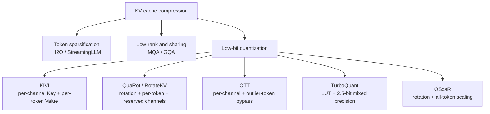
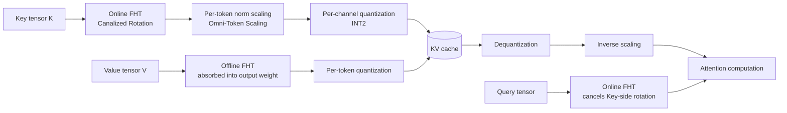
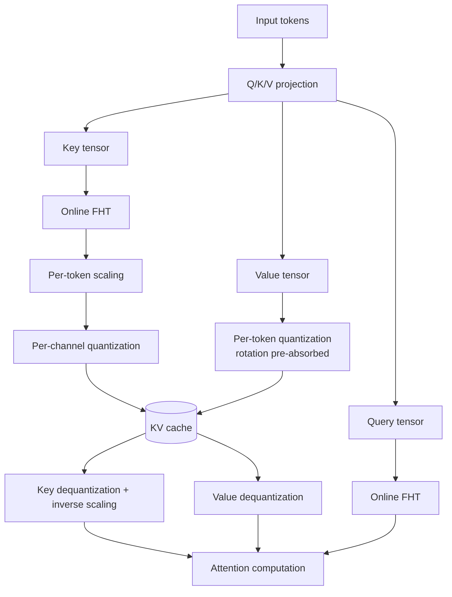

# OScaR: The Occam's Razor for Extreme KV Cache Quantization in LLMs and Beyond

> **Original title**: OScaR: The Occam's Razor for Extreme KV Cache Quantization in LLMs and Beyond
> **Authors**: Zunhai Su, Rui Yang, Chao Zhang, Yaxiu Liu, Yifan Zhang, Wei Wu, Jing Xiong, Dayou Du, Xialie Zhuang, Yulei Qian, Yuchen Xie, Yik-Chung Wu, Hongxia Yang, Ngai Wong
> **Institutions**: Tsinghua University, Meituan LongCat Team, The University of Hong Kong, The University of Edinburgh, UCAS, The Hong Kong Polytechnic University
> **Year**: 2026 (arXiv 2605.19660, submitted May 19)
> **Subject**: cs.LG (Machine Learning)
> **Link**: https://arxiv.org/abs/2605.19660
> **Code**: https://github.com/ZunhaiSu/OScaR-KV-Quant
> **Reading date**: 2026-05-21

## Reading Notes

**Where this paper sits in the field.** The heaviest memory cost during inference for modern large language models comes from the Key-Value cache. Every decoding step keeps Key and Value tensors for all previous tokens resident in GPU memory, and the cost scales linearly with both sequence length and batch size. Three lines of work have evolved around the question of how to shrink this cache. The first line is token-level sparsification, exemplified by H2O, StreamingLLM, and SnapKV, which keeps only those tokens that contribute meaningfully to attention. The second line is low-rank or cross-layer sharing of KV, including the path that MQA and GQA opened up by collapsing head dimensions. The third line is direct low-bit quantization, compressing FP16 tensors all the way down to INT8, INT4, or INT2. OScaR belongs to the third line and aims at lossless INT2. Prominent predecessors here include KIVI, KVQuant, QuaRot, RotateKV, OTT, and the recent TurboQuant. OScaR can be positioned as follows: it builds on the KIVI framework of per-channel Key plus per-token Value, identifies the underlying reason per-channel quantization collapses at extreme low bits, and offers a clean, training-free solution that requires no auxiliary residual path.

**What you should be able to answer afterwards.** After reading these notes, the reader should be able to answer the following questions. First, why is per-channel the natural granularity for Key while per-token suits Value. Second, what exactly is Token Norm Imbalance (TNI), and why does it cause per-channel quantization to break down at INT2. Third, why must OScaR bundle Hadamard rotation with token-wise scaling rather than using either alone, and what side effect would direct scaling introduce. Fourth, compared to elaborate schemes such as TurboQuant that depend on residual paths, what does OScaR get right on both accuracy and efficiency. Fifth, on the engineering side, how are FHT, scaling, quantization, dequantization, and attention computation fused into three CUDA kernels.

**Prerequisites.** This note assumes familiarity with the Transformer architecture and basic intuition that self-attention computes from Query, Key, and Value tensors. The reader is expected to know PyTorch tensor manipulation and to understand the difference between FP16/BF16 and INT8/INT4 numerical formats. No background in quantization research is required, but the reader should know that per-channel and per-token quantization differ in granularity: the former shares scaling parameters across all tokens in a channel, while the latter shares across all channels in a token. Familiarity with KIVI or QuaRot is not required; the relevant background is introduced in Section I.

**Glossary of abbreviations**:

- **KV cache**: Key-Value cache, the Key and Value tensors cached during attention
- **TNI**: Token Norm Imbalance, the core problem identified by this paper
- **OScaR**: Omni-Scaled Canalized Rotation, the proposed method
- **FHT**: Fast Hadamard Transform, computational cost O(d log d)
- **X-LLM**: a collective term for text-only, multi-modal, and omni-modal LLMs
- **NIAH**: Needle-in-a-Haystack, a long-context retrieval benchmark
- **MMAU-Pro**: Multi-Modal Audio Understanding Pro, the omni-modal benchmark
- **TurboQuant**: the most important comparison baseline, a LUT-based 2.5-bit quantization framework
- **INT2**: 2-bit integer quantization, representing each value with only four discrete levels

## Why This Problem Is Worth Solving

To appreciate why anyone would attempt INT2 KV cache quantization, consider what happens without it. A Qwen3-8B inference service serving 128K context length easily consumes tens of gigabytes per card, and even a modest batch size hits the 96GB limit of an H20. The deployment bottleneck for long-context and multi-modal inference is therefore neither FLOPs nor weight memory, but the KV cache, which scales as sequence length times batch size.

Past work pursued this problem along three directions. The first is token-level sparsification, as in H2O and StreamingLLM, which retains only tokens with high attention contribution. This approach is effective but tends to drop critical evidence in long-context retrieval tasks such as NIAH. The second is low-rank decomposition or cross-layer sharing of KV, where MQA and GQA already collapsed redundancy along the head axis, and further work decomposes the full Key matrix into low-rank components. This line still struggles at extreme context lengths. The third is low-bit quantization. KIVI provided the canonical two-stage recipe: per-channel quantization for Key and per-token quantization for Value. This division reflects the fact that Key tensors exhibit channel-wise outliers, and per-channel quantization is naturally suited to bound these by estimating scaling parameters independently per channel, preventing one huge value from stretching the dynamic range of the entire block.

Where the old recipe breaks. KIVI works essentially without loss at INT4, but degrades noticeably at INT2. A closer inspection reveals that per-channel quantization does not eliminate all outliers; it only addresses the channel-axis ones, while differences in token-axis norms remain untouched. Within any long sequence, a small subset of tokens has L2 norms one or two orders of magnitude below their neighbors, and these correlate strongly with attention sinks. In other words, per-channel quantization flattens channel-wise outliers while leaving sequence-wise outliers in place, and at extreme bit-widths the latter inflict equal damage. The contribution of OScaR is to name this second pattern (TNI), prove theoretically that it is the dominant cause of accuracy degradation at INT2, and provide a clean remedy.

## I. The Problem

The specific problem OScaR addresses can be stated as follows: within each Key tensor block, tokens exhibit substantially divergent L2 norms (TNI). When per-channel quantization is required to share scaling parameters Δ and zero-point z across these tokens, the quantization range is stretched by the largest-norm token, leaving fewer effective bits for normal tokens and inflating reconstruction error. At INT2, where each value has only four discrete levels, this is fatal. The paper begins by establishing TNI empirically and theoretically.

**Empirical observation.** Analyzing Llama-2-7B and other models reveals that every attention state contains a sparse but consistent subset of tokens with L2 norms substantially lower than the mean of others. These low-norm tokens align strongly with attention sink tokens, the customary outlets that absorb excess attention. The phenomenon is not incidental but reproducible across nearly all models on long sequences.

**Theoretical derivation.** The appendix presents a concise error bound. For a per-channel quantization block containing tokens with norms {n₁, n₂, …, nₘ}, each channel's step size Δⱼ is determined by the overall range. It can be shown that the reconstruction error is proportional to max(nᵢ) − min(nᵢ). Whenever the block's token-norm range is large, every channel is forced into a coarse step, and the precision of all tokens within is degraded.

**Why prior approaches fall short.** Comparing past lines side by side clarifies OScaR's positioning. KIVI bounded channel-axis outliers via per-channel quantization but left the sequence axis untouched. QuaRot and RotateKV introduced Hadamard rotation to further spread channel-axis outliers across dimensions, but their quantization granularity remained per-token, and to handle sink tokens they reserved a small set of high-precision tokens as exceptions. OTT (Outlier Token Tracing) takes a more direct approach: every token is checked for outlier status, and likely outliers are routed through a high-precision path. This is acceptable engineering but the residual path complicates the pipeline and obstructs kernel fusion. TurboQuant extends this line further with LUTs and a mixed-precision 2.5-bit scheme, achieving the highest accuracy at the cost of severe implementation complexity. OScaR observes that all these schemes acknowledge outliers and use increasingly intricate methods to isolate them; if token norms could be equalized at the numerical level from the start, the residual paths could be removed entirely.

## II. Method

OScaR consists of two operations applied in sequence: first Canalized Rotation, then Omni-Token Scaling. Neither operation works in isolation; both are mandatory. This section presents each component separately and then explains why they must be paired.

**Notation.** Let L be the sequence length, H the number of attention heads, and dₕ the per-head dimension. The Key tensor is K ∈ ℝ^{L×H×dₕ}, and the Value tensor is V ∈ ℝ^{L×H×dₕ}. Let kᵢ ∈ ℝ^{H·dₕ} denote the Key vector of the i-th token, with L2 norm nᵢ = ‖kᵢ‖₂. Per-channel quantization averages along the L axis (all tokens in a channel share Δⱼ and zⱼ), while per-token quantization averages along the dₕ axis (all channels in a token share parameters).

### Step One: Canalized Rotation

**What it solves.** Direct per-token scaling without preprocessing, that is, simply normalizing every token's L2 norm to a common level, triggers a phenomenon the paper terms the **Scaling-Induced Outlier Artifact**. Low-norm sink tokens forcibly scaled up to match normal tokens were previously near zero in most channels. When scaled, these channels suddenly contain values they never had before, violating the per-channel assumption of stable within-channel distributions.

**How it works.** Before token-wise scaling, apply a Hadamard transform H to the Key tensor: K' = K · H. Hadamard matrices have entries ±1/√d and are orthogonal transforms, distributing each token's energy uniformly across the d dimension. Large values originally concentrated in a few channels are spread evenly across all dimensions, and per-channel ranges become more uniform. The paper calls this Canalized Rotation, where "canalized" connotes flattening channel-wise differences into a single shared groove.

**Why Hadamard rather than another orthogonal matrix.** Hadamard matrices admit the Fast Hadamard Transform, reducing the cost to O(d log d), far below the O(d²) of generic orthogonal multiplication. Any rotation applied online during decoding must be cheap; otherwise the time savings from reduced memory traffic are paid back. The implementation reuses the HadaCore kernel.

**Query-side symmetric processing.** Since Key is rotated by FHT, the attention product Q · Kᵀ requires a corresponding FHT on Query so that the two rotations cancel. The paper calls this online FHT, meaning it occurs during every decoding step and cannot be precomputed. Value follows a different strategy: an offline Hadamard transform is applied once to both the Value cache and the downstream output projection matrix, absorbing the rotation into the weights and incurring no runtime overhead.

### Step Two: Omni-Token Scaling

**What it solves.** Even after Canalized Rotation flattens the channel axis, sequence-axis norm differences persist. In other words, TNI is not yet addressed. This step targets TNI directly: for each token, compute its L2 norm nᵢ across all heads and normalize by nᵢ, equalizing all token norms. The original nᵢ values are stored and restored during dequantization.

**Why "Omni".** In multi-modal and omni-modal models, text tokens, image tokens, and audio tokens share a single sequence. The paper emphasizes that scaling is applied uniformly across all modalities, which is what the "Omni" denotes. The implementation exploits hardware-native rsqrt instructions for negligible runtime overhead.

**Rotation before scaling is non-negotiable.** This is the most elegant point of the design. Canalized Rotation flattens the channel-axis distribution, ensuring subsequent token scaling does not produce new outlier channels. Omni-Token Scaling flattens the sequence-axis norm differences, ensuring per-channel step sizes are not stretched by extreme ranges. Each step depends on the other: rotation alone leaves TNI in place, while scaling alone triggers the Scaling-Induced Outlier Artifact.

### End-to-End Flow

Assembling the components into a full KV cache lifecycle: in the prefill stage, input tokens pass through Q/K/V projection, after which the Key tensor undergoes online FHT, then per-token scaling, and finally INT2 per-channel quantization before being written to the cache; the Value tensor goes through per-token quantization directly, since the rotation has been absorbed into the output projection weights offline. During each decoding step, the Query undergoes online FHT (which cancels with the Key-side FHT in the dot product), the quantized Key is read from cache, dequantized and inverse-scaled, and participates in Q · Kᵀ; the quantized Value is similarly read and combined via attention weights. The entire data flow is split into three CUDA kernels: online FHT plus scaling, quantization, and dequantization plus attention, maximizing operator fusion.

## III. Experiments

**Models and tasks.** Text models include Llama-3.1-8B and Qwen3-8B, evaluated on LongBench-E (9 subtasks including HotpotQA, Qasper, and TriviaQA) and Needle-in-a-Haystack (NIAH). Multi-modal models include LLaVA-v1.6-vicuna-7B and Qwen3-VL-4B/8B-Instruct, evaluated on OCRBench and DocVQA. Omni-modal evaluation uses Qwen3-Omni-30B-A3B on MMAU-Pro.

**Baselines.** Three categories. The first is per-channel Key quantization: KIVI and OTT. The second is rotation-based per-token Key quantization: QuaRot and RotateKV, both of which additionally reserve a few high-precision tokens. The third is LUT-based: TurboQuant+, with an average bit-width of 2.5. The residual window length is fixed at 128 across methods; OTT reserves 5 high-precision outlier tokens; all comparisons target INT2 except TurboQuant+, which is allowed its native 2.5-bit configuration.

**Main results on LongBench-E**

| Model | 16-bit baseline | Second-best (OTT) | OScaR (INT2) |
| ----- | --------------- | ----------------- | ------------- |
| Llama-3.1-8B | -- | 40.74 | **41.75** |
| Qwen3-8B | 50.42 (baseline) | 48.21 | **48.74** |

On Qwen3-8B, INT2 with OScaR loses only 1.7 percentage points relative to 16-bit, an essentially lossless result.

**NIAH (long-context retrieval).** This is the most demanding metric for this line of work, since low-bit quantization first sacrifices precision on a few critical tokens within a long context. On Qwen3-8B, OScaR achieves 96.5% retrieval accuracy, the strongest baseline reaches 92.7%, and the 16-bit reference is 96.0%. At INT2, OScaR slightly exceeds the 16-bit baseline by 0.5 percentage points, an effect often attributed to mild regularization induced by quantization in retrieval-style tasks.

**Multi-modal.** On OCRBench, OScaR exceeds the second-best by 2.5 percentage points; on DocVQA it approaches the 16-bit baseline. The omni-modal MMAU-Pro shows improvements of 1.2, 2.8, and 4.6 percentage points across three sub-tasks, with the largest gain on audio instruction following. The authors attribute this to omni-token cross-modal normalization happening to do the right thing for audio token norms.

**Efficiency (H20 GPU, Qwen3-8B, 128K context, batch 48)**

| Metric | Value |
| ------ | ----- |
| Decoding speedup | up to 3.0× |
| Memory footprint | reduced to 1/5.3 |
| Throughput | 4.1× |

The speedup comes from three sources: rotation plus scaling fused into one kernel; quantization and dequantization scheduled in-memory-hierarchy-friendly fashion; attention's Q · Kᵀ and dequantization fused into a single kernel.

**Ablations.** Using only Canalized Rotation or only Omni-Token Scaling clearly underperforms the combination: rotation alone loses 2 to 3 percentage points on long-context tasks, while scaling alone underperforms even KIVI because of the Scaling-Induced Outlier Artifact. This ablation makes the necessity of pairing explicit.

**A counter-intuitive result.** On parts of NIAH and MMAU-Pro, INT2 with OScaR slightly exceeds the 16-bit baseline. The paper attributes this to mild noise from quantization suppressing overconfidence in tail-context attention, a soft temperature adjustment of attention distributions. This is not a universal rule, but it suggests quantization can introduce a positive bias on tasks where sink tokens are strongly correlated.

## IV. Limitations

**Acknowledged by the paper.** Appendix A lists limitations in restrained form, framed as future directions. First, only standard Transformer attention is covered; linear attention, Mamba, and other state-space architectures are not evaluated, and portability is unverified. Second, the interplay of OScaR with other compression techniques such as pruning and low-rank decomposition is not studied; the lines can theoretically be composed but conflicts must be tested. Third, hardware-specific optimization currently targets the H-series GPU; the optimal implementation on A100, AMD MI300, or TPU may differ.

**Observable on close reading.** Beyond the acknowledged points, several latent concerns merit attention. First, the paper treats Hadamard rotation as a low-cost preprocessing step, but online FHT runs once per decoding step. While O(d log d) is asymptotically cheap, constant factors and kernel-launch overhead may not pay off at small batch or short context. The sweep shows the speedup is most pronounced at 128K context and batch 48; the relative benefit at shorter context or smaller batch deserves independent verification. Second, most baselines use INT2, while TurboQuant+ uses 2.5-bit average, making the comparison not perfectly symmetric. Although the authors state that all baselines are tuned at their best-allowed configurations, mixed-precision comparisons always invite discussion on fairness. Third, the existence of attention sinks and sink tokens is the foundational premise of OScaR's theory. If future model design eliminates the sink phenomenon, the marginal benefit of OScaR would diminish. Fourth, the proven bound of "reconstruction error proportional to token-norm range" is local to a block; the cumulative cross-block error, particularly under long-sequence RoPE drift, is not rigorously bounded.

## One Sentence

OScaR reduces the pain point of extreme KV cache quantization to the single string of token norm imbalance, flattens that string with Hadamard rotation plus cross-modal token-norm normalization, and achieves near-lossless INT2 with memory reduced to one fifth.
