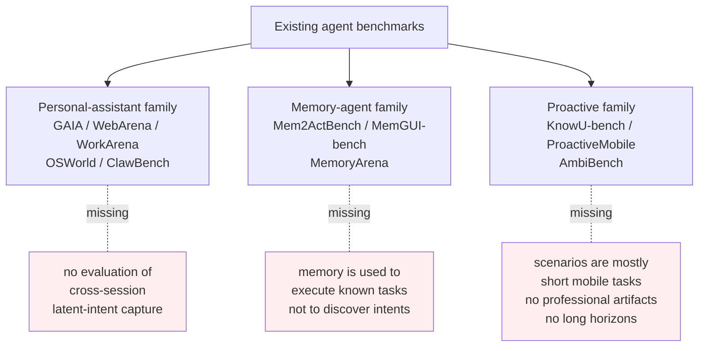
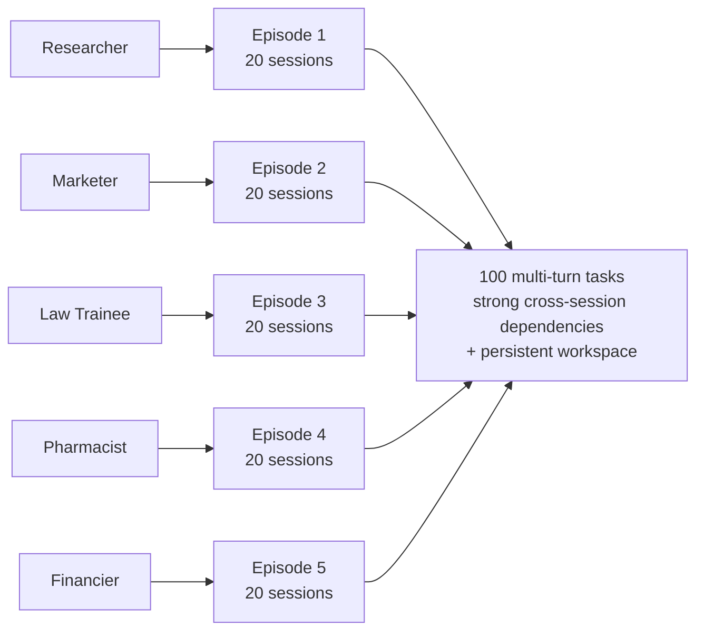
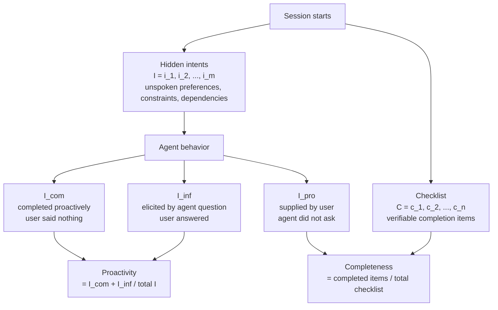
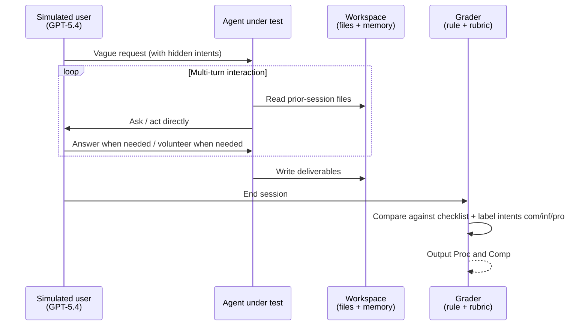

# π-Bench: Evaluating Proactive Personal Assistant Agents in Long-Horizon Workflows

> **Original title**: π-Bench: Evaluating Proactive Personal Assistant Agents in Long-Horizon Workflows
> **Authors**: Haoran Zhang, Luxin Xu, Zhilin Wang, Runquan Gui, Shunkai Zhang, Haodi Lei, Zihao He, Bingsu He, Chicheng Qin, Tong Zhu, Xiaoye Qu, Yang Yang, Yu Cheng, Yafu Li
> **Institutions**: Not disclosed on the arxiv page
> **Year**: 2026 (arxiv ID 2605.14678)
> **Subject**: cs.AI
> **Link**: https://arxiv.org/abs/2605.14678
> **Reading date**: 2026-05-22

## Reading Notes

### Where this paper sits in the field

The personal-assistant agent thread has been one of the hottest application-layer threads of the past two years. The earliest wave of work emphasized whether an agent could complete a clearly stated task: GAIA, WebArena, WorkArena, OSWorld, and ClawBench tried to place every tool-use scenario one could think of, from booking a flight to reading a paper to opening Photoshop and editing an image, and tested every case where the user could state intent clearly. A second wave then turned to cross-session memory. Mem2ActBench, MemGUI-bench, and MemoryArena asked whether agents could remember what the user had said and done across sessions. Within the last year, a third branch has emerged, called proactive assistance: when the user does not even intend to specify the task fully, can the agent infer the missing pieces from history and environment and ask before continuing? KnowU-bench, ProactiveMobile, and AmbiBench represent this branch, but they largely operate on small mobile-side daily tasks.

What π-Bench tries to do, within this lineage, is push the third branch into long-horizon professional settings, forcing one benchmark to carry three burdens that previous benchmarks had distributed: cross-session dependencies, persistent file artifacts, and active extraction of latent requirements.

### What you should be able to answer after reading

After reading this note, the reader should be able to answer the following:

1. Why does "proactivity" need to be measured separately from "completeness", and what does separating them reveal that older agent benchmarks could not?
2. What mechanism does π-Bench use to prevent an agent from relying on the user spelling out the task to score well?
3. What extra layer of information do five personas and twenty sessions provide compared with GAIA or WebArena?
4. How are the nine current frontier models distributed on proactivity, and why does at least one model show high completeness with low proactivity?
5. Why does the ablation that removes cross-session history widen the proactivity gap so sharply?

### Reading prerequisites

Assumes the reader is familiar with the basic operating loop of an LLM agent, in which the model receives a user input each turn, decides whether to call tools or write files, and returns to the user for the next turn; familiar with common benchmark metrics like accuracy and completion rate; but not necessarily a benchmark designer, and not necessarily up to date on the proactive-AI sub-thread that emerged across 2025 and 2026.

### Abbreviations

Listed up front so the reader can return to this table at any point:

- **Proc**: Proactivity score, defined in the text
- **Comp**: Completeness score, defined in the text
- $\mathcal{I}$: Intents — the set of latent intents to be resolved in a given session
- $\mathcal{I}_{\text{com}}$: Completed intents — resolved by the agent without the user stating them
- $\mathcal{I}_{\text{inf}}$: Inferred intents — elicited by the agent's targeted clarification
- $\mathcal{I}_{\text{pro}}$: Provided intents — supplied by the user before the agent asks
- $\mathcal{C}$: Checklist — set of verifiable completion items
- **GAIA**: General AI Assistants benchmark, a 2023 general-purpose assistant evaluation
- **WebArena**: a benchmark simulating realistic web-page operations for agents
- **OSWorld**: an operating-system-level agent benchmark
- **OpenClaw**: the mainstream personal-assistant product referenced throughout the paper
- **Nanobot**: the agent scaffold the experiments adapt

## Why this problem is worth doing

Proactive assistance is no longer abstract on the product side. Anyone who has used OpenClaw, Claude Code, or Cursor has noticed the same pattern: real users rarely specify a request fully on the first try. They are far more likely to realize, half-way into the workflow, "oh I forgot, the budget is only twenty thousand", or "oh, this document needs to match the company template". An agent that only consumes well-specified requests behaves, at best, like a fancy command line. An agent that can pull the unspoken portion of the requirement from the working environment, prior conversations, and folder structures behaves like a real assistant.

The strange thing is that the benchmark ecosystem has long avoided the proactivity axis. The reason is that proactivity is hard to evaluate. Completeness is easy to score: was the file delivered, was the table filled out, did the build pass. Proactivity is murky: if the agent neither asked nor acted and the user later volunteered a missing requirement, who deserves credit, the agent for moving fast or the user for being forced to spell things out? Older benchmarks either ignored proactivity or reduced it to a coarse "did the agent ask a clarification question" signal. The fundamental requirement is a new measurement apparatus: every session must place the agent under conditions where the user is deliberately withholding information, and the test then has to record whether the agent dodged, asked, or quietly did the wrong thing.

π-Bench is the paper that formally takes on this task.

## I. The Problem

The concrete problem the paper addresses is to design a benchmark that can measure, objectively, how an LLM agent performs in the following kind of task: the user opens with a vague request, the true requirements are scattered across past files in the workspace, across previous sessions, and across preferences implied by the user's identity; the agent should proactively surface these latent intents and proceed, rather than waiting passively for the user to fill in each missing piece.

Unpacking that statement, the authors must layer several burdens that prior benchmarks have refused to combine.

First, tasks must span multiple sessions. Short single-turn prompts do not work, because proactivity simply does not have room to unfold in such a narrow window. Second, there must be a persistent workspace so that files and state carry over between sessions. Without it, "memory" across sessions has no concrete substrate. Third, there must be an explicit catalogue of unspoken requirements, recoverable at evaluation time, so that the scoring system can tell which intents the agent acquired proactively versus which the user was forced to provide.

Prior approaches divide into three threads. The diagram below places them side by side:

The first thread, personal-assistant benchmarks, focuses on whether an agent can complete a task after an explicit request. GAIA and OSWorld are typical: useful, but they do not test whether the agent can fill in the requirement on its own when the request is deliberately incomplete. The second thread, memory-agent benchmarks, tests whether memory can be retrieved and applied to a known task. Memory here is execution fuel, not a signal for discovering unspoken needs. The third thread, proactive benchmarks, addresses proactivity but almost entirely on phone-screen ambient inferences and small consumer tasks, without the complex structure of professional workflows in which files and preferences carry across sessions.

What π-Bench does is fold each thread's missing piece back into a single benchmark: professional personas supply the long-horizon workflow (filling the third thread's gap), persistent file artifacts force memory into play (filling the second thread's gap), and an explicit model of unspoken needs combined with a dedicated proactivity metric closes the first thread's gap.

## II. Method

The core question of this section is how π-Bench is actually constructed, and why its evaluation mechanism succeeds at separating proactivity from completeness.

### Overall structure

The structure of π-Bench is laid out as follows:

The benchmark contains 100 multi-turn tasks organized into five episodes, one per persona, each with twenty sessions. Each persona is reverse-engineered from a real workflow: the Researcher writes literature reviews and manages citations; the Marketer prepares brand collateral and orchestrates communication cadence; the Law Trainee drafts contracts and looks up statutes; the Pharmacist verifies prescriptions and writes drug inserts; the Financier builds financial models and writes client briefings. All five share the property that their deliverables land in files and that consecutive sessions are continuous.

Within twenty sessions, the authors deliberately introduce two kinds of dependencies. The first is a **strong dependency group**, two to three sessions per group, where critical information from earlier sessions directly determines whether later sessions can succeed. There are six such groups. The second is an **independent task**, which carries only lightweight dependencies on neighbors, for example a consistent file-naming convention. There are five such tasks. The mixed distribution forces the agent to pull cross-session memory when relevant and avoid pulling unrelated context when not.

### Latent intents and the checklist

Each session is driven by two parallel internal lists. The figure below maps them onto agent behavior:

Hidden intents are unspoken preferences, constraints, and downstream dependencies. Each session has its hidden intents authored and tracked by a simulated user system across the dialogue. The checklist is a list of verifiable completion items, ranging from rule-based predicates such as "does the file schema validate", "does a specific string appear", and "is the tool call sequence correct", to rubric-based items scored by an LLM such as "is the final document complete and well argued".

Every hidden intent receives exactly one of three terminal labels by the end of the session. The first is **completed**: the agent resolves the requirement without the user stating it, for example by preserving a Chinese-name convention picked up from the previous session's filenames. The second is **inferred**: the agent asks a targeted question and the user answers, for example "is this report intended for Chinese readers", "yes". The third is **provided**: the agent neither asked nor acted, and the user is forced to volunteer, for example "by the way, the report should be in Chinese".

### Evaluation metrics

The proactivity score is defined as:

$$\text{Proc}(H) = \frac{|\mathcal{I}_{\text{com}}| + |\mathcal{I}_{\text{inf}}|}{|\mathcal{I}|}$$

The key design choice is that completed and inferred intents share the same numerator slot. The authors treat "doing without asking" and "asking and then doing" as the same form of proactivity, because both indicate that the agent itself identified an unspoken need. Intents the user volunteers without prompting do not count toward proactivity.

The completeness score is defined as:

$$\text{Comp}(H) = \frac{1}{|\mathcal{C}|} \sum_{c \in \mathcal{C}} s(c, H)$$

where $s(c, H) \in \{0, 1\}$ is the binary score on each checklist item, produced by either rule-based or rubric-based grading.

The reason proactivity and completeness can be cleanly separated is that the simulated user system eventually supplies any hidden intents the agent failed to address, so a reactive-style agent can still reach high completeness, but those late-supplied intents are bookkept under provided and cannot raise the proactivity score. In short: an agent can still chase completeness the old way, but proactivity demands a new behavior.

### Grader and execution details

For evaluation, every model runs under the same agent scaffold, an adaptation of Nanobot, in order to remove scaffold-specific confounds. The simulated user is played by GPT-5.4 at temperature 0, and the rubric grader is also GPT-5.4. Every task is run three times with independent trajectories, and means and standard deviations are reported.

A single session's execution loop looks like this:

## III. Experiments

The main results from the nine frontier models on π-Bench, averaged across three independent runs (percentages, standard deviations mostly under two points), are summarized below.

| Model | Proc (%) | Comp (%) | Notes |
| --- | --- | --- | --- |
| GPT-5.4 | 67.0 | 65.6 | Highest proactivity |
| Claude 4.6 Opus | 65.5 | 67.6 | Highest completeness |
| Qwen3.6 Plus | 64.0 | 64.1 | Most balanced |
| Gemini 3.1 Pro | 60.4 | 63.8 | Solid on both |
| DeepSeek V3.2 | 58.2 | 62.7 | Around average |
| Seed2.0 Pro | 57.5 | 61.5 | Near average |
| GLM-5.1 | 55.8 | 60.4 | Slightly below |
| MiniMax M2.7 | 53.2 | 59.0 | Slightly below |
| Kimi K2.5 | 43.1 | 61.6 | Conspicuously low Proc |

The most striking row is Kimi K2.5: completeness remains mid-pack while proactivity drops to 43.1%, fourteen points below Seed2.0 Pro at a similar completeness. The final deliverables are not noticeably worse, but the workflow depended on the user volunteering information to keep moving. This is exactly the new failure mode that π-Bench surfaces: completeness and proactivity can decouple, and older benchmarks could not see this split.

By persona, the Pharmacist tasks turn out to be the easiest for all models, because prescriptions and drug inserts naturally depend on concrete files and domain rules, and most hidden intents can be recovered from the workspace. Researcher tasks are the opposite: their workflow lacks standardized structure, and models struggle to be proactive. Law Trainee and Financier are the lowest in completeness, which the authors attribute to the heavier reliance on cautious judgement these roles require.

By task type, the paper offers several counterintuitive contrasts. Legal document operations reach 84.1% completeness but only 38.1% proactivity, because the document itself is easy to write while latent handoff information, who receives it next, when, and with which template, escapes the agent. The reverse holds in drug formulation: 84.9% proactivity exceeds 68.0% completeness, because the constraints are stated explicitly enough for the agent to recognize, but the synthesis and formulation steps still fail at a non-trivial rate.

### Key ablation

The most convincing ablation removes prior sessions from strong dependency groups and re-evaluates Proc and Comp on those groups alone:

| Condition | GPT-5.4 Proc | Avg Proc change | Avg Comp change |
| --- | --- | --- | --- |
| Full history | 78.5% | baseline | baseline |
| History removed | 64.9% | −9.5 points | −2.5 points |

Proactivity drops by an average of 9.5 points, while completeness drops only 2.5. GPT-5.4 itself loses 13.6 points. These numbers say that cross-session history is essentially the source of proactivity. Once history is severed, the agent no longer has clues to infer the unspoken needs, but it can still deliver an adequate final artifact once the user fills in the requirement.

A related observation is that average turn count and proactivity correlate negatively. The proactive leaders (GPT-5.4, Claude 4.6 Opus, Qwen3.6 Plus) sit in the low-turn region, while Kimi K2.5, with the lowest proactivity, exhibits the highest average turn count, indicating that the user is forced to speak more.

### Grader reliability

To rule out subjective bias from the rubric grader, the authors run a separate cross-grading study in which domain experts and two independent frontier models re-score the same set of trajectories, and the disagreement rate stays under 4%, which they take as evidence of stable grading.

## IV. Limitations

The authors acknowledge three explicit limitations. The first is the fidelity of the simulated user: every interaction partner is a GPT-5.4 persona, and real users will differ in phrasing habits, hesitation cadence, and preference drift across sessions, but live-user evaluation at long horizon is costly, hard to reproduce, and difficult to scale. The second is the single Nanobot-adapted agent scaffold: alternative scaffolds may introduce new confounds, but cross-scaffold evaluation imposes heavy adaptation effort. The third is persona coverage: all five personas are white-collar professional, leaving manual, educational, and clinical workflows out of scope.

Two additional concerns are visible to the reader even though the paper does not enumerate them. One is the single-model loop: GPT-5.4 plays the simulated user and acts as rubric grader, which raises the question of whether GPT-5.4's own row is systematically over-credited; the under-4% disagreement number partly addresses this but does not formally rule the bias out. The other is that the hidden-intent list itself is hand-curated, and the boundary between what counts as a hidden intent and what does not will influence absolute Proc values, so cross-dataset proactivity numbers should be compared with caution.

## One Sentence

π-Bench uses 100 cross-session long-horizon professional tasks to pry proactivity apart from completeness, and shows that today's frontier agents deliver adequate completeness yet succeed at proactively inferring unspoken user needs only around sixty percent of the time.
