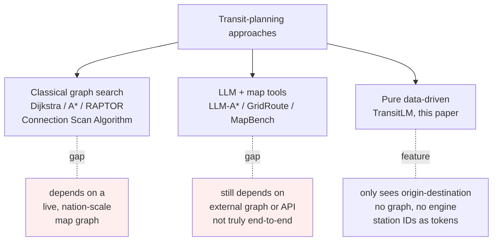
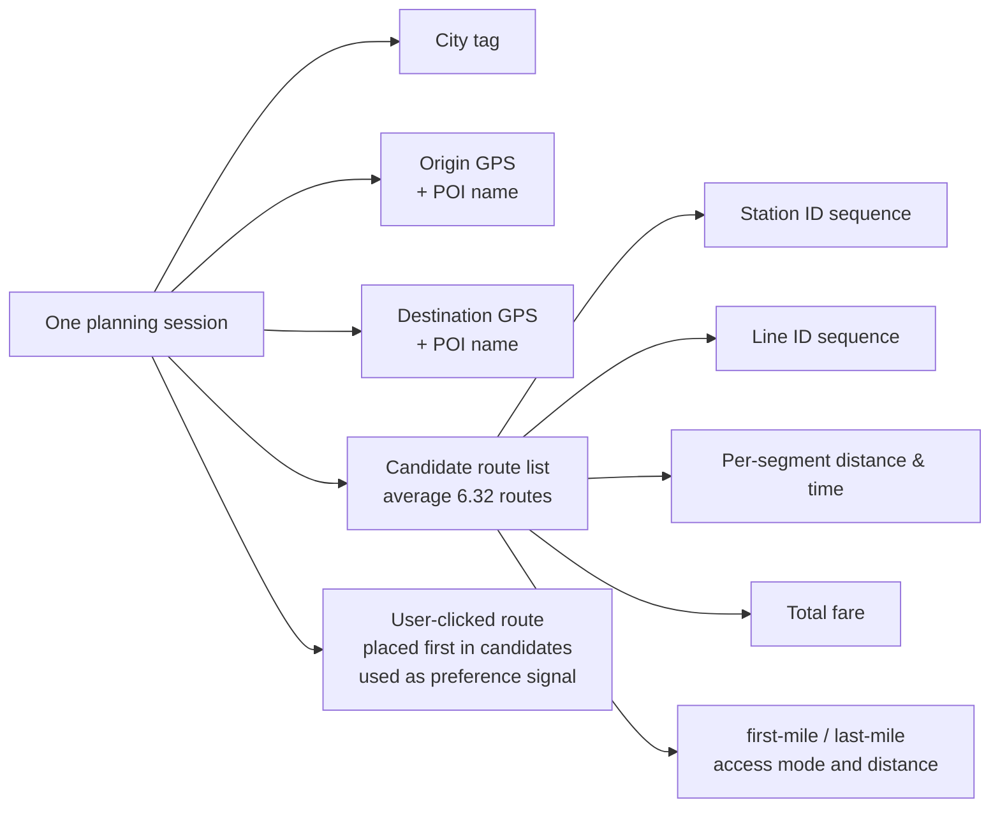
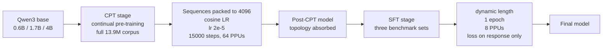

# TransitLM: A Large-Scale Dataset and Benchmark for Map-Free Transit Route Generation

> **Original title**: TransitLM: A Large-Scale Dataset and Benchmark for Map-Free Transit Route Generation
> **Authors**: Hanyu Guo, Jiedong Yang, Chao Chen, Longfei Xu, Kaikui Liu, Xiangxiang Chu
> **Institutions**: Not disclosed on the arxiv page (data sourced from AMAP)
> **Year**: 2026 (arxiv ID 2605.22355)
> **Subject**: cs.CL (also cs.AI and cs.LG)
> **Link**: https://arxiv.org/abs/2605.22355
> **Reading date**: 2026-05-23

## Reading Notes

### Where this paper sits in the field

Public transit route planning is one of the core back-end capabilities of any map provider. In major Chinese cities, tens of millions of users every day enter an origin and a destination into AMAP, Baidu Maps, or DiDi, and the application is expected to quickly return a small set of feasible transit plans. The traditional approach maintains a carefully curated, explicit graph encoding station-line-transfer relationships and then runs classical algorithms such as Dijkstra, A\*, RAPTOR, or the Connection Scan Algorithm on top of it. This line has been refined for twenty years and is stable in practice, but its cost is a nation-scale, minute-level real-time graph that must always be alive. Adding a new city means securing GTFS data from municipal authorities. Adjusting a few platforms overnight means propagating updates through the entire network.

After large language models matured over the past two years, researchers began combining LLMs with graph search. Work such as LLM-A\*, GridRoute, and MapBench falls into this category. These approaches still depend on external graphs or map infrastructure: the LLM serves as a scheduler or a patch, not as the route engine itself. The position of this paper sits at the more radical end of the same lineage. The question it asks is whether transit route planning can be learned purely from data, with no reliance on graphs or map infrastructure whatsoever.

### What you should be able to answer after reading

After reading this note, the reader should be able to answer the following:

1. Why do general-purpose LLMs hallucinate so heavily on transit route generation, and why do retrieval-augmented or tool-calling solutions not directly solve it?
2. What is the central innovation of the TransitLM dataset, and why does registering station IDs as dedicated vocabulary tokens eliminate hallucination?
3. How do you actually organize 13.9 million records covering 120,845 stations and 13,666 lines into a corpus that a language model can ingest?
4. Without any map API help, how does the model recover the correct station from only a pair of GPS coordinates that the user supplied implicitly?
5. What does each of the two training stages, continual pre-training and supervised fine-tuning, contribute to performance?

### Reading prerequisites

The reader is assumed to be familiar with the basics of LLM architecture and training, especially next-token prediction and supervised fine-tuning; familiar with common evaluation metrics such as accuracy and IoU; but not necessarily experienced with geospatial data, and not necessarily versed in the industry vocabulary of transit planning, such as connectivity, transfer, and first-mile / last-mile access.

### Abbreviations

Listed up front so the reader can return to this table at any point:

- **CPT**: Continual Pre-Training on a general LLM backbone with next-token loss
- **SFT**: Supervised Fine-Tuning
- **REM**: Route Exact Match (LO=1 and SSO=1)
- **LO**: Line Overlap, IoU over the predicted and ground-truth line sets
- **SSO**: Station Sequence Overlap, IoU over station ID sets
- **SG**: Station Grounding, plausibility of predicted boarding and alighting stations
- **DP**: Distance Plausibility for access distances
- **EA**: Estimation Accuracy on numerical fields (time, distance, fare)
- **PC**: Preference Compliance against the query-specified preference
- **RD**: Route Diversity in multi-route generation
- **POI**: Point of Interest on a map
- **GTFS**: General Transit Feed Specification, the public static transit data format
- **PPU**: Performance Processing Unit, the accelerator the paper uses, analogous to a GPU
- **AMAP**: AutoNavi Map / Gaode

## Why this problem is worth doing

Transit route planning looks straightforward from a user's seat and yet has remained awkward from an engineering one. On one hand, traditional solvers have already matured: major providers reach above 90% perceived accuracy on single-route, single-city queries. On the other hand, the cost of maintaining that traditional pipeline is enormous, requiring a nation-scale graph with millions of edges, tens of thousands of lines, and minute-level updates, alive at all hours. Adding a new city requires acquiring complete GTFS feeds from a municipal authority. Adjusting a handful of platforms overnight requires propagating the change to the entire pipeline.

Throwing the problem directly to a large model trips over a wall almost immediately. One reason is that the model has not actually learned the topology of stations; it has seen text, in which the co-occurrence of station names and line names cannot support precise transfer reasoning. A second reason is that the tokenizer chops station names into sub-character pieces, so the model can readily spell out a station that does not exist. Such hallucinations are fatal in route planning. Together these two reasons leave general-purpose models giving syntactically clean, geographically impossible plans on queries like "Beijing Dongzhimen to Tianjin Binhai Airport".

If a sufficiently large, sufficiently covered, and sufficiently structured dataset exists, the model can learn topology and transfer rules directly from data, and the public transit graph could emerge implicitly inside model weights, shedding the hard dependency on map infrastructure. TransitLM is the paper that formally takes on this idea.

## I. The Problem

The concrete problem the paper addresses is whether, without any external map, external graph, or external route search engine, it is possible to train a single large language model that takes only an origin GPS, a destination GPS, and a natural-language query and produces a route that is structurally valid, references real stations, has accurate distance / time / fare estimates, and satisfies the user's stated preference.

Prior approaches fall into three lines, juxtaposed below:

The first line is the classical graph search approach. Dijkstra and A\* are long-standing on static graphs, and RAPTOR and the Connection Scan Algorithm are optimized for transit. The chief problem is not the algorithm but the hard dependency on a real-time, hand-maintained graph.

The second line, emerging over the past two years, hybridizes LLMs with graph search. LLM-A\* uses the LLM as a heuristic, GridRoute grids the geographic space for coarse navigation, and MapBench treats map APIs as tools. This line incorporates the LLM into the loop but does not escape map infrastructure; the LLM is a sophisticated frontend to the route engine.

The third line is what this paper sets out to do: no external graph, no map API, no route search engine, only a sufficiently large body of historical planning records, with the model learning topology, connectivity, transfer logic, time / distance / fare estimation, and user preference all from data. The authors store the entire transit graph as implicit knowledge inside the model weights.

## II. Method

This section answers two questions: how the TransitLM dataset is constructed, and how the model is trained to learn an entire transit graph without any help from a map API.

### Dataset construction

The data come from a single day of real navigation logs on AMAP. The scale is deliberately aggressive:

- 13.9 M records in total covering Beijing, Shanghai, Shenzhen, and Chengdu
- 120,845 stations and 13,666 lines
- Average record length 2,377 Chinese characters, totaling over 20 billion tokens

Of the 13.9 M records, 12.9 M are planning sessions and 1.0 M are static descriptions of stations and lines. Each session is highly structured:

After diversity filtering, each session retains 5 candidates. Mode distribution is roughly 33% bus-only, 19% subway-only, 16.8% bus + subway, 30.5% other mixed. Distance distribution is 22.8% under 5 km, 47.4% between 5 and 20 km, 29.7% above 20 km. These distributions closely match real-world urban mobility patterns in first-tier Chinese cities.

Besides this continual pre-training corpus, the paper releases three additional benchmark fine-tuning datasets, each with 30,000 training and 10,000 test samples, covering optimal route generation, preference-aware planning, and multi-route generation.

### Model architecture

The key architectural choice sits at the tokenizer:

**All 120,845 station IDs are registered as dedicated tokens in the vocabulary.**

This design exists because, without explicit registration, the model would stitch station names character by character, and infinitely many invented strings could pass as station names. Once station-level tokens are introduced, the model can only choose from the legitimate station set, killing hallucination at the foundation. Each station ID gets its own embedding, allowing the model to directly learn spatial relations between stations and to encode adjacency, same-line membership, and cross-line transfer naturally in embedding distances.

The backbone is Qwen3 in three sizes, 0.6B, 1.7B, and 4B. The authors neither train a new model from scratch nor use a larger backbone. The argument they want to make is that "data alone determines the ceiling", so they hold the backbone variable constant.

### Training procedure

Training proceeds in two stages:

The CPT stage packs all 13.9 M records into sequences of fixed length 4,096 and runs for 15,000 steps (about three epochs) on 64 PPUs with cosine scheduling at an initial learning rate of 2e-5. This stage absorbs the entire transit-graph topology, field semantics, and user preference distribution into the weights.

The SFT stage skips packing, runs a single epoch per task, and computes loss only on response tokens. All three benchmark sets are drawn from a time period strictly disjoint from the CPT corpus, eliminating leakage.

### Evaluation metrics

The authors define a coordinated set of complementary metrics, grouped below.

**Connectivity** tests whether each consecutive pair of stations is reachable on the same line or via a legitimate transfer:

$$\text{Connectivity} = \frac{1}{N} \sum_{i=1}^{N} \mathbb{1}\left[\forall\, 1 \le j < L^{(i)},\ (s_j^{(i)}, s_{j+1}^{(i)}) \in \mathcal{E}\right]$$

where $\mathcal{E}$ is the ground-truth station relation set and $s_j^{(i)}$ is the $j$-th station of the $i$-th predicted route.

**Access feasibility** captures common sense around boarding and alighting.

- **Station Grounding (SG)**: predicted access falls within a mode-specific threshold (walking 3 km, cycling 5 km, taxi 10 km).
- **Distance Plausibility (DP)**: predicted access distance $d_{\text{pred}}$ satisfies $d_{\text{geo}} \le d_{\text{pred}} \le 3 \cdot d_{\text{geo}}$.

**Overlap metrics**:

- **Line Overlap (LO)**: IoU over the predicted and ground-truth line sets, including access segments.
- **Station Sequence Overlap (SSO)**: IoU over station ID sets.
- **Route Exact Match (REM)**: fraction of samples with LO=1 and SSO=1.

**Estimation Accuracy (EA)** uses a 10% relative or absolute tolerance (5 minutes, 500 meters, 1 CNY). MAPE is computed only on REM-positive samples to avoid contamination from broken routes.

**Task-specific metrics**:

- **Preference Compliance (PC)**: rule-checked satisfaction of the query-specified preference.
- **Route Diversity (RD)**: average pairwise line-set dissimilarity across the three generated routes in multi-route generation.

## III. Experiments

Main results for the optimal route generation task (10,000 test samples) are summarized below.

| Model | Connectivity | SG | LO | SSO | REM | EA (dist) | EA (time) | EA (fare) | MAPE |
| --- | --- | --- | --- | --- | --- | --- | --- | --- | --- |
| Qwen3-4B (CPT+SFT) | 97.0% | 98.5% | 88.5% | 85.2% | 71.0% | 96.5% | 95.4% | 99.0% | 1.33% |
| Qwen3-4B-Joint (multi-task) | 97.9% | 98.9% | 89.6% | 86.5% | 73.7% | 97.0% | 95.8% | 99.0% | 1.30% |
| Qwen3-1.7B | 96.1% | 97.9% | 86.5% | 82.7% | 66.4% | 95.4% | 94.0% | 98.6% | 1.46% |
| Qwen3-0.6B | 94.3% | 96.5% | 82.8% | 78.0% | 58.8% | 93.0% | 91.6% | 97.6% | 1.78% |
| Gemini-3.1-Pro (general) | 75.5% | – | – | – | 40.2% | – | – | – | – |
| Claude-Opus-4.6 (general) | 71.0% | – | – | – | 35.5% | – | – | – | – |
| GPT-5.4-Pro (general) | 68.5% | – | – | – | 32.2% | – | – | – | – |
| DeepSeek-V4-Pro (general) | 64.9% | – | – | – | 28.5% | – | – | – | – |

The gulf between general-purpose models and the domain-trained backbone is striking. Even Gemini-3.1-Pro, today's top closed model, reaches only 40.2% REM under more lenient conditions. Qwen3-4B, fine-tuned on 13.9 M records for three epochs, reaches 71.0% under stricter conditions, and 4B-Joint climbs to 73.7%.

For preference-aware planning, Qwen3-4B achieves 50.4% REM with 90.5% preference compliance, and 4B-Joint reaches 52.6% REM with the same 90.5% compliance. For multi-route generation, the 4B model reaches 64.5% REM with 0.545 diversity, and 4B-Joint improves to 67.2% REM with 0.547 diversity.

### Key ablations

**Data scaling.** The authors progressively shrink the CPT corpus:

| CPT fraction | Connectivity | REM |
| --- | --- | --- |
| 6.25% | 94.0% | 49.9% |
| 12.5% | 95.4% | 61.2% |
| 25% | 95.9% | 65.6% |
| 50% | 96.8% | 68.9% |
| 100% | 97.0% | 71.0% |

All metrics increase monotonically with data, but with a clear difference in slope. Basic topology (Connectivity) reaches near-ceiling at 6.25%, while fine-grained exact matching (REM) keeps improving well past 50%. Topology is easy to learn; precise station sequences and numerical fields are data-hungry.

**GPS-only ablation.** Stripping the textual cues (POI names, natural-language queries) and leaving only origin and destination GPS:

| Model | With text REM | GPS-only REM |
| --- | --- | --- |
| Qwen3-4B (this work) | 71.0% | 70.4% |
| Qwen3-4B-Joint | 73.7% | 72.9% |
| DeepSeek-V4-Pro (general) | 64.9% | 0.6% |
| Gemini-3.1-Pro (general) | 40.2% | <1% |

General-purpose LLMs collapse once textual cues are removed, with REM dropping below 1%. The domain model loses less than one point. This comparison demonstrates that what the model truly learns is an implicit grounding from GPS coordinates to station IDs, not a shortcut via textual POI matching.

**Single-city vs multi-city.** Training only on Beijing data versus jointly on four cities:

- Beijing-only beats four-city joint training by about 3.5 points in REM.
- The four-city setup expands the vocabulary by 3.1×.

The gap is modest, indicating that the station-ID-as-token mechanism scales gracefully across cities without collapsing under vocabulary growth.

**SFT-only ablation.** Skipping CPT and fine-tuning directly from the Qwen3 base:

- SFT-only: with-text REM 74.9%, GPS-only REM 66.1%
- CPT+SFT 100%: GPS-only REM 70.4%

SFT-only looks reasonable with textual cues, but performance drops significantly once cues are removed. CPT is precisely what provides the "GPS-anchored station inference without textual prompts" capability.

## IV. Limitations

The authors acknowledge four limitations. First, the data cover only four Chinese cities from a single platform (AMAP); cross-platform and cross-region generalization is not evaluated. Second, the dataset captures only static route structures; real-time dynamics such as service suspensions, sudden congestion, and shifting peak-hour intervals are out of scope. Third, multi-city training introduces token sparsity that costs single-city accuracy. Fourth, multi-route generation labels themselves carry ambiguity, which makes REM a stricter measure of capability than it might appear.

Two additional concerns can be inferred even though the paper does not enumerate them. First, the station-ID-as-token design implies that adding a new city requires extending the vocabulary and at least a round of re-alignment training, effectively transferring some of the maintenance cost from map infrastructure to the model itself. In production this is not a free trade. Second, all datasets reported come from the same time window, so temporal drift (line renaming, new lines, station renovations) and the resulting long-tail degradation are unevaluated.

## One Sentence

TransitLM uses 13.9 M AMAP planning records and registers all 120,845 station IDs as dedicated vocabulary tokens, demonstrating that a 4B language model can learn the entire transit graph purely from data, reaching 73.7% route exact match without any reliance on map infrastructure.
