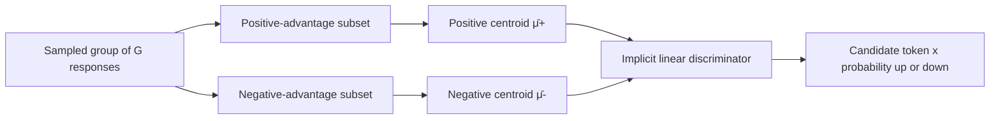
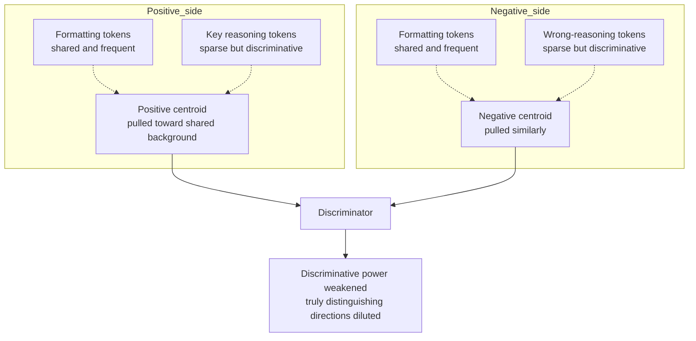
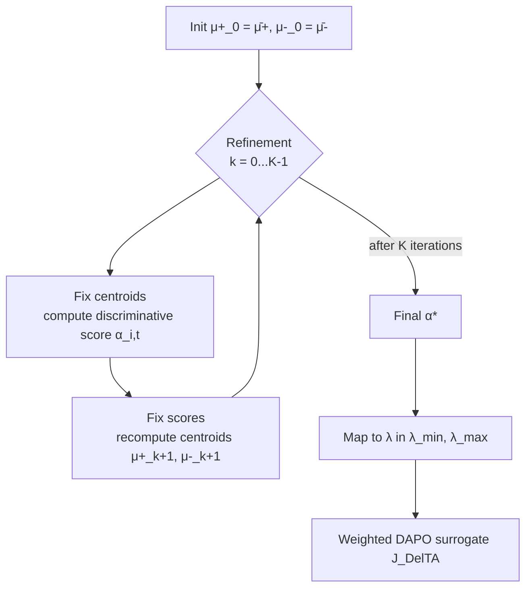

# DelTA: Discriminative Token Credit Assignment for Reinforcement Learning from Verifiable Rewards

> **Original title**: DelTA: Discriminative Token Credit Assignment for Reinforcement Learning from Verifiable Rewards
> **Authors**: Kaiyi Zhang, Wei Wu, Yankai Lin
> **Institutions**: Gaoling School of Artificial Intelligence, Renmin University of China / Ant International
> **Year**: 2026 (arXiv 2605.21467, submitted 2026-05-20)
> **Subject**: cs.LG / cs.CL
> **Link**: https://arxiv.org/abs/2605.21467
> **Code**: https://github.com/RUCBM/DelTA
> **Reading date**: 2026-05-24

## Reading guide

### Where this paper sits in the field

Over the past year, the most-watched path for improving large language model reasoning has been Reinforcement Learning from Verifiable Rewards, abbreviated as RLVR. The idea is simple: take tasks like math, code, and formal proofs where a program can automatically verify correctness, sample multiple responses for each prompt, give each response a scalar reward based on whether the answer is right, and then update model parameters with a policy-gradient method. DeepSeek-R1, Kimi K1.5, the Qwen3 series, and OpenAI's o-series all follow this route.

Within RLVR, the two most popular critic-free frameworks are GRPO, short for Group Relative Policy Optimization, and DAPO, short for Decoupled Clipping and Dynamic Sampling Policy Optimization. Neither trains a separate value head to provide baselines. Instead, the same prompt is sampled multiple times to form a group, the group is normalized internally, and each response's relative advantage is used directly as its advantage signal. DAPO adds two key designs on top of GRPO: asymmetric clipping, and token-level normalization across all tokens in the group rather than within each response.

DelTA builds directly on DAPO, but its main thread is not yet another sampling or reward-shaping design. Instead it asks a finer question: how does a response-level scalar reward signal actually translate into token-level probability changes? The authors recast the policy-gradient update direction as an implicit linear discriminator in token-gradient space, then design a token-coefficient reweighting scheme on that basis. This "reverse-engineer the RL update as a classification problem" view is in the same family as discriminative representation learning under contrastive losses, but its systematic application to RLVR is new.

### What you can answer after reading

1. RLVR gives rewards at the response level but takes gradient updates at the token level. Where, concretely, does this granularity mismatch show up?
2. Why can the policy-gradient update under sequence-level RLVR be interpreted as an implicit linear discriminator over token-gradient vectors?
3. Why do the positive- and negative-side centroids in standard DAPO get pulled toward high-frequency shared tokens such as formatting tokens, weakening their discriminative power?
4. What criterion does DelTA use to weight tokens, and why must it rely on opposite-side contrast rather than own-side concentration?
5. How does DelTA differ from token-selection methods and process reward models (PRMs), both of which also pursue finer-grained credit assignment?

### Reading prerequisites

The reader is expected to be comfortable with Transformers and PyTorch tensor operations, and to have read at the conceptual level about PPO and GRPO, including terms like advantage, importance ratio, and clipping. The reader is not expected to have hands-on RLVR experience, deep familiarity with DAPO, or knowledge of linear discriminant analysis. All such background is laid out the first time it is needed.

### Glossary

- **RLVR** (Reinforcement Learning from Verifiable Rewards): reinforcement learning where the task reward comes from automated verification, such as checking whether a math answer is correct or whether code passes a test, with no human labeling required
- **GRPO** (Group Relative Policy Optimization): samples multiple responses per prompt to form a group, then normalizes within the group to compute advantages
- **DAPO** (Decoupled Clipping and Dynamic Sampling Policy Optimization): a critic-free RL training framework introduced by DeepSeek and ByteDance, adding asymmetric clipping and token-level normalization on top of GRPO
- **PPO** (Proximal Policy Optimization): a classical actor-critic algorithm with clipped importance ratios
- **PRM** (Process Reward Model): an auxiliary model that scores intermediate reasoning steps
- **LDA** (Linear Discriminant Analysis): a classical supervised dimensionality-reduction and classification method derived from the principle of within-class compactness and between-class separation
- **centroid**: the (advantage-weighted) average of the token-gradient vectors on one side, used as that side's reference direction
- **token-gradient**: the gradient of the policy log probability with respect to the parameters, namely $\nabla_\theta \log \pi_\theta(o_{i,t} \mid q, o_{i,<t})$
- **advantage**: the group-normalized response-level advantage $\hat{A}_i = (R_i - \mu_R)/(\sigma_R + \epsilon_A)$

## Why this question is worth asking

RLVR has come close to defining the training recipe for today's strongest reasoning models on tasks like math and code with ground-truth answers. Sample 16 responses per problem, reward +1 for correct and 0 for incorrect, then feed the result back through a policy gradient. This loop is enough to push base models to scores approaching human contestants on AIME, HMMT, and other olympiad-grade math competitions. Yet the core mechanism has been only partially understood: the reward signal is at the response level, so one response corresponds to one scalar; but the policy update lands on the probability of every token. The intermediate "response reward → token probability change" path used to be handled implicitly by the objective functions of PPO, GRPO, and DAPO, and no one has been able to explain from first principles why a given update raises the probability of token A by 0.03 while lowering that of token B by 0.001.

Recent empirical work (Meng et al., 2026; Ma et al., 2026) observes a counterintuitive phenomenon during RLVR training: only a small subset of tokens undergo meaningful probability shifts, while most token distributions barely move. This is at odds with the design intuition that all tokens in the same response share one scalar advantage and should all be moved by a similar amount. The implication is that RLVR contains an unspecified token-selection mechanism that decides which tokens actually get pulled up or pushed down. Is that implicit selection good or bad? And if it picks the wrong tokens, can the choice be corrected? Those are the questions this paper sets out to answer.

There is also a practical motivation. DAPO-style methods commonly run into a failure mode in long-reasoning settings: after several thousand training steps, reward plateaus, response length shrinks, and entropy rises, as if the model loses confidence in extending long chains of thought. If a token-level lever can be found that concentrates the policy update on tokens that actually distinguish high-reward responses from low-reward ones, there is a real chance of pushing past that plateau and recovering long-reasoning capability.

## I. The Problem

### 1.1 The standard statement of the granularity mismatch

Write down DAPO's objective as the reference point. For a sampled group $\{o_i\}_{i=1}^{G}$, the group-normalized advantage of response $i$ is $\hat{A}_i = (R_i - \mu_R)/(\sigma_R + \epsilon_A)$, and the token-level importance ratio is $r_{i,t}(\theta) = \pi_\theta(o_{i,t} \mid q, o_{i,<t}) / \pi_{\theta_\text{old}}(o_{i,t} \mid q, o_{i,<t})$. The DAPO surrogate is

$$
J_\text{DAPO}(\theta) = \mathbb{E}\Bigg[\frac{1}{\sum_i |o_i|} \sum_{i,t} \min\big(r_{i,t}(\theta)\hat{A}_i,\ \text{clip}(r_{i,t}(\theta), 1-\epsilon_\text{low}, 1+\epsilon_\text{high})\hat{A}_i\big)\Bigg]
$$

Notice that $\hat{A}_i$ is a response-level scalar shared by every token in the response, while the per-token contribution flows in through $r_{i,t}(\theta)$. This is where the granularity mismatch comes from in the formalism.

Building on this objective, recent improvement directions roughly split into four routes. The first introduces a process reward model (PRM) or other external fine-grained reward, scoring intermediate reasoning steps, with Cui et al. (2025)'s implicit PRM and Zhang et al. (2025b)'s process reward model practice as representatives. The second uses token-selection rules to filter tokens, such as Wang et al. (2025)'s 80/20 rule arguing that high-entropy minority tokens drive effective updates, or Ma et al. (2026)'s future-KL token selection. The third improves the credit assignment mechanism itself, as in Kazemnejad et al. (2025)'s VinePPO or Xie et al. (2025)'s CAPO. The fourth focuses on training stability and efficiency, including Zheng et al. (2025)'s group sequence policy optimization and Yan et al. (2025)'s off-policy training.

All four routes rely on extra signals to perform finer-grained credit assignment, either by training another model or by adding external token-selection rules. DelTA does not follow that path. It instead mines the implicit discriminator embedded in the geometry of the RLVR update direction itself, and then explicitly reshapes it, without any external signal.

### 1.2 The key observation: the policy gradient update is an implicit linear discriminator

Consider a candidate token $x$ at some context $c$. Around the current parameter point $\theta_\text{old}$, a local update $\Delta\theta$ changes $\log \pi_\theta(x \mid c)$ via a first-order Taylor expansion:

$$
\Delta \log \pi(x \mid c) \approx (\nabla_\theta \log \pi_\theta(x \mid c))^\top \Delta\theta
$$

In words: once the candidate token $x$, the context $c$, and the starting point $\theta_\text{old}$ are fixed, whether the candidate's probability locally rises or falls is determined by the sign of the inner product between its token-gradient vector and the update direction $\Delta\theta$.

The authors then write DAPO's local update direction explicitly. At $\theta_\text{old}$, $r_{i,t}(\theta_\text{old}) = 1$, which sits inside the clipping interval, so clipping is locally inactive and the update reduces to an advantage-weighted aggregation of sampled token gradients. Splitting by the sign of the response-level advantage,

$$
\Delta\theta_\text{RLVR} \propto \sum_{i: \hat{A}_i > 0} \sum_t \hat{A}_i v_{i,t} - \sum_{i: \hat{A}_i < 0} \sum_t |\hat{A}_i| v_{i,t}
$$

where $v_{i,t} := \nabla_\theta \log \pi_\theta(o_{i,t} \mid q, o_{i,<t})$ is the token-gradient vector at the sampled token. Denote the total advantage mass per side by $M_+$ and $M_-$, and the normalized average direction (the centroid) per side by $\bar\mu_+$ and $\bar\mu_-$. The update direction becomes

$$
\Delta\theta_\text{RLVR} \propto M_+ \bar\mu_+ - M_- \bar\mu_-
$$

Substituting back into the Taylor expansion, the change in the candidate token's log probability is the difference of two terms: the positive-side score $M_+ (\nabla \log \pi(x \mid c))^\top \bar\mu_+$ minus the negative-side score $M_- (\nabla \log \pi(x \mid c))^\top \bar\mu_-$. When the positive-side score exceeds the negative-side score, the candidate's probability is locally raised; otherwise it is lowered.

This passage is the conceptual anchor of the paper. The authors state it plainly: "The RLVR update direction is a policy update in parameter space and, simultaneously, an implicit linear discriminator in token-gradient space." This discriminator is not explicitly parameterized or separately trained; it is induced by the policy-gradient update itself. Once that is recognized, a reverse-design route opens up: instead of fixating on how to sample or normalize, one can directly reshape the induced discriminator.

### 1.3 The fundamental flaw of the standard centroid

Once the discriminator view is in place, a problem surfaces: the two centroids that the standard sequence-level RLVR update uses to build that discriminator are simply advantage-weighted averages of token-gradient vectors. Appendix D shows they are equivalent to weighted least-squares solutions that minimize within-side squared distances, which is the natural way to summarize each side from inside.

But the authors immediately push further: in the discriminator view, what is needed is not a good "internal representative" but a direction that separates positives from negatives. These two goals are statistically distinct, and "a good within-side summary is not necessarily a good between-side discriminator," a tension that Cohen et al. (2013) and Khosla et al. (2020) (in supervised contrastive learning) have discussed elsewhere.

The mismatch is particularly severe during RLVR training. High-reward and low-reward responses to the same math problem share large numbers of structured tokens: newlines, TeX markup such as `\boxed{}`, entity names from the problem statement, and phrases such as `Step 1:` or `So we have`. The token-gradient directions of these shared tokens appear on both sides and at high frequency, pulling both centroids toward common background structure. The induced discriminator then overemphasizes task-agnostic similarities and dilutes the sparse directions that actually separate higher-reward responses from lower-reward ones.

This is the starting point for the entire DelTA design. The aim is direct: replace the internal-representative centroid with a discriminative one, so that the two side-wise reference directions move away from the shared background and contrast more sharply against each other.

## II. Method

### 2.1 Overall idea

Since centroids are induced by weighted token-gradient aggregation rather than parameterized separately, changing the token weights changes the centroids directly. Based on this observation, DelTA estimates a discriminative coefficient $\lambda_{i,t}$ for each sampled token and uses it to reweight the RLVR surrogate. The larger the coefficient, the more the token's gradient direction is representative of its own side relative to the opposite side, and the more weight it deserves; the smaller, the more it captures shared directions that should be suppressed.

DelTA has three steps. First, initialize from the original advantage-weighted centroids. Second, perform $K$ alternating refinement iterations: with the current centroids fixed, estimate token discriminative scores; with the scores fixed, recompute each side's centroid. Third, map the final scores into a bounded range $[\lambda_\text{min}, \lambda_\text{max}]$ and use them to reweight the DAPO objective.

### 2.2 The explicit form of the discriminative score

DelTA defines each token's discriminative score $\alpha_{i,t}^{(k)}$ as the solution to an entropy-regularized $[0,1]$ maximization problem. Taking the positive side as an example (the negative side is symmetric),

$$
\alpha_{i,t}^{(k)} = \arg\max_{\alpha \in [0,1]} \alpha \cdot \big(\|v_{i,t} - \mu_-^{(k)}\|_2^2 - \|v_{i,t} - \mu_+^{(k)}\|_2^2\big) + \gamma_+^{(k)} h(\alpha)
$$

where $h(\alpha) = -\alpha\log\alpha - (1-\alpha)\log(1-\alpha)$ is the binary entropy regularizer and $\gamma_+^{(k)} > 0$ is a side-specific temperature. The distance margin in the bracket has a natural reading: if a token's gradient is closer to the positive centroid than to the negative one, the margin is positive and the maximization prefers a larger $\alpha$; if the two distances are similar, the margin is close to zero, and the entropy regularizer pulls $\alpha$ back toward 0.5.

The closed-form solution is

$$
\alpha_{i,t}^{(k)} = \sigma\!\left(\frac{\|v_{i,t} - \mu_-^{(k)}\|_2^2 - \|v_{i,t} - \mu_+^{(k)}\|_2^2}{\gamma_+^{(k)}}\right), \quad \hat{A}_i > 0
$$

where $\sigma(\cdot)$ is the sigmoid. The negative-side formula swaps the centroids and the temperature. The temperatures $\gamma_+^{(k)}$ and $\gamma_-^{(k)}$ are side-specific and adapted from the current distance scale, with full computational detail in Appendix H of the paper.

Once the scores are computed, DelTA updates the centroids as score-weighted within-side averages:

$$
\mu_+^{(k+1)} = \frac{\sum_{i: \hat{A}_i > 0}\sum_t \hat{A}_i \alpha_{i,t}^{(k)} v_{i,t}}{\sum_{i: \hat{A}_i > 0}\sum_t \hat{A}_i \alpha_{i,t}^{(k)}}
$$

with the negative side defined symmetrically. This step gives more influence to token-gradient vectors that are more representative of their own side, gradually pushing the shared high-frequency directions out of the centroids. The refinement is performed under stop-gradient, with no additional loss term and no backpropagation through the refinement; it serves only to compute the token coefficients.

### 2.3 The reweighted surrogate

The final step maps the discriminative scores into a bounded interval: $\lambda_{i,t} = \lambda_\text{min} + (\lambda_\text{max} - \lambda_\text{min}) \alpha_{i,t}^\star$. The paper uses $[\lambda_\text{min}, \lambda_\text{max}] = [0.8, 1.2]$, a narrow range that avoids extreme reweighting. The DAPO objective then replaces its uniform token average with a $\lambda$-weighted self-normalized form:

$$
J_\text{DelTA}(\theta) = \mathbb{E}\Bigg[\frac{1}{\sum_{i,t} \lambda_{i,t}} \sum_{i,t} \lambda_{i,t} \min\big(r_{i,t}(\theta)\hat{A}_i,\ \text{clip}(r_{i,t}(\theta), 1-\epsilon_\text{low}, 1+\epsilon_\text{high})\hat{A}_i\big)\Bigg]
$$

Locally around $\theta_\text{old}$, each token's effective contribution changes from $\hat{A}_i v_{i,t}$ to $\lambda_{i,t} \hat{A}_i v_{i,t}$. Read in token-gradient space, this amplifies directions that separate the two sides and dampens shared directions, which reshapes the induced discriminator and therefore the effective update direction. The coefficients $\lambda$ are stop-gradient quantities, computed once per rollout batch and held fixed across the multiple optimization epochs that follow.

### 2.4 Engineering approximations

A strict implementation would require token-level gradients of every sampled token with respect to all model parameters. At LLM scale that is infeasible. The paper uses the last-layer LM head gradient as a proxy (Appendix F), restricted to coefficient estimation only; the RLVR objective itself remains a full-parameter optimization. Appendix F's ablation indicates that DelTA is insensitive to which layer the proxy is taken from.

## III. Experiments

### 3.1 Setup

Backbones are Qwen3-8B-Base and Qwen3-14B-Base (Yang et al., 2025). Training data is DeepMath-103K (He et al., 2025) and the training framework is VeRL (Sheng et al., 2024). DelTA's own hyperparameters are $[\lambda_\text{min}, \lambda_\text{max}] = [0.8, 1.2]$ with refinement count $K = 1$.

Four baselines are compared: DAPO (Yu et al., 2025), DAPO with Forking Tokens (DAPO w/ FT, Wang et al., 2025, a concrete implementation of the 80/20 high-entropy token selection idea), SAPO (Gao et al., 2025), and FIPO (Ma et al., 2026). All methods use the same hyperparameters, and DAPO's dynamic sampling is disabled in every run to isolate the effect of the policy-update objective itself.

Evaluation covers seven math reasoning benchmarks: AIME24, AIME25, AIME26, HMMT25-Feb, HMMT25-Nov, HMMT26-Feb, and Brumo25. Maximum generation length is 30,000 tokens, with 16 samples per problem averaged.

### 3.2 Main results

The main result table is below (numbers are average pass rates per benchmark; the final column is a question-count-weighted average; DelTA achieves the highest score on every benchmark across both backbones).

**Qwen3-8B-Base**

| Method | AIME24 | AIME25 | AIME26 | HMMT25 Feb | HMMT25 Nov | HMMT26 Feb | Brumo25 | Avg |
|---|---|---|---|---|---|---|---|---|
| DAPO | 34.79 | 23.33 | 24.17 | 13.54 | 12.08 | 16.86 | 36.46 | 22.95 |
| DAPO w/ FT | 36.67 | 23.96 | 26.46 | 15.62 | 15.42 | 17.05 | 39.17 | 24.80 |
| SAPO | 38.75 | 24.37 | 26.25 | 14.58 | 16.04 | 17.42 | 39.37 | 25.14 |
| FIPO | 37.50 | 23.13 | 23.96 | 14.58 | 12.92 | 17.99 | 37.71 | 23.89 |
| **DelTA** | **43.13** | **26.46** | **28.12** | **18.33** | **18.54** | **20.27** | **44.79** | **28.40** |

**Qwen3-14B-Base**

| Method | AIME24 | AIME25 | AIME26 | HMMT25 Feb | HMMT25 Nov | HMMT26 Feb | Brumo25 | Avg |
|---|---|---|---|---|---|---|---|---|
| DAPO | 51.25 | 32.29 | 39.79 | 19.79 | 30.00 | 25.38 | 48.13 | 35.09 |
| DAPO w/ FT | 54.37 | 33.75 | 41.46 | 20.42 | 31.67 | 24.81 | 52.08 | 36.77 |
| SAPO | 53.96 | 34.17 | 41.46 | 20.62 | 28.33 | 24.05 | 50.21 | 35.94 |
| FIPO | 54.58 | 35.00 | 42.50 | 21.46 | 32.29 | 24.43 | 52.08 | 37.29 |
| **DelTA** | **56.87** | **37.92** | **45.21** | **26.04** | **32.92** | **26.89** | **54.79** | **39.91** |

On the 8B model, DelTA improves the average by 3.26 points over the strongest same-scale baseline (SAPO at 25.14). On the 14B model, the gain over the strongest baseline (FIPO at 37.29) is 2.62 points. The consistency across both scales is more telling than any single benchmark win: it indicates that the mechanism behind DelTA is not specific to one model or one task instance.

Appendix L of the paper adds three further results. First, DelTA also improves DAPO on code generation benchmarks. Second, switching the backbone to Olmo3-7B-Base (Olmo et al., 2025) yields the same kind of gain. Third, out-of-domain (OOD) evaluations preserve the improvement.

### 3.3 Training dynamics

On the 8B backbone, side-by-side training curves for reward, response length, and entropy reveal a noteworthy pattern. Both methods follow nearly identical reward trajectories early on, but they diverge mid-training: DAPO plateaus and even regresses slightly, while its responses shorten and entropy rises; DelTA keeps climbing on reward, holds longer responses, and lowers entropy.

This is consistent with the discriminator view. Standard sequence-level aggregation lets shared background directions dominate the centroids and dilute the discriminator's contrast; DelTA suppresses the weights on those background tokens, keeping the reference directions sharper, and sustains stable long-reasoning generation without any explicit length incentive.

### 3.4 Key ablations

The most counterintuitive result worth highlighting is the within-side-only experiment (Table 2). It keeps DelTA's coefficient normalization and reweighted DAPO surrogate, but removes the opposite-side distance from the score, so the token weight depends only on how close the token is to its own-side centroid. The result: this variant is not just worse than DelTA, it is meaningfully worse than even the DAPO baseline (17.94 vs 19.05 average on 8B).

| Method | AIME25 | AIME26 | HMMT25 | HMMT26 | Avg |
|---|---|---|---|---|---|
| **DelTA** | 26.46 | 28.12 | 18.54 | 20.27 | **23.27** |
| DAPO | 23.33 | 24.17 | 12.08 | 16.86 | 19.05 |
| Within-side only | 21.67 | 22.08 | 11.04 | 17.05 | 17.94 |

This result directly refutes a naive intuition that "tokens near their own-side centroid should be upweighted." In practice, tokens that sit near their own-side centroid are very likely the high-frequency shared tokens that pulled the centroid there in the first place; rewarding own-side centrality therefore reinforces the shared background and makes the discriminator worse. **The opposite-side comparison is necessary, not optional.**

The second ablation (Figures 3 and 4) tests whether $\lambda$ truly identifies tokens with useful learning signal. The setup uses $\lambda$ only as a token selector, training DAPO on the top 50% of tokens ranked by $\lambda$ while dropping the rest, and comparing against random 50% and bottom 50% selections. Top-$\lambda$ training, using only half the tokens, beats full DAPO; random 50% stays close to DAPO; bottom-$\lambda$ collapses. This rules out the interpretation that DelTA simply benefits from sparsification noise; the coefficient genuinely captures a difference in tokens' learning value.

The third ablation (Table 3) targets DelTA's own components: removing adaptive $\gamma$, removing the entropy regularizer $h(\alpha)$, removing the coefficient-mass normalizer, removing the linear map, and removing the refinement. Every removal degrades performance. The largest drop comes from removing the refinement (average 19.97), indicating that one-shot coefficients from the initial centroids are far from sufficient and that the iterative refinement step is the load-bearing piece.

## IV. Limitations

### 4.1 What the authors acknowledge

First, the token coefficients are computed using a layer-restricted token-gradient proxy rather than the true full-parameter gradient. Full-parameter gradients for every sampled token are impractical at LLM scale. The proxy ablations show DelTA is robust to layer choice, but more efficient and accurate proxies remain open.

Second, the empirical scope is concentrated on math reasoning, with smaller-scale validation on code generation, an alternative backbone, and OOD benchmarks. Multi-turn interaction, tool use, and other verifiable-reward domains remain to be explored.

Third, DelTA introduces additional compute for coefficient estimation. The paper's Appendix L.1 reports a "modest" measured overhead, but there is still room for further engineering reductions through caching or cheaper proxies.

### 4.2 What a careful reader can also see

First, the discriminator view's rigor has boundaries. The paper uses a first-order Taylor expansion to link $\Delta\theta$ to token-probability changes, which is only locally valid around $\theta_\text{old}$. The full RL training trajectory is nonlinear, and clipping activates when the update step is large. The authors are explicit that this is "an analysis and design principle" rather than an exact characterization. Extending the discriminator view to global behavior would require more robust supporting arguments.

Second, the assumption that "shared tokens are harmful" is not universally true. The paper treats formatting tokens and problem entity names as typical shared directions to be suppressed, but in some settings the formatting tokens themselves carry critical structure: think of indentation in code completion or key tokens in a JSON schema. Suppressing all shared directions uniformly could damage necessary structural learning in such cases.

Third, the baseline coverage is narrow. All the compared methods belong to the token-level reweighting family; there is no direct comparison against PRM-based approaches (such as Cui et al., 2025). Given that DelTA and PRMs take fundamentally different routes, with one avoiding external signals and the other adding a learned judge, the missing comparison is understandable, but worth keeping in mind when assessing overall completeness.

Fourth, the benefit-to-cost ratio. A narrow range $\lambda \in [0.8, 1.2]$ already yields a 2-3 point average improvement, but the coefficient estimation itself requires refinement iterations, sigmoid computations, and squared-distance evaluations, adding a non-trivial layer of compute per rollout. The paper does not report end-to-end step time or GPU utilization in full, so the practical cost-benefit can only be confirmed through reproduction.

Fifth, the experimental setup disables DAPO's dynamic sampling. In the original DAPO design, dynamic sampling is the key mechanism that ensures each group contains both correct and incorrect responses. The paper disables it to isolate the policy-update effect, which is reasonable for the analysis, but whether the two components can coexist in deployment, or whether dynamic sampling should be enabled with DelTA in practice, is a question for follow-up work.

## One Sentence

DelTA recasts the RLVR policy-gradient update as an implicit linear discriminator in token-gradient space, and through opposite-side contrastive token coefficients reshapes that discriminator from a within-side summary into a between-side separator, yielding stable 2-3 point average gains on math reasoning.
