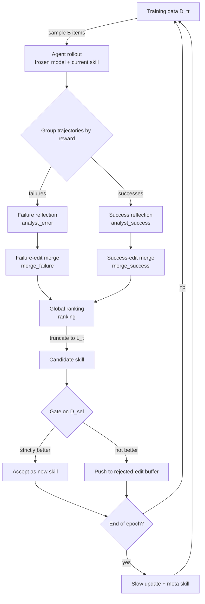
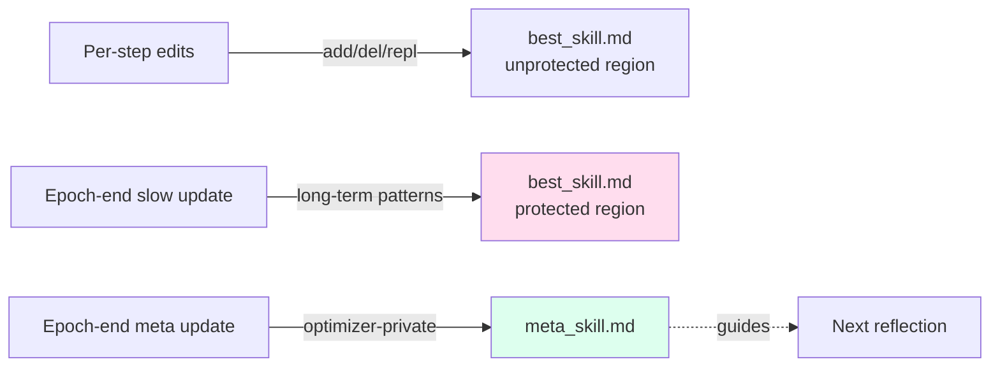

# SkillOpt: Executive Strategy for Self-Evolving Agent Skills

> **Original title**: SkillOpt: Executive Strategy for Self-Evolving Agent Skills
> **Authors**: Yifan Yang, Ziyang Gong, Weiquan Huang, Qihao Yang, Ziwei Zhou, Zisu Huang, Yan Li, Xuemei Gao, Qi Dai, Bei Liu, Kai Qiu, Yuqing Yang, Dongdong Chen, Xue Yang, Chong Luo
> **Institutions**: Microsoft Research, Shanghai Jiao Tong University, Tongji University, Fudan University
> **Year**: 2026 (arxiv ID 2605.23904)
> **Subject**: cs.AI / cs.CL
> **Link**: https://arxiv.org/abs/2605.23904
> **Reading date**: 2026-05-25

## Reading Notes

### 1. Where this paper sits in the field

Over the past year and a half, the practice of wrapping a large foundation model into an Agent and deploying it on engineering tasks has moved from research into actual production. Codex, Claude Code, and various internal enterprise tool-calling frameworks all share the same architecture: a frozen base model, paired with a natural-language directive called a prompt or skill, plus an execution environment. The capability ceiling of such systems therefore splits into two parts: the raw capability of the base model itself, and the quality of the natural-language directive attached to it.

Around the question of how to improve that directive, the past two years have produced roughly three waves of attempts. The first wave was hand-written: a domain expert manually authors a system prompt or skill document. This approach is slow, narrow in coverage, and requires a review pass after every revision. The second wave delegated the writing to an LLM in a single shot: a stronger model is given a task description and asked to write the directive. This eliminates manual effort but introduces no feedback loop. The third wave introduced self-revision, feeding execution outcomes back into the LLM so that it could revise its own directive. Representative works include TextGrad and GEPA. The weakness here is that revisions are unbounded: proposals diverge, no learning-rate-like budget restricts magnitude, no validation set filters harmful edits, and previously failed proposals are repeatedly resurfaced.

SkillOpt belongs to the beginning of a fourth wave. Its central claim is that since the skill document outside the frozen base model is essentially an external piece of trainable state, it should be trained using the same disciplined toolkit that has long been mature in deep learning. Rollouts become forward passes. Reflections on successes and failures become backward passes. Bounded add/delete/replace edits become gradient steps. A held-out validation split becomes a real validation set. A cosine schedule becomes a real cosine schedule.

### 2. What you should be able to answer after reading

- Why treating the agent skill as external trainable state is more stable than letting an LLM revise its own prompt freely.
- What the textual learning rate concretely is in SkillOpt, and why bounded updates matter more than the choice of schedule.
- Which class of failure is prevented by the validation gate, and which is prevented by the rejected-edit buffer.
- What long-term problem the slow update and the meta skill are designed to solve.
- What the final best_skill.md actually looks like on execution-style tasks like SpreadsheetBench and ALFWorld.

### 3. Reading prerequisites

We assume the reader is familiar with Transformer architectures and basic RL framing, has written simple agent loops (system message, tool calls, trajectories), and has working intuition for prompt engineering and in-context learning, but has not necessarily specialized in LLM-as-optimizer or self-improvement lines of work.

### 4. Glossary of abbreviations introduced below

- **SkillOpt**: the method proposed by this paper. The name stands for Skill Optimizer, meaning the agent's skill document itself is the object being optimized.
- **best_skill.md**: the final artifact produced by the method. A natural-language policy file of 300 to 2000 tokens, deployed together with the frozen model.
- **L_t (textual learning rate)**: the textual learning rate. At each training step, the maximum number of add/delete/replace edits that can be applied to the skill document.
- **B (rollout batch size)**: the rollout batch size. The number of tasks sampled from the training split per step and executed by the agent.
- **B_m (reflection minibatch size)**: the reflection minibatch size. After splitting rollout trajectories into success and failure groups, the number of trajectories per group per reflection pass.
- **D_tr / D_sel / D_test**: training, selection, and test splits. D_sel acts as a validation set for the acceptance gate; D_test never participates in training.
- **slow update / meta skill**: two coarser updates performed at the end of each epoch. The slow update writes into a protected section of best_skill.md; the meta skill is a private note seen only by the optimizer.
- **patch operations**: the four atomic edit actions. append (add at end), insert_after (insert after a specified anchor), replace (replace an exact text span), delete (remove an exact text span).
- **EvoSkill / TextGrad / GEPA / Trace2Skill**: four baseline methods compared against, all belonging to the second and third waves described above.

## Why this problem is worth solving

Deploying a frozen base model on an execution-style task almost always requires attaching a natural-language directive in front of it. That directive is fragile. Written well, it can raise the effective accuracy of the same base model by tens of percentage points; written poorly, even a strong base model fails at the simplest things.

The fragility shows up from two sides. From the engineering side, an engineer writing a system prompt is in effect running an expensive search by hand: collect failures from production, revise the prompt, redeploy, observe, revise again. This loop is slow, has narrow coverage, and rarely keeps an explicit record of which revisions conflict with which. From the model side, asking an LLM to revise its own prompt has never been truly stable. Free revision causes proposals to drift away from actual gains. Without a validation set, plausible-sounding but harmful changes get accepted. Without a learning-rate budget, per-step variance is too high. Without memory of past failed proposals, the same dead-end direction is proposed repeatedly.

By late 2025, this self-revision line of work (TextGrad, GEPA, EvoSkill, and others) had established the notion of a gradient in natural-language space, but training discipline remained thin. What SkillOpt sets out to do is to migrate, one by one, the well-known constraints of weight-space training into the text space: batch sizes control evidence variance, the learning rate controls per-step update magnitude, the validation gate prevents acceptance of harmful changes, slow and meta updates serve the role of momentum, and the rejected-edit buffer serves the role of negative-example memory. In short, the paper poses the question: if disciplined gradient training works for weights, why should it not work for text.

## I. The Problem

The concrete problem can be stated as follows. Given a frozen base model M, an execution environment h, an initial skill document s_0, and a task domain D equipped with an automatically verifiable reward, find a skill document s* that maximizes performance on a held-out selection split D_sel, such that simply swapping in this document at deployment time raises M's effective capability on the task. Formally:

$$s^*_{\text{sel}} = \arg\max_{s \in \mathcal{C}(D_{tr})} \frac{1}{|D_{sel}|} \sum_{x \in D_{sel}} r(\tau(s; x))$$

Here τ(s; x) is the trajectory produced by the agent on task x, r is a scalar reward in [0, 1], and C(D_tr) is the set of candidate skill documents reachable through training data.

Prior approaches fall into three categories. The first is human-written, fixed after a single drafting pass, dependent on expert intuition for coverage and exposing few long-tail failure modes. The second is single-shot LLM authorship, where a stronger model is given a task description and produces a system prompt; coverage is usually broader than the human version but no feedback loop exists, so the prompt cannot absorb newly emerging failures. The third is LLM self-revision, which does include a feedback loop. Representative methods include TextGrad (analogizing each prompt revision to a gradient descent step), GEPA (evolving multiple Pareto-fronted prompt candidates), and Trace2Skill (distilling execution trajectories into a new skill). The shortcoming of this class is that revisions are unbounded, unvalidated, and lack memory of failed proposals.

To anchor the discipline transfer that follows, the authors lay out a mapping between deep-learning concepts and their textual counterparts. This mapping is the key to reading the next section without losing the thread:

| Deep-learning concept | SkillOpt counterpart |
|---|---|
| batch size | rollout batch size B and reflection minibatch size B_m, controlling evidence variance |
| learning rate | textual learning rate L_t and its schedule, capping the number of edits per step |
| validation set | selection split D_sel and its gate, deciding whether a candidate is accepted |
| momentum | epoch-end slow and meta updates, preserving directions that remain stable over time |
| negative examples | rejected-edit buffer, retaining rejected proposals for use in later reflection |

## II. Method

At a high level, SkillOpt is an infinite training loop: sample a rollout, reflect on successes and failures separately, merge add/delete/replace edits, truncate to the textual learning rate, gate on the validation split, and at the end of each epoch optionally write to the protected section and update the meta skill. We unpack these in order.

### 1. Overall pipeline

### 2. Forward pass: rollout and evidence collection

At each step, B tasks are sampled without replacement from the training split. The frozen model M executes them in environment h under the current skill s_t. Each task produces a trajectory τ comprising all tool calls, replies, final outputs, and the scalar reward r ∈ [0, 1] returned by an executable verifier. This phase plays the role of a forward pass: its only purpose is to expose the current failure and success modes given the current skill.

### 3. Backward pass: grouped reflection

The B trajectories are then split by reward into two minibatches, B_m trajectories per side, handed to a stronger optimizer model (typically a frontier-tier model such as GPT-5.5) for reflection. The failure minibatch runs through the analyst_error prompt, which asks the optimizer to identify failure patterns that recur across multiple trajectories, that are generalizable, and that do not depend on specific instances, and to propose a structured set of add/delete/replace edits. The success minibatch runs through analyst_success, which mainly preserves success modes already robust across multiple trajectories without introducing rules that duplicate existing skill content. This phase plays the role of a backward pass: it converts evidence from the forward pass into concrete edit proposals.

### 4. Bounded updates: merge, rank, truncate to learning rate

Once both branches have produced edit candidates, merge_failure and merge_success consolidate within each branch, removing duplicates and conflicts. The combined set is then ranked globally by ranking, and the top L_t edits by expected utility are applied. Here L_t is the textual learning rate, playing the exact role of a learning rate in standard training. The paper supports four schedules: constant, linear decay, cosine decay, and an autonomous setting in which the optimizer decides L_t at each step. The default is cosine decay from L_t = 4 down to a floor of L_t = 2, allowing more aggressive exploration early in training and tighter updates near the end.

The four allowed atomic edits are:

- `append`: add content at the end of the skill document.
- `insert_after`: insert content after a specified heading or text anchor.
- `replace`: replace an exact text span with new content.
- `delete`: remove an exact text span.

The reason for this restriction is that a common failure mode of natural-language editing is the model rewriting everything, producing a tidier surface form that quietly discards previously useful rules. Constraining updates to small-grained patches preserves continuity across steps and makes it possible to attribute later gains to specific edits.

### 5. Validation gate and rejected-edit buffer

The candidate skill is re-evaluated on D_sel under a small budget. It is accepted only if its score is **strictly greater** than the current skill's score on the same set; ties, including ties caused by evaluation variance, are rejected. This gate is the single most important defense in the method: it filters out edits that read plausibly but are harmful.

Rejected edits are not discarded. They are written into a rejected-edit buffer, which is referenced by the next round of reflection. The optimizer thus avoids re-proposing directions already shown to fail. This is the textual equivalent of negative-example memory.

### 6. Slow updates: slow update and meta skill

At the end of each epoch, SkillOpt runs two slower updates that operate at a coarser time scale than step-level edits.

The first is the slow update. The same batch of training tasks is replayed under both the previous skill and the current skill. By comparing the two sets of trajectories, the optimizer classifies samples into four groups: newly fixed, newly regressed, consistently correct, consistently incorrect. From this comparison the optimizer writes a concise longitudinal guidance into the protected section of the skill document. This section is marked by HTML comments `<!-- SLOW_UPDATE_START -->` and `<!-- SLOW_UPDATE_END -->`. Step-level edits cannot touch it; only the slow update can write to it. The intent is to give patterns that emerge only across multiple steps a stable place that step-level updates cannot wash away.

The second is the meta-skill update. The meta skill is a separate file visible only to the optimizer, never read by the target model. It records which edit categories have historically helped and which have hurt. It plays the role of momentum for the optimizer itself, preventing it from rediscovering the same lessons epoch after epoch.

### 7. Deployment: a single markdown artifact

After training, SkillOpt's only deliverable is a best_skill.md, typically 300 to 2000 tokens long, used at deployment together with the frozen target model. No weight update, no retrofit, no infrastructure change is required.

## III. Experiments

### 1. Setup

Tasks span six representative scenarios: web-search QA (SearchQA), spreadsheet automation (SpreadsheetBench), office-document QA (OfficeQA), document visual QA (DocVQA), live competition math (LiveMathematicianBench), and household navigation (ALFWorld). The mix combines static QA and long-horizon tool calling, exposing different facets of what a skill must encode.

Target models cover seven tiers: GPT-5.5, GPT-5.4, GPT-5.4-mini, GPT-5.4-nano, GPT-5.2, plus Qwen3.5-4B and Qwen3.6-35B. Execution harnesses cover three forms: direct chat (no tools), Codex (a code-writing harness), and Claude Code (an agent harness built on Claude).

Five baseline conditions are compared: no skill, human-written skill, single-shot LLM-written skill, Trace2Skill, TextGrad, GEPA, and the strongest harness-side competitor EvoSkill.

### 2. Main results

The following table excerpts the six main rows under GPT-5.5 with direct chat, to give a sense of scale:

| Task | No skill | SkillOpt | Net gain |
|---|---|---|---|
| SearchQA | 77.7 | 87.3 | +9.6 |
| SpreadsheetBench | 41.8 | 80.7 | +38.9 |
| OfficeQA | 33.1 | 72.1 | +39.0 |
| DocVQA | 78.8 | 91.2 | +12.4 |
| LiveMathematicianBench | 37.6 | 66.9 | +29.3 |
| ALFWorld | 83.6 | 95.5 | +11.9 |
| **Average** |  |  | **+23.5** |

Across the seven target models the average net gain is approximately +17.6 points. The execution-style harnesses produce the most striking numbers: Codex averages +24.8 (a margin of +14.0 over EvoSkill), Claude Code averages +19.1 (a margin of +3.2). SkillOpt attains the best or tied-best result on all 52 evaluated cells.

### 3. Ablations and surprising findings

The first ablation concerns evidence size. Rollout batch size is robust across 8 to a full epoch, and reflection minibatch is robust across 1 to 32. What stands out is that the absolute size of the training split matters substantially for procedurally heavy tasks: on SpreadsheetBench, scaling the training fraction from 1% to 100% raises the final score from 47.5 to 78.0. Such tasks are genuinely the more-evidence-the-better kind, not distillable from a single trajectory.

The second ablation concerns the learning rate and its bounds. L_t in {1, 2, 4, 8, 16} are all competitive, but **removing the bound entirely**, allowing arbitrarily many edits per step, costs 2 to 4 points on average. The schedule choice (constant vs. cosine) matters less than the existence of a bound at all.

The third ablation concerns the slow update and meta skill. Removing both costs 22.5 points on SpreadsheetBench, the single largest ablation effect in the paper. The system effectively forgets across epochs.

The fourth ablation concerns the rejected-edit buffer. Removing it costs 2.4 to 4.6 points across tasks.

A fifth surprising finding concerns the actual content of what is learned. The final best_skill.md grows to only 379 to 1995 tokens, between 2.5x and 53x the initial length depending on starting size. The cumulative number of accepted edits is small (median 2.5), and the gains on LiveMathematicianBench (+29.3) and OfficeQA (+39.0) each come from a **single** accepted edit. The validation gate filters out the vast majority of proposals; only the one or two that genuinely capture the key procedural pattern survive.

### 4. Transfer experiments

Transfer is the most appealing part of the paper.

Cross-model transfer: a skill trained with GPT-5.4 on SpreadsheetBench, when deployed on GPT-5.4-nano, still produces +3.0 points (preserving 43.5% of the in-domain gain). All cross-model transfer rows are positive; no setting drops below the no-skill baseline.

Cross-harness transfer is even more dramatic. On SpreadsheetBench, a skill trained under Codex transferred to Claude Code produces +59.7 points (22.1 → 81.8); reversing direction gives +43.6 points. This suggests the learned content is procedural knowledge about the task, not API recipes tied to a specific harness.

Cross-benchmark transfer (math): a skill trained on OlympiadBench transferred to Omni-MATH gives +3.7, +1.8, +1.3 points across three model tiers. Gains are smaller than in-domain by an order of magnitude, but uniformly positive.

### 5. What learned skills look like

The paper lists the core surviving rules in best_skill.md across the six tasks verbatim. This list is worth quoting in full because it shows what SkillOpt actually learns is not in-prompt examples but procedural discipline:

- SearchQA: "Infer the expected answer type from clue wording, then choose the shortest canonical entity supported by co-occurring distinctive evidence."
- SpreadsheetBench: "Inspect workbook structure and formulas, then write evaluated static values across the full requested target range instead of relying on Excel recalculation."
- OfficeQA: "Treat oracle parsed pages as primary evidence, lock table/date/unit context, and output exactly the requested rounded value without extra labels."
- DocVQA: "For tables, forms, charts, and legends, first bind the question to the exact visual row/header/field, then copy only the aligned answer span."
- LiveMathematicianBench: "In strongest-statement MCQs, rank choices by theorem strength and prefer a justified stronger-result option over true but weaker corollaries."
- ALFWorld: "Keep a horizon-aware visited/frontier ledger, diversify search after repeated same-type failures, and avoid revisiting the destination until holding the target."

Each rule is procedural, generalizable, auditable, and represents discipline that a frozen base model does not carry zero-shot.

## IV. Limitations

### 1. Acknowledged by the authors

The authors explicitly call out three constraints. First, the method depends heavily on automatically verifiable reward. It is most natural for domains with exact-match metrics, executable checks, or clear unit tests. In open domains without a reliable verifier, the whole disciplined training pipeline loses traction because the validation gate has no trustworthy signal.

Second, training itself is expensive. Each step requires rollout plus optimizer calls, on the order of millions to tens of millions of tokens. For one-off small tasks, running SkillOpt first may not pay off; the value lies in train-once-reuse-many-times.

Third, the method deliberately optimizes a single skill, not a library of skills. For domains with highly heterogeneous subtasks, one skill may be insufficient, and a higher-level routing or composition layer would be needed. This limitation is also explicitly listed under future work.

### 2. Visible to a careful reader

A first issue is the dependence on the optimizer's own capability. Table 5 shows that using a target-tier optimizer (instead of the frontier-tier GPT-5.5) recovers only 56% to 74% of the frontier-optimizer gain. In other words, a meaningful share of the reported improvement comes from the cognitive bandwidth of the frontier optimizer, and the ceiling drops when no frontier optimizer is available.

A second issue is overfitting to the training distribution. The skill may encode heuristics valid only on D_tr. While cross-benchmark transfer numbers remain positive, they shrink by an order of magnitude versus in-domain, indicating that this risk is real and that downstream applications would need periodic re-training or human review when the task distribution shifts.

A third issue is that continuous training under a changing live feedback stream is not studied. All experiments run a finite training phase followed by deployment, which matches the paper's framing but understates how a real production loop would behave when new failure modes arrive continually.

## One Sentence

SkillOpt transplants the discipline of weight-space training (batches, learning rate, validation, momentum, negative examples) into text space, performing bounded gate-filtered edits on a skill document attached to a frozen model.
