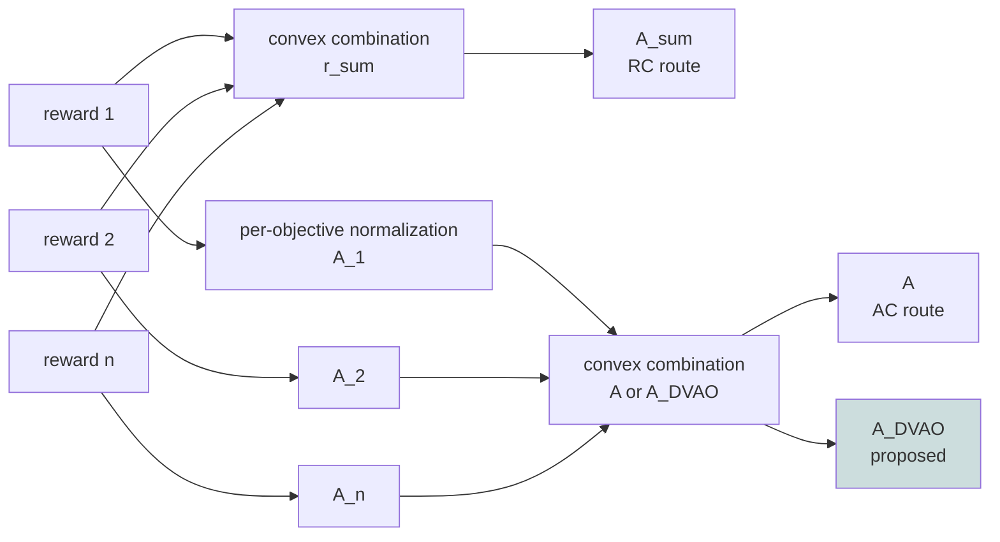
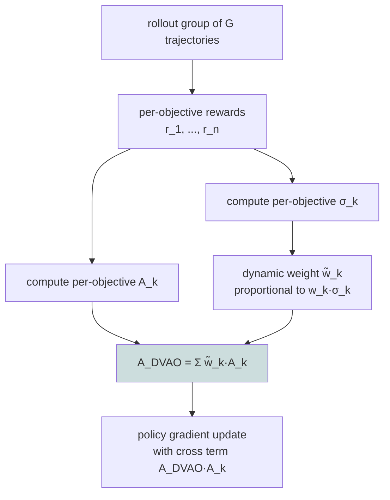

# DVAO: Reward Variance as Dynamic Weights for Multi-objective GRPO

> **Original title**: DVAO: Dynamic Variance-adaptive Advantage Optimization for Multi-reward Reinforcement Learning
> **Authors**: Guochao Jiang, Jingyi Song, Guofeng Quan, Chuzhan Hao, Guohua Liu, Yuewei Zhang
> **Institutions**: Alibaba Cloud Computing
> **Year**: 2026 (arxiv ID 2605.25604)
> **Subject**: cs.CL / cs.LG
> **Link**: https://arxiv.org/abs/2605.25604
> **Reading date**: 2026-05-26

## Reading Notes

### 1. Where this paper sits in the field

GRPO (Group Relative Policy Optimization), proposed by DeepSeekMath in 2024, has by 2026 become the de facto standard for post-training large language models. Its appeal is that it requires no separate value model and instead estimates relative advantage within a sampled rollout group, achieving the same algorithmic skeleton as PPO without the value-model overhead. Strong reasoning models from the past year, such as DeepSeek-R1 and Kimi K2.5, are largely built on GRPO or its variants.

Within the GRPO line itself, a cluster of single-objective improvements has emerged: DAPO introduces dynamic sampling and token-level policy gradients for faster convergence, GSPO shifts the importance ratio from token level to sequence level to reduce variance, and works like GFPO and DLER attempt to inject length signals on the reward side. These works share the assumption that the training objective can be compressed into a scalar reward.

Real applications, however, are almost always multi-objective. A math reasoning model must produce a correct answer and stay within a length budget; a tool-use model must select the right tool and adhere to a strict output schema; a RAG model must be factually correct and concise. Each such near-business setting is a scalarized multi-objective RL problem. There are two standard ways to scalarize. The first, Reward Combination (RC), takes a convex combination of raw rewards and hands the sum to GRPO. The second, Advantage Combination (AC), normalizes each reward into an advantage and combines the advantages; its representative implementation is GDPO.

DVAO sits after the reflection on both. The authors formally prove two facts: RC necessarily produces advantages with larger squared magnitude than AC, leading to training instability; AC controls magnitude but completely ignores cross-objective correlations, making it incapable of dynamically rebalancing objectives during training. DVAO's proposal is to use the empirical reward variance within each rollout group as the basis for the per-objective weight, a fully data-driven, hyperparameter-free scheme.

### 2. What you should be able to answer after reading

- Why does Reward Combination cause training to diverge more often than Advantage Combination? Is this intuition or theorem?
- What is the relationship between reward variance and learning-signal strength? Why does a higher-variance objective deserve more current weight?
- Where exactly does DVAO's implicit cross-objective regularization come from in the derivation?
- On the Pareto frontier, by how much does DVAO actually beat RC / AC / GDPO?
- How hyperparameter-free is this method really? Truly zero, or just fewer?

### 3. Reading prerequisites

We assume the reader is familiar with the basic PPO derivation, has clear intuition for policy gradients, importance sampling, and clipping, and understands GRPO and group-rollout relative advantage estimation. The concepts of multi-objective RL and Pareto frontier should be familiar at least in terminology. The math used is limited to first-order Cauchy-Schwarz and variance expansion.

### 4. Glossary of abbreviations introduced below

- **GRPO** (Group Relative Policy Optimization): a policy optimization algorithm that estimates relative advantage within a rollout group, removing the need for a separate value model.
- **PPO** (Proximal Policy Optimization): the predecessor of GRPO, relying on an independent value model and a clip-style trust region.
- **RC** (Reward Combination): convex-combine raw rewards into r_sum and run standard GRPO. The paper proves this inflates the squared mean advantage.
- **AC** (Advantage Combination): normalize each reward separately into A_k, then convex-combine the A_k into the final advantage. GDPO is the canonical implementation.
- **DVAO**: the method proposed in this paper. Same skeleton as AC, but replaces the static w_k with dynamic weights w̃_k tied to per-objective reward variance in the rollout group.
- **GDPO** (Group Reward-Decoupled Normalization Policy Optimization): the canonical AC implementation, with fixed w_k and batch-wise advantage normalization.
- **BFCL-v4** (Berkeley Function Call Leaderboard, version 4): the comprehensive tool-use benchmark used here, covering single-step, multi-step, real-time execution, irrelevant-tool rejection, and parallel tool selection.
- **rollout group G**: the number of rollouts sampled per query; G = 16 in the experiments.
- **σ_k^i**: the standard deviation of the k-th reward within the rollout group on query x_i; the core quantity driving DVAO's dynamic weights.

## Why this problem is worth solving

Deploying an LLM in a real-world setting almost never reduces to a single optimization objective. A math reasoning model needs the answer to be correct and the reasoning to fit within 4000 tokens; a tool-use model needs the tool to be right and the output to match a strict downstream schema; a RAG model needs factual reliability and brevity. Each of these near-business settings is a scalarized multi-objective RL problem.

In practice, the field's standard treatment has been quite crude. The common approaches reduce to two: either combine the raw rewards in a weighted sum, or combine the advantages in a weighted sum. The first writes in a single line; the second claims to be more stable; both fail on different tasks. A common report is "reward combination causes loss spikes mid-training," and another common report is "advantage combination stalls on one of the rewards." The folk wisdom is that the weights need tuning, which pushes the problem back into manual search.

What this paper contributes is to first formalize the failure modes as theorems: RC necessarily produces larger squared mean advantages than AC, and AC cannot incorporate cross-objective correlations into its update direction. Once these two propositions are established, the question is no longer "RC or AC" but rather: can we obtain a method that is simultaneously more stable than RC and more flexible than AC. Fundamentally, this is an attempt to push multi-objective RL training from "tune the weights by feel" toward "let the rollout data speak."

## I. The Problem

Formally, the multi-objective RL problem is described as follows. Given a query x_i and its rollout group {y_j} for j from 1 to G, each trajectory has n rewards r_1^(i,j), ..., r_n^(i,j) with each individual reward normalized to [0, 1]. We want a policy π_θ that performs well on all n rewards simultaneously.

Reward Combination first builds a scalar total reward r_sum^(i,j) = Σ w_k r_k^(i,j), then takes the standard GRPO advantage:

$$A_{\text{sum}}^{(i,j)} = \frac{r_{\text{sum}}^{(i,j)} - \text{mean}}{\text{std}}.$$

Advantage Combination does the reverse: compute per-reward advantage A_k^(i,j), then convex-combine A^(i,j) = Σ w_k A_k^(i,j).

Which route is "closer to correct"? The authors' first contribution is to translate this question into a comparison of squared mean advantages.

### Proposition 1: RC has squared mean advantage no smaller than AC

The first formal result: for a fixed query x_i,

$$\frac{1}{G} \sum_{j} (A_{\text{sum}}^{(i,j)})^2 \geq \frac{1}{G} \sum_{j} (A^{(i,j)})^2,$$

with equality only when all pairs of advantages are perfectly positively correlated. The proof relies on the fact that, after normalization in the rollout group, each advantage has sample mean 0 and squared mean 1. Expanding the squared mean of the AC advantage yields a value at most 1, with the gap measuring the extent to which the objectives are not perfectly correlated.

The significance: **RC is not a simplified version of AC; it is the version that delivers larger per-step updates**. In a multi-objective setting, "larger" does not necessarily mean "better." On the contrary, it tends to cause gradient spikes early in training. Figure 4.3 in the paper confirms this: the reward standard deviation under RC remains higher than under AC throughout training and never converges down.

### Setup for Proposition 2: AC loses correlation signal

AC looks clean but has a hidden flaw. From the RL gradient perspective, AC's total gradient

$$\nabla_\theta J = \sum_k w_k \nabla_\theta J_k$$

is just a convex combination of n independent single-objective RL gradients, meaning each objective is treated in isolation during updates. AC cannot tell whether two objectives are synergistic or antagonistic. In other words, it assumes no interaction between objectives, which is almost never true in practice.

So the question is no longer "RC or AC" but: can we find an advantage form that **keeps magnitude bounded like AC, yet pulls cross-objective correlation back into the update direction**.

## II. Method

DVAO's answer is concise: in AC, replace the fixed weight w_k with a dynamic weight tied to the rollout-group reward variance for that objective.

### 1. Core definition

Let σ_k^i be the sample standard deviation of the k-th reward in the rollout group on query x_i. Define the dynamic weight

$$\tilde{w}_k = \frac{w_k \sigma_k^i}{\sum_l w_l \sigma_l^i}.$$

DVAO's advantage is the weighted combination using these dynamic weights:

$$A_{\text{DVAO}}^{(i,j)} = \sum_k \tilde{w}_k A_k^{(i,j)} = \frac{\sum_k w_k \sigma_k^i A_k^{(i,j)}}{\sum_l w_l \sigma_l^i}.$$

Intuitively, this gives "higher-variance rewards more weight." Why does reward variance correspond to learning-signal strength? Because a low-variance reward indicates the model has already converged near uniformity on that objective, with marginal training returns nearly zero; a high-variance reward indicates the model has not yet stabilized, and there is more to learn.

### 2. Proposition 2: DVAO's advantage is no larger than RC's

The second result: for every j,

$$|A_{\text{DVAO}}^{(i,j)}| \leq |A_{\text{sum}}^{(i,j)}|.$$

The proof rests on a key identity

$$\sigma_{\text{sum}}^i A_{\text{sum}}^{(i,j)} = \sum_k w_k \sigma_k^i A_k^{(i,j)},$$

combined with Cauchy-Schwarz σ_sum^i ≤ Σ w_k σ_k^i, immediately giving that DVAO's advantage is a scaled-down version of RC's. The bottom line: DVAO matches AC's bounded magnitude, never blows up like RC, and retains the variance-driven flexibility.

### 3. Proposition 3: DVAO contains implicit cross-objective regularization

This is the most important and most interesting result of the paper. The authors compute the partial derivative of A^(i,j) and A_DVAO^(i,j) with respect to the k-th raw reward:

$$\frac{\partial A^{(i,j)}}{\partial r_k^{(i,j)}} = \frac{w_k}{\sigma_k^i} \left(1 - \frac{1}{G} - \frac{1}{G} (A_k^{(i,j)})^2 \right),$$

$$\frac{\partial A_{\text{DVAO}}^{(i,j)}}{\partial r_k^{(i,j)}} = \frac{\tilde{w}_k}{\sigma_k^i} \left(1 - \frac{1}{G} - \frac{1}{G} A_{\text{DVAO}}^{(i,j)} A_k^{(i,j)} \right).$$

The key difference is inside the parentheses. AC's sensitivity scales only with the k-th objective's own squared advantage, meaning each objective's gradient contribution is determined solely by its own performance. DVAO's sensitivity scales with the product "DVAO total advantage times A_k," meaning the k-th objective's gradient contribution is determined by the product of the overall combined advantage and that objective's own advantage.

This cross-objective term has the following physical meaning: if the model performs well overall on this rollout (A_DVAO is large), pushing harder on a single objective k yields larger return; if the model performs poorly overall on this rollout (A_DVAO is small or negative), over-optimizing a single objective k is suppressed. In other words, DVAO automatically writes "global multi-objective performance" into the modulator of "single-objective update direction," **which is equivalent to an implicit, variance-adaptive cross-objective regularizer**.

### 4. Training procedure

DVAO changes only one step of the GRPO pipeline: replace the r_sum-based or fixed-w_k A computation with the DVAO advantage above. Everything else (importance sampling, PPO-style clipping, KL term) is preserved. The code-level change is a few lines.

## III. Experiments

### 1. Setup

Mathematical reasoning uses DAPO-MATH-17k for training and AIME-2024, AIME-2025, MATH500, OlympiadBench, AMC23 for evaluation. The two objectives are accuracy (correct answer) and length (output ≤ 4000 tokens). Models are Qwen3-4B-Base and Qwen3-8B-Base.

Tool-use uses the ToolRL setup with BFCL-v4 evaluation; objectives are tool-use accuracy and format compliance. Models are Qwen2.5-3B-Instruct and Qwen2.5-7B-Instruct.

Baselines: GRPO single-objective (accuracy only), RC, AC, GDPO. Initial weights are equal across all methods, eliminating the counter-argument that DVAO might win simply due to better weight initialization.

Training: AdamW with constant learning rate 1e-6, prompt batch 128, G = 16, 500 steps to convergence, generation length 8192, temperature 0.6, top-p 0.95, run on 8 NVIDIA H20-3e GPUs.

### 2. Main results

Tables 1 and 2 cover five math sets and three BFCL subsets. The core message is: **DVAO achieves the best or tied-best result on every task, every model scale, and every evaluation dimension**. Every baseline fails on at least one dimension:

- GRPO single-objective produces near-zero format compliance on tool-use (no format reward signal)
- RC has higher reward std than AC throughout math training, with visible curve volatility
- AC on 7B tool-use is actually **worse than the base model** (accuracy regresses)
- GDPO produces near-perfect length compliance on math, but at the cost of the lowest accuracy among all methods

DVAO is the only method that simultaneously achieves the highest accuracy and near-perfect length/format compliance.

### 3. Training dynamics

Section 4.3 reveals three observations.

**Accuracy reward**: DVAO's mean curve stays above all baselines throughout training, and its final standard deviation is the lowest among all methods. AC has the highest std throughout. This confirms Proposition 2's prediction: DVAO's advantage magnitude is strictly bounded, producing more stable gradients.

**Length reward**: DVAO's length reward heads almost directly toward 1.0, with final std on 4B at a fraction of other methods' values and on 8B nearly zero. This "std collapse" is exactly what Proposition 3 predicts: accuracy and length are coupled through the cross term, preventing either from dominating the gradient.

**Response length**: all methods start near 800 tokens. DVAO's mean rises fastest and reaches the highest plateau. The curve itself shows more oscillation than RC/AC, but the average converges higher. The authors interpret this as "DVAO's bounded advantage signal prevents runaway exploration while still encouraging productive length growth."

### 4. Pareto frontiers

Section 4.4 is another decisive piece. The authors sweep w_1 ∈ {0.1, 0.3, 0.5, 0.7, 0.9} across both accuracy and auxiliary weights and plot the resulting Pareto frontier in the 2D plane. DVAO's entire frontier sits above all other methods, **not just at one favorable weight combination**.

The failure modes of the baselines are distinct: RC saturates quickly during the weight sweep, AC becomes severely unstable, GDPO oscillates incoherently. DVAO shifts the entire frontier up and to the right on the math task. This means DVAO's discipline advantage is not contingent on any particular weight choice.

Trend-level summary of the main results (precise numbers in Tables 1 and 2 of the paper):

| Task | Model | DVAO vs. strongest baseline (GDPO or AC) |
|---|---|---|
| AIME / MATH500 / OlympiadBench / AMC23 | Qwen3-4B-Base | leads on both accuracy and length |
| same | Qwen3-8B-Base | wider margin, near-perfect length compliance |
| BFCL Live / Non-Live / Multi-Turn | Qwen2.5-3B-Instruct | leads on both accuracy and format |
| same | Qwen2.5-7B-Instruct | AC regresses below baseline; DVAO leads by largest margin |

### 5. A counterintuitive detail

DVAO's advantage does not come from "smarter reward design" but from "weight reallocation." All methods use the same reward functions and the same equal initial weights w_k = 1/n. DVAO claims the entire Pareto frontier purely by rewriting w̃_k at runtime according to σ_k. This suggests something important: many issues that look like reward-design problems in multi-objective RL training are actually advantage-scaling problems.

## IV. Limitations

### 1. Acknowledged by the authors

Appendix E notes two items. First, all experiments are limited to two-objective settings. Whether the variance-driven weighting remains monotonically beneficial under five or more rewards is not shown experimentally; this is left as future work. Second, DVAO is an improvement within GRPO; extension to broader alignment paradigms (DPO, reward modeling) is also future work.

### 2. Visible to a careful reader

A first concern is the assumption that "variance equals learning signal." If a particular reward is intrinsically noisy (for example, an LLM-as-judge hallucination score), high variance does not necessarily mean "learn more here" and may instead pull the gradient toward noise. DVAO has no reward-quality filtering mechanism, so robustness against low-quality rewards remains an open question.

A second concern is computational cost. DVAO must compute n standard deviations and one cross term per step per rollout group, a constant overhead beyond AC. At G = 16 this is negligible. But at smaller G (4 or 8), the sample-σ estimate becomes noisier and DVAO's stability may degrade. This is a boundary case worth following up on.

A third concern is the monotonicity assumption on rewards. The length reward used here is a 0/1 step function (1 if ≤ l, else 0); same for format reward. Variance over Bernoulli rewards in a rollout group follows a slightly different geometry than continuous rewards. Whether DVAO's strong performance on Bernoulli rewards transfers directly to continuous rewards needs more experimental support.

A fourth concern is the dependence on batch-wise normalization. GDPO introduces batch-wise advantage normalization for stability. DVAO bounds the magnitude at the group level, but the paper does not discuss whether additional batch-wise normalization is still needed.

## One Sentence

DVAO uses per-rollout-group reward variance to automatically reweight multi-objective GRPO, both strictly bounding advantage magnitude and implicitly introducing a variance-adaptive cross-objective regularizer through a cross product term.
