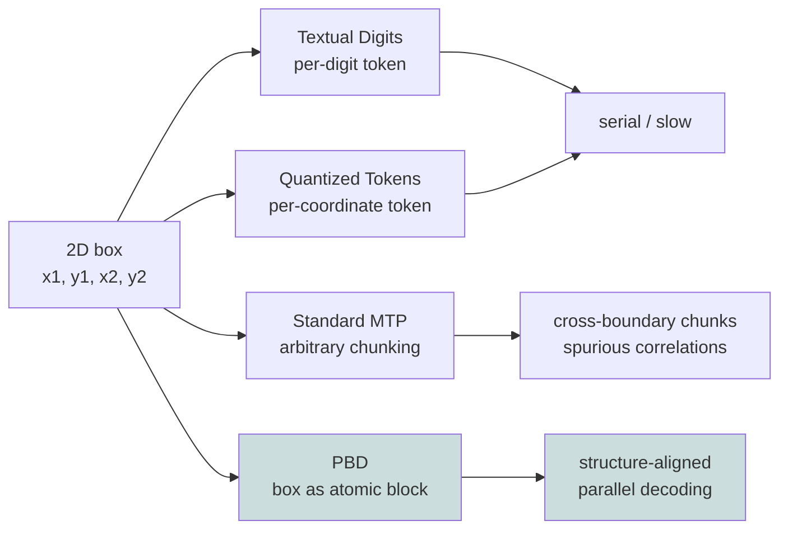
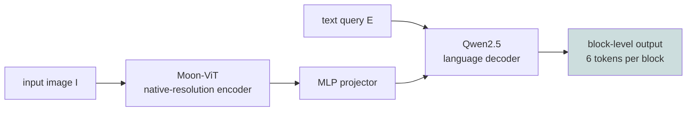
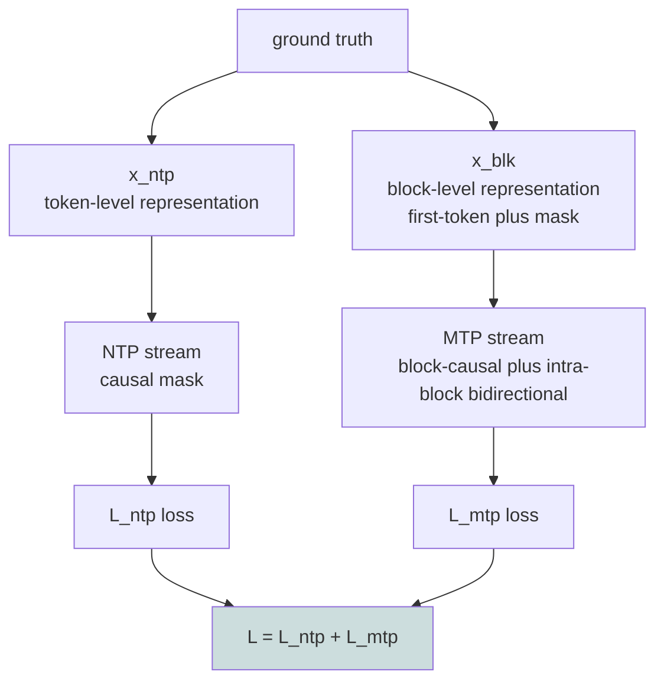
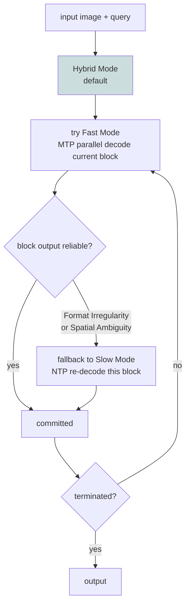

# LocateAnything: Treating a Bounding Box as One Atomic Unit for Parallel Decoding

> **Original title**: LocateAnything: Fast and High-Quality Vision-Language Grounding with Parallel Box Decoding
> **Authors**: Shihao Wang, Shilong Liu, Yuanguo Kuang, Xinyu Wei, Yangzhou Liu, Zhiqi Li, Yunze Man, Guo Chen, Andrew Tao, Guilin Liu, Jan Kautz, Lei Zhang, Zhiding Yu
> **Institutions**: collaboration involving NVIDIA and several academic groups
> **Year**: 2026 (arxiv ID 2605.27365)
> **Subject**: cs.CV / cs.AI / cs.LG / cs.RO
> **Link**: https://arxiv.org/abs/2605.27365
> **Reading date**: 2026-05-27

## Reading Notes

### 1. Where this paper sits in the field

Vision-language models (VLMs) have rapidly absorbed the surface area of traditional vision systems over the past two years. Attaching a handle to a Qwen-VL, InternVL, or SEED1.5-VL and asking it "where is the cat in the image" or "give me the coordinates of the settings button on this screen" is now a standard request. But a VLM is a text generation model. To make it emit coordinates, the dominant practice is to format the bounding box (x1, y1, x2, y2) as a sequence of text tokens and let the model output them via next-token prediction. Pix2Seq and Kosmos-2 established this route; Rex-Omni is the current strongest member of this line.

The two concrete implementations within this route are "Textual Digits" and "Quantized Tokens." The first emits 1024 as four tokens "1", "0", "2", "4"; the second quantizes coordinates into a special token vocabulary and emits x1, y1, x2, y2 in order. Both flatten a two-dimensional geometric object into a one-dimensional token stream. This causes two problems: at inference time the model strictly decodes token by token, producing high latency and low throughput; and the model does not know x1 and y1 are bound to the same box, so it learns only "adjacent-token co-occurrence statistics" rather than the structural coupling between coordinates.

The community's response to slow next-token decoding is Multi-Token Prediction (MTP): Medusa, SDLM, Block Diffusion, and others let the model predict multiple tokens at once. MTP works passably on ordinary text, but it actually hurts performance on box coordinates because these methods are structure-agnostic. They chunk the sequence at arbitrary positions, potentially crossing a box boundary or even a category boundary. The model then learns spurious cross-boundary patterns and accuracy drops.

LocateAnything sits at the intersection of "VLM-based detection / grounding" and "parallel decoding." Its proposal is remarkably simple and effective: **treat the entire bounding box as one atomic unit** and let the model output all of its tokens in a single forward pass. Structure alignment and parallel decoding are addressed together for the first time, yielding gains in both throughput and accuracy.

### 2. What you should be able to answer after reading

- Why is next-token prediction of coordinates a double loss on both throughput and accuracy?
- What is the essential difference between Parallel Box Decoding and traditional MTP (Medusa, Block Diffusion)?
- During joint training, how does the attention mask isolate the NTP stream from the MTP stream?
- What are the trigger conditions for the Hybrid mode's fallback? Why are these two rules sufficient to cover most failure cases?
- In the COCO ablation, which layer of the design contributes the accuracy gain and which contributes the throughput gain?

### 3. Reading prerequisites

We assume the reader is familiar with Transformer attention and KV cache mechanics, understands the standard VLM architecture (vision encoder + projector + LLM decoder), has clear intuition for detection metrics (IoU, F1, mAP), and is comfortable with the causal mask design of next-token prediction. Background on multi-token prediction needs only passing familiarity with Medusa or speculative decoding.

### 4. Glossary of abbreviations introduced below

- **VLM** (Vision-Language Model): Qwen3-VL, Rex-Omni, etc. are used as baselines.
- **NTP** (Next-Token Prediction): the standard autoregressive token output; called Slow Mode in this paper.
- **MTP** (Multi-Token Prediction): parallel decoding that predicts multiple tokens per step; canonical methods include Medusa, SDLM, Block Diffusion.
- **PBD** (Parallel Box Decoding): this paper's core method. Treats an entire bounding box as a fixed-length atomic block of 6 tokens (4 quantized coordinates plus 2 structural tokens) and decodes the whole block in a single parallel step.
- **Textual Digits / Quantized Tokens**: the two classical coordinate encodings. The former emits decimal digits serially; the latter quantizes coordinates into a separate vocabulary and emits them sequentially.
- **Slow / Fast / Hybrid Mode**: the three inference modes proposed here. Slow uses NTP throughout; Fast uses PBD throughout; Hybrid defaults to Fast and falls back to Slow on format or spatial unreliability.
- **BPS** (Boxes Per Second): the throughput unit used in the paper, measured on a single H100 with batch size 1.
- **Moon-ViT / Qwen2.5**: the vision encoder and language decoder used here, sourced from the Kimi vision module and Alibaba's Qwen2.5 series respectively.

## Why this problem is worth solving

Using a VLM as a unified visual front-end has been the most visible engineering trend in the past year. Embodied robots, GUI agents, document understanding, long-tail object detection — domains that used to have their own expert systems are being consolidated under a single general-purpose VLM. The problem is that current general-purpose VLMs carry two costs whenever they perform localization.

The first cost is latency. Qwen3-VL-8B emits roughly one box per second. On a dense image (overhead street scene, shelf inventory, long document) the model can take many seconds to enumerate all targets. This is unacceptable on embedded agents, real-time robotics, or interactive GUIs. Even the current fastest model in this line, Rex-Omni, runs at about 5 BPS, still orders of magnitude slower than traditional specialist detectors at hundreds of BPS.

The second cost is accuracy. Expressing coordinates via text tokens has unfortunate consequences. The model can learn statistical errors such as "in this composition the second digit is often 5," producing context-free pseudo-coordinates. It also struggles at high-IoU boxes because token-to-token coupling cannot be modeled explicitly. Intuitively, x1 should be less than x2; a sequentially generating model has no guarantee. The result is that F1 at IoU = 0.95 (the "high-quality" metric) is generally weak for VLMs.

For a VLM to truly become a unified visual front-end, both costs must be eliminated simultaneously. Faster but less accurate is not acceptable; more accurate but slower is also not acceptable. LocateAnything's answer is direct: treat each box as an atomic unit and emit it in one forward pass. This is fast and accurate at the same time, and it dispenses with per-token modeling weaknesses. Fundamentally, this introduces the notion of a "geometric object" at the LLM's output side rather than forcing geometric objects back into the LLM's token concept.

## I. The Problem

### 1. Formal setup

Given an input image I and a text query E, the model must output a list of localization results, each a (label, box) pair, where box ∈ ℝ⁴ is discretized and normalized to [0, 1000]. In standard VLM implementations this is modeled as next-token prediction:

$$P(\mathbf{y} \mid I, E) = \prod_{t=1}^{T} P(y_t \mid y_{<t}, I, E),$$

where y is the concatenation of all (label, box) tokens.

LocateAnything regroups this sequence into N blocks **B** = (b_1, b_2, ..., b_N), each of fixed length L = 6, and rewrites the joint probability as:

$$P(\mathbf{B} \mid I, E) = \prod_{i=1}^{N} P(b_i \mid b_{<i}, I, E),$$

i.e., block-level autoregression instead of token-level autoregression.

### 2. Failure modes of prior routes

The fundamental issue with the first route (Textual Digits and Quantized Tokens) is that it forcibly splits a coupled geometric unit into multiple independent tokens. To accurately predict the next token the model must encode the implicit state "I am currently drawing edge k of box j" into its hidden state. This is fine in principle, but it means all four coordinates of a box must be generated in a fixed order, and throughput is strictly bounded at one token per step.

The second route (standard MTP) seems to solve the speed problem: have the model emit k tokens per step and throughput scales by k. But the authors reveal a concrete failure mode: when the chunk boundary does not align with the box boundary, the model is forced to learn "x2 of box A correlated with the label of box B" type relationships that carry no structural meaning. Figure 2 in the paper illustrates: after standard MTP training, samples contain malformed outputs like `<box><211></ref><911><887></box>` where structural and coordinate tokens are interleaved. These spurious correlations come back to hurt accuracy.

The third route (diffusion-based LLM) shares the same root cause as MTP.

LocateAnything's response is to **align the MTP chunk boundary with the semantic boundary of a box**. Each parallel-emitted block is then a structurally well-defined unit, not an arbitrary set of k tokens.

## II. Method

### 1. Overall architecture

LocateAnything follows the standard VLM three-stage architecture:

The vision side uses Moon-ViT (from the Kimi vision module), which supports native-resolution input, crucial for dense detection. The language side uses the Qwen2.5 decoder. An MLP projector bridges them.

### 2. Block output format

The output is redesigned as a sequence of fixed-length L = 6 blocks, each of one of four types:

| Type | Content | Purpose |
|---|---|---|
| Semantic Block | tokens for class name or referring expression | encodes language-side identity |
| Box Block | 4 quantized coordinates plus 2 structural tokens (`<box></box>`) | a complete bounding box description |
| Negative Block | explicit placeholder | indicates "queried object absent" |
| End Block | termination token | terminates generation |

Any block with fewer than 6 occupied slots is padded with `<null>`. This keeps tensor shapes aligned for parallel decoding.

### 3. Dual-stream training

Directly parallelizing the output during training would damage the model's causal reasoning ability (since LLM pretraining assumes strict token-level causality). LocateAnything therefore adopts a dual-format training strategy: feed the same ground truth to the model in both forms — an NTP stream (standard token-level causal generation) and a block-wise MTP stream (block-level parallel prediction). The two streams share a prefix (visual tokens + query) but are isolated through a carefully designed attention mask.

The concrete construction: x_all = x_vis ⊕ x_q ⊕ x_ntp ⊕ x_blk. x_blk is built by splitting x_ntp according to block rules. Within each block, only the first token is preserved as context; the remaining tokens are replaced with [mask] tokens, which the model must predict in a single parallel step.

### 4. The three-part attention mask

This is the cleverest piece of the paper. The mask must let both streams share the visual context while preventing leakage between them. The mask is therefore split into three regions.

**Causal attention for NTP**: the shared context (x_vis, x_q) and the NTP sequence (x_ntp) use a standard causal mask. The NTP sequence cannot attend to x_blk, preventing leakage.

**Causal flow across blocks**: inside x_blk, attention across different blocks is strictly causal. The i-th block can attend to the shared context and the first i-1 already-committed blocks, but cannot see future blocks.

**Bidirectional intra-block attention**: within the same block, all tokens have full bidirectional attention to one another. This lets the four coordinates of a box attend to each other and capture constraints like x1 < x2 and y1 < y2.

The final loss is the sum of the cross-entropy losses on the two streams: L = L_ntp + L_mtp.

### 5. Three inference modes

Fast Mode uses PBD throughout, maximum throughput but occasional failures in complex scenes. Slow Mode uses NTP throughout, consistent with stage-1 training, lowest throughput but most stable. Hybrid Mode is the default: default to Fast and fall back to Slow only on a per-block basis when an unreliable output is detected.

"Unreliable" is defined by two concrete rules:

1. **Format Irregularity**: the current block's syntactic structure is invalid (e.g., mixing `<box>` with coordinate tokens).
2. **Spatial Ambiguity**: the top-1 coordinate token probability falls below 0.7, AND the spread of the top-5 coordinate tokens in the [0, 1000] space exceeds 80.

When both conditions are simultaneously true, the fallback fires.

### 6. Large-scale data: LocateAnything-Data

The authors also curate a new training set: 12M unique images, 138M natural language queries, and 785M annotated bounding boxes. Task distribution: general object detection 66.9%, GUI element grounding 16.5%, natural-language referring 7.3%, text localization 3.6%, document and scene layout grounding 3.5%, point-based localization 2.2%.

Training is two-stage: Stage-1 mixes the full 138M for broad capability, Stage-2 reduces general data to 20% and significantly upweights dense-detection sources (MOT20Det, SKU110K, etc.).

## III. Experiments

### 1. Main results

Table 1 (LVIS / COCO) excerpt, throughput in BPS:

| Method | Throughput | LVIS mean | COCO mean |
|---|---|---|---|
| Grounding DINO-Swin-T | — | 38.8 | 56.6 |
| Qwen3-VL-8B | 1.0 | 44.8 | 45.7 |
| SEED1.5-VL | — | 46.7 | 51.4 |
| Rex-Omni-3B | 5.0 | 46.9 | 52.9 |
| **LocateAnything-3B** | **12.7** | **50.7** | **54.7** |

Net gains: +3.8 on LVIS and +1.8 on COCO over Rex-Omni; throughput is 10× Qwen3-VL and 2.5× Rex-Omni.

Dense detection (Dense200 / VisDrone) mean F1 reaches 58.7 and 39.9 respectively; VisDrone is 4.1 points above Rex-Omni.

GUI grounding (ScreenSpot-Pro average) reaches 60.3, **surpassing Qwen3-VL-30B-A3B and GUI-Owl-32B**, both of which are specialized models 10× larger.

Document layout (DocLayNet / M6Doc) mean F1 reaches 76.8 and 70.1, substantially above general VLMs like Qwen3-VL and SEED1.5-VL, and also exceeding Rex-Omni.

Referring expression (HumanRef / RefCOCOg) mean F1 reaches 78.7 and 76.7 / 77.6 (val / test). On HumanRef SEED1.5-VL still leads slightly at 81.6, but LocateAnything is competitive across most metrics.

### 2. Training dynamics and throughput

The 12.7 BPS figure is measured on a single H100 with batch size 1, including all Hybrid Mode fallback overhead. Fast Mode reaches 16.9 BPS in the COCO ablation, but mean F1 drops from 51.6 to 49.6. Hybrid Mode is the default trade-off.

### 3. Ablations

The COCO ablations (Table 6) deliver several clear conclusions.

**Coordinate representation**: Textual 49.1 / Quantized 50.1 / PBD-Slow 52.1. In other words, **treating a box as an atomic unit alone (without changing any other condition) raises the NTP-mode mean F1 by 2 points**.

**MTP formulation**: SDLM-B4 / B6 / B8 score 46.5 / 46.1 / 45.8 respectively, exhibiting a strict speed-accuracy trade-off where larger blocks consistently degrade F1. PBD-Fast in contrast reaches 49.6 at 16.9 BPS. This is the direct contrast between structure-aligned and structure-agnostic chunking.

**Decoding mode**: single-stream-trained Slow 50.1, dual-stream-trained Slow 52.1 (+2.0 improvement), Fast 49.6 (max throughput), Hybrid 51.6 (best trade-off).

**Box output order**: Four orderings (X-Y Corner Order, Center Distance, Area, Random) were tried. X-Y Corner Order performs best. This suggests the choice of output order also has a non-trivial effect on the stability of structured generation.

### 4. A counterintuitive result worth noting

On ScreenSpot-Pro, LocateAnything-3B beats specialized GUI models at 30B and 32B. This is the most striking result in the paper, suggesting that **for tasks dominated by structured output, the correct output form matters more than model scale**. A 3B model with PBD can match or exceed 10×-larger competitors because the latter's gains are eaten by serialization latency and structural mismatch.

## IV. Limitations

### 1. Acknowledged by the authors

The paper explicitly identifies two failure modes of Fast Mode (format irregularity and spatial ambiguity) and partially patches them with Hybrid Mode. But in extreme scenes where the fallback rate is very high, throughput collapses back toward Slow Mode. The paper does not provide specific data for this worst-case scenario.

The LocateAnything-Data construction is detailed only in the supplementary. The main text gives totals and task distribution. Full reproducibility depends on the appendix collection and filtering pipeline.

### 2. Visible to a careful reader

A first concern is incomplete attribution between data scale and architectural contribution. 138M queries is a large training set, an order of magnitude larger than Rex-Omni. The paper provides PBD-only ablation on COCO (50.1 → 52.1 with PBD), but the main-table comparisons use LocateAnything trained on the full 138M against baselines trained on smaller sets. **The marginal contribution of PBD as a method versus the 138M data as an engineering artifact is not rigorously separated**, making it hard for readers to gauge the standalone benefit of PBD on equal data.

A second concern is the fixed block size of 6. When the output object is extended from bounding box to other geometric primitives (polygon, mask, 3D box), the fixed length of 6 may not fit. The paper hints at but does not discuss this.

A third concern is the choice of Hybrid Mode trigger thresholds (top-1 probability < 0.7, top-5 spread > 80). These appear empirical and not robustness-swept across tasks.

A fourth concern is the residual gap to traditional specialist detectors (Grounding DINO, Deformable DETR). LocateAnything-3B reaches 54.7 mean F1 on COCO; DINO-Swin-L stands at 62.1. In other words, "unified VLM replaces specialist detector" on pure detection benchmarks like COCO **is not yet complete**. LocateAnything's edge lies in GUI grounding, document layout, and long-tail LVIS — tasks where VLMs are naturally favored. Pure object detection remains an open problem.

## One Sentence

LocateAnything treats an entire bounding box as a fixed-length atomic block and decodes all its coordinate tokens in one parallel step, removing the latency bottleneck of token-by-token text decoding while avoiding the cross-boundary spurious correlations of standard MTP, yielding simultaneous SOTA on throughput (12.7 BPS) and accuracy.
