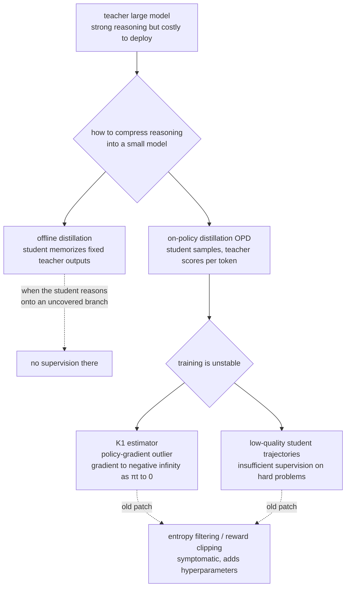
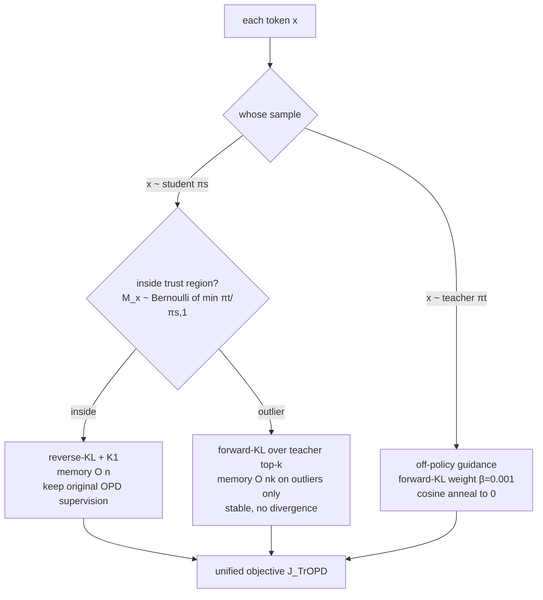
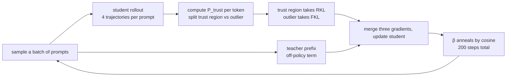

# Trust Region On-Policy Distillation

> **Original title**: Trust Region On-Policy Distillation
> **Authors**: Xingrun Xing, Haoqing Wang, Boyan Gao, Ziheng Li, Yehui Tang
> **Institutions**: not listed on the arxiv abstract page
> **Year**: 2026 (arxiv ID 2606.01249)
> **Subject**: cs.LG / cs.CL
> **Link**: https://arxiv.org/abs/2606.01249
> **Reading date**: 2026-06-03

---

## Before You Read

### Where this paper sits in the field

Moving the reasoning ability of a large language model into a much smaller model has become a prominent thread in large-model post-training over the past two or three years. The motivation is direct: a seven-billion-parameter model can produce a respectable chain of reasoning on math and code problems, but deploying it to a phone, a car, or anywhere sensitive to latency and cost is difficult, whereas a one-to-two-billion-parameter model runs comfortably yet often cannot reason its way through. People therefore want a way to let the large model act as a teacher and compress its reasoning ability into the small model, the student.

The earliest approach was offline distillation: let the teacher solve a problem end to end, collect these solution texts into a fixed dataset, and have the student do supervised fine-tuning on that dataset, imitating token by token. The flaw of this route is unavoidable: when the student actually reasons on its own, it walks onto branches that the teacher's fixed data never covered, and once there it has no supervision to lean on. To patch this gap, the focus of the last year or two shifted to On-Policy Distillation (hereafter OPD): rather than having the student memorize the teacher's answers, the student samples and solves the problem itself, and the teacher scores that self-generated trajectory token by token.

This paper lands on a key crack in that thread. What it sets out to answer is why the on-policy distillation paradigm is so unstable to train, where the root cause actually lies, and how to stabilize it from that root. The method it proposes is called TrOPD (Trust Region On-Policy Distillation).

### What you will be able to answer

After reading this note, you should be able to answer the following:

1. Why on-policy distillation is unstable to train, and under what condition the so-called K₁ estimator drives the policy gradient toward negative infinity.
2. How the "trust region" here is defined concretely, and why it uses an acceptance probability $\min(\pi_t/\pi_s,\,1)$ borrowed from speculative decoding to partition tokens.
3. Why the outlier part switches from reverse-KL to a forward-KL taken from the teacher's perspective, and how that switch resolves the gradient explosion.
4. What separate problem off-policy guidance (teacher-prefix guidance) addresses, and why it is annealed to zero over training.
5. How much TrOPD improves over the OPD, EOPD, and REOPOLD baselines on math, code, and STEM.

### Assumed background

This note assumes you are familiar with how a language model generates token by token autoregressively, what supervised fine-tuning (SFT) is, the basic notion of KL divergence, and the intuition of policy gradients, that is, "sample a trajectory and adjust the probability of sampling it according to some score." It does not assume you have done knowledge distillation, nor that you have read the details of speculative decoding or the Monte Carlo estimators of KL divergence (the so-called k1, k2, k3 estimates); these are introduced with a short setup before they carry any explanatory load.

### Abbreviations on first use

- **OPD** (On-Policy Distillation): the distillation paradigm in which the student samples its own trajectories and the teacher scores them token by token; the paper's starting point and main point of comparison.
- **TrOPD** (Trust Region On-Policy Distillation): the method proposed here.
- **EOPD**: a baseline variant that adds entropy filtering on top of OPD, stabilizing training by discarding high-entropy tokens.
- **REOPOLD**: a baseline OPD variant with reward clipping, stabilizing training by truncating oversized penalty signals.
- **AOPD**: a concurrent work in the adaptive-OPD family, used here as a parallel comparison.
- **KL** (Kullback-Leibler divergence): an asymmetric measure of the difference between two probability distributions.
- **RKL / FKL**: reverse-KL and forward-KL, opposite in direction; the text explains below why each is used in its own place.
- **K₁ estimator**: an estimate of KL divergence from a single sampled token, proportional to $\log(\pi_s/\pi_t)$; the paper shows it is unstable under severe distribution mismatch.
- **AIME / AMC**: two evaluation benchmarks made of math-competition problems.
- **GPQA** (Graduate-level Google-Proof Q&A): a graduate-difficulty science question-answering benchmark deliberately resistant to search-based answering.
- **LiveCodeBench**: a code-generation benchmark; **MMLU-Redux** and **IFBench** are benchmarks for general knowledge and instruction following respectively.
- **speculative decoding**: a generation-acceleration technique whose core is an acceptance probability $\min(\pi_t/\pi_s,1)$ deciding whether to accept a draft token; the paper borrows this acceptance probability to define the trust region.

---

That a large model can write layered reasoning on math and code problems is no longer surprising; the genuinely hard part is that it is expensive. A model that truly solves problems starts at seven billion parameters and up, occupying large amounts of memory and incurring noticeable latency per problem, which an edge device can hardly bear. By contrast a one-to-two-billion-parameter small model runs lightly, yet often cannot push a slightly harder problem through. Transferring the large model's reasoning ability to the small one therefore carries both research value and direct deployment value.

The effort in this direction over the past few years has broadly moved from offline to online. Offline distillation has the student imitate fixed text the teacher generated; it is simple and controllable, but it has an inescapable shortcoming: when the student actually reasons it walks onto paths the teacher's data never covered, and the moment it steps off it loses supervision. On-policy distillation arrives precisely to patch this shortcoming, letting the student receive token-level teacher scoring on its own sampled trajectory, so that supervision always hugs the path the student will really take. The trouble is that once this paradigm runs, it is as hard to tame as reinforcement learning: the student inevitably samples tokens the teacher considers nearly impossible, and it is exactly there that the supervision signal suddenly goes out of control. The few old patches, such as filtering tokens by entropy or clipping oversized penalties, only press the symptom down. They neither cure the root nor avoid introducing extra hyperparameters to tune. This is where the paper goes after the root cause.

## I. The Problem

To state the problem clearly, first lay out the on-policy distillation setting. In it the student model is written $\pi_s$ and the teacher model $\pi_t$. At each training step the student first autoregressively samples a full reasoning trajectory for a problem, and every token on that trajectory comes from the student's own distribution $\pi_s$. The teacher then gives its own probability for each token on this trajectory, and the distillation objective is to pull the student's distribution at those positions toward the teacher. The direction of pulling is usually measured by reverse KL, that is $\mathrm{KL}(\pi_s \,\|\, \pi_t)$, because the samples come from the student and computing this divergence from the student distribution is natural.

Next is the first and more lethal bottleneck the paper diagnoses. To compute this reverse KL in practice, one does not enumerate the whole vocabulary but uses the single sampled token for a Monte Carlo estimate, an estimate called the K₁ estimator whose value is proportional to $\log\big(\pi_s(x)/\pi_t(x)\big)$. The trouble lies right here: when the student samples a token $x$ that the teacher considers nearly impossible, that is when $\pi_t(x)$ approaches zero, the vanishing denominator drives this logarithmic term toward positive infinity, and on the policy gradient this becomes what the paper writes as $\nabla\mathcal{J}\to -\infty$. In other words, as soon as the student occasionally takes a wrong step and samples a token the teacher strongly rejects, the gradient from that step becomes abnormally large and overturns the whole optimization. The paper calls these abnormally large gradients policy-gradient outliers.

The second bottleneck is milder but equally real. The student is confined to learning on the trajectories it sampled itself, and on problems that are inherently hard the student's own generations are typically low in quality, so the effective supervision the teacher can provide on such low-quality trajectories is quite limited. A student that has never sampled a correct solution will never receive a signal about the correct solution.

Putting the two together explains why simple patches are not enough. Filtering by entropy discards information and adds a threshold to tune; clipping by reward merely truncates the exploding tail. Neither touches the root question of why this signal explodes in the first place. The figure below lays out the thread from offline to online distillation and on to the instability and its various patches.

## II. Method

TrOPD's core idea is to stop applying one and the same supervision uniformly to every token, and instead first judge which region a token falls into, then decide how to supervise it. It splits tokens into two classes: one falls inside a "trust region" where the teacher's supervision is reliable, and the other consists of outliers where the student and teacher distributions are severely mismatched, so that applying the original reverse KL directly would trigger the explosion of the previous section.

### How the trust region is drawn

Membership in the trust region is decided by a Bernoulli random variable $M_x$ whose success probability is written

$$P_{\text{trust}}(x) = \min\left(\frac{\pi_t(x)}{\pi_s(x)},\; 1\right), \qquad M_x \sim \text{Bernoulli}\big(P_{\text{trust}}(x)\big).$$

This expression is not designed out of thin air; it is exactly the acceptance probability in speculative decoding. Its meaning is intuitive: if the teacher gives a token a probability no lower than the student does, that is $\pi_t(x)\ge\pi_s(x)$, then the ratio caps at one and the token almost certainly falls into the trust region; conversely, the more the teacher disfavors the token, the smaller the ratio, the lower its probability of entering the trust region, and the more it tends to be handled as an outlier. The statement "keep the original supervision where the teacher still approves, and handle separately where the teacher strongly disapproves" is thereby encoded naturally into a single probability. Use $\bar{M}_x = 1 - M_x$ for the class that falls outside the trust region, that is, the outliers.

### Three components composed into one objective

With this partition, the full TrOPD objective is the sum of three terms. For clarity, each term below is annotated with which part it governs:

$$\mathcal{J}^{\text{TrOPD}} = \underbrace{-\,\mathbb{I}[x\sim\pi_s]\,M_x \log\frac{\pi_s}{\pi_t}}_{\text{trust region: on-policy, reverse-KL}} \;\;\underbrace{-\,\mathbb{I}[x\sim\pi_s]\,\bar{M}_x \!\!\sum_{v\in\mathcal{V}_k^T}\!\!\pi_{t,v}\log\frac{\pi_{t,v}}{\pi_{s,v}}}_{\text{outlier: on-policy, forward-KL}} \;\;\underbrace{-\,\beta\,\mathbb{I}[x\sim\pi_t]\log\frac{\pi_t}{\pi_s}}_{\text{off-policy guidance}}$$

The first term governs the trust region. Here the token comes from student sampling ($x\sim\pi_s$), uses reverse KL with the K₁ estimator, and costs $O(n)$ in memory. This part is essentially the original on-policy distillation, because inside the trust region the teacher's supervision is already reliable and there is no need to change it.

The second term governs the outliers, and this is the single most important replacement in the paper. The token is still sampled by the student, but once judged an outlier the supervision switches from reverse KL to forward KL, computed from the teacher's perspective over the top-$k$ candidates of the teacher's vocabulary, namely $-\sum_{v\in\mathcal{V}_k^T}\pi_{t,v}\log(\pi_{t,v}/\pi_{s,v})$. The reason this switch stops the explosion lies in the opposite directions of the two KLs. Reverse KL starts from the specific token the student sampled, and once that token has near-zero probability under the teacher, the signal diverges; forward KL instead weights by the teacher's probabilities $\pi_{t,v}$ and sums over the candidates the teacher considers important, which amounts to the teacher actively telling the student where to place probability mass, rather than passively waiting for the student to sample a bad token and then imposing a divergent penalty. Its memory cost is $O(nk)$, but it is paid only on outlier tokens, and when the teacher and student distributions converge so that $\mathrm{KL}(\pi_t\|\pi_s)\to 0$, this term vanishes automatically.

The third term is off-policy guidance, aimed at the milder but real bottleneck of the first section, namely the student being trapped in its own low-quality trajectories. The token of this term comes from teacher sampling ($x\sim\pi_t$), using a forward KL with weight $\beta=0.001$ to have the student imitate prefixes the teacher generated itself, mixing a bit of high-quality demonstration into the student's own clumsy trajectories. It is annealed to zero over training by a cosine schedule, because this term inherently departs from the on-policy setting: using it early to pull the student out of poor initial trajectories has value, while later it should yield to genuinely on-policy signal, so that the student does not over-rely on the teacher's ready-made trajectories.

The figure below draws how each token is routed to the three components.

Embedding this flow into the training loop, each step looks like the figure below.

## III. Experiments

The experiments run along two lines. The single-domain line does only math, with training data taken from the math subset of OpenThoughts3 and evaluation placed on the three competition sets AIME 2024, AIME 2025, and AMC 2023, each run thirty-two times and averaged to suppress variance. The students are the two small models DeepSeek-Qwen2.5-1.5B and Qwen3-SFT-1.7B, and the teacher is Skywork-OR1-Math-7B. The multi-domain line brings math, code, and science into training together, and beyond the three math sets adds LiveCodeBench v6 for code, GPQA Diamond for science question answering, MMLU-Redux for general knowledge, and IFBench for instruction following. Training uniformly runs two hundred optimization steps at learning rate $5\times10^{-6}$, with one hundred twenty-eight prompts per batch and four trajectories per prompt, a maximum generation of 8096 tokens per trajectory, and the outlier term computed over the top sixty-four candidates of the teacher vocabulary.

Consider first the main result on single-domain math. On the Qwen3-SFT-1.7B student the un-distilled starting point averages only 39.87, the original on-policy distillation lifts it to 48.29, and TrOPD goes further to 51.73.

| Method | AIME 24 | AIME 25 | AMC 23 | Avg. |
|--------|---------|---------|--------|------|
| Qwen3-SFT-1.7B (start) | 35.41 | 26.45 | 68.90 | 39.87 |
| OPD | 48.02 | 40.72 | 81.79 | 48.29 |
| **TrOPD** | **52.08** | **44.06** | **83.04** | **51.73** |
| vs OPD | +4.06 | +3.34 | +1.25 | +3.44 |

Consider next the multi-domain result with the DeepSeek-Qwen2.5-1.5B student. Here TrOPD is compared not only against the original OPD but against the stronger REOPOLD baseline, raising the average from OPD's 37.11 and REOPOLD's 38.79 to 40.63.

| Method | AIME 24 | AIME 25 | AMC 23 | LiveCodeBench | GPQA | Avg. |
|--------|---------|---------|--------|---------------|------|------|
| OPD | 35.83 | 29.16 | 75.39 | 17.14 | 28.03 | 37.11 |
| REOPOLD | 36.97 | 30.83 | 75.78 | 18.29 | 32.07 | 38.79 |
| **TrOPD** | **38.54** | **32.50** | **77.03** | **18.86** | **36.24** | **40.63** |
| vs OPD | +2.71 | +3.34 | +1.64 | +1.72 | +8.21 | +3.52 |

Broken out by direction, the gains the paper reports over the original OPD are 3.34, 4.00, 5.11, and 6.18 points on math, code, instruction following, and STEM respectively. Worth noting is the large +8.21 gain on the GPQA science question answering, which falls exactly in the hard-problem region where student and teacher distributions most easily mismatch severely, and exactly where the outlier handling should be most effective.

The most convincing piece of the ablation is taking apart, term by term, how the outliers should be handled. On math, for example, simply masking the outliers lifts the average from the baseline's 46.79 to 47.72; switching to the paper's forward-KL estimate lifts it again to 49.00; finally adding off-policy guidance reaches 49.85.

| Variant | AIME 24 | AIME 25 | AMC 23 | Avg. |
|---------|---------|---------|--------|------|
| OPD baseline | 35.83 | 29.16 | 75.39 | 46.79 |
| + Mask Outlier | 37.08 | 30.62 | 75.46 | 47.72 |
| + FKL Outlier | 39.16 | 29.89 | 77.96 | 49.00 |
| **TrOPD (FKL + off-policy)** | **38.54** | **32.50** | **78.51** | **49.85** |

This comparison shows the forward-KL outlier estimate beats simple masking and beats clipping. At the same time the paper reports an observation in the opposite direction: the old patch of entropy filtering does not help but drags performance down, with the version that drops 20% of tokens by entropy scoring only 36.90 on average. Finally, compared with the concurrent AOPD, TrOPD's 40.63 slightly exceeds AOPD's 39.79, and combining the two reaches 41.67 further, indicating that these two improvement routes do not conflict.

## IV. Limitations

The limitation the paper itself concedes centers on one point: the absence of studies that truly deploy and apply these small reasoning models. The authors admit that training genuinely high-performing small reasoning models often requires adding the so-called mid-training stage before post-training, whereas this work improves only the OPD stage within post-training, and evaluates only the two students DeepSeek-Qwen2.5-1.5B and Qwen3-SFT-1.7B. In other words, without folding in pre-training and mid-training together, the performance ceiling this method can reach is itself constrained.

Beyond the one the authors name, several potential issues are visible after reading. First, the method introduces the $O(nk)$ memory and compute cost of the outlier term; although the paper stresses it is paid only on outlier tokens and takes $k=64$, just how large a fraction the outliers are, and whether this cost stays controllable at larger scale, are not characterized quantitatively. Second, the trust-region partition rests entirely on the ratio $\min(\pi_t/\pi_s,1)$, whose reliability in turn depends on the quality of the teacher's probabilities; once the teacher is itself poorly calibrated in some region, a wrong trust-region partition would admit supervision that should not be trusted, a risk the paper does not develop. Third, all conclusions come from one or two 7B-scale teachers paired with 1.5B to 1.7B students, and whether this acceptance-probability partition still holds when the teacher-student size gap is larger, or the teacher is weaker, remains open.

## One Sentence

It traces the instability of on-policy distillation to the K₁ estimator's gradient explosion at distribution mismatch, then stabilizes the outliers with a trust-region partition plus a teacher-side forward KL, so that a small model inherits a large model's reasoning more stably.
