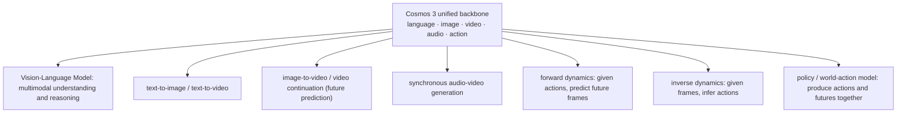
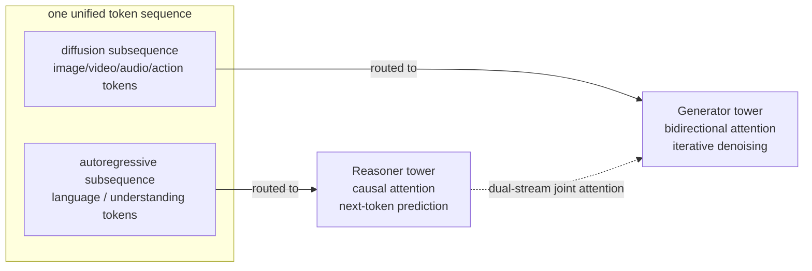
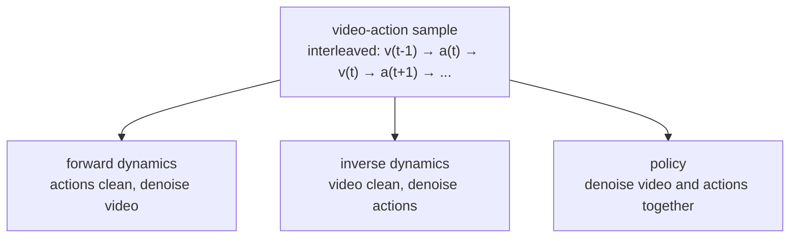
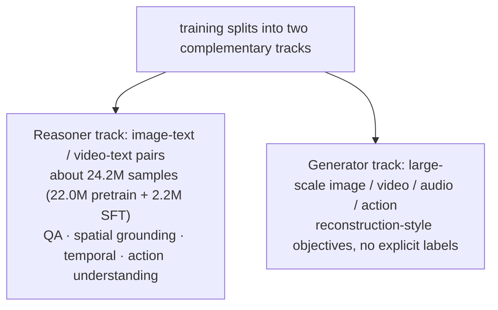

# Cosmos 3: Omnimodal World Models for Physical AI

> **Original title**: Cosmos 3: Omnimodal World Models for Physical AI
> **Authors**: NVIDIA, with 291 listed authors, including Ming-Yu Liu, Jim Fan, Yuke Zhu, Sanja Fidler, Song Han, Jan Kautz, and Marco Pavone
> **Institutions**: NVIDIA
> **Year**: 2026 (arXiv ID 2606.02800)
> **Subject**: cs.CV / cs.AI / cs.LG / cs.MM / cs.RO
> **Link**: https://arxiv.org/abs/2606.02800
> **Reading date**: 2026-06-04

## Reading Guide

### Where this work sits

To let robots or self-driving cars, the kind of systems we call Physical AI, genuinely learn to act in the real world, the field has for several years followed a path of division of labor. A single system usually has to stitch together several independent models: a Vision-Language Model (VLM) to understand the scene and produce a plan, a video generation model or a forward dynamics model to predict what the world would look like if the agent acted in a certain way, and then a Vision-Language-Action model (VLA) or a World-Action Model (WAM) to turn the plan into a concrete sequence of actions. Each piece is sound on its own, yet once they are combined, their interfaces, representations, and compute all go their separate ways, which is both heavy and wasteful.

Cosmos is NVIDIA's series of world models for Physical AI, and earlier versions already laid groundwork on the line of using generative models to simulate the world. What this paper, Cosmos 3, wants to answer is a further question: can that entire division-of-labor stack be folded into a single network? It places five modalities, language, image, video, audio, and action, into one unified architecture that can both understand and generate. As a result, the same model, depending on how its input and output are configured, can play many roles in turn: a VLM, a text-to-image generator, a text-to-video generator, image-to-video, synchronous audio-video generation, forward dynamics, inverse dynamics, and a policy model.

### What you will be able to answer

After reading this note, you should be able to answer the following:

1. Why does Physical AI need understanding and generation to be present at the same time, and why is splitting them into two separate model families not good enough?
2. What exactly is Cosmos 3's dual-tower Mixture-of-Transformers (MoT) structure, and why can language run autoregressively while the other modalities run by diffusion denoising, yet still live in the same sequence?
3. How is action encoded as a modality on equal footing with text and pixels, and what is the difference, at training time, among the forward dynamics, inverse dynamics, and policy modes?
4. What scales does Cosmos 3 come in, and why does the parameter count end up doubled relative to the language model it is built on?
5. What level does it reach on understanding, image and video generation, and robot policy, compared with closed Gemini, open Qwen3-VL, Veo, and π0.5?

### Prerequisites

This note assumes familiarity with the basic structure of the Transformer, the idea of self-attention, and the rough notion of diffusion models, which recover an image or video by denoising step by step from noise. It also assumes broad familiarity with how vision-language models cut a picture into patches and concatenate them with text tokens before feeding them into a Transformer. It does not assume that the reader has specifically worked on robot control or world models. The more specialized parts, such as the action representation and the dual-tower attention, are each set up before they are unpacked below.

### Glossary of abbreviations

- **Physical AI**: agents that perceive, reason, and take actions in the real physical world, typically robots and self-driving cars
- **VLM (Vision-Language Model)**: a model that looks at images or video and answers or reasons in language
- **VLA (Vision-Language-Action Model)**: a model that outputs actions directly on top of vision and language
- **WAM (World-Action Model)**: a model that both predicts how the world evolves and produces actions
- **MoT (Mixture-of-Transformers)**: an architecture that places two sets of Transformer parameters in each layer and routes tokens to them by type
- **AR (Autoregressive)**: token-by-token next-token prediction, the standard mode of language models
- **Diffusion / denoising**: a generation mode that recovers images, video, or audio by repeatedly denoising from pure noise
- **VAE (Variational Autoencoder)**: an encoder that compresses images, video, or audio into a compact latent and can decode it back
- **ViT (Vision Transformer)**: a visual encoder that cuts an image into patches and processes them with a Transformer
- **FD / ID (Forward / Inverse Dynamics)**: forward means predicting future frames given actions, inverse means inferring actions given frames
- **SE(3)**: the mathematical group of rigid-body poses (translation plus rotation) in three-dimensional space, used to represent the pose of an object or an end-effector
- **SFT (Supervised Fine-Tuning)**: targeted fine-tuning with labeled data after pretraining
- **T2I / T2V / I2V**: text-to-image / text-to-video / image-to-video
- **RoboArena**: a benchmark that evaluates and ranks robot policy models against one another

## I. The Problem

Putting a robot directly into the real world to train is slow, expensive, and potentially dangerous. A household robot learning to clear a dining table, if it had to learn purely by trial and error, would already incur an unacceptable cost from the few stacks of plates it breaks. The common approach in the field is therefore to learn first in a simulated world and then transfer to reality. Yet the moment one tries to build such a training facility, it becomes clear that the agent needs two capabilities that are really two sides of one coin: first, understanding, inferring semantics, spatial relations, and how things move from the partial scene it observes; and second, generation, predicting and simulating the frames that might come next, so as to judge how it should move.

The problem is that past practice has almost always handed these two tasks to separate models. Understanding goes to a discriminative VLM, simulating the future goes to video generation or forward dynamics models, and producing actions goes to a VLA or a World-Action Model. Return to the table-clearing example: the robot must first use a VLM to locate the dishware and generate a plan, then use a VLA or WAM to generate the action sequence, and also use a forward dynamics model to simulate and evaluate how the world would change at each step. Three or four models each running on their own, with incompatible representations and duplicated compute, is awkward and costly as engineering.

The reason it is worth merging them is that these two capabilities depend on each other in the first place: understanding a scene is inseparable from reasoning about what comes next and the consequences of actions, while generating a plausible future requires a compact, structured representation of the world and of one's own behavior. Splitting understanding and generation apart amounts to forcibly cutting this dependency. The starting point of Cosmos 3 is to reconnect that severed link with a single, scalable framework.

To put the motivation into a clear technical statement, what Cosmos 3 sets out to solve is whether a single network can natively cover all the core capabilities a Physical AI agent needs, without building a separate model for each task and without changing the architecture when switching tasks.

Here "all the core capabilities" specifically means: serving as a VLM for multimodal understanding and reasoning; serving as a text-to-image model, a text-to-video model, image animation (image-to-video), future prediction (video-to-video), synchronous audio-video generation, and other generators; and serving as a World-Action Model that simultaneously predicts actions and simulates how the environment evolves under those actions. In other words, the way input and output are arranged determines which class of model it becomes, while underneath it is one set of parameters.

Prior approaches fall roughly into three lines, each with its strengths and gaps. The first is the discriminative vision-language model, strong at seeing and reasoning but unable to generate futures, so it cannot answer "what happens if I keep doing this." The second is video generation and forward dynamics models, strong at simulating how frames evolve but lacking language-level reasoning and planning, so they struggle to organize a full behavior from a single instruction. The third is VLAs and World-Action Models, able to wire perception directly to action but often treating the "simulate the world" part thinly, or relying on an external world model to do the evaluation. Each line patches one piece, yet none truly places understanding, simulation, and execution into a single representation. What Cosmos 3 aims to do is exactly to collect these three pieces into one backbone.

The diagram below shows the full picture of this "unified backbone": the same Cosmos 3, depending on how input and output are configured, presents itself externally as entirely different classes of model.

## II. Method

The core of Cosmos 3 can be unpacked into three things: first, each modality's own encoder projects the different modalities into one shared representation space; then a dual-tower Mixture-of-Transformers processes this intermixed token sequence; and finally a dedicated class of action tokens brings the physical world's control signals in. Each is developed below.

### Modality encoders: putting five things into one space

For any input, whether text, image, video, audio, or action, the first step is to embed it into a shared representation space using that modality's encoder. So that the shared Transformer parameters can tell which modality they are processing, every non-language modality is given an additional learnable, modality-specific embedding vector as a marker before entering the backbone.

Image and video deserve detail here, because they use two different encoders, serving "seeing" and "generating" respectively. For understanding, the encoder is a ViT pretrained with vision-language alignment, with a 16×16 patch size, followed by a two-layer MLP that merges adjacent 2×2 tokens and projects them into the Transformer's latent space; it is trained jointly with the backbone. For generation, the encoder is the video VAE from Wan2.2-TI2V-5B, which compresses 4× in time and 32×32 in space, and is kept frozen during training. One reads frames into semantics, one compresses frames into a generatable latent, and their division of labor is clear.

Audio goes through an audio VAE: 48kHz stereo raw audio is encoded with a hop size of 1920, yielding 25 tokens per second, and it too is frozen during training. All of these non-text modality tokens are finally projected into the Transformer's hidden dimension by a linear layer before entering the backbone.

### Action: a modality treated as a first-class citizen

One substantial design choice in Cosmos 3 is to treat action as a core modality on equal footing with text and pixels, introducing a dedicated class of action tokens. Its definition is direct: given two adjacent segments of video tokens, an action token $a_t$ represents the transition from the previous state $v_{t-1}$ to the current state $v_t$. That is, an action is understood as the cause that changes the world state, sitting between adjacent frames.

The difficulty is that the control spaces of different bodies differ enormously: a self-driving car uses steering commands, a robot uses joint trajectories, a person uses body poses, and a camera uses spatial transforms. Cosmos 3 maps them all onto one action interface, assembled from a few shared geometric components: the "ego pose" of the agent's main observation frame, the "effector pose" of the end-effectors, and a component for grasp state. A pose is represented by 3-dimensional translation plus 6-dimensional rotation, 9 dimensions in total, and is written as a relative pose, a pseudo-action derived from state differences, which sidesteps the low-level layer of controller details such as PID parameters. Different bodies therefore land on different dimensionalities, for example 9 dimensions for a self-driving car, 10 for a single-arm robot, 20 for a dual-arm robot, and 29 for a humanoid, and "domain-aware input and output projections" absorb these length differences while preserving a shared semantic space.

### The dual-tower Mixture-of-Transformers: one sequence, two ways of generating

The backbone is the skeleton of this paper and its cleverest part. It has to hold two generation styles that are normally hard to reconcile: language is accustomed to autoregression, predicting one token at a time, while images, video, audio, and actions are better suited to diffusion, recovering by repeated denoising from noise. Cosmos 3's answer is the dual-tower structure of the Mixture-of-Transformers: every Transformer decoder layer holds two independent sets of parameters, one called the Reasoner, which processes the autoregressive tokens in the sequence, and one called the Generator, which processes the diffusion tokens. Both sets are initialized from a pretrained vision-language model, so the model inherits strong language and visual reasoning from the start and then learns to generate high-fidelity frames on top of it.

Although the two towers have independent parameters, their tokens must communicate, and this is done by "dual-stream joint attention." The rule has two halves: tokens in the autoregressive subsequence use causal attention only within the autoregressive subsequence, where each token attends only to those before it, fully consistent with the text-generation property inherited from the VLM; while tokens in the diffusion subsequence use full (bidirectional) attention, whose keys and values are the union of the autoregressive and diffusion tokens. In this way each diffusion token can freely reference the text prompt from the autoregressive segment and also attend to all other conditional and diffusion tokens, thereby maintaining consistency in time and space. At inference, language tokens are still generated one by one by next-token prediction, while the other modalities are generated by iterative denoising.

With this structure, understanding and generation appear in the same frame within one sequence. Even better, the action mode can be switched flexibly by which tokens are clean and which are noised: setting action tokens clean and denoising the video tokens gives forward dynamics (predicting future frames from actions); setting video clean and denoising the actions gives inverse dynamics (inferring actions from frames); denoising both gives policy mode (producing actions and futures together). The same set of weights, with a different noising configuration, yields a different task.

### Three scales, and why the parameters double

Cosmos 3 is trained at three scales, spanning computational budgets from on-device to datacenter: Edge is a 4B-parameter model built on a 2B dense Transformer, Nano is a 16B-parameter model built on an 8B dense Transformer (adapted from Qwen3-VL 8B), and Super is a 64B-parameter model built on a 32B dense Transformer (adapted from Qwen3-VL 32B). This paper releases Nano and Super, with Edge left for a later release.

There is a point here that looks odd at first glance but is natural once understood: why does a variant based on a 32B language model end up at 64B parameters? The answer lies in the dual-tower structure. Every layer maintains both the Reasoner and the Generator sets of parameters at once, which doubles the original dense parameter count. What this buys is understanding and generation coexisting in one body; the cost is a doubling of parameters and inference overhead, a point revisited under Limitations.

### Training data: two complementary tracks

Because the two towers play different roles, training data is split into two tracks. The Reasoner track uses paired vision-language data, such as image-text and video-text pairs, to support tasks like question answering, spatial grounding, temporal reasoning, and action understanding; its data curriculum holds about 24.2M samples, of which 22.0M are for pretraining and 2.2M for supervised fine-tuning toward Physical AI. The Generator track uses large-scale corpora of images, video, audio, and actions, trained with reconstruction-style objectives and not relying on explicit labels. Both tracks adopt a multi-stage curriculum, first building a general foundation and then progressively introducing more specialized domain data. It is worth noting that, to label the training data finely enough, the authors did not directly use an off-the-shelf VLM but instead trained dedicated captioning models by LoRA fine-tuning of Qwen3-VL-8B, using a "quadrant-scan" approach that describes regions separately and organizing annotations with structured JSON fields.

## III. Experiments

Cosmos 3's evaluation is laid out broadly, spanning both understanding and generation across several fronts. The table below organizes the overview from the paper's Table 1; an asterisk denotes a post-trained variant and a dagger denotes a closed model. The understanding side is scored on four dimensions, General, Robotics, Smart infrastructure, and Driving, while the generation side covers text-to-image, text-to-video, image-to-video, audio, plus robot forward dynamics and robot policy.

| Model | General | Robotics | Smart infra. | Driving | T2I | T2V | I2V | Audio | FD (robot) | Policy (robot) |
|---|---|---|---|---|---|---|---|---|---|---|
| Cosmos3-Super | 73.7 | 57.8 | 62.6 | 79.3 | 91.36* | 80.0 | 82.8 | 7.31 | 26.0* | - |
| Cosmos3-Nano | 69.6 | 55.1 | 61.0 | 76.0 | 84.61 | 79.4 | 82.7 | 7.34 | 25.5* | 39.7* |
| Gemini 3.1 Pro† | 77.5 | 58.2 | 58.6 | 47.2 | | | | | | |
| Qwen3-VL-32B | 72.8 | 52.6 | 56.1 | 40.7 | | | | | | |
| Gemma-4-31B | 69.8 | 51.0 | 51.3 | 36.6 | | | | | | |
| Gemini 3 Pro Image† | | | | | 90.85 | | | | | |
| Qwen-Image-2512 | | | | | 84.25 | | | | | |
| Veo-3.1† | | | | | | 79.1 | 82.6 | 7.45 | | |
| Wan2.2-A14B | | | | | | 78.0 | 81.3 | | | |
| Ctrl-World | | | | | | | | | 23.0 | |
| π0.5 | | | | | | | | | | 28.1 |

A few comparisons are worth pulling out. On the understanding side, Cosmos3-Super scores 73.7 on the General dimension, slightly below the closed Gemini 3.1 Pro at 77.5, but it leads on the dimensions tied directly to Physical AI: Smart infrastructure 62.6 against 58.6, and Driving an emphatic 79.3 against 47.2, far ahead of the general large model. This indicates that feeding physical-world data and the action modality into the same model genuinely yields an advantage on physical tasks, rather than on general ability at large.

On the generation side, the post-trained Cosmos3-Super reaches 91.36 on text-to-image, slightly above the closed Gemini 3 Pro Image at 90.85, on which basis the authors call it the best open-source text-to-image model at the time; text-to-video at 80.0 and image-to-video at 82.8 are roughly on par with the closed Veo-3.1 (79.1 and 82.6). On the hardest front, robotics, Cosmos3-Nano's policy score of 39.7 is clearly above the dedicated policy model π0.5 at 28.1, and its forward dynamics, at around 25, is above Ctrl-World's 23.0.

Putting these together, the paper's overall judgment is that Cosmos 3 is either on par with or directly surpasses specialized models on most capabilities, and ranks first among open models on the average scores of the robotics, smart-infrastructure, and driving benchmarks. A point that is not counterintuitive but worth noting is that the single unified model is not, as one might fear, crushed by specialized models on every front; instead it gains an edge on Physical AI tasks precisely because understanding and generation share a representation.

## IV. Limitations

It should be said first that, as a large industrial technical report, this paper has almost no dedicated limitations section, and its conclusion is a positive summary and outlook throughout (positioning Cosmos 3 as a bridge between the simulated and real worlds, providing better synthetic data, a better starting point for specialized models, and better closed-loop training environments). The following therefore separates what the authors explicitly acknowledge from what a careful reading reveals.

What the authors actually acknowledge or imply is mainly that the coverage is not yet complete: of the three scales, the Edge on-device model has not been released and is left for later; and the model is positioned as a "mid-training" starting point, with emphasis on specialization through downstream post-training, which implies that out of the box, without adaptation, it is not necessarily best on every front.

Several potential issues stand out on a careful read. First, compute and parameter overhead: the dual-tower structure doubles the parameter count, so Super reaches 64B, and the infrastructure required for training takes up a large section of its own in the paper, which means that even with code and weights open-sourced, reproducing the full training still requires NVIDIA-scale compute and data, and the more realistic use for ordinary teams is to post-train from the released weights. Second, dependence on existing components: the understanding and generation backbones are adapted from or initialized with Qwen3-VL (8B and 32B), the video VAE for generation is taken directly from Wan2.2 and frozen during training, and the audio VAE also comes from others' work, so this is more an integration of several strong components into a new framework than a from-scratch build of every part. Third, the measuring stick of evaluation: a considerable portion of the robotics and smart-infrastructure benchmarks are evaluation suites the authors built themselves, so the "first among open" ranking rests partly on an in-house yardstick, and cross-institution comparability should be read with caution; on the most general reasoning dimension, Cosmos 3 still trails the closed Gemini 3.1 Pro. Fourth, the absolute level of the action capability: although the policy score (Nano 39.7) is already the best among open models, on an absolute scale it is still not high, and the robotics line looks more like an opened front than a matured one. Finally, the unified pseudo-action representation deliberately discards low-level control details such as PID, which is an advantage for cross-body generalization, but whether this abstraction is sufficient on real tasks that demand fine force control remains to be tested in more deployments.

## One Sentence

Cosmos 3 uses a dual-tower Mixture-of-Transformers to place "autoregressive language plus diffusion for the other modalities" into one sequence, letting a single model serve at once as a VLM, a video generator, a world model, and a robot policy, reaching the top tier on Physical AI tasks as an open release.
