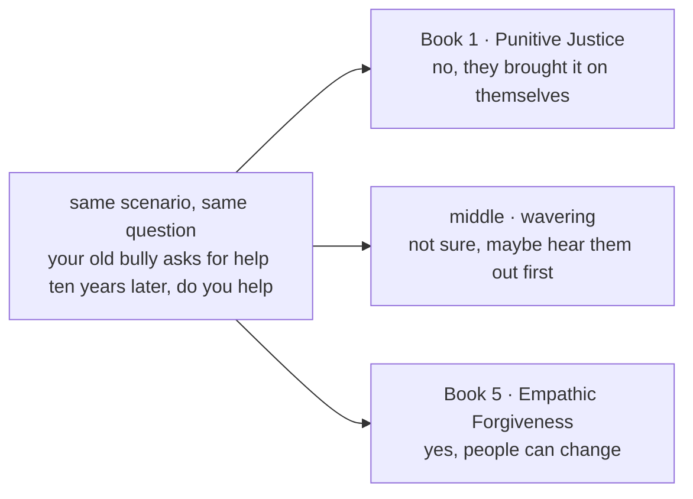
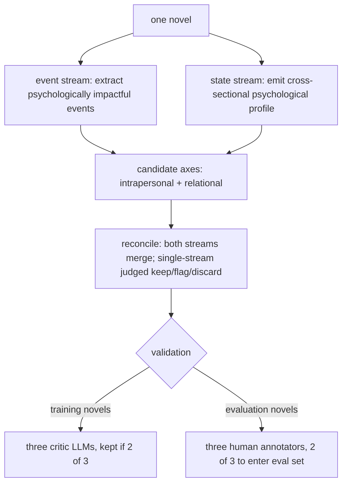
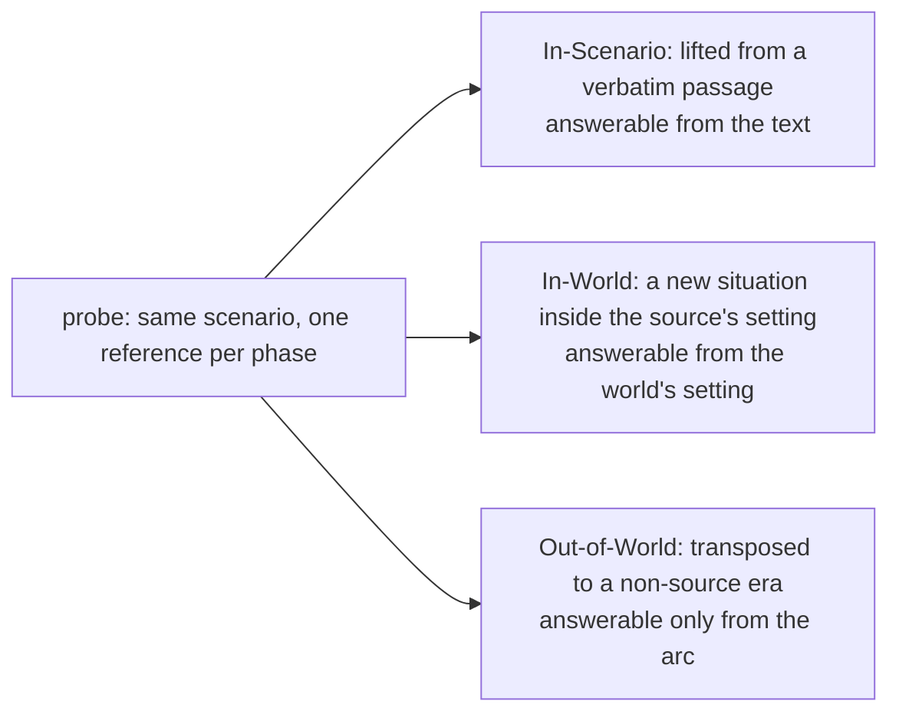

# ArcANE: Do Role-Playing Language Agents Stay in Character at the Right Time?

> **Original title**: ArcANE: Do Role-Playing Language Agents Stay in Character at the Right Time?
> **Authors**: Woojung Song, Nalim Kim, Sangjun Song, Chaewon Heo, Jongwon Lim, Yohan Jo (corresponding author)
> **Institutions**: Seoul National University
> **Year**: 2026 (arXiv ID 2606.05553, submitted June 4)
> **Subject**: cs.CL / cs.AI
> **Link**: https://arxiv.org/abs/2606.05553
> **Reading date**: 2026-06-05

## Reading Guide

### Where this work sits

Role-playing language agents (RPLAs) are one of the most popular applications of large language models: they let a user converse with a fictional, historical, or persona-defined character. As these applications have spread into entertainment, companionship, interactive storytelling, and education, user expectations have risen from "speaks fluently" to "behaves like that person."

For the past few years, the mainstream way of evaluating this has been to fix the character at a specific point in the story, focus on suppressing spoilers, and check whether the character remembers what it should remember at that moment. This line of work, such as TimeCHARA, measures factual hallucination, that is, whether the character knows what it ought to know at this point. ArcANE pushes one step further: a character's values and behavioral patterns change as the story advances, and avoiding spoilers and recalling facts is not enough. What it measures is whether an RPLA's responses fit the character's psychological state at that moment, especially in situations the source text never explores.

### What you will be able to answer

After reading this note, you should be able to answer the following:

1. Why is "fixing the character at one point in time and checking factual memory" insufficient to judge how well a role-playing agent performs, and what do the psychologist McAdams's "Layer 1 / Layer 2" refer to here?
2. What are a "Character Arc" and a "probe," and why does asking the same question at different phases of the story distinguish a model that truly evolves with the character from one that merely recites a fixed persona?
3. How do the In-Scenario, In-World, and Out-of-World probes differ, and why do the Out-of-World ones, situations outside the source text, open the largest gap?
4. In the experiments comparing six models and six context strategies, why does feeding the Character Arc to the model win consistently, and on which probe category does it win most?
5. What are this benchmark's own limitations, and does feeding the arc in as context carry a faint whiff of circularity?

### Prerequisites

This note assumes familiarity with the basic use of large language models, the concept of context prompts, and the rough idea of retrieval-augmented generation (RAG, retrieving relevant source passages and inserting them into the context). It does not assume that the reader has worked on role-playing evaluation or narratology. The more specialized parts, such as the evaluation metrics and the arc-construction pipeline, are each set up before they are unpacked below.

### Glossary of abbreviations

- **RPLA (Role-Playing Language Agent)**: a language model that plays a character in conversation with a user
- **Character Arc**: a trajectory that aligns a character's key events with their evolving psychological states, segmented into phases along a psychological axis, for example Harry's moral axis from Punitive Justice to Empathic Forgiveness
- **Axis**: a single psychological dimension defined by two pole descriptions
- **Phase**: a segment of the arc, corresponding to a chapter range, a state description, and the key moments that anchor it
- **Probe**: one (scenario, question) paired with one reference response per phase, used to test whether the model gives different responses at different phases
- **In-Scenario / In-World / Out-of-World**: three probe categories, drawn from a verbatim passage, an unwritten situation inside the source's setting, and a scenario transposed to a non-source era, in increasing difficulty
- **APF / RPF / RAE / PTF**: four metrics, Action Phase-Fidelity, Reasoning Phase-Fidelity, Reasoning-Action Entailment, and Phase Trajectory Fidelity
- **SFT / DPO**: supervised fine-tuning / direct preference optimization, the two-stage pipeline used to train ArcANE-8B/32B
- **McAdams Layer 1 / Layer 2**: a layering in personality psychology, Layer 1 being stable traits carried throughout, Layer 2 being when and where those traits are expressed

## Why this problem is worth solving

Making an AI play Harry Potter, the easy part is keeping him "always like Harry": brave, loyal, a little impulsive. But a character that truly holds up is not a set of labels pinned on and never changed. The Harry of Book 1 and the Harry of Book 5 are two different Harrys. This is precisely the issue: if the evaluation only checks "does this AI resemble the persona named Harry," then a model that has memorized Harry's personality cold yet meets everything with the same tone of voice can still score high, even if it cannot tell where the present Harry stands. 

What makes it worse is the kind of question users actually ask. People who chat with a role-playing agent often care less about what has already happened in the source text than about "if it were you, facing the thing in front of me, what would you do," and that thing was never written in the source. Once a scenario falls outside the source, approaches that lean on retrieving source text lose their footing: with no relevant passage to retrieve, the model can only fall back on the fixed persona. A seemingly minor evaluation gap is therefore tied to the central promise of role-playing: whether the character across from you is truly "living" inside the particular stretch of life he is in right now. What ArcANE sets out to do is to measure this thing that has never been measured head-on.

## I. The Problem

Put into a clear technical statement, the goal is whether one can construct a benchmark that measures whether a role-playing agent's words and actions change in step with the source character's personality evolution across the narrative, rather than matching a fixed, unchanging persona.

The authors sharpen this by borrowing the layering of the personality psychologist McAdams. Prior RPLA benchmarks mostly evaluate a character's "trait inventory," corresponding to McAdams's Layer 1: a stable set of dispositions the character carries throughout the book. ArcANE moves the ruler to Layer 2: whether the model can express those traits at the right moment. In other words, the question is no longer "is he this kind of person," but "the him of this very moment, would he do this."

Prior approaches have two main shortcomings. One, represented by TimeCHARA, is "point-in-time role-playing," which does situate the character at a specific point on the timeline, but it checks factual hallucination, that is, whether the character knows what it should know at this point, rather than how it would act in a new situation beyond its known facts. The other is the retrieval family (RAG, and the LifeChoice style), which feeds the model relevant source passages it retrieves; this works in scenes the source wrote, but once the question moves outside the source, there is nothing to retrieve. Neither line treats "the character's psychological state at this moment" itself as structured information that can be supplied directly to the model. This is exactly the gap ArcANE fills.

## II. Method

ArcANE's method can be unpacked into two main things: first, build a "Character Arc" for each character along each psychological axis, then generate "probes" on top of the arcs to test the model. The whole pipeline is constructed automatically, with only the evaluation portion passing through human review.

### The core intuition: same question, different phase, different answer

The starting point of the whole design is in fact plain: asking the same question at different phases of the story should yield different answers. The paper demonstrates with one of Harry's moral axes. The scenario: someone who once severely bullied you in school reaches out ten years later, says he is in serious trouble, and asks for your help; do you help. The Harry in the Book 1 "Punitive Justice" phase refuses, on the grounds that "they are just facing what they brought on themselves"; while the Harry of Book 5, after Sirius's death and the revelation of Snape's memories, having reached the "Empathic Forgiveness" phase, agrees, on the grounds that "there were probably reasons they acted that way, and people can change." The same question, asked of Harry at different phases, should get different answers. A model that only recites the persona cannot produce this difference; only a model that truly follows the arc can.

### Constructing the Character Arc: dual-stream extraction, then validation

A Character Arc aligns a character's key events with their evolving psychological states, organized into a phase-segmented trajectory from an initial state to a final state. Each phase specifies a chapter range, a description of the current state, and the key moments that anchor that state. Construction proceeds in three stages.

The first stage is candidate generation. The novel is run through two independent chapter-level streams: an "event stream" extracts psychologically impactful events, and a "state stream" emits a cross-sectional psychological profile. They are split so that "omitting an event" and "misreading a state," two kinds of error, can be kept separable even when both streams see the same chapters. Each stream then induces two types of candidate axes: "intrapersonal axes" track internal change (beliefs, motives, coping), and "relational axes" track a dyadic relation (trust, esteem, intimacy, antagonism). Every candidate must be grounded in established literary or psychological scholarship.

The second stage is reconciliation. An analyst LLM matches up the candidate axes proposed by the event and state streams: axes proposed by both are merged into one, with a record of which pole each phase sits closer to; an axis proposed by only one stream is judged a "genuine missed axis" (kept), "ambiguous" (flagged), or a "stream-specific artifact" (discarded).

The third stage is validation and split. The previous stage only secures internal reliability within a single LLM, not external validity. So every axis passes through a "critic LLM ensemble" of three literary perspectives: Structuralist, Depth-Psychological, and Historical-Cultural. For training novels, an axis is kept if at least two of the three critics judge it literarily grounded; for evaluation novels, the critic ratings serve only as reference, and three human annotators independently re-judge, with only those accepted by at least two entering the evaluation set.

### Generating probes: three difficulty tiers, progressively away from the text

A probe asks how the same character would respond to the same scenario at different phases of the arc: one (scenario, question) paired with N reference responses, one per phase. Because the same scenario is asked at every phase, answering correctly requires more than knowing the character's overall personality; it requires the model to first identify which phase the character is in and then respond from there.

Each scenario falls into one of three categories, forming a difficulty gradient by distance from the source text. **In-Scenario** is lifted verbatim from a source passage and can be answered from that passage; **In-World** invents an unwritten situation inside the source's setting and must be answered from the world's setting; **Out-of-World** transposes the scenario to a non-source era and can only be answered from the arc itself. Each response pairs an action with a one-to-two-sentence "thought" that captures the cognitive construal when overt action is constrained, plus a "knowledge-cutoff chapter" that blocks reference to later events.

Generation also has three stages: first, "per-arc preparation" extracts a "behavioral contrast" that compresses the axis into a yes/no decision, a per-phase life-stage tag (child, adolescent, young adult, adult, older adult), and, for Out-of-World only, an "era-agnostic axis"; then a designer LLM drafts one probe per (target phase, category), where the target phase's response reflects the character's actual behavior at that phase and the other N minus 1 are counterfactual responses projecting each remaining phase's behavior onto the same scenario; finally two validation passes, per-response checks for "in character, no anachronism, respects the knowledge cutoff" (Q-Voice) and "a blind judge says which phase it best fits" (Q-PhaseFit), and per-probe checks that the scenario respects the setting's rules (Q-Anchor / Q-World) and that adjacent phases are separable (Q-Discrim, annotation-only, since adjacent phases are allowed some overlap).

The full dataset covers 17 novels, 80 principal characters, 544 arcs, and 4,601 probes, partitioned into three: a training slice (10 novels, 2,545 probes, pooled into 45,690 teacher-generated SFT rows), a validated evaluation slice (5 novels, 1,754 probes, the headline benchmark, every axis cleared by the critic ensemble plus a two-of-three human majority), and an unvalidated low-popularity slice (2 novels, 302 probes, drawn from the bottom of the Project Gutenberg popularity distribution as a memorization control).

### A bonus: turning the evaluation structure into a training signal

Although ArcANE is primarily an evaluation framework, its structure lends itself to training: because each probe is answered across multiple phases of a character's arc, the data naturally yields contrastive pairs that can teach a model to distinguish subtle behavioral differences between adjacent developmental stages. The authors accordingly fine-tune Qwen3-8B and Qwen3-32B in two stages: the SFT stage teaches the model the ArcANE response format, and the subsequent DPO stage teaches it to separate "behavior that truly belongs to the current phase" from "speech or action that fits the character yet belongs to a different narrative phase," yielding ArcANE-8B and ArcANE-32B.

## III. Experiments

The experiments run on the validated evaluation slice: five novels (Harry Potter, Anna Karenina, Don Quixote, The Count of Monte Cristo, and The Autobiography of Benjamin Franklin), 25 principal characters, 205 arcs, and 1,754 probes. The compared systems are four open-weight baselines (Qwen3-8B, Qwen3-32B, DeepSeek-V4-Flash, DeepSeek-V4-Pro) and the authors' post-trained ArcANE-8B and ArcANE-32B.

The crux of the comparison is six "context strategies," that is, what kind of narrative context is fed to the model at inference. **Vanilla** gives only the character identity and the query chapter; **Summary** adds the five most recent chapter summaries; **RAG** adds the top six retrieved source chunks (all truncated at the query chapter); **LifeChoice** and **TimeCHARA** reuse their original context formats; **Arc** (this work) feeds in the character arc truncated to the query phase, which exposes the model to the same trajectory information used to construct the probes.

Evaluation is scored by an LLM judge on a 1-to-100 scale at two granularities. Per-phase there are three metrics: APF (Action Phase-Fidelity) grades the overt action at three levels (strategy, valence, target); RPF (Reasoning Phase-Fidelity) parses both the reference thought and the model's reasoning into four mechanism slots (trigger, appraisal, goal, strategy) and compares them; RAE (Reasoning-Action Entailment) fixes the reference thought as "the operative reasoning" and asks whether the model's action is one this reasoning would license, catching responses that are internally coherent yet reach the wrong action. At the trajectory level there is PTF (Phase Trajectory Fidelity): the judge sees all N phase pairs of (reference, response) for a probe at once, and scores the whole sequence on alignment, direction, and shape, specifically curing models that "look fine at each phase in isolation yet collapse adjacent phases together or move the wrong way along the axis."

The table below takes the Overall scores from the paper's Table 2, and shows that regardless of model size, the Arc strategy scores highest.

| Model | Best non-Arc strategy (score) | Arc strategy (score) | Arc lift |
|---|---|---|---|
| DeepSeek-V4-Flash | about 56 (Summary/LifeChoice) | 59.7 | about +4 |
| DeepSeek-V4-Pro | 57.7 (LifeChoice) | 62.4 | +4.7 |
| Qwen3-8B | 40.9 (RAG) | 43.1 | +2.2 |
| Qwen3-32B | 47.4 (LifeChoice) | 50.1 | +2.7 |
| ArcANE-8B | 48.5 (RAG) | 56.9 | +8.4 |
| ArcANE-32B | 52.0 (RAG/LifeChoice) | 60.4 | +8.4 |

A few points are worth pulling out. First, Arc takes the top Overall for every model, leading the same model's strongest non-Arc strategy by 2.2 to 8.4 points; split by novel, Arc leads in 29 of the 30 (model, novel) cells. Second, the lift is not uniform across the three probe categories. For DeepSeek-V4-Pro, the Arc-versus-best-non-Arc Overall gap is +0.5 on In-Scenario, +5.2 on In-World, and +7.7 on Out-of-World. The reason is in the probe construction: In-Scenario is lifted verbatim from the source, so retrieval strategies already return that passage and Arc adds little; In-World and Out-of-World have no such ready passage, and only Arc supplies the phase at the query chapter.

Third, Arc's lift on the trajectory metric PTF is consistently larger than on the per-phase metrics. The per-phase metrics judge each cell on its own, so a non-Arc strategy that assembles plausible per-phase content can score cell by cell without truly moving along the arc; PTF, by contrast, scores a probe's N phases as one sequence and rewards only sequences that track the reference across phases in alignment, direction, and shape. Arc is the only strategy that supplies this per-chapter trajectory.

Two further points argue that it is not winning by memorization. First, moving the six models to two obscure novels (The Underdogs, 469 downloads per month, and East Lynne, 1,038 per month, each at least twice colder than the coldest validated title) and rerunning, Arc again leads for all six models, with a lift of +4.1 to +15.3; for ArcANE-32B in particular, its Out-of-World average on these two novels (70.6) is even 6.8 points above the validated-novel value (63.8). Second, a notable result: the fine-tuned ArcANE-8B with Arc reaches 56.9, overtaking the much larger, un-fine-tuned Qwen3-32B (50.1), which shows that "structured arc context" plus "targeted fine-tuning" solves this problem better than simply piling on parameters.

## IV. Limitations

The authors devote a section to limitations, with more candor than most industrial reports. The following separates what the authors acknowledge from what a careful read reveals.

What the authors explicitly acknowledge is fourfold. First, the dataset is entirely in English and restricted to the novel domain, since the evaluation relies on the kind of long narrative in which character evolution unfolds across many chapters. Second, the evaluation centers on a single character's behavior under accumulating events, and does not cover user-character or character-character interactions, whereas in multi-turn dialogue the arc itself advances through interaction, which the authors list as the next step. Third, ethics: higher-fidelity role-playing also means more credible impersonation, and downstream applications should surface that "this is an AI playing a character" and not present generations as authoritative interpretations. Fourth, the dataset draws on novels from the nineteenth and early twentieth centuries, whose period-bound social attitudes may be reproduced by trained models, so the released artifacts are for research only.

A careful read reveals a few more. First, the entire construction chain depends heavily on LLMs: the event stream, the state stream, the reconciliation of axes, the critic ensemble, and even the final scoring judge are almost all done by LLMs, with humans gatekeeping only at the five-novel evaluation layer, so both the training data and the scoring carry the LLMs' own preferences; the scoring judge in particular is DeepSeek-V4-Flash, itself one of the evaluated models, raising a self-preference concern, though the authors run a plausibility validation. Second, and most worth pondering, what the Arc strategy feeds in is precisely the same arc trajectory used to construct the probes, which in a sense hands the model the source of the answer key, so Arc winning carries a faint circularity by construction; the authors mitigate the memorization concern with the Out-of-World and obscure-novel results, which is convincing, but the "arc as oracle" framing itself is worth a reader's caution. Third, each arc unfolds along only a single psychological axis, whereas real characters often move along several axes at once, and the authors themselves admit adjacent phases are allowed to overlap. Finally, the construction requires many LLM calls per character, which is not cheap.

## One Sentence

ArcANE breaks a character's psychological evolution into "arcs" and asks the same scenario repeatedly across different phases, measuring whether a role-playing agent plays the right person at the right moment; the result is that feeding the arc in as context wins steadily over retrieval, above all in situations outside the source text.
