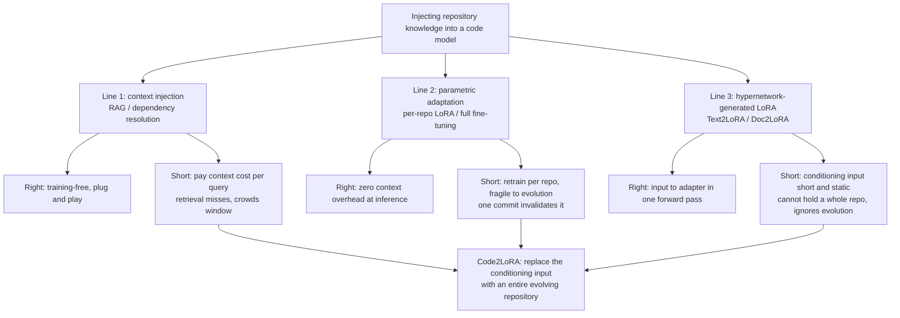
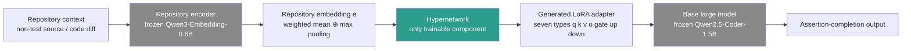
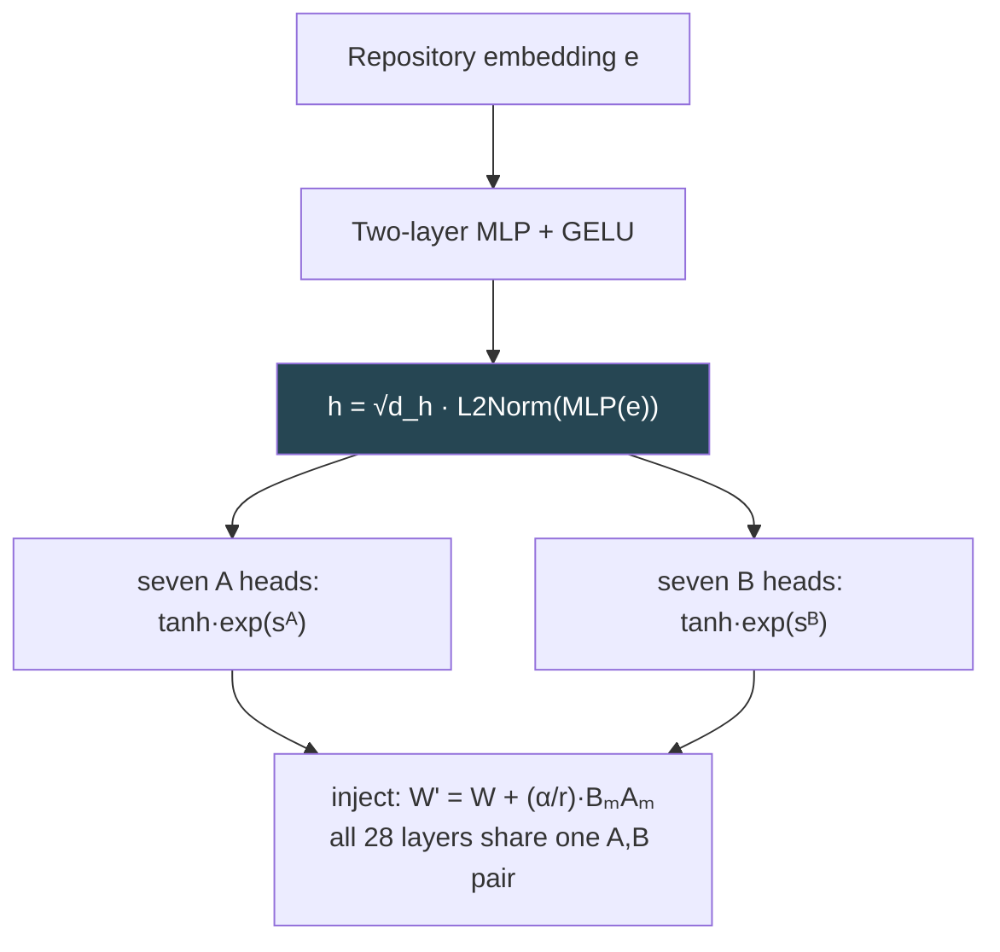
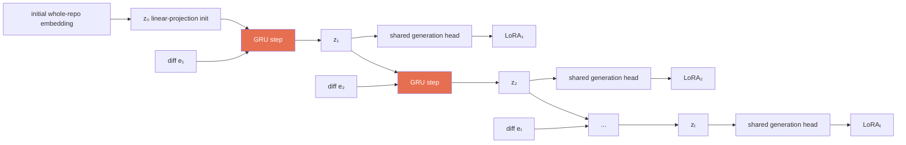
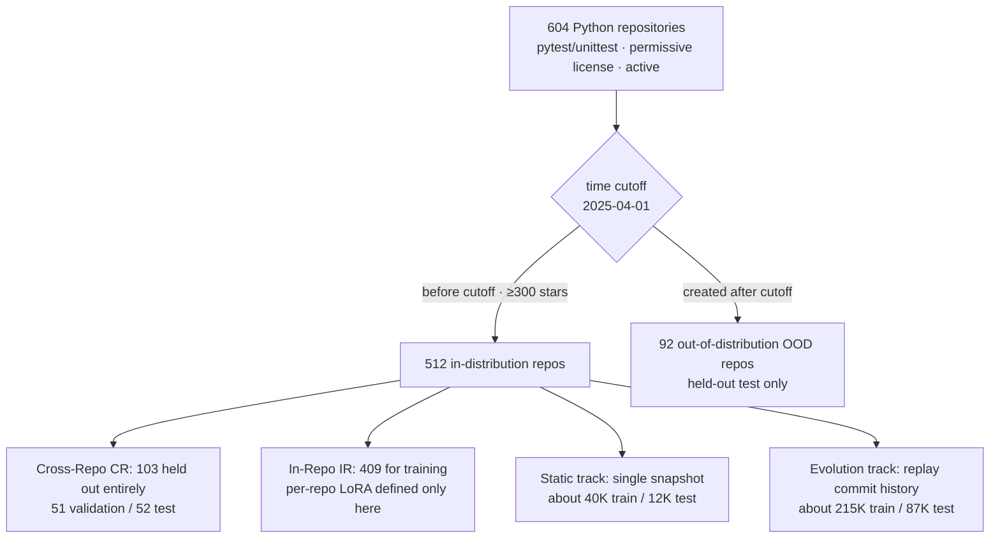

# Code2LoRA: Hypernetwork-Generated Adapters for Code Language Models under Software Evolution

> **Original title**: Code2LoRA: Hypernetwork-Generated Adapters for Code Language Models under Software Evolution
> **Authors**: Liliana Hotsko, Yinxi Li, Yuntian Deng, Pengyu Nie
> **Institutions**: University of Waterloo
> **Year**: 2026 (arxiv ID 2606.06492, submitted June 4, 2026)
> **Subject**: cs.SE / cs.AI / cs.CL
> **Link**: https://arxiv.org/abs/2606.06492
> **Reading date**: 2026-06-06

## Reading Guide

### Where this sits in the field

This work sits at the intersection of three threads, and to place it correctly we first need to lay out each thread on its own.

The first thread is "making a code model understand a whole repository." For a code language model to complete a line, fix a defect, or read a project, looking only at the current file is not enough. It needs to know the import relationships, the API conventions, and the naming habits inside that repository. Over the past few years the mainstream approach has been to feed this repository knowledge in as "long input": either use retrieval-augmented generation to pull relevant files and paste them in front of the prompt, or use dependency analysis to add the function definitions the current code can reach. The representative works on this line are RepoCoder, RepoFusion, and CrossCodeEval. What they share is that the repository knowledge always lives in the model's input, and you pay for that context every single time you ask.

The second thread is "parameter-efficient fine-tuning." Rather than stuffing knowledge into the input each time, you press it into the model's weights. LoRA (Low-Rank Adaptation) is the most common tool on this line. It freezes the original model and learns only a pair of small matrices to represent the change in weights. Following this path, people train one LoRA for a single repository, or for a group of related repositories. The catch is that such an adapter is "dead": training it once only fits the version of the code present at training time, while a real repository commits new changes every day, and a single commit can invalidate the previously trained adapter and force a retrain.

The third thread is "generating LoRA with a hypernetwork." A hypernetwork is a network whose job is to generate the weights of another network. Applied to LoRA, the idea is to stop training a separate adapter per task and instead train a generator that reads a conditioning input and emits an adapter in one forward pass. The representative works here are Text2LoRA and Doc2LoRA. The former reads a short task description, the latter reads a single document, and each generates a corresponding LoRA. However, both are designed for "short natural language" or a "single document." Neither can swallow the volume of context that a whole repository carries, and both assume the conditioning input is static, with no mechanism to track how code changes over time.

Stack these three threads together and the position of Code2LoRA becomes clear. It pushes the paradigm of "generating LoRA with a hypernetwork" from "short task description or single document" to "an entire code repository" as a third kind of input, and it specifically designs a mechanism that updates the adapter along the commit stream to address the fact that repositories evolve.

### What you can answer after reading

After reading this note, you should be able to answer the following.

First, what the respective costs are of putting repository knowledge into the input (retrieval-augmented generation) versus into the parameters (LoRA), and why both old paths fall short in the face of the reality that repositories keep evolving.

Second, what it means to generate LoRA with a hypernetwork, and exactly how Code2LoRA differs from its predecessors Text2LoRA and Doc2LoRA in input form and injection coverage.

Third, what scenarios Code2LoRA-Static and Code2LoRA-Evo each correspond to, and what exactly the gated recurrent unit introduced by the latter is maintaining.

Fourth, why the authors built their own benchmark called RepoPeftBench, and what its "assertion completion" task and its three splits (cross-repo, in-repo, out-of-distribution) are each testing.

Fifth, why Code2LoRA-Static can match or even exceed "per-repository LoRA," which is supposed to be an upper bound, in the in-repo setting, and how to read that result without being misled.

### Prerequisites

This note assumes the reader is familiar with the basic structure of the Transformer, the query, key, and value projections in attention, and tensor-level operations in PyTorch, and knows the difference between fine-tuning and inference. It does not assume the reader has specifically worked on code intelligence, parameter-efficient fine-tuning, or software evolution mining. Any concept proper to those subfields is introduced with a short setup before it is expanded, the first time it appears.

### Abbreviations on first appearance

- **LoRA** (Low-Rank Adaptation): a fine-tuning method that freezes the original weights and learns only a pair of low-rank small matrices $A$ and $B$ to represent the weight change $\Delta W = BA$.
- **Hypernetwork**: a network dedicated to generating the weights of another network. Its input is some conditioning signal and its output is the parameters of the target network.
- **PEFT** (Parameter-Efficient Fine-Tuning): the umbrella term for a class of fine-tuning methods that train only a small number of parameters while freezing most of the weights. LoRA is the representative member.
- **RAG** (Retrieval-Augmented Generation): retrieving relevant text before generation and pasting it into the input prompt.
- **GRU** (Gated Recurrent Unit): a recurrent network for sequences that maintains a hidden state updated over time through gating.
- **Assertion completion**: giving the model a prefix of test code and asking it to complete the expected-value part of an `assert` statement.
- **EM** (Exact Match): a metric where the prediction must match the reference character for character.
- **CodeBLEU**: a code-generation evaluation metric that, beyond n-gram overlap, additionally accounts for the abstract syntax tree and data-flow structure.
- **CR / IR** (Cross-Repo / In-Repo): whether the test sample comes from a repository unseen at training time (CR) or from held-out samples inside a training repository (IR).
- **OOD** (Out-of-Distribution): the batch of repositories created strictly after the time cutoff and entirely invisible during training.
- **FFT** (Full Fine-Tuning): training with all model parameters unfrozen, used as a control baseline.
- **diff**: the difference between two code versions, here specifically the code change introduced by one commit.

## (Opening)

Picture the most ordinary scenario. You are writing code in a project with thousands of files, and the line you need to complete uses a utility function the project defines itself, a configuration constant, a certain naming convention. For a code model to complete this line correctly, it must "know" these conventions scattered all over the project. The problem is that this knowledge is not in the model's pretrained weights. It exists only in this one concrete repository.

To feed this repository knowledge to the model, the field currently takes mainly two paths, and each path has an obstacle it cannot get past.

The first path is to put the knowledge in the input. Before each query, retrieval pulls the relevant files and pastes them at the front of the prompt so the model reads them on the spot. The obstacle here is cost: repository-level context easily runs to thousands of lines, and every query reads this large chunk again, both crowding the model's limited context window and pushing all the pressure onto the accuracy of retrieval. In other words, knowledge has to be "carried to the scene" every time, and the carrying fee is charged per use and can never be avoided.

The second path is to press the knowledge into the parameters. You train one LoRA adapter specifically for a single repository, fixing this project's conventions into a small set of weights, so at inference time you no longer need to carry the context in the input. This path eliminates the carrying fee but runs into another obstacle: a real codebase is alive and commits new changes every day. The adapter trained today corresponds to today's version of the code, and after a few changes are merged tomorrow it starts to drift from reality. To keep up, you have to retrain without end. In short, this path swaps "pay per query" for "retrain per version," and on a continuously evolving project that bill is equally bad.

So the problem becomes clear. Is there a way to enjoy the benefit of "pressing knowledge into the parameters with zero extra overhead at inference," yet avoid retraining once for every repository and every version? Code2LoRA's answer is to train a generator that "reads a repository and writes an adapter," letting it generate the corresponding LoRA for any repository in a single forward pass, and then to equip that generator with a mechanism that rolls forward along the commit stream so the generated adapter can evolve together with the code. This is exactly where the paper is worth reading. It does not optimize one of the old paths but instead splits "how knowledge enters the parameters" and "when knowledge is refreshed" into two orthogonal axes and answers each separately.

## I. The Problem

Continuing from the opening, let us pin the problem to a verifiable technical statement: can we train a hypernetwork that takes "an entire code repository" as conditioning input and generates, in one forward pass, a LoRA adapter specific to that repository, so as to inject repository knowledge at inference time with zero extra token overhead; and, when the repository keeps evolving through commits, let this adapter also keep updating at a cost far below retraining.

To see the weight of this statement, we first need to lay out the two mainstream prior lines in full, including what each does right and where each falls short.

The first mainstream line is "context injection," that is, feeding repository knowledge in as long input. It splits internally into two branches. One branch is retrieval-augmented generation: chop the non-test source in the repository into segments, build an index, and at each inference retrieve the segments most relevant to the current prefix and paste them in front of the prompt. The other branch is dependency resolution: follow the import relationships of the current code and add the reachable function and class definitions into the context. What these two branches do right is that they really do deliver relevant information to the model, and they require no training, ready to use. Where they fall short is that repository-level context is too large in volume, retrieval inevitably misses key segments, and the long context pasted in keeps consuming compute and context window at inference. The experiments later in the paper will show that under harder settings retrieval-augmented generation can even drop below the raw model that does no processing at all, precisely because retrieval noise overwhelms the information gain it brings.

The second mainstream line is "parametric adaptation," that is, training knowledge into the weights. The most naive approach is to co-train a single LoRA for all repositories, but such a single adapter captures the characteristics of no individual project. A step further is to train one LoRA per repository, which can learn a single project's conventions in fine detail and is therefore often used as the "upper bound of repository-level adaptation" for comparison. What it does right is zero context overhead at inference, because the knowledge is already in the weights. Where it falls short has two points. First, the cost of per-repository training grows linearly with the number of repositories and becomes unbearable once there are many. Second, and more fatally, it is extremely fragile to evolution: a single commit can make the previously trained adapter drift from reality, and then a retrain is needed.

The third line, the one this paper stands directly on the shoulders of, is "generating LoRA with a hypernetwork." The concept of a hypernetwork itself is not new: it refers to a network that generates the weights of another network. Connect it to LoRA and you get a class of "instant adaptation" methods. Closest to this paper are two predecessors. One is Text2LoRA, which reads a short task description, passes it through an external text encoder, and generates a LoRA in one forward pass, but it acts only on the query and value projections. The other is Doc2LoRA, which reads a single document and conditions on the per-layer activations of the target model, but only modifies the down projection and is designed for document question answering. What these two do right is that they prove "turning a conditioning input into a dedicated adapter in one forward pass" is a workable path. Where they fall short is that both conditioning inputs are short and static: one sentence or one document, which neither holds context at the scale of a whole repository nor has any mechanism to track how the input changes over time.

Lay these three lines on top of each other and the technical gap this paper addresses surfaces. The first two old paths either pay a carrying fee per query or a retraining fee per version. The third new path, although it gets the "read input, write adapter" paradigm running, is stuck on a "short and static" conditioning input. What Code2LoRA sets out to do is exactly to replace the conditioning input of this new path with "an entire repository that evolves."

## II. Method

The overall design of Code2LoRA can be summarized in one sentence: it is a hypernetwork framework that, against a frozen code model, generates a dedicated LoRA adapter per repository, so as to inject repository knowledge at inference time with zero token overhead. The whole framework is a pipeline of three components, and only the middle one needs training.

The first component is the "repository encoder," responsible for compressing repository-level context into a fixed-length vector. The second component is the "hypernetwork," responsible for mapping this vector into the weights of a LoRA, and it is the only trainable part of the framework. The third component is the "base large model," responsible for receiving the generated adapter and performing inference. During training only the standard language-modeling loss is used to update the hypernetwork, while the repository encoder and the base model stay frozen throughout. The difference between the two usage scenarios lies only in the design of the hypernetwork: Code2LoRA-Static directly projects the repository vector into LoRA weights, while Code2LoRA-Evo inserts a gated recurrent unit before the projection to aggregate a sequence of code-change vectors.

### Repository encoder: compressing millions of tokens into one vector

For the hypernetwork to digest it, repository-level context must first be compressed into a fixed-size vector. Here the authors use a "training-free" two-step embedding method, backed by a frozen Qwen3-Embedding-0.6B model.

The first step is file-level embedding. Each file in the repository context (or its change $\Delta f_i$) is chopped into chunks of 4096 tokens with 512 tokens of overlap between adjacent chunks, passed chunk by chunk through the embedding model, and then the vectors of the chunks of the same file are mean-pooled to obtain the file vector $f_i \in \mathbb{R}^d$, where the dimension is $d = 1024$.

The second step is repository-level aggregation. For a complete repository snapshot, each file vector first receives an importance weight $w_i$, and this weight is composed from three things: how distinctive the content is, the size of the file, and the importance of the path. The final repository embedding is the concatenation of a weighted mean and a max pooling:

$$
e = \Big[\textstyle\sum_i w_i f_i \;;\; \max_i f_i\Big] \in \mathbb{R}^{2d}
$$

The intent of concatenating this way is that the weighted mean captures the "average character" of this codebase, while the max pooling preserves its most recognizable features. These embeddings are all precomputed before training and therefore do not enter the training computation graph.

It is worth noting that this step compresses "an entire repository of millions of tokens" into a 2048-dimensional vector. This is a rather aggressive compression. It determines how much detail the downstream hypernetwork can read from the repository and is a key information bottleneck within the whole method.

### Code2LoRA-Static: one snapshot for one adapter

What the static hypernetwork does is map a single repository embedding $e$ into a full set of LoRA weights in one forward pass. For each of the seven module types $m \in \{q, k, v, o, \text{gate}, \text{up}, \text{down}\}$, its two LoRA matrices $A_m$ and $B_m$ are generated by a shared two-layer multilayer perceptron (with GELU activation) plus dedicated output heads:

$$
h = \sqrt{d_h}\,\cdot\,\mathrm{L2Norm}\big(\mathrm{MLP}(e)\big)
$$
$$
A_m = \tanh\!\big(\mathrm{Head}^A_m(h)\big)\cdot \exp(s^A_m), \quad B_m = \tanh\!\big(\mathrm{Head}^B_m(h)\big)\cdot \exp(s^B_m)
$$

Here $s^A_m$ and $s^B_m$ are learnable log-scales that control the magnitude of the adapter, initialized to $-3.5$. The generated LoRA matrices are shared across all layers of the base model and injected as $W' = W + \frac{\alpha}{r} B_m A_m$. With hidden dimension $d_h = 1024$ and LoRA rank $r = 16$, this static hypernetwork has about 720 million trainable parameters.

Place it next to its predecessors Text2LoRA and Doc2LoRA and there are two differences. First, what drives it is a whole-repository embedding summarized from millions of tokens, not a task description. Second, it injects LoRA into all seven module types, rather than only the query and value, or only the down projection. In other words, Code2LoRA-Static generalizes the same family along two directions: "whole-repository input" and "full-module coverage."

### Code2LoRA-Evo: letting the adapter move with the commit stream

The evolving version addresses the fact that a repository changes. What it maintains is no longer a static adapter but a trajectory of adapters that rolls over time, backed by a gated recurrent unit that aggregates the change embeddings $\{e_t\}$ ordered by time.

The role the gated recurrent unit plays here is "memory." At step $t$, the encoder supplies a change embedding $e_t$, which is first linearly projected and then merged with the previous state:

$$
z_t = \mathrm{GRU}\big(\mathrm{LayerNorm}(\mathrm{Linear}(e_t)),\, z_{t-1}\big)
$$

The initial state $z_0$ is computed by a small linear projector from the repository's initial whole-repository embedding (for example, the snapshot at the first commit). At each step $t$, the state $z_t$ replaces the $e$ in the static version and is fed into that shared generation head, yielding the LoRA for this moment. Rolling forward this way produces an "adapter trajectory" covering the entire lifetime of the repository. The key benefit here is the update cost: each time a commit arrives, only one step of the gated recurrent unit on the already-stored change embedding is needed, which is far cheaper than re-encoding the entire repository. Compared with the static version, the gated recurrent unit plus the initial-state projector add only about 25 million parameters, so the total trainable parameter count of the evolving version is about 745 million.

### Training

The whole hypernetwork is trained end to end, with the objective of minimizing the cross-entropy of assertion-completion sample pairs on the frozen base model:

$$
\mathcal{L}(\theta) = -\!\!\sum_{(x,y)\in D} \log p\big(y \mid x;\, \mathrm{Hypernetwork}_\theta(u)\big)
$$

where $x$ is the input prefix, $y$ is the output target, and the condition $u$ takes the whole-repository embedding $e$ in the static version and the gated recurrent unit's state $z_t$ in the evolving version. For the evolving version, the authors optimize with truncated backpropagation through time, detaching the state $z_t$ from the computation graph every $K = 16$ steps to avoid an overly long gradient chain. There is also a detail about sampling: when forming batches, first sample a repository, then sample one input-output pair from that repository, so that the hypernetwork sees a sufficiently diverse set of repositories and is not biased toward repositories with especially many samples.

## III. Experiments

### A self-built benchmark, RepoPeftBench

Because existing code-completion benchmarks mostly hand out only "retrieval-selected slices" and cannot evaluate methods that "swallow a whole repository," the authors simply built their own benchmark, called RepoPeftBench.

Its corpus is 604 Python repositories, all from GitHub, all passing a uniform quality filter: they must test with pytest or unittest, carry a permissive license, and show recent active commits. This batch of repositories is cut by a fixed time cutoff (April 1, 2025) into two parts. Those before the cutoff are 512 "in-distribution" repositories, with the additional requirement of at least 300 stars to ensure quality, and all training and validation data come from here, with their commit histories truncated at the cutoff. Those created strictly after the cutoff are 92 "out-of-distribution" repositories, reserved for the final held-out test only. For each repository both the last snapshot and the full commit history were collected.

The task is "assertion completion." Each sample is an input-output pair: the model receives a structured prefix from a test file and must predict the expected-value part of a certain assertion. Concretely, the input concatenates the import statements, the enclosing class, the helper methods, and the body of the test function up to the point where the assertion is cut off; the output is the expected value on the right-hand side of the comparison operator in the assertion, or the last argument of the assertion function call. The reason for choosing assertion completion rather than ordinary code completion is that all assertion samples in the same repository share the same non-test source as context, which is exactly suited to testing "repository-level" understanding; whereas ordinary code completion, to prevent answer leakage, must dig the target file out of the context for each sample, meaning each sample uses a different repository slice, which makes comparison inconvenient.

The evaluation follows two sets of splits. One set is the cross-repo versus in-repo contrast: the cross-repo split holds out 103 repositories entirely from training (51 validation, 52 test) to measure "generalization to unseen repositories," while the in-repo split trains on the remaining 409 repositories, and only in this setting is the "per-repository LoRA" upper bound defined. The other set is two tracks: the static track draws all its samples from a single snapshot of each repository, corresponding to Code2LoRA-Static; the evolution track replays each repository's commit history and emits a sample whenever a commit adds or modifies an assertion, storing it together with the code change of that commit, corresponding to Code2LoRA-Evo.

The base model is uniformly Qwen2.5-Coder-1.5B, loaded in bfloat16; the repository encoder is Qwen3-Embedding-0.6B, both under the Apache 2.0 license. The hypernetwork generates LoRA of rank $r = 16$ and $\alpha = 32$, covering seven projection types, with each pair $(A_m, B_m)$ shared across all 28 Transformer layers. Training runs for 3 epochs with AdamW under a cosine schedule, all on a single H100 80GB. The baselines for comparison include: the raw model, retrieval-augmented generation, dependency-resolved context, full fine-tuning, full fine-tuning plus retrieval, a co-trained single LoRA, per-repository LoRA (the upper bound of repository-level adaptation), and a "strengthened" Text2LoRA. This strengthening is crucial: the authors deliberately replace Text2LoRA's input with the same whole-repository embedding Code2LoRA uses and extend its output to the same seven projection types, so that only the "LoRA generation head" remains different between it and Code2LoRA-Static, thereby cleanly attributing the credit to the design of the generation head. The evaluation metrics are exact match, edit similarity, and CodeBLEU, which accounts for the abstract syntax tree and data flow.

### Static track: matching the per-repository LoRA that was supposed to be the upper bound

The main results on the static track are in the table below (exact match, in percent).

| Method | Cross-Repo CR | In-Repo IR |
| --- | --- | --- |
| Raw model | 45.7 | 46.8 |
| Retrieval-augmented generation (k=3) | 39.7 | 42.1 |
| Dependency-resolved context | 48.2 | 49.5 |
| Full fine-tuning | 51.4 | 55.9 |
| Full fine-tuning + retrieval | 53.9 | 56.8 |
| Co-trained single LoRA | 47.4 | 50.4 |
| Per-repository LoRA (upper bound) | — | 64.0 |
| Text2LoRA (strengthened) | 45.8 | 46.7 |
| **Code2LoRA-Static** | **63.8** | **66.2** |

Two results are worth pulling out. First, in the cross-repo setting, Code2LoRA-Static reaches 63.8 exact match, 9.9 percentage points higher than the strongest baseline (full fine-tuning plus retrieval at 53.9), leaving all context-injection methods and other fine-tuning baselines behind. Second, the strengthened Text2LoRA, which differs from Code2LoRA only in the generation head, reaches only 45.8, which cleanly locates the "bottleneck of repository-level adaptation" in the design of the generation head: once the input and the injection coverage are aligned, the remaining gap can only be explained by the generation head.

More intriguing is the in-repo column. Code2LoRA-Static reaches 66.2, matching or slightly exceeding the 64.0 of "per-repository LoRA," which was supposed to be the upper bound, and it never trained separately for any single repository. The authors argue from this that the cross-repository transfer learned by the hypernetwork is more valuable than hard-fitting one adapter per repository on the meager in-repo data budget. The direction of this interpretation is correct, but the reader should keep one reservation in mind, and the next section will return to it.

### Evolution track: a static snapshot goes stale, recurrent aggregation catches it

Once the evaluation switches to "commit-derived" samples, things change. The table below shows the main results on the evolution track.

| Method | Cross-Repo CR | In-Repo IR |
| --- | --- | --- |
| Raw model | 31.5 | 29.3 |
| Retrieval-augmented generation (k=3) | 23.6 | 23.0 |
| Dependency-resolved context | 31.1 | 31.6 |
| Co-trained single LoRA | 55.1 | 61.3 |
| Per-repository LoRA (upper bound) | — | 64.2 |
| Text2LoRA (strengthened) | 41.7 | 43.5 |
| Code2LoRA-Static | 55.7 | 60.6 |
| **Code2LoRA-Evo** | **60.3** | **64.5** |

The first thing to note is that commit-derived tasks are much harder than a single snapshot: the cross-repo exact match of the raw model drops from 45.7 on the static track to 31.5. The two context-injection methods collapse here, and retrieval-augmented generation even falls below the raw model. Second, the static version of Code2LoRA reaches only 55.7 on this track, clearly below its 63.8 on the static track, which is a direct manifestation of "a snapshot goes stale": the code corresponding to the snapshot at training time no longer matches the evolved code at evaluation time.

The evolving version Code2LoRA-Evo is the strongest on both splits: 60.3 cross-repo and 64.5 in-repo, the former 5.2 percentage points higher than the co-trained single LoRA, and the latter even crossing the per-repository LoRA upper bound, again without training for any single repository. In short, once the evaluation begins to follow the repository's evolution, "aggregating a stream of changes with a gated recurrent unit" shows a sustained advantage, while "guarding a single static snapshot" falls behind over time.

### Out-of-distribution holdout: the direction is consistent, but watch for an artifact

Finally, the results on the 92 out-of-distribution repositories, all created after the training cutoff and entirely invisible during training.

| Method | Exact Match | Edit Similarity | CodeBLEU |
| --- | --- | --- | --- |
| Raw model | 44.6 | 0.568 | 0.630 |
| Retrieval-augmented generation (k=3) | 32.6 | 0.464 | 0.536 |
| Dependency-resolved context | 45.5 | 0.584 | 0.637 |
| Co-trained single LoRA | 72.3 | 0.836 | 0.817 |
| Text2LoRA (strengthened) | 60.4 | 0.720 | 0.740 |
| Code2LoRA-Static | 72.2 | 0.842 | 0.818 |
| **Code2LoRA-Evo** | **74.1** | **0.866** | **0.846** |

On the surface, Code2LoRA-Evo's 74.1 is the highest of the field. But the authors honestly point out an artifact: the assertion targets in this out-of-distribution batch are systematically shorter, with a median of only 7 characters, while the cross-repo and in-repo test sets have a median of 12 to 13 characters. The shorter the target, the more easily exact match is inflated, which also explains why the co-trained single LoRA can reach 72.3 here, far above its 55.1 on the evolution track. For this reason the authors argue for making horizontal comparisons only within this table; on that premise, Code2LoRA-Evo leads the second-best fine-tuned adapter by about 1.8 percentage points, narrower than the roughly 5-point gap on the evolution track, but consistent in direction and holding in the same direction on edit similarity and CodeBLEU.

## IV. Limitations

Let us look at the limitations in two blocks: one block the authors admit themselves, and one block that becomes visible after reading but that the paper does not address head-on.

The limitations the authors admit themselves are the following. First, the evaluation scope is narrow: all experiments are done only on Python repositories, a single frozen backbone (Qwen2.5-Coder-1.5B), and a single downstream task (assertion completion). The architecture is in principle language-agnostic and task-agnostic (the encoder supports multiple languages, and LoRA is injected by module type and shared across layers), but extending the empirical evidence to other languages, backbones, and tasks is left to future work. Second, the target-length artifact on the out-of-distribution set, discussed above, which the authors mark out faithfully and on the basis of which they argue only for within-table comparison. Third, the metrics are surface-level: exact match cannot capture "functional equivalence," and the authors mitigate this with edit similarity, CodeBLEU, and a pytest-based execution probe, but admit that a more thorough semantic evaluation (for example, actually running every generated assertion in the project's runtime) was out of scope given the compute budget. Fourth, model size: the hypernetwork that generates LoRA itself eats up the vast majority of trainable parameters (about 720 million for the static version, about 745 million for the evolving version), and this number scales with the projection dimensions of the backbone; therefore the conclusion on the evolution track is most directly supported at the 1.5-billion-parameter scale, and whether recurrent aggregation remains necessary or sufficient once the backbone is much larger is an open question.

After reading, a few more potential issues become visible that the authors do not address head-on.

First, the claim of "matching the upper bound" needs careful interpretation. In the in-repo setting, per-repository LoRA gets only about 12 training samples per repository on average, and training an adapter with a dozen samples is itself in a state of severe underfitting. In other words, this "upper bound" looks more like a weak baseline pressed down by the data budget; that Code2LoRA can cross it does show that cross-repository transfer is effective, but it should not be read as "approaching the true ceiling of repository-level adaptation."

Second, the information bottleneck is quite aggressive. Compressing an entire repository of millions of tokens into a 2048-dimensional vector, and then letting it generate an adapter covering all seven projection types, leaves it unmeasured in the paper how much repository-specific detail can survive in between. The encoder is frozen and training-free, and its expressiveness directly determines what the hypernetwork can read, yet this link does not participate in end-to-end optimization.

Third, the representativeness of the task is limited. Assertion completion is essentially predicting the expected value of an assertion, which is not the same thing as the "completing code, fixing defects, navigating a project" depicted in the opening. Being able to complete the right-hand value of an assertion does not necessarily equal truly understanding this repository, and how large the gap between the two is requires more varied downstream tasks to answer.

Fourth, cross-layer sharing is a rather strong constraint. The same generated pair $A_m$ and $B_m$ is copied to all 28 layers of the base model, which does save parameters but also limits the freedom of each layer to adapt on its own; it works well at the 1.5-billion scale, but whether it extends to deeper and wider models is likewise unresolved.

## One Sentence

Train a hypernetwork that "reads a whole repository and writes a LoRA," letting a code model put on repository knowledge with zero context overhead, and then use a gated recurrent unit to roll the adapter forward along the commit stream, so as to keep up with a continuously evolving codebase.
