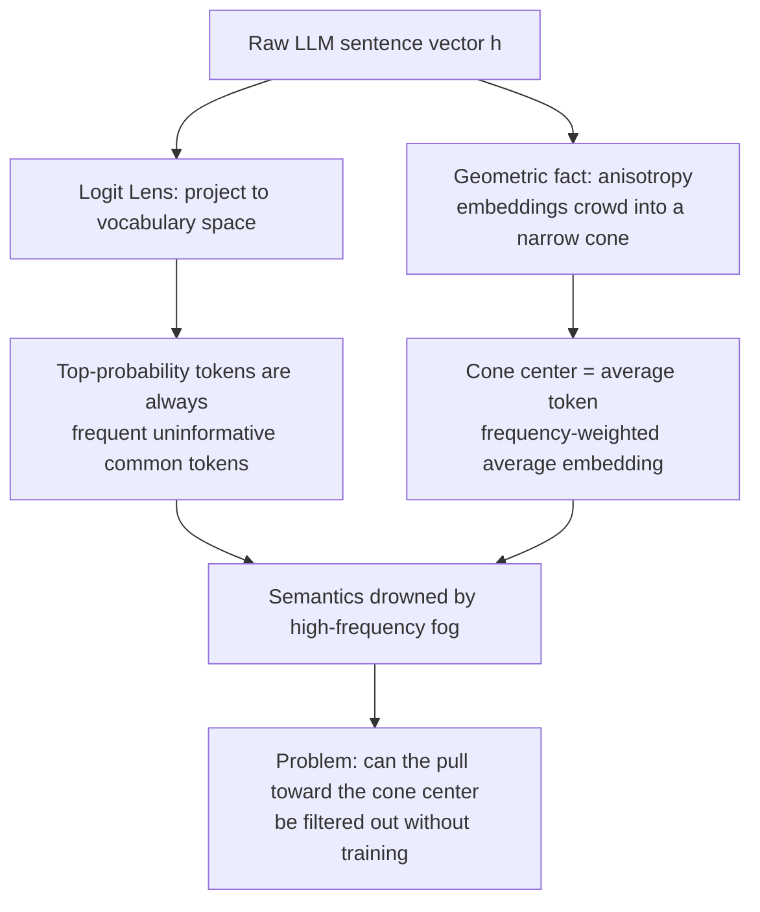
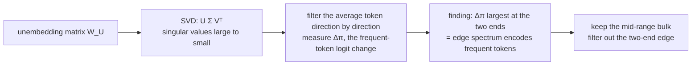

# Your UnEmbedding Matrix is Secretly a Feature Lens for Text Embeddings

> **Original title**: Your UnEmbedding Matrix is Secretly a Feature Lens for Text Embeddings
> **Authors**: Songhao Wu, Zhongxin Chen, Yuxuan Liu, Heng Cui, Cong Li, Rui Yan
> **Institutions**: Gaoling School of Artificial Intelligence, Renmin University of China (corresponding author Rui Yan); supported by Lenovo Group
> **Year**: 2026 (arxiv ID 2606.07502, submitted June 8, 2026; submitted to KDD)
> **Subject**: cs.CL / cs.IR
> **Link**: https://arxiv.org/abs/2606.07502
> **Reading date**: 2026-06-08

## Reading Guide

### Where this sits in the field

To place this paper correctly, we first need to lay out a seemingly contradictory fact: today's large language models can do almost anything, yet the moment you use one directly as a "text embedding model," its performance is often unsatisfactory.

A text embedding compresses a sentence into a dense vector such that semantically close sentences have close vectors. Such vectors are the foundation of a whole stack of applications: retrieval, clustering, semantic matching. Intuitively, a large model that has read a vast amount of text and can both write and answer ought to produce excellent sentence vectors. But the fact is, taking a large model's hidden states directly as sentence vectors often loses to specially trained small models on large-scale text-embedding benchmarks.

Over the past few years, to bridge this gap, the field has mainly taken the road of "prompt engineering": through carefully designed prompts, induce the large model to condense semantics into some hidden state, then extract it as the embedding. The representative methods are PromptEOL, ECHO, MetaEOL, GenEOL, and so on. This road works, but its improvement is limited, and it is very sensitive to the exact wording of the prompt, with results jittering once the setup changes. In short, these methods are heuristic and do not touch the root bottleneck of "why large models are not good at producing sentence vectors."

This paper takes a different approach. Instead of working on prompts, it starts from mechanistic interpretability to answer that root question. Its entry point is a long-overlooked component: the unembedding matrix. This is the matrix at the end of a large model that maps hidden states back to the vocabulary and computes a probability for each word, normally used only when generating the next token. The authors find that this matrix secretly holds a "feature lens," and what it reveals is precisely the cause of the large model's sentence-vector trouble. This work therefore belongs to the line of "using interpretability tools to diagnose and repair representations," which sits on a different level from merely tuning prompts.

### What you can answer after reading

After reading this note, you should be able to answer the following.

First, why taking a large model's hidden state directly as a sentence vector causes "semantics to be drowned out," and what the so-called anisotropy and the "average token" mean.

Second, what the two interpretability tools Logit Lens and Logit Spectroscopy are doing, and how the authors use them to localize the problem to a certain subspace of the unembedding matrix.

Third, what the "edge spectrum subspace" is, and why it is the two ends with the largest and smallest singular values, rather than the middle, that encode frequent tokens.

Fourth, what kind of transformation EmbedFilter actually is, and why it can simultaneously improve semantics and "incidentally" reduce embedding dimension without loss of quality.

Fifth, why the gains of this method differ markedly between strong and weak models, and what this hints about its boundary of applicability.

### Prerequisites

This note assumes the reader is familiar with the basic structure of the Transformer, knows what hidden states and vocabulary logits are, and has the linear-algebra basics of matrices, subspaces, and projection. Singular value decomposition is set up with a sentence when first used. It does not assume the reader has specifically worked on text embedding or mechanistic interpretability, and any concept proper to those two directions is introduced with a setup before being expanded.

### Abbreviations on first appearance

- **Text embedding**: compressing a piece of text into a dense vector so that semantically close pieces have close vectors.
- **Unembedding matrix** (denoted $\bm{W}_{\mathcal{U}}$): the matrix at the end of a large model that maps hidden states back to the vocabulary and computes a logit for each word, often called the language-model head.
- **Zero-shot**: using a model directly without any additional fine-tuning for the target task.
- **Anisotropy**: embedding vectors crowd into a narrow cone, excessively similar to one another rather than spread out.
- **Logit Lens**: an interpretability tool that projects a model's intermediate representation directly into vocabulary space to see "which tokens it tends to decode."
- **Logit Spectroscopy**: a generalization of Logit Lens that projects a representation onto the spectral components (singular vectors) of a weight matrix, measuring the contribution of each spectral direction one by one.
- **SVD** (Singular Value Decomposition): factoring a matrix into $\bm{U}\Sigma\bm{V}^\top$, where the columns of $\bm{V}$ are the right singular vectors and $\Sigma$ holds the singular values sorted from large to small.
- **Average token**: the frequency-weighted average embedding, corresponding to the centroid of the anisotropy cone.
- **Edge spectrum subspace**: the subspace spanned by the right singular vectors at the two ends, with the largest and smallest singular values, which the authors find encodes frequent tokens.
- **Bulk spectrum**: the mid-range singular-value directions left after removing the two ends.
- **MTEB** (Massive Text Embedding Benchmark): a text-embedding benchmark spanning seven task types (semantic similarity, classification, clustering, retrieval, and more) across forty-nine datasets.
- **Prompt-engineering baselines on MTEB**: PromptEOL, ECHO, MetaEOL, GenEOL, all methods that extract sentence vectors from large models by designing prompts.
- **Whitening**: a calibration operation that decorrelates and normalizes embeddings, with BERT-whitening as the representative.
- **Filtering ratio** $\tau$: EmbedFilter's hyperparameter, with the embedding dimension reduced to $1/\tau$ of the original.

## (Opening)

Using a large language model as a sentence-vector generator is something that sounds self-evident but, in practice, often hits a wall. Retrieval, clustering, deduplication, semantic search: all these applications rest on "turning text into vectors and then measuring semantic closeness by distance between vectors." A large model that has read nearly all of the web seems by nature the best source of sentence vectors. Yet the real situation is that taking its hidden state directly as a vector often still loses, on recognized text-embedding benchmarks, to old models with far fewer parameters but specially trained for the task.

Leaving this gap unsolved brings two concrete kinds of trouble. One is on the effectiveness side: if the sentence-vector quality is not good enough, retrieval misses, clustering fails to separate, and downstream applications suffer overall. The other is on the cost side: a large model's hidden dimension easily runs to thousands, and storing such a high-dimensional vector as an index both takes storage and slows the distance computation at retrieval. In other words, using a large model as an embedding model is currently "neither good enough nor cheap enough."

Over the past few years, the mainstream remedy has been to work on prompts, trying every way to induce the model to press semantics into some hidden state. This road can indeed squeeze out some improvement, but it has two unavoidable flaws. First, the improvement is limited and unstable, with results jittering as soon as the prompt is changed slightly. Second, it always stays at the level of "external inducement" and does not answer a more fundamental question: which link inside the large model exactly muddies the semantics that should have been clear.

The value of this paper lies precisely in aiming at this fundamental question and giving an unexpected answer. The authors find that the problem lies in a component that one would never normally associate with "embedding": the unembedding matrix, the matrix at the end of the model that translates hidden states back to the vocabulary. They shine an interpretability tool into it and see that the large model's sentence vectors have a stubborn tendency to always be pulled toward a small set of frequent but meaningless tokens. And once that "pull" is localized within the matrix and cleanly filtered out, the semantics of the sentence vector emerge, and the embedding dimension drops along the way. A method that requires no training and lands with a single linear transformation, yet can push both effectiveness and efficiency forward together, is what makes it worth reading.

## I. The Problem

Continuing from the opening, let us pin the problem to a verifiable statement: why are the text embeddings a large model produces directly insufficient in semantic expressiveness; what is the physical carrier of this "pull" inside the model; and can it be removed with a single linear transformation, without training, so that the true semantics surface.

To see this problem clearly, we first need to understand one observation and one geometric fact.

The observation comes from an anomaly. The authors use the Logit Lens tool to examine the large model's sentence vectors. The Logit Lens method is straightforward: project an intermediate representation, via the unembedding matrix, into vocabulary space and see which tokens have the highest decoding probability, which amounts to asking "which tokens does this vector most want to say in its heart." By rights, projecting a good sentence vector should give top-probability tokens related to the input sentence's semantics. But what the authors see is that, regardless of the input, the front ranks are always that small set of frequent but uninformative common tokens. As shown in the figure, this phenomenon holds across three model families, Qwen, Llama, and Mistral, indicating it is a universal pattern of large models rather than an isolated case. In other words, the raw sentence vector is shrouded in a layer of "high-frequency token fog," with the components that truly carry semantics pressed underneath.

The geometric fact then explains where this fog comes from. Earlier studies have pointed out that large models' text embeddings are anisotropic: they do not spread evenly across the space but crowd into a narrow cone, and are therefore naturally very similar to one another. The authors reason along this line that the centroid of this narrow cone corresponds to an "average token," that is, the frequency-weighted average embedding over the training corpus. The reason raw sentence vectors always lean toward frequent tokens is precisely that they are all pulled toward the cone center by this "average token," with each one's unique semantics covered by that commonality. Put the two together and the shape of the problem becomes clear: as long as the contribution of this "average token" can be found and suppressed, anisotropy can be alleviated and the drowned semantics released.

Facing this gap, prior work has mainly tried two kinds of solutions, each with its merits. The first is the prompt engineering mentioned above; what it does right is requiring no training and being ready to use, where it falls short is limited improvement, sensitivity to the prompt, and not touching the root cause of the "average token." The second is embedding calibration, with BERT-whitening as the representative; it uses a batch of calibration data to estimate the statistical properties of embeddings and then decorrelates and normalizes to counter anisotropy. What it does right is directly tackling anisotropy, where it falls short is dependence on external calibration data, which outsources the answer to an extra annotated set. What this paper sets out to do is, without relying on any calibration data, to dig out the subspace responsible for producing the high-frequency-token fog from the model's own unembedding matrix.

## II. Method

The logic of this method section is a causal chain: first reverse-engineer the "average token" from the unembedding matrix, then use spectral analysis to localize which spectral directions encode frequent tokens, and finally filter those directions out. The following unfolds along this chain.

### Laying out the standard sentence-vector pipeline

First fix the notation. The goal is to turn a sentence $\bm{X}=[x_1,\dots,x_L]$ into a dense vector $\bm{h}\in\mathbb{R}^{d}$ such that similarity between vectors reflects semantic similarity. Concretely, pass the sentence through the large model backbone, then use some pooling strategy $\operatorname{P}$ to aggregate the last layer's outputs into a $d$-dimensional representation:

$$
\bm{h} = \operatorname{P}\big(\operatorname{LLM}([x_1,\dots,x_L])\big)
$$

The key is that, by convention, the unembedding matrix is used only to map hidden states back to the vocabulary and predict the next token, and no one ever pays attention to it for extracting embeddings. The entire insight of this paper is precisely to bring this overlooked matrix back to center stage.

### Reverse-engineering the "average token"

In the first step, the authors reverse-solve, using the unembedding matrix, for the "average token" sitting at the center of the anisotropy cone.

In standard inference, the unembedding matrix $\bm{W}_{\mathcal{U}}$ maps the hidden state $\bm{h}$ into a probability distribution over the vocabulary: $\bm{q}=\operatorname{Softmax}(\bm{h}\bm{W}_{\mathcal{U}}^\top)$. Writing the Softmax in reverse, the logit of the $i$-th token equals $\log(\bm{q}_i)$ plus a bias term $\bm{b}$ shared across all tokens. So the entire logit vector decoding $\bm{h}$ can be written as $\bm{h}\bm{W}_{\mathcal{U}}^\top = \log(\bm{q})+\bm{b}$. With the Moore-Penrose pseudo-inverse $\bm{W}_{\mathcal{U}}^{+}$ of the unembedding matrix (the pseudo-inverse is the standard tool for taking the "closest inverse" of a non-invertible matrix), one can reverse-solve $\bm{h}$ from the logits:

$$
\bm{h} = \big(\log(\bm{q})+\bm{b}\big)\bm{W}_{\mathcal{U}}^{+}
$$

Then, replacing the probability distribution here with the true word frequency $\hat{\bm{p}}$ counted on a corpus, the reverse-solved vector is the "average token" representation $\hat{\bm{h}}$ (the bias term $\bm{b}$ is omitted because it does not change the spectral properties):

$$
\hat{\bm{h}} = \log(\hat{\bm{p}})\,\bm{W}_{\mathcal{U}}^{+}
$$

Since the pretraining data of these models is not public, the authors use the word frequency $\hat{\bm{p}}$ sampled from the open corpus RedPajama as a proxy for the true word frequency, and verify that the result is the same when a different corpus is used.

### Using Logit Spectroscopy to find the "edge spectrum"

The second step localizes which directions of the unembedding matrix write frequent tokens into the embedding space. Here Logit Spectroscopy is used, the spectral version of Logit Lens.

First do a singular value decomposition of the unembedding matrix: $\bm{W}_{\mathcal{U}}=\bm{U}\Sigma\bm{V}^\top$, where each column of $\bm{V}$ is a right singular vector corresponding to a spectral direction, and the singular values in $\Sigma$ are sorted from large to small. For any dimension $i$, Logit Spectroscopy uses a filter $\bm{\Psi}_i=\bm{I}-\bm{V}_{[i]}\bm{V}_{[i]}^\top$ to erase the projection of the representation onto the $i$-th right singular vector direction. Applying this filter to the just-reverse-engineered "average token" $\hat{\bm{h}}$ gives a perturbed representation, and then one looks at how much the logits of the top $k$ most frequent tokens change, measured by a cumulative quantity $\Delta\pi^{(i)}$. The larger $\Delta\pi^{(i)}$, the more the $i$-th spectral direction contributes to expressing frequent tokens.

The result is unexpected. With $k=100$, the values of $\Delta\pi$ are markedly higher at the two ends of the spectrum, meaning the directions with the largest and smallest singular values are the ones responsible for encoding frequent tokens. The authors call this region the "edge spectrum subspace," because it is spanned by the right singular vectors at the two ends of the spectrum. For comparison, the logits of infrequent and random tokens are far less sensitive to the edge spectrum. This pins the pull toward the "average token" precisely onto the edge spectrum.

### EmbedFilter: keep only the bulk spectrum

The third step follows naturally. Since the high-frequency-token fog concentrates in the edge spectrum, filter it out and keep only the mid-range "bulk spectrum." The authors call this transformation EmbedFilter, formally a projection matrix $\bm{\Phi}_\tau$ built from the mid-range right singular vectors left after removing the two ends:

$$
\bm{\Phi}_\tau = \bm{V}[l_\tau:r_\tau]\,\bm{V}[l_\tau:r_\tau]^\top
$$

Here $\tau$ is a preset filtering ratio, and $l_\tau$ and $r_\tau$ are the start and end column indices of the mid-range. Applying it as a post-processing step to existing embeddings gives the refined representation:

$$
\widetilde{\bm{e}}_i = \bm{e}_i\,\bm{\Phi}_\tau^\top
$$

All parameters of the operation come from the unembedding matrix itself, with no additional training. Running Logit Lens again on the refined embeddings, the previously chart-topping frequent tokens are suppressed and the tokens truly related to the input text surface.

### The dimensionality reduction that comes for free

This design also throws in a dimensionality-reduction benefit for free. Note that $\bm{V}$ is an orthogonal matrix and orthogonal transformations preserve distance, so for any two vectors, transforming with the full $\bm{\Phi}_\tau^\top$ and transforming with only the mid-range $\bm{V}[l_\tau:r_\tau]$ give exactly equal distances:

$$
\big\|\bm{x}\bm{\Phi}_\tau^\top-\bm{y}\bm{\Phi}_\tau^\top\big\|_2 = \big\|\bm{x}\bm{V}[l_\tau:r_\tau]-\bm{y}\bm{V}[l_\tau:r_\tau]\big\|_2
$$

This means the embeddings can be projected directly into that $1/\tau$-dimensional mid-range subspace with the similarity computation unchanged to the last digit. In other words, the filtering ratio $\tau$ does double duty: it both decides how much edge spectrum to remove and compresses the embedding dimension to $1/\tau$ of the original, thereby cutting index storage to $1/\tau$ and theoretically speeding up the distance computation at retrieval by a factor of $\tau$. Effectiveness and efficiency are obtained together within one transformation.

## III. Experiments

### Setup

The evaluation uses MTEB, the most authoritative comprehensive benchmark in text embedding, covering seven task types (semantic similarity, classification, clustering, pair classification, reranking, retrieval, summarization) across forty-nine datasets in total (retrieval, limited by compute, uses a subset of eight datasets). Three backbones are chosen, spanning different scales and families: the 0.5-billion-parameter version of Qwen2.5, Mistral-7B-Instruct-v0.3, and Llama-3.1-8B-Instruct. The baselines are two mainstream prompt-engineering embedding-extraction methods, PromptEOL and ECHO, with EmbedFilter stacked on top of them as post-processing.

### Main results on MTEB

The table below excerpts the main results, with numbers being the average over MTEB's seven task types and parentheses showing the relative gain of EmbedFilter over its respective baseline; $\tau=2$ means the dimension is simultaneously compressed to half.

| Backbone | Baseline | Baseline avg. | + EmbedFilter (τ=2) |
| --- | --- | --- | --- |
| Qwen2.5-0.5B | PromptEOL | 50.07 | 54.57 (+9.0%) |
| Qwen2.5-0.5B | ECHO | 46.03 | 52.55 (+14.1%) |
| Llama-3.1-8B | PromptEOL | 55.13 | 56.79 (+3.0%) |
| Llama-3.1-8B | ECHO | 53.52 | 57.70 (+7.8%) |
| Mistral-7B-v0.3 | PromptEOL | 49.47 | 51.50 (+4.1%) |
| Mistral-7B-v0.3 | ECHO | 53.21 | 56.10 (+5.4%) |

Two points are worth pulling out. First, stacking EmbedFilter brings a stable improvement under all settings, with the highest tier being ECHO on Qwen at plus 14.1 percent, and all of this happens while the embedding dimension is cut in half. Second, pushing the filtering ratio further to $\tau=8$, that is, keeping only one eighth of the dimensions, still retains gains under most settings. By contrast, the stacked prompt-engineering baselines themselves jitter across settings, whereas EmbedFilter stabilizes the performance. Moreover, it is equally effective for the more complex prompt-engineering pipelines MetaEOL and GenEOL, which often require repeated calls to expensive commercial models or the aggregation of multiple embeddings, while EmbedFilter adds almost no extra overhead. The authors also report that the Llama embeddings reduced by EmbedFilter can, at a smaller dimension, surpass pre-LLM-era carefully trained sentence-vector baselines such as SimCSE and coCondenser.

### Key ablations

The ablation is done on Qwen2.5-0.5B with PromptEOL and $\tau=2$, answering the three questions that should most be asked.

First, the gain does not come from dimensionality reduction alone. The authors compare two naive ways that also cut the dimension in half: one truncates the first half of the dimensions in the Matryoshka manner, the other randomly picks half. Both of these lower-dimensional approaches lose to the vanilla PromptEOL, showing that EmbedFilter's improvement comes from "filtering out the right subspace" rather than "fewer dimensions."

Second, among filtering strategies, EmbedFilter is the best. The authors compare variants that filter out the largest-singular-value end, the smallest-singular-value end, and the mid-range respectively, and the result is that EmbedFilter, keeping the mid-range and filtering the two ends, is the best, while its inverse operation (keeping only the two ends) is the worst. One detail confirms the earlier finding: filtering only the smallest-singular-value end is markedly better than filtering only the largest end, consistent with the $\Delta\pi$ distribution where "the smallest end tends to encode frequent tokens more than the largest end."

Third, it nearly reaches the theoretical upper bound of this framework. The authors construct an "upper bound" configuration that directly picks the singular vectors with the largest $\Delta\pi^{(i)}$ to filter, amounting to a task-informed handpick. The result is that EmbedFilter, without any targeted calibration, is neck and neck with this upper-bound configuration, yet is much simpler.

### Comparison with whitening

The authors also compare EmbedFilter head-on with BERT-whitening, the representative of embedding calibration. Whitening relies on a set of calibration data (in the experiment, supervision from the NLI dataset) to estimate statistics, while EmbedFilter uses no calibration data. Under the Qwen, $\tau=2$ setting, whitening does improve, but EmbedFilter still wins without calibration data. The authors argue from this that the large model's unembedding matrix already captured valuable statistical features during pretraining that were simply overlooked before. From a theoretical angle, EmbedFilter can also be read as performing a whitening-like operation within the bulk spectral space, making the embedding's projections onto the mid-range singular-value directions more uniform, which amounts to a relatively isotropic subspace obtained for free.

## IV. Limitations

Let us split the limitations into those the authors point to themselves and those visible after reading.

The authors point to several themselves. First, the method is overall heuristic: the edge spectrum is asymmetric at the two ends (the smallest end is more pronounced than the largest), but EmbedFilter takes a symmetric mid-range interval, and how to do optimal filtering for this asymmetry is left to future work. Second, the mechanism behind "why the mid-range singular-value directions happen to give a relatively isotropic subspace" is only given a whitening-like reading, not pursued in depth. Third, limited by compute, the retrieval tasks are evaluated only on a subset of eight datasets, not the full set.

A few more become visible after reading.

First, the gain narrows as the backbone gets stronger. On the smallest Qwen 0.5-billion-parameter model, the improvement is as high as 9 to 14 percent; but by Llama-8B, the PromptEOL tier is only about 3 percent. This shows that EmbedFilter is more like a cheap patch for weak, small models, correcting the most severe high-frequency-token bias on them; once the model itself is strong, there is little room left to correct.

Second, the reverse-engineering of the "average token" is an approximation. It omits the bias term, and because the pretraining data is not public, it can only use RedPajama's word frequency as a proxy. Where the cone center exactly lies is essentially estimated, not measured precisely.

Third, the choice of the filtering interval carries a manual touch. The start and end indices of the mid-range are controlled by a single ratio $\tau$, but on Mistral the authors have to manually offset the whole index range to $l_\tau=128$, hinting that different models may each need their boundary tuned, so the so-called "tuning-free" does not fully hold.

Fourth, it only handles post-processing of frozen embeddings and does not touch training. The paper explicitly hopes this finding will inspire more principled embedding-training methods, but it stops at post-processing, leaving "how to write this insight into the training objective" outside the door.

## One Sentence

A large model's sentence vectors are always drowned by a small set of frequent tokens, and that pull happens to hide at the two ends of the unembedding matrix's spectrum; EmbedFilter keeps only the mid-range and filters the two ends, refining semantics without training while incidentally cutting the dimension to a fraction.
