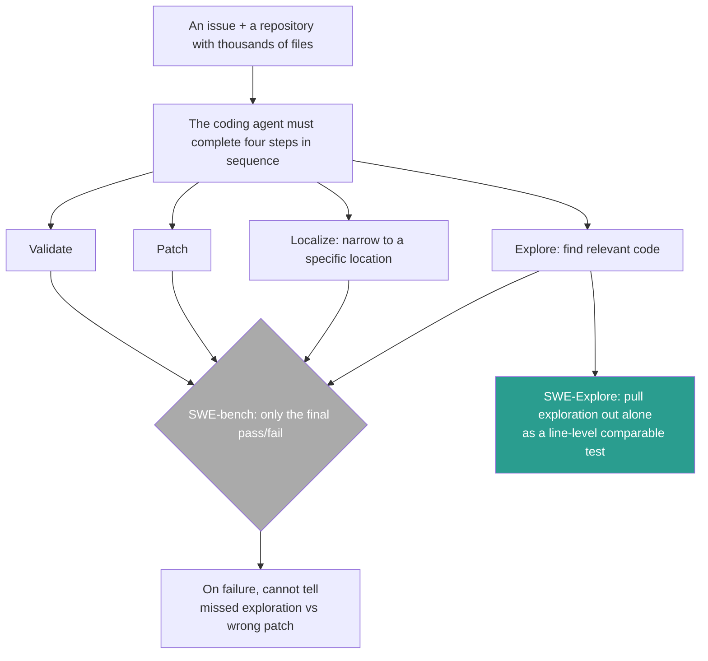
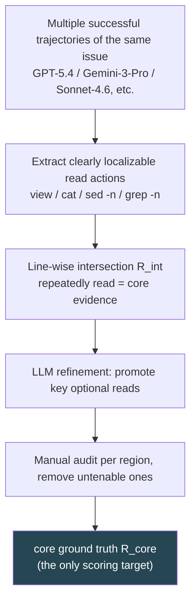
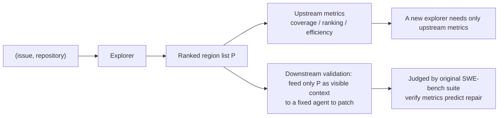

# SWE-Explore: Benchmarking How Coding Agents Explore Repositories

> **Original title**: SWE-Explore: Benchmarking How Coding Agents Explore Repositories
> **Authors**: Shaoqiu Zhang, Yuhang Wang, Jialiang Liang, Yuling Shi, Wenhao Zeng, Maoquan Wang, Shilin He, Ningyuan Xu, Siyu Ye, Kai Cai, Xiaodong Gu
> **Institutions**: Shanghai Jiao Tong University; Xinjiang University; University of Illinois at Urbana-Champaign; The Chinese University of Hong Kong; independent researchers
> **Year**: 2026 (arxiv ID 2606.07297, submitted June 5, 2026; 20 pages, 5 figures)
> **Subject**: cs.SE / cs.CL
> **Link**: https://arxiv.org/abs/2606.07297
> **Reading date**: 2026-06-09

## Reading Guide

### Where this sits in the field

To place this paper correctly, we first need to explain how coding agents have been evaluated over the past year or two.

A coding agent is an AI system that can read code, modify code, and run tests on its own to solve a problem in a real software project. The mainstream yardstick for its capability is the SWE-bench family of benchmarks: give it a real repository and a GitHub issue, have it produce a patch, and then use the project's own test suite to judge whether the patch actually fixed the problem. Fixed counts as pass, not fixed counts as fail. This "executable, binary judgment" protocol is very clean, lets different models be directly compared, and precisely for that reason, over the past two years it has spawned a large batch of frameworks such as SWE-agent, AutoCodeRover, Agentless, OpenHands, and Claude Code, turning "repository-level issue resolution" into an everyday testbed for software-engineering agents.

However, this binary protocol is both its strength and its biggest limitation. Reducing a repair attempt to a single "pass or not pass" does make models comparable, but it covers up the entire mechanics behind success. To fix an issue, an agent must complete several things in sequence: read the relevant code, localize where the problem is, generate the patch, and validate the patch. A holistic pass/fail score cannot tell you exactly which step succeeded and which failed. Stepping back, failure actually comes in two kinds: either it never explored the code that needed changing, or it read enough clues yet failed to assemble a correct patch. The latter is captured by existing executable benchmarks; the former is almost entirely invisible.

What SWE-Explore sets out to do is precisely to pull "the former" out of the black box and make it a comparable test. It belongs to a sub-line that has taken shape over the past year or two: no longer only watching whether the final fix worked, but dissecting the intermediate steps, such as context retrieval, code localization, and bug diagnosis. Within this sub-line, ContextBench has provided human-annotated "gold context," and SWE-Pruner tests context compression. What makes SWE-Explore distinctive is that it locks the evaluation target precisely on the single capability of "repository exploration," using line-level ground truth to measure whether an agent actually reads the code it should.

### What you can answer after reading

After reading this note, you should be able to answer the following.

First, why SWE-bench's binary pass/fail evaluation is insufficient to measure an agent's exploration capability, and what is the point of pulling exploration out to test separately.

Second, what kind of task SWE-Explore formalizes "repository exploration" into, and what "returning a ranked list of code regions under a fixed line budget" concretely means.

Third, where its ground truth comes from, and why it distills from "the intersection of multiple successful trajectories" rather than relying on manual annotation.

Fourth, what the three metric dimensions of coverage, ranking, and context efficiency each measure, and why the authors ultimately argue for reporting a set of metrics rather than compressing into a single score.

Fifth, why current agents are already strong at "finding the right file" yet still weak at "finding all the right lines," and what this recall bottleneck reveals.

### Prerequisites

This note assumes the reader knows what a code repository, a GitHub issue, a patch, and a test suite are, and has a basic notion of "an agent driven by a large model that calls tools." Information-retrieval metrics such as precision, recall, and nDCG are set up with a sentence before use. It does not assume the reader has specifically worked on software-engineering agents or bug localization, and any term proper to those two directions is introduced before being used.

### Abbreviations on first appearance

- **Coding agent**: an AI system that autonomously reads and writes code and runs tests to solve software problems.
- **SWE-bench**: a repository-level benchmark that turns "can the model fix a real GitHub issue" into an executable pass/fail judgment, the object this paper supplements.
- **Repository exploration**: the process of, in a repository with often thousands of files, finding the code relevant to the current issue.
- **Localization**: a sub-goal of exploration, narrowing the scope to a specific file, function, or line of code.
- **Ranked region list**: the output form of exploration, a sequence of code regions ordered from most to least relevant, each region being "file path + start and end line numbers."
- **Line budget**: the upper limit on the total number of code lines admitted during scoring, forcing the explorer to be both correct and compact.
- **Trajectory**: the complete sequence of actions an agent executes to solve a certain issue, including which files and which lines it read.
- **Ground truth**: the standard answer that scoring is checked against, here the "core code regions that should be read."
- **Precision / Recall / F1**: how much of what was found is correct (precision), how much of what should be found was found (recall), and their harmonic mean (F1).
- **nDCG** (normalized Discounted Cumulative Gain): the standard information-retrieval metric for ranking quality, rewarding "useful things ranked early."
- **HitFile / HitRegion**: file-level and region-level hit rates, measuring whether the explorer reached the right file or region.
- **FUH** (First Useful Hit): how early the first region hitting the ground truth is ranked.
- **Context efficiency**: of the code lines selected, what fraction truly falls within the range that should be read.

## (Opening)

Imagine a coding agent receives an issue and must fix some bug in a real repository with thousands of files and hundreds of thousands of lines of code. The first battle it truly has to win is not writing the patch, but "finding those few key lines of code in this ocean." A repository averages over seven hundred files and nearly one hundred eighty thousand lines of non-test code, while what is truly relevant to this issue is often only a few snippets across four or five files, totaling a bit over a thousand lines. Fishing out those thousand-odd lines from the hundred-some-thousand is the precondition for everything that follows.

The problem is that today's mainstream evaluation precisely hides this battle. Benchmarks like SWE-bench only look at whether the final patch passes the tests, a thoroughly binary result. This brings a concrete trouble: when an agent fails, you have no way to know whether it "never found the code to change" or "found it but did not change it correctly." These two failures require completely different directions of improvement, yet the binary score mixes them into one. More importantly, the "did not find" failure is almost invisible, because there is no metric to measure "to what degree it actually explored the repository."

There have been ways to measure "finding code" before, but none are handy enough. One kind is classical retrieval and bug localization, using lexical matching like BM25 and TF-IDF, or semantic retrieval, to fish out possibly relevant files from the issue description. Their evaluation targets are usually "whether a query and a snippet are relevant" or "which file most likely has the bug," with granularity stopping at the file or function level, unable to tell you which specific lines were read. Another kind is the recent localization agents, which can interactively search inside a repository, but each uses different ground truth and different conventions, with no common, line-precise target to compare against one another.

So the problem stands here: can we build a test that cleanly peels "repository exploration" off from end-to-end repair as a single capability, letting classical retrievers, search agents, and long-context selectors compete on the same line-precise target? SWE-Explore's answer is: yes, and the ground truth need not be annotated by a human army, but can be distilled from the trajectories of agents that have already successfully fixed the same issue. This is exactly where it is worth reading: it turns a middle capability long masked by outcomes into an object that is measurable, comparable, and can be verified to actually drive downstream success or failure.

## I. The Problem

Continuing from the opening, let us pin the problem to a clear technical statement: can we construct a benchmark that formalizes "repository exploration" as an independent, line-precise ranking task, so that various exploration methods can be compared on the same target; and, the thing this target measures must be shown to actually drive downstream repair success or failure.

To see the weight of this problem, we first need to understand two gaps in current evaluation.

The first gap is in "granularity." SWE-bench compresses one repair into pass/fail, which makes models comparable yet covers up the mechanics of success. Of the four steps, reading relevant code, localizing the defect, generating the patch, and validating the fix, exactly which one succeeded and which failed, the binary score answers none. Once we step back before this single prediction, two failure modes surface: either failing to explore the code that needs changing, or reading enough clues yet failing to assemble a correct patch. The latter is captured by executable benchmarks; the former is largely invisible.

The second gap is in the "target." Even though much work has begun to study agents' localization and retrieval, they lack a common, precise standard for comparison among them. Measuring file-level or function-level localization only indicates whether the explorer reached the "general neighborhood," and no metric reveals exactly which lines of code were explored. Yet fixing a bug often hinges on a single specific span. An explorer may reach the right file yet happen to miss the decisive span; or surface the right evidence at a very late position. These differences are not captured by file-level labels or final resolve rate.

Prior work approached this problem along two lines, each with its merits. The first is classical retrieval and bug localization, with BM25 and TF-IDF as lightweight baselines and IR-style bug localization guessing which file is most likely faulty. What they do right is being cheap and training-free, where they fall short is targeting "query-snippet relevance" or "buggy-file relevance" rather than "the code lines actually consulted during successful repair." The second is the recent localization agents, moving from static retrieval toward interactive exploration: AutoCodeRover combines LLM reasoning, code search, and program analysis, while LocAgent, OrcaLoca, and CoSIL localize over files, functions, ranked entities, or iterative code-graph search respectively. What they do right is turning exploration into multi-step interaction, where they fall short is divergent conventions and the lack of a target that puts lexical retrievers, dense retrievers, rerankers, and exploration agents together to compare as "ranked, line-level region producers."

What SWE-Explore fills is precisely this gap: a benchmark that jointly measures, on the same set of instances, the "trajectory-distilled line-level exploration quality" and "its actual effect on downstream repair."

## II. Method

SWE-Explore's design splits into three things: what kind of task to define exploration as, where the ground truth comes from, and what metrics to score with. The following unfolds in order.

### Task definition

SWE-Explore formalizes "repository exploration" as an independent functionality. Given an issue $q$ and a repository snapshot $\mathcal{R}$, the explorer must return a ranked list of relevant code regions:

$$
f:(q,\mathcal{R})\;\mapsto\;P=(r_1, r_2, \ldots, r_K)
$$

where each region $r_i=(p_i, s_i, e_i)$ consists of a file path $p_i$ and a line range $[s_i, e_i]$. The key is that this task is deliberately set very light: the explorer need not produce any patch, cannot access the ground truth, and is not required to actually interact with the repository. This way, sparse retrievers, interactive agents, and long-context selectors can all be treated as "producers of the same ranked region list" and compared together under a fixed line budget. In other words, it converges the assorted exploration methods onto the same output format.

### Distilling ground truth from successful trajectories

For a repository-level issue, "which code should be read" is, if annotated by hand, both expensive and hard to standardize: hundreds of issues span ten languages, and different annotators draw different boundaries around helper functions, configuration, and tests. SWE-Explore takes a different approach, distilling the ground truth from "agent trajectories that have already successfully solved the same issue."

Concretely, it keeps only instances with at least two successful repair trajectories, these trajectories coming from current strong models such as GPT-5.4, Gemini-3-Pro, Sonnet-4.6, GLM-5.1, and Kimi-K2.6. The reason for requiring at least two is that the consistency across different solution paths is later used as the signal for core evidence. Past this filter, 848 instances remain, spanning 10 languages and 203 open-source repositories. Each instance averages 4.3 ground-truth files, 4.7 regions, and 1,578 visible lines, embedded in repositories that average 759 files and nearly 180 thousand lines of non-test code.

The distillation steps go as follows. First, from each trajectory collect all read actions that can be clearly mapped to a "file plus line interval," including editor-style views, command-line cat/head/tail/sed -n, and grep -n line hits; the free-form terminal interactions that cannot be clearly mapped are simply discarded, preferring to miss rather than to heuristically expand. Then take a line-wise intersection across the multiple trajectories to get a conservative core candidate $R_{\text{int}}$, the rationale being that regions repeatedly read by different solution paths are more likely the core context that truly carries evidence. Next, an LLM-based refinement step promotes a small subset of "optional reads" that, while not in the intersection, are load-bearing for resolving the issue. Finally, the authors manually audit every refined ground truth, removing untenable regions, to obtain the final core ground truth $R_{\text{core}}$.

### The metric family

With ground truth in hand, the next question is how to score an explorer's ranked region list against it. SWE-Explore designs a set of metrics along three dimensions.

The first dimension is coverage and accuracy. Precision and recall are defined at the line level: precision is "of the lines selected, what fraction falls in the ground truth," recall is "of the ground-truth lines, what fraction was selected," and F1 is their harmonic mean. It also reports two coarser hit rates, HitFile measuring whether the right file was reached, and HitRegion measuring how many core regions were covered by at least one predicted region, which capture the practically important event of "even if the line span is imprecise, at least the right code was grazed."

The second dimension is ranking under a budget. The authors adapt information retrieval's nDCG to a "line budget" setting: each predicted region's gain equals the number of core lines it covers, accumulated in predicted order and discounted by rank, summing only over the prefix whose cumulative line count does not exceed the budget $B$.

$$
\textsc{DCG@}B = \sum_{i\in P_{\leq B}}\frac{g_i}{\log_2(i+2)}
$$

This is then normalized against the best DCG attainable on the same instance under the same budget, giving nDCG@B. The benefit of a line budget rather than a rank cutoff is that a long, verbose region that exhausts the budget without proportional gain is penalized just as heavily as outright omitting useful content. The authors also report FUH (First Useful Hit), measuring how early the first region hitting the ground truth is ranked, where earlier means the explorer surfaced useful evidence sooner.

The third dimension is efficiency and noise. Context efficiency measures "of the predicted visible lines, what fraction falls within the core or optional evidence," quantifying how much of the selected context is genuine material versus off-target. The noise rate is the reverse, measuring how many predicted regions touch neither core nor optional, serving as a region-level diagnostic.

### Validating the metrics by downstream repair

All the metrics above are "upstream," measuring exploration quality itself. But the authors also want to answer a more fundamental question: does a high exploration score actually buy better repair? For this they construct a one-time "restricted-context environment": after obtaining an explorer's output, hide everything in the repository outside these selected regions, feed only this bit of context to a fixed coding agent to produce a patch, and judge with the original SWE-bench test suite. It must be stressed that this downstream bridge is only a one-time sanity check on the metrics and does not enter the standard evaluation loop, and a new explorer can be benchmarked with the upstream metrics alone.

## III. Experiments

### Setup

The explorers evaluated fall into four families. Two baselines bound the dynamic range: Oracle returns the core ground truth directly (upper bound), and Random returns uniformly sampled regions (lower bound). Sparse retrievers are BM25 and TF-IDF. The lightweight dense retriever is a RAG pipeline based on Potion (a static word-embedding retriever distilled from a sentence-embedding model). Finally there are the exploration agents, covering five general-purpose coding agents (Claude Code, Codex, OpenHands, Mini-SWE-Agent, AweAgent) and four academic localization agents (AutoCodeRover, LocAgent, OrcaLoca, CoSIL). Each explorer is asked to return its five most relevant regions, that is $K=5$, matching the ground truth's average of 4.7 core regions. The main reported metrics are precision, nDCG@500, HitFile, and context efficiency, the four chosen for high downstream correlation and low mutual redundancy.

### The metrics do predict repair

First, the downstream validation. The authors take each explorer's output as the only visible context, feed it to a fixed patching agent, count the resolve rate, and then compute the correlation between each upstream metric and this resolve rate. The result is quite clean: context efficiency has the highest Pearson correlation, at 0.950, indicating useful context must be both relevant and compact; while early recall under a tight budget, Rec@100, is the strongest rank correlation signal (Spearman 0.845), indicating that "covering the evidence within a very tight line budget" especially predicts repair success or failure. HitFile, HitRegion, and FUH are also strong signals. This set of correlations gives confidence to "using upstream exploration metrics as the main evaluation."

The downstream resolve rate itself is also telling (GPT-5.4 with Mini-SWE-Agent, $K=5$).

| Explorer | Downstream resolve rate (%) |
| --- | --- |
| Oracle (upper bound) | 59.7 |
| CoSIL | 59.3 |
| Codex | 50.3 |
| Mini-SWE-Agent | 50.0 |
| Claude Code | 48.0 |
| OpenHands | 47.7 |
| AutoCodeRover | 44.7 |
| TF-IDF | 26.0 |
| RAG (Potion) | 23.3 |
| BM25 | 12.7 |
| Random | 4.7 |

One can see that the exploration agents (44 to 59) sit a clear tier above the sparse retrievers (12 to 26), and CoSIL nearly matches the Oracle.

### Exploration quality: reaching the right file is easy, covering the right lines is hard

The table below excerpts each explorer's upstream quality ($K=5$, all agents driven by GPT-5.4). Rec ℓ is line-level recall, and the down arrow means lower is better.

| Explorer | Precision | Line Recall | F1 | HitFile | nDCG@500 | Context Eff. |
| --- | --- | --- | --- | --- | --- | --- |
| Oracle | 1.000 | 0.953 | 0.964 | 0.923 | 0.858 | 1.000 |
| BM25 | 0.055 | 0.021 | 0.024 | 0.079 | 0.132 | 0.087 |
| TF-IDF | 0.117 | 0.049 | 0.054 | 0.140 | 0.223 | 0.190 |
| OpenHands | 0.489 | 0.179 | 0.209 | 0.645 | 0.867 | 0.737 |
| AweAgent | 0.577 | 0.140 | 0.182 | 0.682 | 0.954 | 0.829 |
| Claude Code | 0.598 | 0.154 | 0.202 | 0.667 | 0.938 | 0.829 |
| AutoCodeRover | 0.680 | 0.233 | 0.291 | 0.280 | 0.720 | 0.738 |
| **CoSIL** | 0.581 | **0.788** | **0.602** | 0.544 | 0.824 | 0.898 |

This table holds several of the paper's most important findings.

First, exploration agents are clearly a step above non-agentic retrieval. BM25, TF-IDF, and that lightweight dense retriever still hug Random on most metrics, while every exploration agent is far above them. This shows repository exploration cannot be won by one-shot lexical or vector retrieval; multi-step interaction is already a necessary condition to reach the level occupied by modern agents.

Second, low F1 is mainly a recall problem. Despite high file hit rates and ranking scores for the general-purpose coding agents, their line-level recall stays only at 0.14 to 0.19. In other words, they often find a seemingly right file early, yet miss many of the specific spans needed to cover the full ground truth. Reaching the right "neighborhood" is not hard; reading all the "house numbers" that should be read in that neighborhood is, and this is precisely the central bottleneck of current explorers.

Third, switching to a stronger base model shifts the operating point but does not move the bottleneck. Fixing the Mini-SWE-Agent scaffold and only swapping the underlying model, the GPT family is the strongest, Kimi and Sonnet are in the middle, and GLM and Gemini are weaker on coverage and ranking; but across all models, file hits stay far above line recall. This means a stronger model alone cannot remove the exploration bottleneck; high-recall region discovery requires a better exploration mechanism, not a stronger patching model.

Fourth, the general-purpose coding agents are surprisingly alike. Claude Code, Codex, OpenHands, Mini-SWE-Agent, and AweAgent fall on nearly the same operating point across coverage, ranking, and efficiency: high file hit, high early ranking, compact context, low line recall. Their implementations and scaffold complexity differ, yet their outputs are so close, hinting that studying the exploration sub-problem does not necessarily need a complex repair framework; a simpler explorer interface can expose much of the same behavior.

Fifth, specialized localizers only truly win when they "broaden the search." AutoCodeRover is precise yet conservative, OrcaLoca has very low noise yet misses many relevant regions, and LocAgent resembles a general agent rather than changing the recall frontier. The lone exception is CoSIL: it achieves a line recall (0.788) and F1 (0.602) far above other non-Oracle methods, showing that its iterative code-graph search is a key component for high-recall exploration. By contrast, explorers relying more on shell-style navigation or narrow search actions often reach the right file yet under-cover the line-level evidence.

### Missing evidence is more fatal than added noise

The last controlled experiment asks a very practical question: is the patching agent more afraid of "missing relevant context" or of "mixing in irrelevant context"? In the restricted environment, the authors expose only a fraction of Oracle's core context by ratio (missing condition), or fill the removed budget with randomly sampled non-core regions (redundant condition), and sweep this ratio.

The conclusion is that missing context is the dominant failure mode. Resolve rate does not rise smoothly with each additional region, but shows a threshold pattern: it stays low until the core evidence is sufficiently assembled, then jumps sharply near a certain point. This shows that several pieces of core evidence must be present together before a correct fix becomes likely. And once past this threshold, redundancy hurts much less; the extra irrelevant code mixed in is broadly tolerable to modern patching models. In short, in the high-coverage regime, missing core evidence matters far more than losing a bit of precision, so recall-oriented improvements are more valuable than small filtering gains.

## IV. Limitations

Let us split the limitations into those the authors point to themselves and those visible after reading.

The authors point to several themselves. First, the ground truth is distilled from the successful trajectories of current strong models, essentially a behavioral signal of "what these agents read," not a model-independent gold standard; the authors mitigate with multi-trajectory intersection plus manual audit, but it carries a behavioral tint regardless. Second, the empty-context baseline must be treated carefully: with no repository context, the model may answer from an "issue-only" prior and thereby appear not low, and this memorization-induced inflation needs cautious interpretation. Third, that downstream repair bridge is only a one-time sanity check on the metrics and does not enter the standard evaluation.

A few more become visible after reading.

First, the circularity of the ground truth deserves vigilance. Since the standard answer is defined by "the code successful agents read," an explorer that reads differently yet would also fix the issue could be underrated by this ground truth. The multi-trajectory intersection and manual audit lower this risk but do not eliminate it. CoSIL's recall, far above its peers, also hints that the "low recall" of the others may partly reflect reading style rather than genuine failure.

Second, the filter of "at least two successful trajectories" biases the benchmark toward issues that current strong models can already solve, while precisely the hard cases that even strong models cannot crack, where exploration matters most, are excluded. In other words, this test measures "how well one explores on solvable problems," and may not cover the hardest exploration scenarios.

Third, in the main table all exploration agents are driven by GPT-5.4, which entangles "explorer design" with "base model." The authors partly disentangle this with the single-model-swap table, but the entanglement of exploration mechanism and model capability is not fully separated.

Fourth, $K=5$ is fixed, while the ground-truth regions can reach up to 15; for issues that need reading more snippets, fixing the return at five regions itself sets a ceiling on recall.

## One Sentence

Pull "repository exploration" out of bug fixing on its own, distill line-level ground truth from multiple successful trajectories, and make it a ranked test; the finding is that current agents are already strong at reaching the right file yet still weak at covering the right lines, and that missing core evidence hurts repair far more than mixing in irrelevant context.
