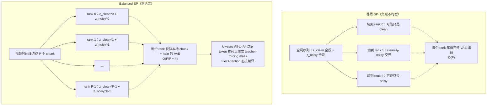
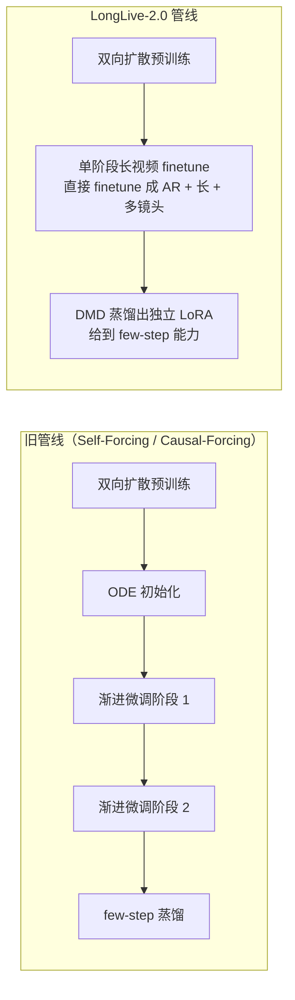
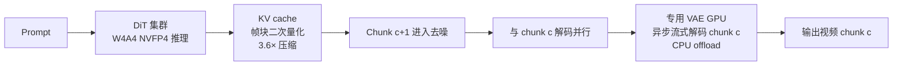
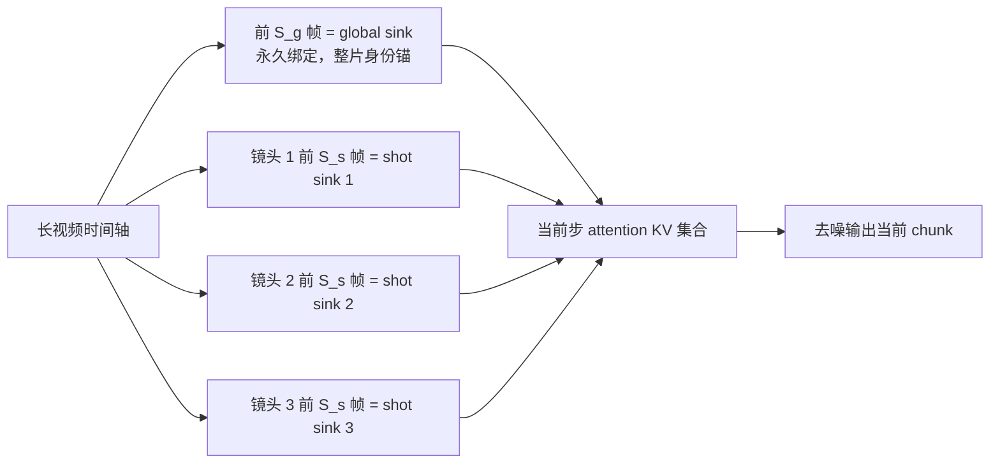

# LongLive-2.0：用 NVFP4 并行底座做长视频生成

> **原题**：LongLive-2.0: An NVFP4 Parallel Infrastructure for Long Video Generation
> **作者**：Yukang Chen, Luozhou Wang, Wei Huang, Shuai Yang, Bohan Zhang, Yicheng Xiao, Ruihang Chu, Weian Mao, Qixin Hu, Shaoteng Liu, Yuyang Zhao, Huizi Mao, Ying-Cong Chen, Enze Xie, Xiaojuan Qi, Song Han
> **机构**：未在公开页给出
> **年份**：2026（arxiv ID 2605.18739）
> **分类**：cs.CV
> **链接**：https://arxiv.org/abs/2605.18739
> **精读日期**：2026-05-19

## 阅读须知

### 这篇在领域里的位置

视频生成在过去两三年里走过了一条相当陡的曲线。最早一拨工作能稳定生成的视频通常以"秒"为单位计长度，几秒的片段已经算得上漂亮；随后一支基于扩散模型的路线把质量推到了可观的水准，但代价是显存开销与生成时长同样以非线性的速度往上跳。生成一段一分钟以上的视频，不仅训练时常常 OOM（Out Of Memory，显存爆掉），推理时也很难做到实时或近实时的交互响应。研究界对此尝试过两条互补的路线：一条是从算法角度做"长程一致性"，比如自回归生成、引入历史帧锚定；另一条是从工程角度做"省钱省时间"，比如用蒸馏把扩散步数从几十步压到几步、把模型参数做 PTQ（Post-Training Quantization，训练完之后再做的量化）。

LongLive-2.0 这篇的位置在于：它不再把算法与工程分开看，而是把训练与推理同时按 NVFP4 这种 4 比特浮点格式重新设计，并且引入一种叫 Balanced SP（Balanced Sequence Parallelism）的并行训练方式，让长视频任务从训练那一端就为推理时的低比特执行做好准备。换句话说，过去那种"训练时用高精度，推理前再做 PTQ"的两段式做法被它打通成"训练即推理用的格式"。这是一篇工程系统侧的论文，但它的设计选择会反过来约束算法侧未来怎么写训练循环。

### 读完能回答什么

读完这份笔记，应当能回答下面五件事。第一，**NVFP4** 这种 4 比特浮点格式相比于以往常用的 BF16（Brain Float 16）与 INT4 量化分别强在哪一层。第二，长视频自回归训练里那个"clean-history 与 noisy-target 拼在一起再切分"的负载不均衡问题具体是怎么发生的，**Balanced SP** 又怎样在每个 GPU rank 上同时持有 clean 与 noisy 来把负载摊平。第三，推理时的三件事——权重激活都用 W4A4、KV cache 按帧块做二次量化、以及 3D VAE 用一颗专门 GPU 异步解码——各自压下来多少显存与时延。第四，多镜头视频如何用 global sink 加 shot-level sink 这两组锚点防止人物身份在镜头切换时漂移。第五，整个训练管线从"多阶段 ODE 初始化加渐进微调"被简化成"单阶段直接 finetune 加 LoRA 蒸馏出 few-step 能力"之后，工程上变得多干净。

### 阅读前置

预设读者熟悉扩散模型的基本运作（前向加噪、反向去噪、x_0 预测目标），熟悉 Transformer 的注意力算子与 KV cache 概念，并对自回归生成（每一步以历史输出为条件预测下一段）有一定概念。预设读者大致清楚 BF16 与 FP32 在训练时的精度差异，但不预设读者亲自做过低比特量化的工程实践。也不预设读者熟悉视频生成专有的 3D VAE、teacher-forcing、shot-level 控制等术语，本文会在对应位置补足。

### 全文缩写表

| 缩写 | 英文全称 | 解释 |
|---|---|---|
| **NVFP4** | NVIDIA FP4 | 英伟达提出的 4 比特浮点格式，E2M1 编码（2 指数位 + 1 尾数位 + 1 符号位） |
| **SP** | Sequence Parallelism | 沿序列维度把张量切到不同 GPU 上执行的并行方式 |
| **AR** | Autoregressive | 自回归生成，每一步以历史输出为条件预测下一步 |
| **DMD** | Distribution Matching Distillation | 一种把扩散步数从几十压到几步的蒸馏方法 |
| **VAE** | Variational AutoEncoder | 变分自编码器，本论文里用作把原始像素压成潜空间表示的 3D 版本 |
| **DiT** | Diffusion Transformer | 用 Transformer 替代 U-Net 做扩散模型骨干的架构 |
| **KV cache** | Key-Value cache | 自回归推理时缓存历史步的 K、V 矩阵以避免重算 |
| **PTQ** | Post-Training Quantization | 训练完成后再做的量化，不参与训练过程 |
| **W4A4** | Weight-4-bit / Activation-4-bit | 权重与激活都用 4 比特表示 |
| **LoRA** | Low-Rank Adaptation | 一种参数高效微调方法，只训练低秩矩阵叠加在冻结的主干上 |
| **VBench** | Video Benchmark | 视频生成质量评测套件，包含画质、语义、长视频等维度 |
| **FlexAttention** | PyTorch FlexAttention | PyTorch 提供的可编程注意力块调度器，支持任意 mask 模式 |
| **Blackwell / GB200** | NVIDIA Blackwell GPU | 英伟达最新一代 GPU 架构，原生支持 NVFP4 |
| **OOM** | Out Of Memory | 显存溢出，训练或推理因显存不足无法继续 |

## 一、问题

### 为什么这个问题值得做

把问题落到一个具体场景里，先想一下"生成一段六十秒的高清视频"对一个产品意味着什么。短视频平台的创作者已经在用 AI 工具生成几秒到十几秒的素材，但只要时长往一分钟以上推，问题就接连出现：第一段画面看起来不错，到三十秒主角的脸忽然换了一张；切换镜头之后衣服款式悄悄变了；服务器端单卡显存被几十 GB 的 KV cache 与一坨 3D VAE 占满，每生成一段就要等几分钟，根本谈不上实时交互。这一系列毛病背后是同一个根本约束：当下扩散模型的训练与推理算法没有为"长"这件事专门优化过，所有工程指标都在分钟级长度的视频面前线性甚至非线性地膨胀。

过去几年这条赛道上的主流路线大致可以归成三条。第一条是纯算法路线，研究怎样让模型在长程范围内保持一致性。代表性做法是把视频生成改造成自回归形态，每一步以前面已生成的若干帧为 history 条件再预测下一段，这一类工作在算法层面解决了"长程不一致"但没解决"工程上跑不动"。第二条是纯工程路线，比如训练完之后做 PTQ 把模型压到 4 比特再上线推理，时延和显存能压一截，但训练时的精度与推理时的精度对不上，质量损失不可忽略。第三条是把扩散步数蒸馏到几步内的 few-step 路线，例如 DMD，能省下大段推理时间，但通常需要一套很复杂的多阶段训练管线（ODE 初始化加渐进微调），工程上易碎且难调。

之所以这三条路线各自吃不消，是因为它们都把训练与推理当作两件可以解耦的事情。训练时用 BF16 做完所有参数更新，推理前再单独做量化、蒸馏、KV 压缩，看起来分工明确，实际效果是训练分布与推理分布在低比特域中并不对齐，质量损失被推到推理端集中暴露。LongLive-2.0 要解决的就是这一层"训练与推理割裂"导致的代价。

### 把问题落到三个技术 statement

把上面的高层动机翻译成可验证的技术问题，可以拆成三件具体的事。

第一件是**训练侧的并行效率与显存**。长视频训练里把 clean-history 与 noisy-target 拼在一条长序列上送进自回归模型，按朴素 SP 沿序列切分时会出现工作负载不均衡——某些 rank 只拿到 history、另一些只拿到 target——同时每个 rank 都要重复做完整的 VAE 编码。论文要解决的是：怎样让每个 GPU rank 既拿到本地化的 history 与 target 配对，又只做与本身负责的时间块相称的 VAE 工作。

第二件是**推理侧的时延、显存与质量之间的三角**。低比特执行能省时省内存，但质量必然有损；KV cache 压缩能省内存但解压一旦贵了就抵消好处；扩散步数压到 2-4 步能省时延但容易让画质崩。要回答的是：能不能把这三条优化叠加在一起，在 720p 一分钟视频这种规模上做到既快又省又不明显掉质量。

第三件是**训练管线本身的简化**。能不能从一个双向扩散模型直接 finetune 成长视频、交互式、多镜头的 AR 模型，而不必走两阶段 ODE 初始化加渐进微调那条老路。少一道阶段意味着少一处出错可能，少一次需要调参的实验。

## 二、方法

整套方法可以拆成五块：NVFP4 量化格式、Balanced SP 训练、训练管线简化、推理底座、多镜头注意力锚点。

### NVFP4 量化格式

先讲 NVFP4 是什么。这是英伟达提出的一种 4 比特浮点格式，编码采用 E2M1，意思是 1 个符号位、2 个指数位、1 个尾数位，总共 4 比特。与同样 4 比特宽的整数量化（INT4）相比，NVFP4 的步长是非均匀的——指数位让小数值附近保留细密的步长，大数值之间用粗的步长跳过，这一点对神经网络里"分布长尾、绝大多数权重靠近 0"的统计性质极为友好。

具体到一个张量的存储，NVFP4 采用三层 hierarchical scaling：

- 整张张量级的一个 FP32 缩放因子 α^FP32，负责把整体动态范围归一化
- 张量内每 16 个元素的 block 级一个 FP8 E4M3 缩放因子 α^FP8，负责把局部动态范围拉齐
- 每个元素本身的 FP4 数值 X^FP4

最终反量化公式是：

$$
\text{Dequant}(X) = X^{\text{FP4}} \cdot \alpha^{\text{FP8}} \cdot \alpha^{\text{FP32}}
$$

这种分层缩放的好处在于既保留了元素级 4 比特的存储压缩，又用 FP8 与 FP32 在不同尺度上把误差控制住。

### Balanced Sequence-Parallel AR 训练

第二块是 Balanced SP。这是论文的核心训练侧创新，要先讲清楚问题再讲方案。

长视频的自回归训练有一个特殊安排：每一步训练目标都需要看一段 clean-history（已经成型的历史帧）作为条件，加上一段 noisy-target（还在去噪过程中的目标帧）作为预测对象。朴素的做法是把这两段在时间维度上拼在一起，记为 $[z_{\text{clean}}; z_{\text{noisy}}]$，然后用标准的 SP 沿序列维度切给若干 GPU。问题出在这一切。clean-history 段往往与 noisy-target 段长度不均，切片之后某些 rank 只拿到了 clean 那一部分、其他 rank 只拿到了 noisy 那一部分。每个 rank 处理的 token 数量与计算复杂度差距明显，整体训练速度被最慢的那一个 rank 拖住。更糟的是，VAE 编码这一步通常需要看完整的视频帧才能做，于是每个 rank 都被迫复制一份完整的 VAE 编码，浪费了显存与算力。

Balanced SP 的设计是让每个 rank 在本地直接持有"自己时间块的 clean 与 noisy 配对"，而不是让某个 rank 只拿 clean、另一个只拿 noisy。具体来说，整段视频被沿时间维切成 $P$ 个 chunk，每个 GPU rank 持有一个 chunk 的 clean-history 与 noisy-target 配对，全局的 token 顺序变成：

```
[z_clean^(0), z_noisy^(0), z_clean^(1), z_noisy^(1), ..., z_clean^(P-1), z_noisy^(P-1)]
```

这一安排带来三件事。第一，每个 rank 处理的 context 与 target token 数量相等，负载摊平。第二，每个 rank 只需要对自己时间块加上一点 halo（边界重叠）做 VAE 编码，VAE 成本从 $O(F)$ 降到 $O(F/P + h)$。第三，经过 Ulysses All-to-All 通信之后，token 的全局顺序天然形成了一个 teacher-forcing 注意力掩码——clean 位置可以看见所有过去的 clean 与 noisy 位置，noisy 位置只能看见自己时间块之前的内容——这个掩码可以直接用 FlexAttention 编译成高效 kernel，不必显式构造排列矩阵。

下面这张图把 Balanced SP 与朴素 SP 的对比画出来：



### NVFP4 训练的工程细节

把 NVFP4 应用到 AR 训练上还有几处工程考量。权重与激活全部走 W4A4 量化，论文为此自写了 CUDA kernel；权重用 2D 块级缩放（块沿两个维度），激活与梯度用 1D 块级缩放。但有几类操作对数值敏感，论文保留了较高的精度：reduction 操作、normalization 层、optimizer 内部状态全部维持在更高比特位。梯度路径上，在权重梯度 GEMM 量化之前，先经过一次 Random Hadamard Transform 来稳定数值分布。

few-step 蒸馏部分采用的是"冻结主干 + 训练 LoRA 适配器"的方式。LoRA rank 设为 128，alpha 也设为 128。蒸馏时引入了一种叫"adaptive scale search"的做法，搜索的幅度目标集合是 $\{4, 6\}$，用来让蒸馏过程中的尺度选择与主干保持兼容。

### 训练管线简化

第三块是管线本身的简化。过去同类工作（Self-Forcing、Causal-Forcing 等）需要走一段复杂的多阶段流程：先做 ODE 初始化得到一个起点，再做渐进微调让模型逐步具备长视频能力，最后再做 few-step 蒸馏。LongLive-2.0 把这套流程压成了"单阶段 finetune"。一个原本是双向扩散的预训练模型，直接在长视频数据上 finetune 成长、交互、多镜头的 AR 模型；few-step 能力则单独从 DMD 蒸馏出一组 LoRA 权重，不需要再走 ODE 初始化或者渐进微调。

下面这张图把新旧管线的差别画出来：



### 推理底座

第四块是推理侧的三件叠加优化。

第一件是 NVFP4 推理。权重在物化后以 4 比特存储，激活也走 4 比特，理论吞吐相比 BF16 提升 4 倍。

第二件是并行 KV 量化。KV cache 在长视频自回归推理里会膨胀到非常大的体量。论文做的是"按帧块二次量化"——每 8 帧打成一个 chunk，对这个 chunk 内的 K、V 分别做 K-smoothing 与 adaptive scale 选择，最后把存储成本从原来的 $4 T_c \cdot H \cdot d$ 字节压到 $\frac{9}{8} T_c \cdot H \cdot d$ 字节，大约 3.6 倍压缩。配套的反量化在自写 CUDA kernel 里完成，整体开销控制在 2% 以内。

第三件是 3D VAE 的异步流式解码。原来的 3D VAE 解码需要一次性看完所有 chunk，显存占用是 $O(C \cdot T_c)$；新版本改成按 chunk 顺序解码，单 chunk 期间 GPU 显存占用降到 $O(T_c)$。论文进一步专门留出一颗 GPU 做 VAE 的解码工作，DiT 集群在做 chunk $c+1$ 的去噪同时，那颗 VAE GPU 在做 chunk $c$ 的解码，二者重叠把 VAE 时延藏在 DiT 计算背后。

下面这张图把推理路径的三层优化串起来：



### 多镜头注意力锚点

第五块解决的是多镜头视频里的身份漂移问题。视频生成走到几十秒以上时，主角的脸、衣服、配饰常会在某次镜头切换之后"换一个人"。LongLive-2.0 引入两组锚点：

- **Global sink**：视频开头的前 $S_g$ 帧永久绑定为整片的身份锚点，整段视频里所有 attention 计算都把它纳入参考
- **Shot-level sink**：当前镜头开头的前 $S_s$ 帧，每次场景切换时重新绑定

实际生效的 KV 集合是：

$$
A_g \cup A_s \cup KV[t - W, t)
$$

加上去重逻辑。shot-level sink 在内存上几乎免费——它只需要追踪一对标量指针，不需要额外存储 KV 拷贝。这一机制与 chunk-wise prompting 也能天然衔接：prompt 切换本身就定义了镜头切换。

下面这张图把双锚点机制画出来：



## 三、实验

### 数据集

训练数据是论文自建的一份 12 万条长视频数据集，按时长分成三组：16-32 秒、32-64 秒、超过 64 秒。每条视频都带有 shot-level 标注。质量过滤上用 MANIQA 这个指标判断画质，并剔除带 logo、水印、明显模糊与镜头抖动的样本。

### 训练效率

下表对比 BF16+朴素 SP、Balanced SP、NVFP4+Balanced SP 三种配置在不同视频长度下的单步训练时间。

| 视频长度 | BF16 + 朴素 SP | Balanced SP | NVFP4 + Balanced SP | 总加速比 |
|---|---|---|---|---|
| 16 秒 | 52.2 秒 | 45.8 秒 | 40.1 秒 | 1.3× |
| 32 秒 | 162.7 秒 | 136.8 秒 | 119.3 秒 | 1.4× |
| 64 秒 | OOM | 1196.5 秒 | 639.5 秒 | 2.1× |

值得单独点出来的是 64 秒这一行：BF16 + 朴素 SP 直接 OOM，根本训不动；Balanced SP 把它救回来；再叠加 NVFP4 之后单步时间又减半。换句话说，64 秒以上的视频训练，这套底座是必要条件而不是性能优化项。

### 推理效率

64 秒视频的端到端推理对比：

- BF16 基线：单步 36.4 秒，显存 112.9 GB
- NVFP4 + KV cache 二次量化 + VAE 异步解码：单步 19.4 秒，显存 19.4 GB
- 2-step NVFP4：端到端 36.3 秒，吞吐 45.7 FPS

显存从 112.9 GB 压到 19.4 GB，单卡可执行的视频长度上限被显著拉高。这一组数字对于实时交互的产品形态（用户输入 prompt 后等几十秒看完整段视频）来说有直接落地价值。

### 视频质量（VBench 720p）

| 配置 | 总分 | 画质分 | 语义分 |
|---|---|---|---|
| 4-step BF16 | 85.06 | 86.67 | 78.63 |
| 4-step NVFP4 | 84.51 | 86.43 | 76.81 |
| 2-step NVFP4 | 83.14 | 85.40 | 74.12 |

4-step NVFP4 与 4-step BF16 的总分差距是 0.55 分（85.06 vs 84.51），代价是把权重激活全部压到 4 比特、显存从 112.9 GB 压到 19.4 GB。这是一个相当划算的 trade-off。2-step 进一步把时延减半，质量再掉 1.37 分，落点取决于产品对实时性与画质的偏好。

### 长视频专门评测

在 VBench-Long（60 秒视频专项）上，LongLive-2.0 的 BF16 变体在综合排名上取得最佳平均名次（3.67）；其 NVFP4 变体在 subject consistency（主体一致性）上拿到最高的 97.62%；BF16 变体的 background consistency（背景一致性）最高，达到 97.00%。这两个指标分别是 "主角不换脸" 与 "场景不漂移" 的代理。

### 关键消融

- DMD 蒸馏阶段的显存峰值：BF16 是 70.5 GB，NVFP4 + LoRA 是 49.0 GB，比例 0.69。这说明 NVFP4 不仅在推理时省，在训练的蒸馏阶段也能省下大段显存
- NVFP4 训练 vs PTQ 推理：预训练直接走 W4A4 得到 84.51 VBench 总分，而单做 PTQ 只能做到 84.04。两者差距正是"训练与推理对齐"这件事带来的红利
- 多镜头注意力锚点的视觉消融：去掉 global sink 之后能直接观察到人物身份漂移；加上之后主角脸与衣服在镜头切换间保持稳定

## 四、局限

### 作者承认的

- **硬件依赖**：NVFP4 的加速效果绑定在 Blackwell 一代 GPU（GB200）上，A100 与 H100 这一代缺少原生优化 kernel，只能回退到 sequence-parallel 推理，吞吐红利大打折扣
- **量化收益的架构特异性**：相比于 INT4 这类通用 4 比特量化，NVFP4 的优势完全是与具体硬件耦合的，跨架构迁移的工作没有做

### 读完能看出来的

第一个潜在问题是泛化范围。论文的所有实验都在自建的 12 万条长视频数据集上做，数据集的内容分布、时长分布、镜头切换风格都由数据策展决定。这套底座搬到另一类视频（例如真人对话、第一人称运动、监控视频）能不能保持同样的训练效率与质量，没有外部基准支持。

第二个潜在问题是工程复杂度。Balanced SP 的实现涉及自写的 Ulysses All-to-All 通信路径、自定义的 FlexAttention mask、配套的 VAE halo 处理，这一整套都依赖论文实现的私有底座。复用门槛不低，开源代码的工程质量与文档质量将直接决定它能不能被业界跟进。

第三个潜在问题是质量评估的可信度。VBench 这一类自动化指标对"视频好不好看"的覆盖能力本身有限，4-step BF16 与 4-step NVFP4 之间 0.55 分的差距在分数上是小数，但在用户感官上是否真的可忽略，需要更系统的主观评测。论文没有给出大规模人评结果。

第四个潜在问题是 LoRA few-step 路径的鲁棒性。LoRA 适配器的规模与底座蒸馏目标都是论文设定的，换到另一个底座或另一类视频数据，蒸馏曲线是否依然平滑、是否依然 2-4 步能稳定收敛，需要进一步验证。

## 一句话

把训练与推理同时按 NVFP4 重新设计，配合 Balanced SP 让长视频训练负载摊平，再叠加 KV 二次量化与 VAE 异步解码，把 64 秒视频推理显存从 113 GB 压到 19 GB，端到端管线从多阶段简化为单阶段直 finetune 加 LoRA 蒸馏。
