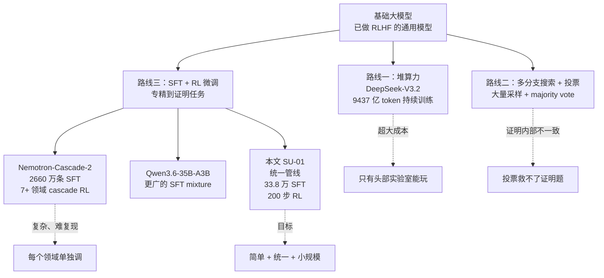
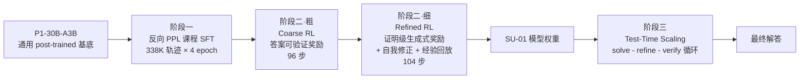
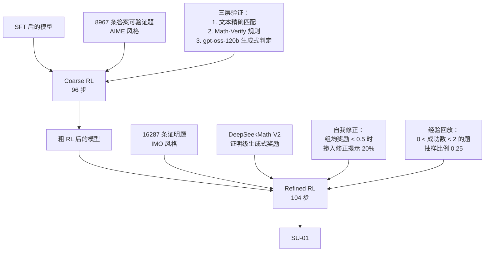
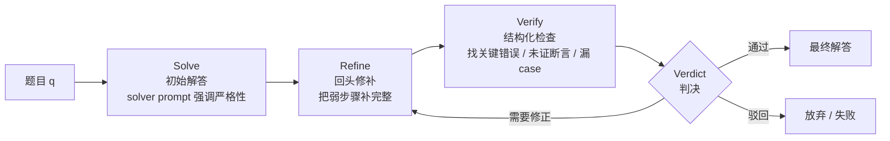

# 用简单统一的扩展达到奥赛金牌级推理

> **原题**：Achieving Gold-Medal-Level Olympiad Reasoning via Simple and Unified Scaling
> **作者**：Yafu Li、Runzhe Zhan、Haoran Zhang 等 28 人
> **机构**：上海人工智能实验室、香港中文大学、清华大学、上海交通大学、北京大学
> **年份**：2026（arxiv ID 2605.13301，提交于 2026-05-13）
> **分类**：cs.AI / cs.CL
> **链接**：[https://arxiv.org/abs/2605.13301](https://arxiv.org/abs/2605.13301)
> **精读日期**：2026-05-17

## 阅读须知

### 这篇在领域里的位置

过去两年里，"让大语言模型做严格数学证明"这个方向上的工作大体分成两个阵营。一个阵营走的是符号化路线，把题目翻译进 Lean、Coq 这类形式系统里，再由神经网络辅助做策略搜索，AlphaProof 和 AlphaGeometry 都属于这一支。这一类方法的优势是只要证完，正确性就是机器可验证的；劣势是覆盖面窄、对题目类型敏感、需要专门的形式化语料。另一个阵营走的是自然语言路线，让模型直接用人类能读懂的散文加公式写出解答，靠后训练把"严格性"灌进模型本身，DeepSeek-V3.2、Gemini Deep Think、GPT-5.5 这类通用前沿模型都走这条线。

本文属于第二阵营，但是想把这条线推到一个更具体的位置上：能不能用一套**简单、统一、不依赖搜索**的后训练加推理配方，把一个本来就经过通用 post-training 的 30B 量级稀疏模型，直接转换成 IMO 与 IPhO 双线金牌级别的求解器。它和 DeepSeek-V3.2 那种"砸算力把推理链堆长"不同，也和 Nemotron-Cascade-2 那种"分七八个领域分别 cascade RL"不同，配方关键词是**简单**和**统一**：一个反向困惑度课程 SFT，加一套粗到细两阶段 RL，再加一层测试时自检循环。

### 读完能回答什么

1. 为什么"奥赛级证明"比"AIME 选答案"难得多，难在哪一类具体能力上。
2. 为什么直接在已经过 post-training 的基底上加 SFT 容易把基底打坏，"反向困惑度课程"怎么解决这件事。
3. 两阶段 RL（粗阶段答案可验证、细阶段证明级奖励）各自要解决什么问题，奖励信号怎么定义。
4. 测试时的 solve - refine - verify 循环和普通 best-of-N 采样的本质区别在哪里。
5. SU-01 这套配方相对于 DeepSeek-V3.2 与 Nemotron-Cascade-2 在训练规模上节省了多少，代价是什么。

### 阅读前置

假定读者熟悉 Transformer 的基本结构，知道什么是 next-token 预测的交叉熵损失，做过或读过 SFT 和 RLHF 的标准流程，对 PPO 这类策略梯度算法有概念。不预设读者了解 Mixture-of-Experts 的稀疏激活细节、不预设读者熟悉数学奥赛评分流程，也不预设读者读过本子领域的具体先驱工作（GSPO、GRPO、ExGRPO 等都会在文中铺垫）。

### 缩写表

| 缩写 | 英文全称 | 1-2 行解释 |
|---|---|---|
| **IMO** | International Mathematical Olympiad | 国际数学奥林匹克。每年 6 题，每题 7 分，满分 42，金牌线随当年题难度浮动，2025 年金牌线 35 分。 |
| **IPhO** | International Physics Olympiad | 国际物理奥林匹克。理论加实验两部分，本文只评理论。 |
| **USAMO** | USA Mathematical Olympiad | 美国数学奥赛，国家级，难度接近 IMO。 |
| **AIME** | American Invitational Mathematics Examination | 美国中学生数学邀请赛，纯短答案题，难度低于 USAMO。 |
| **SFT** | Supervised Fine-Tuning | 有监督微调，把高质量人工或合成解答按标准交叉熵喂给模型，让它学会模仿这些行为。 |
| **RL** | Reinforcement Learning | 强化学习，让模型自己采样多条解答，再用某种奖励信号倒推哪条好、哪条差，更新参数。 |
| **RLHF** | Reinforcement Learning from Human Feedback | 用人类偏好做奖励的 RL，是当下通用对话模型主流的对齐手段。 |
| **PPL** | Perplexity | 困惑度，对一段文本而言，是模型给出的平均负对数似然取指数。直观上代表"模型有多陌生"。 |
| **MoE** | Mixture of Experts | 专家混合架构，把前馈层拆成多个并行专家，每个 token 只激活其中少数几个，于是总参数大但单次激活成本小。 |
| **A3B** | Active 3 Billion parameters | 每个 token 只激活 30 亿参数的稀疏配置，本文模型整体参数量 30B、单次激活 3B。 |
| **GSPO** | Group Sequence Policy Optimization | 一种策略优化算法，相对 PPO 把重要性采样比换成序列级、长度归一化版，特别适合输出可达 10 万 token 量级、且模型本身是 MoE 的场景。 |
| **GRPO** | Group Relative Policy Optimization | DeepSeekMath 提出的算法，按一组采样内的相对优势更新策略，省掉 critic 网络。 |
| **PPO** | Proximal Policy Optimization | 经典策略梯度算法，靠重要性采样裁剪保证更新稳定。 |
| **TTS** | Test-Time Scaling | 测试时扩展，靠在推理阶段花更多算力换更高质量答案，常见手段是采样、投票、自我修正、自我验证。 |
| **CoT** | Chain-of-Thought | 思维链，让模型把推理过程逐步写出来再给最终答案。 |
| **DP** | Dynamic Programming | 动态规划，案例分析里多次出现。 |
| **AoPS** | Art of Problem Solving | 一个数学竞赛社区与题库，本文用作 SFT 数据来源之一。 |

## 一、问题

### 为什么这个问题值得做

奥赛级数学与物理推理在大语言模型的发展史上一直被当作"严格推理"的试金石，原因很具体。一道 IMO 题目不像 AIME 那样只需要交一个数字答案就算赢，评分者会逐行检查证明过程，凡是逻辑跳步、引理未证、case 漏掉、不变量没保持的地方都会扣分。也就是说，AIME 满分只要求"算得对"，IMO 满分要求"证得对、写得清楚、能被另一个人逐行复核"。

这件事不解决，会带来三个具体的痛点。第一，模型在科研与工程辅助场景下不可靠：用户问一个"为什么"问题，模型给出一段看上去通顺的解释，但是其中一步引用了一个不存在的定理或者跳过了一个必须分情况讨论的环节，用户没法看出来，于是错误就这样滑过去了。第二，模型在长链条任务上的内部一致性不稳定：奥赛证明动辄推理链十万 token 起步，期间需要持续维持记号一致、case 不漏、不变量不破，这恰好是普通对话模型不擅长的。第三，从模型评测的角度，AIME 这类短答案 benchmark 已经被大模型刷到饱和，AIME 2025 现在头部模型普遍 90% 以上，再没法区分谁更强；只有 IMO 这类要求完整证明的考卷还能拉开真正的能力差距。

过去一两年里，主流应对路线大致有三条。**第一条**是单纯堆算力，靠规模硬撑长推理链。DeepSeek-V3.2 的持续训练阶段消耗了 9437 亿 token，从绝对实力上确实够强，代价是训练成本极高，复现门槛只对最大的几家实验室开放。**第二条**是多分支搜索加投票，每题采样几十到几百条解答，再用 majority voting 把零散的正确路径汇集起来。这一招对短答案题有效，对证明题失灵：投票挑出来的是"出现频率最高的最终答案"，没法保证那一条具体路径内部从头到尾严格。**第三条**是利用通用模型已有的 chain-of-thought 能力，做针对性 SFT 加 RL 微调。这一条原则上方向对，但是实操里有一个尴尬的悖论：post-trained 的基底已经在通用对话上做过 RLHF，再追加新的 SFT 容易把它原有的提示遵循与自我审查能力打回去。

这就是这篇论文想填的缝。它要回答的是：能不能不靠搜索、不靠 26M 级别的 SFT 数据、不靠分七八个领域的 cascade RL，只用一条**单一的、统一的、相对小规模的**后训练管线，把一个 30B-A3B 的稀疏 MoE 基底（也就是 P1-30B-A3B 这个已经过 post-training 的模型），转换成 IMO 与 IPhO 双线金牌级的推理器。

### 旧路线之间的关系

下面这张图把上面提到的三条路线和本文的位置放在一起。

落到一个可以被实验验证的技术 statement 上，本文的核心断言是这样的：给定一个已经过 post-training 的 P1-30B-A3B 基底，用 33.8 万条解题轨迹做 SFT、25K 条提示做 RL，再叠加一层测试时的自我验证循环，就能让最终模型 SU-01 在 IMO 2025、USAMO 2026、IPhO 2024、IPhO 2025 上全部达到金牌线，并且在 AIME 与 IMO-ProofBench 上不输于规模相近的同期模型。换句话说，**奥赛级推理不一定要靠搜索或者靠两个数量级以上的训练规模**，关键是把简单工序里的每一步做对。

## 二、方法

整套配方分三段：反向困惑度课程 SFT、双阶段 RL、测试时扩展。三段沿着一根主线：先恢复并改写行为模式，再用奖励信号锚定证明的严格性，最后在推理时再添一层自我审阅作为最后的安全网。下面这张总览图先把骨架画出来，后面分小节展开。

### 反向困惑度课程 SFT

SFT 这一阶段要做的事情，是让基底模型学会一组新的行为模式：先尝试解题、再回头自检、再修正错误。光会"一气呵成写出答案"是不够的，奥赛题里更稀缺的是"写完之后能看出自己哪里写得不对"。为此，作者准备了 33.8 万条长度低于 8K token 的解题轨迹作为训练样本。这里 8K 的截断不是随手定的：进入 SFT 阶段时如果让模型直接面对十万 token 量级的轨迹，参数会被长样本主导，模型还没学会"短轨迹该有的紧凑写法"就被推去模仿冗长版本，反而难以收敛。

样本本身的成分（论文 Figure 3）包括四类直接生成数据和两类自我改进数据。直接生成里数学占 40%、STEM 占 15%、代码占 10%、指令遵循占 10%；自我改进里**自我验证轨迹**占 15%、**自我修正轨迹**占 10%。所谓自我验证轨迹，是让 DeepSeek-V3.2-Speciale 这一外部强模型对每条解答生成一段"逐步验证"的批注；所谓自我修正轨迹，是在批注指出错误之后再生成一段修正版。换句话说，模型在 SFT 阶段已经反复见过"先解一遍、再回头检查、再修正"这套三段式行为模式，于是它在测试时被要求做同样的事时，不需要从零学起，只是把已经会的动作再做一次。

真正的关键不在数据本身，而在**课程顺序**。这里需要先解释一下"困惑度课程"是什么。所谓困惑度，定义上是模型对一段文本给出的平均负对数似然取指数，PPL = exp(-1/T · Σ log π(y|x))，直观含义是"模型对这段文本有多陌生"。PPL 越高，模型对这条样本越不熟悉，学起来越费力。一般的课程学习思路是按 PPL 从低到高排，让模型先看简单的、再看难的，模仿人类学新东西的过程。

本文反其道而行之：每一个 epoch 内部，所有样本按 PPL 从**高到低**排序，先训"模型最陌生的"，再训"模型最熟悉的"。之所以这样设计是因为，这套配方的目标不是从空白基底学新知识，而是**改造一个已经有能力的 post-trained 模型**而不打坏它的旧能力。如果先训低 PPL 的样本（也就是模型已经熟悉的部分），训练后期再灌进高 PPL 的陌生样本，最后那几步梯度会显著扰动模型，把基底的对话与提示遵循能力带偏。反过来，先在高 PPL 的陌生样本上把新行为模式（自我验证、自我修正）灌进去，再在低 PPL 的熟悉样本上"固化"已有技能，相当于让基底原有的能力在 SFT 后期被反复强化而非被覆盖。

这件事的实证差距大到看一眼数字就明白。AnswerBench 上，反向 PPL 课程拿到 55.8%，随机顺序 39.5%，正向 PPL 课程（低到高）只有 24.3%。截断率（生成超长被强制截掉的比例）反向只有 0.3%，随机 7.3%，正向退化更厉害。**反向 PPL 课程不是可有可无的小 trick，而是这整套配方能不能 work 的决定因素之一**。

SFT 训练超参数：4 个 epoch，batch size 128，学习率 1e-5 余弦衰减到 1e-6，warmup 占总训练的 10%，weight decay 0.1，Adam β₁=0.9、β₂=0.95。

### 双阶段 RL 流水线

SFT 结束之后是 RL，但是和通用 RLHF 那种"对整段输出按人类偏好打分"的做法不一样，本文把 RL 拆成**先粗后细**两段。先用一批答案可机器判定的题训出"做对答案"这一阶段，再用一批以"证明"开头的题训出"证得严格"这一阶段。下图先把两段的输入输出关系画出来。

**粗阶段（Coarse RL，96 步，答案可验证奖励）**：用 8967 条"答案可机器判定"的题目作为提示，每个 episode 让模型生成一份完整解答，最后只看最终答案是否正确，对则奖励 1，错则奖励 0。这一阶段的目的不是教模型证明，而是让 SFT 阶段引入的新行为模式在"做出正确答案"这个最朴素的目标下稳住。

这里采用的优化器是 GSPO（Group Sequence Policy Optimization）。GSPO 是为 MoE 模型 + 长输出场景设计的策略优化算法，和 PPO 的主要区别在于它把重要性采样比从 token 级换成了序列级，并且做了长度归一化：

sᵢ(θ) = exp{(1/|oᵢ|) · Σₜ log[πθ(oᵢ,ₜ | q, oᵢ,<ₜ) / πθ_old(oᵢ,ₜ | q, oᵢ,<ₜ)]}

其中 oᵢ 是采样得到的第 i 条完整输出，|oᵢ| 是它的 token 数，q 是题目。这样写的好处是，长输出不会因为乘积里 token 多而把重要性比放大到天花板，进而导致梯度爆炸。组相对优势用 Âᵢ = r(q, oᵢ) - μ_Gq 计算，μ_Gq 是这一组采样的奖励均值，相当于把"和同组兄弟比"作为基线，不需要 critic 网络。

奖励判定层级是三层递推：先做规范化文本精确匹配，匹配不上再用 Math-Verify 规则引擎做语义判定（识别等价的代数表达式、单位、分式简化等），仍判不出再调用 gpt-oss-120b 这一外部模型做生成式判定。三层递推的目的是把"答案明显对/明显错"用便宜手段过掉，只把模糊情形交给昂贵的生成式判定，节省 RL 训练里的吞吐成本。

**细阶段（Refined RL，104 步，证明级奖励）**：换到 16287 条"答案不可机器判定"的证明题，例如 IMO 类型那种以"证明……"开头的命题。这一阶段引入三个机制叠加。

**第一是生成式证明奖励**。由 DeepSeekMath-V2 这一外部评分模型对整段证明打分，它的判定标准不是"答案数字对不对"，而是"推理路径在数学上是否有效、是否足够严格、是否完整"。也就是说，奖励信号本身从"结果论"换成了"过程论"。论文里特别提到一个**反 hack 的预处理**：先把明显畸形的输出（如根本没有数学内容只有 markdown 装饰的文本）筛掉再送进奖励模型，避免模型通过格式 trick 骗到高分。

**第二是自我修正机制**。每个 batch 里给定提示 q，模型采样若干条 oᵢ，算这一组的平均奖励。当这一组的平均奖励掉到 τ_ref = 0.5 以下时，说明模型在这道题上一致地写错，光靠采样无法找出正确路径。此时按 η_ref = 0.2（也就是 20%）的比例向后续 batch 里掺入"修正题"，提示词包含原问题、上一次错误解、以及让模型批评并修正的指令。换句话说，模型不仅要 from scratch 解题，还要在已知自己的错误版本之后改对。

**第三是经验回放**。当一道题目 q 在多次采样里有 1 到 2 次成功时（论文记作 0 < n₊(q) < 2，意思是"罕见成功"），把成功轨迹存进缓冲池。这种题目是最有信息量的：纯粹做不出的题无法提供有效梯度，每次都做得对的题也没什么可学的，只有"偶尔做对"的题才告诉模型"这条路径是稀有但可行的"。后续训练时按 ρ = 0.25 的比例从池里抽样进 batch，并且总是挑熵最低的那一条作为示范（即模型"最确定"的成功路径），用 o* = arg min H(o; πθ) 选出。当 n₊(q) ≥ 4 时，这道题已经被反复学会，对应轨迹从池里退役，给新题腾位置。

最终细阶段的优化目标把"新鲜采样"和"回放轨迹"两路 batch 加权：

𝒥_refined(θ) = (1 - ρ) · 𝔼[𝒥_GSPO(fresh)] + ρ · 𝔼[𝒥_GSPO(replayed)]

RL 训练超参数：总共 200 步，64 张 GPU，batch size 128，每条提示采 8 个样本，最长响应 16 万 token，温度 1.0，每次 rollout 后做 4 步策略更新；学习率 1e-6 常数，weight decay 0.1，Adam β₁=0.9、β₂=0.98。一个值得注意的细节是，**RL 阶段 MoE 路由器被冻结**，只更新 expert 与 attention 参数。之所以这样设计是因为，路由器一旦在 RL 阶段被高方差的策略梯度扰动，专家分配会剧烈漂移，进而把训练破坏，冻结路由器是保持稳定的便宜做法。

### 测试时扩展（TTS）

推理阶段引入一段"自我审阅"循环。给定一道题，模型不是一锤子写完就完事，而是按下面这张图反复几轮。

一次完整 TTS 轨迹长什么样，论文用 USAMO 2026 上的中位数说明：初始解答 106K token、修正阶段 83K token、验证阶段 28.7K token、最终判决 404 token，整道题铺到大约 22 万 token。换句话说，TTS 模式下单题推理的算力开销大致是普通短推理任务的几十倍。这套循环和普通的 best-of-N 采样有本质区别：best-of-N 只是平行采样然后挑一个，循环里每一步是**条件化**在上一步的产出之上的，模型实际是在"读自己刚写的东西，找它的毛病，再来一遍"。

## 三、实验

主要结果分四类：答案可验证基准、证明级基准、物理奥赛、数学奥赛全卷评分。下表是把核心数字凑在一起的速览。

| 维度 | 基准 | SU-01 直接推理 | SU-01 + TTS | 备注 |
|---|---|---|---|---|
| 答案可验证 | AnswerBench | 77.5% | - | 与 Qwen3.6-35B-A3B 的 77.4% 几乎打平 |
| 答案可验证 | AMO-Bench | 59.8% | - | 同规模最佳 |
| 答案可验证 | AIME 2025 / 2026 | 94.6% / 93.3% | - | 同规模最佳 |
| 答案可验证 | FrontierScience-Olympiad | 62.5% | - | - |
| 证明级 | IMO-ProofBench 总 | 57.6% | 70.2% | TTS 增量 +12.6 |
| 证明级 | IMO-ProofBench 基础题 | 77.1% | 91.0% | TTS 增量 +13.9 |
| 证明级 | IMO-ProofBench 进阶题 | 38.1% | 49.5% | 真正考验严格性的那一类 |
| 证明级 | FrontierScience-Research | 11.7% | - | 同规模最佳，绝对值仍很低 |
| 物理奥赛 | IPhO 2024 | 23.5 | 25.3 | 金牌线 20.8 |
| 物理奥赛 | IPhO 2025 | 20.3 | 21.7 | 金牌线 19.7 |
| 数学奥赛 | IMO 2025 | 21（铜牌） | 35（金牌线） | 6 题里 5 题满分，P6 零分 |
| 数学奥赛 | USAMO 2026 | 15（铜牌） | 35（金牌线 25） | P2 零分，其余满分，与最高人类选手持平 |

把这张表读一遍可以看出几件事。第一，SU-01 在"答案可验证"类基准上的 77.3% 综合均值，和它的同规模主要对手 Qwen3.6-35B-A3B 的 77.4% 几乎打平。也就是说，**这套以证明能力为优化目标的配方并没有牺牲短答案题的能力**，这一点在过去的"专精模型"工作里并不容易做到。第二，证明级基准上 TTS 的增量主要落在进阶题（+11.4 个百分点）上，基础题的增量也大但天花板更低，这说明自我审阅机制对真正考验严格性的题目最有用。第三，IMO 2025 和 USAMO 2026 的全卷分数都恰好踩到金牌线或超过金牌线，**论文写道 USAMO 2026 的 35 分"与 340 名人类参赛者中报告的最高分持平"**，这是一个相当具体的对照。

### Progressive Reasoning：每一阶段的边际贡献

Ablation 里最有说服力的一组是 Figure 4 的逐阶段对比，下表把三个阶段每一步对三个指标的影响列出来。

| 阶段 | AnswerBench | ProofBench 基础 | ProofBench 进阶 |
|---|---|---|---|
| P1-30B（基底） | 69.2% | 33.8% | 6.2% |
| 经过 SFT | 59.8% | 57.6% | 14.8% |
| 经过 Coarse RL | 77.2% | 76.7% | 25.2% |
| SU-01（Refined RL 后） | 77.5% | 77.1% | 38.1% |
| + TTS | 77.5% | 91.0% | 49.5% |

这张表有一个值得拎出来的反直觉点：**SFT 之后 AnswerBench 暂时从 69.2% 掉到 59.8%，下降了将近 10 个百分点**。如果只看这一阶段会以为 SFT 把模型搞坏了，但是配合后面的 Coarse RL 看就清楚了：SFT 是有意"重塑"基底的行为模式，先把它从"一气呵成写答案"改造成"会先解再检查再修正"，这一阶段答案抽取的准头会暂时变差；之后 Coarse RL 用答案级奖励把这个准头重新拉回来甚至超过基底，到 77.2%；最后 Refined RL 在不影响 AnswerBench 的情况下把证明能力再推上去。三个阶段对进阶证明的贡献分别是 +8.6、+10.4、+12.9 个百分点，几乎是均匀递增，每一步都不是装饰。

### 课程顺序的对照实验

前面已经提过反向 PPL 课程的数字。下面这张表把三种课程顺序放一起：

| 课程顺序 | AnswerBench | AMO-Bench | 截断率 |
|---|---|---|---|
| 反向（高 → 低 PPL） | 55.8% | 40.0% | 0.3% |
| 随机 | 39.5% | 31.0% | 7.3% |
| 正向（低 → 高 PPL） | 24.3% | 15.0% | 显著恶化 |

截断率的差异尤其刺眼。正向 PPL 课程之所以截断率高，是因为基底原有的"短而紧凑"的回答习惯在训练后期被高 PPL 长样本反复冲击之后被破坏，模型开始写出无法在 max-length 内收尾的冗长输出。反向 PPL 课程把这件事完全避开了，截断率从 7.3% 掉到 0.3%。

### 训练规模对比

最后一个值得点出的对比，是训练规模。SU-01 用了 33.8 万条 SFT 轨迹训练 4 epoch，外加 25K 条 RL 提示训练 200 步。对照之下，DeepSeek-V3.2 在持续训练阶段消耗了 9437 亿 token，Nemotron-Cascade-2 用了 2660 万条 SFT 样本、33K 训练步、256K token packing、横跨 7 个以上领域的 cascade RL。换句话说，SU-01 的训练数据规模比同档对比系统少了**两个数量级以上**，却拿到了相同甚至更好的奥赛结果。这条结论是这篇论文的最大卖点。

## 四、局限

### 作者承认的局限

论文作者自己点出了两类失败案例。**IMO 2025 的 P6** 上，模型给出了一份"无效的列置换归约"，整道题零分；**USAMO 2026 的 P2** 上，模型未能"保持一个精细调校的过程不变量"，同样零分。作者把这一类失败归结为一种共性：模型对"能落到刚性形式表征（如复数化几何、模算术数论、自动机化数位 DP）"的题目处理得很好，但是对"核心挑战在于保留组合结构或证明一个精细过程不变量"的题目则不可靠。这一观察对未来的工作有指向性意义：组合数学与离散过程不变量这两块仍然是 LLM 严格推理的硬骨头。

作者还自承生成式奖励模型本身会引入"judge artifact"——奖励模型自己也会犯错，模型一旦学会迎合奖励模型的偏好就可能偏离真正的数学严格性。自我修正机制对"approach 完全选错"的情形也没救，它只能在已有 approach 的基础上修，不会换路。

### 读完能看出的潜在问题

第一，整套训练管线相当依赖**外部强模型**作为奖励信号与数据来源。生成式证明奖励由 DeepSeekMath-V2 出，自我修正阶段的 Coarse RL 验证由 gpt-oss-120b 出，SFT 数据里的自我验证轨迹由 DeepSeek-V3.2-Speciale 生成。如果把这些外部强模型一并算进训练成本，"训练数据规模比对照少两个数量级"的结论就要打折扣。SU-01 的训练管线在工程量上确实简洁，但是它的有效性建立在 DeepSeekMath-V2 这类已经被前人砸钱训出来的奖励模型之上。

第二，TTS 模式下单题推理需要将近 22 万 token，对应的实际推理成本和延迟相当可观。如果只在离线刷分场景看分数会显得很漂亮，但是放到 ChatGPT 那种用户期待几秒响应的场景里则完全不实用。换句话说，"金牌线"是一种"无限时间无限算力"下的能力上限指标，距离"线上可部署"还有相当大距离。

第三，论文报告的 IMO 与 USAMO 全卷分数依赖**人工评分**。虽然评分流程公开了，但是没有提供完整的评分细则、评分者身份、多评估者一致性指标，外部独立复现这两个具体分数需要相当的资源。是不是真的"35 分"还是"34 或 36 分"，外部第三方目前没法判断。

第四，30B-A3B 的稀疏激活架构本身是一个相对小众的选择。论文没有讨论这套配方迁移到稠密 30B 或者更大稀疏模型上的效果，配方的普适性仍待验证。尤其是反向 PPL 课程的有效性是否依赖于基底的 post-training 状态，论文也没有做反事实实验（如果从一个没做过 RLHF 的基底起步，反向 PPL 还有这么大用吗？）。

## 一句话

用一条"反向 PPL 课程 SFT 加双阶段 RL 加测试时自检"的简洁管线，让一个 30B 稀疏模型在 IMO 与 IPhO 上拿到金牌线。
