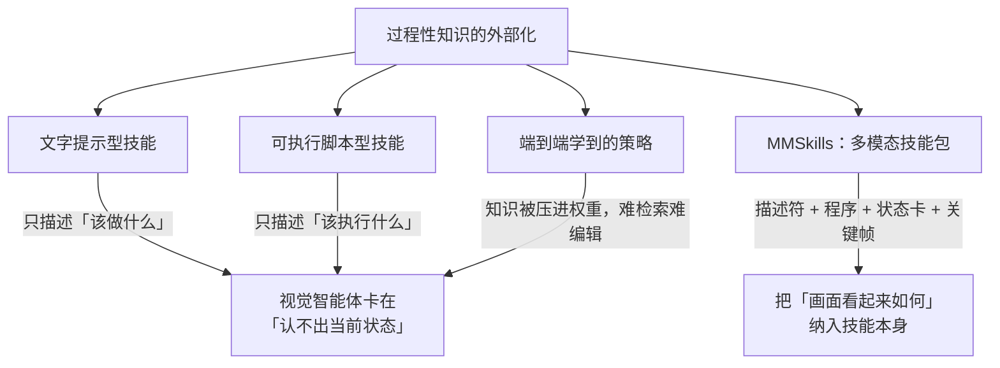
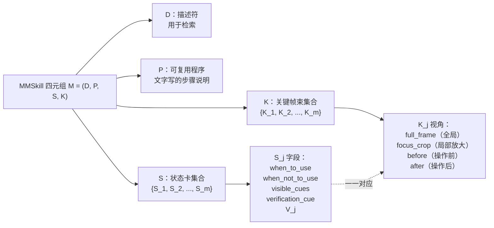
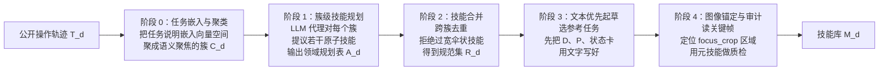
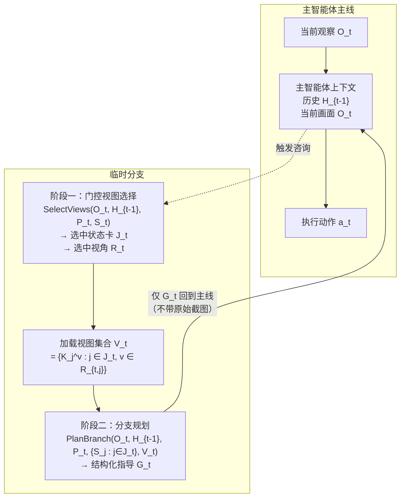
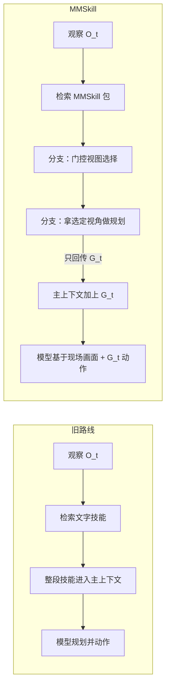

# MMSkills：面向通用视觉智能体的多模态技能

> **原题**：MMSkills: Towards Multimodal Skills for General Visual Agents
> **作者**：Kangning Zhang, Shuai Shao, Qingyao Li, Jianghao Lin, Lingyue Fu, Shijian Wang, Wenxiang Jiao, Yuan Lu, Weiwen Liu, Weinan Zhang, Yong Yu
> **机构**：未在公开页给出
> **年份**：2026（arxiv ID 2605.13527）
> **分类**：cs.AI
> **链接**：https://arxiv.org/abs/2605.13527
> **精读日期**：2026-05-18

## 阅读须知

### 这篇在领域里的位置

过去两三年里，让大模型「自己动手做事」逐渐成为一条主要研究路线。最早一拨工作集中在文本环境，例如调用浏览器搜索接口、调外部 API、写一段脚本去算东西。后来研究者把目光转向更贴近真人使用计算机的场景：让模型像一个真人一样，看着屏幕截图，决定下一步该把鼠标移到哪里、敲哪几个键、什么时候算任务完成。这一类系统被统称为「视觉智能体」（visual agent），评测它们的标准基准包括 **OSWorld**（Ubuntu 桌面任务集）、**macOSWorld**（macOS 桌面任务集）、**VAB**（Visual Agent Bench）下面的 Minecraft 子集、以及由游戏关卡构成的 LMGame-Bench。这一脉的研究主线很清楚：模型本身的视觉理解能力在涨，但只靠模型先验远远不够，工程上还需要外挂一些「过程性知识」来帮模型把任务拆好、把状态认对。

把过程性知识外挂出来的最常见做法叫「技能库」（skill library）。每条技能描述一段可复用的操作流程，新任务到来时模型先去库里检索一条合适的技能，再照着这条技能执行。这条路线在 **LLM**（Large Language Model，大语言模型）做纯文本任务时跑得通，因为整个交互都在文字里发生，把流程写成文字本身就足够指导执行。但一旦换到视觉智能体，纯文字的技能开始水土不服。这篇 MMSkills 试图回答的是：技能库这件事在视觉时代该长什么样。它的位置可以理解为，把过去几年在文本 agent 上验证过的「外接技能记忆」范式，做一次面向视觉的彻底重写。

### 读完能回答什么

读完这份笔记，你应当能答出下面这五件事。其一，为什么把现成的文本技能库直接搬到视觉智能体身上效果不好。其二，**MMSkill** 这个四元组 M = (D, P, S, K) 里的每一项分别承担什么职责，缺一项会丢什么。其三，作者怎么从公开的操作轨迹里把这种结构化技能自动炼出来，五个阶段各自做什么。其四，推理时为什么不能把整份技能包直接塞进上下文，「分支加载」机制是怎么绕开这个问题的。其五，实验上 MMSkills 在 **OSWorld** 等四个基准上分别带来多大幅度的提升，越小的模型为什么获益越多。

### 阅读前置

预设读者熟悉大语言模型推理时的基本套路（提示、上下文窗口、工具调用），熟悉视觉语言模型（vision-language model）输入图加文这件事的工程概貌，并对 agent 类系统的整体形态（观察 - 思考 - 动作 - 反馈）有概念。不预设读者做过 GUI 自动化或者读过 OSWorld、VAB 这类基准的论文，本文会在对应位置补足背景。也不预设读者熟悉 RAG 之外的「外接记忆」研究脉络，技能库这一支会从头讲起。

### 全文缩写表

| 缩写 | 英文全称 | 解释 |
|---|---|---|
| **MMSkill** | MultiModal Skill | 本论文提出的多模态技能包，是一个四元组 M = (D, P, S, K) |
| **LLM** | Large Language Model | 大语言模型，本文里既指底层大模型，也指被用来驱动生成器和规划器的那一类调用 |
| **VLM** | Vision-Language Model | 视觉语言模型，输入图加文、输出文的模型 |
| **GUI** | Graphical User Interface | 图形用户界面，对应于本文中的桌面 / 浏览器操作场景 |
| **OSWorld** | OSWorld benchmark | Ubuntu 桌面智能体基准，含 360 条任务 |
| **macOSWorld** | macOSWorld benchmark | macOS 桌面智能体基准，含 143 条任务 |
| **VAB** | Visual Agent Bench | 视觉智能体综合基准，本文用它的 Minecraft 子集 |
| **D** | Descriptor | MMSkill 四元组里的描述符字段，供检索用 |
| **P** | Procedure | MMSkill 四元组里的可复用程序，文字写成的步骤说明 |
| **S** | State cards | MMSkill 四元组里的状态卡集合，含若干个状态卡 |
| **K** | Keyframe bundles | MMSkill 四元组里的关键帧束集合，与状态卡一一对应 |
| **G_t** | Guidance at step t | 推理时第 t 步分支规划器返回给主智能体的结构化指导 |
| **O_t** | Observation at step t | 第 t 步主智能体看到的当前画面 |
| **H_{t-1}** | History up to t-1 | 第 t 步之前的历史动作与观察 |
| **focus_crop** | (view type) | 关键帧束里的一种视角，把目标控件附近裁出来局部放大 |
| **full_frame** | (view type) | 关键帧束里的一种视角，保留全局画面用作上下文 |
| **before / after** | (view type) | 关键帧束里的可选视角，分别记录某个操作触发前与触发后的画面 |

## 一、问题

### 为什么这个问题值得做

先把场景代入到一个具体的产品上。设想一个跑在企业内网里的桌面助理，任务是「替我把昨天那份季度报告的数字更新到今早的版本」。这个任务对一个真人来说不算难，无非是打开文件管理器，找到对应的电子表格，把光标放到那几个单元格上，输入新数字，保存。对一个视觉智能体来说，它面对的是一连串截图，每一步都要从画面里识别出「现在我在哪一步」「哪一个按钮是该按的那个」「上一步操作有没有生效」。模型在通用场景里很可能跑过类似的任务，但生产环境里的具体软件、字体、控件位置都和训练时见过的不一样，单靠模型自身先验很难每次都做对。这就是「为什么需要外挂技能」最日常的痛点：模型已经懂大致流程，但还需要一份针对当前应用的、可被信任的、可被检索的过程参考。

过去几年这个方向的主流路线有三条。第一条是把过程性知识写成自然语言提示，用 RAG 检索过来塞进上下文，让模型照着办。第二条是把它写成可执行脚本或者代码片段，模型在需要时把脚本插到自己的工具调用链里。第三条是从演示数据里学一个策略，相当于把过程性知识压缩进网络权重。三条路线在纯文本任务上各有各的成功案例，但搬到视觉智能体身上都有一道共同的坎：它们只描述「该做什么」，几乎不描述「画面长什么样时该做」，更不描述「做完后画面会变成什么样」。这正是视觉任务相对于文本任务最不同的那一层。屏幕上局部状态不是一组离散标签，而是一摊连续像素；判断一个操作是否生效，需要看按钮颜色有没有变、对话框有没有弹出、进度条有没有推进。文字技能在这一层是失声的。

之所以这件事不解决会持续出问题，是因为视觉智能体本身的失败模式很多是「认错状态」而不是「不知道该做什么」。模型可能完全知道「保存文件就是 Cmd+S 或者点保存按钮」，但它在画面上不确定现在到底处不处于「文件已被修改、可以保存」的状态，于是要么不敢按，要么按错地方。换句话说，视觉智能体卡住的瓶颈，往往是状态识别这一段，而恰好是文字技能仓库帮不上忙的地方。MMSkills 要做的事情，就是把状态识别这一段也搬进可复用的知识里。

### 旧路线 vs 新路线的关系

下面这张图把上面三条旧路线与 MMSkills 的关系画出来，方便接下来落到方法层面。



### 把问题落到三个技术 statement

把上面的高层动机落到论文实际要回答的问题，可以拆成三件具体的事。第一件叫表示问题：一份「多模态过程性知识」应该长什么样，包含哪些字段，缺哪些字段会导致什么具体能力的缺失。第二件叫生成问题：技能能不能不靠人手写，而是从已有的公开操作轨迹里自动炼出来；炼的过程要避开两个常见坑，一是把演示当成技能直接存下来导致库膨胀且过拟合，二是炼出一堆「保存文件」「打开文件」这种过于宽泛、什么都套得进去的伞状技能。第三件叫使用问题：推理时怎么把多模态证据交到模型手上，但又不把上下文塞爆、也不让参考截图把模型的注意力锚走。

这三件事各自都有非平凡的设计空间，三件事相互之间也有耦合：表示得太复杂，生成器就难收敛；生成时压缩得太狠，使用时拿不到足够证据；使用时一股脑全塞进上下文，又会把表示和生成的好处全部抵消。MMSkills 给这三件事各给出一个对应的设计：四元组结构、五阶段生成流水线、两段式分支加载。

## 二、方法

### 多模态技能包的结构

先讲表示。每个 MMSkill 被写成一个四元组：

```
M = (D, P, S, K)
```

D 是描述符，相当于一条技能的「门牌」，用来在检索阶段被找到。它是一段简短的文字，写清楚这个技能是干什么的、适用于哪一类任务。P 是「可复用程序」，是用纯文字写出来的操作步骤说明书。这两项加起来就是过去的纯文字技能的形态。MMSkills 真正新增的是后面两项。

S 是「运行时状态卡」（state card）的集合。状态卡这一概念在论文里第一次出现，因此先铺垫一下。它要解决的问题是：一条技能在执行过程中往往会经过若干个语义上有区分的阶段（例如「文件还没保存」「保存对话框已弹出」「文件已成功保存」），每个阶段需要不同的判断条件。状态卡就是把这些阶段一个一个明确写出来，每张卡片对应一个阶段，记录该阶段下的应对逻辑。每张状态卡的内部字段，论文形式化为：

```
S_j = (when_to_use_j, when_not_to_use_j,
       visible_cues_j, verification_cue_j, V_j)
```

第一项写「在什么情况下这条技能该被用」，第二项写「在什么情况下哪怕看起来像也不该用」（用来挡住误触发），第三项是「能确认此状态的可见线索」，第四项是「确认操作已生效的线索」，第五项 V_j 列出本状态卡下可用的视角集合。换句话说，状态卡是一张写给视觉智能体看的「现场鉴别卡片」，告诉它什么时候启动这条技能、什么时候按下停止、看哪里能判断结果。

K 是「关键帧束」（keyframe bundle）的集合，与状态卡一一对应。关键帧束这一概念也需要铺垫一下：它本质上是给状态卡配的「视觉物证」，让上面的文字描述（「visible_cues」「verification_cue」）不只是空说，而有真实截图作锚点。每个关键帧束包含同一时刻画面的多个视角，论文里定义了四类视角。**full_frame** 保留完整画面，用于让模型把握全局上下文。**focus_crop** 围绕目标控件做局部放大，让模型看清细节。**before** 与 **after** 是可选的，分别给出某个动作发生前后的画面，用于揭示状态转移本身。

下面这张图把四元组的结构画出来，并强调状态卡与关键帧束一一对应的那一层。



之所以这样设计是因为状态卡和关键帧束在职责上是互补的。状态卡负责「告诉智能体何时启用、看哪里、怎么验证」，这是文字层面的指挥；关键帧束负责「让上面那几个『看哪里』的描述有图为证」，这是视觉层面的锚定。换句话说，缺了状态卡，模型不知道何时启用，多模态证据无的放矢；缺了关键帧束，状态卡里的「可见线索」只是一段干巴巴的文字描述，模型对照不上当前画面。两者绑在一起才构成「多模态过程性知识」的最小单位。

### 五阶段技能生成流水线

接下来讲生成。MMSkills 的目标是不让人手写技能，而是从公开的操作轨迹里自动把技能挖出来。这里的「公开操作轨迹」指的是研究社区里已有的开源数据集，里头存的是真人或者已有的智能体在各种应用里做事的录像与日志，每条轨迹通常包括任务说明、若干步截图、若干步动作、有时候还有元数据。问题是这种轨迹是「演示」，不是「技能」，演示里夹杂着大量与具体任务无关的细节，需要一道流水线把它们提炼成可复用的结构化知识。

整条生成流水线分五个阶段，全部由 LLM 驱动。



阶段 0 做的事，是把整堆轨迹按任务语义聚成簇。每条轨迹的任务说明与若干元数据被嵌入到向量空间里，再用聚类算法分组，得到 C_d 这一簇集合。这一步的意义在于把语义相近的轨迹放在一起，让后面的技能提取有一个聚焦的上下文，例如把「在浏览器里订机票」与「在浏览器里查酒店」分到同一个簇，与「在电子表格里筛行」明确分开。

阶段 1 是簇级技能规划。每个簇被交给一个 LLM 代理，让它去提议若干「原子技能」，并写明每个技能的边界、完成条件、能覆盖的任务 ID。输出是一张领域规划表 A_d。这一步的关键约束是「原子」二字：一条技能应当对应一个语义上可独立完成的过程，不能既包含「打开文件」又顺带包含「修改并保存」。

阶段 2 是技能合并。不同簇之间难免出现重复或近似的技能，例如「保存当前文件」可能在文件管理与编辑器两类簇里都被提出来。合并阶段做两件事：一是跨簇去重，把语义重复的技能合并为一条；二是把过宽的伞状技能拒绝掉，例如不让「使用浏览器」这种宽到包罗万象的条目留下。结果是一份精炼的技能规范集合 R_d。

阶段 3 是文本优先起草。这一步刻意不读图。生成器先为每条候选技能挑出几条参考任务，然后用文字把描述符 D、可复用程序 P 与状态卡的「文字部分」先写好。这一步存在的理由是：文字部分的逻辑骨架不应当被具体截图的偶然细节牵着走，先把逻辑写清楚，再用图去验证、去锚定，更不容易过拟合到某一条演示。

阶段 4 才进入图像层面。生成器回头去读阶段 3 选好的关键帧，定位每个 focus_crop 对应的具体 UI 区域，把多视角的关键帧束构造出来，并把它们与对应状态卡绑定。最后还有一道「元技能审计」（meta-skill audit）：用一组事先写好的可复用脚本，对每份技能包做结构与一致性检查，例如状态卡数量是否合理、每张状态卡是不是都有对应的关键帧束、focus_crop 是否真的落在「可见线索」描述的区域上。审计不通过的技能包会被退回修正或直接丢弃。

整套流水线的核心立意是，**不把原始演示当成技能本身存进库里**，而是把它压缩成「紧致的视觉过程性知识」。原因有二。其一，演示数据里偶发的特异性（例如某一帧截图里的具体桌面壁纸）会污染技能；其二，把整条演示存进库里会让单条技能的体积失控，检索与上下文占用都不实际。

### 推理时的分支加载机制

最后讲使用。前两块解决了「技能长什么样」「技能从哪来」，最后一块要解决「技能怎么用」。这里的核心约束是：技能包里有大量视觉内容，特别是关键帧束里的几张截图，直接把整份技能包塞进主智能体的上下文是不可行的。论文把这件事的麻烦拆成三层。其一是上下文压力陡增，几张高分辨率截图就能把上下文窗口吃掉一大半。其二是参考图与当前画面同时出现在上下文里，模型在视觉上要分清「这张是参考」「那张是现场」并不容易，容易混淆该看哪张。其三是被论文称作「视觉锚定」（visual anchoring）效应：模型一旦看了参考图，会倾向于围绕参考图里的样子来规划动作，哪怕现场画面已经和参考图差出去不少，规划仍然贴着参考图走，相当于参考图把模型的注意力锚住了。

MMSkills 给出的方案叫「分支加载多模态智能体」（branch-loaded multimodal skills agent）。整套机制把技能的咨询过程从主智能体的主线里搬出去，放到一个临时分支里完成，分支返回给主线的不是图，而是一段提炼好的结构化指导。



分支加载分两段。第一段叫门控视图选择（gated view selection）：在临时分支里，先根据当前观察 O_t、历史 H_{t-1}、技能程序 P_t、状态卡集合 S_t，决定要把哪些状态卡 J_t 与哪些视角 R_t 加载进来。被选中的状态卡与视角集合 V_t 形式化为：

```
(J_t, R_t) = SelectViews(O_t, H_{t-1}, P_t, S_t)
V_t = {K_j^v : j ∈ J_t, v ∈ R_{t,j}}
```

未被选中的图像根本不会进入分支的上下文，更不会进入主智能体的上下文。换句话说，门控这一步是「在让模型看图之前，先用文字判断哪几张图值得看」。这一步本身不便宜（要多走一次 LLM 调用），但它把后续图像 IO 的成本卡在一个可控范围。

第二段叫分支规划（branch planning）：临时分支拿着所选状态卡与图像集合 V_t，输出一组结构化指导 G_t：

```
G_t = (applicable_t, subgoal_t, plan_t, do_not_do_t, verify_t)
```

第一项写「当前是否适用这条技能」（布尔），第二项写「当前应当推进的子目标」，第三项写「为达成子目标的具体计划」，第四项写「明确不要做的事」（防止把误触发的子操作做出来），第五项写「怎么验证已完成」。注意，G_t 是纯文字结构，不再带原始截图，也不再带状态卡里那一大段铺垫描述。这份结构化指导回到主智能体那里时，主智能体看到的是一份决策支持，而不是一堆参考图。「参考图与现场画面的视觉对抗」于是在分支边界被切断。可执行的动作仍然由主智能体在当前画面 O_t 上完成，规划不会因为参考图而漂走。

### 文字技能流 vs MMSkill 流的差异

把传统的文字技能流与 MMSkill 的分支流并排画一下，方便看清新机制究竟在哪一步动手。



这套设计为什么能合上「问题」一节里提到的痛点。状态卡解决了「何时该用」的问题，关键帧束解决了「画面看起来对不对」的问题，分支加载解决了「上下文不被参考图占满、规划不被参考图带偏」的问题。三件事各管一段，串成「识别状态」到「执行动作」的一条闭环。

## 三、实验

### 评测设置

评测落在四个视觉智能体基准上，每个基准都对应一个不同形态的视觉任务。

| 基准 | 平台 | 任务规模 | 任务类型 |
|---|---|---|---|
| OSWorld | Ubuntu 桌面 | 360 条 | 浏览器、LibreOffice、创意工具、系统设置、代码编辑器等 |
| macOSWorld | macOS 桌面 | 143 条 | 文件管理、媒体、生产力、系统任务 |
| VAB-Minecraft | Minecraft 游戏 | VAB 的 Minecraft 子集 | 物品获取、配方推理、工具使用 |
| Super Mario Bros | LMGame-Bench | 关卡通关 | 平台跳跃类游戏操作 |

模型梯度同时覆盖前沿大模型与较小模型。前沿一侧包括 **Gemini 3.1 Pro**、**Gemini 3 Flash**、**Qwen3-VL-235B**、**Kimi-K2.6**；较小一侧包括 **GLM-5V** 与 **Qwen3-VL-8B-Instruct**。这样的梯度安排是为了观察一个具体问题：外接的过程性知识对不同能力梯度的底层模型分别能补多少。

### 主结果：OSWorld 上的相对增益

OSWorld 是最主要的评测场。论文给出的成功率对比如下（baseline 是不挂任何技能的纯模型，MMSkills 是挂 MMSkill 技能库的版本）。

| 模型 | baseline | + MMSkills | 增益 |
|---|---|---|---|
| Gemini 3.1 Pro | 44.08% | 50.11% | +6.03 |
| Gemini 3 Flash | 36.65% | 47.97% | +11.32 |
| Kimi-K2.6 | 34.98% | 46.59% | +11.61 |
| GLM-5V | 28.71% | 38.51% | +9.80 |
| Qwen3-VL-235B | 21.34% | 39.17% | +17.83 |
| Qwen3-VL-8B-Instruct | 10.78% | 25.40% | +14.62 |

读这张表有一条很清晰的趋势：越是能力相对弱的模型，外挂技能带来的相对增益越大。论文里还做了一个对照组，把同一套技能换成「只剩文字部分」的版本，它也能带来一些提升，但提升的幅度与稳定性都不如完整的多模态版本。这与作者主张的「外部多模态过程性知识与模型内置先验互补」是吻合的：模型本身越缺先验，外挂的过程性知识能填的空间就越多；而内置先验已经很强的模型，仍然能从「视觉锚定证据」上拿到边际收益。

### 主结果：其他三个基准

另外三个基准的数字同样表现出一致的方向。

| 基准 | 模型 | baseline | + MMSkills | 增益 |
|---|---|---|---|---|
| macOSWorld | Gemini 3 Flash | 55.94% | 65.73% | +9.79 |
| macOSWorld | GLM-5V | 34.97% | 51.75% | +16.78 |
| VAB-Minecraft（成功率）| Gemini 3 Flash | 67.24% | 73.28% | +6.04 |
| VAB-Minecraft（成功率）| Qwen3-VL-235B | 52.59% | 62.07% | +9.48 |
| VAB-Minecraft（综合得分）| Gemini 3 Flash | 0.7462 | 0.7884 | +0.0422 |
| Super Mario Bros（绩效）| Gemini 3 Flash | 411.00 | 624.00 | +213 |
| Super Mario Bros（奖励）| Gemini 3 Flash | 766.67 | 1081.33 | +314.66 |

从 GUI 到 Minecraft 再到 Super Mario Bros，任务形态变化挺大，但 MMSkills 的方向性收益在四个基准上都成立。论文用这一点来支撑「MMSkill 这套表示对视觉智能体是普适的」这一论断。

### 消融实验

论文里 Figure 3 的消融实验拆成两组，各自讲一件事。

第一组拆技能包内部组件。拿掉状态卡这一项，智能体在判断「现在是否处于该技能适用的状态」上明显变差，因为状态卡承担的就是状态识别那一段。拿掉关键帧图像，智能体失去了「画面看起来对不对」的对照证据，操作精度下降。两者的缺失各自指向不同的失败模式，互不替代。这一条结果直接回应了方法部分对「为什么状态卡与关键帧束要绑在一起」的设计动机。

第二组拆推理机制。把所有技能包内容一次性灌进主智能体上下文的做法（direct-full loading），效果反而比挂上 MMSkills 之前更差，证明「把图都塞进去」不是个好主意。只做视图选择、不做分支规划的版本（即门控选完图就直接喂给主智能体），效果次之。完整的两段式分支加载效果最好。这一组结果给出一条工程性的判断：在 LLM 智能体里，让额外信息进入主上下文这件事本身就是有代价的，做证据筛选和形式压缩是必要工序，不是锦上添花。

### 行为侧的统计

除了成功率，论文还报了一组「行为侧」的统计，呈现 MMSkills 对智能体行为分布的实际改变。

一是技能调用率（Table 3）。这里指的是模型在能用技能的时候实际去用技能的比例。OSWorld 上 Gemini 3 Flash 的调用率从纯文本技能时的 41.11% 升到 MMSkills 的 62.50%，Qwen3-VL-235B 从 37.50% 升到 65.28%。换句话说，带了视觉证据之后，模型更容易识别「现在是一个适合调技能的状态」，于是更愿意去调用。这是 MMSkill 表示形态在「可识别性」上的体现。

二是轨迹效率。Gemini 3 Flash 平均完成步数从 13.11 降到 11.86（少 1.25 步），Qwen3-VL-235B 从 15.22 降到 9.87（少 5.35 步）。这一项的反直觉之处是：MMSkills 引入了一次额外的咨询调用，整条轨迹的「显式动作步数」反而变短了。也就是说，咨询带来的效率收益超过了它本身的开销。论文在这里点了一句对照：把同一套技能换成只剩文字的版本，轨迹步数反而升到 15.64，意味着文字技能在这个 setting 下是负贡献，原因大概率是文字技能让模型陷入更多的尝试与回退。

三是行为分布的迁移（Figure 4）。Qwen3-VL-235B 在 OSWorld 上的点击占比从 75.8% 降到 63.7%，键盘动作与「DONE」（任务完成确认）的占比相应上升；连续重复执行同一动作的比例从 21.8% 降到 6.2%。读起来像是一个从「乱试一通」到「看清画面再动手」的转变：少做盲点击，多做确认型动作。

### 视角选择的统计

论文还报了视图选择阶段的视角分布统计。OSWorld 上，Gemini 3 Flash 在 352 次视图选择里有 241 次落在 **focus_crop** 上，79 次落在 **full_frame** 上，**before** 与 **after** 用得最少。这条经验对实际落地很有参考意义：如果资源有限，优先把 focus_crop 这一类视角做扎实；full_frame 在涉及全局上下文（例如多个窗口之间切换）时才被需要；before/after 主要用于过程或完成的对比证据，使用频次最低。换句话说，**focus_crop 是 MMSkill 实践里最重要的一类视角**。

## 四、局限

### 作者点到的

作者自己在论文里点到的有四条。其一，技能仓库的覆盖面被源轨迹的覆盖面卡死：公开数据没碰过的领域，这套生成器也炼不出对应技能，要扩展只能继续喂新轨迹。其二，技能生成与视觉锚定都依赖 LLM 调用，错误的标注或错放的 focus 区域会原样传导到下游，没有外部仲裁机制。其三，分支加载本身是有推理成本的：每次咨询要多走一遍门控与规划两次 LLM 调用，模型调用次数与延迟都增加，论文没给出端到端延迟数字。其四，要把这套思路应用到安全敏感场景（例如金融操作、医疗辅助），还需要更强的验证机制与在线技能修复机制，目前的版本没做这一层。

### 读完能看出来但作者没明说的

第一，评测范围都落在 GUI 操作与轻量游戏，是否能迁移到那些场景与轨迹更复杂的真实世界视觉任务，没有数据支撑。这里典型的边界场景包括机器人操作（动作空间连续、状态部分可观测）、自动驾驶辅助（强实时性、强安全约束）、医疗影像辅助决策（任务粒度与 GUI 操作截然不同）。论文的设计在这几类场景下是否仍然适用，至少需要重新讨论一次。

第二，技能库的可维护性问题。论文展示的是一次性炼出来的库，但 GUI 应用本身在演化：UI 改版、操作系统更新、控件样式重绘，都会让旧关键帧在新界面下认不出来，状态卡的「可见线索」会因为重绘而失效。这是 GUI 自动化领域的老问题，MMSkills 没明确给出技能库的演化与版本管理方案。

第三，与底层 LLM 的耦合度。生成器与门控规划都依赖大模型本身的图文理解能力，换底座（例如从 Gemini 换到一个完全不同的开源 VLM）可能整套都得重新评测一次。这也意味着技能库的「跨底座可移植性」需要单独验证。

第四，结果的相对增益虽然在小模型上看着很大，但起点也低。Qwen3-VL-8B 在 OSWorld 上从 10.78% 升到 25.40%，意味着绝对成功率还是不到三成，离「可以放心交给它跑」的状态尚远。换句话说，MMSkills 把小模型的可用性推近了一步，但远没有推到「可生产」的门槛。

第五，关于状态卡数量的工程经验论文给得偏少。一条技能到底配几张状态卡合适？是否存在「状态卡太多反而拖累分支门控」的拐点？论文没有系统性扫描，只在审计阶段隐含约束了「状态卡数量要合理」。这对实际落地团队是个开放问题。

## 一句话

把技能从纯文本扩成「程序 + 状态卡 + 多视角关键帧」的多模态包，再用分支加载切断参考图对现场画面的视觉锚定。
