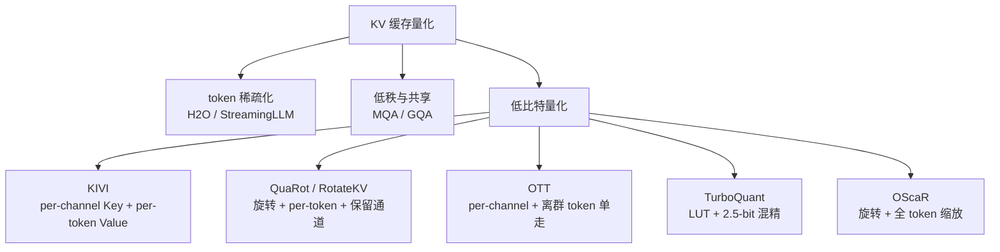
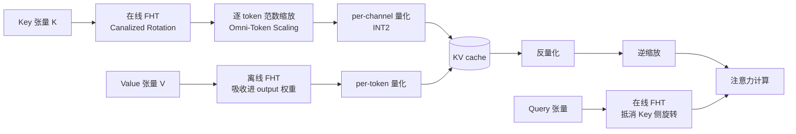
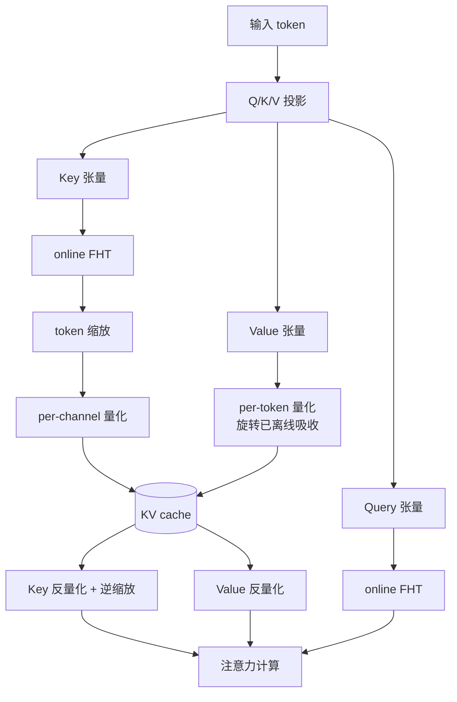

# OScaR：极致 KV 缓存量化的奥卡姆剃刀方案

> **原题**：OScaR: The Occam's Razor for Extreme KV Cache Quantization in LLMs and Beyond
> **作者**：Zunhai Su, Rui Yang, Chao Zhang, Yaxiu Liu, Yifan Zhang, Wei Wu, Jing Xiong, Dayou Du, Xialie Zhuang, Yulei Qian, Yuchen Xie, Yik-Chung Wu, Hongxia Yang, Ngai Wong
> **机构**：清华大学，美团 LongCat 团队，香港大学，爱丁堡大学，中国科学院大学，香港理工大学
> **年份**：2026（arXiv 2605.19660，提交于 5 月 19 日）
> **分类**：cs.LG（Machine Learning）
> **链接**：https://arxiv.org/abs/2605.19660
> **代码**：https://github.com/ZunhaiSu/OScaR-KV-Quant
> **精读日期**：2026-05-21

## 阅读须知

**这篇在领域里的位置**。大模型在推理阶段最沉重的内存开销来自 KV 缓存。每一步解码都要把之前所有 token 的 Key 与 Value 张量缓存在显存中，序列越长、批量越大，开销越线性放大。围绕"如何把这块缓存压下去"，过去几年的工作可以归为三条线：第一条是稀疏化与丢弃，例如 H2O、StreamingLLM、SnapKV，只保留对结果影响大的少量 token；第二条是低秩与共享，例如把 Key/Value 分解成低秩成分或在层之间共享缓存；第三条是直接做低比特量化，把 fp16 的张量压到 INT8、INT4、甚至 INT2。OScaR 属于第三条线里的最新一步，它的目标是把 KV 缓存压到 INT2 仍然几乎无损。在这条线上之前最具代表性的工作有 KIVI、KVQuant、QuaRot、RotateKV、OTT、以及今年早些时候的 TurboQuant。OScaR 的位置可以这样定位：在 KIVI 提出的"Key 用 per-channel、Value 用 per-token"框架基础上，把 per-channel 量化在极致低比特下失效的根本原因找出来，并给出一个简洁、训练无关、不依赖额外残差通路的解法。

**读完能回答什么**。读完这份笔记之后，读者应当能回答如下几个问题。第一，KV 缓存量化里 per-channel 与 per-token 的分工依据是什么；为什么 Key 适合 per-channel、Value 适合 per-token。第二，所谓 Token Norm Imbalance（TNI）究竟是什么现象，为什么它会让 per-channel 量化在 INT2 这种极端比特下崩掉。第三，OScaR 为什么必须把 Hadamard 旋转和按 token 缩放绑成一对而不是只用其中一个；旋转之前直接缩放会引入什么副作用。第四，相对于 TurboQuant 这种依赖残差通路的复杂方案，OScaR 在精度和效率两侧分别做对了什么。第五，在工程层面，OScaR 怎样通过三段 CUDA kernel 把 FHT、缩放、量化、反量化、注意力计算这一连串操作合并下来。

**阅读前置**。本文假定读者熟悉 Transformer 的基本结构，知道自注意力如何由 Query、Key、Value 三个张量计算得到。读者应熟悉 PyTorch 张量与 GPU 编程的一般概念，了解 FP16/BF16 与 INT8/INT4 等数值格式的差别。读者不必专门做过量化研究，但需要知道"per-channel 量化"和"per-token 量化"是两种粒度的选择：前者每个通道共享一组缩放参数，后者每个 token 共享一组。本文也不假定读者读过 KIVI 或 QuaRot 原文，相关背景会在「问题」一节展开。

**首次出现的缩写表**：

- **KV cache**：Key-Value cache，注意力机制中缓存的 Key 与 Value 张量
- **TNI**：Token Norm Imbalance，token 之间范数失衡，本论文识别的关键问题
- **OScaR**：Omni-Scaled Canalized Rotation，本文方法名
- **FHT**：Fast Hadamard Transform，快速 Hadamard 变换，复杂度 O(d log d)
- **X-LLM**：text-only LLM、multi-modal LLM、omni-modal LLM 的统称
- **NIAH**：Needle-in-a-Haystack，长上下文检索能力测试
- **MMAU-Pro**：Multi-Modal Audio Understanding Pro，omni-modal 评测集
- **TurboQuant**：本论文最重要的对照方案，基于 LUT（look-up table）的 2.5-bit 量化框架
- **INT2**：2-bit 整型量化，理论上每个数值只用 4 种取值表示

## 为什么这个问题值得做

要理解为什么有人愿意把 KV 缓存压到 INT2 这种极端档位，先要看一下不压会怎样。一个用 Qwen3-8B 跑 128K 上下文的推理服务，单卡缓存大小动辄数十 GB，批量稍微一开就直接撞 H20 的 96GB 显存上限。换句话说，长上下文与多模态推理的部署瓶颈，不在 FLOPs 也不在权重显存，而在于序列长度乘以 batch size 决定的 KV 缓存。

之前几年这一类问题的主流路线大致沿三个方向推进。第一是 token 级稀疏化，例如 H2O 和 StreamingLLM，做法是只保留那些注意力贡献大的 token；这一类方法有效但对长文检索类任务（NIAH 之类）容易丢线索。第二是 KV 的低秩分解或跨层共享，例如 MQA 与 GQA 已经把 head 维度的冗余压掉一层，再往下走就是把整张 Key 矩阵分解成低秩形式；这条线对极端长上下文仍然吃力。第三条是低比特量化。最经典的两阶段做法由 KIVI 给出：对 Key 走 per-channel 量化、对 Value 走 per-token 量化。这种分工的依据是 Key 张量里有显著的 channel-wise outlier，per-channel 在每个通道独立估计缩放参数能把这些 outlier 包住，避免一个超大值把整个量化范围撑开。

旧路线在哪里卡住。KIVI 这一套在 INT4 的档位上几乎无损，但落到 INT2 就会显著掉点。再细看就会发现 per-channel 量化并没有彻底解决 outlier 问题，它只是把"通道维度"的离群点处理掉了，"序列维度"上 token 与 token 之间的范数差异仍然存在。一个长序列里总有少数 token 的 ℓ₂ 范数比邻居小一两个数量级，这些低范数 token 与 attention sink 现象高度相关。换句话说，per-channel 把通道内的 outlier 摆平了，序列内的 outlier 还原封不动地留在那里，而极端比特下二者的破坏力是一样大的。OScaR 这篇论文要做的事，是把第二种 outlier 现象命名（TNI），从理论上证明它是 INT2 区段精度恶化的主因，再给出一个简洁的修复办法。

## 一、问题

OScaR 要解决的具体问题可以这样陈述：在每张 Key 张量、每个量化块内部，token 之间的 ℓ₂ 范数差异显著（即 TNI）。当 per-channel 量化要在这些范数差异巨大的 token 之间共享一组缩放参数 Δ 与零点 z 时，量化区间会被范数最大的 token 撑开，正常 token 因此被分配到的有效比特数变少，重建误差被显著放大。在 INT2 下，每个数值只能取 4 种值，这种压制是致命的。论文的第一步是从经验和理论两面把 TNI 推上前台。

**TNI 的经验观察**。论文在 Llama-2-7B 等模型上做范数统计后发现，每张注意力状态里都有一个稀疏但稳定的子集：少量 token 的 ℓ₂ 范数显著低于其余 token 的均值。这些低范数 token 与 attention sink token 高度重合，sink token 是注意力机制里被用来"吸收"额外注意力的常见出口。这一现象不是偶发，而是几乎所有模型在长序列上都能复现。

**TNI 的理论推导**。论文在附录里写出一个简洁的误差界。考虑一个 per-channel 量化块，块内 token 的范数为 {n₁, n₂, …, nₘ}，每个通道的量化步长 Δⱼ 由整块的极差决定。可以证明该块的重建误差正比于 max(nᵢ) − min(nᵢ)。换句话说，只要块内 token 范数极差大，每个通道的步长就被迫做得粗，里面所有 token 的精度都被拉低。

**为何前人路线没能彻底解决**。把过去几年的主流路线纵向比较一下，能更清楚地看到 OScaR 的位置。KIVI 把"通道 outlier"用 per-channel 包住了，但没碰序列维度。QuaRot 与 RotateKV 引入 Hadamard 旋转，把通道维度的 outlier 进一步在维度间打散，但量化粒度仍然是 per-token 的，并且为了应对 sink token 还要保留一小撮高精度 token 作为"特例通道"。OTT（Outlier Token Tracing）更直接，每个 token 来都做一次离群度判定，对疑似离群的 token 单独走高精度通路；这种"加保留通道"的思路在工程上还能接受，但残差通路的存在让 pipeline 复杂、kernel fusion 变难。TurboQuant 沿这条思路走得更远，引入 LUT 和 2.5-bit 平均的混合精度方案，精度上往往最优，但实现复杂度也最高。OScaR 的判断是：这些路线全部承认 outlier 存在，只是用越来越复杂的方法把 outlier 单独捞出来；如果一开始就在数值层面把 token 范数拉齐，整条 pipeline 就可以省掉所有残差通路。

## 二、方法

OScaR 的核心由两件事拼起来：先做一次 Canalized Rotation，再做 Omni-Token Scaling。两件事谁都不能单独用，必须配套。这一节先把每个组件单独讲清楚，再讲它们为什么一定要绑在一起。

**符号约定**：设输入序列长度为 L，注意力 head 数为 H，每个 head 的维度为 dₕ。Key 张量 K ∈ ℝ^{L×H×dₕ}，Value 张量 V ∈ ℝ^{L×H×dₕ}。第 i 个 token 的 Key 向量记作 kᵢ ∈ ℝ^{H·dₕ}，对应 ℓ₂ 范数 nᵢ = ‖kᵢ‖₂。per-channel 量化是沿 L 维度做平均（同一通道内所有 token 共享 Δⱼ、zⱼ）；per-token 量化是沿 dₕ 维度做平均（同一 token 内所有通道共享）。

### 第一步：Canalized Rotation

**它解决什么**。如果不做任何处理直接 per-token 缩放——也就是把每个 token 的 ℓ₂ 范数统一归一到同一水平——会发生一件糟糕的事，论文称之为 **Scaling-Induced Outlier Artifact**。直白地说：那些原本范数低的 sink token 被强行拉到正常 token 的范数水平，但它们在大多数通道上原本数值很小，几乎为零。一旦被整体放大，这些通道里就会冒出原本不存在的大值，反而破坏了 per-channel 量化所依赖的"通道内分布稳定"假设。

**怎么做**。在做 token 缩放之前，先对 Key 张量做一次 Hadamard 变换 H：K' = K · H。Hadamard 矩阵的元素只取 ±1/√d，是正交变换，把每一个 token 的能量在 d 维度上均匀打散。原本只集中在少数几个通道的"大值"在变换后被摊平到所有维度，per-channel 视角下各通道的取值范围更接近。论文把这一步称为 Canalized Rotation。"Canalized"取意"沟槽化"，意思是把通道之间的差异熨平进一条统一的渠道里。

**为什么用 Hadamard 而不是别的正交矩阵**。Hadamard 矩阵的计算复杂度可以借助 Fast Hadamard Transform 降到 O(d log d)，远低于一般正交矩阵的 O(d²)。在推理阶段一边 decoding 一边做的旋转必须便宜，否则压显存省下来的时间会被还回去。论文把这部分写成了一个专门的 CUDA kernel，复用 HadaCore 的实现。

**Query 侧的对称处理**。Key 既然做了 FHT，那么注意力计算时 Q·Kᵀ 也需要在 Query 侧对应做一次 FHT，让两边的旋转在乘法处被自动抵消。论文把这一步称为 online FHT，意思是它发生在每次 decoding step 的当下、不能离线预算好。Value 那一侧则不同，论文采用了离线策略：在推理开始前就把 Value cache 与下游的 output projection 矩阵都做一次 Hadamard 变换，等价地把旋转吸收进权重里，运行时不再有额外开销。

### 第二步：Omni-Token Scaling

**它解决什么**。即便 Canalized Rotation 已经把通道维度铺平，序列维度上的范数差异仍然存在。换句话说，TNI 还没被处理掉。这一步直接处理 TNI：对每个 token 计算其跨所有 head 的 ℓ₂ 范数 nᵢ，按 nᵢ 进行归一化，让所有 token 的范数被拉到同一水平。同步存下原始 nᵢ，反量化时再恢复。

**为什么叫 Omni**。在多模态与 omni-modal 模型里，文本、图像 token、音频 token 共存于同一序列。论文强调缩放是跨模态统一进行的，不区分 token 来自哪个模态，这就是 Omni 的含义。在工程上这一步利用了硬件原生的 rsqrt 指令做加速，几乎不占额外周期。

**先旋转再缩放，缺一不可**。这是 OScaR 设计上最巧的一点。Canalized Rotation 把通道维度的取值分布铺平，让后续 token 缩放不再制造新的离群通道；Omni-Token Scaling 把序列维度的范数差异铺平，让 per-channel 量化的步长不再被极差撑开。两步缺一不可：只做旋转，TNI 还在；只做缩放，会引发 Scaling-Induced Outlier Artifact，per-channel 步长照样会被放大。

### 整体流程

把上面的局部拼起来，整张 KV cache 的生命周期是这样的。在 prefill 阶段，输入 token 经过 Q/K/V 投影之后，Key 张量先做 online FHT、再做按 token 缩放，然后落到 INT2 per-channel 量化里写进缓存；Value 张量直接做 per-token 量化写进缓存（旋转已经离线吸收进 output 权重）。在 decoding 每一步，Query 同时做 online FHT（实现上与 Key 侧的 FHT 自动抵消），然后从缓存里读出量化后的 Key、做反量化与逆缩放、参与 Q·Kᵀ；再读量化后的 Value 参与对 attention 加权求和。整个数据流被切成三段 CUDA kernel：online FHT + scaling、quantization、dequantization + attention，最大化算子融合。

## 三、实验

**模型与任务**。文本侧用 Llama-3.1-8B 与 Qwen3-8B，长上下文用 LongBench-E（9 个子任务，包括 HotpotQA、Qasper、TriviaQA 等）以及 Needle-in-a-Haystack（NIAH）。多模态侧用 LLaVA-v1.6-vicuna-7B 与 Qwen3-VL-4B/8B-Instruct，跑 OCRBench 与 DocVQA。omni-modal 侧用 Qwen3-Omni-30B-A3B，跑 MMAU-Pro。

**基线方法**。按粒度分三类。第一类是 per-channel Key 量化：KIVI、OTT。第二类是基于旋转的 per-token Key 量化：QuaRot、RotateKV，两者都额外保留少量高精度 token。第三类是 LUT-based：TurboQuant+，平均比特 2.5。残差窗口长度统一设为 128；OTT 保留 5 个高精度 outlier token；所有比较项以 INT2 为目标（TurboQuant+ 因为是 2.5-bit 平均，对它略有让步）。

**主要结果（LongBench-E）**

| 模型 | 16-bit baseline | 第二名 (OTT) | OScaR (INT2) |
| ---- | --------------- | ------------ | ------------- |
| Llama-3.1-8B | -- | 40.74 | **41.75** |
| Qwen3-8B | 50.42 (基线) | 48.21 | **48.74** |

Qwen3-8B 上 INT2 较 16-bit 仅掉 1.7 个百分点，几乎可视为无损。

**NIAH（长文检索）**。这是这一类工作中最严苛的指标，因为低比特量化最先掉的是长上下文里少数关键 token 的精度。OScaR 在 Qwen3-8B 上得到 96.5% 的命中率，最强基线 92.7%，16-bit 96.0%。换句话说，INT2 下 OScaR 比 16-bit 反而略好 0.5 个百分点，这往往是 retrieval 类任务里量化引入的轻微正则化效应。

**多模态**。OCRBench 上 OScaR 较第二名提升 2.5 个百分点，DocVQA 接近 16-bit 基线。omni-modal 的 MMAU-Pro 三项子任务上分别提升 1.2、2.8、4.6 个百分点，最受益的是音频指令跟随，作者把原因归结为 omni-token 跨模态归一化对音频 token 的范数刚好做了对的事。

**效率（H20 GPU，Qwen3-8B，128K 上下文，batch 48）**

| 指标 | 数值 |
| ---- | ---- |
| Decoding 加速 | 最高 3.0× |
| 显存占用 | 减小到 1/5.3 |
| 吞吐 | 提升 4.1× |

加速来自三处：旋转 + 缩放融合进一个 kernel；量化与反量化都贴着内存层级写；attention 的 Q·Kᵀ 与反量化合并成一个 kernel。

**消融**。Canalized Rotation 与 Omni-Token Scaling 单独使用都明显劣于二者组合：只旋转的版本在长上下文上掉 2~3 个百分点，只缩放的版本因为 Scaling-Induced Outlier Artifact 反而比 KIVI 还差。这一组消融把"为什么必须配套"摆得很清楚。

**一个反直觉的结果**。在 NIAH 与 MMAU-Pro 的部分子任务上 INT2 略好于 16-bit。论文把这一现象归因于量化引入的轻微噪声反而压制了模型在长尾上下文上的过度自信，类似于把 attention 分布做了一次软温度调节。这不是普适规律，但表明在 sink token 强相关的任务上量化可能带来正向偏置。

## 四、局限

**论文自己承认的**。论文在附录 A 把局限列得相对克制，主要写成了"未来研究方向"。其一，目前只覆盖标准 Transformer 注意力，对线性注意力、Mamba、状态空间模型等架构没有评估，能否平移仍然待证。其二，OScaR 与其他压缩技术（剪枝、低秩分解）的协同没有系统研究，理论上几条线可以串联使用但实际是否有冲突需要后续工作。其三，硬件特定优化目前只针对 H 系列 GPU，对 A100、AMD MI300、TPU 等其他加速器的最佳实现路径未必相同。

**读完能看出来的**。除了作者承认的几点，还有几个潜在问题值得殿下留意。第一，论文把 Hadamard 旋转视为开销极低的预处理，但 online FHT 在 decoding 的每一步都要跑一次，复杂度 O(d log d) 虽然渐近便宜，常数项与 kernel 启动开销在小批量、短上下文时未必划算；从论文的 sweep 看，加速效果在 128K + batch 48 这种极端配置下最明显，短文/小批量下的相对收益值得复核。第二，论文绝大部分 baseline 用的是 INT2，TurboQuant+ 是 2.5-bit 平均，比较条件并不完全对称；尽管作者声明在所有 baseline 都允许的最优配置下做了挑选，混合精度方案在 fairness 上始终有讨论空间。第三，attention sink 与 sink token 的存在性是 OScaR 整套理论的前提。如果未来模型设计本身不再产生显著 sink（例如某些去 sink 化的微调或位置编码改造），OScaR 的边际收益会下降。第四，论文证明的"重建误差正比于 token 范数极差"是块内的局部界，跨块的累计误差（一段长序列的 RoPE 后端漂移）没有给出严格界。

## 一句话

OScaR 把 KV cache 极致量化的痛点压到 "token 范数失衡" 这一根弦上，再用 Hadamard 旋转加跨模态 token 范数归一两步把这根弦熨平，在 INT2 下做到几乎无损并把显存压到 1/5.3。
