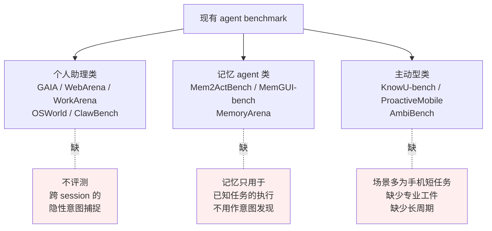
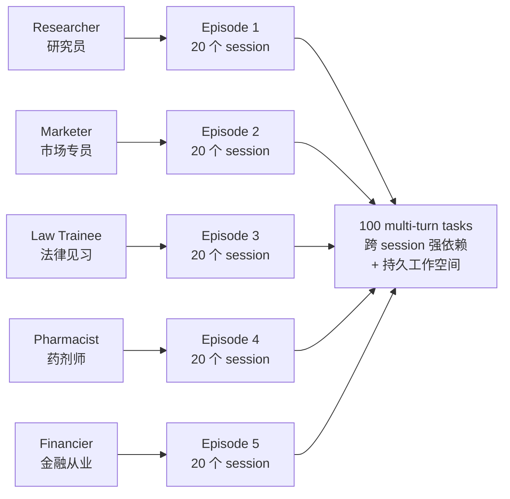
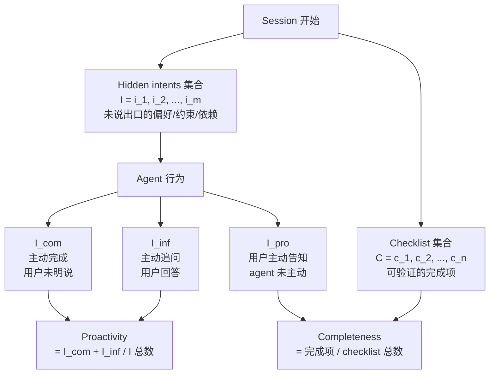
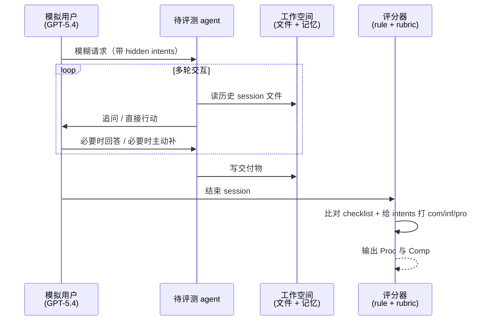

# π-Bench：评估长周期工作流中的主动型个人助理 agent

> **原题**：π-Bench: Evaluating Proactive Personal Assistant Agents in Long-Horizon Workflows
> **作者**：Haoran Zhang, Luxin Xu, Zhilin Wang, Runquan Gui, Shunkai Zhang, Haodi Lei, Zihao He, Bingsu He, Chicheng Qin, Tong Zhu, Xiaoye Qu, Yang Yang, Yu Cheng, Yafu Li
> **机构**：未在 arxiv 页面披露
> **年份**：2026（arxiv ID 2605.14678）
> **分类**：cs.AI
> **链接**：https://arxiv.org/abs/2605.14678
> **精读日期**：2026-05-22

## 阅读须知

### 这篇在领域里的位置

个人助理 agent 这条线是过去两年大模型应用层最热的一支。早一批工作把重心放在「让 agent 能不能完成一个被讲清楚的任务」上：GAIA、WebArena、WorkArena、OSWorld、ClawBench 这些 benchmark 把厨房水池里能想到的工具调用场景都摆上来，从订机票到读文献再到打开 Photoshop 改图，凡是用户说得明白的，挨个测。再后一波转向「跨 session 的记忆」，Mem2ActBench、MemGUI-bench、MemoryArena 三条线追问 agent 能不能记住用户之前说过什么、做过什么。最近一年又分化出第三支，叫主动助理：当用户压根不打算把要求讲清楚时，agent 能不能从历史和环境里把缺的那一块猜出来再去问。KnowU-bench、ProactiveMobile、AmbiBench 是这一支的代表，但它们大多落在手机端日常生活的小任务上。

π-Bench 在这条脉络里要做的事情是把第三支推进到长周期专业场景，让评估同时压上三个旧 benchmark 各自分散的负担：跨 session 的依赖、持久化文件工件、以及对于隐性需求的主动抽取。

### 读完能回答什么

读完这份笔记，读者应当能回答下面几个问题：

1. 为什么「主动性」需要和「完成度」分开度量，分开之后能看见旧的 agent benchmark 看不见的什么？
2. π-Bench 用什么机制让一个 agent 不能依赖用户把话讲清楚就能拿到高分？
3. 5 个 persona、20 个 session 这种结构相比之前的 GAIA、WebArena 多了哪一层信息？
4. 当下九款前沿模型在主动性这一项上的分布大致是怎样的？谁高谁低？为什么有的模型完成度高但主动性低？
5. 移除跨 session 历史这一对照实验为什么把主动性的差距拉得这么大？

### 阅读前置

假设读者熟悉大语言模型 agent 的基本运行机制，即模型在每一轮接收用户输入、决定调用工具或写文件、然后再回到用户面前继续多轮；熟悉 benchmark 评估的常见指标如 accuracy、completion rate；但未必专门做过 agent benchmark 设计本身，也未必熟悉「proactive AI」这一支在 2025 年到 2026 年间出现的论文。

### 缩写表

为方便读者后面随时回查，这里把全文要用到的专有缩写列出来：

- **Proc**：Proactivity，主动性得分，定义见正文
- **Comp**：Completeness，完成度得分，定义见正文
- $\mathcal{I}$：Intents，某 session 中需要被解决的隐性意图集合
- $\mathcal{I}_{\text{com}}$：Completed intents，agent 在用户未明说的情况下已经处理掉的意图
- $\mathcal{I}_{\text{inf}}$：Inferred intents，agent 主动追问并由用户回答而获得的意图
- $\mathcal{I}_{\text{pro}}$：Provided intents，用户在 agent 没问之前主动告知的意图
- $\mathcal{C}$：Checklist，可被验证的完成项清单
- **GAIA**：General AI Assistants benchmark，2023 年提出的通用助理评估
- **WebArena**：模拟真实网页操作的 agent benchmark
- **OSWorld**：操作系统级别的 agent 评估
- **OpenClaw**：论文里反复出现的、目前业界主流的个人助理 agent 产品
- **Nanobot**：论文实验采用的 agent scaffold（脚手架）

## 为什么这个问题值得做

主动型助理这件事在产品端早已经不是抽象概念。任何一个用过 OpenClaw、Claude Code 或者 Cursor 的人都会有一个共同感受：现实里的用户很少把要求一次性讲完整，他更可能在工作进行到一半时才意识到「啊我还忘了说预算只有两万」或者「啊这个文档要符合公司模板」。如果 agent 永远只接被讲清楚的需求，它充其量只是一个高级的命令行。如果 agent 能从工作环境、过往对话、文件夹结构里读出用户没说出口的那部分要求，它才像一个真正的助理。

但奇怪的是，整个 benchmark 体系长期回避主动性这个维度。原因是它难评估。完成度好评：文件交付了吗、表格填对了吗、构建跑通了吗，这些都是布尔可判。主动性则模糊：agent 没问也没做、用户后来才补了一句要求，这中间到底算谁的功劳，是 agent 接得快、还是用户被迫多花一轮把话讲全？过往 benchmark 要么不碰，要么把它简化成「是否提问澄清」这种粗粒度。归根结底，主动性需要一种新的评估装置：让 agent 在每一个 session 都暴露在「用户故意有所保留」的场景里，再去看它是绕开、是追问、还是糊里糊涂干错。

π-Bench 这篇论文就是用一整套机制把这件事正式做起来。

## 一、问题

这篇要解决的具体问题，是设计一个 benchmark 让人能客观度量大语言模型 agent 在以下这一类任务里的表现：用户开局只给一个模糊请求，真实需求散落在工作空间的过往文件里、散落在之前几次会话里、散落在用户身份隐含的偏好里；agent 应当主动把这些隐性意图捞出来再继续工作，而不是被动等用户挨条补充。

把这条 statement 拆开看，作者要同时压上几个传统 benchmark 不肯放在一起的负担：

第一，任务必须跨多个 session。短 prompt 单次回合的格式不行，因为主动性根本来不及在那么短的窗口里展开。第二，必须有持久化的工作空间，session 之间留下文件和状态。否则跨 session 的「记忆」没有可落地的载体。第三，必须有一个明确刻画过的「未说出口的需求」清单，而且这套清单要能在评估时回收，让评分系统知道哪些意图是 agent 主动获取的、哪些是用户被迫提供的。

前人尝试过的解法可以归入三条线。下面这张 mermaid 图把它们放到一起对照：

第一条线，个人助理 benchmark 关注的是 agent 能否在被明确请求之后完成任务。GAIA 和 OSWorld 是这条线最典型的代表，但它们都不评测当请求被刻意留白时，agent 能否自己把要求补齐。第二条线，记忆 agent benchmark 测的是「记忆是否能被正确地取回并用于完成一项已知任务」。换句话说，记忆在这里是任务执行的素材，而不是「主动识别未表达需求」的线索。第三条线，主动型 benchmark 已经在做主动性，但场景几乎全部集中在手机界面的 ambient 推断与简短的消费任务，没有专业工作场景里那种「跨 session 文件依赖、跨 session 偏好继承」的复杂结构。

π-Bench 要做的事，是把这三条线各自缺的那一块同时压回一个 benchmark：用专业 persona 提供长周期工作流（补第三条线的缺），用持久化的文件工件强迫记忆参与（补第二条线的缺），再明确建模未表达需求并用专门指标度量主动性（补第一条线的缺）。

## 二、方法

这一节要回答的核心问题是：π-Bench 到底是怎么构造的？它的评估机制为什么能把主动性与完成度真正分开度量？

### 总体结构

π-Bench 的整体结构如下面这张图：

benchmark 共有 100 个多轮任务，按 5 个 persona 各开一个 episode、每个 episode 20 个 session 组织起来。Persona 是从「真实工作流」反推出来的：研究员要写综述、要管引用；市场专员要做品牌资料、要排传播节奏；法律见习要起草合同、要查法条；药剂师要核对处方、要写药品说明；金融从业要做财报模型、要写客户简报。这五种 persona 的共同特征是工作产出落在文件上，session 与 session 之间有持续性。

在 20 个 session 中间，作者刻意制造了两类依赖。一类是 **strong dependency group**，每组 2 到 3 个 session，前面 session 的关键信息直接决定后面 session 的任务能否完成。共 6 组。另一类是 **independent task**，session 之间只有轻量依赖（例如文件命名约定一致），但任务本身可以独立完成。共 5 个。这种混合分布的目的是让 agent 既要会跨 session 拉记忆，也要避免乱拉无关上下文。

### 隐性意图与 checklist

每个 session 都由两份并列的「内部清单」驱动评估。下面这张图把它们与 agent 行为的对应关系画出来：

Hidden intents 是用户未说出口的偏好、约束、和下游依赖。每个 session 在出题时由作者标注好，由模拟用户系统在 agent 与之交互的过程中跟踪状态。Checklist 是可被自动验证的完成项，可以是「文件 schema 是否合规」、「特定字符串是否出现」、「工具调用顺序是否正确」这种规则化项，也可以是「最终交付的文档是否论述完整」这种由 LLM 评分的 rubric 项。

每条 hidden intent 在 session 结束时被强制分配到三种状态之一。第一种是 **completed**：agent 不等用户明说就把这条要求解决掉了，例如用户没说要保留中文人名，但 agent 看了前一个 session 的命名约定后自动保留。第二种是 **inferred**：agent 主动发问、用户给出答案，例如 agent 问「这份报告默认面向中文读者吗」，用户回答「是」。第三种是 **provided**：agent 没问也没做，用户被迫主动补一句，例如用户在第二轮自己说「忘了说，要中文」。

### 评估指标

主动性得分定义为：

$$\text{Proc}(H) = \frac{|\mathcal{I}_{\text{com}}| + |\mathcal{I}_{\text{inf}}|}{|\mathcal{I}|}$$

这里的核心设计是让 completed 与 inferred 共享一个分子位置：作者把「不问就做」和「主动问后再做」视为同一种主动性，因为它们都说明 agent 自己识别到了用户没讲出口的需求。被动接收用户补充信息的 provided 那一份不计入主动性。

完成度得分定义为：

$$\text{Comp}(H) = \frac{1}{|\mathcal{C}|} \sum_{c \in \mathcal{C}} s(c, H)$$

其中 $s(c, H) \in \{0, 1\}$ 为单条 checklist 的二值评分，由 rule-based 或 rubric-based 系统打出。

为什么主动性与完成度能真正分开？因为模拟用户系统对未被 agent 处理的 hidden intents 会在 session 末尾主动补出，让 reactive 风格的 agent 也有机会拿到接近满分的完成度，但它们的主动性此时已经被记账记到 provided 那一栏，无法回收。换句话说，agent 想拿高完成度可以走老路，想拿高主动性必须做出新行为。

### 评分器与执行细节

评估时所有模型套用同一份 agent scaffold（脚手架），即从 Nanobot 改造来的版本，目的是消除不同 scaffold 之间的差异对结果的污染。模拟用户由 GPT-5.4 在 temperature 0 下扮演，rubric grader 也由 GPT-5.4 充当。每条任务独立跑 3 次，报告均值与标准差。

下面这张图给出一次 session 的执行回路：

## 三、实验

九款前沿模型在 π-Bench 上的主要结果可以汇成下表。所有数字均为三次独立运行的均值（百分比），标准差大多在 2 个百分点以内。

| 模型 | Proc (%) | Comp (%) | 备注 |
| --- | --- | --- | --- |
| GPT-5.4 | 67.0 | 65.6 | 主动性最高 |
| Claude 4.6 Opus | 65.5 | 67.6 | 完成度最高 |
| Qwen3.6 Plus | 64.0 | 64.1 | 主动性与完成度最平衡 |
| Gemini 3.1 Pro | 60.4 | 63.8 | 两项均稳健 |
| DeepSeek V3.2 | 58.2 | 62.7 | 平均水准 |
| Seed2.0 Pro | 57.5 | 61.5 | 接近均值 |
| GLM-5.1 | 55.8 | 60.4 | 略低 |
| MiniMax M2.7 | 53.2 | 59.0 | 略低 |
| Kimi K2.5 | 43.1 | 61.6 | 主动性显著偏低 |

最显眼的一行是 Kimi K2.5：完成度仍在中游，但主动性只有 43.1%，比同档完成度的 Seed2.0 Pro 低出 14 个百分点。这意味着它最终交付物的质量不差，但任务推进过程中要靠用户主动补话才能完成。归根结底，这是 π-Bench 这一套机制揭示出来的一种新失败模式：完成度与主动性可以脱钩，旧 benchmark 看不见这个分裂。

按 persona 分组观察，pharmacist 任务对所有模型来说都是最容易的，原因是处方与说明书天然依赖具体文件与领域规则，hidden intent 几乎都能从工作空间里读出来。Researcher 任务则相反，工作流缺少标准化结构，模型在主动性上明显吃力。Law trainee 和 financier 是完成度最低的两类，作者把它解释为这两类涉及更多需要谨慎权衡的判断。

按任务类型看，论文里给出了几个反直觉对照：法务文书操作类任务，完成度高达 84.1% 而主动性仅 38.1%，原因是文书本身好写，但其中包含的「下一步该交给谁、什么时候交、附带什么模板」这类隐性 handoff 信息没有被 agent 主动识别。与之相对地，药品配方设计类任务，主动性 84.9% 反而高于完成度 68.0%，因为约束条件天然写在题目里，agent 容易识别，但合成与配方的具体落地仍然失败率不低。

### 关键消融

最有说服力的一次消融是 strong dependency group 的「砍掉历史」实验。作者把前置 session 从 agent 的可见上下文里去掉，重新评估 strong dependency group 上的 Proc 与 Comp：

| 条件 | GPT-5.4 Proc | 平均 Proc 变化 | 平均 Comp 变化 |
| --- | --- | --- | --- |
| 完整历史 | 78.5% | 基线 | 基线 |
| 砍掉历史 | 64.9% | −9.5 点 | −2.5 点 |

主动性平均下降 9.5 个百分点，而完成度只下降 2.5 个百分点。GPT-5.4 这一档下降 13.6 个百分点。这一组数字说明，跨 session 历史几乎是主动性的来源本身——一旦切断历史，agent 没了线索去主动猜需求，但仍然能在用户补话之后把交付物做完。

另一条相关观测是平均交互轮数与主动性呈负相关。主动性高的几款（GPT-5.4、Claude 4.6 Opus、Qwen3.6 Plus）平均轮数都偏低，主动性最低的 Kimi K2.5 平均轮数最高，说明用户被迫多说话。

### 评分器可靠性

为了证明 rubric grader 不会因为模型主观偏好失真，作者另跑了一组评分一致性研究：让多名领域专家与另外两款独立前沿模型对同一批 trajectory 复评，结果不一致率低于 4%，论文据此认为评分稳定。

## 四、局限

作者本人承认的局限有三条。第一是模拟用户的真实性问题：所有交互对手都是 GPT-5.4 扮演的虚拟用户，与真实人类用户在表述习惯、犹豫节奏、跨 session 偏好漂移上必然有差距，但用真人评估在长周期场景下成本高、复现难、规模上不去。第二是只用了 Nanobot 一套 agent scaffold，换不同 scaffold 可能会带入新的混淆变量，但跨 scaffold 评估需要大量额外适配工作。第三是 persona 的覆盖范围有限：5 个 persona 都偏白领专业，蓝领、教育、医疗等更广泛场景的工作流没有被纳入。

读者侧能看出来但作者未明确写的潜在问题再加两条。其一，由 GPT-5.4 扮演模拟用户、又由 GPT-5.4 充当 rubric grader，会不会让 GPT-5.4 这一行的表现被同源系统性高估，论文中虽然有低于 4% 的复评一致性数字撑场，但理论上的 single-model loop 偏差并未完整排除。其二，「hidden intent 列表」本身是作者手工标注的，标注边界（什么算 hidden intent、什么不算）会影响 Proc 的绝对水平，跨数据集的横向比较因此需要谨慎。

## 一句话

π-Bench 用 100 个跨 session 长周期专业任务把「主动性」与「完成度」拆开度量，揭示出前沿 agent 完成度不差但主动猜测用户隐性需求的能力仍只在六成上下。
