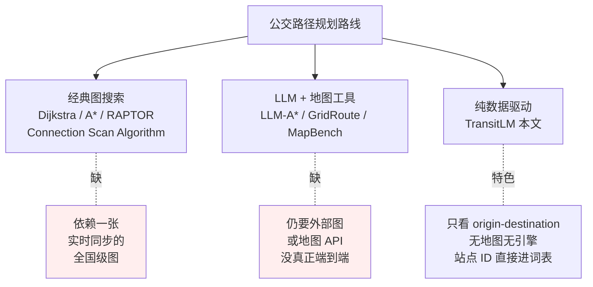
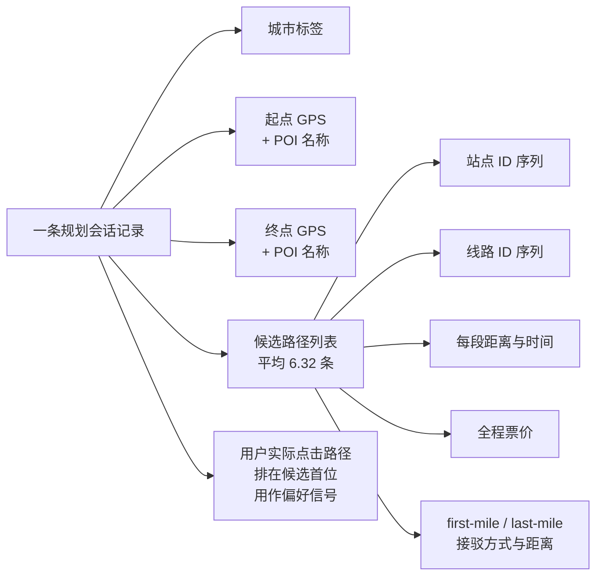
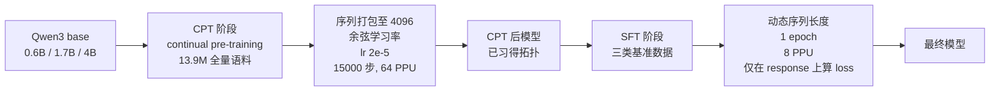

# TransitLM：无地图公交路径生成的大规模数据集与基准

> **原题**：TransitLM: A Large-Scale Dataset and Benchmark for Map-Free Transit Route Generation
> **作者**：Hanyu Guo, Jiedong Yang, Chao Chen, Longfei Xu, Kaikui Liu, Xiangxiang Chu
> **机构**：未在 arxiv 页面披露（数据来自高德地图 AMAP 平台）
> **年份**：2026（arxiv ID 2605.22355）
> **分类**：cs.CL（兼 cs.AI 与 cs.LG）
> **链接**：https://arxiv.org/abs/2605.22355
> **精读日期**：2026-05-23

## 阅读须知

### 这篇在领域里的位置

公交路径规划这件事是地图厂商的核心后端能力之一。在中国主要城市，每天都有数以千万计的用户在高德、百度、滴滴这一类应用里输入一个起点与一个终点，应用就要快速吐出一组可行的公交方案。传统做法是用一张精心维护的、显式表达站点-线路-换乘关系的图，然后跑 Dijkstra、A\*、RAPTOR 或者 Connection Scan Algorithm 这一类经典算法。这一条线已经被工业界打磨二十年，效果稳定，但它的代价是必须维护一张全国级别的实时图，新增城市、临时调整线路、夜间维护这一切都要靠后台同步进图。

最近两年大模型起来之后，研究者开始尝试把 LLM 与图搜索结合，例如 LLM-A\*、GridRoute、MapBench 这一类工作，但这些方案仍然依赖外部图或地图基础设施，只是把 LLM 当成一个调度器或者补丁。本文的位置在这条脉络更激进的一端：它要回答的是公交路径规划能否纯粹从数据学出来，根本不再依赖图与地图基础设施。

### 读完能回答什么

读完这份笔记，读者应当能回答下面这些问题：

1. 为什么通用大模型在公交路径生成这一具体任务上会大面积幻觉？传统的 RAG 或工具调用为什么不能直接解决？
2. TransitLM 这份数据集的核心创新是什么？为什么把站点 ID 直接登记为词表条目能解决幻觉问题？
3. 13.9 M 条记录、120,845 个站点、13,666 条线路这种规模的数据要怎么组织才能塞进一份语言模型可学习的语料？
4. 模型在没有地图 API 帮助、只看 GPS 坐标的情况下，怎么把一个用户没说出口的站点准确地预测出来？
5. CPT（continual pre-training）与 SFT（supervised fine-tuning）两阶段在性能拆分上各贡献了什么？

### 阅读前置

假设读者熟悉大语言模型的基本结构与训练机制，特别是 next-token prediction 与 supervised fine-tuning；熟悉评估常用指标如 accuracy 与 IoU；但未必专门做过地理空间数据、未必熟悉公交路径规划这一传统问题中的「连通性」「换乘」「first-mile / last-mile」这一类工业术语。

### 缩写表

为方便读者随时回查，把全文用到的专有缩写一次列出：

- **CPT**：Continual Pre-Training，持续预训练，在通用底座 LLM 上继续 next-token 训练
- **SFT**：Supervised Fine-Tuning，监督微调
- **REM**：Route Exact Match，路径精确匹配率（LO=1 且 SSO=1）
- **LO**：Line Overlap，线路集合 IoU
- **SSO**：Station Sequence Overlap，站点序列集合 IoU
- **SG**：Station Grounding，站点接驳合理性
- **DP**：Distance Plausibility，接驳距离合理性
- **EA**：Estimation Accuracy，数值字段（耗时、里程、票价）准确率
- **PC**：Preference Compliance，用户偏好满足率
- **RD**：Route Diversity，多路径生成的多样性指标
- **POI**：Point of Interest，地图上的兴趣点
- **GTFS**：General Transit Feed Specification，公开的静态公交数据格式
- **PPU**：Performance Processing Unit，论文使用的加速器，相当于一种 GPU 替代品
- **AMAP**：高德地图

## 为什么这个问题值得做

公交路径规划这件事，从用户视角看起来再普通不过，从工程视角看却长期处于一个尴尬位置。一方面，它的传统解法已经接近成熟，主要厂商对单线路、单城市的查准查全已经做到 90% 以上的体感水准。另一方面，这条传统路径的维护代价巨大，要求一张几百万条边、覆盖几万条线路、按分钟级更新的全国级图无时无刻不在工作。一旦新增一个城市，要从市政管理部门拿到完整的 GTFS 数据；一旦某天调整了几个站台位置，又要同步推送到全网。

把这个问题让大模型直接做，最朴素的尝试会即刻碰壁。一个原因是大模型本身没有真正学过站点之间的拓扑关系，它见到的是文本，文本里站点名字与线路名字的共现频率支撑不起精确的换乘判断。另一个原因是大模型的 tokenizer 会把站点名拆成字一级的子词，结果模型在拼站点时会拼出一个根本不存在的虚假站点，这种幻觉对路径规划是致命的。两个原因加起来，让通用大模型在「北京东直门到天津滨海机场」这一类查询上经常给出语法上合理、地理上荒谬的方案。

如果有一份足够大、足够覆盖、足够结构化的数据集，让大模型直接以数据驱动的方式学到完整的拓扑与换乘规律，整张公交路径规划图就有机会从大模型权重里隐式涌现，进而摆脱对地图基础设施的硬依赖。TransitLM 这篇论文就是把这件事正式做起来。

## 一、问题

这篇要解决的具体问题是：能否在不引入任何外部地图、外部图结构、外部路径搜索引擎的情况下，仅凭一份足够规模的历史规划记录，训练出一个能够端到端地从「起点 GPS + 终点 GPS + 自然语言查询」直接生成结构合法、站点真实、票价里程时间数字准确、并满足用户偏好的公交路径的大语言模型。

传统的尝试可以归到三条线，下面把它们摆到一起对照：

第一条线是经典的图搜索方法。Dijkstra 与 A\* 在静态图上已经长期稳定，RAPTOR 与 Connection Scan Algorithm 则是为公交特点定制的优化版本。这一条线最大的问题不是算法本身，而是它对一张实时维护的图的硬依赖。

第二条线是过去两年兴起的 LLM 与图搜索的混合做法。LLM-A\* 让大模型扮演启发函数，GridRoute 把网格化的地理空间塞进大模型做粗略导航，MapBench 把地图 API 当成工具让大模型调用。这条线把大模型纳入循环，但本质上仍然没有摆脱地图基础设施，大模型只是路由引擎的一个高级前端。

第三条线就是这篇论文要做的事情：完全不要外部图、不要地图 API、不要路径搜索引擎，单纯靠一份足够规模的历史规划数据让大模型自己学到拓扑、连通性、换乘逻辑、票价时间里程的估计、以及用户偏好的体察。换句话说，作者把整个公交路网当成一种隐式知识，让大模型把它装进权重里。

## 二、方法

这一节回答两个问题：TransitLM 这份数据集是怎么构造出来的、模型是怎么训练才能在没有地图 API 帮助的情况下学到一张完整的公交图。

### 数据集构造

数据集来自高德地图 AMAP 平台一日内的真实导航日志。论文方在数据规模上做得非常激进：

- 总共 13.9 M 条记录，覆盖北京、上海、深圳、成都四座城市
- 共 120,845 个站点、13,666 条线路
- 平均每条记录 2,377 个中文字符，整个语料超过 200 亿 token

这 13.9 M 条记录里，12.9 M 是路径规划会话，剩下 1.0 M 是站点与线路本身的静态描述。每条规划会话本身高度结构化：

每条会话默认保留 5 条候选路径，经过多样性筛选去重。出行方式分布大致是公交单一 33%、地铁单一 19%、公交加地铁 16.8%、其他混合 30.5%。距离分布上短途（小于 5 km）占 22.8%、中途（5-20 km）占 47.4%、长途（大于 20 km）占 29.7%。这样的分布与中国一线城市真实出行模式接近。

除了这份用于持续预训练的语料，论文还额外释出了三套基准的微调数据集，每套各 30,000 条训练样本 + 10,000 条测试样本，分别针对最优路径生成、偏好感知规划、多路径生成三类任务。

### 模型架构

这篇论文最关键的一个设计点放在 tokenizer 这一层：

**所有 120,845 个站点 ID 直接登记为词表中的独立 token**。

之所以这样设计是因为，如果不显式登记，大模型在生成站点名时会按字符序列拼接，理论上有无穷多种「看起来像站点名」的字符串可以被拼出来。引入站点级 token 之后，模型只能从合法站点集合中选，幻觉问题在底层被消除。同时，每个站点 ID 拥有自己独立的 embedding，模型可以直接学习站点之间的空间关系，让站点的「邻近」「同线」「跨线换乘」这些拓扑性质沉淀在 embedding 距离里。

底座模型选用 Qwen3 的三档：0.6B、1.7B、4B。作者既没有从零训新模型，也没有上更大底座；他们要论证的是「数据本身决定能力上限」，把底座这一变量控制住。

### 训练流程

训练分成两阶段，整体结构如下：

CPT 阶段把 13.9 M 条记录全部打包到 4096 token 的固定长度序列里，用余弦学习率、2e-5 的初始学习率、在 64 个 PPU 上跑 15,000 步（约三个 epoch）。这一阶段做的事情是把整个公交路网的拓扑知识、字段语义、用户偏好分布全部装进权重。

SFT 阶段不再打包，按任务用 1 个 epoch 微调，仅在模型回答部分计算 loss。三套基准数据来自与 CPT 完全不同的时间段，作者明确说明做了数据时间隔离，避免泄漏。

### 评估指标

评估上作者一口气定义了多个互补指标，下面分组列出：

**连通性 Connectivity**：判定相邻两站之间是否通过同一线路或合法换乘连通：

$$\text{Connectivity} = \frac{1}{N} \sum_{i=1}^{N} \mathbb{1}\left[\forall\, 1 \le j < L^{(i)},\ (s_j^{(i)}, s_{j+1}^{(i)}) \in \mathcal{E}\right]$$

其中 $\mathcal{E}$ 是底层站点关系集合，$s_j^{(i)}$ 是第 $i$ 条预测路径里第 $j$ 个站点。

**接驳合理性**：站点接驳是否符合常识。

- **Station Grounding (SG)**：预测的上下车站点是否落在按出行方式限定的距离阈值内（步行 3 km，骑行 5 km，打车 10 km）
- **Distance Plausibility (DP)**：预测接驳距离 $d_{\text{pred}}$ 满足 $d_{\text{geo}} \le d_{\text{pred}} \le 3 \cdot d_{\text{geo}}$

**重合度**：

- **Line Overlap (LO)**：预测路径与真值路径的线路集合 IoU
- **Station Sequence Overlap (SSO)**：站点集合 IoU
- **Route Exact Match (REM)**：LO 与 SSO 同为 1 的比例

**数值字段准确率 (EA)**：在 10% 相对误差或绝对误差（5 分钟、500 米、1 元）内即视为通过；MAPE 只在 REM 命中的样本上计算，避免被错路径污染。

**任务特定指标**：

- **Preference Compliance (PC)**：预先用规则判定是否满足查询里指定的偏好
- **Route Diversity (RD)**：多路径生成时，三条路径两两线路集合的平均不重合度

## 三、实验

主结果按三类任务铺开，下表汇总最优路径生成任务下的核心数字（10,000 条测试样本）：

| 模型 | Connectivity | SG | LO | SSO | REM | EA (距离) | EA (时间) | EA (票价) | MAPE |
| --- | --- | --- | --- | --- | --- | --- | --- | --- | --- |
| Qwen3-4B（本文 CPT+SFT）| 97.0% | 98.5% | 88.5% | 85.2% | 71.0% | 96.5% | 95.4% | 99.0% | 1.33% |
| Qwen3-4B-Joint（三任务共训）| 97.9% | 98.9% | 89.6% | 86.5% | 73.7% | 97.0% | 95.8% | 99.0% | 1.30% |
| Qwen3-1.7B | 96.1% | 97.9% | 86.5% | 82.7% | 66.4% | 95.4% | 94.0% | 98.6% | 1.46% |
| Qwen3-0.6B | 94.3% | 96.5% | 82.8% | 78.0% | 58.8% | 93.0% | 91.6% | 97.6% | 1.78% |
| Gemini-3.1-Pro（通用）| 75.5% | – | – | – | 40.2% | – | – | – | – |
| Claude-Opus-4.6（通用）| 71.0% | – | – | – | 35.5% | – | – | – | – |
| GPT-5.4-Pro（通用）| 68.5% | – | – | – | 32.2% | – | – | – | – |
| DeepSeek-V4-Pro（通用）| 64.9% | – | – | – | 28.5% | – | – | – | – |

最显眼的是通用大模型与领域专训模型之间的鸿沟。即使是 Gemini-3.1-Pro 这种现役顶级闭源模型，在更宽松的判定下也只能拿到 40.2% 的精确匹配。Qwen3-4B 这一只在 13.9 M 条数据上专训了三个 epoch 的 4B 小模型，在严格判定下做到 71.0%。多任务共训的 4B-Joint 进一步提升到 73.7%。

偏好感知规划任务的核心数字是 Qwen3-4B 达到 50.4% REM 与 90.5% 偏好满足率，4B-Joint 提升到 52.6% REM 与同等 90.5% 偏好满足。多路径生成任务下 4B 达到 64.5% REM、0.545 的多样性，4B-Joint 提升到 67.2% REM、0.547 多样性。

### 关键消融

**数据规模消融**：作者把 CPT 数据按比例缩小，得到下表：

| CPT 数据比例 | Connectivity | REM |
| --- | --- | --- |
| 6.25% | 94.0% | 49.9% |
| 12.5% | 95.4% | 61.2% |
| 25% | 95.9% | 65.6% |
| 50% | 96.8% | 68.9% |
| 100% | 97.0% | 71.0% |

所有指标随着数据规模单调上升，但形态明显不同：基础拓扑（Connectivity）在 6.25% 时就已经接近上限，再加数据收益边际递减；精确匹配（REM）则在 50% 之前都有显著提升。换句话说，拓扑容易学，细粒度站点序列与数值字段更吃数据。

**GPS-only 消融**：作者把查询里的所有文本线索（POI 名、自然语言查询）全部去掉，只保留起点与终点的 GPS 坐标：

| 模型 | 带文本 REM | GPS-only REM |
| --- | --- | --- |
| Qwen3-4B（本文）| 71.0% | 70.4% |
| Qwen3-4B-Joint | 73.7% | 72.9% |
| DeepSeek-V4-Pro（通用）| 64.9% | 0.6% |
| Gemini-3.1-Pro（通用）| 40.2% | <1% |

通用大模型在剥离文本线索之后直接崩盘，REM 跌到 1% 以下。本文模型则只下降不到 1 个百分点。这一组对照说明本文模型真正学到的是 GPS 坐标到站点 ID 的隐式接地（grounding），不是靠文本里的 POI 名字面匹配走捷径。

**单城与四城对照**：作者把模型只在北京一座城市的数据上训练，与四城合训进行对照：

- 北京单训 REM 高出四城合训约 3.5 个百分点
- 但四城合训的词表规模扩大到 3.1 倍

这一差距并不大，说明站点 ID 作为词表 token 这套机制在跨城上扩展性良好，不会因为词表膨胀就崩盘。

**仅 SFT 消融**：作者跳过 CPT 阶段，直接用 SFT 数据从 Qwen3 底座微调：

- SFT-only：带文本 REM 74.9%，GPS-only REM 66.1%
- CPT+SFT 100%：GPS-only REM 70.4%

仅 SFT 在带文本情况下数字看上去并不差，但一旦剥离文本线索，性能显著退化。CPT 阶段对应的恰恰是「无文本提示下也能把 GPS 锚定到正确站点」这一能力。

## 四、局限

作者本人承认的局限有四条。第一，数据只覆盖四座中国城市，且来自单一平台（AMAP），跨平台与跨地区的泛化未做评估。第二，捕捉的是静态路径结构，没有覆盖实时动态信息，比如临时停运、突发拥堵、高峰期发车间隔变化。第三，多城合训会带来 token 稀疏问题，单城上的精度受到拖累。第四，多路径生成任务里候选标签本身存在歧义，使得 REM 这一指标对该任务而言偏严。

读者侧能看出来但作者未明确写的潜在问题再加两条。其一，站点 ID 作为词表 token 这套设计，新增城市时词表需要扩展，模型必须重新训练或至少做一轮对齐，等于把一部分维护成本从地图基础设施转移到了模型上；这在工业部署上不是一笔小账。其二，论文报告的所有数据集都来自同一个时间段，时序漂移（线路改名、新线开通、站点改造）对模型的影响没有评估，长尾退化问题仍待回答。

## 一句话

TransitLM 用 13.9 M 条高德历史规划记录、把 120,845 个站点 ID 直接登记成词表 token，证明 4B 级别的语言模型可以在不依赖任何地图基础设施的情况下从纯数据学到一张完整的公交路网，REM 达到 73.7%。
