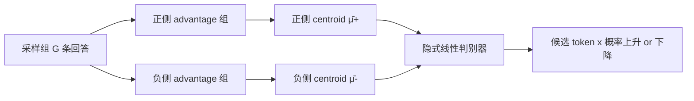
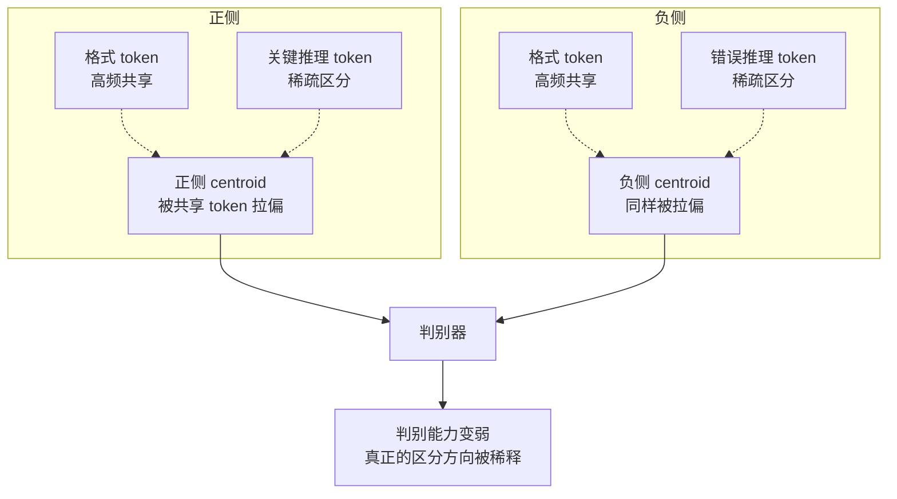
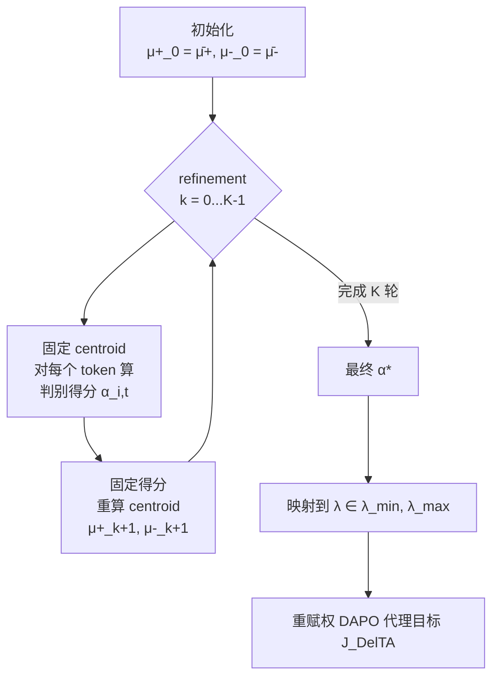

# DelTA：用判别式 token 信用分配重塑 RLVR 的更新方向

> **原题**：DelTA: Discriminative Token Credit Assignment for Reinforcement Learning from Verifiable Rewards
> **作者**：Kaiyi Zhang, Wei Wu, Yankai Lin
> **机构**：中国人民大学高瓴人工智能学院 / Ant International（蚂蚁国际）
> **年份**：2026（arXiv ID 2605.21467，2026-05-20 提交）
> **分类**：cs.LG / cs.CL
> **链接**：https://arxiv.org/abs/2605.21467
> **代码**：https://github.com/RUCBM/DelTA
> **精读日期**：2026-05-24

## 阅读须知

### 这篇在领域里的位置

过去一年内，大语言模型推理能力提升路径里最受关注的一条是「可验证奖励的强化学习」，即 RLVR（Reinforcement Learning from Verifiable Rewards）。它的思路简单：把数学题、代码题、形式证明这一类答案对错可以由程序自动判定的任务作为训练信号，让模型对每个 prompt 采样多条回答，按答案对错给整条回答一个标量奖励，再用策略梯度方法去更新模型参数。DeepSeek-R1、Kimi K1.5、Qwen3 系列、OpenAI o 系列走的都是这条路。

在 RLVR 内部，最主流的两个 critic-free 框架是 GRPO（Group Relative Policy Optimization，分组相对策略优化）与 DAPO（Decoupled Clipping and Dynamic Sampling Policy Optimization，解耦裁剪与动态采样的策略优化）。两者都不再单独训练一个 value head 去给每条回答打基线分，而是同一道题采样多条回答构成一组，组内做归一化后把每条回答的相对优势直接当作 advantage。DAPO 在 GRPO 之上加了两项关键设计，一是非对称裁剪（asymmetric clipping），二是 token-level normalization（按整组所有 token 数做归一，而不是按每条 response 分别归一）。

DelTA 这篇站在 DAPO 之上，但主线不是再换一种采样或奖励设计，而是问一个更细的问题：response 一级的标量奖励信号最终如何落到 token 一级的概率变化上。作者把策略梯度的更新方向重新解读为「在 token-gradient 空间上的一个线性判别器」，再据此设计一个 token 系数的重赋权方案。这种把 RL 更新方向「逆推为分类问题」的视角，与对比学习里的判别式表征学习一脉相承，在 RLVR 子领域是第一次系统展开。

### 读完能回答什么

1. RLVR 在 response 一级给奖励，token 一级做梯度更新，所谓 granularity mismatch（粒度不匹配）到底体现在哪里
2. 为什么 sequence-level RLVR 的策略梯度更新可以看作 token-gradient 空间上的一个隐式线性判别器
3. 标准 DAPO 的「正负侧 centroid」为什么会被高频共享 token（如格式 token）拉偏，导致判别能力变弱
4. DelTA 给 token 加权的判据是什么，为什么必须用 opposite-side 对比而不是 own-side 集中度
5. DelTA 跟 token-selection、process reward model（PRM，过程奖励模型）这一类做 fine-grained credit assignment 的方案有什么不同

### 阅读前置

预设读者熟悉 Transformer 与 PyTorch 张量算子，对 PPO、GRPO 至少在概念层面读过，能看懂 advantage、importance ratio、clipping 这一组术语。预设读者未必专门做过 RLVR、未必熟悉 DAPO 的具体形式，也未必读过 LDA（线性判别分析）的统计推导。文中需要的所有此类背景，都会在第一次出现时铺垫。

### 缩写表

- **RLVR**（Reinforcement Learning from Verifiable Rewards）：可验证奖励的强化学习。任务奖励来自程序自动判定（数学答案是否正确、代码是否通过测试用例等），不依赖人工标注
- **GRPO**（Group Relative Policy Optimization）：分组相对策略优化。同一 prompt 采样多条回答作为一组，组内相对归一化作 advantage
- **DAPO**（Decoupled Clipping and Dynamic Sampling Policy Optimization）：DeepSeek 与字节联合提出的 critic-free RL 训练框架，在 GRPO 基础上引入非对称裁剪与 token-level normalization
- **PPO**（Proximal Policy Optimization）：近端策略优化，含裁剪比率项的经典 actor-critic 算法
- **PRM**（Process Reward Model）：过程奖励模型，给推理链中间步骤打分的辅助模型
- **LDA**（Linear Discriminant Analysis）：线性判别分析，经典的有监督降维与分类方法，从「类内紧凑、类间分离」原则推导
- **centroid**：质心，本文中特指某一侧 token-gradient 向量的（advantage 加权）平均，作为该侧的参考方向
- **token-gradient**：token 级梯度向量，指策略 log 概率对参数的梯度 $\nabla_\theta \log \pi_\theta(o_{i,t} \mid q, o_{i,<t})$
- **advantage**（优势）：本文特指组内归一化后的 response 级 advantage $\hat{A}_i = (R_i - \mu_R)/(\sigma_R + \epsilon_A)$

## 为什么这个问题值得做

RLVR 在数学、代码这一类有标准答案的任务上几乎决定了今天最强推理模型的训练范式。一道题采 16 条回答、按答对答错给 +1 或 0，再回灌策略梯度。这套机制能把基础模型推到 AIME、HMMT 这些奥赛级数学竞赛上拿到接近人类参赛者的成绩。然而它有一个长期没被讲清楚的内核问题：奖励信号是 response 一级的，一条回答只对应一个标量，但策略更新最后落到的是每一个 token 的概率。中间那一层「response 奖励 → token 概率变化」的传导机制，过去靠 PPO/GRPO/DAPO 的目标函数公式自动完成，没有人能从原理上回答「为什么这个更新让 token A 的概率上升 0.03、让 token B 的概率下降 0.001」。

近期实证研究（Meng 等，2026；Ma 等，2026）观察到一个反直觉现象：RLVR 训练过程中真正发生概率显著变化的 token 是极少数，大部分 token 的分布几乎不动。这与「整条 response 共享同一个 advantage」的设计直觉不一致——既然每条回答里所有 token 都被同一个标量推/拉，理论上应当都有可观的变化才对。这说明 RLVR 内部存在一个未被显式声明的 token 选择机制，它决定了哪些 token 的概率会被实际抬升或压低。这种 implicit 的 token 选择是好事还是坏事？如果它选错了，又能不能纠正？这就是这篇论文要回答的问题。

在工业落地侧，这个问题也不是纯学术的。DAPO 这一类方法在长推理链场景里有一个常见的失败模式：训练几千步之后 reward 进入平台、response 长度反而开始缩短、entropy 走高，模型表现出「越训越没有自信地长 chain-of-thought 下去」的迹象。如果能找到一个 token 一级的杠杆，把策略更新的方向真正集中在「能区分高奖励与低奖励回答」的 token 上，就有机会绕开这个平台、把长推理能力继续往上推。

## 一、问题

### 1.1 粒度不匹配的标准叙述

把 DAPO 的目标函数写出来作为参考。一组采样回答为 $\{o_i\}_{i=1}^{G}$，每条回答的组内归一化 advantage 为 $\hat{A}_i = (R_i - \mu_R)/(\sigma_R + \epsilon_A)$，token 级 importance ratio 为 $r_{i,t}(\theta) = \pi_\theta(o_{i,t} \mid q, o_{i,<t}) / \pi_{\theta_\text{old}}(o_{i,t} \mid q, o_{i,<t})$。DAPO 的代理目标是

$$
J_\text{DAPO}(\theta) = \mathbb{E}\Bigg[\frac{1}{\sum_i |o_i|} \sum_{i,t} \min\big(r_{i,t}(\theta)\hat{A}_i,\ \text{clip}(r_{i,t}(\theta), 1-\epsilon_\text{low}, 1+\epsilon_\text{high})\hat{A}_i\big)\Bigg]
$$

注意 $\hat{A}_i$ 是 response 级的标量，整条回答的每个 token 共享；而 token 级的贡献是通过 $r_{i,t}(\theta)$ 累加进来的。这就是粒度不匹配的形式来源。

从这个目标函数出发，过去几年的主流改进路线大致分四类。其一是引入 process reward model（PRM）这一类外部细粒度奖励，给推理中间步骤额外打分，例如 Cui 等（2025）的 implicit PRM 与 Zhang 等（2025b）的过程奖励模型实践。其二是借用 token 选择规则筛 token，例如 Wang 等（2025）的 80/20 规则提出高熵少数 token 主导有效更新、Ma 等（2026）用 future-KL 影响来选 token。其三是改进信用分配机制本身，例如 Kazemnejad 等（2025）的 VinePPO、Xie 等（2025）的 CAPO（生成式信用分配）。其四是改进 RL 训练的稳定性与效率，例如 Zheng 等（2025）的 group sequence policy optimization 与 Yan 等（2025）的 off-policy 训练。

这四条路线都用「额外信号」来做更细粒度的信用分配——要么再训一个模型、要么引入额外的 token 选择规则。DelTA 不走这一条路，它要从 RLVR 更新方向本身的几何结构里挖出 implicit 的判别器，然后把它显式 reshape，不需要任何外部信号。

### 1.2 关键观察：策略梯度更新就是一个隐式线性判别器

考虑一个候选 token $x$ 在某 context $c$ 下的对数概率。围绕参数当前点 $\theta_\text{old}$，做一次局部更新 $\Delta\theta$，对 $\log \pi_\theta(x \mid c)$ 做一阶 Taylor 展开：

$$
\Delta \log \pi(x \mid c) \approx (\nabla_\theta \log \pi_\theta(x \mid c))^\top \Delta\theta
$$

也就是说，一旦候选 token $x$、context $c$ 与起点 $\theta_\text{old}$ 都固定，这个候选 token 的概率会上升还是下降，完全取决于它的 token-gradient 向量与更新方向 $\Delta\theta$ 的内积符号。

接下来作者把 DAPO 在 $\theta_\text{old}$ 附近的局部更新方向显式写出来。在 $\theta_\text{old}$ 处 importance ratio $r_{i,t}(\theta_\text{old}) = 1$，落在 clipping 区间内部所以裁剪局部失效，更新方向就退化为带 advantage 权重的 token-gradient 加和。按 advantage 正负分两侧拆开：

$$
\Delta\theta_\text{RLVR} \propto \sum_{i: \hat{A}_i > 0} \sum_t \hat{A}_i v_{i,t} - \sum_{i: \hat{A}_i < 0} \sum_t |\hat{A}_i| v_{i,t}
$$

其中 $v_{i,t} := \nabla_\theta \log \pi_\theta(o_{i,t} \mid q, o_{i,<t})$ 是采样到的 token 的梯度向量。把每侧的总 advantage 质量记为 $M_+$、$M_-$，把每侧的归一化平均方向（即 centroid）记为 $\bar\mu_+$、$\bar\mu_-$，更新方向变成

$$
\Delta\theta_\text{RLVR} \propto M_+ \bar\mu_+ - M_- \bar\mu_-
$$

代回 Taylor 展开，候选 token $x$ 的对数概率变化就成了两项之差：正侧得分 $M_+ (\nabla \log \pi(x \mid c))^\top \bar\mu_+$ 减去负侧得分 $M_- (\nabla \log \pi(x \mid c))^\top \bar\mu_-$。当正侧得分高于负侧得分，token 概率被局部抬升；反之被局部压低。

这一段是整篇论文的概念锚点。作者明确指出：「RLVR 的更新方向在参数空间里是一个 policy update，在 token-gradient 空间里就是一个隐式的线性判别器（implicit linear discriminator）。」这个判别器没有被显式参数化、没有单独训练，它是由策略梯度更新本身诱导出来的。一旦把它看清楚，就有了「逆向设计」的入口：与其只盯着如何采样、如何归一化，不如直接去 reshape 这个被诱导出来的判别器。

### 1.3 标准 centroid 的根本毛病

理解了判别器视角，问题就自动浮现：标准 sequence-level RLVR 用来构造判别器的两个 centroid，都是 advantage 加权的 token-gradient 平均。Appendix D 进一步说明，它们等价于最小化「同一侧内部平方距离」的加权最小二乘解——也就是说，它们是各自一侧的最佳「内部代表」。

但作者紧接着追问：在判别器视角下，我们要的不是「内部代表」，而是「能区分正负两侧」的方向。这两个目标在统计学上是分开的，「类内紧凑的好质心」未必是「类间区分的好判别器」（Cohen 等，2013；Khosla 等，2020 在 supervised contrastive learning 里讨论过同一现象）。

RLVR 训练里这种错配尤其严重。同一道数学题的高奖励回答与低奖励回答之间，共享着大量结构化的 token：换行符、TeX 标记 `\boxed{}`、问题里出现过的题面实体名、`Step 1:` `So we have` 这类格式串。这些共享 token 的 token-gradient 方向在两侧都出现、而且出现频次很高，会把两侧的 centroid 同时往「共同的背景结构」拉。结果就是被诱导出来的判别器过度强调了任务无关的共同点、稀释了真正能区分高低奖励 response 的稀疏方向。

这一段是 DelTA 全部设计的出发点。它要解决的事情很直接：把「内部代表型 centroid」换成「区分型 centroid」，让两侧的参考方向尽可能远离共同背景、彼此对比加大。

## 二、方法

### 2.1 总体思路

既然 centroid 是由 token-gradient 的加权聚合诱导出来的、而不是单独被参数化的对象，那么改变 token 的权重就能直接改变 centroid。基于这一观察，DelTA 给每个采样到的 token 估一个判别系数 $\lambda_{i,t}$，用它去重赋权 RLVR 的代理目标。系数越大，意味着这个 token 的 gradient 方向在「我方一侧的代表性」相对「对方一侧的代表性」越强，应当被加更多权；反之，共享方向得到的系数小、被压低。

整个 DelTA 拆成三步：第一步，用原始的 advantage 加权 centroid 作为初值；第二步，做 $K$ 轮交替式 refinement——固定 centroid 估 token 系数，固定系数重算 centroid；第三步，把最终系数映射到一个有界区间 $[\lambda_\text{min}, \lambda_\text{max}]$，重赋权 DAPO 目标。

### 2.2 判别得分的具体形式

DelTA 把每个 token 的判别得分 $\alpha_{i,t}^{(k)}$ 定义成一个带熵正则的 0-1 区间最大化问题。以正侧 token 为例（负侧对称），

$$
\alpha_{i,t}^{(k)} = \arg\max_{\alpha \in [0,1]} \alpha \cdot \big(\|v_{i,t} - \mu_-^{(k)}\|_2^2 - \|v_{i,t} - \mu_+^{(k)}\|_2^2\big) + \gamma_+^{(k)} h(\alpha)
$$

其中 $h(\alpha) = -\alpha\log\alpha - (1-\alpha)\log(1-\alpha)$ 是二元熵正则，$\gamma_+^{(k)} > 0$ 是正侧的温度参数。括号里的距离差有一个很自然的解读：如果某个 token 的 gradient 离正侧 centroid 比离负侧 centroid 近，距离差为正，最大化项倾向给一个更大的 $\alpha$；如果两侧距离差不多，距离差接近 0，加上熵正则 $\alpha$ 就会被往 0.5 拉。

这个最大化问题有闭式解：

$$
\alpha_{i,t}^{(k)} = \sigma\!\left(\frac{\|v_{i,t} - \mu_-^{(k)}\|_2^2 - \|v_{i,t} - \mu_+^{(k)}\|_2^2}{\gamma_+^{(k)}}\right), \quad \hat{A}_i > 0
$$

其中 $\sigma(\cdot)$ 是 sigmoid。负侧公式把正负 centroid 与温度互换得到。温度 $\gamma_+^{(k)}$、$\gamma_-^{(k)}$ 是 side-specific 的、由当前迭代的距离尺度自适应给出，细节见原文 Appendix H。

得到判别得分后，centroid 用 score-weighted 平均更新：

$$
\mu_+^{(k+1)} = \frac{\sum_{i: \hat{A}_i > 0}\sum_t \hat{A}_i \alpha_{i,t}^{(k)} v_{i,t}}{\sum_{i: \hat{A}_i > 0}\sum_t \hat{A}_i \alpha_{i,t}^{(k)}}
$$

负侧公式同理。这一步给「在我方一侧更具代表性」的 token-gradient 更大的影响力，把高频共享方向逐步从 centroid 里挤出去。整个 refinement 是 stop-gradient 的，不引入额外 loss、不反向传播，只用于估计 token 系数。

### 2.3 重赋权后的代理目标

最后一步把判别得分映射到一个有界区间：$\lambda_{i,t} = \lambda_\text{min} + (\lambda_\text{max} - \lambda_\text{min}) \alpha_{i,t}^\star$。论文里 $[\lambda_\text{min}, \lambda_\text{max}] = [0.8, 1.2]$，区间窄、避免极端 reweighting。然后用 $\lambda$ 替代 DAPO 里的 uniform token 平均：

$$
J_\text{DelTA}(\theta) = \mathbb{E}\Bigg[\frac{1}{\sum_{i,t} \lambda_{i,t}} \sum_{i,t} \lambda_{i,t} \min\big(r_{i,t}(\theta)\hat{A}_i,\ \text{clip}(r_{i,t}(\theta), 1-\epsilon_\text{low}, 1+\epsilon_\text{high})\hat{A}_i\big)\Bigg]
$$

在 $\theta_\text{old}$ 附近，每个 token 的有效贡献从 $\hat{A}_i v_{i,t}$ 变成 $\lambda_{i,t} \hat{A}_i v_{i,t}$。在 token-gradient 空间里看，相当于把「能区分两侧的方向」放大、把「两侧共享的方向」压小，进而 reshape 了被诱导出来的判别器，也就 reshape 了真正生效的更新方向。系数 $\lambda$ 是 stop-gradient 的，每 rollout batch 算一次、在多个优化 epoch 之间固定。

### 2.4 工程上的近似

完全严格地实现这套理论要算每个采样 token 对全部参数的梯度向量。在 LLM 规模下这显然不可行。论文用 last-layer LM head 梯度作为代理（Appendix F），只在估计 token 系数时使用，最终的 RLVR 目标仍然是全参数优化。Appendix F 的 ablation 显示 DelTA 对 proxy 层选择不敏感。

## 三、实验

### 3.1 设置

backbone 用 Qwen3-8B-Base 与 Qwen3-14B-Base（Yang 等，2025）。训练数据用 DeepMath-103K（He 等，2025），训练框架用 VeRL（Sheng 等，2024）。DelTA 自身超参数：$[\lambda_\text{min}, \lambda_\text{max}] = [0.8, 1.2]$，refinement 迭代次数 $K = 1$。

baseline 选了四个：DAPO（Yu 等，2025）、DAPO with Forking Tokens（DAPO w/ FT，Wang 等，2025，前述 80/20 高熵 token 选择思路的具体实现）、SAPO（Gao 等，2025）、FIPO（Ma 等，2026）。所有方法用同一套超参，并且都关掉 DAPO 的 dynamic sampling 以隔离 policy update 目标本身的效果。

evaluation 用七个数学推理 benchmark：AIME24、AIME25、AIME26、HMMT25-Feb、HMMT25-Nov、HMMT26-Feb、Brumo25。生成最长 30,000 token，每题采 16 条作平均。

### 3.2 主结果

主结果表如下（数字为各 benchmark 上的 pass@avg，最后一列是题目数加权平均；DelTA 在两个 backbone、所有 benchmark 上都拿到最高分）。

**Qwen3-8B-Base**

| Method | AIME24 | AIME25 | AIME26 | HMMT25 Feb | HMMT25 Nov | HMMT26 Feb | Brumo25 | Avg |
|---|---|---|---|---|---|---|---|---|
| DAPO | 34.79 | 23.33 | 24.17 | 13.54 | 12.08 | 16.86 | 36.46 | 22.95 |
| DAPO w/ FT | 36.67 | 23.96 | 26.46 | 15.62 | 15.42 | 17.05 | 39.17 | 24.80 |
| SAPO | 38.75 | 24.37 | 26.25 | 14.58 | 16.04 | 17.42 | 39.37 | 25.14 |
| FIPO | 37.50 | 23.13 | 23.96 | 14.58 | 12.92 | 17.99 | 37.71 | 23.89 |
| **DelTA** | **43.13** | **26.46** | **28.12** | **18.33** | **18.54** | **20.27** | **44.79** | **28.40** |

**Qwen3-14B-Base**

| Method | AIME24 | AIME25 | AIME26 | HMMT25 Feb | HMMT25 Nov | HMMT26 Feb | Brumo25 | Avg |
|---|---|---|---|---|---|---|---|---|
| DAPO | 51.25 | 32.29 | 39.79 | 19.79 | 30.00 | 25.38 | 48.13 | 35.09 |
| DAPO w/ FT | 54.37 | 33.75 | 41.46 | 20.42 | 31.67 | 24.81 | 52.08 | 36.77 |
| SAPO | 53.96 | 34.17 | 41.46 | 20.62 | 28.33 | 24.05 | 50.21 | 35.94 |
| FIPO | 54.58 | 35.00 | 42.50 | 21.46 | 32.29 | 24.43 | 52.08 | 37.29 |
| **DelTA** | **56.87** | **37.92** | **45.21** | **26.04** | **32.92** | **26.89** | **54.79** | **39.91** |

8B 上相对最强同规模 baseline（SAPO 25.14）提升 3.26 个平均点；14B 上相对最强 baseline（FIPO 37.29）提升 2.62 个平均点。两个尺度上的一致改进比单点最优更值得关注：它说明 DelTA 的机制在不同规模、不同 benchmark 上没有偶然性。

论文另在 Appendix L 给出了三项附加结果。其一是 DelTA 也提升了代码生成 benchmark（DAPO 框架内）；其二是换 backbone 到 Olmo3-7B-Base（Olmo 等，2025）一样有效；其三是 out-of-domain（OOD）测试集上同样保持增益。

### 3.3 训练动态

8B backbone 上的 reward、response length、entropy 三条训练曲线对比 DelTA 与 DAPO，揭示了一个值得记的现象。两者前期的 reward 曲线几乎重合，但训练中段开始分叉：DAPO 进入平台、reward 不再上升甚至小幅退化，同时 response 长度变短、entropy 走高；DelTA 继续上升、response 长度保持较长、entropy 反而走低。

这与判别器视角是一致的。标准 sequence-level 聚合让共享背景方向主导 centroid、把判别器的对比力稀释；DelTA 把这部分稀释 token 的权重压下来，让有效参考方向更对比，因而能在没有显式长度激励的情况下维持长推理链的稳定。

### 3.4 关键 ablation

论文里最值得拎出来的反直觉结果是 within-side-only 实验（表 2）。它的设计是：保留 DelTA 的系数归一化与重赋权框架，但去掉「对侧距离」对比项，只用「离自己一侧 centroid 多近」来打分。结果是这一变体不仅不如 DelTA，反而显著弱于 DAPO baseline（8B 上 17.94 对 19.05）。

| Method | AIME25 | AIME26 | HMMT25 | HMMT26 | Avg |
|---|---|---|---|---|---|
| **DelTA** | 26.46 | 28.12 | 18.54 | 20.27 | **23.27** |
| DAPO | 23.33 | 24.17 | 12.08 | 16.86 | 19.05 |
| Within-side only | 21.67 | 22.08 | 11.04 | 17.05 | 17.94 |

这条结果直接驳掉了一个朴素直觉：「给那些靠近自己 centroid 的 token 加权应该是合理的」。事实是，靠近自己一侧 centroid 的 token 很大概率就是高频共享 token（因为它们把 centroid 拉过来了），单看 own-side 中心度反而强化了共享背景的影响，让判别器更糟。**对侧对比是必要的，不是可选项。**

第二组 ablation（图 3、图 4）测试 $\lambda$ 是否真的识别出了「学习信号丰富的 token」。做法是只用 $\lambda$ 排序选 top 50% token 训 DAPO，剩下 50% 不算 loss，与 random 50% 和 bottom 50% 对比。Top-$\lambda$ 训练用一半 token 就稳定超过 full DAPO，random 50% 与 DAPO 接近，bottom-$\lambda$ 训练快速崩溃。这一组结果说明 DelTA 学到的不是简单的稀疏化噪声，而是真正抓到了 token 之间「学习价值」的差异。

第三组（表 3）是 DelTA 自身组件的 ablation：去自适应 $\gamma$、去熵正则 $h(\alpha)$、去系数质量归一、去线性映射、去 refinement，每一项都有可见的退化。其中去 refinement 的退化最大（avg 19.97），说明 one-shot 的初始 centroid 还远不够好，迭代精炼那一步是关键。

## 四、局限

### 4.1 作者承认的

第一是 token 系数是用「层受限」的 token-gradient 代理算出来的，不是真正的全参数梯度。完整算全参数梯度在 LLM 规模上不现实。代理的 ablation 显示 DelTA 对层选择不敏感，但更高效或更准确的代理仍然是 open question。

第二是评测集中在数学推理，附加在 code generation、另一种 backbone、OOD benchmark 上的验证规模相对较小。多轮交互、tool-use、其他可验证奖励领域有待后续工作展开。

第三是 DelTA 引入了系数估计的额外计算开销。原文 Appendix L.1 给的实测开销是「modest」（适度），但工程上仍有进一步压缩空间，例如更激进的缓存或更便宜的 proxy。

### 4.2 读完能看出来的

第一是「判别器视角」的严谨性边界。论文用一阶 Taylor 展开把 $\Delta\theta$ 与 token 概率变化挂钩，这只对 $\theta_\text{old}$ 附近的局部行为成立。整个 RL 训练轨迹是非线性的，clipping 也会在更新步幅大时启动。论文自己也说这是「分析与设计原则」而不是「精确刻画」。如果未来有人想把判别器视角推广到全局，需要补一套更鲁棒的论证。

第二是「共享 token 一定有害」的假设并不绝对。论文里把「格式 token」「问题实体名」当作典型的共享方向，但有些场景下格式 token 本身就是关键（比如代码补全里的缩进、JSON schema 里的 key）。DelTA 把所有共享方向都向下压一截，可能会在这种场景下伤到必要的格式学习。

第三是 baseline 的覆盖。比较的几个对手都是 token 级 reweighting 思路下的同代工作，没有跟 PRM-based 方案（如 Cui 等 2025）直接对比。从 DelTA 与 PRM 走的是完全不同的路线（一个不要外部信号、一个要再训一个判别模型）这个角度看，对比缺失是可以理解的，但读者评估全面性时要注意。

第四是收益与代价的比值。$\lambda \in [0.8, 1.2]$ 这个相对窄的区间已经能拿 2-3 个平均点的提升，但 token 系数估计本身要做 refinement、要算 sigmoid、要算距离平方，整组采样后多了一层不便宜的计算。论文没有放出端到端 step time 与 GPU 占用的全量数据，这一块的判断需要复现实验才能给。

第五是与 DAPO「dynamic sampling」组件被关掉这一前提。原 DAPO 论文里 dynamic sampling 是用来保证每组采样里有正有负的关键设计，DelTA 实验里关掉了。从论文逻辑上是为了隔离 policy update 的效果，但在实际落地时这两者要不要一起开、能不能并存，需要后续工作回答。

## 一句话

DelTA 把 RLVR 策略梯度的更新方向重新看作 token-gradient 空间上的隐式线性判别器，并通过对侧对比的 token 系数把判别器从「内部代表」reshape 成「类间区分」，在数学推理上稳定提升 2-3 个平均点。
