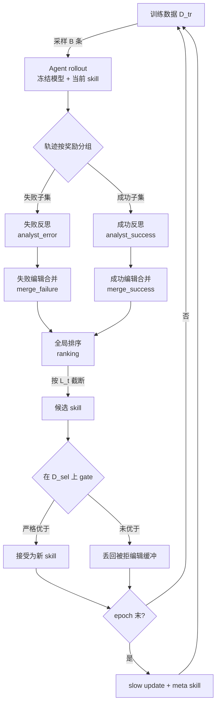
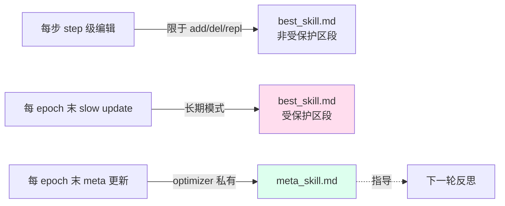

# SkillOpt：让 Agent 技能像权重一样被训练

> **原题**：SkillOpt: Executive Strategy for Self-Evolving Agent Skills
> **作者**：Yifan Yang, Ziyang Gong, Weiquan Huang, Qihao Yang, Ziwei Zhou, Zisu Huang, Yan Li, Xuemei Gao, Qi Dai, Bei Liu, Kai Qiu, Yuqing Yang, Dongdong Chen, Xue Yang, Chong Luo
> **机构**：Microsoft Research, 上海交通大学, 同济大学, 复旦大学
> **年份**：2026（arxiv ID 2605.23904）
> **分类**：cs.AI / cs.CL
> **链接**：https://arxiv.org/abs/2605.23904
> **精读日期**：2026-05-25

## 阅读须知

### 一、这篇在领域里的位置

过去一年多，将大模型组装成「Agent」并在工程任务里使用的尝试已经从研究走向了实际部署。Codex、Claude Code、各类企业内部的工具调用框架，本质上都是「冻结的基础模型 + 一段叫做 prompt 或 skill 的自然语言指令 + 一套执行环境」。这一类系统的能力上限因此被分成两块：基础模型本身的能力，以及那段附在它身上的自然语言指令的质量。

围绕「如何让那段指令变好」这条路径，过去两年大致经历了三波尝试。第一波是「人写」，即让领域专家手动撰写 system prompt 或 skill document，缺点是费时、覆盖窄、改一次要 review 一次。第二波是「让 LLM 一次写完」，把任务描述喂给一个更强的 LLM 让它替我们写一份指令，缺点是没有任何反馈环路，写完就定型。第三波是「自我修订」，把执行结果回灌给 LLM 让它修订指令，代表性工作包括 TextGrad 与 GEPA。这一波的问题在于：修订没有边界，提议常常发散，缺乏类似深度学习里学习率、batch size、validation 这样的纪律。

SkillOpt 这篇位于第四波的开头。它的核心主张是：既然冻结基础模型之外的 skill 文档本质上是一份可以训练的「外部状态」，那就应当用深度学习里早已成熟的那一整套训练纪律去训练它。把 rollout 看作 forward pass，把对成功失败的反思看作 backward pass，把 add/delete/replace 这类有界编辑看作梯度更新，把 held-out 验证集看作验证集，把 cosine 学习率调度看作真正的 cosine 学习率调度。

### 二、读完能回答什么

- 为什么把 agent skill 当作「外部可训练状态」比让 LLM 自由地自我修订更稳？
- SkillOpt 的「文本学习率」具体是什么？为什么有界更新比无界编辑重要？
- 验证集 gate 与「被拒编辑缓冲」（rejected-edit buffer）分别在防止哪一类故障？
- slow update 与 meta skill 这两层结构解决的是什么样的长期问题？
- 在 SpreadsheetBench、ALFWorld 这一类执行型任务上，最终被采纳的「best_skill.md」长什么样？

### 三、阅读前置

假定读者熟悉 Transformer 与基本 RL 框架，会写过简单的 agent loop（系统消息、工具调用、轨迹），对 prompt engineering 与 in-context learning 有基本直觉，但未必专门做过 LLM-as-optimizer 或 self-improvement 这一支。

### 四、首次出现的缩写表

- **SkillOpt**：本文方法名。意为 Skill Optimizer，即把 agent 的 skill 文档作为优化对象。
- **best_skill.md**：方法的最终产物。一份 300 至 2000 token 的自然语言策略文件，部署时与冻结模型一同使用。
- **L_t（textual learning rate）**：文本学习率。在每一步训练中，最多允许应用到 skill 文档上的 add/delete/replace 编辑条数。
- **B（rollout batch size）**：rollout 批大小。每一步从训练集中采样多少条任务让 agent 执行。
- **B_m（reflection minibatch size）**：反思批大小。把 rollout 出来的轨迹分成成功与失败两组之后，每组每轮反思看多少条。
- **D_tr / D_sel / D_test**：训练 / 选择 / 测试三个数据切分。D_sel 即验证集，用于 gate；D_test 完全不参与训练过程。
- **slow update / meta skill**：每个 epoch 末执行的两道慢更新。前者更新 best_skill.md 的受保护区段，后者更新只对 optimizer 可见的「编辑模式偏好」笔记。
- **patch operations**：四种原子编辑动作。append（末尾追加）、insert_after（指定位置插入）、replace（替换文本片段）、delete（删除文本片段）。
- **EvoSkill / TextGrad / GEPA / Trace2Skill**：四种被比对的基线方法，都属于上文所说的「第二、第三波」自然语言优化路线。

## 为什么这个问题值得做

把一个冻结的基础模型部署到一个执行性任务上去用，几乎总要在它前面挂一段自然语言指令。这段指令是脆弱的。它在某些任务上写得好，能让模型的有效准确率上升十几到几十个百分点；写得差，再强的基础模型也办不成最简单的事情。

这段指令的脆弱性可以从两侧观察。从工程侧看，工程师写 system prompt 的过程，本质上是在用人脑去模拟一个非常昂贵的搜索：根据 agent 在线上的失败案例做修订，把修订贴回 prompt 里再上线，看效果，再修订。这条人工循环很慢，覆盖不全，且修订之间互相打架时几乎没有显式记录。从模型侧看，让 LLM 自己修订自己的 prompt 这条路一直没有真正稳过，主要问题是：自由修订下，提议会快速偏离任务的实际收益方向；缺乏验证集，会接受一些看上去合理实际上有害的修改；缺乏学习率限制，每一步的方差过大；缺乏「这次试过不行」的记忆，同一个错误的方向会被反复重新提议。

直到 2025 年底为止，这一类自我修订工作（TextGrad、GEPA、EvoSkill 等）已经把自然语言空间里的「梯度」概念建立起来，但训练纪律仍然薄。SkillOpt 这篇要做的事情，就是把深度学习训练里熟悉的那一整套约束，逐项搬到文本空间：batch 控制 evidence 的方差，learning rate 控制每一步的更新量，validation gate 防止接受有害更新，slow/meta update 充当 momentum 的角色，rejected-edit buffer 充当 negative example 的记忆。归根结底，这是在以一种纪律化的方式回答：为什么权重训练有效，文本训练就不能同样有效。

## 一、问题

要解决的具体问题可以这样描述。给定一个冻结的基础模型 M、一个执行环境 h、一个初始 skill 文档 s_0、一个具备自动可验证奖励的任务域 D，找出一份在分布外验证集 D_sel 上得分最高的 skill 文档 s*，使得部署时仅替换这份文档便能把 M 在该任务上的有效能力推到一个新的水平。形式上，目标是

$$s^*_{\text{sel}} = \arg\max_{s \in \mathcal{C}(D_{tr})} \frac{1}{|D_{sel}|} \sum_{x \in D_{sel}} r(\tau(s; x))$$

其中 τ(s; x) 是 agent 在任务 x 上执行后产生的轨迹，r 是一个区间在 [0, 1] 内的标量奖励，C(D_tr) 是经由训练数据可探索到的候选 skill 集合。

前人路线大致分三类。第一类是「人写」，写完一次便固定，依赖专家的覆盖直觉，缺乏对长尾故障模式的暴露。第二类是「LLM 一次写完」，把任务描述喂给一个强模型让它写出一份 system prompt，覆盖通常比人写更宽但仍然没有反馈循环，写好之后无法在线吸收新出现的失败模式。第三类是「让 LLM 自我修订」，这一类已经具备反馈循环，代表性工作如 TextGrad（把每一步的 prompt 修改类比成梯度下降中的一步）、GEPA（用 Pareto 反思生成多份候选 prompt 演化）、Trace2Skill（用执行轨迹蒸馏成新的 skill），缺点是修订是无界的、未经验证的、且对错误的提议没有有效记忆。

为了让读者抓住后续几节的纪律对应关系，作者明确地把深度学习里熟悉的几件事和文本空间里的对应物列了出来。这一份「术语映射表」是后续方法部分理解起来的关键钥匙：

| 深度学习里的概念 | SkillOpt 里的对应物 |
|---|---|
| batch size | rollout 批大小 B 与反思批大小 B_m，控制证据的噪声 |
| learning rate | 文本学习率 L_t 与调度方式，控制每一步的编辑数量上限 |
| validation set | 选择集 D_sel 与 gate，决定是否接受当前候选 |
| momentum | 每个 epoch 末的 slow / meta 慢更新，保留一段时间内稳定的方向 |
| negative examples | 被拒编辑缓冲，把被拒提议保留供后续反思参考 |

## 二、方法

整体而言，SkillOpt 是一段无限循环的训练流程：采样 rollout、对成功与失败做分组反思、合并 add/delete/replace 编辑、按文本学习率截断、在验证集上 gate、必要时写入受保护区段并更新 meta skill。下面按这一顺序展开。

### 1. 整体流程

### 2. forward pass：rollout 与证据收集

每一步从训练集中无放回采样 B 条任务，让冻结模型 M 在执行环境 h 下、依据当前 skill s_t 完成这些任务。每一条任务对应一条轨迹 τ：包含所有的工具调用、回复、最终输出、以及由可执行 verifier 返回的标量奖励 r ∈ [0, 1]。这一阶段相当于一次 forward pass，目的只在于「以当前 skill 暴露当前的失败与成功模式」。

### 3. backward pass：分组反思

随后将 B 条轨迹按奖励高低分成两个 minibatch，各取 B_m 条交给一个更强的 optimizer 模型（通常是 GPT-5.5 这一档）做反思。失败 minibatch 走 analyst_error 这一份反思 prompt，要求 optimizer 识别多条轨迹共有的、可概括的、不依赖具体实例的失败模式，并提出一组结构化的 add/delete/replace 编辑。成功 minibatch 走 analyst_success，主要负责把已经在多条轨迹上 robust 的成功模式固化下来，不引入与现有 skill 内容重复的新规则。这一阶段相当于一次 backward pass，目的在于把 forward pass 的证据转换成对 skill 的具体编辑提议。

### 4. 有界更新：合并、排序、按学习率截断

两路反思各自产生一组候选编辑之后，由 merge_failure 和 merge_success 这两份 prompt 分别合并去重，然后送入 ranking 这一份 prompt 做全局排序，按编辑的预期收益从高到低取前 L_t 条应用。这里 L_t 是「文本学习率」，扮演的正是传统训练中 learning rate 的角色。论文支持四种调度方式：constant（恒定）、linear（线性衰减）、cosine（余弦衰减）和 autonomous（让 optimizer 自己决定本步该应用几条）。默认配置是从 L_t = 4 余弦衰减到 L_t = 2，意味着训练前期容许更激进的探索，后期逐渐保守。

四种允许的原子编辑分别是：

- `append`：在 skill 文档末尾追加一段内容。
- `insert_after`：在指定的小节标题或文本片段后插入一段内容。
- `replace`：将一段精确文本替换为新内容。
- `delete`：删除一段精确文本。

之所以限定为这四种，原因是：自然语言编辑的失败模式之一是模型「重写一切」，看上去更整洁，但实际上把以前学到的有用规则一并冲掉。把更新限制在小颗粒度的 patch 上，可以让训练过程保留连续性，方便后续比对哪一条编辑真正带来增益。

### 5. 验证集 gate 与被拒编辑缓冲

候选 skill 在 D_sel 上重新跑一次小规模评估。仅当其得分**严格大于**当前 skill 的对应得分时才被接受，平局（包括方差导致的伪平局）一律拒绝。这一道 gate 是整套方法最关键的一道防线：它把那些「读起来合理实际上有害」的编辑挡在门外。

被拒绝的编辑并不会被丢弃，而是写入「被拒编辑缓冲」（rejected-edit buffer）。下一步反思时，optimizer 会一并参考缓冲中的失败提议，从而显著降低同一类无效方向被反复重新提出的概率。这一机制相当于在文本训练中实现了 negative examples 的记忆。

### 6. 慢更新：slow update 与 meta skill

每个 epoch 末，SkillOpt 还有两道与 step 级编辑节奏不同的慢更新。

第一道是 slow update。它在同一批训练任务上，用前一份 skill 与当前 skill 各跑一遍，比较两份轨迹的差异，区分出四类样本：刚刚被修好的、刚刚回退的、一直对的、一直错的。optimizer 据此向 skill 文档的「受保护区段」写入一段简洁的长期指引。该区段由 `<!-- SLOW_UPDATE_START -->` 与 `<!-- SLOW_UPDATE_END -->` HTML 注释标出，step 级编辑不允许触碰，只有 slow update 可以写。这一设计的意图是：让那些只有跨多步比对才能发现的稳定模式有一个不会被冲走的栖息地。

第二道是 meta skill 的更新。meta skill 是一份只对 optimizer 自己可见、不影响目标模型行为的笔记，记录的是「哪些类型的编辑过去帮助过、哪些反而拖了后腿」。它扮演 optimizer 自身的 momentum，使得多个 epoch 之间 optimizer 不会反复重新认识相同的事实。

### 7. 部署：唯一产物是一份 markdown

训练结束之后，SkillOpt 唯一对外交付的工件就是一份 best_skill.md，大小通常在 300 到 2000 token 之间，部署时与冻结的目标模型一同使用即可，不需要任何权重更新、不需要任何 retrofit。

## 三、实验

### 1. 实验设置

任务覆盖六类典型场景：网页搜索问答（SearchQA）、电子表格自动化（SpreadsheetBench）、办公文档问答（OfficeQA）、文档视觉问答（DocVQA）、活动竞赛数学题（LiveMathematicianBench）、家居导航任务（ALFWorld）。这六类既有静态问答也有长轨迹工具调用，能从不同维度暴露 skill 的不同侧面。

目标模型覆盖七档：GPT-5.5、GPT-5.4、GPT-5.4-mini、GPT-5.4-nano、GPT-5.2，以及 Qwen3.5-4B 与 Qwen3.6-35B。执行环境覆盖三种：直接 chat（无工具）、Codex（写代码的 harness）、Claude Code（一种基于 Claude 的 agent harness）。

对照的基线五条：no skill、人写 skill、LLM 一次写完的 skill、Trace2Skill、TextGrad、GEPA，以及最强的同类竞品 EvoSkill。

### 2. 主结果

下面这张表只摘 GPT-5.5 在 direct chat 下的六项主表，给读者一个直观感觉：

| 任务 | no skill | SkillOpt | 净增益 |
|---|---|---|---|
| SearchQA | 77.7 | 87.3 | +9.6 |
| SpreadsheetBench | 41.8 | 80.7 | +38.9 |
| OfficeQA | 33.1 | 72.1 | +39.0 |
| DocVQA | 78.8 | 91.2 | +12.4 |
| LiveMathematicianBench | 37.6 | 66.9 | +29.3 |
| ALFWorld | 83.6 | 95.5 | +11.9 |
| **平均** |  |  | **+23.5** |

跨七档模型的平均净增益约 +17.6 个百分点。最有意思的是在执行型 harness 下：Codex 平均 +24.8（比 EvoSkill 多出 +14.0），Claude Code 平均 +19.1（比 EvoSkill 多出 +3.2）。在所有 52 个被评估的 cell 上，SkillOpt 都拿到最好或并列最好的成绩。

### 3. 消融与意外结果

第一类消融是关于 evidence 大小的。rollout batch size 在 8 到整个 epoch 之间表现稳健，反思 minibatch 在 1 到 32 之间表现稳健。值得注意的是：训练集本身的大小对程序性强的任务影响显著，SpreadsheetBench 在训练集占比从 1% 拉到 100% 的过程中，最终得分从 47.5 提升到 78.0。这说明这类任务确实是「越看越懂」的，而不只是从一两条样本里就能蒸馏出来。

第二类消融是关于「学习率与边界」。L_t 在 {1, 2, 4, 8, 16} 都具有竞争力，但**去掉边界本身**（即每步可以无限多编辑）平均掉 2 到 4 个点。换句话说，比起调度方式（constant 或 cosine），边界本身的存在更关键。

第三类消融是关于「slow update + meta skill」这两层结构的价值。一旦同时去掉，SpreadsheetBench 上掉 22.5 个点。这是整篇论文中最大的一处单点收益，几乎相当于在跨 epoch 之间彻底失忆。

第四类消融是 rejected-edit buffer。去掉后跨任务平均掉 2.4 到 4.6 个点。

第五项意外结果，是关于「学到的内容到底有多少」。最终 best_skill.md 的实际增长长度只到 379 到 1995 token，相比初始版本只增长了 2.5 到 53 倍；累计被采纳的编辑数极少（中位数仅 2.5），其中 LiveMathematicianBench 的 +29.3 个点提升仅来自 **1 条**编辑，OfficeQA 的 +39.0 个点提升也来自 **1 条**编辑。验证集 gate 把绝大多数提议都挡在门外，只有那一两条真正击中关键模式的提议留了下来。

### 4. 迁移实验

skill 的可迁移性是这篇论文里最讨喜的部分。

跨模型迁移：用 GPT-5.4 在 SpreadsheetBench 上训出的 skill，搬到 GPT-5.4-nano 上仍带来 +3.0 点提升，相当于保留了原始增益的 43.5%。所有跨模型迁移行都为正，没有出现「换小模型反而劣于无 skill」的情况。

跨 harness 迁移则更夸张。SpreadsheetBench 上由 Codex 训出的 skill 搬到 Claude Code，提升 +59.7 个点（22.1 → 81.8）；反向也带来 +43.6 个点。这说明所学的不是某种 API 配方，而是任务本身的程序性知识，与具体调用方式解耦。

跨基准迁移（数学）：在 OlympiadBench 上训的 skill 搬到 Omni-MATH，三档模型上分别带来 +3.7、+1.8、+1.3 个点。规模虽然没有同任务那么大，但全线正向。

### 5. learned skill 长什么样

论文里把六大任务上最终被采纳的核心规则原文列了出来。这一段非常值得抄一遍，它直接告诉读者 SkillOpt 学到的东西并不是「在 prompt 里塞实例」，而是真正的程序性纪律：

- SearchQA：「从线索措辞里推断期望答案类型，然后挑选由共现的独特证据支持的最短规范实体」。
- SpreadsheetBench：「先观察工作簿结构与已有公式，然后在所有被请求的目标区域写入已计算好的静态值，而不是依赖 Excel 重算」。
- OfficeQA：「把 oracle 解析出来的页面当作主证据，锁定表格 / 日期 / 单位上下文，然后只输出请求的、四舍五入到位的数值，不加任何额外标签」。
- DocVQA：「对于表格 / 表单 / 图表 / 图例，先把问题绑定到精确的行 / 列 / 字段，然后只复制对齐的那一段答案」。
- LiveMathematicianBench：「在『选出最强陈述』这一类多选题中，按定理强度对选项排序，宁可选一个有理由的更强结果，而非一个真但更弱的推论」。
- ALFWorld：「保留一份带地平线意识的『已访问 / 待访问』台账，多次同类失败之后切换搜索策略，在拿到目标之前不要重复访问目的地」。

每一条都是程序性的、可泛化的、可审计的，而且都是冻结的基础模型在 zero-shot 状态下不会自带的纪律。

## 四、局限

### 1. 作者自己承认的

作者明确指出三件事。第一，该方法对「可自动验证奖励」高度依赖。它最适合那些有 exact-match 评测、可执行检查、或者明确单元测试的任务域。在没有可靠 verifier 的开放领域，整套训练纪律会立刻松弛，因为验证集 gate 没有可信信号。

第二，训练本身是有成本的。每个 step 都需要 rollout 加 optimizer 调用，成本按 token 计在百万到几千万量级。对那种一次性的小任务，先 SkillOpt 一遍再上线未必划算；它的价值在于「训一次反复用」。

第三，本方法刻意优化的是一份 skill，不是一个 skill 库。对于子任务异质性极大的复杂域，单一 skill 可能不够，需要更高一级的路由或编排机制。这条限制同时也是这篇论文延期到「未来工作」的部分。

### 2. 读完能看出来的

第一处是优化器自身的能力依赖。表 5 给出的数据揭示了一件事：换用「与目标模型同档」的 optimizer，仅能恢复原 frontier optimizer 增益的 56% 到 74%。换言之，SkillOpt 的可观收益里有相当一部分来自 GPT-5.5 这一级 optimizer 的「认知带宽」。在没有 frontier 优化器可用的场景里，本方法的上限会被压低。

第二处是「过拟合到训练分布」的风险。skill 文档可能编入只在 D_tr 局部成立的启发式，下游若任务分布偏移，需要重新做一次小规模再训练或者人工 review。论文里给出的跨基准迁移虽然全线正向，但增益数值比同任务低一个数量级，提示这一类风险是真实存在的。

第三处是「在多变环境里持续训练」这一更现实的场景尚未充分研究。本文实验都是有限 epoch 内训练、训练完即部署的格式，没有展示「线上反馈持续接入的长流程」。从工程现实出发，这条更接近真实部署需求，但当前论文没有覆盖。

## 一句话

SkillOpt 把深度学习的训练纪律（batch、学习率、验证集、动量、负样本）逐项搬到文本空间，对冻结模型外挂的 skill 文档进行带 gate 的有界编辑训练。
