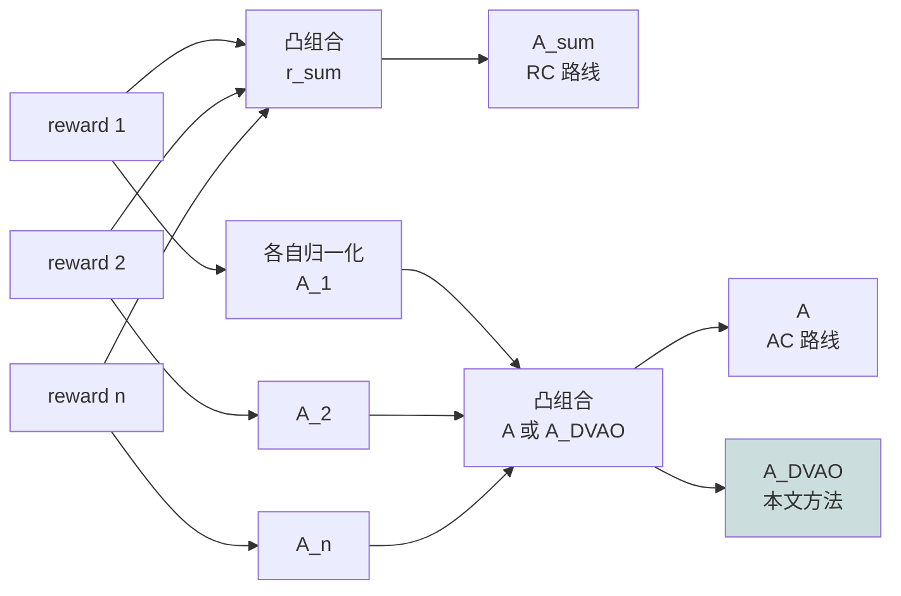
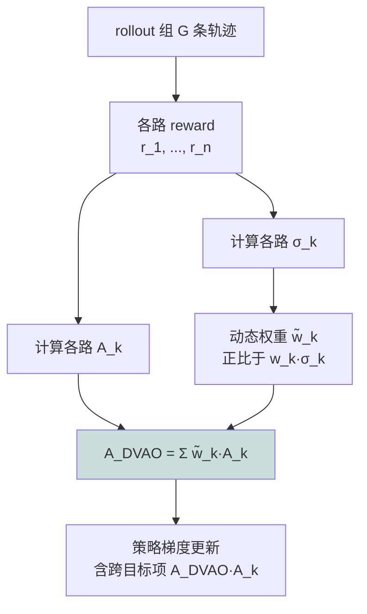

# DVAO：用奖励方差给多目标 RL 当动态权重的纪律方案

> **原题**：DVAO: Dynamic Variance-adaptive Advantage Optimization for Multi-reward Reinforcement Learning
> **作者**：Guochao Jiang, Jingyi Song, Guofeng Quan, Chuzhan Hao, Guohua Liu, Yuewei Zhang
> **机构**：阿里云
> **年份**：2026（arxiv ID 2605.25604）
> **分类**：cs.CL / cs.LG
> **链接**：https://arxiv.org/abs/2605.25604
> **精读日期**：2026-05-26

## 阅读须知

### 一、这篇在领域里的位置

GRPO（Group Relative Policy Optimization）这条路线在 2024 年由 DeepSeekMath 提出，到 2026 年已经成为大模型 post-training 阶段事实上的标准选项。它的吸引力在于：不需要单独训练一个 value model，仅依赖在一个 rollout 组内做相对优势估计，便能用 PPO 同等的算法骨架完成策略更新。DeepSeek-R1、Kimi K2.5 等近一年问世的强推理模型，绝大多数都建立在 GRPO 或它的若干变种之上。

在 GRPO 这一支内部，过去一年里出现了一组以「单目标 RL」为主的改进：DAPO 引入动态采样与 token 级策略梯度以加速收敛，GSPO 把重要性采样比从 token 级别上移到序列级别以削减方差，GFPO 与 DLER 等则尝试在 reward 端引入长度信号。这些工作的共同点是：依然假设训练目标可以被压缩成一个标量奖励。

然而真实业务场景几乎总是多目标的：模型既要给出对的答案，也要遵守长度约束；既要写出能跑的代码，也要降低 bug 率；既要正确调用工具，也要保持调用格式合法；既要事实正确，也要降低幻觉率。把多个目标压成一个标量信号有两条标准做法。第一条叫 Reward Combination（RC），把各路 reward 先做凸组合再交给 GRPO。第二条叫 Advantage Combination（AC），把每一路 reward 各自归一化为 advantage，再对 advantage 做凸组合，代表性工作是 GDPO。

DVAO 这篇位于这一支的反思之后。作者形式地证明了两件事：RC 路线必然产生比 AC 路线更大的平方均值优势，进而带来训练不稳定；AC 路线虽然控住了 magnitude，但完全忽略了多目标之间的相关性，难以在动态训练中调整不同目标的相对强度。DVAO 的提案是用每个 rollout 组内的经验奖励方差，作为该目标当前权重的依据，这是一个完全数据驱动、无需手工调参的纪律性方案。

### 二、读完能回答什么

- 为什么 Reward Combination 比 Advantage Combination 更容易让训练发散？这是直觉还是定理？
- 「奖励方差」与「学习信号强度」之间是什么关系？为什么方差大的目标更值得当前多学一些？
- DVAO 的隐式跨目标正则化是从哪一步推导里冒出来的？
- 在 Pareto 前沿上，DVAO 到底胜过 RC / AC / GDPO 多少？
- 这套方案对超参的依赖到底有多低？是真"无超参"还是"少超参"？

### 三、阅读前置

假定读者读过 PPO 的基本推导，对策略梯度、importance sampling、clipping 的作用有清楚直觉，对 GRPO 与 group rollout 的相对优势估计也熟悉。多目标 RL 与 Pareto 前沿这两个概念至少在术语层面有过接触。涉及到的数学只用到一阶 Cauchy-Schwarz 不等式与方差展开。

### 四、首次出现的缩写表

- **GRPO**（Group Relative Policy Optimization）：在一个 rollout 组内做相对优势估计的策略优化算法，免去单独的 value model。
- **PPO**（Proximal Policy Optimization）：GRPO 的前身，依赖独立的 value model 与 clip-style 信赖域。
- **RC**（Reward Combination）：把多路 raw reward 直接做凸组合得到 r_sum，再走标准 GRPO。本文证明它会放大 advantage 的平方均值。
- **AC**（Advantage Combination）：把每一路 reward 各自归一化为 A_k，再对 A_k 做凸组合得到最终 advantage。代表实现是 GDPO。
- **DVAO**：本文提出的方法。在 AC 的骨架上把固定权重 w_k 换成与该 rollout 组内 reward 方差挂钩的动态权重 w̃_k。
- **GDPO**（Group Reward-Decoupled Normalization Policy Optimization）：AC 路线的代表性具体实现，依赖固定 w_k 与 batch-wise advantage normalization。
- **BFCL-v4**（Berkeley Function Call Leaderboard 第 4 版）：本文 tool-use 任务用的综合性 benchmark，覆盖单步、多步、实时执行、无关工具拒识、并行工具选择等。
- **rollout 组 G**：每个 query 采样的 rollout 条数，本文实验中 G = 16。
- **σ_k^i**：在 query x_i 上、rollout 组内第 k 个目标的 reward 标准差，是 DVAO 动态权重的核心量。

## 为什么这个问题值得做

把 LLM 在真实场景里跑起来，几乎不存在「只优化一个目标」的可能。一个数学推理模型不仅需要答案对，还得在 4000 token 以内把推理过程讲完；一个工具调用模型不仅得选对工具，还得让输出格式严格满足下游 schema；一个 RAG 模型既要事实可靠，又要响应足够简短。每一个这样的「准业务」场景，都是一个标量化多目标 RL 问题。

业界一直以来处理这类问题的姿势其实相当粗糙。最常见的写法只有两类：要么把各路 reward 加权求和，要么把各路 advantage 加权求和。前者写起来简单一行，后者声称更稳定，但两边都有人在不同任务上踩坑。一个常见的报告是「reward combination 训到一半 loss 跳飞」，另一个常见报告是「advantage combination 永远在某一个 reward 上原地踏步」。

为什么会这样，圈内的通行说法是「需要调权重」。这等于把问题推回到了人工搜索。DVAO 这篇的贡献，在于它先把这两类标准做法的失败模式形式化为定理：RC 一定会让 advantage 平方均值比 AC 大，而 AC 不可能把目标之间的相关性纳入更新方向。两条命题一旦明确，问题就不再是「该选 RC 还是 AC」，而是「能不能拿到一个既比 RC 稳、又比 AC 灵活的方案」。归根结底，这是把多目标 RL 训练从「靠手感调权重」往「靠 rollout 数据自己说话」推一步的尝试。

## 一、问题

形式化地讲，多目标 RL 问题是这样描述的。给定一个 query x_i 与其 rollout 组 {y_j}（j 从 1 到 G），每条轨迹对应 n 路奖励 r_1^(i,j), ..., r_n^(i,j)，每一路 reward 都被归一化到 [0, 1]。我们希望训出来的策略 π_θ 在所有这 n 路 reward 上同时表现良好。

Reward Combination 的做法是先凑一个总奖励 r_sum^(i,j) = Σ w_k r_k^(i,j)，再按标准 GRPO 算 advantage：

$$A_{\text{sum}}^{(i,j)} = \frac{r_{\text{sum}}^{(i,j)} - \text{mean}}{\text{std}}.$$

Advantage Combination 反过来：先各路 reward 各算自己的 advantage A_k^(i,j)，再做凸组合 A^(i,j) = Σ w_k A_k^(i,j)。

这两条路线哪一条「更接近正确」？作者的第一项工作是把这个问题翻译成关于 advantage 平方均值的比较。

### Proposition 1：RC 的 advantage 平方均值不小于 AC

作者的第一项形式化结果是：对固定的 query x_i，

$$\frac{1}{G} \sum_{j} (A_{\text{sum}}^{(i,j)})^2 \geq \frac{1}{G} \sum_{j} (A^{(i,j)})^2,$$

等号成立当且仅当所有 advantage 两两完全正相关。证明用到的关键事实是 advantage 在 rollout 组内被归一化，因此样本均值为 0、平方均值为 1。展开 AC 的平方均值，结果只比 1 小，差出的部分恰好是「目标两两不完全相关」的程度。

这条命题的意义是：**RC 不是简化版的 AC，而是策略梯度上单位时间更新更大的版本**。在多目标场景下，这个「更大」并不一定意味着「更好」，反而经常带来训练时早期的梯度跳飞。论文里 4.3 节给出的训练曲线印证了这一点：RC 的 reward std 在整个训练过程里始终高于 AC，且收敛末端依然不下来。

### Proposition 2 的铺垫：AC 失去了相关性信号

AC 看似干净，但作者揭示出一个隐藏的缺陷。从 RL 梯度的角度，AC 的总目标梯度

$$\nabla_\theta J = \sum_k w_k \nabla_\theta J_k$$

是 n 路独立单目标 RL 梯度的凸组合，意味着每一路目标在更新中被完全孤立看待。两个目标之间是协同还是对抗，AC 看不到。换句话说，它假设了多目标之间没有任何相互作用，这与真实任务的事实几乎总是相反的。

所以问题不再是「RC 还是 AC」，而是：能不能找一个 advantage 形式，**既保证 magnitude 像 AC 那样可控，又把多目标之间的相关性带回更新方向**。

## 二、方法

DVAO 给出的回答非常简洁：把 AC 里的固定权重 w_k 换成与该 rollout 组内 reward 方差挂钩的动态权重。

### 1. 核心定义

令 σ_k^i 为 query x_i 上、rollout 组内第 k 个 reward 的样本标准差。定义动态权重

$$\tilde{w}_k = \frac{w_k \sigma_k^i}{\sum_l w_l \sigma_l^i}.$$

DVAO 的 advantage 就是用这一组动态权重对各路独立 advantage 加权：

$$A_{\text{DVAO}}^{(i,j)} = \sum_k \tilde{w}_k A_k^{(i,j)} = \frac{\sum_k w_k \sigma_k^i A_k^{(i,j)}}{\sum_l w_l \sigma_l^i}.$$

直观上理解，这等同于「让 reward 方差大的目标拿到更多权重」。reward 方差为什么对应「学习信号强度」呢？因为方差小的目标，意味着模型已经在这一个目标上回答得差不多统一，再继续推下去边际收益很低；方差大的目标，意味着模型对这一目标尚未稳定，继续训能学到更多。

### 2. Proposition 2：DVAO 的 advantage 不大于 RC

第二项形式化结果是：对任意 j，

$$|A_{\text{DVAO}}^{(i,j)}| \leq |A_{\text{sum}}^{(i,j)}|.$$

证明用到一个核心恒等式

$$\sigma_{\text{sum}}^i A_{\text{sum}}^{(i,j)} = \sum_k w_k \sigma_k^i A_k^{(i,j)},$$

再配合 Cauchy-Schwarz 不等式 σ_sum^i ≤ Σ w_k σ_k^i，立刻得出 DVAO 的 advantage 是 RC 的 advantage 缩成的版本。归根结底，DVAO 在 magnitude 上不输 AC、不会像 RC 那样爆，但仍保留了「跟 reward 方差挂钩」的灵活性。

### 3. Proposition 3：DVAO 隐式包含跨目标正则化

这一项是 DVAO 整篇里最关键、也最有意思的结果。作者计算 A^(i,j) 与 A_DVAO^(i,j) 各自对第 k 路 raw reward 的偏导：

$$\frac{\partial A^{(i,j)}}{\partial r_k^{(i,j)}} = \frac{w_k}{\sigma_k^i} \left(1 - \frac{1}{G} - \frac{1}{G} (A_k^{(i,j)})^2 \right),$$

$$\frac{\partial A_{\text{DVAO}}^{(i,j)}}{\partial r_k^{(i,j)}} = \frac{\tilde{w}_k}{\sigma_k^i} \left(1 - \frac{1}{G} - \frac{1}{G} A_{\text{DVAO}}^{(i,j)} A_k^{(i,j)} \right).$$

两式的关键差别在于括号里那一项。AC 的敏感度只跟「第 k 路 advantage 自身的平方」挂钩，即每一路目标的梯度贡献只由它自己的表现决定。DVAO 的敏感度则跟「DVAO 总 advantage 乘 A_k」挂钩，即第 k 路目标的梯度贡献由整个组合 advantage 与该路 advantage 的乘积决定。

这一项乘积叫 cross-objective term。它的物理意义是：如果模型在某个 rollout 上整体表现好（A_DVAO 大），那么把单一目标 k 学得更好会带来更大的回报；如果模型在这个 rollout 上整体已经差（A_DVAO 小或负），过度优化单一目标 k 反而会被压抑。换句话说，DVAO 把"全局多目标表现"自动写进了"单目标更新方向"的调节系数里，**这等价于一个隐式的、与方差自适应的跨目标正则化**。

### 4. 训练流程

DVAO 在 GRPO 流程上只动一处：把原本计算 r_sum 或固定 w_k 加权 A 的那一步，换成上面的 DVAO advantage。其他步骤（importance sampling、PPO-style clipping、KL 项）原封保留。代码层面只是几行差异。

## 三、实验

### 1. 实验设置

数学推理任务用 DAPO-MATH-17k 训练，AIME-2024、AIME-2025、MATH500、OlympiadBench、AMC23 评测，两路目标分别是 accuracy（答案对错）和 length（输出 ≤ 4000 token）。模型用 Qwen3-4B-Base 与 Qwen3-8B-Base。

工具调用任务用 ToolRL 设定，BFCL-v4 评测，两路目标分别是 tool-use accuracy 与 format compliance。模型用 Qwen2.5-3B-Instruct 与 Qwen2.5-7B-Instruct。

基线：GRPO 单目标（只用 r_acc）、RC、AC、GDPO。所有方法的初始权重都是等权，避免「DVAO 赢只因为权重选得好」的反驳。

训练参数：AdamW，恒定学习率 1e-6，prompt batch 128，G = 16，500 步收敛，最大生成长度 8192，温度 0.6，top-p 0.95，硬件是 8 张 H20-3e GPU。

### 2. 主结果

文中 Table 1 与 Table 2 总结了五个数学集与三个 BFCL 子集的对比。论文展示的核心信息可以用一句话概括：**在所有任务、所有模型规模、所有评测维度上，DVAO 全部拿到最佳或并列最佳**。每一个基线方法都在某一维上失守：

- GRPO 单目标在 tool-use 上格式合规几乎为零（因为它根本没接收 format reward 信号）
- RC 在数学集上 reward std 始终高于 AC，训练曲线波动明显
- AC 在 7B tool-use 上甚至**比基础模型差**（accuracy 反降）
- GDPO 在数学集上换来了几乎完美的长度合规，但牺牲掉的 accuracy 是所有方法里最低的

DVAO 是唯一一个同时拿到最高 accuracy 与近乎完美 length/format 合规的方法。

### 3. 训练动态

4.3 节展示的训练曲线说明了三件事。

**accuracy reward**：DVAO 的 mean 曲线在整个训练过程中都高于所有基线，且 std 收敛末端最低。AC 全程 std 最高。这印证了 Proposition 2 的预测——DVAO 的 advantage magnitude 被严格 bound 住，梯度更稳。

**length reward**：DVAO 的 length reward 几乎是直接朝 1.0 走，std 收敛末端在 4B 上是其他方法的几分之一，在 8B 上几乎归零。这一处的"std 崩溃"是 Proposition 3 预测的跨目标正则化在起作用：accuracy 与 length 通过 cross term 互相耦合，避免任一目标主导梯度。

**response length**：所有方法都从约 800 token 起步，DVAO 的 mean 最快上升、上限最高。曲线本身比 RC/AC 振荡更明显，但围绕的平均值更高。作者把这解读为「DVAO 的 bounded advantage 信号不会失控但仍能鼓励长度生长」。

### 4. Pareto 前沿

4.4 节是另一处重击。作者按 w_1 ∈ {0.1, 0.3, 0.5, 0.7, 0.9} 扫一遍 accuracy 与辅助目标的权重，画出二维平面上的 Pareto 前沿。DVAO 的整条前沿都在其他方法之上，**并不是某一个权重组合下的局部胜利**。

更尖锐的是各路基线的失败模式各自不同：RC 在 weight sweep 中快速饱和、AC 在 weight sweep 中严重不稳、GDPO 表现无序波动。DVAO 把整条前沿在数学任务上整体往右上方平移了一截。这意味着 DVAO 的纪律性优势不依赖某一个调参组合。

下表给出主要结果的趋势性总结（精确数字见原文 Table 1、Table 2）：

| 任务 | 模型 | DVAO 相对最强基线（GDPO 或 AC） |
|---|---|---|
| AIME / MATH500 / OlympiadBench / AMC23 综合 | Qwen3-4B-Base | accuracy 与 length 同时领先 |
| 同上 | Qwen3-8B-Base | 优势更明显，长度合规几乎完美 |
| BFCL Live / Non-Live / Multi-Turn | Qwen2.5-3B-Instruct | accuracy 与 format 同时领先 |
| 同上 | Qwen2.5-7B-Instruct | AC 反而劣于基础模型，DVAO 领先幅度最大 |

### 5. 一处反直觉的细节

DVAO 的优势不在「reward 设计更聪明」，而在「权重重新分配」。所有方法用同一组 reward 函数、同一组初始权重 w_k = 1/n（等权初始化），DVAO 单凭运行时依据 σ_k 重写 w̃_k 这一项动作便拿下整面 Pareto 前沿。这一点提示：很多多目标 RL 训练里看似来自 reward 设计的问题，本质上其实是 advantage scaling 的问题。

## 四、局限

### 1. 作者自己承认的

作者在 Appendix E 提到两件事。第一，DVAO 的实验局限于两目标场景。在 reward 数量更多（例如 5 路以上）的 alignment 任务里，方差挂钩权重是否仍然单调改善，没有给出实验数据，仅作为未来工作。第二，DVAO 是 GRPO 框架内的改良，作者把这一思路扩展到更广的 alignment 范式（如 DPO 或 reward modeling）作为延伸方向。

### 2. 读完能看出来的

第一处是「方差等于学习信号」这条假设的 limits。若某一路 reward 本身就极度噪声（例如 LLM-as-judge 给出的 hallucination 评分），其方差大未必意味着"该多学一些"，反而可能在拉偏梯度。DVAO 没有引入 reward 自身质量的过滤机制，对低质 reward 的鲁棒性是一个公开问题。

第二处是计算成本。DVAO 要在每一步、每一个 rollout 组上各自计算 n 路标准差与一路 cross term，相比 AC 多一点常数，但在 G = 16 这一档实测可忽略。但若 rollout 组进一步变小（G = 4 或 8），σ_k 的样本估计本身会变得不稳，DVAO 的稳定性可能会下降。这是一个值得跟进的边界场景。

第三处是 reward 单调性假设。本文用的 length reward 是 0/1 阶跃函数（≤ l 则 1，否则 0），format reward 同样是 0/1。这种二值 reward 在 rollout 组里的方差走的是 Bernoulli 路径，与连续 reward 的方差几何意义略有不同。DVAO 在 Bernoulli reward 上的良好表现是否能直接外推到连续 reward 上，需要更多实验佐证。

第四处是对 batch-wise 归一化的依赖。GDPO 引入了 batch-wise advantage normalization 以维持稳定，DVAO 在 group-wise 层面已经 bound 住 magnitude，是否还需要额外的 batch-wise 归一化未在论文里展开讨论。

## 一句话

DVAO 用每个 rollout 组内的 reward 方差自动给多目标 GRPO 重新分配权重，既严格 bound 住 advantage magnitude，又通过跨目标 cross term 隐式引入了与方差自适应的多目标正则化。
