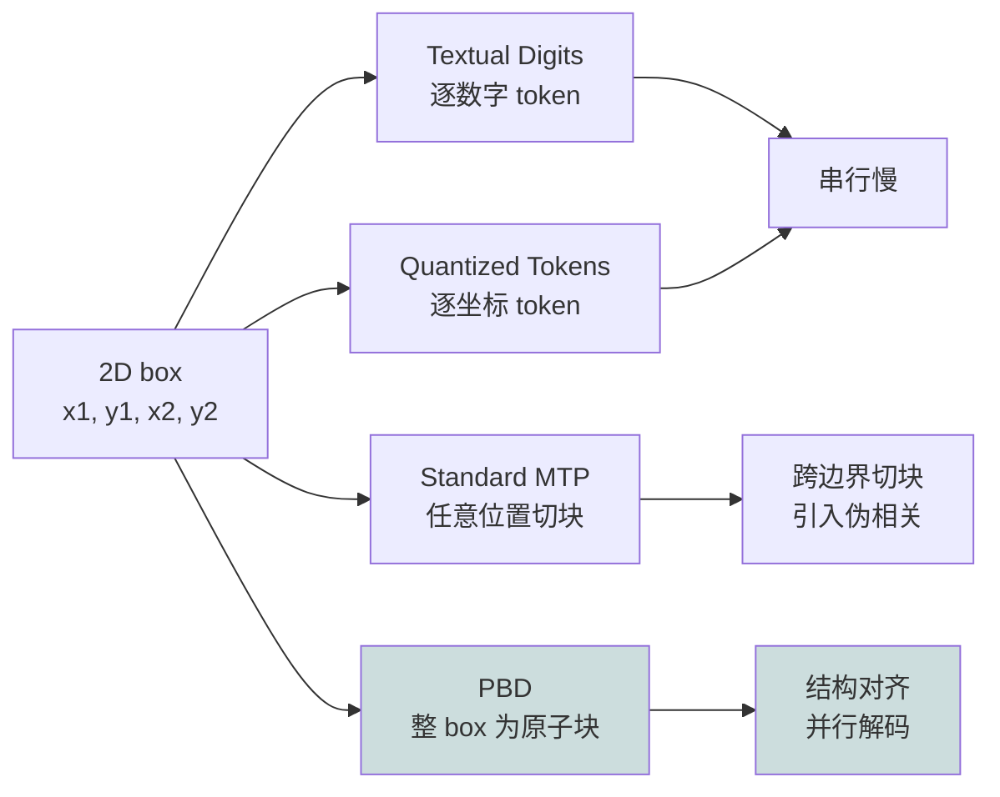
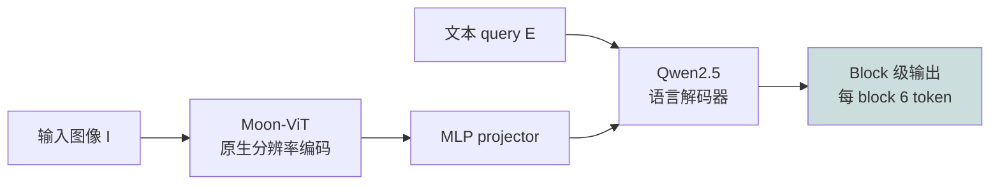
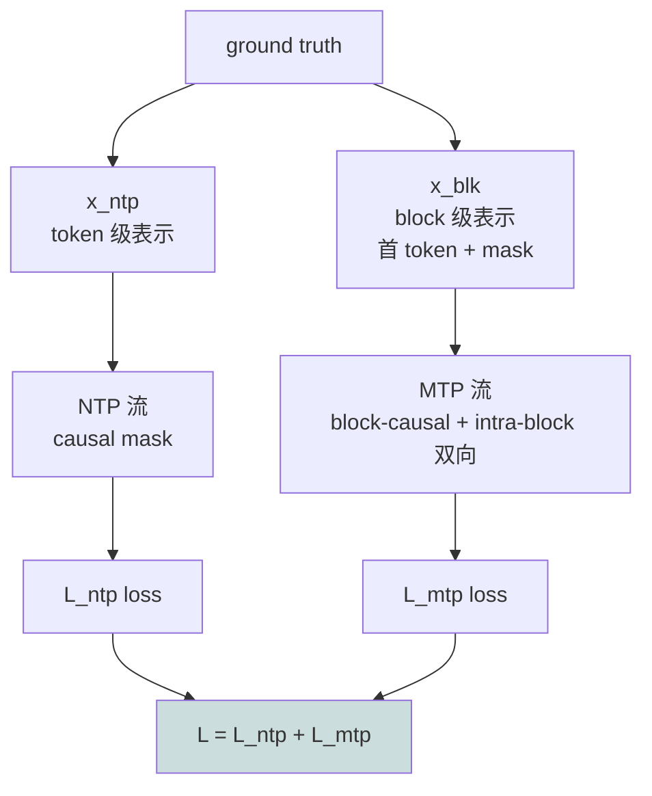
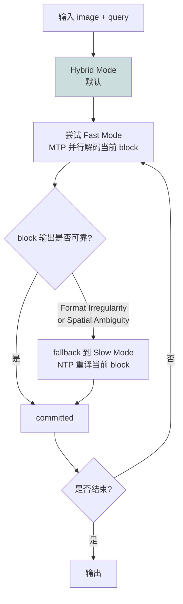

# LocateAnything：把检测框当作一个原子单位并行解码

> **原题**：LocateAnything: Fast and High-Quality Vision-Language Grounding with Parallel Box Decoding
> **作者**：Shihao Wang, Shilong Liu, Yuanguo Kuang, Xinyu Wei, Yangzhou Liu, Zhiqi Li, Yunze Man, Guo Chen, Andrew Tao, Guilin Liu, Jan Kautz, Lei Zhang, Zhiding Yu
> **机构**：NVIDIA 等多家机构合作
> **年份**：2026（arxiv ID 2605.27365）
> **分类**：cs.CV / cs.AI / cs.LG / cs.RO
> **链接**：https://arxiv.org/abs/2605.27365
> **精读日期**：2026-05-27

## 阅读须知

### 一、这篇在领域里的位置

视觉语言模型（VLM）在过去两年正在快速吞并传统视觉系统的工作面。把 Qwen-VL、InternVL、SEED1.5-VL 这一档模型挂上一个手柄，让它替你回答"图中那只猫在哪一块区域"或"屏幕上设置按钮的坐标是什么"，已经是常规需求。但 VLM 是文本生成模型，要让它输出坐标，主流做法是把检测框（x1, y1, x2, y2）当成一串文本 token 让模型按 next-token prediction 一路输出。Pix2Seq 与 Kosmos-2 把这条路定了下来，Rex-Omni 是这一支当前的最强者。

这一支的两条具体实现是「Textual Digits」与「Quantized Tokens」。前者把 1024 当成「1」「0」「2」「4」四个 token 串接；后者把坐标量化到一个特殊 token 表里再依次输出 x1→y1→x2→y2。两者都把一个二维几何对象拍扁成一维 token 流，由此带来两个问题：第一，推理时严格按 token 串行，导致延迟高、吞吐低；第二，模型并不知道 x1 与 y1 是绑定在同一个 box 上的，它只学到「邻接 token 的统计共现」，没有学到结构的耦合关系。

业界对 next-token 慢的回应是 Multi-Token Prediction（MTP）这一支：Medusa、SDLM、Block Diffusion 等让模型一次预测若干 token。MTP 用在普通文本上效果尚可，但用在 box 坐标这种结构化对象上时反而表现下滑，原因是这些方法对结构无知 —— 它们把序列按任意位置切块，可能跨越某个 box 的边界、甚至跨越类别。模型由此学到一些虚假的共现模式，反而损害精度。

LocateAnything 这篇位于「VLM 检测/grounding」与「并行解码」的交叉点上，它的主张极其简单且有力：**把整个 bounding box 当作一个原子单位**，让模型在一次前向传播里直接并行输出整个 box 的所有 token。结构对齐 + 并行解码这两件事第一次被合在一起处理，从而拿到吞吐与精度的双重收益。

### 二、读完能回答什么

- 为什么 next-token prediction 输出坐标这条路在 throughput 与 accuracy 上是双输的？
- Parallel Box Decoding 与传统 MTP（如 Medusa、Block Diffusion）的本质区别是什么？
- 在训练时同时跑 NTP 与 MTP 两条流，attention mask 是如何让两条流不相互泄露的？
- Hybrid 推理模式的 fallback 触发条件是什么？为什么这两条规则能覆盖绝大多数失败模式？
- 在 COCO ablation 上，accuracy 提升与 throughput 提升各自来自哪一层贡献？

### 三、阅读前置

假定读者熟悉 Transformer 与 KV cache 机制、了解 VLM 当前主流架构（vision encoder + projector + LLM decoder）、对目标检测的标准 metric（IoU、F1、mAP）有清楚直觉，对 next-token prediction 的因果 mask 设计也熟悉。本文涉及的多 token 预测背景见过 Medusa 或 speculative decoding 之一即可。

### 四、首次出现的缩写表

- **VLM**（Vision-Language Model）：视觉语言模型，本文以 Qwen3-VL、Rex-Omni 等为对照。
- **NTP**（Next-Token Prediction）：标准自回归 token 输出方式，本文称为 Slow Mode。
- **MTP**（Multi-Token Prediction）：一次预测多个 token 的并行解码思路，代表方法 Medusa、SDLM、Block Diffusion。
- **PBD**（Parallel Box Decoding）：本文核心方法。把整个 bounding box 当作一个原子的 6-token 区块（含 4 个量化坐标与 2 个结构 token）一次并行输出。
- **Textual Digits / Quantized Tokens**：坐标输出的两类传统编码方式。前者按十进制数字串行输出，后者把坐标量化到独立 token 词表后依次输出。
- **Slow / Fast / Hybrid Mode**：本文提出的三种推理模式。Slow 即 NTP 全程，Fast 即 PBD 全程，Hybrid 默认 Fast、遇到 format 或 spatial 不可靠就 fallback 到 Slow 重译该一个 block。
- **BPS**（Boxes Per Second）：本文的吞吐度量单位。在单张 H100、batch size 1 条件下统计。
- **Moon-ViT / Qwen2.5**：本文采用的视觉编码器与语言解码器。前者来自 Kimi 团队的视觉模块，后者是阿里 Qwen2.5 系列。

## 为什么这个问题值得做

将 VLM 用作"统一的视觉前端"是过去一年最显著的工程趋势之一。设备机器人、GUI agent、文档理解、长尾物体检测，这些原本各自有一套专家系统的场景，正在逐步被一个通用 VLM 收编。问题是当下的通用 VLM 在做"定位"这一件事上始终带着两层成本。

第一层是延迟。Qwen3-VL-8B 每秒只能输出约 1 个 box，这意味着在一张密集的图（例如俯视街景、密集货架、长文档）上让它列出所有目标，可能要等几秒甚至十几秒才能完成一帧。这种延迟在嵌入式 agent、实时机器人或交互式 GUI 上是无法接受的。即便是当前最快的 Rex-Omni，也只到约 5 BPS，与传统专用检测器的几百 BPS 仍然差距悬殊。

第二层是精度。文本 token 表达坐标这件事本身就有几个不太好的特性：模型可能学到「在某种构图下，第二个数字往往是 5」这种统计错误，输出无关上下文的"伪坐标"；模型对 high IoU 的 box 不擅长，因为坐标 token 之间的耦合关系无法显式建模。直觉上：x1 与 x2 应该满足 x1 < x2 这种简单约束，但是按 token 串行生成的模型并不能保证。结果就是 F1 at IoU=0.95 这种"高质量"指标上 VLM 普遍偏弱。

要让 VLM 真正成为视觉系统的统一前端，这两层成本必须同时解决。仅仅快但精度下降不可接受，仅仅精度上去但慢得不能用也不可接受。LocateAnything 给出的答案直接：把整个 box 当原子，在一次前向传播里输出，既快又准，所以也免去了对每个坐标 token 单独建模的弱点。归根结底，这是把"几何对象"的概念正式引入到 LLM 的输出端，而不是把 LLM 的 token 概念硬塞回几何对象。

## 一、问题

### 1. 形式化设定

给定输入图像 I 与一个文本 query E，需要输出一组定位结果，每个结果是 (label, box) 二元组，其中 box ∈ ℝ⁴ 是归一化到 [0, 1000] 的离散化坐标。在当前主流的 VLM 实现里，这一过程被建模成 next-token prediction：

$$P(\mathbf{y} \mid I, E) = \prod_{t=1}^{T} P(y_t \mid y_{<t}, I, E),$$

其中 y 是把所有 (label, box) 串接而成的 token 序列。

LocateAnything 把这个序列重新分组，记为一序列 N 个区块 **B** = (b_1, b_2, ..., b_N)，每个 b_i 长度固定为 L = 6，且联合概率改写为：

$$P(\mathbf{B} \mid I, E) = \prod_{i=1}^{N} P(b_i \mid b_{<i}, I, E),$$

即 block 级别的自回归而非 token 级别的自回归。

### 2. 前人路线的失败模式

第一条路线（Textual Digits 与 Quantized Tokens）的根本问题是把一个本质上耦合的几何单位强行拆成多个独立 token。模型为了准确预测下一个 token，必须把"我现在正在画的是哪个 box 的哪一边"这种隐式状态编码到 hidden state 里。这本来不是问题，但它意味着 box 的所有四个坐标必须按确定顺序逐个被生成出来，并且 throughput 被 strictly 限制为 1 token / step。

第二条路线（standard MTP）听起来能解决慢的问题：让模型一次输出 k 个 token，吞吐马上 ×k。但作者揭示了一个具体的失败模式：当切块边界与 box 边界不一致时，模型会被强迫学习"box A 的 x2 与 box B 的 label" 这种本质上没有结构意义的相关性。论文的 Figure 2 给出了一个例子：standard MTP 训练后，模型在采样阶段产出形如 `<box><211></ref><911><887></box>` 这种把结构 token 与坐标 token 混在一起的乱码。这种 spurious correlation 会反过来害到精度。

第三条路线（diffusion-based LLM）在效果上与 MTP 类似，问题同源。

LocateAnything 的回答是：**让 MTP 的切块边界与 box 的语义边界对齐**，因此每个被一次并行输出的区块在结构上就是 well-defined 的整体，而不是任意 k 个 token 的随机集合。

## 二、方法

### 1. 整体架构

LocateAnything 沿用 VLM 的标准三段式：

视觉端用 Moon-ViT（来自 Kimi 团队的视觉模块），它的特点是支持原生分辨率输入，这对密集目标检测至关重要。语言端用 Qwen2.5 系列的解码器。中间用一个 MLP projector 衔接。

### 2. Block 输出格式

输出端被重新设计为一系列固定长度 L = 6 的 block，每个 block 属于以下四类之一：

| 类型 | 内容 | 用途 |
|---|---|---|
| Semantic Block | 类别名或 referring expression 的 token | 编码语言端身份 |
| Box Block | 4 个量化坐标 + 2 个结构 token (`<box></box>`) | 一个 bounding box 的完整描述 |
| Negative Block | 显式占位符 | 标识"查询的物体不存在" |
| End Block | 终止 token | 终止生成 |

任何未占满 6 个槽位的 block，剩余位置用 `<null>` 填充。这一点是为了让张量形状对齐，方便并行解码。

### 3. 双流训练

直接在训练阶段就让模型并行输出整个 box，会损害模型已有的因果推理能力（因为 LLM 的预训练假设是严格 token-level 因果）。LocateAnything 因此采用一个"双格式"训练策略：把同一份 ground-truth 同时用两种形式喂给模型 —— NTP 流（标准 token-level 因果生成）和 block-wise MTP 流（block-level 并行预测）。两条流共享前缀（视觉 token + query），但通过精心设计的 attention mask 互不泄露。

具体构造：x_all = x_vis ⊕ x_q ⊕ x_ntp ⊕ x_blk。x_blk 的构造方法是：把 x_ntp 按 block 规则切分，每个 block 保留首 token 作为预测上下文，其余 token 替换为 [mask]，由模型一次并行预测出来。

### 4. Attention mask 的三重设计

这一步是整篇里最巧妙的地方，需要让两条流在共享视觉上下文的同时，互不窜流。Attention mask 因此被切成三段。

**Causal Attention for NTP**：共享上下文（x_vis、x_q）与 NTP 序列（x_ntp）采用标准因果 mask。NTP 序列不能 attend 到 x_blk，避免泄露。

**Causal Flow Across Blocks**：x_blk 内部，不同 block 之间是严格因果的。第 i 个 block 可以 attend 到所有共享上下文与已 committed 的前 i-1 个 block，但不能看到 i+1 之后。

**Bidirectional Intra-Block Attention**：同一个 block 内部，所有 token 之间是双向 attention。这让 box 的四个坐标可以彼此 attend，从而捕捉到 x1 < x2、y1 < y2 这种几何约束。

最终损失为两条流的交叉熵之和 L = L_ntp + L_mtp。

### 5. 三种推理模式

Fast Mode 全程用 PBD，throughput 最大但在复杂场景下偶有失败。Slow Mode 全程用 NTP，与 stage-1 训练完全一致，throughput 最低但最稳。Hybrid Mode 是默认设置：默认走 Fast，遇到不可靠时 fallback 到 Slow 重译该一个 block。

"不可靠"被作者定义为两条具体规则：

1. **Format Irregularity**：当前 block 的语法结构不合法（例如把 `<box>` 与坐标 token 混在一起）。
2. **Spatial Ambiguity**：top-1 坐标 token 的概率低于 0.7，且 top-5 坐标 token 在 [0, 1000] 空间里的极差超过 80。

两条都满足时 fallback 启动。

### 6. 大规模数据：LocateAnything-Data

作者还训了一份新的数据集：12M 张独立图、138M 自然语言 query、785M 个标注 bounding box。任务分布：通用目标检测 66.9%、GUI 元素 grounding 16.5%、自然语言 referring 7.3%、文本定位 3.6%、文档与场景布局 grounding 3.5%、point-based 定位 2.2%。

训练分两阶段：Stage-1 用全 138M 数据广泛训练，Stage-2 把通用数据降到 20%、显著加权密集检测数据（MOT20Det、SKU110K 等）。

## 三、实验

### 1. 主结果

主表 1（LVIS / COCO）摘录如下，throughput 单位 BPS：

| 方法 | Throughput | LVIS mean | COCO mean |
|---|---|---|---|
| Grounding DINO-Swin-T | — | 38.8 | 56.6 |
| Qwen3-VL-8B | 1.0 | 44.8 | 45.7 |
| SEED1.5-VL | — | 46.7 | 51.4 |
| Rex-Omni-3B | 5.0 | 46.9 | 52.9 |
| **LocateAnything-3B** | **12.7** | **50.7** | **54.7** |

净增益：LVIS 上 +3.8、COCO 上 +1.8，相对 Rex-Omni；throughput 是 Qwen3-VL 的 10× 以上、Rex-Omni 的 2.5×。

密集检测（Dense200 / VisDrone）上 mean F1 分别是 58.7 与 39.9，VisDrone 比 Rex-Omni 高出 4.1 个点。

GUI grounding（ScreenSpot-Pro 平均）拿到 60.3，**超过 Qwen3-VL-30B-A3B 与 GUI-Owl-32B 这一档专用模型**。同样规模下 LocateAnything-3B 的表现把规模差异完全抹掉。

文档版面理解（DocLayNet / M6Doc）上 mean F1 分别为 76.8 与 70.1，远高于 Qwen3-VL 与 SEED1.5-VL 等通用模型，亦超过 Rex-Omni。

Referring expression（HumanRef / RefCOCOg）上的 mean F1 为 78.7 与 76.7、77.6（val / test）。HumanRef 上 SEED1.5-VL 仍然以 81.6 略胜一筹，但 LocateAnything 已经在大部分指标上接近或超越。

### 2. 训练动态与吞吐

12.7 BPS 这一数字是在 H100 单卡、batch size 1 条件下统计的，含 Hybrid Mode 的所有 fallback 开销。Fast Mode 在 COCO ablation 上能跑到 16.9 BPS，但 mean F1 从 51.6 降到 49.6。Hybrid Mode 的性价比因此是 default。

### 3. 消融

COCO 上做的消融表 6 给出几个明确结论。

**坐标表示**：Textual 49.1 / Quantized 50.1 / PBD-Slow 52.1。也就是说，**仅仅把 box 视作 atomic unit 这一改动，在不动其他任何条件的前提下，已经把 NTP mode 的 mean F1 拉高了 2 个点**。

**MTP formulation**：SDLM-B4 / B6 / B8 分别得到 46.5 / 46.1 / 45.8，呈现严格的速度-精度权衡，且块越大精度越低。对比之下 PBD-Fast 在 16.9 BPS 下做到 49.6。这是结构对齐 vs. 无结构 chunking 的直接对照。

**Decoding mode**：单流训练 Slow 50.1，双流训练 Slow 52.1（提升 +2.0），Fast 49.6（throughput 最大），Hybrid 51.6（最佳折中）。

**Box 输出顺序**：作者尝试了四种 (X-Y Corner Order、Center Distance、Area、Random)，X-Y Corner Order 表现最佳。这一点提示 box 的输出顺序对结构化生成的稳定性也有非平凡贡献。

### 4. 一处值得记的反直觉结果

ScreenSpot-Pro 上 LocateAnything-3B 击败 30B 与 32B 的专用 GUI 模型，是这一篇里最让人意外的结果。这一发现暗示，在结构化输出占主导的任务上，**正确的输出形式比模型规模更重要**。一个用 3B 模型 + PBD 的方案能等价或超越 10× 规模的方案，因为后者的延迟与序列化成本被结构错配吃掉了大部分增益。

## 四、局限

### 1. 作者自己承认的

文中明确点出了 Fast Mode 的两类失败模式（format irregularity 与 spatial ambiguity），并通过 Hybrid Mode 部分修补。但 Hybrid Mode 在 fallback 触发率极高的极端场景下，吞吐会塌回接近 Slow Mode，作者没有给出该最坏情况的具体数据。

数据上，LocateAnything-Data 的构造细节放在附录里，主文只给了总量与任务分布。这意味着如果想完全复现，必须依赖附录中具体的数据采集和过滤流程。

### 2. 读完能看出来的

第一处是数据规模的解耦不清。138M query 是一个非常大的训练集，相比 Rex-Omni 的训练规模有数量级差异。论文里仅在 COCO ablation 上"用 PBD 训 COCO 仅 50.1 → 52.1"，但主表的对比都是带全 138M 数据训出来的 LocateAnything 与基线对比。**PBD 这一个技术贡献与 138M 数据这一个工程贡献的边际增益并未被严格分离**，读者难以判断单纯换 PBD 在同等数据下能拿多少。

第二处是 block size 固定为 6 这一选择的灵活性问题。当输出对象从 bounding box 推广到其他几何原语（如多边形、mask、3D box）时，6 的固定长度未必合适。文中暗示但未讨论这一点。

第三处是 Hybrid Mode 的触发阈值（top-1 概率 < 0.7、top-5 极差 > 80）这两个数字怎么来。论文似乎是经验取值，没有给出对不同任务的稳健性扫描。

第四处是与传统专用检测器（Grounding DINO、Deformable DETR）的精度差距仍然存在。LocateAnything-3B 在 COCO mean F1 上 54.7，DINO-Swin-L 仍然在 62.1。也就是说，"统一 VLM 替代专用检测器"在 COCO 这种纯检测任务上**还没真正完成**。LocateAnything 的优势是 GUI grounding、文档布局、长尾 LVIS 这些 VLM 天然占优的任务，纯目标检测仍是开放问题。

## 一句话

LocateAnything 把整个 bounding box 当作一个固定长度的原子 block，一次并行解码全部坐标 token，既消除文本逐 token 解码的延迟瓶颈，又通过结构对齐避免 standard MTP 的跨边界伪相关，从而在 throughput（12.7 BPS）与精度上同时刷新 SOTA。
