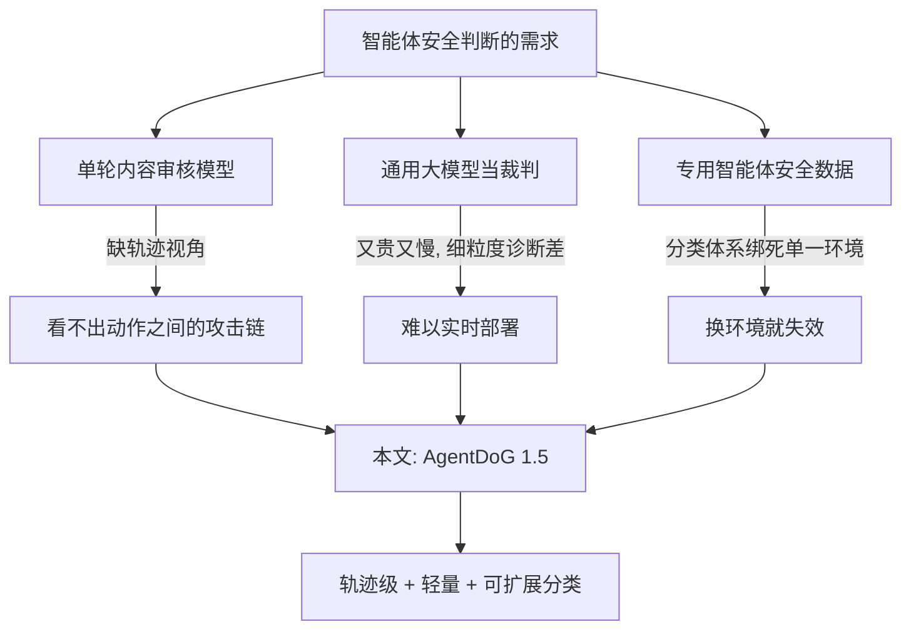
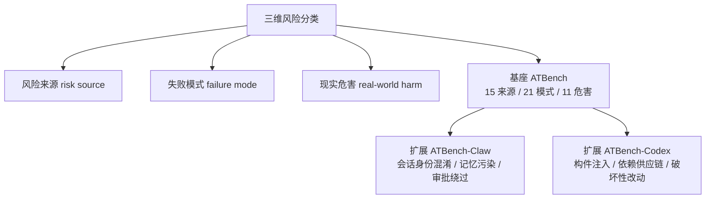
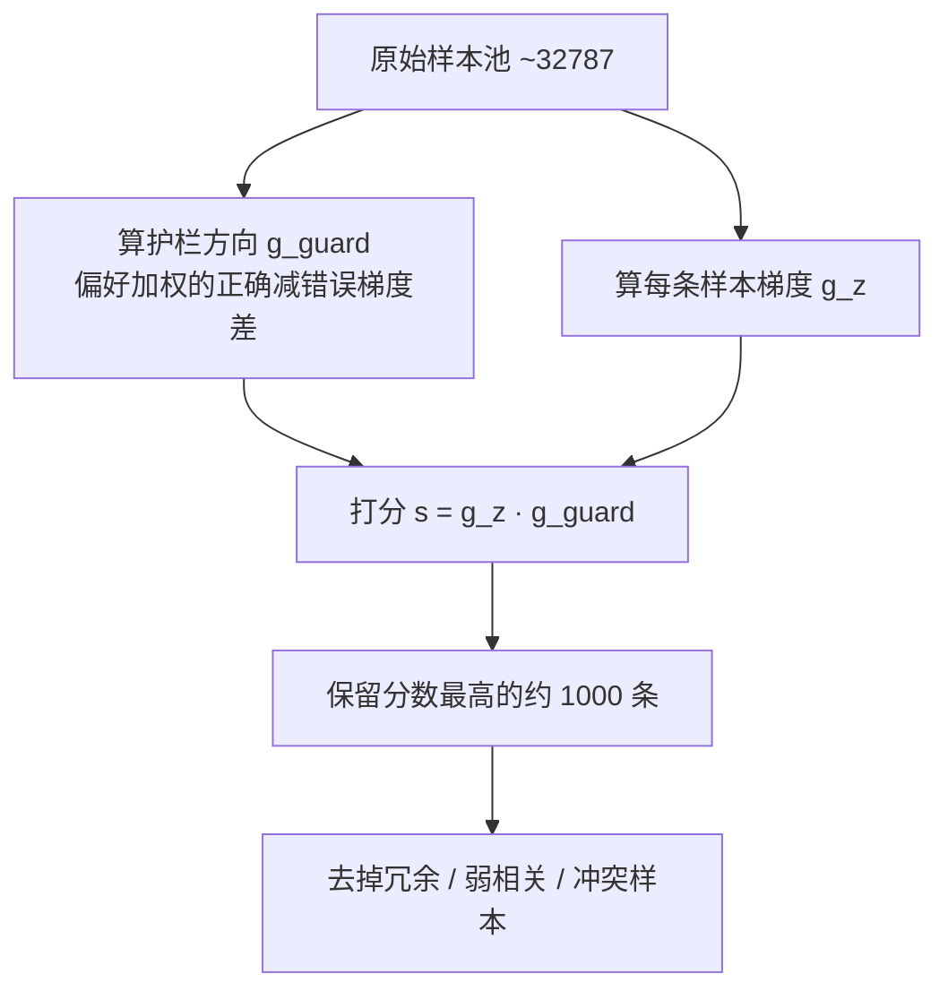

# AgentDoG 1.5：一套轻量、可扩展的 AI 智能体安全对齐框架

> **原题**：A Lightweight and Scalable Alignment Framework for AI Agent Safety and Security
> **作者**：共 8 位作者（论文页面未完整列出署名）
> **机构**：未在论文页面列出
> **年份**：2026（arxiv ID 2605.29801）
> **分类**：cs.AI / cs.CR（智能体安全与安全防护方向）
> **链接**：https://arxiv.org/abs/2605.29801
> **精读日期**：2026-05-29

---

## 阅读须知

### 这篇在领域里的位置

要理解这篇论文，先要厘清「智能体安全」这个子领域是从哪里长出来的。所谓智能体（agent），指的是一类能够自己调用工具、读写文件、执行命令、与外部环境多轮交互的语言模型系统。它和传统的「一问一答」式聊天模型最大的区别在于，它会真的去做事：发邮件、改代码、跑脚本、调 API。一旦模型不再只是输出文字，而是开始在真实世界里产生动作，安全问题的性质就变了。过去针对聊天模型的安全研究，主要关心的是「模型会不会说出有害内容」；而针对智能体，关心的则是「模型会不会做出有害的动作序列」。

这一子领域过去两三年的主流做法，大致可以分成两条路线。第一条是把已有的内容审核模型直接搬过来用，例如 LlamaGuard 这一类「护栏模型」，它们原本是为单轮对话的有害内容分类设计的。第二条是为智能体专门构造安全基准与训练数据，让模型学会在一长串工具调用里识别出哪一步越界了。这篇论文属于第二条路线里比较新的一支：它不满足于「判断单条消息安不安全」，而是要在完整的执行轨迹（trajectory，即从用户提出任务到智能体一步步调用工具、接收环境反馈、最终给出回复的全过程）层面上做判断，并且要把这件事做得足够轻、足够便宜，便宜到可以实时挂在每一个智能体的输出之前当守门员。

### 读完能回答什么

读完这份笔记，应当能够回答下面这几个问题。第一，为什么把内容审核模型直接搬到智能体场景上会失效，缺的究竟是什么。第二，这篇论文所说的「三维风险分类」具体指哪三个维度，它如何把一个抽象的「不安全」拆成可标注、可训练的标签。第三，什么是「影响函数提纯」，它凭什么能从三万多条原始样本里只挑出约一千条来训练，还不掉性能。第四，一个 4B 参数的小模型，是怎么在轨迹级安全判断上追平甚至超过 GPT-5.4 这类闭源大模型的。第五，这套方法最脆弱、最值得怀疑的地方在哪里。

### 阅读前置

这份笔记假定读者熟悉大语言模型的基本训练范式，知道什么是监督微调（SFT）和强化学习（RL）的大致区别，也大致接触过「工具调用」这种交互形式。但不预设读者专门做过智能体安全，也不预设读者了解影响函数（influence function）这种数据选择技术。凡是涉及这些的地方，都会先用一两句话讲清楚它要解决什么问题，再展开它的定义。

### 首次出现的缩写表

- **SFT**（Supervised Fine-Tuning，监督微调）：用「输入加标准答案」的成对数据，让模型学着把答案逐字复现出来。
- **RL**（Reinforcement Learning，强化学习）：不给标准答案，只给一个分数（奖励），让模型自己摸索出能拿高分的输出方式。
- **GRPO**（Group Relative Policy Optimization，组相对策略优化）：一种近年常用的 RL 算法，它对同一个问题采样一组回答，用组内相对好坏来代替单独的价值网络。
- **PPO**（Proximal Policy Optimization，近端策略优化）：更早的一种主流 RL 算法，靠裁剪策略更新幅度来保持训练稳定。
- **GDPO**（Group Reward-Decoupled Normalization Policy Optimization，组奖励解耦归一化策略优化）：本文提出的 RL 变体，核心改动是把多个维度的奖励分开归一化，而不是先加成一个标量。
- **CoT**（Chain-of-Thought，思维链）：让模型在给出最终结论之前，先写出一步步的推理过程。
- **MCP**（Model Context Protocol，模型上下文协议）：一种让智能体接入外部工具与数据源的标准化协议，本文把它当作智能体的一大风险入口。
- **F1**：精确率与召回率的调和平均，衡量分类器在「不漏判」和「不误判」之间是否平衡。
- **KL 散度**（Kullback-Leibler divergence）：衡量两个概率分布差异的量，RL 里常用它约束新策略不要偏离旧策略太远。

---

智能体安全这个问题如果不解决，会以一种相当具体的方式伤到人。设想一个能在你的电脑上自由执行的开放式智能体，它可以读你的文件、跑命令行、装依赖、对外发请求。只要它在某一步被诱导着越了界，比如把一份敏感文件发到了不该发的地方，或者执行了一条会破坏工作区的命令，损失就是真实而不可逆的。论文一开始就点出，像 OpenClaw 这样的开放世界智能体，固然带来了跨环境执行的强大能力，却也同时打开了一大批全新的安全风险来源；与此同时，前沿模型的能力越强，发起攻击的门槛反而越低，因为攻击者也可以借助强模型来设计更隐蔽的诱导。两股力量叠加的结果是，现有的智能体对齐框架在真实部署面前显得力不从心。

过去这个方向上的努力，大体停在两个地方动弹不得。一个地方是数据：要训练一个能识别危险动作序列的模型，需要大量标注好的「安全/不安全轨迹」，而这种数据极难采集，真实世界里危险操作本就稀少，靠人去构造又昂贵又覆盖不全。另一个地方是成本：哪怕训练出了一个能判断的模型，如果它本身又大又慢，那它就没法实时地挂在每一次智能体输出之前做检查，护栏一旦拖慢了主流程，就失去了部署价值。这篇论文之所以值得读，正是因为它同时朝这两处卡点下手：用一套数据引擎解决「数据从哪来」，用一套数据提纯和小模型训练方案解决「怎么做得又准又便宜」。

---

## 一、问题

把上面那段动机落到一个清晰、可验证的技术陈述上，这篇论文要解决的问题是：如何用尽可能少的训练数据和尽可能小的模型，训练出一个能在完整执行轨迹层面判断「这一连串智能体动作到底安不安全」的护栏，并且这个护栏要能跟上智能体不断扩张的执行环境（从普通工具调用，到代码仓库执行，到带持久记忆的开放式会话）。

前人路线在这里的不足是分层次的。第一类是把单轮内容审核模型直接拿来用。这类模型，例如各种 Guard 系列，擅长的是看一段文字判断它有没有毒。但智能体的危险往往不藏在某一句话里，而藏在动作之间的关系里：单看每一步都合理，连起来却构成了一次越权或一条攻击链。换句话说，单轮审核缺的是「轨迹视角」。

第二类是直接拿通用大模型当裁判，让 GPT-5.4 或 Gemini 这样的强模型去读轨迹、判安全。这条路的问题不在判得准不准，而在两点：其一是贵且慢，把一个前沿大模型挂在每次输出前实时跑，部署开销难以承受；其二，论文后面的实验会显示，这些通用大模型在「细粒度诊断」上其实相当差，它们能含糊地说「这条不安全」，却说不清楚到底是哪一类风险源、哪一种失败模式、会造成哪一类现实危害。

第三类是为智能体专门构造安全数据和基准。这条路方向对，但卡在前面说的数据采集难题上，而且大多数工作的风险分类是为某一类固定环境设计的，一旦智能体的执行场景换了一种形态（比如从工具调用换成代码仓库操作），原来的分类体系就接不上了，缺的是「可扩展性」。

这篇论文的定位，就是同时补齐这三处缺口：要轨迹视角，要轻量便宜，还要分类体系能随环境扩展。下面这张图把三条前人路线和本文的位置摆在一起。

---

## 二、方法

整套方法可以拆成四块依次相扣的环节：先把「什么算不安全」用一套可扩展的分类体系定义清楚，再用一台数据引擎按这套分类批量造出训练轨迹，接着用影响函数把海量原始数据提纯成一小撮最有价值的样本，最后用两阶段训练把这撮样本喂给小模型，部署时再把训练好的小模型当成一个无需再训练的在线护栏挂上去。

### 把「不安全」拆成三个维度

方法的地基是一套风险分类体系。它的核心思路是把一条轨迹层面的风险，沿三个维度分解开来：风险来源（risk source，即危险是从哪里进来的，比如来自被污染的工具返回值）、失败模式（failure mode，即智能体在哪一步以何种方式出了错，比如绕过了本该有的人工审批）、现实危害（real-world harm，即最终落地成什么样的损害，比如数据泄露或合规问题）。把一个笼统的「不安全」拆成这样三元组，好处是它从一个模糊的形容词，变成了可标注、可统计、可分别训练的结构化标签。

这套体系的基座叫 ATBench，覆盖一般工具调用智能体，定义了 15 种风险来源、21 种失败模式、11 类现实危害，建立在一千条经过人工审计的轨迹之上。关键设计在于它不为每一种新环境都另起炉灶，而是通过「环境特有的叶子类别扩展」加上「继承类别的细化」来生长。具体地，针对 OpenClaw 这种带持久会话的开放式智能体，它扩展出 ATBench-Claw，新增的风险来源包括发送方与会话身份的混淆、持久记忆或会话状态被污染、技能或插件的供应链被攻陷；新增的失败模式包括审批绕过、动作范围越权、跨工具的攻击串联、跨通道的错误投递、无人值守下的不安全自动化；并且新增了一整类现实危害，即合规、法律与可审计性方面的隐患。针对代码执行场景，它又扩展出 ATBench-Codex，新增了仓库构件注入、依赖或 MCP 供应链攻陷、破坏性的工作区改动、不安全的脚本与命令执行等类别。

### 一台按分类驱动的数据引擎

有了分类体系，下一步要解决数据从哪来。论文设计了一条三阶段的数据合成流水线。第一阶段是规划：对每一条要造的轨迹，先从三维分类里各抽一个类别，凑成一个「风险配置三元组」，再让一个规划模型据此产出轨迹草图，定义用户任务、可用工具、步骤序列，以及风险注入点放在哪一步。第二阶段是轨迹合成：把上一步那张结构化草图实例化成一条完整的多轮交互记录，里面包含用户消息、智能体回应、工具调用与环境反馈。同一个场景可以被实例化成两个版本，一个是安全的（智能体识别出了风险并妥善处理），一个是不安全的（智能体没识别出来，掉进了陷阱）。第三阶段是自动校验：用双层质检，规则检查器负责核对工具调用的格式、模式、类型约束、取值约束和引用完整性，模型检查器则评估合理性、步骤之间的连贯性、目标一致性和事实可信度。这条流水线最终覆盖了 5973 个互不相同的工具与 MCP 服务。

在合成之上，论文还做了一层思维链增强：对每一条训练样本，让 GPT-5.4 这个教师模型按一套精心设计的模板，生成一段详细的、一步步的推理过程，把轨迹里的证据和最终的安全判定显式地连起来。于是每条样本不只有「安全还是不安全」这个结论，还附带一段解释为什么。

### 用影响函数把数据提纯到约一千条

到这一步会有一个新问题：合成出来的原始样本池高达三万多条，全拿去训练既慢又未必好，因为里面混着大量冗余的、弱相关的、甚至自相矛盾的样本。论文在这里引入了影响函数提纯。影响函数本是一种估计「某一条训练样本对模型最终行为有多大影响」的技术，这篇论文把它改造成了一个「偏好感知」的版本，专门用来挑出那些最能把模型往「正确护栏行为」方向推的样本。

它的计算分几步。先为每个目标问答对定义两种目标回应：y⁺ 表示正确识别出风险的回应，y⁻ 表示漏判或误判的回应。第一步是长度归一化似然，对任意问答对 (q, y)，计算 p̄θ(y|q) = pθ(y|q) 的 1/|y| 次方，目的是消除回答长短带来的偏差。第二步是目标回应梯度，记作 ḡ(q,y)，它是模型在参考检查点上对「逐词平均交叉熵损失」求出的梯度，刻画的是「要让模型更倾向于产出这个回应，参数该往哪个方向动」。第三步是模型偏好 π̂q，定义为正确回应的归一化似然除以正确与错误两者似然之和，它衡量模型当下已经有多偏向正确答案;π̂q 越大，说明这条护栏行为离模型现有能力越近、越好学，于是给它更高的权重。第四步把这些偏好加权的「正确减错误」梯度差聚合起来，得到一个护栏方向 ĝguard，它是参数空间里一个单一的向量，代表「理想的行为应该往哪个方向偏移」。第五步对每一条候选样本 z 算出它自己的 SFT 梯度 ĝz，最终打分 sπ(z) = ĝz 与 ĝguard 的内积。这个分数的含义很直白：分数越高，说明拿这条样本去训练，越能把模型往理想的护栏行为上推。最后只保留打分最高的约一千条，把冗余、弱相关、可能冲突的样本统统剔掉。

### 两阶段训练与在线部署

拿到这约一千条提纯样本后，论文从 Qwen3.5（0.8B、2B、4B）和 Llama-3.1-8B-Instruct 这几个基座模型出发，微调出四个尺寸的 AgentDoG 1.5 变体。训练分两个阶段。第一阶段是监督微调，优化目标是标准的自回归交叉熵，让模型在给定输入后逐词最大化目标回应的条件似然，学习率取 1e-5，训练数据用的是带思维链的那一版。这一阶段的产出，是既能给出二元安全判定、又能给出结构化推理的模型。

第二阶段是强化学习，这里论文没有直接用常规的 GRPO，而是提出了 GDPO。要理解它解决了什么，先要看到一个细节：智能体安全的细粒度判断里，存在大量「部分正确」的情况,一条采样回答可能在「失败模式」这个维度上判对了，却在「现实危害」维度上判错了。如果像常规做法那样把多个维度的奖励先加成一个标量再优化，这种部分正确就被一个笼统的分数糊掉了，模型学不到「哪一维对、哪一维错」的细节。GDPO 的核心改动，就是把多维奖励分开归一化，让失败模式、现实危害、风险来源各自的奖励信号都保留下来，三个维度的权重设为 0.3、0.4、0.3，KL 正则系数 β 取 0.001，每个问题采样 G=8 条回答，学习率 1e-6。

训练完成后，部署阶段不再需要任何进一步的模型更新，AgentDoG 1.5 被当作一个「无需训练的在线护栏」整体挂进智能体的执行流程里。它的职责是在 OpenClaw 这类智能体把最终回复交付给用户之前，先审一遍完整的执行轨迹,推理时模型会被提示去思考智能体的证据基础、意图、具体后果与安全影响，然后输出一个二元判定，以及在判为不安全时给出风险来源、失败模式、现实危害这三项的细粒度诊断。因为变体最小可到 0.8B，这种检查能做到低成本、低延迟。

---

## 三、实验

评测建立在一组基准之上。核心评测套件包括前面提到的 ATBench（一千条轨迹，503 安全、497 不安全，涉及 2084 个工具，平均每条 9.01 轮）、ATBench-Claw（五百条，侧重会话与审批）、ATBench-Codex（五百条，侧重代码仓库与可执行构件），以及一个外部的二元安全分类基准 R-Judge。除此之外，论文还在一批外部安全基准上验证泛化，包括衡量有益分数、有害分数与拒答率的 AgentHarm，衡量安全率的 AgentSafetyBench，衡量对抗鲁棒性的 AgentSecurityBench，衡量抗提示注入能力的 AgentDojo 与 AgentDyn，以及衡量通用函数调用能力的 Berkeley Function Calling Leaderboard（BFCL）。

对照的基线分三档。闭源模型包括 GPT-5.4、GPT-5.2、Gemini-3-Flash、Gemini-3.1-Pro;开源通用模型包括 Qwen3.5 系列（0.8B、2B、4B 直到 397B-A17B）、Llama-3.1-8B-Instruct、QwQ-32B;专门的护栏模型包括 LlamaGuard3-8B、LlamaGuard4-12B、Qwen3-Guard、ShieldAgent、JoySafety、NemoGuard。

轨迹级安全判断的主结果如下表。可以看到，4B 这个尺寸的 AgentDoG 1.5 在 R-Judge 上达到 92.2% 准确率、92.7% 的 F1，在 ATBench 上达到 72.4% 准确率、74.3% 的 F1;而一个统一变体（4B-U）在 ATBench 上进一步到 78.4% 准确率、77.7% 的 F1，反超了 GPT-5.4 的 73.7% 与 76.7%。

| 模型 | R-Judge 准确率 | R-Judge F1 | ATBench 准确率 | ATBench F1 |
|------|------|------|------|------|
| AgentDoG 1.5-0.8B | 75.7% | 74.6% | 60.3% | 63.2% |
| AgentDoG 1.5-2B | 71.5% | 70.4% | 69.0% | 67.8% |
| AgentDoG 1.5-4B | 92.2% | 92.7% | 72.4% | 74.3% |
| AgentDoG 1.5-8B | 75.5% | 81.0% | 70.9% | 73.5% |
| AgentDoG 1.5-4B-U（统一） | 90.4% | 90.6% | 78.4% | 77.7% |
| GPT-5.4（闭源） | 不适用 | 不适用 | 73.7% | 76.7% |
| Gemini-3.1-Pro（闭源） | 97.3% | 97.4% | 75.5% | 75.0% |

跨环境的泛化同样成立:4B 变体在 ATBench-Codex 上达到 80.0% 准确率，在 ATBench-Claw 上达到 84.0%。这说明那套可扩展的分类加上环境自适应训练，确实让模型迁移到新执行形态时没有崩掉。

最反直觉、也最值得拎出来单独说的，是细粒度诊断的结果。这里要回答的不是「安不安全」，而是「具体属于哪一类风险源、哪一种失败模式、哪一类现实危害」。4B 变体在风险来源上达到 75.2%，在现实危害上达到 62.9%，三项平均 55.2%。而同样的任务上，GPT-5.4 三项平均只有 25.8%，Gemini-3.1-Pro 更只有 18.6%。一个 4B 的小模型，在「说清楚为什么不安全」这件事上，把前沿闭源大模型甩开了一倍以上。这反过来印证了论文的判断:通用大模型能模糊地嗅出危险，却缺乏对智能体风险结构的精细理解，而这种理解恰恰要靠针对性的数据和分类体系才能教会。不过需要注意，三项里失败模式那一项只有 27.5%，明显拖了平均的后腿，这一点放到局限里再谈。

数据提纯到底有没有用，论文用一组下游安全微调的对照给出了证据。它对比的是「用 AgentDoG 1.5 提纯过的数据」与几种基线训练条件，在有害分数、拒答率、通用函数调用准确率三项上的表现。

| 训练条件 | AgentHarm 有害分数 | 拒答率 | BFCL 准确率 |
|------|------|------|------|
| 基座 Qwen3.5-4B | 57.49% | 28.41% | 76.04% |
| 仅加效用数据 | 45.61% | 27.84% | 83.21% |
| 加未过滤的安全数据 | 31.91% | 62.50% | 78.69% |
| 加 AgentDoG 1.5 提纯数据 | 20.32% | 75.00% | 81.12% |

读这张表的关键，是把「加未过滤的安全数据」和「加提纯数据」两行对着看:提纯把有害分数又压低了 11.59 个百分点（从 31.91 到 20.32），同时把拒答率抬高了 12.50 个百分点（从 62.50 到 75.00），而通用函数调用能力（BFCL）反而比未过滤时更高。也就是说，提纯不是简单地少喂数据，而是真的挑出了更有信息量的样本，让模型在更安全的同时没有牺牲办正事的能力。至于强化学习阶段的消融，论文比较了「只做 SFT」「只做 RL」「SFT 加 RL 联合」三种条件在六个基准十二项指标上的差异，但这部分以雷达图（论文图 11）的形式呈现，没有给出可直接引用的表格数字。

---

## 四、局限

先看论文自己承认的部分。最显眼的一条是对教师模型的依赖:整套数据的思维链推理都是用 GPT-5.4 这个闭源前沿模型生成的。这带来两重隐患，一是可复现性，别人要复刻这套数据，就得能拿到同一个闭源模型，而闭源模型的可得性与版本稳定性都不在作者掌控之内;二是能力上限可能被教师模型悄悄设了天花板，学生模型再怎么提纯，学到的推理质量也以教师为参照。第二条是统一变体（4B-U）的调优不足，论文明说由于资源限制，没有专门为细粒度诊断仔细调过这个统一模型，等于承认了优化上还有缺口。第三条是合成环境与真实的差距，论文在方法部分就坦白，为了换取部署的实用性和计算效率，它通过隔离任务相关资源、采用有限状态接口和基于规则的效用奖励，主动牺牲了严格的真实世界保真度。

再看论文没有明说、但读完能看出来的问题。最突出的是细粒度诊断里失败模式那一项只有 27.5%，远低于风险来源的 75.2% 和现实危害的 62.9%。这个落差不能用「模型不够大」一句话带过，更可能的原因是失败模式这个维度本身的类别划分过细、边界模糊，或者合成数据在这个维度上的标注质量不够，导致模型学不清楚。换句话说，三维分类里有一维明显没立住，而这一维恰恰是「智能体在哪一步、以何种方式出错」这种对事后排查最有用的信息。

其次是语言覆盖。论文所有的基准和样本看起来都是纯英文，没有任何关于多语言智能体安全或非英文执行环境的讨论。考虑到真实部署里智能体常常要处理多语言的用户输入和工具返回，这个边界值得使用者心里有数。最后是评测的口径问题，模型虽然声明开源，但部分基线的详细超参数并未给全，再叠加对闭源教师模型的依赖，整体的完全可复现性是打了折扣的。这一段不是要否定工作的价值，而是把它的适用边界讲清楚:在英文、工具调用为主、可接受合成环境近似的场景里，这套方法的性价比相当突出;一旦离开这些前提，效果需要重新验证。

---

## 一句话

用一台按风险分类驱动的数据引擎加影响函数提纯，只拿约一千条样本就把 4B 小模型训成了能在轨迹层面实时判安全、细粒度诊断还反超 GPT-5.4 的轻量智能体护栏。
