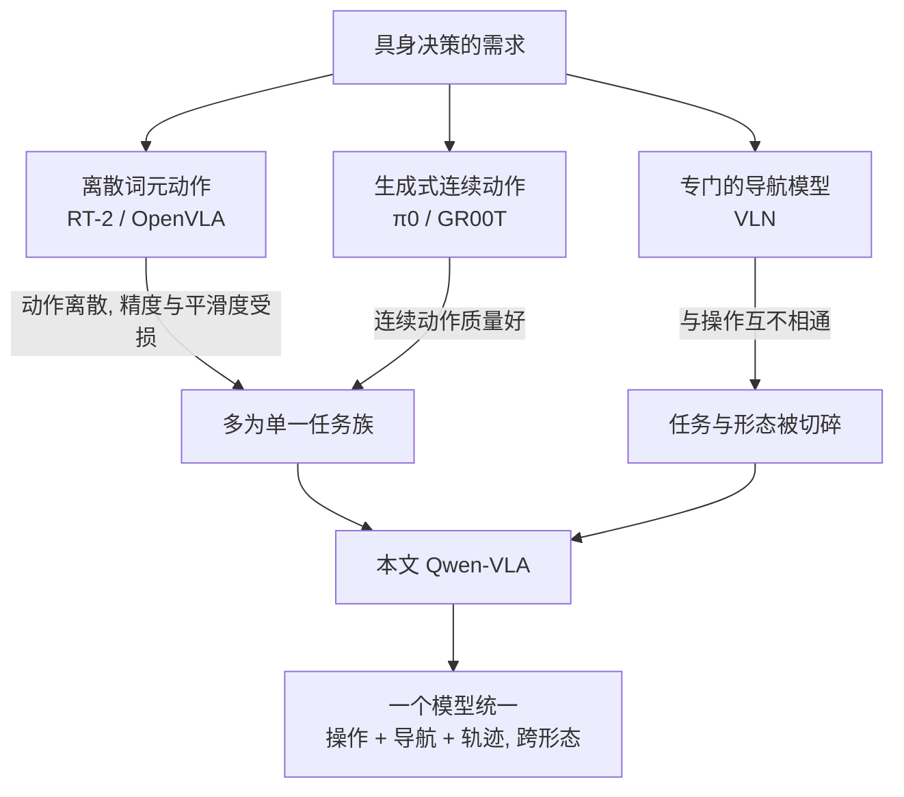
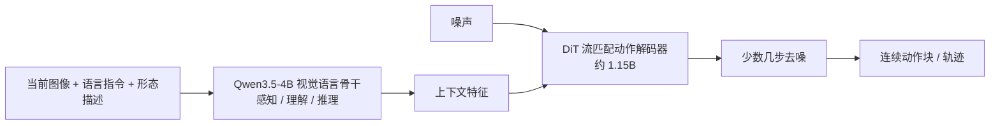
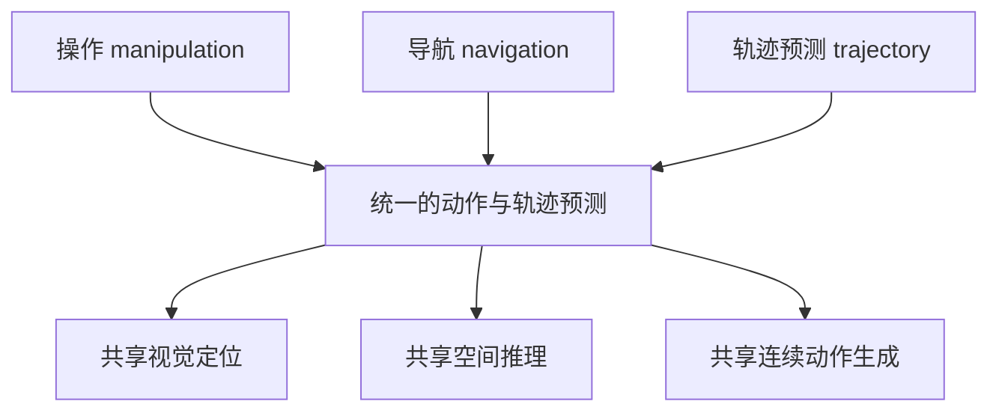

# Qwen-VLA：用一个视觉-语言-动作模型统一跨任务、跨环境、跨形态的具身决策

> **原题**：Qwen-VLA: Unifying Vision-Language-Action Modeling across Tasks, Environments, and Robot Embodiments
> **作者**：Qiuyue Wang、Mingsheng Li、Jian Guan 等共约四十位，含 Junyang Lin、Dayiheng Liu、Shuai Bai、Jingren Zhou 等 Qwen 团队成员
> **机构**：阿里巴巴 Qwen 团队（论文页面未完整列出；开源仓库为 QwenLM/Qwen-VLA）
> **年份**：2026（arxiv ID 2605.30280）
> **分类**：cs.RO / cs.CV / cs.LG（具身智能 / 机器人）
> **链接**：https://arxiv.org/abs/2605.30280
> **精读日期**：2026-05-30

---

## 阅读须知

### 这篇在领域里的位置

要把这篇论文放进脉络，先要交代「具身智能」这几年是怎么走的。所谓具身智能，指的是让一个模型不只是看懂图、读懂话，而是能据此控制一个有身体的机器人去操作物体、在空间里移动。过去的主流做法，是为每一类任务单独训一个专门模型：抓取和摆放归一类，导航和走路归另一类，彼此之间几乎不共享能力。这样做的代价是能力被切得很碎，换一个任务、换一个场景、甚至换一台构造不同的机器人，原来的模型就基本失效。

近两年出现了一条新路线，叫视觉-语言-动作模型（VLA，Vision-Language-Action）。它的想法是把已经相当成熟的视觉语言模型（VLM，即能看图说话、做推理的那一类大模型）当作底座，在它后面接上一个能输出连续动作的模块，于是模型从「理解世界」一路延伸到「对世界采取动作」。这条路线里已经有了一批代表作，例如把动作离散成词元再自回归预测的 RT-2 与 OpenVLA，以及用扩散或流匹配方式生成连续动作的 π0 与 GR00T。但它们大多仍然只覆盖某一类任务族，通常是桌面操作，并且和某一种特定的机器人形态绑定，换形态、换任务族就难以迁移。

Qwen-VLA 这篇论文位于这条路线往「统一」方向迈进的一步。它要回答的不是「能不能让机器人完成某个任务」，而是「能不能用同一个模型，同时把操作、导航、轨迹预测这些异构的具身决策问题，跨任务、跨环境、跨机器人形态地装进一个模型里」。它出自 Qwen 团队，把自家的视觉语言模型栈直接延伸到了动作生成。

### 读完能回答什么

读完这份笔记，应当能够回答下面几个问题。第一，VLA 这条路线到底在解决传统具身模型的什么毛病。第二，Qwen-VLA 是怎么把一个原本只会「看和说」的视觉语言模型，改造成能输出连续动作的模型，那个所谓的 DiT 动作解码器是什么、流匹配又是什么。第三，操作、导航、轨迹预测这三类看起来很不一样的任务，是怎么被塞进同一个预测框架里的。第四，一个模型要同时伺候多台构造不同的机器人，靠的是什么机制。第五，它在哪些基准上验证、数字大概到什么水平，以及它最没把握的地方在哪里。

### 阅读前置

这份笔记假定读者了解视觉语言模型的基本概念，知道扩散模型大致是「从噪声里一步步还原出目标」这么一回事，也大致听过机器人模仿学习。但不预设读者做过机器人控制，也不预设熟悉流匹配或具身导航的术语。凡涉及这些，都会先用一两句话铺垫它要解决什么，再展开。

需要诚实说明一点：这篇论文发表极新，精读当日 arxiv 的网页正文与 ar5iv 镜像都尚未渲染出来，因此本篇主要依据论文摘要、Hugging Face 论文页，以及已公开报告的基准数字来组织，方法的宏观结构可靠，但个别实现细节（去噪步数、动作块长度、逐基准的基线对照与消融数字）暂时无法逐一引用，待正文上线后可补读。

### 首次出现的缩写表

- **VLA**（Vision-Language-Action，视觉-语言-动作模型）：在视觉语言模型之上接出动作输出，让模型从理解延伸到行动的一类模型。
- **VLM**（Vision-Language Model，视觉语言模型）：能同时处理图像与文本、做理解与推理的大模型，这里指 Qwen 自家的视觉语言栈。
- **DiT**（Diffusion Transformer，扩散变换器）：用 Transformer 结构来做扩散式生成的网络，这里被用作动作解码器的主体。
- **流匹配**（flow matching）：一种生成式建模方法，学习一个把噪声沿近乎直线的路径搬运到目标数据的速度场，推理时只需积分少数几步即可还原。
- **动作块**（action chunk）：一次性预测未来若干步的连续动作，而不是一步一预测，能让动作更连贯。
- **VLN**（Vision-and-Language Navigation，视觉语言导航）：让智能体按自然语言指令在环境里寻路抵达目标的任务。
- **OOD**（Out-of-Distribution，分布外）：测试时遇到的场景与训练分布不同，用来检验泛化。
- **SR / OSR**（Success Rate / Oracle Success Rate，成功率 / 先知成功率）：导航里的两种评估口径，后者放宽到「路径上是否曾足够接近目标」。

---

具身智能这个问题如果一直用「一个任务一个模型」的方式做下去，瓶颈是明摆着的。能力被切碎之后，每换一个任务、一个场景、一台机器人，都得重新采数据、重新训练，成本高且没有积累；更要紧的是，分散的模型之间无法共享在大规模数据上学到的视觉理解与空间推理，泛化能力天花板很低。归根结底，机器人领域一直缺一个像语言领域的大模型那样、能一专多能并且越用越强的基座。

之所以现在有机会去做这件统一的事，是因为三股条件同时成熟了。其一，视觉语言模型本身已经足够强，像 Qwen 这样的栈具备了相当好的感知、理解与推理能力，足以当作具身模型的大脑。其二，连续动作的生成方式找到了出路，扩散与流匹配这类生成方法让模型可以平滑地输出高维连续动作，而不必像早期那样把动作粗暴地离散成词元。其三，可用的机器人与人类示范数据积累到了一定规模，足以支撑一次大规模的联合预训练。旧路线卡在「一个模型只能干一类活、绑一种机器人」，而这三股条件凑齐之后，把它们打通成一个统一基座就成了顺理成章却仍然很难的一步。

---

## 一、问题

把动机落到一个明确的技术陈述上，Qwen-VLA 要解决的问题是：能否用同一个视觉-语言-动作模型，统一地处理操作、导航、轨迹预测这些异构的具身决策任务，并且让这种统一在不同的场景与不同构造的机器人之间都能迁移。

前人路线的不足，可以沿两条线看。第一条线是动作的表示方式。早期的 RT-2、OpenVLA 把机器人动作离散成一串词元，再像生成文字一样自回归地预测出来。这样做的好处是能直接复用语言模型的生成机制，但坏处是动作本是连续量，硬切成词元会损失精度与平滑度。于是后来的 π0、GR00T 改用扩散或流匹配的生成方式，直接产出连续动作，动作质量上去了。然而无论哪一种，大多仍然聚焦在桌面操作这一类任务上。

第二条线是任务与形态的覆盖。导航长期由专门的视觉语言导航模型来做，和操作模型互不相通；而操作模型又往往和某一种机器人本体绑定，换一种机械臂或换一种底盘就要重训。换句话说，过去的工作在「动作表示」上有进展，却在「跨任务、跨形态地统一」这件事上始终是碎的。Qwen-VLA 的立意，就是把操作、导航、轨迹预测放进同一个框架，并让同一个模型能服务多种机器人。下面这张图把前人路线与本文的位置摆在一起。

---

## 二、方法

整套方法可以拆成四块：一个负责理解的视觉语言底座，一个负责生成连续动作的解码器，一套让单一模型适配多种机器人的条件化机制，再加上一锅把各种异构数据混在一起的大规模联合预训练。

### 一个底座加一个动作解码器

模型的大脑沿用 Qwen3.5-4B 这一视觉语言骨干，承担感知、理解与推理：它读入机器人当前看到的图像与一条自然语言指令，在内部把「现在是什么场景、要做什么」想清楚。真正把这种理解变成动作的，是接在骨干之后的一个约 11.5 亿参数的 DiT 动作解码器。

这里需要先铺垫两个概念。其一是 DiT，即扩散变换器，它本质上是一个用 Transformer 结构来执行扩散式生成的网络。其二是流匹配，这是一种比传统扩散更利落的生成方法：传统扩散往往要几十步才能把噪声一点点还原成目标，而流匹配学习的是一个把噪声沿近乎直线的路径搬向目标的速度场，推理时只需积分很少的几步就能得到结果。Qwen-VLA 的动作解码器正是用流匹配来训练的：它以视觉语言骨干输出的上下文为条件，从噪声出发，少数几步之内生成出一段连续的动作块，也就是未来若干步的动作，而不是一步一预测。这样产出的动作既连续又连贯。

### 把三类任务装进一个框架

Qwen-VLA 的关键一步，是把操作、导航、轨迹预测这三类表面上很不一样的任务，统一成同一种「动作与轨迹预测」的形式。操作要预测的是机械臂末端的连续动作，导航要预测的是在空间里前进的路径点，轨迹预测则直接给出一条未来轨迹。把它们都表述成「在给定视觉与语言条件下，预测一段动作或轨迹」之后，模型在三类任务之间就能共享同一套视觉定位、空间推理与连续动作生成的能力。这种共享正是统一框架的价值所在：在操作数据上学到的空间感，可以迁移去帮助导航，反之亦然。

### 让一个模型适配多种机器人

要用同一个模型伺候多台构造不同的机器人，难点在于不同机器人的关节、自由度、控制约定都不一样。Qwen-VLA 的办法叫「形态感知的提示条件化」：把每一台机器人的具体描述，用一段文字写清楚当前是什么本体、采用什么控制约定，作为提示的一部分喂给模型。于是模型在生成动作之前，先从这段文字里知道自己此刻正在驱动哪一种身体，再据此产出与该本体匹配的动作。这样一来，增加一种新机器人，原则上只需要给出它的文字描述，而不必为它单开一个模型。

### 一锅大规模联合预训练

最后，上面这套结构是在一锅相当杂的数据上联合预训练出来的。数据来源包括真实机器人的操作轨迹、人类第一人称视角的示范、合成仿真数据、视觉语言导航数据、以轨迹为中心的监督，以及辅助性的视觉语言数据。把这些异构来源混在一起联合训练，目的是让模型既保留视觉语言层面的通用理解，又在多种任务与形态上学到可迁移的动作能力。

---

## 三、实验

论文在操作、导航、以及以轨迹为中心的多个基准上做了验证，覆盖仿真与真实机器人两端。下面把已公开的主要数字汇总成一张表，其中 Qwen-VLA-Instruct 是面向指令跟随的版本。

| 任务类别 | 基准 | 指标与数值 |
|------|------|------|
| 操作（仿真） | LIBERO | 97.9% |
| 操作（仿真） | Simpler-WidowX | 73.7% |
| 操作（仿真） | RoboTwin 易 / 难 | 86.1% / 87.2% |
| 操作（真实，分布外） | 真实 ALOHA | 平均成功率 76.9% |
| 操作（动态，零样本） | DOMINO | 26.6% |
| 导航 | R2R | OSR 69.0% |
| 导航 | RxR | SR 59.6% |

读这张表，有几处值得拎出来说。其一，在 LIBERO 这一被广泛使用的操作基准上，成绩到了 97.9%，接近饱和，说明在标准操作任务上模型已相当扎实。其二，跨到真实机器人 ALOHA 的分布外测试时，平均成功率落到 76.9%，这说明从仿真迁到真实、并在场景布局、背景、光照、物体摆放与机器人本体都发生变化的条件下，泛化虽然成立但显著更难，留下了真实世界这一块的提升空间。其三，DOMINO 这种动态操作的零样本成绩只有 26.6%，把当前方法在「没见过的动态任务上从零迁移」的难度暴露得很清楚。

导航一侧，R2R 的先知成功率到 69.0%，RxR 的成功率为 59.6%。把这两个数字与操作侧动辄八九成的成绩对照，可以看出在这个统一模型里，导航这条线整体上比操作更吃力一些。但论文的主张并不在于在每一个单项上都刷到第一，而在于用同一个模型，在操作与导航两类原本互不相通的任务上同时拿到可用的成绩，并在场景、背景、光照、物体配置与机器人形态变化下都保持泛化。这正是「统一」这件事本身要证明的东西。至于与 OpenVLA、π0、GR00T 这些代表性 VLA 的逐项对照与消融实验，受正文尚未上线所限，本篇暂不逐一引用具体数字。

---

## 四、局限

需要先说明，由于精读当日无法访问论文正文，作者自己明确承认的局限无法逐条引用，下面主要是从已公开的数字与方法本身能看出来的潜在问题，待正文上线后应当回头核对作者的原话。

从数字上能直接读出几处边界。其一，真实世界的分布外操作平均成功率为 76.9%，与仿真里逼近饱和的成绩之间存在明显落差，意味着仿真到真实的迁移、以及对光照背景等变化的鲁棒性，仍是这套方法尚未完全攻克的部分。其二，DOMINO 动态操作的零样本成绩只有 26.6%，说明面对没见过的、带动态的任务，模型的从零迁移能力还相当有限。其三，导航的成功率整体低于操作，反映出在一个统一模型里，不同任务族之间的能力并不均衡，导航这一线被操作线压住了。

从方法本身也能看出一些值得留意的地方。其一，整套能力建立在一锅规模庞大且来源高度异构的数据之上，既包含真实轨迹也包含合成仿真，这对数据采集与配比的依赖很重，复现门槛不低。其二，让单一模型适配多种机器人，靠的是一段文字形式的本体描述，那么这段描述写得是否准确、是否覆盖了该本体的控制约定，就会直接影响动作质量，这是一种对提示工程的隐性依赖。其三，模型规模为视觉语言骨干约 40 亿参数叠加动作解码器约 11.5 亿参数，再加上大规模联合预训练，训练与部署的成本都不算轻。这些都不是要否定工作的价值，而是把它的适用边界讲清楚：在标准操作任务上它已经很强，统一多任务与多形态的方向也跑通了，但真实世界的鲁棒性、动态零样本迁移、以及任务间的能力均衡，仍是接下来要补的功课。

---

## 一句话

Qwen-VLA 把 Qwen 的视觉语言模型接上一个流匹配的 DiT 动作解码器，用一锅异构数据联合预训练，使同一个模型能跨任务、跨场景、跨机器人形态地统一完成操作、导航与轨迹预测。
