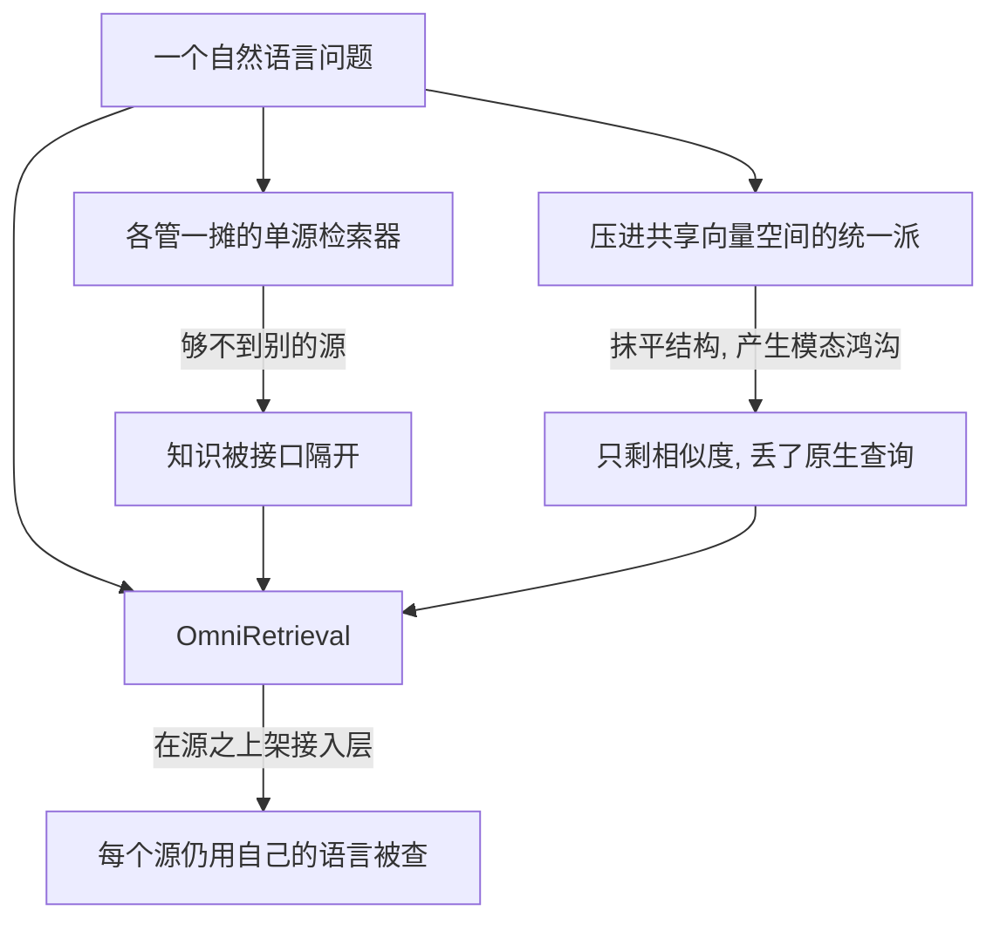
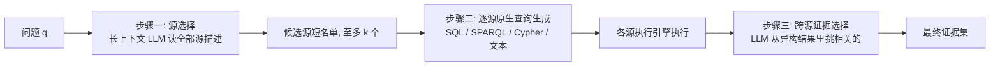

# OmniRetrieval：不把异构知识源揉成一团，而在它们之上架一层统一检索

> **原题**：OmniRetrieval: Unified Retrieval across Heterogeneous Knowledge Sources
> **作者**：Soyeong Jeong、Sangwoo Park、Woongyeong Yeo、Minki Kang、Patara Trirat、Heejun Lee、Jinheon Baek、Sung Ju Hwang
> **机构**：KAIST、DeepAuto.ai
> **年份**：2026（arxiv ID 2605.29250）
> **分类**：cs.IR / cs.CL（信息检索 / 自然语言处理）
> **链接**：https://arxiv.org/abs/2605.29250
> **精读日期**：2026-05-31

---

## 阅读须知

### 这篇在领域里的位置

要看懂这篇论文，先要明确「检索」这件事近些年是怎么和大模型绑在一起的。当一个大语言模型要回答一个事实性的问题时，它常常不能只靠脑子里记住的东西，而需要先去外部的知识库里把相关材料找回来，再据此作答，这套「先检索、再生成」的范式就是如今广为人知的检索增强生成（RAG，Retrieval-Augmented Generation）。检索这一环的质量，直接决定了模型答得准不准。

问题在于，真实世界的知识并不都长一个样、也不都放在一个地方。有的知识是非结构化的文本段落，有的是关系型数据库里的二维表，有的是知识图谱里的「主语-谓语-宾语」三元组，还有的是带标签的属性图。每一种形态都有自己的查询语言：查文本靠相似度匹配，查关系表用 SQL，查 RDF 知识图谱用 SPARQL，查属性图用 Cypher。过去几年的检索器，绝大多数都是为其中某一种源量身定做、各管一摊的。

这篇论文位于「如何统一地检索这些异构知识源」这个相对新的子方向上。它要回答的不是「怎么在某一种源里找得更准」，而是「面对一个自然语言问题，怎么自动判断该去哪些源、用各自的语言查，再把不同形态的结果汇成一份证据」。它出自 KAIST 与 DeepAuto.ai。

### 读完能回答什么

读完这份笔记，应当能够回答下面几个问题。第一，为什么把所有知识源「压进同一个向量空间」这种看似自然的统一办法，反而是有害的。第二，OmniRetrieval 用哪三个步骤来「在上层协调」而非「在底层抹平」这些源。第三，它为什么敢说「加一个新知识源只要登记一下」就行。第四，在一个横跨十三个数据集、三百多个知识库的基准上，它比那些只盯着单一源的方法强多少，强在哪一步。第五，这套方法目前最薄弱的环节是什么。

### 阅读前置

这份笔记假定读者了解大语言模型的基本用法，知道「向量检索」大致是把文本编码成向量再按相似度排序这么一回事，也大致听过 SQL。但不预设读者熟悉 SPARQL、Cypher、知识图谱，或检索领域的评测指标。凡涉及这些，都会先用一两句话讲清它是什么，再展开。

### 首次出现的缩写表

- **RAG**（Retrieval-Augmented Generation，检索增强生成）：先从外部知识库检索相关材料，再交给大模型据此作答的范式。
- **LLM**（Large Language Model，大语言模型）：这里既是被服务的对象，也是框架内部承担判断与生成的部件。
- **SQL**：查询关系型数据库的语言，擅长表与表之间的连接和集合运算。
- **SPARQL**：查询 RDF 知识图谱的语言，按三元组的模式去匹配。
- **Cypher**：查询带标签属性图的语言，擅长沿节点与关系做路径遍历。
- **RDF**（Resource Description Framework）：用「主语-谓语-宾语」三元组来表达知识的一种结构，Wikidata 就是其中最大的公开图谱。
- **NDCG@10**：文档检索常用的排序质量指标，衡量返回的前十条与标准答案的相关程度排得有多好。
- **HyDE**（Hypothetical Document Embeddings）：检索前先让模型把问题改写成一段「假想的答案段落」，再拿它去做向量匹配的技巧。

---

这个问题如果不解决，后果是一种「能力被接口隔开」的浪费。一个临床问题的答案也许就躺在某篇生物医学文献里，一个企业经营问题的答案也许要靠几张规范化表的连接才能算出来，一个事实性问题也许在百科知识图谱里只是几条三元组，而一个关于供应链或合作网络的问题也许要在属性图上做多跳遍历。这些答案原则上都「检索得到」，前提是你已经知道该查哪个库、该写哪种查询语言、该把它投给哪个执行引擎。换句话说，真正的难处不在「在某个源里找内容」，而在「跨越这些源之间结构上的不统一」。

过去这个方向上的努力卡在一个看似聪明、实则有害的捷径上。既然源各不相同，那就把它们统统投影到一个共享的表示里，比如都压成稠密向量、或者都拉平成一段文本，这样一个检索器就能在所有源上排序了。然而这样做的代价是把每种源赖以发挥威力的结构特性给抹平了：表的连接、图的遍历、图谱的组合算子，全都退化成了「在一个向量空间里比相似度」。论文指出，这会带来两个后果。其一，统一后的向量会按「源的类型」而不是「语义内容」聚到一起，于是检索偏向那些形态上像问题的源，而不是真正能回答问题的源，这就是所谓的模态鸿沟。其二，只剩相似度匹配这一种操作，各个源原生的查询能力全丢了。正因为这条捷径走不通，才需要一篇论文换个思路：不抹平，而是在这些源之上架一层统一的接入层。

---

## 一、问题

把动机落到一个明确的技术陈述上，OmniRetrieval 要解决的问题是：给定一个自然语言问题和一池各自独立维护、各有原生查询语言的知识源，如何自动地选出该用的若干个源、为每个源写出它原生语言里可执行的查询、再把这些形态各异的执行结果汇成一份与问题相关的证据，并且在这个过程中不损失任何一种源本来的结构表达力。

前人路线的不足分两类。第一类是「各管一摊」的单源检索器：文档检索器只在非结构化语料上按相似度排段落，text-to-SQL 系统只针对一个关系库、只吐一种 SQL，SPARQL 与 Cypher 的生成器也各自绑死在一种图后端上。结果是，哪怕后面接的大模型本身能综合多种来源的证据去推理，喂给它的检索层却够不到那么多源。第二类是前面说的「压进共享表示」的统一派，它确实换回了统一接口，却以抹平结构为代价，既产生模态鸿沟，又只剩相似度一种操作。

OmniRetrieval 的立意，是走和「同质化」相反的方向：让每个源都保留自己的样子，在它们上面再搭一层统一的接入层。下面这张图把两条旧路线与本文的位置摆在一起。

---

## 二、方法

整套方法建立在一个简洁的形式化之上，再拆成三个依次相扣的步骤。形式化是这样的：把每个知识源都看成一个三件套，它有自己的原生查询语言、有一个接受该语言查询并返回结果的执行引擎、还有一份对外公开的结构上下文（比如关系表的模式、图谱的本体、或语料的主题描述）。于是检索任务就被定义为三件事：从一池源里选出要用的一个子集，为子集里每个源写出它原生语言的可执行查询，再把各源的执行结果汇成一份相关证据。这个定义最关键的好处在于，因为每个源都用它自己的语言被查，它暴露的结构算子（连接、遍历、路径）就被原样保留，而不是被共享空间里的相似度近似掉；并且新增一个源只是「登记」一下，不必重训什么共享编码器，也不必重画向量空间。

### 步骤一：用长上下文模型来选源

第一步是判断该用哪些源。一个直觉的做法是把每个源的描述和问题都编码成向量、按相似度排序，但这恰恰又掉回了「相似度抹平结构」的老问题，而且一个源能不能回答问题，常常取决于它描述里的具体内容（某张表叫什么名字、某种关系是什么类型），单一个相似度分数捕捉不到。OmniRetrieval 的办法是借助长上下文大模型：把问题连同所有已登记源的结构描述（模式、本体、语料摘要）一股脑读进去，让模型直接判断并返回一个按相关度排序的候选源短名单，最多 k 个。值得注意的是，它返回的是一个短名单而不是单一答案，这就为「一个问题需要多个源」以及「目标源本身有歧义」这两种情况留了余地，把最终的取舍推迟到后面的证据选择阶段。

### 步骤二：为每个源写它原生语言的查询

选出候选源之后，第二步是为每个源写出可执行的原生查询。难点在于，这些源各说各的语言，而且查询不仅语法要对，还得真的引用到该源暴露出来的元素，比如关系模式里具体的表名列名、图谱本体里声明的谓词、属性图里的关系类型。OmniRetrieval 用同一个共享的大模型，配上每个源专属的提示模板，把问题连同该源的结构上下文翻译成原生查询：对 SQL、SPARQL、Cypher 直接生成可执行语句，对非结构化语料则因为检索器本就接受自由文本，问题本身即可充当查询，也可以让模型把它优化一下。论文特别说明，这个由大模型来生成的实现只是其中一种可能，任何能把问题和结构上下文映射成合法原生查询的方法都能插进这个框架。

### 步骤三：跨源把证据挑出来

各源执行之后，会得到一堆形态各异的结果：SQL 返回行，RDF 返回三元组，属性图返回路径，语料返回段落，大小也参差不齐。第三步要做的，是从这些异构结果里挑出真正和问题相关的那部分，完成检索「返回相关、滤掉无关」的本职。OmniRetrieval 把这一步也交给大模型：用一个提示模板把每种执行结果按它本来的形态逐一描述出来，再让模型挑出与问题相关的。这里有一个值得点出的设计权衡：在查询阶段必须用原生语言，是因为只有它们才能表达连接、遍历、路径这些结构算子；但到了证据选择阶段把结果转成文本来读，并不会削弱前面的选择，因为此时结构性的工作已经由执行引擎用那些算子做完了，剩下的结果完全可以当作文本来判断。

---

## 三、实验

评测建立在一个相当大的基准上：由十三个公开数据集汇成，横跨四种原生后端（非结构化语料、关系型数据库、RDF 知识图谱、带标签属性图），合计三百零九个互不相同的知识库。其中关系库占了大头，二百八十六个，约占九成三。文档检索取自 BEIR 的七个数据集，关系库来自 Spider 与 BIRD，RDF 一侧用 SimpleQuestions、QALD-10、LC-QuAD 2.0 在 Wikidata 上查，属性图用 Text2Cypher 在 Neo4j 上查。每个数据集抽三百个问题来评。

评测用三个指标，且都在四种检索范式上做宏平均，让每种范式权重相等。第一个是源选择准确率，看有没有把正确的后端和知识库都选中。第二个是检索准确率，文档检索用 NDCG@10，结构化后端则用「执行匹配」，即执行出来的结果集是否与标准查询的结果一致。第三个是较软的 LLM 评判，用 GPT-5.4-mini 当裁判，只要预测在语义上等价于标准答案、或忠实地用另一个合理的源回答了问题，就算对，以此弥补前两个严格指标的过苛。

对照方法分三组：四个被钉死在单一范式上的单后端基线；一个允许每题路由到任意单一后端的 KB Routing；以及作为非可比上界的 Oracle，即源选择完美正确。所有方法都用同一套骨干模型与执行引擎，骨干横跨 GPT-5.4、Gemini-3.1 Pro、Sonnet-4.6、Qwen-3.5（27B）、Gemma-4（31B）。下面把五个骨干上的宏平均结果汇成一张表。

| 方法 | 源选择准确率 | 检索准确率 | LLM 评判 |
|------|------|------|------|
| 单后端：文档检索 | 21.78 | 13.69 | 39.49 |
| 单后端：Text-to-SQL | 14.73 | 14.48 | 25.65 |
| 单后端：Text-to-SPARQL | 24.84 | 17.83 | 27.99 |
| 单后端：Text-to-Cypher | 20.13 | 17.93 | 28.38 |
| KB Routing | 61.65 | 39.98 | 57.99 |
| **OmniRetrieval** | **65.71** | **44.34** | **65.88** |
| Oracle（上界） | 100.00 | 61.85 | 74.55 |

读这张表，几处值得拎出来。其一，四个单后端基线表现都很差，因为四种问题里有三种压根落在它的能力范围之外，这正说明「各管一摊」在异构场景下的天花板很低。其二，KB Routing 解除了单范式的限制、能每题挑一个源，成绩因此大幅抬升；而 OmniRetrieval 进一步同时启用多个候选源再做跨源证据选择，在三个指标上都稳稳超过 KB Routing。其三，也是最有意思的一点：从源选择到检索再到 LLM 评判，OmniRetrieval 与上界 Oracle 的差距是逐级缩小的，分别约为三十四、十八、九分。这说明即便源选择那一步偶尔选错了源，后面的证据选择步骤也常常能从另一个源里把语义上等价的答案捞回来。

几项分析进一步指明了瓶颈在哪里。把候选名单的长度 k 从一扫到十，OmniRetrieval 的成绩随 k 单调上升，但上界涨得更快、差距反而拉大；究其原因，选源器自身的「k 选一命中率」从 k 等于三时的约百分之六十七点五掉到 k 等于十时的约百分之六十二点八。把骨干从 Qwen-3.5 的 2B 扫到 27B 也能看到，小模型在选源时会塌缩成只盯一种范式，要到 4B 以上才会给出范式上真正多样的候选。这两条都指向同一个结论：源选择是整条流水线里最关键、也最吃模型能力的一步，而把最终承诺推迟到证据选择，正是这套设计能稳住成绩的原因。此外，论文还构造了一个「受限规模」的统一表示对照，结果它虽然靠偶尔的跨范式覆盖超过了单后端基线，却仍远低于 KB Routing 与 OmniRetrieval，印证了一个根本限制：把知识拆成原子单位去检索，捕捉不到原生查询所能表达的结构组合，比如连接、遍历、多跳链。

---

## 四、局限

先看论文自己承认的两点。其一，跨源证据选择这一步目前虽已表现可靠，作者认为还值得进一步加强，例如用带标注的跨源选择数据做监督微调，或用下游答案质量当奖励信号做强化学习。其二，当前实现是用同一个共享大模型来同时承担源选择、查询生成、证据选择三件事，作者指出针对不同算子做专门化分工是另一个值得探索的方向。

从结果里也能看出几处边界。其一，源选择是全流程最薄弱的一环，它与 Oracle 上界的差距在三个指标里最大，而候选名单一旦拉长，选源器的命中率反而下滑，说明「在几百个源里读懂描述、判断该用哪个」本身就难。其二，这个基准的源池高度偏关系库，二百八十六个关系库约占九成三，分布相当不均，尽管论文用了按范式平衡的加权来缓解，但这种偏斜对结论的普适性仍是一个需要留意的前提。其三，整个基准虽大，作者也坦言它只是真实部署的一小片，每个数据集只抽了三百个问题来评，规模上仍有放大的空间。这一段不是要否定工作的价值，而是把它的适用边界讲清楚：在「源各异、需跨源、且能接受用大模型来选源与生成查询」的场景里，这套不抹平结构、在上层协调的思路明显比压进共享空间更有效；但选源这一步的可靠性、以及源池分布的代表性，是接下来要补的功课。

---

## 一句话

OmniRetrieval 不把异构知识源压进同一个向量空间，而是用长上下文模型选源、为每个源生成它原生语言的查询、再跨源挑证据，从而在保留各源结构表达力的同时，对外只露出一个自然语言接口。
