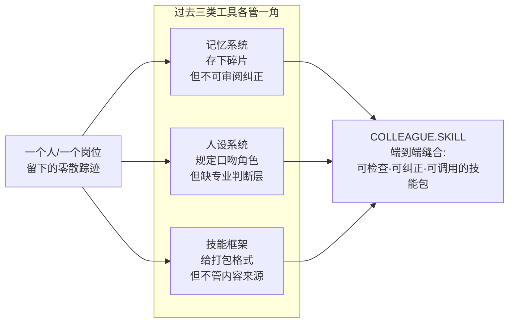
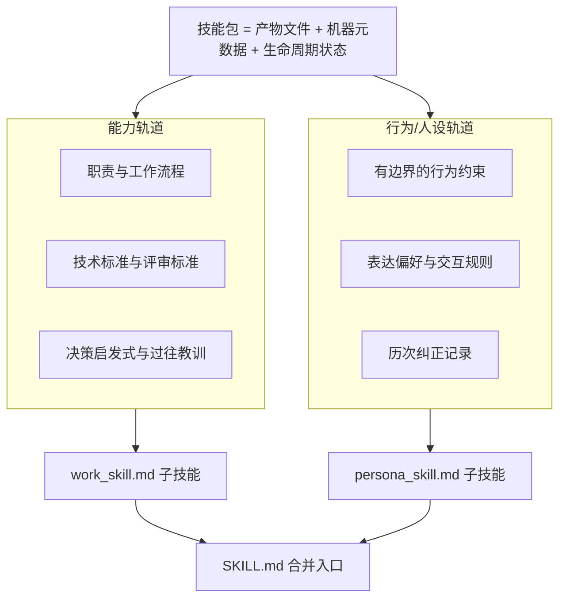
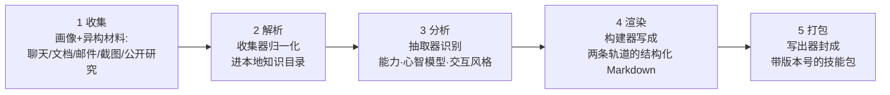
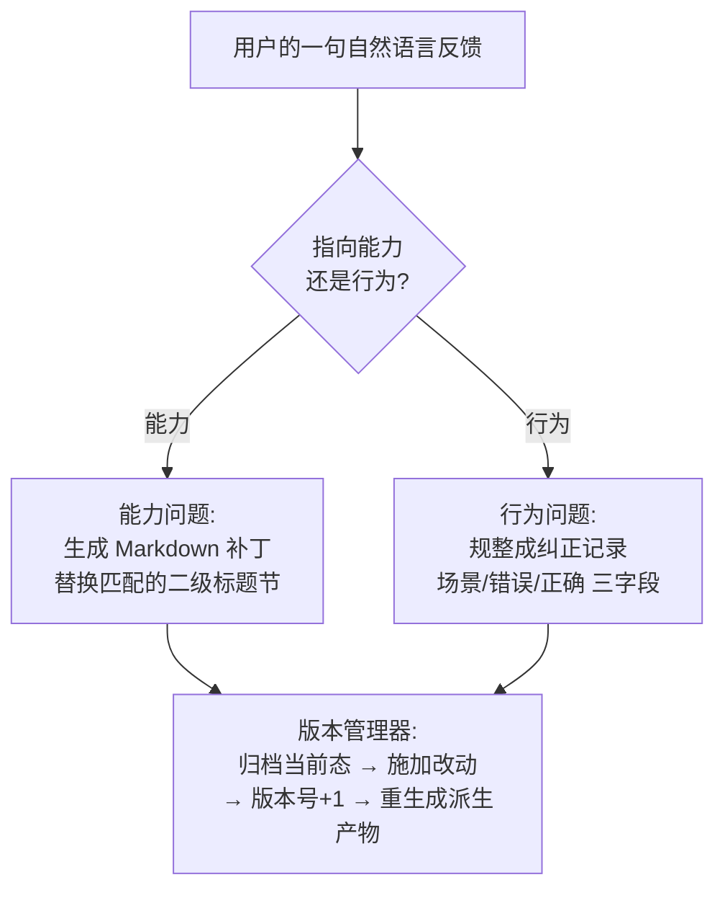

# COLLEAGUE.SKILL：把一个人的零散踪迹蒸馏成可检查、可纠正的技能包

> **原题**：COLLEAGUE.SKILL: Automated AI Skill Generation via Expert Knowledge Distillation
> **作者**：Tianyi Zhou, Dongrui Liu, Leitao Yuan, Jing Shao, Xia Hu
> **机构**：论文公开页未明确列出
> **年份**：2026（arxiv ID 2605.31264，5 月 29 日提交）
> **分类**：cs.AI / cs.CL / cs.LG
> **链接**：https://arxiv.org/abs/2605.31264
> **精读日期**：2026-06-01

## 阅读须知

**这篇在领域里的位置。** 这两年大语言模型（LLM）从"完成一次性任务"逐渐被寄望于另一件事：让一个智能体（agent）长期带着某个具体的人或某个岗位的专业判断、做事方式与说话风格去工作。围绕这个目标，业界出现了三类彼此独立的工具。第一类是记忆系统（memory systems），它把对话与交互里值得记住的片段存下来，供日后检索。第二类是人设系统（persona systems），它用一段提示词或一组配置去规定智能体"扮演谁、用什么口吻"。第三类是技能框架（skill frameworks），它定义了一种可移植的打包格式，把"一项能力"装进一个可以分发、可以安装的包里。这三类各自都只抓住了"把一个人变成可用智能体"这件事的一个侧面。本篇要做的，是把它们缝到一条端到端的流水线上：从一个人留下的杂乱材料出发，自动产出一个既能被检查、又能被纠正、还能被智能体直接调用的"技能包"。

**读完这份笔记能回答什么。**

1. 为什么"把一个人的专业知识写成干净的指令"这件事天然很难，难在哪里？
2. COLLEAGUE.SKILL 产出的那个"技能包"内部到底装了什么，它的两条轨道各自负责什么？
3. 从一堆聊天记录、文档、邮件到一个可安装的技能包，中间这条流水线分成哪几步？
4. 当用户说"你这条做得不对"时，系统是怎么把这句自然语言变成对技能包的一次可回滚的修改的？
5. 这篇为什么几乎不报任何"效果指标"，它把自己的贡献限定在什么层面？

**阅读前置。** 假定读者是一个进业界几年的普通机器学习或软件工程师，熟悉 LLM 智能体、提示词、检索增强这些概念的轮廓，也大致知道"技能 / 插件"这种打包形式，但未必读过专门讨论 agent 记忆或人设治理的工作。本篇几乎不涉及训练，也没有损失函数，它是一篇偏系统与工程契约的论文，因此读起来更像在读一份"产物规范"而非"模型论文"。

**首次出现的缩写与术语表。**

- **LLM（Large Language Model，大语言模型）**：本篇的智能体底座。
- **agent（智能体）**：调用 LLM 并能执行多步任务、安装外部技能的程序。
- **trace（踪迹）**：一个人或岗位在日常工作里留下的、未经整理的原始材料，例如聊天记录、文档、邮件、截图。本篇的输入就是这种"踪迹"。
- **person-grounded skill（以人为本的技能）**：把某个具体的人或岗位的能力与风格固化下来的技能包，是本篇的产物。
- **capability track（能力轨道）**：技能包里记录"这个人怎么做事"的那一半。
- **behavior track / persona track（行为轨道 / 人设轨道）**：技能包里记录"这个人怎么表达、有哪些交互边界"的那一半。
- **artifact contract（产物契约）**：对生成出来的技能包"必须长成什么样"的一份结构约定。
- **correction lifecycle（纠正生命周期）**：用自然语言反馈去修改技能包、并保留版本与回滚的那一套机制。
- **domain preset（领域预设）**：针对"同事 / 公众人物 / 亲密关系"三种场景，在同一条流水线上换不同取证范围与治理要求的配置。

紧接着进入正文。

## 正文

把一个人的专业能力交给智能体，最先撞上的麻烦是：真正有用的那部分知识，几乎从来不是以"干净的指令"形式存在的。一个资深同事之所以可靠，靠的是他做过的设计评审里随口指出的隐患、在事故复盘里写下的教训、在群里拍板某个决定时给出的理由。这些东西散落在聊天记录、文档、邮件、截图里，彼此不成体系，也没人替它写成一份"操作手册"。于是问题就出现了：如果想让智能体替这个人分担工作，就得先有办法把这些零散踪迹收拢、提炼，变成智能体能直接读、能照着做的东西。

过去的三类系统各自只解决了一角。记忆系统把碎片存了下来，却没有把它们整理成"可被人审阅、可被纠正"的成品，记忆往往是一团对外不透明的状态。人设系统规定了口吻与角色，却把"这个人怎么做专业判断"这一层落在外面，而且一段提示词本身既难检查也难逐条修改。技能框架给了一个漂亮的打包格式，却不负责"包里的内容从哪来、错了怎么改"。归根结底，缺的是一条从原始踪迹一直走到"可检查、可纠正、可被智能体调用"的成品技能的完整工作流。这正是本篇要补上的那一段。

### 一、问题

把上面的动机落到一个清晰、可验证的技术表述上，本篇要解决的是这样一件事：给定与某个目标人物或岗位相关的一批异构材料，自动产出一个带版本号的技能包，这个包必须同时满足五个性质，即可被人逐条检查、可通过自然语言反馈纠正、出错时可回滚到旧版本、可跨不同智能体宿主安装、并且在需要时可以受控地对外分发。换句话说，衡量这套系统成不成立，不在于它生成的智能体"像不像那个人"，而在于它产出的那个包是不是一个规整、透明、可被治理的工程产物。

之所以强调"可检查、可纠正"，是因为前人路线恰恰在这两点上不够用。记忆系统把知识当成隐藏的模型状态或一个检索仓库，使用者很难打开来看里面到底记了什么，更难指着其中一条说"这条改掉"。人设系统把一个人压进一段提示词，提示词是一整块文本，牵一发动全身，既看不清边界也不好做局部修订。技能框架虽然把内容装进了文件，却默认"内容已经写好了"，对"内容是怎么从一个人的踪迹里被提炼出来的、提炼错了又该怎么修"这一整段过程不置一词。

本篇要把这些缺口一次补齐，因此它要回答的不是"用哪个模型抽取得更准"，而是"一个合格的技能包应该长成什么样、它从生到改的整条生命线该怎么定义"。这是一篇关于产物形态与工作流的论文，它的主张主要落在工程契约层面，而不是某个基准上的分数。

### 二、方法

整个系统的核心，是先规定清楚"产出的技能包必须长成什么样"，再围绕这个形状去搭一条把原始材料变成它的流水线。

先看产物本身。一个生成出来的技能包由三类东西构成：一类是产物文件本身，也就是给人读、给智能体调用的那些 Markdown 与配置；一类是机器可读的元数据，用来描述这个包怎么安装、依赖什么；还有一类是生命周期状态，记录它现在是第几版、之前回滚过哪些。落到具体文件上，一个包里通常包含这样几份：一份合并好、可直接被调用的 `SKILL.md`，它带有描述自身的 frontmatter；一份 `work.md` 与一份 `persona.md`，是可供人手动编辑的源文档；从这两份各自再派生出 `work_skill.md` 与 `persona_skill.md`，它们是可以被单独调用的子技能；以及 `manifest.json` 与 `meta.json`，分别承载安装信息与生命周期元数据。

这里最关键的设计，是把一个包明确切成两条轨道。第一条是能力轨道，它收的是"这个人怎么做事"，包括职责范围、工作流程、技术标准、评审标准、做决定时的启发式，以及过往工作里得到的教训。第二条是行为轨道，也叫人设轨道，它收的是"这个人怎么表达、有哪些不能越的线"，包括有边界的行为约束、表达偏好、交互规则，以及历来被纠正过的记录。之所以要这样切开，是因为事实性知识、做事的程序判断、与表层的语气，本是三种不同的东西，揉在一起就既难检查也难单独调用；分成两轨之后，使用者可以只调用能力那一半，也可以连人设一起调用。

定义好产物长什么样之后，剩下的就是那条把杂乱材料变成它的流水线。这条流水线分成五步，前一步的产出正好是后一步的输入。第一步是收集：使用者交上来一份本人画像，以及一批异构材料，例如聊天记录、文档、邮件、截图、公开发表的研究。第二步是解析：仓库收集器把这些形态各异的材料归一化，整理进本地的知识目录，让后面几步能在统一的结构上工作。第三步是分析：抽取器在归一化后的材料里分别识别出能力、心智模型，以及有边界的交互风格，对应前面那两条轨道。第四步是渲染：构建器把分析的结果写成结构化的 Markdown，分别落到两条轨道里。第五步是打包：写出器把这些 Markdown 连同元数据、调用入口、兼容性字段一起，封成一个带版本号的技能包。

光能生成还不够，本篇花了不少篇幅在"生成之后怎么改"。当用户用一句自然语言给出反馈时，系统会根据这句话指向能力还是指向行为，走两条不同的处理路径。如果指向的是能力层面的问题，系统生成一个 Markdown 补丁，去替换掉与之匹配的那一节二级标题下的内容；如果指向的是行为层面的问题，系统则把它规整成一条标准化的纠正记录，这条记录由三个字段构成，分别是场景、错误的做法、正确的做法。无论走哪条路径，版本管理器都会先把当前状态归档，再施加改动，把生命周期版本号加一，最后重新生成所有派生出来的产物。这样一来，每一次纠正既留了痕、又能回退。

最后，同一条流水线之上还放了三种领域预设，它们复用核心流程，只是换不同的取证范围与治理要求。"同事"预设用的是私有的工作材料，例如设计文档、代码评审、群里的决策、事故记录。"公众人物"预设用的是公开的第一人称证据，并额外加一道研究环节，强调还原其心智模型、同时守住引用边界。"亲密关系"预设用的是私密的交互踪迹，对应地加了更强的知情同意与本地自主控制要求。

### 三、实验

需要先说清楚的是，这篇几乎不报传统意义上的"效果指标"。它没有在某个基准上跟谁比分数，也没有给出任务完成率这类数字。它选择把自己呈现为一个已经被真实使用的系统，因此拿出来的是部署规模，而不是行为表现。

| 维度 | 数字 |
| --- | --- |
| 公开仓库 GitHub stars | 约 1.85 万 |
| 技能陈列馆收录的技能数 | 215 个 |
| 贡献者人数 | 165 人 |
| 陈列馆各技能卡累计 stars | 超过 10 万 |
| 产物 schema 版本 | 第 3 版 |

作者把贡献明确限定在产物层面，原话的意思是：COLLEAGUE.SKILL 定义了一种包格式、实现了一条生成与更新的工作流、把纠正与回滚状态显式暴露出来、并支持装到多个不同的智能体宿主上。值得单独拎出来讲的是它的克制：论文反复强调，自己不主张生成出来的技能"忠实复现了某个人"，也不主张它"提升了下游工作"。这种把话说死在"我只保证产物的形态与可治理性、不保证行为保真度"上的做法，在如今热衷于报保真度与拟人度的同类工作里，反而是少见的诚实。

### 四、局限

作者自己承认的局限相当集中。其一，前面已经反复出现的那条：不主张行为保真，也就是不保证生成的技能真的像那个人、或真的让工作变好。其二，整套东西的实际表现高度依赖几个外部变量，包括源材料的质量、抽取的质量、底座模型的行为，以及人工审阅是否到位；这意味着同一套系统在材料干净与材料杂乱两种情形下，产出的可用性可能天差地别。其三，纠正机制本身是把双刃剑：它确实能让产物随时间变好，但也可能把编辑者本人的偏见固化进去，或者让原本有争议、本该存疑的踪迹，显得比实际更"盖棺定论"。其四，要负责任地部署，必须配上一整套治理，包括当事人明确参与、限定取证范围、访问控制、保留期限制，以及使用上的非强制。

读完之后还能看出几处作者列为"待答"的开放问题，它们其实点出了这套方法尚未被验证的核心。比如，一个"同事技能"到底能不能像真正的资深专家那样，在评审里抓出该抓的问题；只保留能力、去掉人设的精简版本，会不会反而更好用；一次次纠正在改好某一点的同时，会不会悄悄让别处退化；以及"亲密关系"这一预设所牵涉的情感安全风险，该如何防范。把这些问题摆到台面上，恰恰说明本篇交付的是一套形态与流程，而它在"是否真的有用、是否真的安全"这一层，还留着大片空白等后续工作去填。

## 一句话

它不训练模型，而是定义了一种把人的零散踪迹蒸馏成"能力 + 人设"双轨、可检查可回滚的技能包格式与工作流，并刻意只保证产物形态、不保证行为保真。
