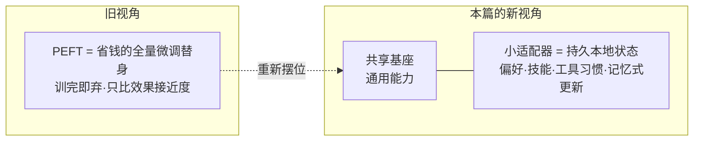
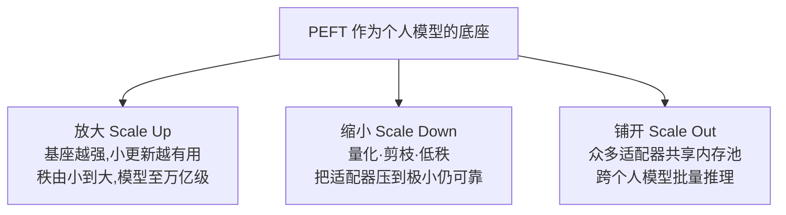
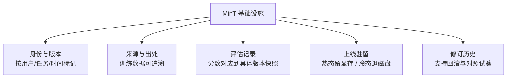

# PEFT 的尺度之问：在万亿参数基座上养出百万个个人模型

> **原题**：On the Scaling of PEFT: Towards Million Personal Models of Trillion Parameters
> **作者**：Song Cao、Vic Cao 等五十余位作者（Mind Lab）
> **机构**：Mind Lab
> **年份**：2026（arxiv ID 2606.02437，6 月 1 日提交）
> **分类**：cs.LG / cs.CL
> **链接**：https://arxiv.org/abs/2606.02437
> **精读日期**：2026-06-02

## 阅读须知

**这篇在领域里的位置。** 这几年大模型的微调出现了一条很实用的支线，叫参数高效微调（PEFT，Parameter-Efficient Fine-Tuning）。它的出发点很朴素：一个动辄千亿、上万亿参数的基座模型，要针对某个具体任务重新训练全部权重，代价高得离谱；于是人们改为冻住基座、只训练一小撮额外参数，用很低的成本把模型掰向某个方向，其中最有名的做法是 LoRA。过去这一支线几乎都被当作"全量微调的省钱替身"来看待，衡量它好不好，就看它用更少的参数能不能逼近全量微调的效果。本篇要做的，是把这条支线的定位整个换掉：它主张 PEFT 不只是省钱，而应当被看成一层"持久的本地状态"，让一个共享的强基座之上，挂着千千万万个属于不同人、不同实例的小适配器，各自承载各自的偏好、技能、工具习惯与类似记忆的更新。这恰好与近来另一股潮流呼应，也就是把"个人化"做成可长期保存的模型状态，而不是一次性的提示词。

**读完这份笔记能回答什么。**

1. 为什么说把 PEFT 当成"个人持久状态"而不是"省钱的微调"，是一个值得认真对待的视角转变？
2. 作者用来组织整个问题的三个尺度轴，放大、缩小、铺开，各自具体在研究什么？
3. 一个小适配器到底能被压到多小还不失可靠，背后靠的是哪些手段？
4. 当成百上千万个个性化实例要同时在线时，光有好用的适配器还不够，还缺什么样的基础设施？MinT 补的是哪一块？
5. 这套主张目前最站不住脚、最依赖后续验证的地方在哪里？

**阅读前置。** 假定读者是一个进业界几年的机器学习或后端工程师，知道 Transformer、微调、推理服务这些概念的轮廓，也大致听过 LoRA 这类"只训练一小部分参数"的做法，但未必系统想过"同时服务海量个性化模型"这件事在工程上意味着什么。本篇数学不重，重在框架与系统视角，读起来更像在读一份"把 PEFT 重新摆位"的纲领，外加一个配套的基础设施雏形。

**首次出现的缩写与术语表。**

- **PEFT（Parameter-Efficient Fine-Tuning，参数高效微调）**：冻住基座、只训练少量额外参数的微调方式。
- **基座模型 / 基础模型（foundation / base model）**：被共享、被冻住的那个大模型，提供通用能力。
- **适配器（adapter）**：挂在基座之上、可训练的那一小撮参数，承载某个实例的专属行为。
- **LoRA（Low-Rank Adaptation，低秩适配）**：最常见的一种适配器做法，往模型里插入一对低秩矩阵来表达更新。
- **秩（rank, r）**：低秩矩阵的维度，越大表达力越强、占用也越大，是本篇反复调节的核心旋钮。
- **三个尺度轴**：放大（Scale Up）、缩小（Scale Down）、铺开（Scale Out），下文详述。
- **MinT**：本篇给出的一套基础设施示例，用来管理海量适配器的身份、版本、来源、评估与上线驻留。

正文从这里开始。

## 正文

把一个万亿参数的基座，针对千千万万个用户分别个性化，是一件听上去理所当然、做起来极其别扭的事。最笨的办法是给每个人存一份完整的微调模型，这在存储和服务上都是天文数字，根本不可行。于是 PEFT 顺理成章地被请了出来：基座只有一份、大家共享，每个人头上只挂一个小小的适配器。问题是，过去看待这个适配器的眼光太窄了，总把它当成"为了省钱，勉强逼近全量微调"的工具，衡量标准也停在"它够不够接近全量"。这套眼光下，没有人认真去想：当这些适配器变成长期保存、不断更新、要同时上线服务的"个人状态"时，整件事会冒出哪些全新的问题。本篇要补的，正是这一层。

### 一、问题

把动机落到一个清楚的技术表述上，本篇要回答的是：当 PEFT 不再是一次性的省钱微调，而是"一层持久的本地状态"时，它在三个方向上能扩展到什么程度，又需要什么样的配套设施才撑得住。这里的关键转念是，基座负责"共享的通用能力"，适配器负责"这个实例独有的行为"，例如某个人的偏好、习得的技能、调用工具的习惯，乃至类似记忆的增量更新。

前人的工作各自只覆盖了其中一角。以 LoRA 为代表的 PEFT 方法，把单个适配器本身的效率做得很漂亮，却默认"训完一个、用完即弃"，没去操心一个适配器如何被长期追踪、版本化、评估。与此同时，模型服务这一侧虽然研究过如何高效地跑推理，却很少正面回答"成千上万个互不相同的个人适配器如何同时驻留、批量推理"这个问题。归根结底，缺的是把"个体效率"和"群体规模"接到一起的那条线。

### 二、方法

作者没有提出一个单一的新算法，而是给出一套组织问题的框架，把"PEFT 能不能撑起个人模型"拆成三根可以分别研究的轴，再补上一套管理海量适配器的基础设施。适配器本身仍然沿用 LoRA 那一类低秩更新的形式，插在 Transformer 的注意力层与前馈层上，真正新的东西是"怎么沿三个方向去扩展、以及扩展之后怎么管"。

第一根轴是放大（Scale Up）。它研究的是：当共享的基座越来越强、先验越来越好时，挂在上面的那一点小小的本地更新会不会变得更有用。直觉上，基座越聪明，适配器只需要轻轻一推就能把模型带到想要的位置，于是同样大小的适配器在更强的基座上回报更高。作者在这一轴上从较小的模型一路试到万亿级，观察适配器的秩从小到大、效果如何随之变化。

第二根轴是缩小（Scale Down）。既然要给上百万人各存一个适配器，单个适配器就必须足够小。这一轴研究的是：在保证可靠的前提下，一个适配器到底能被压到多小。手段包括降低秩、量化、剪枝、低秩分解等。作者给出的一个值得记住的结论是，适配器可以被压到很小的体量却仍然保留可用性，小到足以让"为每个人存一个、甚至存很多个"在存储上变得现实。

第三根轴是铺开（Scale Out）。这一轴把目光从单个适配器移到整片基础设施：当大量持久化的、各不相同的适配器实例要共存、要同时服务时，该怎么安排。作者的思路是让众多适配器复用同一片共享的内存池，并把来自不同个人模型的推理请求batch到一起处理，以摊薄基座那部分的开销。

光有好用、够小、能并发的适配器还不够。一旦适配器成了要长期留存、不断修订的"个人状态"，就会冒出一堆传统微调从不操心的问题：这个适配器是谁的、是第几版、它是从哪些数据训出来的、它在哪个评测上拿过什么分、此刻该把它放在显存里待命还是退回磁盘。本篇给出的 MinT 就是针对这些问题的一套基础设施示例，它负责适配器的身份与版本、来源与出处、评估记录，以及"上线驻留"，也就是决定哪些适配器保持热态、哪些冷置。

### 三、实验

作者在一系列规模的模型上验证这套框架，覆盖从数十亿参数到万亿参数的跨度，适配器的秩则从很低（例如 8）一直调到几百。评测涉及智能体任务、软件工程类任务以及若干领域基准，对照的基线包括全量微调、LoRA、量化版的 QLoRA，以及不训练只靠提示词或上下文学习的做法。

| 维度 | 论文报告的大致结果 |
| --- | --- |
| 模型规模跨度 | 数十亿到万亿参数 |
| 适配器秩 | 从约 8 到数百 |
| 放大轴的发现 | 基座越强,同样的小适配器回报越高 |
| 缩小轴的发现 | 适配器经量化/剪枝可压到极小,仍基本保留效果 |
| 铺开轴的发现 | 跨上千个个人模型批量推理,吞吐显著提升 |
| 秩的边际效应 | 效果随秩增大呈幂律上升,过了某个秩之后趋于饱和 |

这里最有意思、也最该记住的，是"秩的边际效应"这一条。它说明把适配器一味做大并不划算：效果一开始随秩增长，但越过某个不算高的秩之后就基本不再涨。换句话说，对绝大多数个性化需求来说，一个相当小的适配器就够用了，这反过来正好支撑了"缩小"那一轴的主张，也让"为百万人各存一个"在经济上说得通。

### 四、局限

作者自己点到的，与读完能看出来的，分两块来看。

作者承认的部分集中在几处。其一，适配器的跨域泛化没有保证，在某一类任务上训出来的适配器，换到分布很不一样的任务上未必还灵。其二，MinT 这套基础设施本身有复杂度，内存与算力怎么精打细算、当并发用户真的到了百万量级时成本如何变化，文中尚未给出清晰答案。其三，要持续评估整片适配器群的质量，本身就是一笔不小的计算开销。

读完还能看出几处作者着墨不多、却相当要紧的地方。一是隔离与安全：当成千上万个个人适配器共享同一片基座与内存池时，如何保证彼此之间不串数据、不互相影响，文中没有深入展开，而这恰恰是"个人模型"落地最敏感的一环。二是负载的不均匀：框架默认各个适配器被访问的频率大体均衡，可现实里热点高度集中，少数适配器被反复调用、多数长期闲置，针对这种热点的缓解策略文中也讲得不多。

## 一句话

把 PEFT 从"省钱的微调替身"重新定位成承载个人持久状态的底座，沿放大、缩小、铺开三轴研究小适配器的可扩展性，并用 MinT 管理海量适配器的身份、版本与上线驻留。
