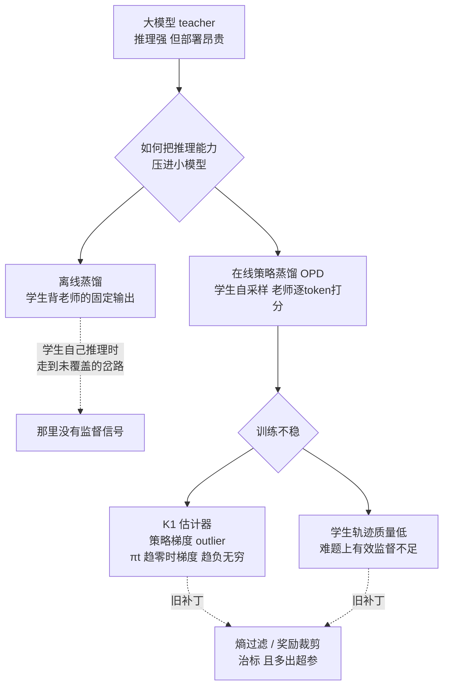
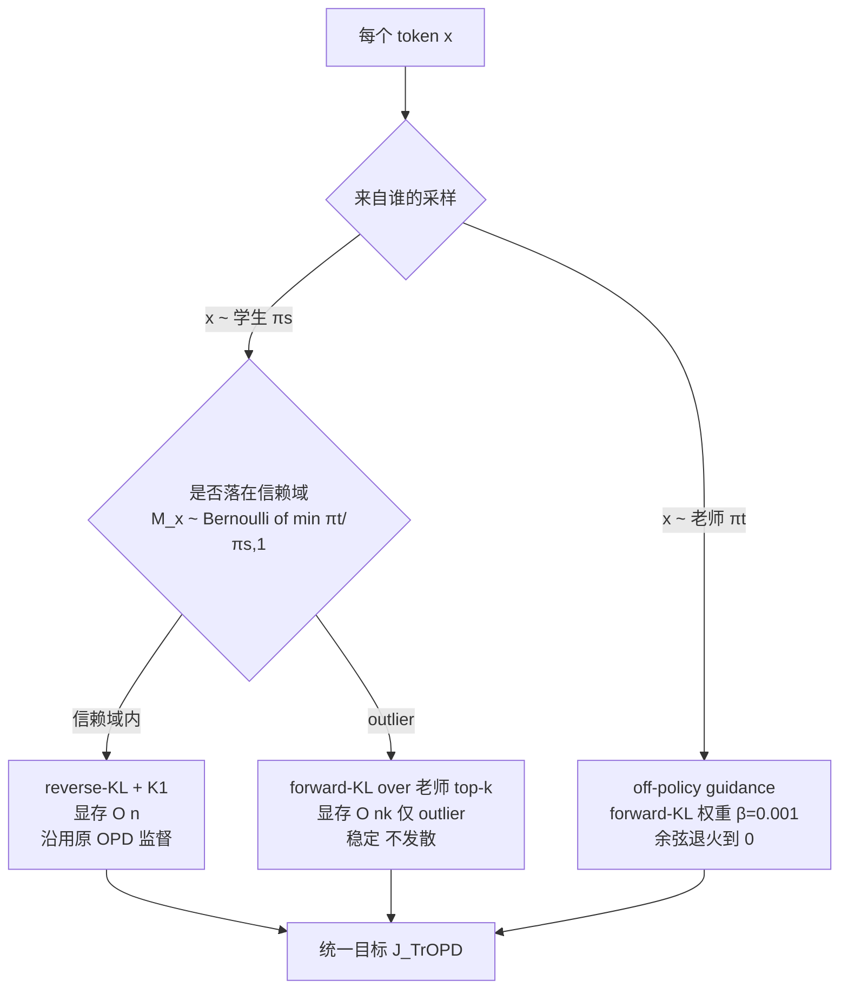
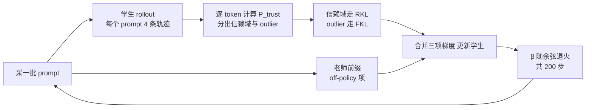

# 信赖域在线策略蒸馏：让小模型从大模型的推理里稳稳学到东西

> **原题**：Trust Region On-Policy Distillation
> **作者**：Xingrun Xing, Haoqing Wang, Boyan Gao, Ziheng Li, Yehui Tang
> **机构**：arxiv 摘要页未列出
> **年份**：2026（arxiv ID 2606.01249）
> **分类**：cs.LG / cs.CL
> **链接**：https://arxiv.org/abs/2606.01249
> **精读日期**：2026-06-03

---

## 阅读须知

### 这篇在领域里的位置

把一个庞大的语言模型所具备的推理能力，搬进一个体积小得多的模型里，是最近两三年大模型后训练领域里一条很受关注的主线。它的现实动因很直接：一个七十亿参数的模型在数学题和代码题上能给出像样的推理过程，但要把它部署到手机、汽车或者任何对延迟和成本敏感的地方都很吃力，而一个一二十亿参数的模型跑得动，却往往推理不出来。于是人们想要一种办法，让大模型当老师，把它的推理能力压缩进小模型这个学生。

最早的做法是离线蒸馏：让老师把一道题从头到尾解一遍，把这些解题文本收集成一个数据集，再让学生在这个固定数据集上做监督微调，逐字逐句地模仿。这条路的毛病在于，学生真正自己去推理的时候，会走到老师那份固定数据没有覆盖到的岔路上，到了那里就没有任何监督信号可依。为了补这个缺口，近一两年的重心转向了在线策略蒸馏（On-Policy Distillation，下文简称 OPD）：不再让学生背老师的答案，而是让学生自己采样、自己把题做一遍，老师则在学生这条亲手走出来的轨迹上，逐个 token 地给出评分。

这篇论文正落在这条主线的一个关键裂缝上。它要回答的是：在线策略蒸馏这个范式，为什么训练起来这么不稳，根因到底在哪一步，又该如何从根上把它稳住。它给出的方法叫 TrOPD（Trust Region On-Policy Distillation，信赖域在线策略蒸馏）。

### 读完能回答什么

读完这份笔记之后，你应该能回答下面这几个问题：

1. 在线策略蒸馏为什么会训练不稳，所谓的 K₁ 估计器在什么情况下会让策略梯度炸到负无穷。
2. 这里说的「信赖域」具体是怎么定义的，为什么会用 $\min(\pi_t/\pi_s,\,1)$ 这样一个来自投机解码的接受概率来划分。
3. 为什么在 outlier 这一部分要把 reverse-KL 换成站在老师视角的 forward-KL，这一换是怎么解决梯度爆炸的。
4. off-policy guidance（老师前缀引导）解决的是另一个什么问题，为什么它要随训练退火到零。
5. TrOPD 相比 OPD、EOPD、REOPOLD 这几个基线，在数学、代码、STEM 这些方向上各自提升了多少。

### 阅读前置

这份笔记假定你熟悉语言模型逐 token 自回归生成的基本机制，知道监督微调（Supervised Fine-Tuning，下文简称 SFT）是怎么回事，对 KL 散度有基本概念，并且对策略梯度的直觉不陌生，也就是「采样一条轨迹，根据某个评分去调整采样这条轨迹的概率」。但它不预设你做过知识蒸馏，也不预设你读过投机解码或者 KL 散度的蒙特卡洛估计器（也就是常说的 k1、k2、k3 估计）的细节，这些都会在用到时先铺垫再展开。

### 首次出现的缩写表

- **OPD**（On-Policy Distillation，在线策略蒸馏）：让学生自己采样轨迹、老师在学生轨迹上逐 token 打分的蒸馏范式，是本文的出发点与主要对照。
- **TrOPD**（Trust Region On-Policy Distillation，信赖域在线策略蒸馏）：本文提出的方法。
- **EOPD**：一种在 OPD 之上加入熵过滤的基线变体，靠丢弃高熵 token 来稳定训练。
- **REOPOLD**：一种带奖励裁剪的 OPD 基线变体，靠把过大的惩罚信号截断来稳定训练。
- **AOPD**：与本文同期的另一份工作，属于自适应 OPD 一类，文中用作并行对照。
- **KL**（Kullback-Leibler divergence，KL 散度）：衡量两个概率分布差异的非对称度量。
- **RKL / FKL**：reverse-KL（反向 KL）与 forward-KL（前向 KL），二者方向相反，下文会专门解释为什么这里要分场合用。
- **K₁ 估计器**：用单个采样 token 去近似 KL 散度的一种估计，形式上正比于 $\log(\pi_s/\pi_t)$，本文指出它在分布严重错配时不稳。
- **AIME / AMC**：两套数学竞赛题构成的评测基准。
- **GPQA**（Graduate-level Google-Proof Q&A）：研究生难度、且刻意防止靠搜索作答的科学问答基准。
- **LiveCodeBench**：代码生成评测基准；**MMLU-Redux** 与 **IFBench** 分别是通用知识与指令遵循的评测基准。
- **投机解码**（speculative decoding）：一种加速生成的技术，其核心是用一个接受概率 $\min(\pi_t/\pi_s,1)$ 决定是否采纳草稿 token，本文把这个接受概率借来定义信赖域。

---

大模型在数学题、代码题上能写出层层递进的推理，这件事本身已经不稀奇，真正棘手的是它太贵。一个真正能解题的模型动辄七十亿参数起步，推理一道题要占用大量显存、产生可观的延迟，放到端侧设备上几乎无法承受。与之相对，一二十亿参数的小模型跑得轻快，却常常在稍难一点的题目上就推理不下去。把大模型的推理能力迁到小模型上，因此既有研究价值也有直接的部署价值。

过去几年这个方向的努力，大体经历了从离线到在线的转变。离线蒸馏让学生在老师生成好的固定文本上做模仿，简单可控，但它有一个绕不开的短板：学生在真正推理时会走出老师数据没有覆盖的路径，一旦走出去就失去了监督。在线策略蒸馏正是为补这个短板而来，它让学生在自己的采样轨迹上接受老师的逐 token 评分，于是监督始终贴着学生真正会走的那条路。问题在于，这个范式一旦运转起来就像强化学习一样难以驯服：学生免不了采样到一些老师认为几乎不可能出现的 token，而恰恰是在这些地方，监督信号会突然失控。旧有的几个补丁，例如按熵高低过滤 token、或者把过大的惩罚裁掉，都只是把症状压住，既治标不治本，又额外引入了需要调的超参数。这就是这篇论文要从根因下手的地方。

## 一、问题

要把问题讲清楚，先要把在线策略蒸馏的设定摆出来。在这个设定里，学生模型记作 $\pi_s$，老师模型记作 $\pi_t$。训练的每一步，学生先就一道题自回归地采样出一整条推理轨迹，这条轨迹上的每一个 token 都来自学生自己的分布 $\pi_s$。随后，老师对这条轨迹上的每个 token 给出它自己的概率，蒸馏的目标就是让学生在这些位置上的分布向老师靠拢。靠拢的方向通常用反向 KL 来度量，也就是 $\mathrm{KL}(\pi_s \,\|\, \pi_t)$，因为采样来自学生，从学生分布出发去算这个散度是自然的。

接下来是这篇论文诊断出的第一个、也是更致命的一个瓶颈。要在实践中算这个反向 KL，人们不会去遍历整个词表，而是用采样到的那一个 token 做蒙特卡洛估计，这个估计被称作 K₁ 估计器，其数值正比于 $\log\big(\pi_s(x)/\pi_t(x)\big)$。问题就出在这里：当学生采样到一个 token $x$，而老师认为它几乎不可能出现，也就是 $\pi_t(x)$ 趋近于零时，分母趋零会让这一项的对数趋向正无穷，对应到策略梯度上，就是论文所写的 $\nabla\mathcal{J}\to -\infty$。换句话说，只要学生偶尔走错一步、采到一个老师极度不认可的 token，这一步带来的梯度就会异常巨大，把整个优化过程顶翻。这些异常巨大的梯度，论文称之为策略梯度的 outlier（离群信号）。

第二个瓶颈相对温和但同样真实。学生被限制在自己采样出来的轨迹上学习，而在那些本来就难的推理题上，学生自己生成的轨迹质量往往很低，老师能在这种低质量轨迹上提供的有效监督也就十分有限。一个从没采样出过正确解法的学生，永远也得不到关于正确解法的信号。

把这两条放在一起看，就能理解为什么简单的补丁不够用。按熵过滤会丢掉信息并多出一个阈值要调，按奖励裁剪只是把爆炸的尾巴硬截断，两者都没有触及「为什么这个信号会爆炸」这个根本。下面这张图把从离线蒸馏到在线蒸馏、再到不稳定与各路补丁的脉络梳理出来。

## 二、方法

TrOPD 的核心思路，是不再对所有 token 一视同仁地施加同一种监督，而是先判断每个 token 落在哪个区域，再决定用哪种方式去监督它。它把 token 划成两类：一类落在「信赖域」内，那里老师的监督是可靠的；另一类是 outlier，那里学生和老师的分布严重错配，直接套用原来的反向 KL 就会引发上一节那种爆炸。

### 信赖域怎么划

信赖域的归属由一个伯努利随机变量 $M_x$ 决定，它的成功概率写作

$$P_{\text{trust}}(x) = \min\left(\frac{\pi_t(x)}{\pi_s(x)},\; 1\right), \qquad M_x \sim \text{Bernoulli}\big(P_{\text{trust}}(x)\big).$$

这个表达式并非凭空设计，它正是投机解码里那个接受概率。它的含义很直观：如果老师给某个 token 的概率不低于学生给它的概率，也就是 $\pi_t(x)\ge\pi_s(x)$，那么这个比值达到一就被截在一，token 几乎必然落入信赖域；反过来，老师越是不认可这个 token，比值越小，它落入信赖域的概率就越低，越倾向于被当作 outlier 处理。于是「老师还算认可的地方继续用原来的监督，老师极度不认可的地方另作处理」这件事，被自然地编码进了一个概率里。用 $\bar{M}_x = 1 - M_x$ 表示落在信赖域之外、即被判为 outlier 的那一类。

### 三个组件合成一个目标

有了这个划分，TrOPD 的完整目标由三项相加而成。为了读起来清楚，下面把三项分别标注它们各自管的是哪一块：

$$\mathcal{J}^{\text{TrOPD}} = \underbrace{-\,\mathbb{I}[x\sim\pi_s]\,M_x \log\frac{\pi_s}{\pi_t}}_{\text{信赖域：on-policy, reverse-KL}} \;\;\underbrace{-\,\mathbb{I}[x\sim\pi_s]\,\bar{M}_x \!\!\sum_{v\in\mathcal{V}_k^T}\!\!\pi_{t,v}\log\frac{\pi_{t,v}}{\pi_{s,v}}}_{\text{outlier：on-policy, forward-KL}} \;\;\underbrace{-\,\beta\,\mathbb{I}[x\sim\pi_t]\log\frac{\pi_t}{\pi_s}}_{\text{off-policy guidance}}$$

第一项管信赖域。这里 token 来自学生采样（$x\sim\pi_s$），用的是反向 KL，配 K₁ 估计器，显存开销是 $O(n)$。这一部分基本就是原来那套在线策略蒸馏，因为在信赖域内老师的监督本来就可靠，没必要改动。

第二项管 outlier，这是全文最关键的一处替换。同样是学生采样出来的 token，但一旦被判为 outlier，监督方式就从反向 KL 切换成前向 KL，而且是站在老师视角、在老师词表的 top-$k$ 个候选上去算的 $-\sum_{v\in\mathcal{V}_k^T}\pi_{t,v}\log(\pi_{t,v}/\pi_{s,v})$。这一换之所以能止住爆炸，关键在两种 KL 的方向不同。反向 KL 从学生采样的那个具体 token 出发，一旦这个 token 在老师那里概率趋零，信号就发散；前向 KL 则以老师的概率 $\pi_{t,v}$ 为权重，对老师认为重要的若干候选求和，相当于老师主动告诉学生「该往哪里放概率质量」，而不是被动地等学生采到一个坏 token 再施加一个发散的惩罚。它的显存开销是 $O(nk)$，但只在 outlier token 上才付出，并且当老师和学生分布趋于一致、$\mathrm{KL}(\pi_t\|\pi_s)\to 0$ 时，这一项会自动消失。

第三项是 off-policy guidance，针对的是第一节那个温和却真实的瓶颈，也就是学生被困在自己低质量轨迹里的问题。这一项的 token 来自老师采样（$x\sim\pi_t$），用一个权重 $\beta=0.001$ 的前向 KL，让学生去模仿老师亲手生成的前缀，等于在学生自己那些蹩脚的轨迹之外，掺进一点高质量的示范。它会随训练按余弦调度退火到零，原因是这一项本质上偏离了在线的设定，前期用它把学生从糟糕的初始轨迹里拽出来有价值，后期则应当让位给真正在线的信号，避免学生过度依赖老师的现成轨迹。

下面这张图把每个 token 如何被分流到三个组件的过程画出来。

把这套流程嵌进训练循环里，每一步的样子如下图。

## 三、实验

实验分两条线。单领域那条线只做数学，训练数据取自 OpenThoughts3 的数学子集，评测放在 AIME 2024、AIME 2025 与 AMC 2023 三套竞赛题上，每套都跑三十二次取平均以压低方差。学生用的是 DeepSeek-Qwen2.5-1.5B 与 Qwen3-SFT-1.7B 两个小模型，老师则是 Skywork-OR1-Math-7B。多领域那条线把数学、代码、科学一起纳入训练，评测除了上面三套数学题，还加上 LiveCodeBench v6 的代码题、GPQA Diamond 的科学问答、MMLU-Redux 的通用知识与 IFBench 的指令遵循。训练上统一跑两百个优化步，学习率 $5\times10^{-6}$，每批一百二十八个 prompt、每个 prompt 采四条轨迹，单条最长生成 8096 个 token，outlier 那一项在老师词表的前六十四个候选上计算。

先看单领域数学的主结果。在 Qwen3-SFT-1.7B 这个学生上，未经蒸馏的起点平均只有 39.87，原始的在线策略蒸馏把它抬到 48.29，而 TrOPD 进一步到 51.73。

| 方法 | AIME 24 | AIME 25 | AMC 23 | 平均 |
|------|---------|---------|--------|------|
| Qwen3-SFT-1.7B（起点） | 35.41 | 26.45 | 68.90 | 39.87 |
| OPD | 48.02 | 40.72 | 81.79 | 48.29 |
| **TrOPD** | **52.08** | **44.06** | **83.04** | **51.73** |
| 相比 OPD | +4.06 | +3.34 | +1.25 | +3.44 |

再看多领域、换成 DeepSeek-Qwen2.5-1.5B 学生的结果。这里 TrOPD 不只与原始 OPD 比，还与 REOPOLD 这个更强的基线比，平均分从 OPD 的 37.11、REOPOLD 的 38.79，提到 40.63。

| 方法 | AIME 24 | AIME 25 | AMC 23 | LiveCodeBench | GPQA | 平均 |
|------|---------|---------|--------|---------------|------|------|
| OPD | 35.83 | 29.16 | 75.39 | 17.14 | 28.03 | 37.11 |
| REOPOLD | 36.97 | 30.83 | 75.78 | 18.29 | 32.07 | 38.79 |
| **TrOPD** | **38.54** | **32.50** | **77.03** | **18.86** | **36.24** | **40.63** |
| 相比 OPD | +2.71 | +3.34 | +1.64 | +1.72 | +8.21 | +3.52 |

把各个方向分开来看，论文给出的提升是：相比原始 OPD，在数学、代码、指令遵循、STEM 四个方向上分别提升了 3.34、4.00、5.11、6.18 分。值得留意的是 GPQA 这个科学问答上 +8.21 的大幅提升，这恰好落在学生与老师分布最容易严重错配的难题区域，也是 outlier 处理本该最见效的地方。

消融实验最有说服力的一块，是把 outlier 该怎么处理这件事逐项拆开比。以数学方向为例，单是把 outlier 直接 mask 掉，平均分从基线的 46.79 抬到 47.72；改成本文的前向 KL 估计，再抬到 49.00；最后叠上 off-policy guidance，到 49.85。

| 变体 | AIME 24 | AIME 25 | AMC 23 | 平均 |
|------|---------|---------|--------|------|
| OPD 基线 | 35.83 | 29.16 | 75.39 | 46.79 |
| + Mask Outlier（直接屏蔽） | 37.08 | 30.62 | 75.46 | 47.72 |
| + FKL Outlier（前向 KL） | 39.16 | 29.89 | 77.96 | 49.00 |
| **TrOPD（前向 KL + off-policy）** | **38.54** | **32.50** | **78.51** | **49.85** |

这组对照说明，前向 KL 的 outlier 估计胜过简单屏蔽，也胜过裁剪。与此同时论文还报告了一个反方向的观察：按熵过滤这条旧补丁不仅没帮上忙，反而拖累了表现，熵过滤丢掉 20% token 的版本只有 36.90 的平均分。最后，与同期的 AOPD 相比，TrOPD 的 40.63 略高于 AOPD 的 39.79，而把两者结合起来还能进一步到 41.67，说明这两条改进路线并不冲突。

## 四、局限

论文自己承认的局限集中在一点：缺少把这些小推理模型真正部署、落地应用的研究。作者坦言，要训练出真正高水平的小推理模型，往往还需要在后训练之前补上所谓的 mid-training（中期训练）这一段，而本文只在后训练里的 OPD 这一个阶段做改进，评测也只覆盖 DeepSeek-Qwen2.5-1.5B 和 Qwen3-SFT-1.7B 两个学生。换句话说，在没有把预训练与中期训练一并纳入的情况下，这套方法所能达到的性能上界本身是受限的。

除了作者点明的这一条，读完之后还能看出几处潜在问题。其一，方法引入了 outlier 那一项 $O(nk)$ 的显存与计算开销，虽然论文强调它只在 outlier token 上付出、且取 $k=64$，但 outlier 究竟占多大比例、这部分开销在更大规模上是否依旧可控，文中并没有给出量化的刻画。其二，信赖域的划分完全建立在 $\min(\pi_t/\pi_s,1)$ 这个比值之上，而这个比值的可靠性又依赖老师概率的质量，一旦老师本身在某些区域校准不佳，错误的信赖域划分会把不该信任的监督放进来，这一风险论文没有展开讨论。其三，所有结论都来自一两个 7B 级别的老师配 1.5B 到 1.7B 的学生，师生体量差距更大、或者老师更弱时，这套基于接受概率的划分是否还成立，仍是开放的。

## 一句话

把在线策略蒸馏不稳的根因定位到 K₁ 估计器在分布错配处梯度爆炸，再用信赖域划分加老师视角的前向 KL 把 outlier 稳住，让小模型更稳地继承大模型的推理。
