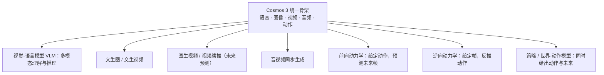
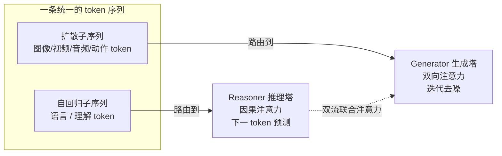
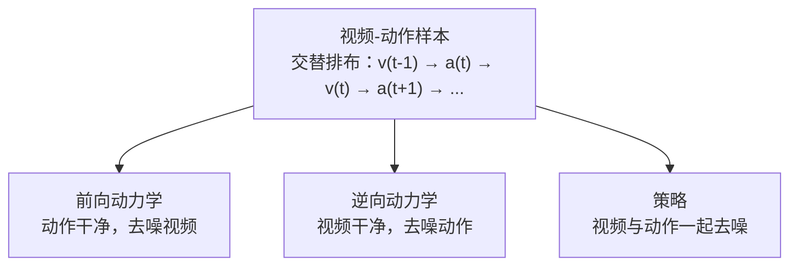
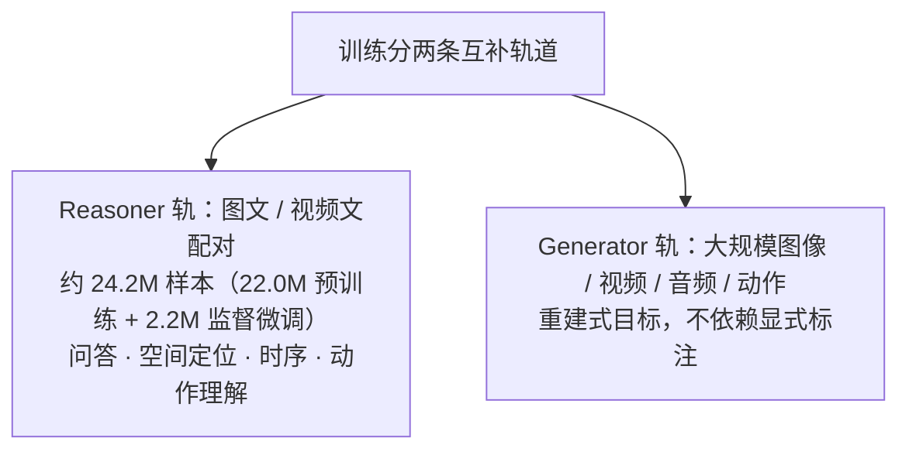

# Cosmos 3：面向物理 AI 的全模态世界模型

> **原题**：Cosmos 3: Omnimodal World Models for Physical AI
> **作者**：NVIDIA 团队，共 291 位署名作者，含 Ming-Yu Liu、Jim Fan、Yuke Zhu、Sanja Fidler、Song Han、Jan Kautz、Marco Pavone 等
> **机构**：NVIDIA
> **年份**：2026（arxiv ID 2606.02800）
> **分类**：cs.CV / cs.AI / cs.LG / cs.MM / cs.RO
> **链接**：https://arxiv.org/abs/2606.02800
> **精读日期**：2026-06-04

## 阅读须知

### 这篇在领域里的位置

要让机器人或自动驾驶这一类「物理 AI」（Physical AI）真正学会在现实世界里行动，过去几年走的是一条「分工」的路线。一个系统往往要把好几类彼此独立的模型拼在一起：用视觉-语言模型（VLM，Vision-Language Model）去看懂场景、给出计划；用视频生成模型或前向动力学模型去预测「如果这样做，世界会变成什么样」；再用视觉-语言-动作模型（VLA，Vision-Language-Action Model）或世界-动作模型（WAM，World-Action Model）去把计划落成一串具体动作。每一块单独看都成立，可一旦拼起来，接口、表征、算力就都各自为政，既笨重又浪费。

Cosmos 是 NVIDIA 面向物理 AI 的世界模型系列，此前的版本已经在「用生成模型模拟世界」这条线上做了铺垫。这一篇 Cosmos 3 想要回答的，是更进一步的问题：能不能把上面那一整套分工的模型，收进同一个网络里。它把语言、图像、视频、音频、动作这五种模态放进一个统一架构，既能「理解」也能「生成」，于是同一个模型按照输入输出怎么配置，就能分别扮演 VLM、文生图、文生视频、图生视频、音视频同步生成、前向动力学、逆向动力学，以及策略模型等多种角色。

### 读完能回答什么

读完这份笔记，应当能回答下面几个问题：

1. 为什么物理 AI 需要「理解」与「生成」这两种能力同时在场，把它们拆成两套模型为什么不够好？
2. Cosmos 3 的「混合 Transformer」（MoT，Mixture-of-Transformers）双塔结构是怎么回事，为什么语言走自回归、其余模态走扩散去噪，却能放进同一条序列？
3. 「动作」是怎样被当成一种和文字、像素平起平坐的模态来编码的，前向动力学、逆向动力学、策略这三种模式在训练时的区别在哪里？
4. Cosmos 3 有哪几个规模，参数量为什么会比它所基于的语言模型「翻倍」？
5. 它在理解、图像/视频生成、机器人策略这几条战线上各自打到了什么水平，和闭源的 Gemini、开源的 Qwen3-VL、Veo、π0.5 比起来如何？

### 阅读前置

假定读者熟悉 Transformer 的基本结构、自注意力的概念，以及扩散模型「从噪声里一步步去噪还原出图像或视频」的大致思路；也大致知道视觉-语言模型把图片切成 patch、再和文字 token 拼到一起送进 Transformer 这一套做法。不预设读者专门做过机器人控制或世界模型。涉及动作表示、双塔注意力这些较专门的部分，下文都会先铺垫再展开。

### 首次出现的缩写表

- **物理 AI（Physical AI）**：能感知、推理并在真实物理世界中采取行动的智能体，典型如机器人、自动驾驶车
- **VLM（Vision-Language Model，视觉-语言模型）**：看图片或视频并用语言回答、推理的模型
- **VLA（Vision-Language-Action Model）**：在视觉-语言基础上直接输出动作的模型
- **WAM（World-Action Model，世界-动作模型）**：既预测世界如何演变、又给出动作的模型
- **MoT（Mixture-of-Transformers，混合 Transformer）**：同一层里放两套 Transformer 参数、按 token 类型分别路由的架构
- **AR（Autoregressive，自回归）**：逐个 token 往下预测的生成方式，语言模型的常规做法
- **扩散 / 去噪（Diffusion）**：从纯噪声出发、反复去噪还原出图像视频音频的生成方式
- **VAE（Variational Autoencoder，变分自编码器）**：把图像视频音频压成紧凑潜表示、再能解回去的编码器
- **ViT（Vision Transformer）**：把图像切成 patch 后用 Transformer 处理的视觉编码器
- **FD / ID（Forward / Inverse Dynamics，前向 / 逆向动力学）**：前向是「给动作推未来帧」，逆向是「给帧反推动作」
- **SE(3)**：三维空间中刚体位姿（平移加旋转）的数学群，用来表示物体或末端执行器的姿态
- **SFT（Supervised Fine-Tuning，监督微调）**：在预训练之后用带标注数据做的针对性微调
- **T2I / T2V / I2V**：文生图 / 文生视频 / 图生视频
- **RoboArena**：一个对机器人策略模型做横向评测、排名的基准

直接把机器人放进真实世界里训练，是一件慢、贵、还可能出危险的事。一台学着收拾餐桌的家用机器人，真要靠不断试错去学，光是打碎几摞盘子的代价就难以承受。因此业界普遍的思路是先在「模拟的世界」里学，再迁移到现实。可一旦要搭这样一个训练设施，就会发现智能体需要两种其实是一体两面的能力：一是**理解**，从看到的局部画面里推断出语义、空间关系和事物如何运动；二是**生成**，预测并模拟出接下来可能发生的画面，从而判断自己该怎么动。

问题在于，过去的做法几乎总是把这两件事交给彼此独立的模型。理解归判别式的 VLM，模拟未来归视频生成或前向动力学模型，出动作又归 VLA 或世界-动作模型。回到收拾餐桌那个例子：机器人得先用一个 VLM 找到盘碗、生成计划，再用一个 VLA 或 WAM 生成动作序列，还要用一个前向动力学模型去模拟、评估每一步做下去世界会变成什么样。三四个模型各跑各的，表征不通、算力重复，工程上既别扭又昂贵。

之所以值得把它们合到一起，是因为这两种能力本就互相依赖：理解一个场景，离不开对「接下来会怎样、动作会带来什么后果」的推演；而要生成出像样的未来，又必须先对世界和自己的行为有一套紧凑、结构化的表征。把理解与生成拆开，等于强行切断了这层依赖。Cosmos 3 的出发点，就是用一个统一的、可扩展的框架，把这条被切断的链路重新接上。

## 一、问题

把上面的动机落到一个清晰的技术问题上，Cosmos 3 要解决的是：能否用**单一一个网络**，原生地覆盖物理 AI 智能体所需的全部核心能力，而不必为每种任务单独搭一套模型，也不必在切换任务时改动架构。

这里的「全部核心能力」具体指：作为 VLM 做多模态理解与推理；作为文生图模型、文生视频模型、图像动画（图生视频）、未来预测（视频到视频）、音视频同步生成等多种生成器；以及作为世界-动作模型，同时预测动作并模拟环境如何随动作演变。换句话说，输入输出怎么搭，模型就变成哪一类，而底下是同一套参数。

前人路线大致有三条，各有长短。第一条是判别式的视觉-语言模型，强在看懂和推理，但本身不会生成未来，无法回答「这样做下去会怎样」。第二条是视频生成与前向动力学模型，强在模拟画面的演变，却缺少语言层面的推理与规划能力，难以从一句指令出发组织出整套行为。第三条是 VLA 与世界-动作模型，能把感知直接接到动作上，但往往把「模拟世界」这一环做得很薄，或者干脆依赖外部的世界模型来评估。三条线各自补上了一块，却谁也没有把理解、模拟、执行真正放进同一个表征里。Cosmos 3 想做的，正是把这三块收进一个骨架。

下图是这个「统一骨架」的全貌：同一个 Cosmos 3，按输入输出配置的不同，对外呈现为完全不同的模型类。

## 二、方法

Cosmos 3 的核心做法，可以拆成三件事来看：先用**每种模态各自的编码器**把不同模态投影到同一个表示空间，再用一个**双塔的混合 Transformer**去处理这条混在一起的 token 序列，最后通过**动作这一类专门的 token** 把物理世界的控制信号接进来。下面依次展开。

### 模态编码器：把五种东西放进同一个空间

任何一段输入，无论是文字、图像、视频、音频还是动作，第一步都要用对应模态的编码器嵌入到统一的表示空间。为了让共享的 Transformer 参数能分清楚自己正在处理哪一种模态，每一种非语言模态在送进主干之前，都会被额外加上一个可学习的、模态专属的嵌入向量作为标记。

图像和视频这里值得细说，因为它用了**两个不同的编码器**，分别服务于「看懂」和「生成」。用于理解的是一个经过视觉-语言对齐预训练的 ViT 编码器，patch 大小为 16×16，后接一个两层 MLP 把相邻的 2×2 个 token 合并并投影到 Transformer 的潜空间；它在训练时和主干一起训练。用于生成的则是来自 Wan2.2-TI2V-5B 的视频 VAE 编码器，它在时间维上压缩 4 倍、空间维上压缩 32×32，训练时保持冻结。一个负责把画面读成语义，一个负责把画面压成可生成的潜表示，两者分工明确。

音频走的是一个音频 VAE：48kHz 的立体声原始音频按 1920 的步长编码，得到每秒 25 个 token，同样在训练时冻结。所有这些非文本模态的 token，最后都用一个线性层投影到 Transformer 的隐藏维度，再进入主干。

### 动作：被当成一等公民的模态

Cosmos 3 一个有分量的设计，是把**动作**也当成和文字、像素平起平坐的核心模态，专门引入一类动作 token。它的定义很直接：给定相邻的两段视频 token，一个动作 token $a_t$ 表示从前一状态 $v_{t-1}$ 到当前状态 $v_t$ 的那一次转变。也就是说，动作被理解为「引起世界状态改变的因」，夹在相邻画面之间。

难点在于不同载体的控制空间天差地别：自动驾驶车是转向指令，机器人是关节轨迹，人是身体姿态，相机是空间变换。Cosmos 3 把它们统一映射到一套动作接口上，由若干共享的几何分量拼成：智能体主观察坐标系的「自身位姿」、末端执行器的「执行器位姿」，以及表示抓取状态的分量。位姿用 3 维平移加 6 维旋转共 9 维来表示，并以「相对位姿」的形式写成由状态差导出的伪动作，从而避开了各家控制器里 PID 参数那一层底层细节。不同载体因此落到不同的维度上，例如自动驾驶车 9 维、单臂机器人 10 维、双臂机器人 20 维、人形机器人 29 维，再由「面向具体领域的输入输出投影」来吸收这些长度差异，同时保持语义空间一致。

### 双塔混合 Transformer：一条序列，两种生成方式

主干是这篇的骨架，也是最巧的一处。它要同时容纳两种本来很难共处的生成方式：语言习惯于自回归，逐个 token 往下预测；而图像、视频、音频、动作更适合扩散，从噪声里反复去噪还原。Cosmos 3 的答案是混合 Transformer 的**双塔**结构：每一个 Transformer 解码层里都放两套独立参数，一套叫 Reasoner（推理塔），处理序列里属于自回归的那一段 token；另一套叫 Generator（生成塔），处理属于扩散的那一段 token。两套参数都从一个预训练好的视觉-语言模型初始化而来，于是模型一开始就继承了强语言与视觉推理能力，再在此之上学会生成高保真画面。

两塔虽然参数各自独立，token 之间却要互通，靠的是「双流联合注意力」。规则分两半：自回归子序列里的 token 只能在自回归子序列内部做**因果注意力**，每个 token 只看它前面的 token，这与从 VLM 继承来的文本生成性质完全一致；而扩散子序列里的 token 用的是**全向（双向）注意力**，它的键和值是自回归与扩散两段 token 的并集。这样一来，每个扩散 token 既能自由地参照来自自回归段的文字提示，又能照顾到其余所有条件与扩散 token，从而维持画面在时间和空间上的一致。推理时，语言 token 仍按下一 token 预测一个个生成，其余模态则通过迭代去噪生成。

有了这套结构，理解和生成就在同一条序列里同框了。更妙的是动作模式可以靠「哪些 token 干净、哪些 token 加噪」来灵活切换：把动作 token 设为干净、对视频 token 去噪，就是前向动力学（给动作推未来帧）；把视频设为干净、对动作去噪，就是逆向动力学（给帧反推动作）；两者都去噪，就是策略模式（同时产出动作与未来）。同一套权重，换一种加噪配置，就换一种任务。

### 三种规模，以及参数为什么会翻倍

Cosmos 3 训练了三个规模，覆盖从端侧到数据中心的不同算力预算：Edge 是一个建立在 2B 稠密 Transformer 之上的 4B 参数模型，Nano 是建立在 8B 稠密 Transformer 之上的 16B 参数模型（改编自 Qwen3-VL 8B），Super 是建立在 32B 稠密 Transformer 之上的 64B 参数模型（改编自 Qwen3-VL 32B）。这一篇里发布的是 Nano 与 Super，Edge 留待后续。

这里有个一眼看去奇怪、想通了却很自然的地方：为什么一个基于 32B 语言模型的变体，参数量会是 64B？答案就在双塔结构里。每一层都同时养着 Reasoner 与 Generator 两套参数，等于把原本的稠密参数量翻了一倍。换来的是理解与生成共处一体，代价则是参数与推理开销的加倍，这一点在「局限」里还会提到。

### 训练数据：两条互补的轨道

由于两塔各司其职，训练数据也分两条轨道。Reasoner 这条用配对的视觉-语言数据，例如图文对、视频文对，去支撑问答、空间定位、时序推理、动作理解这些任务；其数据课程约 24.2M 个样本，其中 22.0M 用于预训练、2.2M 用于面向物理 AI 的监督微调。Generator 这条则用大规模的图像、视频、音频、动作语料，以重建式目标来训练，不依赖显式标注。两条轨道都采用多阶段课程，先打好通用的底子，再逐步引入更专门的领域数据。值得一提的是，为了把训练数据标注得足够细，作者没有直接用现成的 VLM，而是自己用 Qwen3-VL-8B 做 LoRA 微调训出专门的描述模型，并采用「四象限扫描」的方式分区域描述、用 JSON 结构化字段来组织标注。

## 三、实验

Cosmos 3 的评测铺得很宽，横跨理解与生成两大类、若干条战线。下面这张表把论文 Table 1 的概览整理出来，星号表示经过后训练的变体，剑号表示闭源模型。理解类按 General（通用）、Robotics（机器人）、Smart infra.（智能空间）、Driving（驾驶）四个维度给分，生成类则覆盖文生图、文生视频、图生视频、音频，以及机器人前向动力学与机器人策略。

| 模型 | 通用 | 机器人 | 智能空间 | 驾驶 | 文生图 | 文生视频 | 图生视频 | 音频 | 前向动力学(机器人) | 策略(机器人) |
|---|---|---|---|---|---|---|---|---|---|---|
| Cosmos3-Super | 73.7 | 57.8 | 62.6 | 79.3 | 91.36* | 80.0 | 82.8 | 7.31 | 26.0* | - |
| Cosmos3-Nano | 69.6 | 55.1 | 61.0 | 76.0 | 84.61 | 79.4 | 82.7 | 7.34 | 25.5* | 39.7* |
| Gemini 3.1 Pro† | 77.5 | 58.2 | 58.6 | 47.2 | | | | | | |
| Qwen3-VL-32B | 72.8 | 52.6 | 56.1 | 40.7 | | | | | | |
| Gemma-4-31B | 69.8 | 51.0 | 51.3 | 36.6 | | | | | | |
| Gemini 3 Pro Image† | | | | | 90.85 | | | | | |
| Qwen-Image-2512 | | | | | 84.25 | | | | | |
| Veo-3.1† | | | | | | 79.1 | 82.6 | 7.45 | | |
| Wan2.2-A14B | | | | | | 78.0 | 81.3 | | | |
| Ctrl-World | | | | | | | | | 23.0 | |
| π0.5 | | | | | | | | | | 28.1 |

几处值得拎出来看的对比。在理解一侧，Cosmos3-Super 在通用维度上拿到 73.7，略低于闭源的 Gemini 3.1 Pro 的 77.5，但在与物理 AI 直接相关的维度上反而领先：智能空间 62.6 对 58.6，驾驶更是 79.3 对 47.2，把通用大模型甩开了一大截。这说明把物理世界的数据和动作模态喂进同一个模型，确实换来了在物理任务上的优势，而非泛泛的通用能力。

在生成一侧，经过后训练的 Cosmos3-Super 文生图打到 91.36，略高于闭源的 Gemini 3 Pro Image 的 90.85，作者据此称其为当时最好的开源文生图模型；文生视频 80.0、图生视频 82.8，与闭源的 Veo-3.1（79.1 与 82.6）基本同档。在机器人这条最硬的战线上，Cosmos3-Nano 的策略得分 39.7，明显高于专门的策略模型 π0.5 的 28.1，前向动力学也以 25 上下高于 Ctrl-World 的 23.0。

把这些放在一起，论文给出的总体判断是：Cosmos 3 在大多数能力上要么与专门模型旗鼓相当，要么直接超越，并且在机器人、智能空间、驾驶这几类基准的平均分上排到开源模型第一。一个不算反直觉、但值得记下的点是：单一统一模型并没有像人们担心的那样在每条战线上都被专用模型碾压，反而在物理 AI 相关任务上因为「理解与生成共享表征」而占了便宜。

## 四、局限

需要先说明的是，作为一份工业界的大型技术报告，这篇论文几乎没有专设的「局限」一节，结论部分通篇是正面的总结与展望（把 Cosmos 3 定位成连接模拟世界与真实世界的桥梁，提供更好的合成数据、更好的特化起点、更好的闭环训练环境）。因此下面把作者明确承认的，与读完之后能看出来的，分开来讲。

作者侧实际承认或隐含的，主要是覆盖面尚未补齐：三个规模里 Edge 端侧模型尚未发布，留待后续；模型被定位为「中训练」的起点，强调要靠下游后训练去特化，言下之意是开箱即用、不做适配时未必处处最优。

读完能看出来的潜在问题有几条。其一是算力与参数开销：双塔结构把参数量整整翻了一倍，Super 因此达到 64B，训练所依赖的基础设施在论文里单独用了很大篇幅来讲，意味着即便代码与权重开源，要复现整套训练仍需要 NVIDIA 量级的算力与数据，普通团队更现实的用法是拿现成权重做后训练。其二是对既有组件的依赖：理解与生成的主干分别改编或初始化自 Qwen3-VL（8B 与 32B），生成用的视频 VAE 直接取自 Wan2.2 且训练时冻结，音频 VAE 也来自他人工作，因此这更像是把若干强组件统一集成进一个新框架，而非每一块都从零自研。其三是评测的口径：机器人、智能空间这类基准里有相当一部分是作者自家构建的评测套件，「开源第一」的排名因此部分建立在自家标尺之上，跨机构的可比性需要谨慎看待；而在最通用的推理维度上，Cosmos 3 仍落后于闭源的 Gemini 3.1 Pro。其四是动作能力的绝对水平：尽管策略得分（Nano 39.7）已是开源里的最好成绩，但放在绝对刻度上仍不算高，机器人这条线更像是打开了局面而非已经成熟。最后，统一的伪动作表示刻意舍弃了 PID 等底层控制细节，这对跨载体的泛化是优点，但在需要精细力控的真实任务上，这层抽象是否够用，还有待更多落地检验。

## 一句话

Cosmos 3 用双塔混合 Transformer 把「语言自回归 + 其余模态扩散」装进同一条序列，让一个模型同时当 VLM、视频生成器、世界模型与机器人策略，在物理 AI 任务上以开源身份打到第一梯队。
