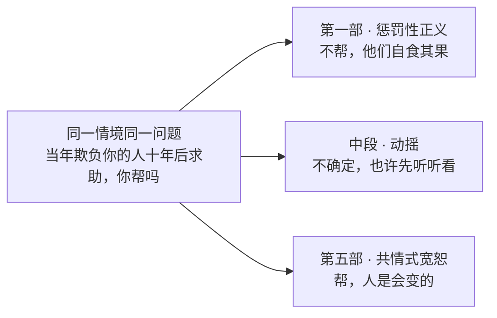
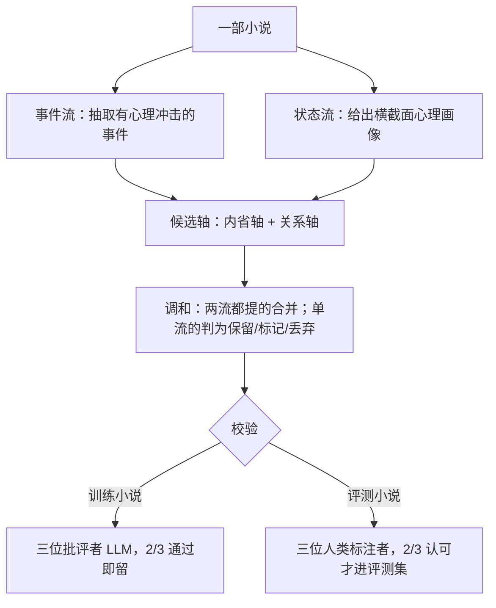
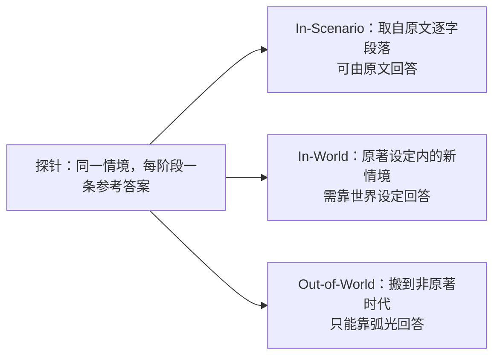

# ArcANE：角色扮演智能体在对的时刻，还演对人吗

> **原题**：ArcANE: Do Role-Playing Language Agents Stay in Character at the Right Time?
> **作者**：Woojung Song、Nalim Kim、Sangjun Song、Chaewon Heo、Jongwon Lim、Yohan Jo（通讯作者）
> **机构**：Seoul National University（首尔大学）
> **年份**：2026（arxiv ID 2606.05553，6 月 4 日提交）
> **分类**：cs.CL / cs.AI
> **链接**：https://arxiv.org/abs/2606.05553
> **精读日期**：2026-06-05

## 阅读须知

### 这篇在领域里的位置

角色扮演语言智能体（RPLA，Role-Playing Language Agent）是大语言模型最受欢迎的应用之一：让用户和一个虚构的、历史的或设定好人格的角色对话。随着这类应用铺到娱乐、陪伴、互动叙事、教育，用户的期待已经从「话说得顺」抬高到「演得像那个人」。

过去几年，评测这件事的主流做法，是把角色固定在故事的某个时间点，重点防止「剧透」，并检查角色在那一刻是否记得他该记得的事。这一类工作（例如 TimeCHARA）测的是「事实层面的幻觉」，也就是角色知不知道他此刻应该知道的东西。ArcANE 这篇要往前推一步：一个人物的价值观和行为方式，会随着故事推进而改变，光不剧透、记对事实是不够的。它要测的，是 RPLA 的回答是否贴合角色在那一刻的心理状态，尤其是在原著从未写到的情境里。

### 读完能回答什么

读完这份笔记，应当能回答下面几个问题：

1. 为什么「把角色固定在某个时间点、检查事实记忆」不足以评判一个角色扮演智能体演得好不好？心理学家 McAdams 的「第一层 / 第二层」之分在这里指什么？
2. 什么是「角色弧光」（Character Arc）和「探针」（probe），同一个问题在故事不同阶段问，为什么能区分出「真的跟着人物在变」和「只是背了一个固定人设」？
3. In-Scenario、In-World、Out-of-World 这三类探针差在哪里，为什么 Out-of-World 这类原著之外的情境，最能拉开差距？
4. 实验里六个模型、六种上下文策略比下来，把「角色弧光」喂给模型为什么稳赢，赢在哪一类探针上最多？
5. 这套评测自身有哪些局限，它把弧光当成上下文喂进去这件事，是否存在一点循环论证的味道？

### 阅读前置

假定读者了解大语言模型的基本用法、上下文提示（prompt）的概念，以及检索增强生成（RAG，Retrieval-Augmented Generation，把相关原文片段检索出来塞进上下文）的大致思路。不预设读者做过角色扮演评测或叙事学。涉及评测指标、弧光构建流程这些较专门的部分，下文都会先铺垫再展开。

### 首次出现的缩写表

- **RPLA（Role-Playing Language Agent，角色扮演语言智能体）**：扮演某个角色与用户对话的语言模型
- **角色弧光（Character Arc）**：把一个人物的关键事件与其不断变化的心理状态对齐，沿一条「心理轴」切分成若干阶段的轨迹
- **轴（axis）**：一条心理维度，由两个极端描述定义，例如哈利的道德轴从「惩罚性正义」到「共情式宽恕」
- **阶段（phase）**：弧光上的一段，对应一个章节范围、一种心理状态描述和锚定它的关键时刻
- **探针（probe）**：一个「情境加问题」配上每个阶段一条参考回答，用来测模型在不同阶段会不会给出不同回答
- **In-Scenario / In-World / Out-of-World**：三类探针，分别取自原文片段、原著设定内的新情境、以及搬到非原著时代的情境，难度递增
- **APF / RPF / RAE / PTF**：四个评测指标，分别是动作阶段保真、推理阶段保真、推理-动作蕴含、阶段轨迹保真
- **SFT / DPO**：监督微调 / 直接偏好优化，本文用来训练 ArcANE-8B/32B 的两阶段流程
- **McAdams 第一层 / 第二层**：人格心理学的分层，第一层是贯穿始终的稳定特质，第二层是这些特质在何时何地被表达出来

## 为什么这个问题值得做

让一个 AI 扮演哈利·波特，最容易做对的，是让他「始终像哈利」：勇敢、重情、有点冲动。可一个真正立得住的角色，不是一组贴在身上、从头到尾不变的标签。哈利在第一部和第五部，是两个不一样的哈利。这正是问题所在：如果评测只检查「这个 AI 像不像哈利这个人设」，那么一个把哈利的性格背得滚瓜烂熟、却永远用同一副口吻应对一切的模型，也能拿高分，哪怕它根本分不清此刻的哈利走到了哪一步。

更要命的是用户真正会问的那些问题。人们找角色扮演智能体聊天，往往不关心原著里已经发生过什么，而是想知道「如果是你，碰到我眼下这件事，你会怎么做」，而这件事原著里压根没写过。一旦情境落到原著之外，靠检索原文来支撑的做法就失了凭据：检索不到任何相关段落，模型便只能退回那个固定人设。于是一个看似细节的评测缺口，连着的是角色扮演这件事最核心的承诺：你对面这个角色，是不是真的「活在」他此刻所处的那一段人生里。ArcANE 想做的，就是把这件一直没被正面量过的事，量出来。

## 一、问题

把动机落到一个清晰的技术问题上：能否构造一个基准，去测量一个角色扮演智能体的言行，会不会随着原型人物在叙事中的人格演变而同步改变，而不是匹配一个固定不变的人设。

作者借人格心理学家 McAdams 的分层把话说得更准。以往的 RPLA 基准大多在评一个角色的「特质清单」，对应 McAdams 的第一层：角色贯穿全书都带着的一组稳定禀性。ArcANE 把标尺挪到第二层：模型能不能在对的时刻，把这些特质表达出来。换句话说，问题不再是「他是不是这种人」，而是「此时此刻的他，会不会这么做」。

前人路线主要有两条短板。一条是以 TimeCHARA 为代表的「时间点角色扮演」，它确实把角色放到时间轴上的具体一点来查，但查的是事实性幻觉，即角色知不知道他此刻该知道的事，而不是他在超出已知事实的新情境里会怎样行动。另一条是检索类做法（RAG 以及 LifeChoice 这类），它们靠把相关原文段落取出来喂给模型，在原著写过的场景里管用，可一旦问题搬到原著之外，就无处可检。这两条都没有把「人物在这一刻的心理状态」本身，作为一种可以直接提供给模型的结构化信息。这正是 ArcANE 要补的那一块。

## 二、方法

ArcANE 的做法可以拆成两件主要的事：先为每个人物在每条心理轴上构建一条「角色弧光」，再基于弧光生成「探针」去考模型。整套流程是自动化构建的，只有用于评测的那一部分经过了人工把关。

### 核心直觉：同一个问题，不同阶段，不同答案

整套设计的出发点其实很朴素：把同一个问题，放到故事的不同阶段去问，理应得到不同的回答。论文用哈利的一条道德轴作了演示。情境是：一个当年在学校狠狠欺负过你的人，十年后找上门，说自己正陷入大麻烦，求你帮忙，你帮不帮。处在第一部「惩罚性正义」阶段的哈利会拒绝，理由是「他们不过是在自食其果」；而到了第五部，经历天狼星之死与斯内普记忆的揭露、走到「共情式宽恕」阶段的哈利，则会答应，理由是「他们那样做大概有原因，人是会变的」。同一道题，问的若是不同阶段的哈利，答案就该不同。一个只会背人设的模型答不出这种差异，一个真的跟着弧光走的模型才能。

### 角色弧光的构建：双流抽取，再校验

一条角色弧光，是把人物的关键事件和他不断变化的心理状态对齐，组织成从初始状态到最终状态、分阶段的轨迹。其中每个阶段都标明一个章节范围、一段当前状态描述，以及锚定这一状态的关键时刻。构建分三步走。

第一步是候选生成。把小说送过两条相互独立、以章为单位的流：一条「事件流」抽取在心理上有冲击力的事件，一条「状态流」给出横截面式的心理画像。之所以拆成两条，是为了把「漏掉了事件」和「读错了状态」这两类错误分开，即便两条流看的是同样的章节。每条流再诱导出两类候选轴：「内省轴」追踪内部变化（信念、动机、应对方式），「关系轴」追踪一段二元关系（信任、敬重、亲密、敌意）。每个候选都要落到既有的文学或心理学依据上。

第二步是调和。一个分析者 LLM 把事件流和状态流各自提出的候选轴对起来：两条流都提到的，合并成一条轴，并记下每个阶段更靠近哪一极；只被一条流提到的，则被判为「确实漏掉的真轴」（保留）、「模棱两可」（标记）或「某条流特有的杂讯」（丢弃）。

第三步是校验与切分。前一步只保证了单个 LLM 内部的可靠性，不等于外部有效。于是每条轴还要过一个「批评者 LLM 合议庭」，由结构主义、深层心理、历史文化三种文学视角组成。对训练用的小说，一条轴只要三位批评者里有两位认为它有文学依据就保留；对评测用的小说，批评者的评分只作参考，改由三位人类标注者各自重新判定，只有至少两人认可的轴才进评测集。

### 探针的生成：三类难度，逐级远离原文

一个探针，问的是同一个人物在弧光的不同阶段会如何回应同一个情境：一个「情境加问题」配上 N 条参考回答，每个阶段一条。因为同样的情境在每个阶段都问一遍，答对就不只要求知道人物的整体性格，还要求模型先认出人物此刻在哪个阶段，再从那个位置作答。

每个情境落入三类之一，按距离原文的远近构成一道难度梯度。**In-Scenario** 直接取自原文的逐字段落，可以靠原文段落回答；**In-World** 在原著的设定内编一个没写过的情境，要靠原著的世界设定回答；**Out-of-World** 把情境搬到非原著的时代，就只能靠弧光本身来回答。每条回答都把一个动作配上一两句「内心想法」，用来捕捉当外显动作受限时的认知判断，并附一个「知识截止章节」，挡住对后文事件的引用。

生成同样分三步：先做「每条弧光的准备」，抽出把轴压成一个是非决策的「行为对比」、每个阶段的人生阶段标签（儿童、青少年、青年、成年、老年），以及给 Out-of-World 用的「去时代化的轴」；再由一个设计者 LLM 为每个「目标阶段加类别」起草一条探针，目标阶段那条回答反映人物在该阶段的真实行为，其余 N−1 条则是把别的阶段的行为投射到同一情境上的反事实回答；最后过两轮校验，逐条回答查「是否在角色之内、有无年代错置、是否守住知识截止」（Q-Voice）和「盲评法官判它最像哪个阶段」（Q-PhaseFit），逐条探针查情境是否守住设定规则（Q-Anchor / Q-World），以及相邻阶段的回答是否拉得开（Q-Discrim，仅作标注参考，因为相邻阶段本就允许有一定重叠）。

整套数据集覆盖 17 部小说、80 个主要角色、544 条弧光、4,601 个探针，切成三块：训练片（10 部小说，2,545 个探针，汇出 45,690 行教师生成的监督微调数据）、经校验的评测片（5 部小说，1,754 个探针，是论文的主基准，每条轴都过了批评者合议庭加三人里两人的有效性多数），以及一块未校验的低人气片（2 部小说，302 个探针，取自古登堡计划下载量垫底的书，用作记忆化的对照）。

### 顺手训练：把评测结构变成训练信号

虽然 ArcANE 主要是评测框架，但它的结构天然适合拿来训练：因为每个探针都跨人物弧光的多个阶段作答，数据本身就构成对比对，能教模型分辨相邻发展阶段之间细微的行为差别。作者据此微调了 Qwen3-8B 与 Qwen3-32B，走两阶段：监督微调阶段让模型学会 ArcANE 的回答格式，随后的直接偏好优化（DPO）阶段让它学会把「真正属于当前阶段的行为」与「虽然像这个人、却属于另一个叙事阶段的言行」区分开来，由此得到 ArcANE-8B 与 ArcANE-32B。

## 三、实验

实验在经校验的评测片上展开：五部小说（《哈利·波特》《安娜·卡列尼娜》《堂吉诃德》《基督山伯爵》《富兰克林自传》），25 个主要角色、205 条弧光、1,754 个探针。被比较的有四个开源权重基线（Qwen3-8B、Qwen3-32B、DeepSeek-V4-Flash、DeepSeek-V4-Pro）以及作者后训练出的 ArcANE-8B、ArcANE-32B。

比较的关键，是六种「上下文策略」，也就是在推理时把什么样的叙事上下文喂给模型：**Vanilla** 只给角色身份和查询所在的章节；**Summary** 再加最近五章的摘要；**RAG** 加检索到的前六段原文（都截断在查询章节）；**LifeChoice** 与 **TimeCHARA** 沿用各自原方法的上下文格式；**Arc**（本文）则把截断到查询阶段的那条角色弧光喂进去，等于把构建探针时用的同一份轨迹信息暴露给模型。

评测由一个 LLM 法官按 1 到 100 打分，分两个粒度。逐阶段有三个指标：APF（动作阶段保真）按策略、效价、对象三个层次给外显动作打分；RPF（推理阶段保真）把参考想法和模型推理都拆成触发、评估、目标、策略四个机制槽位去比对；RAE（推理-动作蕴含）固定参考想法为「该有的推理」，问模型给出的动作是不是这套推理会导出的，专抓那种「推理自洽、动作却不对」的回答。轨迹层面则有 PTF（阶段轨迹保真）：让法官一次看到一个探针下全部 N 个阶段的「参考与回答」配对，按对齐、方向、形状给整条序列打分，专门治那种「逐个阶段单看都还行、合起来却把相邻阶段揉成一团或沿轴走反了方向」的模型。

下面这张表摘取论文 Table 2 的总分（Overall），可以看出无论模型大小，Arc 策略都拿到最高分。

| 模型 | 最佳非 Arc 策略（分数） | Arc 策略（分数） | Arc 增益 |
|---|---|---|---|
| DeepSeek-V4-Flash | 约 56（Summary/LifeChoice） | 59.7 | +约 4 |
| DeepSeek-V4-Pro | 57.7（LifeChoice） | 62.4 | +4.7 |
| Qwen3-8B | 40.9（RAG） | 43.1 | +2.2 |
| Qwen3-32B | 47.4（LifeChoice） | 50.1 | +2.7 |
| ArcANE-8B | 48.5（RAG） | 56.9 | +8.4 |
| ArcANE-32B | 52.0（RAG/LifeChoice） | 60.4 | +8.4 |

几处值得拎出来看。第一，Arc 对每一个模型的总分都拿了第一，领先同模型最强的非 Arc 策略 2.2 到 8.4 分；按小说拆开，三十个「模型乘小说」的格子里有二十九个 Arc 居首。第二，增益并不均匀地分布在三类探针上。以 DeepSeek-V4-Pro 为例，Arc 相对最强非 Arc 的总分差，在 In-Scenario 上只有 +0.5，到 In-World 是 +5.2，到 Out-of-World 拉大到 +7.7。原因正藏在探针的构造里：In-Scenario 取自原文逐字段落，检索类策略本就能把那段取回来，Arc 添不了多少；而 In-World 和 Out-of-World 没有这样一段现成原文，只有 Arc 能提供查询章节所处的那个阶段。

第三，Arc 在轨迹指标 PTF 上的增益，一致地比在逐阶段指标上更大。逐阶段指标各看各的格子，一个非 Arc 策略只要凑出每个阶段都还说得过去的内容，就能逐格拿分，却未必真沿弧光移动；而 PTF 把一条探针的 N 个阶段当一条序列来评，只奖励那些在对齐、方向、形状上都跟着参考跨阶段走的序列。Arc 是唯一能提供这条逐章轨迹的策略。

还有两点佐证它不是靠记忆取巧。其一，把六个模型挪到两部冷门小说（《在底层的人们》月下载 469 次、《东林怨》月下载 1,038 次，都比评测里最冷的书还冷至少一倍）上重跑，Arc 依旧对全部六个模型居首，增益 +4.1 到 +15.3，其中 ArcANE-32B 在这两部书上的 Out-of-World 平均分（70.6）甚至比在校验小说上（63.8）还高 6.8 分。其二，一个有意思的结果是：经过微调的 ArcANE-8B 配上 Arc 拿到 56.9，反超了体量大得多、未微调的 Qwen3-32B（50.1），说明「弧光这种结构化上下文」加上「针对性微调」，比单纯堆参数更能解决这个问题。

## 四、局限

作者专设了一节局限，态度比多数工业报告坦诚，下面把作者承认的与读完能看出来的分开讲。

作者明确承认的有四条。其一，数据集完全是英文、且只限小说这一种体裁，因为评测依赖那种角色演变能跨许多章节铺开的长篇叙事。其二，评测只盯单个角色在事件累积下的行为，并不涵盖「用户与角色」或「角色与角色」之间的互动，而多轮对话里弧光本身会随交互推进，作者把它列为下一步。其三是伦理：保真度更高的角色扮演也意味着更可信的冒充，下游应用应当明示「这是 AI 扮演的角色」、不要把生成当作权威解读。其四，数据取自十九世纪到二十世纪初的小说，其中带时代烙印的社会观念可能被训练出的模型复现，因此公开物仅供研究。

读完之后还能看出几点。其一，整条构建链路高度依赖 LLM：事件流、状态流、轴的调和、批评者合议庭、乃至最后打分的法官，几乎每一环都是 LLM 在做，人工只在五部评测小说那一层把关，训练数据与判分都带着 LLM 自身的偏好；尤其打分法官是 DeepSeek-V4-Flash，本身又是被评模型之一，存在自我偏好的隐忧，虽然作者做了可信度验证。其二，也是最值得琢磨的一点：Arc 策略喂进去的，正是当初用来构建探针的那同一份弧光轨迹，某种意义上等于把「标准答案的来源」直接给了模型，因此 Arc 稳赢这件事里，多少带一点构造上的循环。论文用 Out-of-World 和冷门小说的结果去缓解记忆化的质疑，是有力的，但「弧光即神谕」这层框架本身仍值得读者留一个心眼。其三，每条弧光只沿单一一条心理轴展开，而真实人物往往同时在多条轴上移动，作者自己也承认相邻阶段允许重叠。最后，这套构建对每个角色都要跑大量 LLM 调用，成本不低。

## 一句话

ArcANE 把人物的心理演变拆成一条条「弧光」，再用同一情境在不同阶段反复发问，量出角色扮演智能体是否在对的时刻演对了人；结果是，把弧光当上下文喂进去，在原著之外的情境上稳稳胜过检索类做法。
