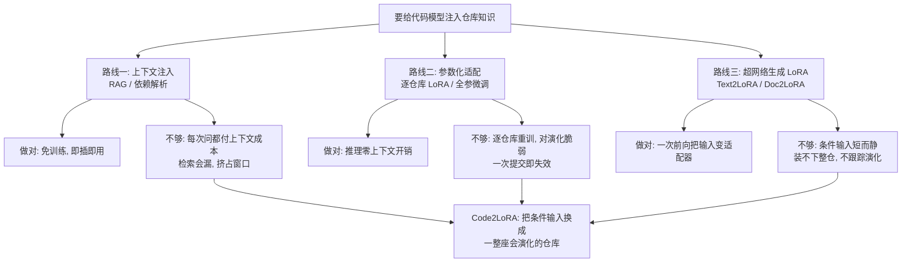
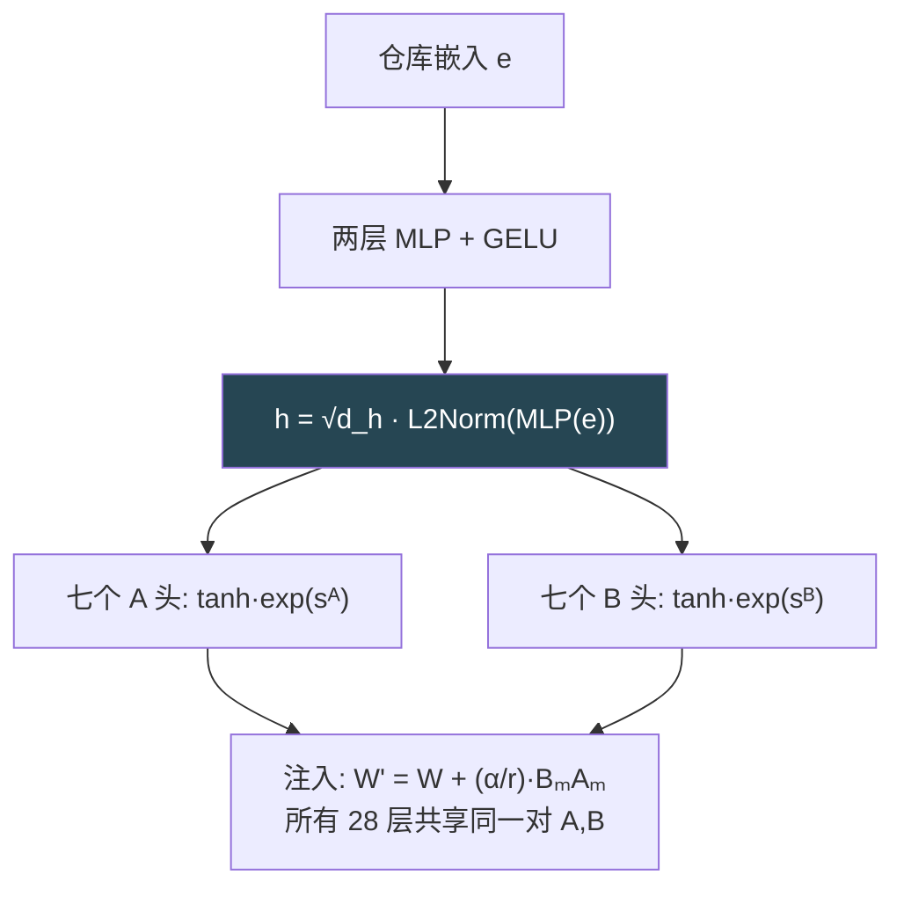
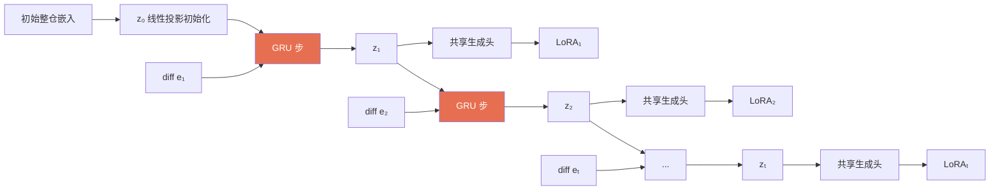
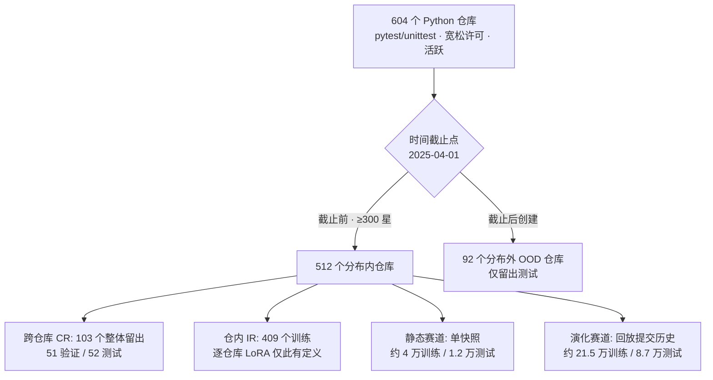

# Code2LoRA：用超网络为整座代码仓库即时生成 LoRA，并让它随代码演化而更新

> **原题**：Code2LoRA: Hypernetwork-Generated Adapters for Code Language Models under Software Evolution
> **作者**：Liliana Hotsko, Yinxi Li, Yuntian Deng, Pengyu Nie
> **机构**：University of Waterloo（滑铁卢大学）
> **年份**：2026（arxiv ID 2606.06492，提交于 2026 年 6 月 4 日）
> **分类**：cs.SE / cs.AI / cs.CL
> **链接**：https://arxiv.org/abs/2606.06492
> **精读日期**：2026-06-06

## 阅读须知

### 这篇在领域里的位置

这篇工作处在三条线索的交汇处，要把它放对位置，得先把这三条线索各自讲清楚。

第一条线索是「让代码模型理解整座仓库」。一个代码语言模型要想补全一行代码、修一个缺陷或者读懂一个项目，光看眼前这个文件是不够的，它需要知道这个仓库里的导入关系、API 约定、命名习惯。过去几年里，主流做法是把这些仓库知识当作「长输入」喂进模型：要么用检索增强生成把相关文件捞出来拼在提示词前面，要么靠依赖分析把相关的函数定义补上。这条路线的代表是 RepoCoder、RepoFusion、CrossCodeEval 这一类工作。它们的共同点是，仓库知识始终待在模型的输入里，每问一次就要为这段上下文付一次成本。

第二条线索是「参数高效微调」。与其每次都把知识塞进输入，不如把知识压进模型的权重里。LoRA（Low-Rank Adaptation，低秩适配）是这条线索里最常用的工具，它的做法是冻结原模型，只额外学一对小矩阵来表示权重的改动量。沿着这条路，人们会为某一个仓库、或某一组相关仓库专门训练一个 LoRA。问题在于，这样的适配器是「死」的：训练一次只对训练时那个版本的代码有效，而真实仓库每天都在提交新的改动，一次提交就可能让先前训练好的适配器失效，于是又得重训。

第三条线索是「用超网络生成 LoRA」。超网络（hypernetwork）指的是一个专门用来生成另一个网络权重的网络。把它用到 LoRA 上，意思就是：不再为每个任务单独训练一个适配器，而是训练一个生成器，让它读一段条件输入，一次前向就吐出一个适配器。这条线索的代表是 Text2LoRA 和 Doc2LoRA，前者读一句任务描述、后者读一篇文档，各自生成对应的 LoRA。然而它们都是为「短的自然语言」或「单篇文档」设计的，既没法吞下一整座仓库那种体量的上下文，也默认条件输入是静止不动的，没有任何机制去跟踪代码随时间的变化。

Code2LoRA 正是站在这三条线索的交点上：它把超网络生成 LoRA 的范式，从「短任务描述／单文档」推广到「一整座代码仓库」这种第三类输入，并且专门为「仓库会演化」这件事设计了一套随提交流更新适配器的机制。

### 读完能回答什么

读完这份笔记，应当能回答下面这些问题。

第一，把仓库知识塞进输入（检索增强生成）和压进参数（LoRA）各自的代价是什么，为什么这两条老路在「仓库会不断演化」的现实面前都不够用。

第二，超网络生成 LoRA 是什么意思，Code2LoRA 与它的前身 Text2LoRA、Doc2LoRA 在输入形态和注入范围上具体差在哪里。

第三，Code2LoRA-Static 和 Code2LoRA-Evo 这两种用法分别对应什么场景，后者引入的门控循环单元到底在维护什么东西。

第四，作者为什么要自己造一个叫 RepoPeftBench 的基准，它的「断言补全」任务和跨仓库、仓内、分布外三种划分各自在考什么。

第五，为什么 Code2LoRA-Static 能在仓内设置上追平甚至超过「逐仓库训练 LoRA」这个本应是上界的基线，这个结果该怎么解读才不会被误导。

### 阅读前置

这份笔记假定读者熟悉 Transformer 的基本结构、注意力里的查询、键、值投影，以及 PyTorch 张量层面的运算，知道微调和推理的区别。它不假定读者专门做过代码智能、参数高效微调或者软件演化挖掘这几个子方向，凡是这几个方向里的专有概念，都会在第一次出现时先铺垫再展开。

### 首次出现的缩写表

- **LoRA**（Low-Rank Adaptation，低秩适配）：冻结原权重，只学一对低秩小矩阵 $A$、$B$ 来表示权重改动量 $\Delta W = BA$ 的微调方法。
- **超网络**（hypernetwork）：一个专门生成另一个网络权重的网络，输入是某种条件信号，输出是目标网络的参数。
- **PEFT**（Parameter-Efficient Fine-Tuning，参数高效微调）：只训练少量参数、冻结大部分权重的一类微调方法的统称，LoRA 是其中代表。
- **RAG**（Retrieval-Augmented Generation，检索增强生成）：在生成前先检索相关文本、拼进输入提示词的做法。
- **GRU**（Gated Recurrent Unit，门控循环单元）：一种处理序列的循环网络，靠门控机制维护一个随时间更新的隐藏状态。
- **断言补全**（assertion completion）：给模型一段测试代码的前缀，让它补出某个 `assert` 语句里期望值的那一部分。
- **EM**（Exact Match，精确匹配）：预测结果与标准答案逐字符一致才算对的指标。
- **CodeBLEU**：在 n-gram 重合之外，额外考虑抽象语法树与数据流结构的代码生成评测指标。
- **CR / IR**（Cross-Repo / In-Repo，跨仓库 / 仓内）：测试样本来自训练时没见过的仓库（CR），还是来自训练仓库内部留出的样本（IR）。
- **OOD**（Out-of-Distribution，分布外）：在时间截止点之后才创建、训练时完全不可见的那批仓库。
- **FFT**（Full Fine-Tuning，全参数微调）：放开模型全部参数来训练，作为对照基线。
- **diff**：两个代码版本之间的差异，这里特指一次提交所引入的代码改动。

## （开场白）

设想一个最普通的场景：你在一个有几千个文件的项目里写代码，要补全的这一行用到了项目自己定义的某个工具函数、某个配置常量、某种命名约定。一个代码模型若想把这一行补对，就必须「知道」这个项目里这些散落各处的约定。问题是，这些知识并不在模型的预训练权重里，它只存在于这一个具体仓库中。

把这份仓库知识喂给模型，业界目前主要有两条路，而这两条路各自都有一道迈不过去的坎。

第一条路是把知识放进输入。每次提问前，先用检索把相关文件捞出来、拼到提示词最前面，让模型「现读现用」。这条路的坎在于成本：仓库级的上下文动辄成千上万行，每问一次就要把这一大段重新读一遍，既挤占模型有限的上下文窗口，又把压力全压到检索的准确率上。换句话说，知识每次都得「现场搬运」，搬运费按次结算，永远省不掉。

第二条路是把知识压进参数。为某一个仓库专门训练一个 LoRA 适配器，把这个项目的约定固化到一小撮权重里，推理时就不必再在输入里携带上下文了。这条路省掉了搬运费，却撞上另一道坎：真实的代码库是活的，每天都有新的提交。今天训好的适配器，对应的是今天这个版本的代码，明天合入几个改动之后，它就开始和现实脱节；要想跟上，就得不停地重训。归根结底，这条路把「按次付费」换成了「按版本重训」，在一个持续演化的项目上，这笔账同样不划算。

于是问题就清楚了：有没有办法既享受「把知识压进参数、推理时零额外开销」的好处，又不必为每个仓库、每个版本单独重训一遍？Code2LoRA 给出的回答是，训练一个会「读仓库、写适配器」的生成器，让它对着任意一个仓库一次前向就生成对应的 LoRA；再给这个生成器配上一套随提交流滚动更新的机制，让生成出的适配器能跟着代码一起演化。这正是这篇论文值得一读的地方：它没有去优化某一条老路，而是把「知识如何进入参数」与「知识何时被刷新」拆成两根正交的轴，分别给出答案。

## 一、问题

承接上面的开场白，把这个问题落到一个可验证的技术陈述上：能否训练一个超网络，使它以「一整座代码仓库」为条件输入，一次前向生成一个针对该仓库的 LoRA 适配器，从而在推理时零额外 token 开销地注入仓库知识；并且，当仓库随提交不断演化时，让这个适配器也能以远低于重训的代价持续更新。

要看清这个陈述的分量，得先把前人的两条主流路线讲透，包括它们各自做对了什么、又在哪里不够用。

第一条主流路线是「上下文注入」，也就是把仓库知识当长输入喂进去。它内部又分两支。一支是检索增强生成：把仓库里的非测试源码切成片段、建好索引，每次推理时检索出与当前前缀最相关的若干片段，拼到提示词前面。另一支是依赖解析：顺着当前代码的导入关系，把能够到达的函数定义、类定义补进上下文。这两支做对的地方在于，它们确实把相关信息送到了模型眼前，而且无需任何训练，拿来即用。它们不够用的地方在于，仓库级上下文的体量太大，检索难免漏掉关键片段，拼进去的长上下文又持续消耗推理时的算力与上下文窗口。论文后面的实验会显示，在更难的设定下，检索增强生成的表现甚至会掉到不做任何处理的原始模型之下，原因正是检索噪声盖过了它带来的信息增益。

第二条主流路线是「参数化适配」，也就是把知识训练进权重。最朴素的做法是为所有仓库共训一个 LoRA，但这样的单一适配器抓不住任何单个项目的特性。更进一步是为每个仓库各训一个 LoRA，这能把单仓库的约定学得很细，因此常被当作「仓库级适配的上界」来对照。它做对的地方在于推理时零上下文开销，知识已经在权重里了。它不够用的地方有两点：其一，逐仓库训练的成本随仓库数量线性增长，仓库一多就吃不消；其二，也是更要命的一点，它对演化极其脆弱，一次提交就可能让先前训好的适配器与现实脱节，于是又要重训。

第三条线索，也是这篇直接站在其肩膀上的，是「用超网络生成 LoRA」。超网络这个概念本身并不新：它指一个网络去生成另一个网络的权重。把它接到 LoRA 上，就得到了一类「即时适配」的方法。最接近本文的是两个前身。一个是 Text2LoRA，它读一句简短的任务描述，经由一个外部文本编码器，一次前向生成一个 LoRA，但它只对查询和值两个投影动手。另一个是 Doc2LoRA，它读单篇文档，靠目标模型逐层的激活来做条件，但只改下投影，而且是为文档问答设计的。这两者做对的地方在于，它们证明了「一次前向把条件输入变成专属适配器」这条路走得通。它们不够用的地方在于，二者的条件输入都是短的、静止的：一句话或一篇文档，既装不下一整座仓库那种规模的上下文，也没有任何机制去跟踪输入随时间的变化。

把这三条线索叠在一起，本文要解决的技术缺口就浮出水面了。前两条老路要么按次付搬运费，要么按版本付重训费；第三条新路虽然把「读输入、写适配器」的范式跑通了，却被卡在「短而静」的条件输入上。Code2LoRA 要做的，正是把这条新路的条件输入换成「一整座会演化的仓库」。

## 二、方法

Code2LoRA 的整体设计可以用一句话概括：它是一个超网络框架，对着一个冻结的代码模型，按仓库生成专属的 LoRA 适配器，从而在推理时零 token 开销地注入仓库知识。整个框架由三个部件串成一条流水线，而其中只有中间那个部件是需要训练的。

第一个部件是「仓库编码器」，负责把仓库级的上下文压成一个定长向量。第二个部件是「超网络」，负责把这个向量映射成 LoRA 的权重，它是整个框架里唯一可训练的部分。第三个部件是「基座大模型」，负责接收生成出来的适配器并执行推理。训练时只用标准的语言建模损失去更新超网络，仓库编码器和基座模型自始至终都冻结。两种使用场景的差别只落在超网络的设计上：Code2LoRA-Static 直接把仓库向量投影成 LoRA 权重；Code2LoRA-Evo 在投影之前插入一个门控循环单元，用来聚合一串代码改动的向量。

### 仓库编码器：把上百万 token 压成一个向量

要让超网络能够消化，仓库级的上下文必须先被压成一个固定大小的向量。作者在这里用了一套「免训练」的两步嵌入法，背后是一个冻结的 Qwen3-Embedding-0.6B 模型。

第一步是文件级嵌入。仓库里的每个文件（或者它的改动 $\Delta f_i$）被切成 4096 个 token 一段、相邻段之间重叠 512 个 token 的若干块，逐块过嵌入模型，再把同一文件各块的向量做均值池化，得到这个文件的向量 $f_i \in \mathbb{R}^d$，其中维度 $d = 1024$。

第二步是仓库级聚合。对一个完整的仓库快照，每个文件向量先拿到一个重要性权重 $w_i$，这个权重由三样东西综合而来：内容的独特程度、文件的大小、以及路径的重要性。最终的仓库嵌入是一个加权均值与一个最大池化的拼接：

$$
e = \Big[\textstyle\sum_i w_i f_i \;;\; \max_i f_i\Big] \in \mathbb{R}^{2d}
$$

这样拼接的用意是，加权均值刻画了这座代码库的「平均气质」，最大池化则保留了最具辨识度的那些特征。这些嵌入都在训练前预先算好，因此不进入训练的计算图。

值得留意的是，这一步把「上百万 token 的一整座仓库」压成了一个 2048 维的向量。这是一种相当激进的压缩，它决定了后面的超网络能从仓库里读到多少细节，也是整个方法里一个关键的信息瓶颈。

### Code2LoRA-Static：一座快照换一个适配器

静态版本的超网络做的事情是，把单个仓库嵌入 $e$ 一次前向映射成一整套 LoRA 权重。对七类模块中的每一类 $m \in \{q, k, v, o, \text{gate}, \text{up}, \text{down}\}$，它的两个 LoRA 矩阵 $A_m$ 与 $B_m$ 由一个共享的两层多层感知机（带 GELU 激活）配上各自专属的输出头生成：

$$
h = \sqrt{d_h}\,\cdot\,\mathrm{L2Norm}\big(\mathrm{MLP}(e)\big)
$$
$$
A_m = \tanh\!\big(\mathrm{Head}^A_m(h)\big)\cdot \exp(s^A_m), \quad B_m = \tanh\!\big(\mathrm{Head}^B_m(h)\big)\cdot \exp(s^B_m)
$$

这里的 $s^A_m$、$s^B_m$ 是可学习的对数尺度，用来控制适配器的幅度，初始化为 $-3.5$。生成出的 LoRA 矩阵在基座模型的所有层之间共享，并按 $W' = W + \frac{\alpha}{r} B_m A_m$ 注入。隐藏维度取 $d_h = 1024$、LoRA 秩取 $r = 16$ 时，这个静态超网络约有 7.2 亿个可训练参数。

把它和前身 Text2LoRA、Doc2LoRA 摆在一起，差别有两处。其一，驱动它的是一个从上百万 token 概括出来的整仓嵌入，而不是一句任务描述。其二，它把 LoRA 注入到全部七类模块，而不是只动查询和值，或者只动下投影。换句话说，Code2LoRA-Static 是把同一族方法推广到了「整仓输入」与「全模块覆盖」两个方向上。

### Code2LoRA-Evo：让适配器跟着提交流走

演化版本要解决的是「仓库会变」这件事。它维护的不再是一个静止的适配器，而是一条随时间滚动的适配器轨迹，背后靠一个门控循环单元来聚合按时间排列的改动嵌入 $\{e_t\}$。

门控循环单元在这里扮演的角色是「记忆」。在第 $t$ 步，编码器供给一个改动嵌入 $e_t$，它先被线性投影，再和上一时刻的状态合并：

$$
z_t = \mathrm{GRU}\big(\mathrm{LayerNorm}(\mathrm{Linear}(e_t)),\, z_{t-1}\big)
$$

初始状态 $z_0$ 由一个小的线性投影器，从仓库最初的整仓嵌入（比如第一次提交时的快照）算出。到了每一步 $t$，就把状态 $z_t$ 代替静态版里的 $e$，喂进那个共享的生成头，从而得到当前这一刻的 LoRA。这样滚动下来，就形成了一条覆盖仓库整个生命周期的「适配器轨迹」。这里的关键好处是更新成本：每来一次提交，只需要在已存好的改动嵌入上走一步门控循环单元，这远比把整座仓库重新编码一遍便宜。比起静态版，门控循环单元加上初始状态投影器只多出大约 2500 万个参数，演化版的可训练参数总量因此约为 7.45 亿。

### 训练

整个超网络是端到端训练的，目标是在冻结的基座模型上，最小化断言补全样本对的交叉熵：

$$
\mathcal{L}(\theta) = -\!\!\sum_{(x,y)\in D} \log p\big(y \mid x;\, \mathrm{Hypernetwork}_\theta(u)\big)
$$

其中 $x$ 是输入前缀，$y$ 是输出目标，条件 $u$ 在静态版里取整仓嵌入 $e$，在演化版里取门控循环单元的状态 $z_t$。对演化版，作者用截断式的随时间反向传播来优化，每 $K = 16$ 步就把状态 $z_t$ 从计算图里分离一次，以免梯度链拉得过长。还有一个细节关乎采样：组批次时先采一个仓库，再从这个仓库里采一对输入输出，这样超网络见到的仓库足够多样，不会被那些样本特别多的仓库带偏。

## 三、实验

### 自建基准 RepoPeftBench

由于现成的代码补全基准大多只发放「检索筛选过的切片」，没法用来评测「吞下整座仓库」的方法，作者干脆自己造了一个基准，叫 RepoPeftBench。

它的语料是 604 个 Python 仓库，全部来自 GitHub，并且过了一道统一的质量筛子：必须用 pytest 或 unittest 做测试、带宽松许可证、近期有活跃提交。这批仓库按一个固定的时间截止点（2025 年 4 月 1 日）被切成两部分。截止点之前的是 512 个「分布内」仓库，额外要求至少 300 颗星以保证质量，所有训练和验证数据都来自这里，且它们的提交历史在截止点处被截断。截止点之后才创建的是 92 个「分布外」仓库，专门留作最后的留出测试。每个仓库都同时收集了最后一个快照与完整的提交历史。

任务是「断言补全」。每条样本是一个输入输出对：模型拿到一段来自测试文件的结构化前缀，要去预测某个断言里期望值的那一部分。具体而言，输入把导入语句、所在的类、辅助方法、以及测试函数体一直拼到断言被切断的位置；输出则是断言里比较运算符右侧的那个期望值，或者断言函数调用的最后一个参数。之所以选断言补全而不是普通的代码补全，是因为同一个仓库里的所有断言样本共享同一份非测试源码作为上下文，这恰好适合用来考「仓库级」的理解；而普通代码补全为了防止答案泄漏，每条样本都得把目标文件从上下文里挖掉，等于每条都换一个仓库切片，反而不便比较。

评测沿用两组划分。一组是跨仓库与仓内的对照：跨仓库划分把 103 个仓库整个留到训练之外（51 个验证、52 个测试），用来量「对没见过的仓库泛化」；仓内划分用剩下的 409 个仓库训练，也只有在这个设置下，「逐仓库 LoRA」这个上界才有定义。另一组是两条赛道：静态赛道的样本全部来自每个仓库的单个快照，对应 Code2LoRA-Static；演化赛道则回放每个仓库的提交历史，每当一次提交新增或修改了一个断言，就发出一条样本，并把它和这次提交的代码改动一起存下来，对应 Code2LoRA-Evo。

基座模型统一用 Qwen2.5-Coder-1.5B，以 bfloat16 加载；仓库编码器用 Qwen3-Embedding-0.6B，两者都是 Apache 2.0 许可。超网络生成的是秩 $r = 16$、$\alpha = 32$ 的 LoRA，覆盖七类投影，每一对 $(A_m, B_m)$ 在全部 28 个 Transformer 层之间共享。训练跑 3 个 epoch，用 AdamW 配余弦调度，全程在单张 H100 80GB 上完成。对照的基线包括：原始模型、检索增强生成、依赖解析上下文、全参数微调、全参数微调叠加检索、共训单一 LoRA、逐仓库 LoRA（仓库级适配的上界），以及一个被「加强过」的 Text2LoRA。这个加强很关键：作者特意把 Text2LoRA 的输入换成和 Code2LoRA 一样的整仓嵌入，输出也扩展到同样的七类投影，使得它与 Code2LoRA-Static 之间只剩「LoRA 生成头」这一处不同，从而把功劳干净地归到生成头的设计上。评测指标用精确匹配、编辑相似度，以及兼顾抽象语法树与数据流的 CodeBLEU。

### 静态赛道：追平本应是上界的逐仓库 LoRA

静态赛道的主要结果如下表（精确匹配，单位为百分比）。

| 方法 | 跨仓库 CR | 仓内 IR |
| --- | --- | --- |
| 原始模型 | 45.7 | 46.8 |
| 检索增强生成（k=3） | 39.7 | 42.1 |
| 依赖解析上下文 | 48.2 | 49.5 |
| 全参数微调 | 51.4 | 55.9 |
| 全参数微调 + 检索 | 53.9 | 56.8 |
| 共训单一 LoRA | 47.4 | 50.4 |
| 逐仓库 LoRA（上界） | — | 64.0 |
| Text2LoRA（加强版） | 45.8 | 46.7 |
| **Code2LoRA-Static** | **63.8** | **66.2** |

有两处结果值得拎出来说。其一，在跨仓库设置上，Code2LoRA-Static 拿到 63.8 的精确匹配，比最强的基线（全参数微调叠加检索的 53.9）高出 9.9 个百分点，把所有上下文注入方法和其他微调基线都甩在身后。其二，那个被加强过、只在生成头上与 Code2LoRA 不同的 Text2LoRA，只到 45.8，这就干净地把「仓库级适配的瓶颈」定位在了生成头的设计上：输入和注入范围都对齐之后，剩下的差距只能由生成头来解释。

更耐人寻味的是仓内的那一栏。Code2LoRA-Static 拿到 66.2，追平甚至略超了「逐仓库 LoRA」这个本应是上界的 64.0，而它根本没有为任何单个仓库单独训练过。作者由此论证：超网络学到的跨仓库迁移能力，比在仓内那点数据预算上硬拟合一个个适配器更有价值。这个解读方向是对的，但读者需要留一个心眼，下一节会回到这里。

### 演化赛道：静态快照会变馊，循环聚合接得住

一旦把评测换成「提交派生」的样本，事情就变了。下表是演化赛道的主要结果。

| 方法 | 跨仓库 CR | 仓内 IR |
| --- | --- | --- |
| 原始模型 | 31.5 | 29.3 |
| 检索增强生成（k=3） | 23.6 | 23.0 |
| 依赖解析上下文 | 31.1 | 31.6 |
| 共训单一 LoRA | 55.1 | 61.3 |
| 逐仓库 LoRA（上界） | — | 64.2 |
| Text2LoRA（加强版） | 41.7 | 43.5 |
| Code2LoRA-Static | 55.7 | 60.6 |
| **Code2LoRA-Evo** | **60.3** | **64.5** |

首先要注意的是，提交派生的任务比单快照难得多：原始模型的跨仓库精确匹配从静态赛道的 45.7 跌到了 31.5。两种上下文注入方法在这里直接崩了，检索增强生成甚至掉到原始模型之下。其次，静态版的 Code2LoRA 在这条赛道上只到 55.7，明显低于它在静态赛道的 63.8，这正是「快照会变馊」的直接体现：训练时那个快照对应的代码，和评测时演化后的代码已经对不上了。

而演化版 Code2LoRA-Evo 在两种划分上都是最强：跨仓库 60.3、仓内 64.5，前者比共训单一 LoRA 高出 5.2 个百分点，后者甚至越过了逐仓库 LoRA 那个上界，同样没有为单个仓库训练过。归根结底，一旦评测开始跟随仓库的演化，「用门控循环单元把一连串改动聚合起来」就显出了持续的优势，而「守着一个静止快照」则会随时间掉队。

### 分布外留出：方向一致，但要小心一个假象

最后是 92 个分布外仓库上的结果，它们都创建于训练截止点之后，训练时完全不可见。

| 方法 | 精确匹配 | 编辑相似度 | CodeBLEU |
| --- | --- | --- | --- |
| 原始模型 | 44.6 | 0.568 | 0.630 |
| 检索增强生成（k=3） | 32.6 | 0.464 | 0.536 |
| 依赖解析上下文 | 45.5 | 0.584 | 0.637 |
| 共训单一 LoRA | 72.3 | 0.836 | 0.817 |
| Text2LoRA（加强版） | 60.4 | 0.720 | 0.740 |
| Code2LoRA-Static | 72.2 | 0.842 | 0.818 |
| **Code2LoRA-Evo** | **74.1** | **0.866** | **0.846** |

表面上看，Code2LoRA-Evo 的 74.1 是全场最高。但作者很诚实地点出了一个假象：分布外这批仓库的断言目标系统性地更短，中位数只有 7 个字符，而跨仓库、仓内测试集的中位数是 12 到 13 个字符。目标越短，精确匹配越容易虚高，这也解释了为什么共训单一 LoRA 在这里能冲到 72.3，远高于它在演化赛道的 55.1。正因如此，作者主张只在这张表内部做横向比较；在这个前提下，Code2LoRA-Evo 领先次优的微调适配器约 1.8 个百分点，比演化赛道上那约 5 个百分点的差距窄，但方向一致，并且在编辑相似度和 CodeBLEU 上都同向成立。

## 四、局限

把局限分成两块来看：一块是作者自己承认的，一块是读完之后能看出来、但论文没有正面展开的。

作者自己承认的局限有这样几条。第一是评测范围窄：全部实验只在 Python 仓库、单一冻结基座（Qwen2.5-Coder-1.5B）、单一下游任务（断言补全）上做。架构在原理上是语言无关、任务无关的（编码器支持多语言，LoRA 按模块类型注入并跨层共享），但把经验证据扩展到别的语言、别的基座、别的任务，留给了后续工作。第二是分布外的那个目标长度假象，前面已经讲过，作者把它如实标了出来，并据此只主张表内比较。第三是指标偏表面：精确匹配抓不住「功能等价」，作者用编辑相似度、CodeBLEU 以及一个基于 pytest 的执行探针来缓解，但承认更彻底的语义评测（比如把每条生成的断言真的拿去项目运行时里跑一遍）受限于算力预算，没有做。第四是模型规模：生成 LoRA 的超网络本身就吃掉了绝大部分可训练参数（静态版约 7.2 亿、演化版约 7.45 亿），而且这个数字是随基座的投影维度走的；因此演化赛道上的结论最直接成立的是 15 亿参数这个量级，一旦基座大得多，循环聚合是否仍然必要、是否仍然够用，是个开放问题。

读完之后还能看出几条作者没有正面展开的潜在问题。

其一，那个「追平上界」的说法需要小心解读。仓内设置下，逐仓库 LoRA 每个仓库平均只摊到约 12 条训练样本，用十来个样本去训一个适配器，本身就处于严重欠拟合的状态。换句话说，这个「上界」更像是一条被数据预算压低了的弱基线；Code2LoRA 能越过它，固然说明跨仓库迁移有效，但不宜被读成「逼近了仓库级适配的真实天花板」。

其二，信息瓶颈相当激进。把上百万 token 的一整座仓库压成一个 2048 维向量，再由它去生成覆盖全部七类投影的适配器，这中间能保留多少仓库特有的细节，论文没有正面度量。编码器是冻结且免训练的，它的表达力直接决定了超网络能读到什么，而这一环并没有参与端到端优化。

其三，任务的代表性有限。断言补全本质上是在预测一个断言的期望值，它和开场白里描绘的「补全代码、修复缺陷、在项目里导航」并不是一回事。能把断言的右值补对，未必等于真正理解了这座仓库，二者之间的鸿沟有多大，需要更多样的下游任务才能回答。

其四，跨层共享是一个挺强的约束。生成出的同一对 $A_m$、$B_m$ 被复制到基座的全部 28 层，这固然省参数，却也限制了不同层各自适配的自由度；在 15 亿这个量级上它工作良好，但能否扩展到更深、更宽的模型，同样悬而未决。

## 一句话

训练一个「读整座仓库、写 LoRA」的超网络，让代码模型零上下文开销地装上仓库知识，再用门控循环单元把适配器随提交流滚动更新，从而追上不断演化的代码库。
