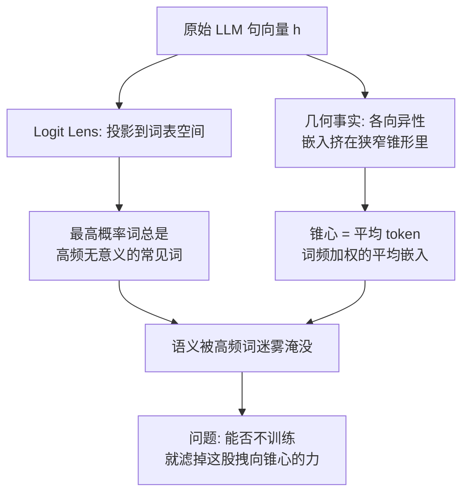
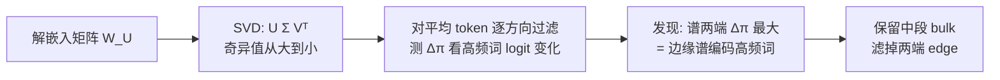

# 你的解嵌入矩阵，其实藏着一面照文本嵌入的特征透镜

> **原题**：Your UnEmbedding Matrix is Secretly a Feature Lens for Text Embeddings
> **作者**：Songhao Wu, Zhongxin Chen, Yuxuan Liu, Heng Cui, Cong Li, Rui Yan
> **机构**：中国人民大学高瓴人工智能学院（通讯作者 Rui Yan）；联想集团资助
> **年份**：2026（arxiv ID 2606.07502，提交于 2026 年 6 月 8 日；投稿 KDD）
> **分类**：cs.CL / cs.IR
> **链接**：https://arxiv.org/abs/2606.07502
> **精读日期**：2026-06-08

## 阅读须知

### 这篇在领域里的位置

要把这篇放对位置，得先讲清楚一件看似矛盾的事：今天的大语言模型几乎什么都会，可一旦让它直接当「文本嵌入模型」用，表现却常常不尽如人意。

所谓文本嵌入，指的是把一句话压成一个稠密向量，使得语义相近的句子，向量也相互靠近。这种向量是检索、聚类、语义匹配这一整套应用的地基。直觉上，一个读过海量文本、能写会答的大模型，理应能给出极好的句向量。但事实是，把大模型的隐藏状态直接拿来当句向量，在大规模文本嵌入基准上往往打不过那些专门训练过的小模型。

过去几年，业界为弥合这道落差，主要走的是「提示工程」这条路：通过精心设计的提示词，诱导大模型把语义浓缩进某个隐藏状态，再取出来当嵌入。代表方法有 PromptEOL、ECHO、MetaEOL、GenEOL 等。这条路是有效的，但它的改进幅度有限，而且对提示词的具体写法非常敏感，换一套设置结果就抖动。归根结底，这些方法是启发式的，没有触及「大模型为什么不擅长出句向量」这个根上的瓶颈。

这篇论文换了个打法。它不再在提示词上做文章，而是从机理可解释性入手，去回答那个根上的问题。它的切入点是一个被长期忽视的部件：解嵌入矩阵。这是大模型最后把隐藏状态映射回词表、给每个词算概率的那个矩阵，平时只在生成下一个词时被用到。作者发现，这个矩阵里藏着一面「特征透镜」，照出来的恰恰是大模型句向量出问题的原因。因此，这篇工作属于「用可解释性工具诊断并修复表示」这一类，与单纯调提示词的路线分属两个层面。

### 读完能回答什么

读完这份笔记，应当能回答下面这些问题。

第一，为什么把大模型的隐藏状态直接当句向量会「语义被淹没」，所谓的各向异性、以及「平均 token」是什么意思。

第二，Logit Lens 与 Logit Spectroscopy 这两件可解释性工具分别在做什么，作者如何用它们把问题定位到解嵌入矩阵的某个子空间上。

第三，什么是「边缘谱子空间」，为什么是奇异值最大和最小的那两端、而不是中间，在负责编码高频词。

第四，EmbedFilter 到底是一个什么样的变换，它为什么能在提升语义的同时「顺手」把嵌入维度降下来而不损失质量。

第五，这套方法的增益在强模型与弱模型上为何差距明显，这暗示了它的适用边界在哪里。

### 阅读前置

这份笔记假定读者熟悉 Transformer 的基本结构、知道什么是隐藏状态与词表 logits，并具备线性代数里矩阵、子空间、投影的基础概念。奇异值分解会在用到时先做一句话铺垫。它不假定读者专门做过文本嵌入或机理可解释性，凡这两个方向的专有概念都会先铺垫再展开。

### 首次出现的缩写表

- **文本嵌入**（text embedding）：把一段文字压成一个稠密向量，使语义相近者向量也相近。
- **解嵌入矩阵**（unembedding matrix，记作 $\bm{W}_{\mathcal{U}}$）：大模型末端把隐藏状态映射回词表、给每个词算 logit 的矩阵，常称语言模型头（LM head）。
- **零样本**（zero-shot）：不为目标任务做任何额外微调，直接拿来用。
- **各向异性**（anisotropy）：嵌入向量挤在一个狭窄的锥形区域里，彼此过度相似，而非均匀铺开。
- **Logit Lens**（对数透镜）：把模型的中间层表示直接投影到词表空间，看它「倾向于解码出哪些词」的可解释性工具。
- **Logit Spectroscopy**（对数谱分析）：Logit Lens 的推广，把表示投影到权重矩阵的谱分量（奇异向量）上，逐一衡量每个谱方向的贡献。
- **SVD**（Singular Value Decomposition，奇异值分解）：把一个矩阵拆成 $\bm{U}\Sigma\bm{V}^\top$，其中 $\bm{V}$ 的列是右奇异向量，$\Sigma$ 是从大到小排列的奇异值。
- **平均 token**（average token）：词频加权的平均嵌入，对应各向异性锥的质心。
- **边缘谱子空间**（edge spectrum subspace）：由奇异值最大与最小两端的右奇异向量张成的子空间，作者发现它在编码高频词。
- **主体谱**（bulk spectrum）：去掉两端、留在中段的奇异值方向。
- **MTEB**（Massive Text Embedding Benchmark）：覆盖语义相似、分类、聚类、检索等七类任务、共四十九个数据集的文本嵌入基准。
- **MTEB 上的提示工程基线**：PromptEOL、ECHO、MetaEOL、GenEOL，都是靠设计提示词从大模型里抽句向量的方法。
- **白化**（whitening）：一种对嵌入做去相关、归一化的校准操作，BERT-whitening 是代表。
- **过滤比率** $\tau$：EmbedFilter 的超参数，嵌入维度被降到原来的 $1/\tau$。

## （开场白）

把一个大语言模型当作句向量生成器，是一件听上去理所当然、做起来却常常碰壁的事。检索、聚类、去重、语义搜索，这些应用都建立在「把文本变成向量、再用向量间的距离衡量语义远近」之上。一个读过几乎全网文本的大模型，似乎天然就该是最好的句向量来源。然而真实情况是，直接取它的隐藏状态当向量，在公认的文本嵌入基准上，往往还比不过那些参数小得多、却专门训练过的旧模型。

这道落差不解决，会带来两类具体的麻烦。一类在效果侧：句向量质量不够，检索就召不准、聚类就分不开，下游应用整体受拖累。另一类在成本侧：大模型的隐藏维度动辄数千，把这样一个高维向量当索引存起来，既占存储，又拖慢检索时的距离计算。换句话说，大模型当嵌入用，眼下是「又不够好、又不够省」。

过去几年，主流的补救办法是在提示词上下功夫，想方设法诱导模型把语义压进某个隐藏状态。这条路确实能挤出一些改进，但它有两个绕不开的毛病。其一，改进有限且不稳定，提示词稍一改动，结果就跟着抖。其二，它始终停留在「外部诱导」的层面，没有回答一个更根本的问题：大模型内部到底是哪一环，把本该清晰的语义给搅浑了。

这篇论文的价值，正在于它把矛头对准了这个根本问题，并且给出了一个出乎意料的答案。作者发现，问题出在一个平时根本不会和「嵌入」联系到一起的部件上：解嵌入矩阵，也就是模型末端那个把隐藏状态翻译回词表的矩阵。他们用可解释性工具照进去，看到大模型的句向量有一种顽固的倾向，总是被往一小撮高频却没什么意义的词上拽。而把这股「拽力」从矩阵里定位出来、再干净地滤掉，句向量的语义就显出来了，并且嵌入维度还顺势降了下来。一个不需要任何训练、仅靠一次线性变换就能落地的方法，能同时把效果和效率两头都往前推，这是它值得一读的地方。

## 一、问题

承接开场白，把问题落到一个可验证的陈述上：大模型直接产出的文本嵌入，为什么在语义上表达力不足；这股「拽力」在模型内部的物理载体是什么；能否不经训练，仅用一个线性变换把它移除，从而让真正的语义浮现出来。

要看清这个问题，先要理解一个观察和一个几何事实。

观察来自一件反常的现象。作者借助 Logit Lens 这件工具去审视大模型的句向量。Logit Lens 的做法很直接：把一个中间表示，用解嵌入矩阵投影到词表空间，看它在哪些词上的解码概率最高，相当于追问「这个向量在内心里最想说哪些词」。按理说，一个好的句向量投影出来，最高概率的词应该和输入句子的语义相关。可作者看到的却是，不管输入是什么，排在最前面的总是那一小撮高频但没有信息量的常见词。如图所示，这一现象在 Qwen、Llama、Mistral 三个不同家族的模型上都成立，说明它是大模型的一种普遍模式，而非个例。换句话说，原始句向量被一层「高频词的迷雾」笼罩，真正承载语义的成分被压在了下面。

几何事实则解释了这层迷雾从何而来。早有研究指出，大模型的文本嵌入是各向异性的：它们并不均匀地散布在整个空间，而是挤在一个狭窄的锥形区域里，因此彼此天然就很相似。作者顺着这条线推断，这个狭窄锥形的质心，对应着一个「平均 token」，也就是在训练语料上按词频加权得到的那个平均嵌入。原始句向量之所以总往高频词上靠，正是因为它们都被这个「平均 token」往锥心拽，各自独特的语义因此被这份共性盖住。两件事一拼，问题的轮廓就清楚了：只要能找出并压制这个「平均 token」的贡献，就能缓解各向异性，把被淹没的语义解放出来。

前人面对这道落差，主要尝试过两类解法，各有得失。第一类是前面提到的提示工程，它做对的地方是无需训练、即取即用，做得不够的地方是改进有限、对提示词敏感，而且根本没碰到「平均 token」这个病根。第二类是嵌入校准，代表是 BERT 白化，它用一批校准数据估出嵌入的统计性质，再做去相关与归一化来对抗各向异性。它做对的地方是直击各向异性，做得不够的地方是依赖外部校准数据，等于把问题的答案外包给了一份额外的标注集。这篇论文要做的，是不借助任何校准数据，单从模型自己的解嵌入矩阵里，把那个负责制造高频词迷雾的子空间揪出来。

## 二、方法

这篇方法部分的逻辑是一条因果链：先把「平均 token」从解嵌入矩阵里反推出来，再用谱分析定位出是哪些谱方向在编码高频词，最后把这些方向滤掉。下面顺着这条链展开。

### 把句向量的标准流程摆清楚

先约定记号。目标是把一句话 $\bm{X}=[x_1,\dots,x_L]$ 变成一个稠密向量 $\bm{h}\in\mathbb{R}^{d}$，使向量间的相似度能反映语义相似度。具体做法是让句子过一遍大模型骨干，再用某种池化策略 $\operatorname{P}$ 把最后一层的输出聚合成 $d$ 维表示：

$$
\bm{h} = \operatorname{P}\big(\operatorname{LLM}([x_1,\dots,x_L])\big)
$$

关键在于，按惯例解嵌入矩阵只被用来把隐藏状态映射回词表、预测下一个词，在抽嵌入这件事上从来没人理会它。这篇论文的全部洞见，恰恰是把这个被忽视的矩阵重新请回了舞台中央。

### 反推「平均 token」

第一步，作者要把那个位于各向异性锥心的「平均 token」用解嵌入矩阵反解出来。

标准推理时，解嵌入矩阵 $\bm{W}_{\mathcal{U}}$ 把隐藏状态 $\bm{h}$ 映射成词表上的概率分布：$\bm{q}=\operatorname{Softmax}(\bm{h}\bm{W}_{\mathcal{U}}^\top)$。把 Softmax 反过来写，第 $i$ 个词的 logit 等于 $\log(\bm{q}_i)$ 再加上一个对所有词都相同的偏置项 $\bm{b}$。于是解码 $\bm{h}$ 的整条 logit 向量可以写成 $\bm{h}\bm{W}_{\mathcal{U}}^\top = \log(\bm{q})+\bm{b}$。借助解嵌入矩阵的 Moore-Penrose 伪逆 $\bm{W}_{\mathcal{U}}^{+}$（伪逆是对不可逆矩阵求「最接近的逆」的标准工具），就能把 $\bm{h}$ 从 logit 反解回来：

$$
\bm{h} = \big(\log(\bm{q})+\bm{b}\big)\bm{W}_{\mathcal{U}}^{+}
$$

接着，把这里的概率分布换成在语料上统计到的真实词频 $\hat{\bm{p}}$，反解出来的向量就是那个「平均 token」表示 $\hat{\bm{h}}$（偏置项 $\bm{b}$ 因为不改变谱性质而略去）：

$$
\hat{\bm{h}} = \log(\hat{\bm{p}})\,\bm{W}_{\mathcal{U}}^{+}
$$

由于这些模型的预训练数据并不公开，作者用开源语料 RedPajama 采样得到的词频 $\hat{\bm{p}}$ 作为真实词频的代理，并验证了换用别的语料结果一致。

### 用 Logit Spectroscopy 找出「边缘谱」

第二步，定位是解嵌入矩阵的哪些方向在把高频词写进嵌入空间。这里用到 Logit Spectroscopy，它是 Logit Lens 的谱版本。

先对解嵌入矩阵做奇异值分解：$\bm{W}_{\mathcal{U}}=\bm{U}\Sigma\bm{V}^\top$，其中 $\bm{V}$ 的每一列是一个右奇异向量，对应一个谱方向，$\Sigma$ 里的奇异值从大到小排列。对任意一个维度 $i$，Logit Spectroscopy 用一个滤子 $\bm{\Psi}_i=\bm{I}-\bm{V}_{[i]}\bm{V}_{[i]}^\top$，把表示在第 $i$ 个右奇异向量方向上的投影抹掉。把这个滤子作用到刚才反推的「平均 token」$\hat{\bm{h}}$ 上，得到扰动后的表示，再去看前 $k$ 个最高频词的 logit 被改变了多少，用一个累积量 $\Delta\pi^{(i)}$ 衡量。$\Delta\pi^{(i)}$ 越大，说明第 $i$ 个谱方向对高频词的表达贡献越大。

结果出人意料。当取 $k=100$ 时，$\Delta\pi$ 的值在谱的两端显著偏高，也就是说，奇异值最大和最小的那两端方向，才是负责编码高频词的。作者把这块区域称为「边缘谱子空间」，因为它由位于谱两端的右奇异向量张成。作为对照，低频词和随机词的 logit 对边缘谱远没有这么敏感。这就把那股拽向「平均 token」的力，精确地按在了边缘谱上。

### EmbedFilter：只留主体谱

第三步顺理成章。既然高频词的迷雾集中在边缘谱，那就把它滤掉、只保留中段的「主体谱」。作者把这个变换称为 EmbedFilter，形式上是一个投影矩阵 $\bm{\Phi}_\tau$，由去掉两端之后剩下的中段右奇异向量构成：

$$
\bm{\Phi}_\tau = \bm{V}[l_\tau:r_\tau]\,\bm{V}[l_\tau:r_\tau]^\top
$$

这里 $\tau$ 是预设的过滤比率，$l_\tau$ 与 $r_\tau$ 是中段所取列的起止下标。拿它对已有的嵌入做一次后处理，就得到提纯后的表示：

$$
\widetilde{\bm{e}}_i = \bm{e}_i\,\bm{\Phi}_\tau^\top
$$

整个操作的全部参数都来自解嵌入矩阵本身，无需任何额外训练。把提纯后的嵌入重新跑一遍 Logit Lens，原先霸榜的高频词被压了下去，和输入文本真正相关的词浮了上来。

### 顺手得到的降维

这套设计还白送了一个降维的好处。注意到 $\bm{V}$ 是正交矩阵，正交变换保距，于是对任意两个向量，用完整的 $\bm{\Phi}_\tau^\top$ 去变换、与只用中段的 $\bm{V}[l_\tau:r_\tau]$ 去变换，二者算出的距离完全相等：

$$
\big\|\bm{x}\bm{\Phi}_\tau^\top-\bm{y}\bm{\Phi}_\tau^\top\big\|_2 = \big\|\bm{x}\bm{V}[l_\tau:r_\tau]-\bm{y}\bm{V}[l_\tau:r_\tau]\big\|_2
$$

这意味着，可以直接把嵌入投到中段那 $1/\tau$ 维的子空间里，相似度计算分毫不差。换句话说，过滤比率 $\tau$ 一身二用：它既决定了滤掉多少边缘谱，又把嵌入维度压到原来的 $1/\tau$，从而把索引存储降到 $1/\tau$、把检索时的距离计算理论上加速 $\tau$ 倍。效果与效率，在同一个变换里一起拿到。

## 三、实验

### 设置

评测用的是 MTEB，这是文本嵌入领域最权威的综合基准，覆盖语义相似、分类、聚类、成对分类、重排序、检索、摘要七类任务，合计四十九个数据集（其中检索因算力所限取了八个数据集的子集）。骨干模型选了三个，横跨不同规模与家族：Qwen2.5 的零点五亿参数版、Mistral-7B-Instruct-v0.3、以及 Llama-3.1-8B-Instruct。基线是两种主流的提示工程抽嵌入法 PromptEOL 与 ECHO，EmbedFilter 作为后处理叠加在它们之上。

### MTEB 主结果

下表摘录主结果，数字是 MTEB 七类任务的平均分，括号内是 EmbedFilter 相对各自基线的相对增益，$\tau=2$ 表示维度同时被压到原来的一半。

| 骨干模型 | 基线方法 | 基线均分 | 叠加 EmbedFilter（τ=2） |
| --- | --- | --- | --- |
| Qwen2.5-0.5B | PromptEOL | 50.07 | 54.57（+9.0%） |
| Qwen2.5-0.5B | ECHO | 46.03 | 52.55（+14.1%） |
| Llama-3.1-8B | PromptEOL | 55.13 | 56.79（+3.0%） |
| Llama-3.1-8B | ECHO | 53.52 | 57.70（+7.8%） |
| Mistral-7B-v0.3 | PromptEOL | 49.47 | 51.50（+4.1%） |
| Mistral-7B-v0.3 | ECHO | 53.21 | 56.10（+5.4%） |

有两点值得拎出来。其一，叠加 EmbedFilter 在所有设置下都带来稳定提升，最高一档是 Qwen 上的 ECHO，提升达百分之十四点一，而这一切发生在嵌入维度被砍到一半的同时。其二，把过滤比率继续拉大到 $\tau=8$、也就是只留八分之一的维度，多数设置下仍然保持增益。与之相对，被叠加的提示工程基线本身在不同设置间是会抖动的，EmbedFilter 反而把表现稳住了。此外，它对更复杂的提示工程管线 MetaEOL、GenEOL 同样有效，而后者往往要反复调用昂贵的商用模型或聚合多个嵌入，EmbedFilter 则几乎不增加额外开销。作者还报告，借助 EmbedFilter 降维后的 Llama 嵌入，能以更小的维度，超过 SimCSE、coCondenser 这些大模型时代之前精心训练过的句向量基线。

### 关键消融

消融实验在 Qwen2.5-0.5B 加 PromptEOL、$\tau=2$ 上做，回答了三个最该问的问题。

第一，增益不是单纯降维带来的。作者拿两种同样把维度砍半的朴素做法做对照：一种是按 Matryoshka 的方式直接截取前一半维度，另一种是随机挑一半维度。这两种维度更少的做法都打不过原始的 PromptEOL，说明 EmbedFilter 的提升来自「滤掉了对的子空间」，而不是「维度变少了」。

第二，过滤策略里数 EmbedFilter 最优。作者对照了分别滤掉最大奇异值端、最小奇异值端、和中段的几种变体，结果保留中段、滤掉两端的 EmbedFilter 最好，而它的反操作（只留两端）最差。一个细节印证了前面的发现：只滤最小奇异值那一端，效果明显好于只滤最大那一端，这与 $\Delta\pi$ 分布里「最小端比最大端更倾向编码高频词」相吻合。

第三，它已逼近这套框架的理论上限。作者构造了一个「上界」配置，直接挑出 $\Delta\pi^{(i)}$ 最大的那些奇异向量来滤，相当于用任务信息精挑细选。结果 EmbedFilter 在不做任何针对性校准的前提下，与这个上界配置打得难分伯仲，却简单得多。

### 与白化的对照

作者还把 EmbedFilter 与嵌入校准的代表 BERT 白化做了正面对照。白化要靠一份校准数据（实验里用 NLI 数据集的监督）来估统计量，而 EmbedFilter 不用任何校准数据。在 Qwen、$\tau=2$ 的设置下，白化确有提升，但 EmbedFilter 在没有校准数据的情况下仍然胜出。作者由此论证，大模型的解嵌入矩阵在预训练阶段就已经捕获了有价值的统计特征，只是过去一直被忽视了。从理论角度看，EmbedFilter 也可被解读为在主体谱空间里做了一次类白化的操作，让嵌入在中段奇异值方向上的投影更加均匀，等于免费换来了一个相对各向同性的子空间。

## 四、局限

把局限分成作者自己点到的、与读完能看出来的两块。

作者自己点到的有几处。其一，方法整体偏启发式：边缘谱在两端是不对称的（最小端比最大端更显著），但 EmbedFilter 用一个对称的中段区间去截取，如何针对这种不对称做最优过滤，作者留给了未来工作。其二，「为什么中段奇异值方向恰好给出相对各向同性的子空间」这一现象背后的机理，论文只给了一个类白化的解读，没有深究。其三，受算力所限，检索类任务只评了八个数据集的子集，并非全量。

读完之后还能看出几条。

第一，增益随骨干变强而收窄。在最小的 Qwen 零点五亿参数模型上，提升高达百分之九到十四；而到了 Llama-8B，PromptEOL 一档只剩百分之三。这说明 EmbedFilter 更像是一帖给弱模型、小模型用的便宜补丁，把它们身上最严重的高频词偏差纠正过来；模型一旦本身就强，可纠正的空间便所剩不多。

第二，「平均 token」的反推是一个近似。它略去了偏置项，又因为预训练数据不公开，只能用 RedPajama 的词频做代理。锥心究竟在哪里，本质上是估出来的，而非精确测得。

第三，过滤区间的选取带着手工痕迹。中段的起止下标由单一比率 $\tau$ 控制，但在 Mistral 上作者不得不把整段下标手动偏移到 $l_\tau=128$，这暗示不同模型可能需要各自调一调边界，所谓「免调」并不完全成立。

第四，它只处理冻结嵌入的后处理，没有触及训练。论文明确希望这一发现能启发更有原则的嵌入训练方法，但本身止步于后处理，把「如何把这个洞见写进训练目标」留在了门外。

## 一句话

大模型的句向量总被一小撮高频词淹没，而这股拽力恰好藏在解嵌入矩阵谱的两端；EmbedFilter 只保留中段谱、滤掉两端，不训练就提纯了语义，还顺手把维度降到几分之一。
