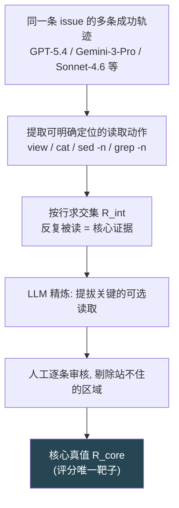
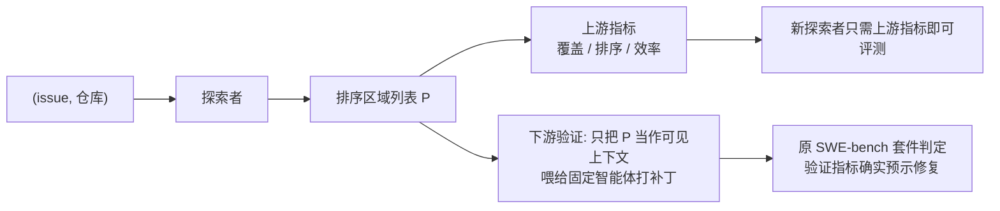

# SWE-Explore：把"探索代码仓库"从修 bug 里单独拆出来考

> **原题**：SWE-Explore: Benchmarking How Coding Agents Explore Repositories
> **作者**：Shaoqiu Zhang, Yuhang Wang, Jialiang Liang, Yuling Shi, Wenhao Zeng, Maoquan Wang, Shilin He, Ningyuan Xu, Siyu Ye, Kai Cai, Xiaodong Gu
> **机构**：上海交通大学；新疆大学；伊利诺伊大学厄巴纳-香槟分校；香港中文大学；独立研究者
> **年份**：2026（arxiv ID 2606.07297，提交于 2026 年 6 月 5 日；20 页 5 图）
> **分类**：cs.SE / cs.CL
> **链接**：https://arxiv.org/abs/2606.07297
> **精读日期**：2026-06-09

## 阅读须知

### 这篇在领域里的位置

要把这篇放对位置，先得交代清楚 coding agent（编码智能体）这一两年是怎么被评测的。

所谓编码智能体，指的是能自己读代码、改代码、跑测试，去解决一个真实软件项目里某个问题的 AI 系统。衡量它能力的主流标尺是 SWE-bench 这一类基准：给它一个真实仓库和一条 GitHub issue，让它产出一个补丁，再用项目自带的测试套件判定这个补丁到底有没有把问题修好。修好就算通过，没修好就算失败。这套"可执行、二元判定"的协议非常干净，让不同模型之间可以直接比高下，也正因为如此，过去两年它催生了 SWE-agent、AutoCodeRover、Agentless、OpenHands、Claude Code 等一大批框架，把"仓库级问题求解"做成了软件工程智能体的日常练兵场。

然而，这套二元协议既是它的长处，也是它最大的局限。一次修复尝试被压缩成一个"通过还是不通过"，这固然让模型可比，却把成功背后的机理整个盖住了。一个智能体修一条 issue，要顺次完成几件事：读懂相关代码、定位到出问题的地方、生成补丁、再验证补丁。一个笼统的 pass/fail 分数，没法告诉你究竟是哪一步成了、哪一步败了。退一步看，失败其实分两种：一种是它压根没探索到那段该改的代码，另一种是它读到了足够的线索却没能拼出正确的补丁。后一种，现成的可执行基准抓得住；前一种，几乎完全是隐形的。

这篇 SWE-Explore 要做的，正是把"前一种"从黑箱里单独拎出来，做成一张可比较的考卷。它属于近一两年逐渐成形的一条支线：不再只盯着最终修没修好，而是去解剖中间环节，比如上下文检索、代码定位、缺陷诊断。在这条支线里，已经有 ContextBench 给出人工标注的"黄金上下文"、有 SWE-Pruner 考上下文压缩。SWE-Explore 的独特之处在于，它把评测对象精确锁定在"仓库探索"这一个能力上，用行级别的真值去衡量智能体到底有没有把该读的代码读到。

### 读完能回答什么

读完这份笔记，应当能回答下面这些问题。

第一，为什么 SWE-bench 那种 pass/fail 的二元评测不足以衡量智能体的探索能力，把探索单独拆出来考有什么意义。

第二，SWE-Explore 把"仓库探索"形式化成了一个什么任务，所谓"在固定行预算下返回一个排序的代码区域列表"具体指什么。

第三，它的真值是怎么来的，为什么要从"多条成功轨迹的交集"里蒸馏，而不是请人手工标注。

第四，覆盖、排序、上下文效率这三类指标各自在量什么，为什么作者最后主张同时报告一组指标而不是压成一个分数。

第五，为什么现在的智能体"找对文件"已经很强、"找全代码行"却仍然很弱，这个召回瓶颈说明了什么。

### 阅读前置

这份笔记假定读者知道什么是代码仓库、GitHub issue、补丁与测试套件，对"用大模型驱动一个会调用工具的智能体"有基本概念。信息检索里的精确率、召回率、nDCG 等指标会在用到时先铺垫再展开。它不假定读者专门做过软件工程智能体或缺陷定位，凡这两个方向的术语都会先交代再使用。

### 首次出现的缩写表

- **coding agent**（编码智能体）：能自主读写代码、运行测试来解决软件问题的 AI 系统。
- **SWE-bench**：把"模型能否修好真实 GitHub issue"做成可执行 pass/fail 判定的仓库级基准，是本文要补足的对象。
- **仓库探索**（repository exploration）：在一个动辄上千文件的仓库里，找出与当前 issue 相关的那些代码的过程。
- **定位**（localization）：探索的一个子目标，把范围收窄到具体的文件、函数或代码行。
- **排序区域列表**（ranked region list）：探索的输出形式，一串按相关性从高到低排列的代码区域，每个区域是"文件路径 + 起止行号"。
- **行预算**（line budget）：评分时允许纳入的代码总行数上限，逼迫探索者既要找对、又要精简。
- **轨迹**（trajectory）：一个智能体为解决某条 issue 而执行的完整操作序列，包含它读过哪些文件、哪些行。
- **真值 / 标注**（ground truth）：评分所对照的标准答案，这里指"该读的核心代码区域"。
- **精确率 / 召回率 / F1**：找出来的里面有多少是对的（精确率）、该找的里面找到了多少（召回率）、二者的调和平均（F1）。
- **nDCG**（normalized Discounted Cumulative Gain，归一化折损累计增益）：信息检索里衡量排序质量的标准指标，奖励"有用的东西排在前面"。
- **HitFile / HitRegion**：文件级、区域级的命中率，衡量探索者有没有够到正确的文件或区域。
- **FUH**（First Useful Hit，首次有用命中）：第一个命中真值的区域排得有多靠前。
- **上下文效率**（context efficiency）：选出来的代码行里，有多大比例真正落在该读的范围内。

## （开场白）

设想一个编码智能体接到一条 issue，要在一个有上千个文件、几十万行代码的真实仓库里把某个 bug 修好。它真正要赢下的第一场仗，其实不是写补丁，而是"在这片汪洋里找到那几行关键代码"。一个仓库平均七百多个文件、近十八万行非测试代码，而真正与这条 issue 相关的，往往只有四五个文件里的四五个片段、合计一千多行。先把这一千多行从十几万行里捞出来，是后面一切的前提。

问题在于，今天主流的评测方式，恰恰把这场仗给隐藏了。SWE-bench 这类基准只看最后补丁过不过测试，是一个彻底的二元结果。这带来一个具体的麻烦：当一个智能体失败时，你无从知道它是"根本没找到该改的代码"，还是"找到了却没改对"。这两种失败，需要完全不同的改进方向，可二元分数把它们混成了一团。更要紧的是，"没找到"这种失败几乎是隐形的，因为没有任何指标去量"它到底把仓库探索到了什么程度"。

过去衡量"找代码"的办法也有，但都不够趁手。一类是经典的检索与缺陷定位，用 BM25、TF-IDF 这样的词法匹配，或者语义检索，从 issue 描述里去捞可能相关的文件。它们的评测目标通常是"查询和片段相不相关""哪个文件最可能有 bug"，granularity 停在文件或函数一层，没法告诉你具体哪几行被读到了。另一类是近来的定位智能体，能交互式地在仓库里搜索，但各家用的真值、口径都不一样，彼此之间没有一个公共的、精确到行的比较靶子。

于是问题就摆在这里：能不能造一张考卷，把"仓库探索"这一个能力，从端到端的修复里干净地剥离出来，让经典检索器、搜索智能体、长上下文选择器都在同一个精确到行的靶子上一较高下？SWE-Explore 给出的回答是：能，而且真值不必靠人海战术去标，可以从那些已经成功修好同一条 issue 的智能体轨迹里蒸馏出来。这正是它值得一读的地方：它把一个一直被结果掩盖的中间能力，变成了一个可测量、可比较、还能验证其确实影响下游成败的对象。

## 一、问题

承接开场白，把问题落到一个清晰的技术陈述上：能否构造一个基准，把"仓库探索"形式化为一个独立的、精确到行的排序任务，使得各类探索方法可以在同一靶子上比较；并且，这个靶子衡量的东西，要被证明确实驱动着下游的修复成败。

要看清这个问题的分量，先要理解现有评测的两道缺口。

第一道缺口在"粒度"。SWE-bench 把一次修复压成 pass/fail，这让模型可比，却把成功的机理盖住了。读相关代码、定位缺陷、生成补丁、验证修复，这四步里到底哪一步成了哪一步败了，二元分数一概不答。一旦退回到这个单一预测之前，两种失败模式就浮现出来：要么探索不到该改的代码，要么读够了线索却拼不出正确补丁。后者，可执行基准抓得住；前者，基本隐形。

第二道缺口在"靶子"。即便有不少工作开始研究智能体的定位与检索，它们之间却缺一个公共的、精确的比较标准。衡量文件级或函数级的定位，只能说明探索者有没有摸到"大致的街区"，没有任何指标能揭示究竟哪几行代码被探索到了。而修一个 bug，常常成败就系于某一个具体的片段。一个探索者可能够到了正确的文件，却恰好漏掉了那个决定性的跨度；也可能把正确的证据排在了一个很靠后的位置。这些差别，文件级的标签和最终的修复率都量不出来。

前人沿着两条路逼近过这个问题，各有得失。第一条是经典检索与缺陷定位，BM25、TF-IDF 是轻量基线，IR 式的缺陷定位则去猜哪个文件最可能出错。它们做对的地方是便宜、无需训练，做得不够的地方是目标停在"查询与片段相关性"或"缺陷文件相关性"，而不是"成功修复过程中真正被查阅的那些代码行"。第二条是近来的定位智能体，从静态检索走向交互式探索，AutoCodeRover 把大模型推理、代码搜索与程序分析结合起来，LocAgent、OrcaLoca、CoSIL 则分别在文件、函数、排序实体、迭代代码图搜索上做定位。它们做对的地方是把探索变成了多步交互，做得不够的地方是各家口径不一，缺一个把词法检索器、稠密检索器、重排器、探索智能体都放进来、按"排序的行级区域生产者"统一比较的靶子。

SWE-Explore 要填的，正是这道缺口：一个把"轨迹蒸馏出来的行级探索质量"与"它对下游修复的实际影响"放在同一批实例上联合测量的基准。

```mermaid
flowchart TD
    A[一条 issue + 一个上千文件的仓库] --> B[编码智能体要顺次完成四步]
    B --> C[探索: 找到相关代码]
    B --> D[定位: 收窄到具体位置]
    B --> E[打补丁]
    B --> F[验证]
    C --> G{SWE-bench: 只看最后 pass/fail}
    D --> G
    E --> G
    F --> G
    G --> H[失败时分不清<br/>是没探索到 还是没改对]
    C --> I[SWE-Explore: 把探索单独拎出<br/>做成行级可比的考卷]
    style I fill:#2a9d8f,color:#fff
    style G fill:#aaa,color:#fff
```

## 二、方法

SWE-Explore 的设计可以拆成三件事：把探索定义成一个什么任务、真值从哪里来、用什么指标去评分。下面依次展开。

### 任务定义

SWE-Explore 把"仓库探索"形式化成一个独立的功能。给定一条 issue $q$ 和一个仓库快照 $\mathcal{R}$，探索者要返回一个排序的相关代码区域列表：

$$
f:(q,\mathcal{R})\;\mapsto\;P=(r_1, r_2, \ldots, r_K)
$$

其中每个区域 $r_i=(p_i, s_i, e_i)$ 由一个文件路径 $p_i$ 和一个行区间 $[s_i, e_i]$ 构成。关键在于，这个任务故意定得很轻：探索者不需要产出任何补丁，不能访问真值，也不要求真的去和仓库交互。这样一来，稀疏检索器、交互式智能体、长上下文选择器，就都能被当作"同一种排序区域列表的生产者"，在固定的行预算下放到一起比较。换句话说，它把五花八门的探索方法，收敛到了同一个输出格式上。

### 真值从成功轨迹里蒸馏

一个仓库级 issue 的"该读哪些代码"，若靠人手标注，既昂贵又难统一：上百条 issue 横跨十种语言，不同标注者对辅助函数、配置、测试的边界会划得各不相同。SWE-Explore 换了个办法，从"已经成功解决了同一条 issue 的智能体轨迹"里把真值蒸馏出来。

具体而言，它只保留那些至少有两条成功修复轨迹的实例，这些轨迹来自 GPT-5.4、Gemini-3-Pro、Sonnet-4.6、GLM-5.1、Kimi-K2.6 等当下的强模型。之所以要求至少两条，是因为后面要用"不同求解路径之间的一致性"来当核心证据的信号。过了这道筛子，最终留下 848 个实例，横跨 10 种语言、203 个开源仓库。平均每个实例有 4.3 个真值文件、4.7 个区域、1578 个可见行，而它们所嵌的仓库平均有 759 个文件、近 18 万行非测试代码。

蒸馏的步骤是这样的。先从每条轨迹里收集所有能明确对应到"文件加行区间"的读取动作，包括编辑器式的查看、命令行的 cat/head/tail/sed -n、以及 grep -n 的行命中；那些没法明确映射的自由式终端交互则直接丢弃，宁可漏掉也不靠启发式去硬扩。然后对多条轨迹做按行求交集，得到一个保守的核心候选 $R_{\text{int}}$，理由是：被不同求解路径反复读到的区域，更可能是真正承载证据的核心上下文。接着用一个基于大模型的精炼步骤，把少数虽不在交集里、却对解决该 issue 起关键作用的"可选读取"提拔进来。最后，作者对每一份精炼后的真值逐条人工审核，剔除站不住脚的区域，得到最终的核心真值 $R_{\text{core}}$。

### 指标族

有了真值，下一个问题是怎么给探索者的排序列表打分。SWE-Explore 沿三个维度设计了一组指标。

第一维是覆盖与准确。在行的层面定义精确率与召回率：精确率是"选出来的行里有多大比例落在真值里"，召回率是"真值的行里有多大比例被选到"，F1 是二者的调和平均。此外还报告两个更粗的命中率，HitFile 衡量有没有够到正确的文件，HitRegion 衡量有多少核心区域至少被一个预测区域覆盖到，它们刻画的是"哪怕行区间不精确、至少蹭到了对的代码"这件实践中很要紧的事。

第二维是预算下的排序。作者把信息检索里的 nDCG 改造到"行预算"的设定下：每个预测区域的增益等于它覆盖的核心行数，按预测顺序依次累加、并按排名打折扣，只累计到累积行数不超过预算 $B$ 的那一段前缀为止。

$$
\textsc{DCG@}B = \sum_{i\in P_{\leq B}}\frac{g_i}{\log_2(i+2)}
$$

再用同一实例、同一预算下能达到的最佳 DCG 去归一化，得到 nDCG@B。用行预算而不是排名截断的好处是，一个又长又啰嗦、把预算耗光却没带来相应增益的区域，会和"干脆漏掉有用内容"一样受到惩罚。作者还报告一个 FUH（首次有用命中），衡量第一个命中真值的区域排得有多靠前，越靠前说明探索者越早把有用证据顶了上来。

第三维是效率与噪声。上下文效率衡量"预测的可见行里，有多大比例落在核心或可选证据内"，量的是选出来的上下文有多少是真材实料、有多少是跑偏的。噪声率则反过来，衡量有多少预测区域既不沾核心、也不沾可选，作为一个区域级的诊断量。

### 用下游修复来验证指标

上面这些指标都是"上游"的，它们衡量探索本身的质量。但作者还要回答一个更根本的问题：探索分数高，真的就能换来更好的修复吗？为此他们构造了一个一次性的"受限上下文环境"：拿到某个探索者的输出之后，把仓库里除这些选中区域以外的一切全部遮住，只把这点上下文喂给一个固定的编码智能体去打补丁，再用原来的 SWE-bench 测试套件判定。需要强调的是，这个下游桥接只是对指标的一次性合理性检验，并不进入标准评测流程，一个新的探索者只用上游指标就能被评测。

## 三、实验

### 设置

参评的探索者分四类。两个基线圈定动态范围：Oracle 直接返回核心真值（上界），Random 均匀随机返回区域（下界）。稀疏检索器有 BM25 与 TF-IDF。轻量稠密检索用一个基于 Potion（一种从句向量模型蒸馏出来的静态词向量检索器）的 RAG 流水线。最后是探索智能体，涵盖五个通用编码智能体（Claude Code、Codex、OpenHands、Mini-SWE-Agent、AweAgent）和四个学术界的定位智能体（AutoCodeRover、LocAgent、OrcaLoca、CoSIL）。每个探索者被要求返回最相关的五个区域，即 $K=5$，这与真值平均 4.7 个核心区域的规模相匹配。主报告指标选了精确率、nDCG@500、HitFile、上下文效率这四个与下游相关性高、彼此冗余低的量。

### 指标确实预示修复

先看那次下游验证。作者把每个探索者的输出当作唯一可见上下文，喂给一个固定的打补丁智能体，统计修复率，再算每个上游指标与这个修复率的相关系数。结果相当干净：上下文效率的皮尔逊相关最高，达到 0.950，说明有用的上下文必须既相关又紧凑；而紧预算下的早期召回 Rec@100 是最强的秩相关信号（斯皮尔曼 0.845），说明"在很紧的行预算内就把证据覆盖到"特别能预示修复成败。HitFile、HitRegion、FUH 也都是很强的信号。这组相关性，给"用上游探索指标当主评测"提供了底气。

下游修复率本身也很说明问题（GPT-5.4 配 Mini-SWE-Agent，$K=5$）。

| 探索者 | 下游修复率（%） |
| --- | --- |
| Oracle（上界） | 59.7 |
| CoSIL | 59.3 |
| Codex | 50.3 |
| Mini-SWE-Agent | 50.0 |
| Claude Code | 48.0 |
| OpenHands | 47.7 |
| AutoCodeRover | 44.7 |
| TF-IDF | 26.0 |
| RAG（Potion） | 23.3 |
| BM25 | 12.7 |
| Random | 4.7 |

可以看到，探索智能体（44 到 59）整整高出稀疏检索器（12 到 26）一个档次，而 CoSIL 几乎追平了 Oracle。

### 探索质量：找对文件容易，找全行难

下表摘录各探索者的上游质量（$K=5$，所有智能体均由 GPT-5.4 驱动）。Rec ℓ 是行级召回，箭头向下表示越低越好。

| 探索者 | 精确率 | 行级召回 | F1 | HitFile | nDCG@500 | 上下文效率 |
| --- | --- | --- | --- | --- | --- | --- |
| Oracle | 1.000 | 0.953 | 0.964 | 0.923 | 0.858 | 1.000 |
| BM25 | 0.055 | 0.021 | 0.024 | 0.079 | 0.132 | 0.087 |
| TF-IDF | 0.117 | 0.049 | 0.054 | 0.140 | 0.223 | 0.190 |
| OpenHands | 0.489 | 0.179 | 0.209 | 0.645 | 0.867 | 0.737 |
| AweAgent | 0.577 | 0.140 | 0.182 | 0.682 | 0.954 | 0.829 |
| Claude Code | 0.598 | 0.154 | 0.202 | 0.667 | 0.938 | 0.829 |
| AutoCodeRover | 0.680 | 0.233 | 0.291 | 0.280 | 0.720 | 0.738 |
| **CoSIL** | 0.581 | **0.788** | **0.602** | 0.544 | 0.824 | 0.898 |

这张表里藏着这篇论文最重要的几个发现。

其一，探索智能体明显高出非智能体检索一个台阶。BM25、TF-IDF 和那个轻量稠密检索，在多数指标上仍贴着 Random，而每一个探索智能体都远在它们之上。这说明仓库探索没法靠一次性的词法或向量检索就拿下，多步交互已是够到现代智能体那个水平的必要条件。

其二，低 F1 主要是召回的问题。尽管通用编码智能体的文件命中率和排序分都很高，它们的行级召回却只停在 0.14 到 0.19。换句话说，它们往往很早就找到了看似对的文件，却漏掉了覆盖完整真值所需的许多具体片段。够到正确的"街区"不难，把街区里该读的"门牌"全部读到才难，而这正是当前探索者的中心瓶颈。

其三，换更强的底座模型，能挪动操作点，却挪不走瓶颈。作者固定 Mini-SWE-Agent 这个脚手架、只换底层大模型，GPT 系列最强，Kimi 与 Sonnet 居中，GLM 与 Gemini 在覆盖和排序上偏弱；但跨所有模型，文件命中始终远高于行级召回。这意味着，单换一个更强的模型并不能消除探索瓶颈，高召回的区域发现，要靠更好的探索机制，而非更强的打补丁模型。

其四，通用编码智能体彼此像得出奇。Claude Code、Codex、OpenHands、Mini-SWE-Agent、AweAgent 在覆盖、排序、效率上几乎落在同一个操作点：高文件命中、高早期排序、紧凑上下文、低行级召回。它们实现与脚手架的复杂度各不相同，输出却如此接近，暗示研究探索这个子问题并不一定需要一套复杂的修复框架，一个更简单的探索接口就能暴露出大部分相同的行为。

其五，专门的定位器只在"拓宽搜索"时才真正占优。AutoCodeRover 精确却保守，OrcaLoca 噪声极低却漏掉很多相关区域，LocAgent 更像通用智能体而没改变召回前沿。唯一的例外是 CoSIL：它拿下了远超其他非 Oracle 方法的行级召回（0.788）与 F1（0.602），说明它那套迭代式的代码图搜索，是高召回探索的一个关键部件。相比之下，更依赖 shell 式导航或窄搜索动作的探索者，往往够到了正确文件，却在行级证据上覆盖不足。

### 缺证据比掺噪声更致命

最后一个受控实验问了一个很实用的问题：打补丁的智能体，是更怕"缺少相关上下文"，还是更怕"掺进无关上下文"？作者在受限环境里，把 Oracle 的核心上下文按比例只暴露一部分（缺失条件），或者把删掉的预算用随机的非核心区域填回去（冗余条件），然后扫这个比例。

结论是，缺失上下文才是主导的失败模式。修复率并不是随每多给一个区域而平滑上升，而是呈现门槛式：在核心证据凑够之前一直很低，到了某个点附近才猛地跳上去。这说明，几块核心证据必须同时在场，正确的修复才变得可能。而一旦过了这个门槛，冗余就没那么伤了，掺进来的无关代码，现代打补丁模型大体能容忍。归根结底，在高覆盖的区间里，缺核心证据远比丢一点精确率更要命，因此面向召回的改进，比小幅的过滤增益更有价值。

## 四、局限

把局限分成作者自己点到的、与读完能看出来的两块。

作者自己点到的有几处。其一，真值是从当下强模型的成功轨迹里蒸馏的，本质上是"这些智能体读了什么"的行为信号，而非一个与模型无关的金标准；作者用多轨迹交集加人工审核来缓解，但它终究带着行为色彩。其二，空上下文基线要小心：在不给任何仓库上下文时，模型可能靠"只看 issue"的先验作答，反而显得不低，这种由记忆带来的虚高需要谨慎解读。其三，那个下游修复桥接只是一次性的指标合理性检验，并不进入标准评测。

读完之后还能看出几条。

第一，真值的循环性值得警惕。既然标准答案由"成功智能体读过的代码"定义，那么一个读法不同、却同样能修好 issue 的探索者，就可能被这套真值低估。多轨迹交集与人工审核压低了这种风险，却没有根除它。CoSIL 那远高于同侪的召回，某种程度上也提示，其他方法的"低召回"可能部分反映的是读取风格，而非真的失败。

第二，"至少两条成功轨迹"这道筛子，把基准偏向了当前强模型已经能解决的 issue，而那些连强模型都搞不定、探索最吃紧的硬骨头，恰恰被排除在外。换句话说，这张考卷量的是"在可解的题目上探索得好不好"，未必覆盖最难的探索场景。

第三，主表里所有探索智能体都由 GPT-5.4 驱动，这把"探索器的设计"和"底座模型"搅在了一起。作者用单换模型的那张表做了部分剥离，但探索机制与模型能力的纠缠并没有被完全拆开。

第四，$K=5$ 是固定的，而真值区域最多能到 15 个；对那些需要读更多片段的 issue，固定返回五个区域本身就给召回设了一个天花板。

## 一句话

把"仓库探索"从修 bug 里单独拆出来，用多条成功轨迹蒸馏出行级真值，做成一张排序的考卷；结果发现现在的智能体找对文件已经很强、找全代码行却仍很弱，而缺核心证据远比掺无关上下文更伤修复。
