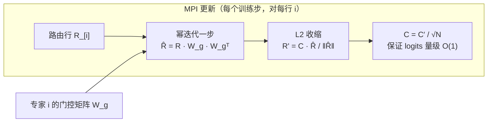
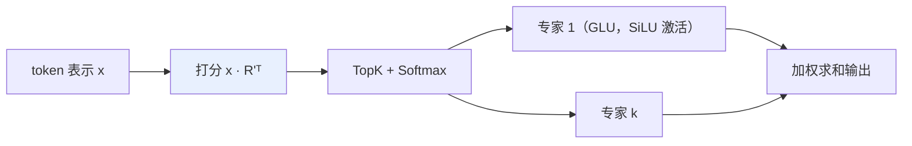

# 用流形幂迭代重新设计混合专家路由器

> **原题**：Redesign Mixture-of-Experts Routers with Manifold Power Iteration
> **作者**：Songhao Wu, Ang Lv, Ruobing Xie, Yankai Lin
> **机构**：摘要页未标注
> **年份**：2026（arxiv ID 2606.12397）
> **分类**：cs.LG / cs.AI / cs.CL
> **链接**：https://arxiv.org/abs/2606.12397
> **精读日期**：2026-06-11

## 阅读须知

**这篇在领域里的位置。** 混合专家（MoE，Mixture-of-Experts）是当下大模型扩参数而不等比扩计算的主流架构：把前馈层复制成 N 份"专家"，每个 token 只激活其中少数几份，由一个叫路由器（router）的小模块决定激活谁。过去几年围绕 MoE 的研究大多落在三个方向上：负载均衡（怎么避免所有 token 挤向少数专家）、训练稳定性（路由的离散选择如何与梯度下降相处）、以及专家的切分粒度。与这三条热线相比，路由器本身的参数化方式反而很少被追问：它几乎从一开始就是一个普通的线性层，一直沿用至今。这篇论文做的事情，是回到这个最不起眼的组件，给它的权重补上一条有线性代数依据的设计原则，并配一个开销近乎为零的在线更新算法。

**读完能回答什么：**

1. 标准 MoE 路由器的线性打分在什么意义上"缺少设计原则"，这会带来什么实际问题；
2. 为什么把路由器的行向量对齐到对应专家权重矩阵的主奇异方向，是一个合理的归纳偏置；
3. Power-then-Retract 两步更新各自做什么，为什么去掉任何一步都不行；
4. 路由行向量的范数常数 C 为什么要按专家数 N 的平方根倒数来缩放；
5. 这套改动在训练与推理上各付出多少额外开销，换来了哪些可量化的收益。

**阅读前置。** 假定读者熟悉 Transformer 的基本结构、知道 MoE 的 TopK 路由是怎么一回事，并对奇异值分解有概念性的了解；不预设读者读过任何路由器设计的专门文献，也不预设读者熟悉 Muon 这一类较新的优化器。

**首次出现的缩写表：**

- **MoE**（Mixture-of-Experts，混合专家）：把前馈层换成多个并行"专家"、按 token 稀疏激活的架构。
- **MPI**（Manifold Power Iteration，流形幂迭代）：本文提出的路由器更新方法，幂迭代加范数收缩两步。
- **SVD**（Singular Value Decomposition，奇异值分解）：把任意矩阵分解为旋转、缩放、旋转三步的标准分解；主奇异方向即对应最大奇异值的方向。
- **GLU / SiLU**：Gated Linear Unit（门控线性单元）与 Sigmoid Linear Unit（一种平滑激活函数），本文专家采用的内部结构与激活。
- **AdamW / Muon / MuonH**：三种优化器。AdamW 是当前默认；Muon 是基于矩阵正交化的较新优化器；MuonH（Hyperball 变体）在 Muon 之上加权重范数约束，是本文大规模实验选用的一种。
- **FineWeb-Edu**：教育质量过滤后的开源网页预训练语料。
- **MaxVio**：负载均衡指标，衡量最忙专家偏离均匀负载的程度，越低越均衡。
- **PPL / bpb**（perplexity / bits per byte，困惑度 / 每字节比特数）：语言建模质量指标，越低越好。

## 一、问题

先讲清楚为什么这个问题值得做。一个 MoE 层里，路由器拿到 token 的表示向量 x，与一个 N 行 D 列的权重矩阵 R 做内积，得到 N 个分数，TopK 之后做 Softmax，决定这个 token 交给哪几位专家、各占多大权重。整个 MoE 的成败都压在这一步上：分错了专家，token 就被一个不擅长它的子网络处理。然而 R 的第 i 行凭什么能代表第 i 个专家？标准做法里没有任何机制保证这一点。R 与专家一样随机初始化、一样跟着任务损失做梯度下降，两者之间的"代表"关系完全靠训练自己悟出来。作者把这个现状概括为：路由行向量本应是对应专家的"代表向量"（representative vector），让 x 与它的内积能反映 token 与专家的契合度，但现行设计里"不存在任何强制这种信息浓缩的设计原则"。

这个缺口的代价有两层。其一是收敛：训练早期路由器与专家互相都没成形，路由分数接近噪声，token 被随机指派，专家学到的东西又反过来污染路由器的梯度，于是互相拖慢。其二是能力上限：即便训练收敛，路由器也可能停在一个"分得开但分得不准"的解上，专家分工的质量直接封顶了模型的下游表现。与此同时，过去的路由器改进工作多在打分函数的形式（softmax 还是 sigmoid、加不加噪声）或者均衡损失的设计上做文章，很少有人回头追问 R 本身的几何应当长什么样。这篇论文恰好站在这个空位上：不改打分形式、不加辅助损失，只约束 R 的每一行落在哪个方向上。

## 二、方法

方法的出发点是一条线性代数里的老结论。任何矩阵的主奇异方向，也就是对应最大奇异值的那个方向，是单个向量所能保留的该矩阵信息密度最高的方向；换句话说，如果只允许用一个向量来"压缩"一个矩阵，主奇异方向是最优选择。作者由此提出设计原则：让路由器的第 i 行 R_[i] 对齐到第 i 个专家权重矩阵（默认取专家内部的门控矩阵 W_g）的主奇异方向。形式上这等价于最大化一个瑞利商，即 ‖R_[i] W_g‖² 与 ‖R_[i]‖² 之比：比值越大，说明这一行越贴近专家矩阵能量最集中的方向。

直接做 SVD 求主奇异方向当然可以，但每一步训练对每个专家都做一次完整分解，开销不可接受。于是作者用了数值线性代数里最古老的近似手段之一：幂迭代（power iteration）。它的原理是，反复用矩阵去乘一个向量，向量会越来越偏向该矩阵的主奇异方向。MPI 每个训练步只做一次这样的乘法：

第一步（Power，幂迭代）：R̂_[i] = R_[i] · W_g · W_g^T。一次矩阵向量乘，把这一行朝主奇异方向推一小步，完全不必算 SVD。

第二步（Retract，收缩）：R'_[i] = C · R̂_[i] / ‖R̂_[i]‖。幂迭代会让向量范数膨胀（被最大奇异值反复放大），不加管束迟早数值爆炸，而且不同专家的奇异值大小不一，范数差异会变成系统性的路由偏置。于是把每一行都拉回到同一个固定范数 C 上，相当于把更新约束在一个球面（流形）上进行，这也是方法名里"流形"二字的来由。

常数 C 不是随手定的。要让路由 logits 的量级保持在 O(1)，使 Softmax 不饱和也不失真，作者推出 C 应当按 Θ(1/√N) 缩放，其中 N 是专家数；实际使用时写成 C = C' / √N，把 C' 变成一个对专家数不敏感、可跨规模迁移的超参数。理论一侧，论文进一步证明这个 Power-then-Retract 更新近似等价于在最大投影约束下、带自适应步长的流形最速上升：行向量越贴近主奇异方向，更新自动越保守，无需外加学习率调度，自带刹车。

更新好的各行拼回完整的路由矩阵 R'，之后的前向与任何标准 MoE 完全一致：算分、TopK、Softmax、加权汇总专家输出。整套机制对优化器不挑剔，与 AdamW、Muon 等都能直接组合。

开销方面，训练吞吐只降百分之零点二（11B 模型从每天 349.7 亿 token 降到 349.3 亿）；推理则完全零开销，因为路由权重在加载模型时已是更新后的最终值，推理路径上没有任何新增计算。

## 三、实验

实验分三个规模铺开：1B 模型用 1000 亿 token 做优化器对照，3B 模型用 2000 亿 token 做消融、3500 亿 token 的 FineWeb-Edu 做主预训练，11B 模型同样用 3500 亿 token 预训练并追加 1000 亿 token 的 Olmo 中期训练。值得一提的是基线的选法：作者没有与其他路由器变体正面对比，理由是 MPI 不改变路由器的标准形式，与那些工作在理论上正交、可以叠加，于是对照组就是"同配置但不开 MPI"的原版 MoE，干净地隔离出这一个变量的贡献。

主要数字如下。1B 规模上，MuonH 优化器配 MPI 把预训练损失压低 0.013，25 个下游任务的平均分从 42.78 升到 43.98，并且在 AdamW、Muon、AdamH 等其余优化器上方向一致。大规模的对照集中在 3B 与 11B：

| 任务 | 3B 基线 | 3B + MPI | 11B 基线 | 11B + MPI |
|------|---------|----------|----------|-----------|
| ARC-C | 55.91 | 58.96 | 61.54 | 62.24 |
| MMLU | 47.01 | 48.83 | 50.00 | 50.93 |
| BBH | 29.53 | 30.99 | 31.17 | 31.45 |
| GSM8K | 16.22 | 20.92 | 17.89 | 27.60 |
| 验证集 bpb | 0.764 | 0.754 | 0.728 | 0.723 |

表里最扎眼的一格是 11B 的 GSM8K：从 17.89 跳到 27.60，将近十个百分点，远超其他任务上一两个点的常规增益。数学推理对"对的 token 进对的专家"似乎格外敏感，论文没有就此深挖，但这一格是整张表里最值得记住的数字。负载均衡也顺带变好：3B 模型的 MaxVio 批内指标从 1.133 降到 1.024，全局指标从 0.964 降到 0.711，而这并非任何均衡损失的功劳，作者推测是收缩步抹平了各行范数差异的副产品。

消融实验回答了"两步是否都必要"。只做范数归一化、不做幂迭代，与原版 MoE 没有任何差别，说明增益确实来自向主奇异方向的对齐而非单纯的范数控制；反过来，只做幂迭代、不做收缩，AdamW 与 Muon 直接训练不稳定，梯度尖刺、范数发散，换 MuonH 虽能压住表面症状，损失仍然高出 0.003。超参数 C' 在 1 到 8 之间扫过，验证集困惑度在 C' 等于 4 时最优（0.8533，对比 C' 等于 1 时的 0.8896），且这个取值不经调整直接搬到 11B 也不塌，敏感度可控。还有一个反直觉的发现：把幂迭代从一步加深到十步，对齐度确实更紧了，但吞吐掉了百分之五，下游平均分反而跌了 1.39 分；一步浅对齐胜过十步深对齐，作者承认对此尚无完整解释。

## 四、局限

作者自己承认的边界有这么几条。其一，上面那个"一步胜过十步"的现象只有经验观察，没有理论解释，留作未来工作。其二，负载均衡的改善同样只是观察加猜测，归因到收缩步上并未严格论证。其三，幂迭代默认只用专家的门控矩阵 W_g，换成其他矩阵差别不大，但矩阵组合的空间没有探索。其四，实验最大只到 11B 参数、3500 亿 token，万亿参数规模上是否成立只能寄望外推。

读者站在论文之外还能看出几处值得留意的地方。没有与其他路由器改进工作正面交锋，"理论上正交"是合理的辩护，但叠加之后是否仍有增益、增益是否重复计算，终究需要实验说话。预训练对照各规模只跑了一次，没有多种子重复，0.005 这个量级的 bpb 差异有多少统计稳健性无从判断。此外全部实验都是从零预训练，对于已经训完的存量 MoE 模型，MPI 能否在继续训练或微调阶段补救一个已经定型的路由器，论文没有触及，而这恰恰是工业界最关心的使用场景。

## 一句话

给 MoE 路由器补上设计原则：用一步幂迭代加范数收缩，把路由行向量在线对齐到专家矩阵的主奇异方向，训练开销千分之二，推理零开销，1B 到 11B 一致涨点。
