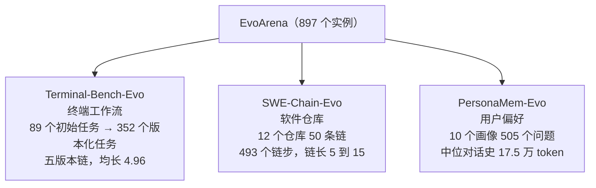
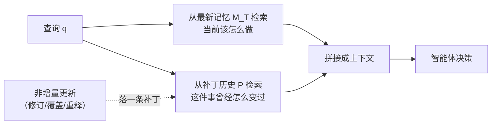

# EvoArena：让智能体的记忆跟上环境的演化

> **原题**：EvoArena: Tracking Memory Evolution for Robust LLM Agents in Dynamic Environments
> **作者**：Jundong Xu, Qingchuan Li, Jiaying Wu, Yihuai Lan, Shuyue Stella Li, Huichi Zhou, Bowen Jiang, Lei Wang, Jun Wang, Anh Tuan Luu, Caiming Xiong, Hae Won Park, Bryan Hooi, Zhiyuan Hu
> **机构**：摘要页未标注
> **年份**：2026（arxiv ID 2606.13681）
> **分类**：cs.CL
> **链接**：https://arxiv.org/abs/2606.13681
> **精读日期**：2026-06-12

## 阅读须知

**这篇在领域里的位置。** 大模型智能体的评测这几年走过了一条从"答题"到"做事"的路：WebArena 考网页操作，SWE-bench 考改代码，GAIA 考带工具的综合任务。但这些基准有一个共同的隐含假设，即环境是一张冻结的快照，任务做完一次便是终点。与之相对地，真实部署里的智能体面对的是同一个环境的持续演化：接口在改版，依赖在升级，代码库在长出新的里程碑，用户的偏好也在悄悄换边。另一条相关的线是智能体的记忆系统，Mem0、A-Mem 这一类工作让智能体把经验沉淀下来，但沉淀的方式几乎都是"合并到最新状态"。这篇论文同时站在这两条线的缺口上：评测一侧造了一个专门考"环境演化"的基准 EvoArena，方法一侧提出把记忆当版本库来管的 EvoMem。

**读完能回答什么：**

1. 静态快照式的基准为什么测不出智能体在部署中最常见的那类失败；
2. 记忆系统的"状态坍缩"指什么，它如何让智能体连同上下文一起丢掉仍然有效的旧规则；
3. EvoArena 的三个域各自模拟哪一类环境演化，链级准确率为什么比步级准确率更能说明问题；
4. EvoMem 的补丁记录里存了哪六样东西，检索时如何与最新记忆拼在一起用；
5. 哪些场景从补丁历史中获益最大，哪些场景几乎不受益甚至轻微倒退。

**阅读前置。** 假定读者知道 LLM 智能体的基本回路（观察、思考、调用工具、获得反馈），用过或听说过 SWE-bench 一类的代码智能体评测；不预设读者研究过智能体记忆系统，所有记忆机制从零讲起。

**首次出现的缩写表：**

- **EvoArena / EvoMem**：本文提出的基准与记忆方法。Arena 一侧考环境演化，Mem 一侧管记忆演化。
- **GAIA / LoCoMo**：两个既有基准。GAIA 考带工具的通用助手任务，LoCoMo 考超长对话里的记忆问答。
- **SWE-bench / OpenHands**：前者是基于真实 GitHub issue 的代码修复评测，后者是开源的代码智能体框架，本文在软件域用它做载体。
- **Terminus2**：终端操作智能体框架，本文在终端域的载体。
- **Mem0 / A-Mem**：两个现有记忆系统，代表"把经验合并成最新状态"的主流做法；A-Mem 同时是本文用户偏好域的载体。
- **Fail-to-Pass / Pass-to-Pass**：代码评测的两类测试。前者修复后应当由挂转过，后者本来就过、修复后不许挂，是回归的探针。

## 一、问题

先说为什么这个问题值得做。想象一个已经上线半年的运维智能体：它学会了用某个内部 CLI 部署服务，把步骤牢牢记进了自己的经验库。某天平台升级，鉴权方式换了，旧命令带新参数才能用。对一个人类工程师，这是十分钟的适应；对一个把经验"合并成最新状态"的智能体，这却可能是灾难的开始，因为它要么固执地重放旧流程，要么在新经验覆盖旧经验时，把"旧版本环境里旧流程仍然有效"这一层信息连根抹掉。论文把后一种失败命名为状态坍缩（state collapse）：记忆永远只有一份"现在"，没有"过去"，也没有"过去为什么变成现在"。

评测一侧的问题是对称的。现有基准几乎都在冻结的环境快照上打分，于是上面这类失败根本无从暴露。GAIA2、HorizonBench 这一类较新的工作开始引入时效性或一次性的偏好变更，但很少有基准把"同一环境连续演化五到十五个版本"这件事当成主角。换句话说，业界一直在考智能体"会不会做"，很少考它"环境变了之后还会不会做"，而后者恰恰是部署成本的大头。

## 二、方法

### EvoArena：把演化造进基准里

EvoArena 由三个互补的域组成，各自对应一类真实世界的演化，合计八百九十七个任务实例：

终端域的演化按真实运维的变更类型分布：输入输出与协议变更占百分之四十九点一，工作区与模块变动占百分之十三点四，CLI 与 API 改版占百分之十点五，依赖升级占百分之八。每个新版本继承上一版的环境，于是一条链就是一段连贯的环境历史。软件域从十二个真实仓库里抽出五十条里程碑链，每个里程碑平均改两点七二个文件，并且接近三成的步骤会改到此前步骤碰过的文件，链内的耦合是刻意保留的。用户偏好域则把演化藏进超长对话：偏好随时间漂移，问题要求智能体追踪轨迹、合成分散信号、解决新旧冲突。

打分用两个口径。步级准确率看单个任务，链级准确率要求整条演化链上一步不失手才算数。后者才是部署视角的稳健性：线上没有"只错这一版"的豁免。

### EvoMem：把记忆当版本库来管

EvoMem 的核心动作只有一个，把记忆从"一份可变的最新状态"改成"最新状态加一串补丁历史"。每当记忆发生非增量的更新，也就是修订、覆盖或重新解释（纯粹新增的观察不算），系统就落一条补丁，里头存六样东西：时间元数据、变更前内容、变更后内容、更新理由、变更的语义摘要、以及触发这次更新的证据（哪次交互、什么任务、什么执行反馈）。

检索时双路并行：一路照常从最新记忆里取"现在该怎么做"，另一路从补丁历史里取"与这个查询相关的变更轨迹"，两路拼接后交给智能体。于是智能体既知道现状，也知道现状的来历，遇到环境再变时，它有材料去推断"这次的变化与上次同类"。整套机制是外挂式的，论文把它分别接到四个载体上：终端域的 Terminus2、软件域的 OpenHands、偏好域的 A-Mem，以及 GAIA 上一个维护全局技能文件的 Memento-Skill。

## 三、实验

九个模型上阵，包括 GPT-5.5、Gemini-3.1-Pro、Deepseek-V4-Pro、Kimi-K2.6 等。先看最重要的背景数字：所有智能体在 EvoArena 上的平均准确率只有百分之三十九点六，环境一旦演化起来，现役系统的成绩不到四成。

| 域（载体） | 基线步级 | 加 EvoMem | 基线链级 | 加 EvoMem |
|------------|---------|-----------|---------|-----------|
| 终端（Terminus2） | 43.6 | 46.0 | 21.5 | 27.6 |
| 软件（OpenHands） | 27.9 | 28.3 | 10.0 | 12.1 |
| 偏好（A-Mem） | 47.3 | 49.0 | 40.0 | 43.2 |

表里的规律比单个数字更要紧：链级的增益普遍是步级的二到四倍。终端域步级只涨二点四个点，链级涨了六点一个点；GPT-5.5 在终端域的链级增益达到十三点七个点。这正是补丁历史的价值所在，它救的不是单步的对错，而是"一路演化下来不翻车"的连续性。迁回既有基准，摘要口径下 GAIA 平均提升六点一个点，LoCoMo 提升四点八个点，说明版本化记忆并非只在人造的演化基准上才有用。

机制分析回答了"增益从哪来"。终端域里，补丁被检索到且其中的关键词真的出现在后续推理里时，增益是八点三个点；补丁没被用上时只有二点六个点，所以起作用的不是补丁的存在，而是补丁被"用进了脑子"。软件域的故事则在回归测试上：加了 EvoMem 之后 Pass-to-Pass 的失败率从百分之九点零九降到百分之六点三二，旧约束被记住了，新里程碑才不至于踩坏老功能。也有反例值得正视：偏好域里需要把旧偏好外推到陌生场景的题型反而轻微下降一点八个点，需要在冲突偏好间排优先级的题型降零点九个点；补丁历史给的是"变更的事实"，给不了"该信哪条"的判断。模型层面同样不齐整，软件域里 Gemini 与 Kimi 的步级成绩在加补丁后反而各降约两个半点，小模型的增益普遍小于大模型，用得上补丁似乎本身就需要一定的能力门槛。

## 四、局限

作者把详细的局限放在附录，但正文里能读出几条明确的边界。其一，软件域的步级增益几乎为零（零点四个点），把过往实现策略变成对当下补丁有用的信息，需要的语义理解深度显然超过简单的检索拼接，这一域是方法目前的短板。其二，软件域的链是靠"参考补丁推进"的：智能体某步失败后，环境用官方答案推进到下一版，这隔离出了"适应变化"这一个变量，代价是生态效度，真实世界里没有人替你把上一步改对。其三，偏好域的两类下降题型说明补丁历史不解决推断问题，冲突消解与偏好外推需要另外的机制。

读者站在论文外还能补两条。增益的绝对量级不大，EvoArena 全域平均只提升一点五个点，方法更像是指出了正确的方向而非给出了成熟的方案；同时补丁历史是只增不减的，论文没有讨论运行数月之后补丁库的膨胀、检索退化与遗忘策略，而这恰是"版本化记忆"要在生产环境立足绕不开的工程问题。

## 一句话

记忆别只存最新状态，要像版本库一样带补丁历史：EvoArena 用 897 个演化任务量出现役智能体仅 39.6% 的成绩，EvoMem 的链级增益最高十三个点。
