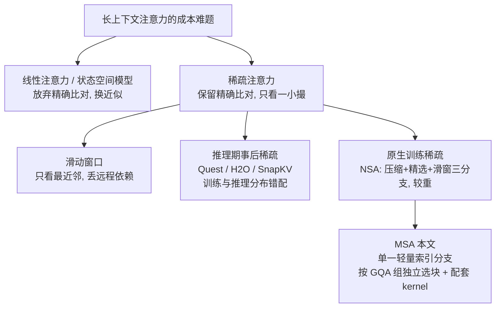
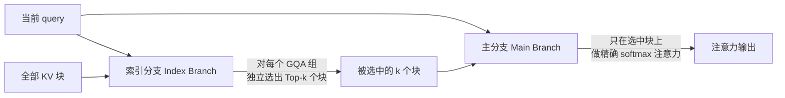
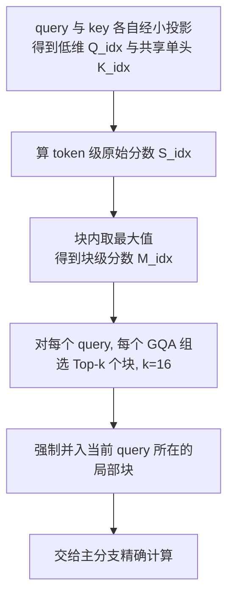
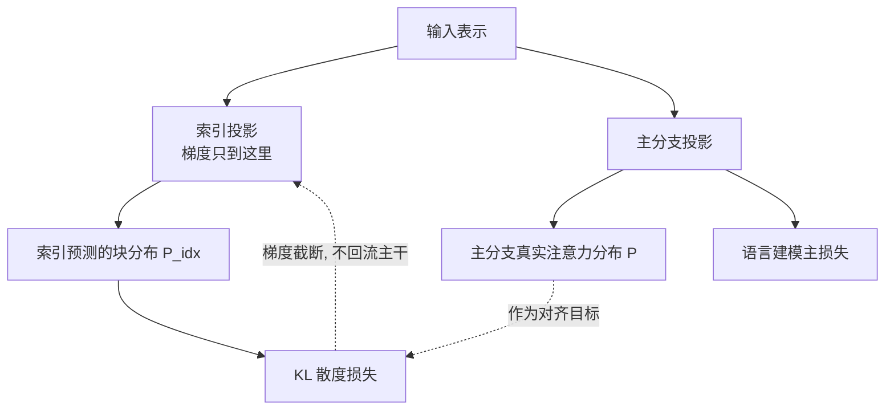

# MiniMax 稀疏注意力

> **原题**：MiniMax Sparse Attention
> **作者**：Xunhao Lai, Weiqi Xu, Yufeng Yang, Qiaorui Chen, Yang Xu, Lunbin Zeng, Xiaolong Li, Haohai Sun, Haichao Zhu, Vito Zhang, Pengyu Zhao
> **机构**：MiniMax
> **年份**：2026（arxiv ID 2606.13392）
> **分类**：cs.AI
> **链接**：https://arxiv.org/abs/2606.13392
> **精读日期**：2026-06-14

## 阅读须知

**这篇在领域里的位置。** 大语言模型这两年最贵的一笔账，是注意力。标准的 softmax 注意力要让序列里每一个位置都去看其他所有位置，于是计算量随序列长度的平方往上涨。序列短的时候这笔账无所谓，但一旦上下文拉到几十万乃至上百万 token，平方项就成了部署时绕不开的墙。围绕这堵墙，过去几年长出了一整片"高效注意力"的子领域。一条路线是线性注意力与状态空间模型，干脆放弃精确的两两比对，换成近似；另一条路线是稀疏注意力，保留精确比对，但让每个 query 只去看一小撮真正相关的 token，而不是全部。这篇 MiniMax Sparse Attention（以下简称 MSA）属于后一条路线里最新、也最工程化的一支，它的特别之处在于不是在推理阶段事后裁剪，而是把"挑选该看哪些块"这件事变成模型从训练第一天起就一并学会的能力，并且把它直接用在了一个 109B 规模的真实大模型上。

**读完能回答什么。** 读完这份笔记，应当能回答下面五个问题：第一，为什么超长上下文几乎必须做稀疏注意力，朴素 softmax 注意力到底卡在哪一步；第二，MSA 的"索引分支"是怎样在不付出完整注意力代价的前提下，替每个 query 挑出值得看的那几个 KV 块的；第三，为什么挑块这一步可以跳过 softmax 里的指数运算，也就是论文所说的 exp-free；第四，MSA 与此前的 NSA、MoBA、Quest 这些工作根本区别在哪里；第五，理论上 28.4 倍的计算削减，为什么落到真实墙上时钟只剩下 14.2 倍。

**阅读前置。** 这份笔记假定读者熟悉 Transformer 的自注意力机制，理解 softmax 注意力为什么是二次复杂度，知道分组查询注意力（GQA）是怎么靠多个 query 头共享一组键值头来省显存的，并且用过 PyTorch 张量算子。它不预设读者做过 GPU kernel 编写，也不预设读者专门研究过稀疏注意力，凡是涉及这两块的术语，下文第一次出现时都会先铺垫再展开。

**首次出现的缩写表。**

- **MSA**（MiniMax Sparse Attention）：本文方法，一种建立在 GQA 之上的分块稀疏注意力。
- **GQA**（Grouped Query Attention，分组查询注意力）：多个 query 头共享同一组键值头的注意力变体，用来压缩键值缓存。
- **KV**（Key-Value，键值）：注意力里被查询的那一侧，键用于打分，值用于加权求和。
- **MoE**（Mixture of Experts，专家混合）：每个 token 只激活一小部分参数（专家）的稀疏模型结构。
- **Top-k**：取分数最高的 k 个，本文里指为每个 query 选出分数最高的 k 个 KV 块。
- **FLOPs**（浮点运算数）：衡量计算量的单位，本文用它来度量注意力的算力开销。
- **PT / CPT**（Pre-Training from scratch / Continued Pre-Training）：从零开始预训练，与从已有检查点继续预训练，本文是两条并列的训练路线。
- **KL 散度**（Kullback-Leibler divergence）：衡量两个概率分布差异的指标，本文用它把索引分支的预测对齐到主分支的真实注意力分布。
- **CTA**（Cooperative Thread Array）：GPU 上协同工作的一组线程，可以粗略理解为一个线程块，是 kernel 调度的基本单位。
- **NSA / MoBA / Quest**：三种代表性的前作稀疏注意力方法，下文会逐一对照。
- **RULER / HELMET**：两套常用的长上下文能力评测基准。

超长上下文正在从一个加分项变成前沿模型的刚需。智能体的工作流要在一长串历史里反复回看，仓库级别的代码推理要把成千上万行代码同时纳入视野，持久记忆更要求模型把过去几十万 token 的对话一并attend。这些场景的共同点是，它们都需要模型同时面对几十万到上百万 token。可是 softmax 注意力的代价随长度平方增长，到了部署的量级，这笔账根本付不起。换句话说，长上下文的需求是真实的，而支撑它的注意力机制却在成本上难以为继，这中间的缺口就是这篇论文要填的东西。

过去几年这个方向上的努力大致分两类。一类是推理期的事后稀疏化，例如 Quest、H2O、SnapKV 这些方法，它们在模型训练完之后，于推理时根据某种启发式规则丢掉一部分键值，好处是不用重训，坏处是模型从未在稀疏条件下学习过，精度容易掉。另一类是把稀疏直接训进模型，让模型原生地学会稀疏地看，代表是 NSA（Native Sparse Attention，原生稀疏注意力）。MSA 走的是第二类，但它把这一路线进一步简化，并第一次拿到一个百亿参数级、原生多模态训练的真实模型上跑通。之所以现在还需要这样一篇新论文，是因为既有的原生稀疏方案要么结构复杂、分支众多，要么没有配套的 GPU 执行路径，理论上的稀疏省不下真实的时间。MSA 想证明的是，一个刻意做得足够简单的设计，配上一套量身定做的 kernel，能把纸面上的稀疏真正兑现成机器上的加速。

## 一、问题

把上面的动机落到一个清晰可验证的技术陈述上，这篇论文要解决的问题是：如何在百万级上下文下，把每个 token 的注意力计算量大幅降下来，同时让模型的质量与稠密的全注意力基本持平，并且这套方案要能在现有 GPU 上以接近理论上限的效率真实跑起来。这里有三个互相牵制的目标，省算力、保精度、能落地，任何一个单独达成都不难，难的是三个同时成立。

要理解难在哪里，先要看清全注意力的代价结构。注意力的本质是，对序列里第 i 个位置的 query，去和它之前每一个位置的 key 算一个相关分数，经 softmax 归一化成权重，再对相应的 value 加权求和。位置越靠后，要回看的 key 越多，到了序列末端就要回看几乎整条序列。把所有位置累加起来，总计算量正比于长度的平方。当长度是几千时这没什么，当长度是一百万时，平方意味着算力与显存同时爆炸。

前人尝试过的解法可以摆成一条由浅入深的脉络。最朴素的是滑动窗口，每个 query 只看固定数量的最近邻 token，复杂度立刻降为线性，但代价是彻底丢掉了远处的依赖，一旦关键信息在很远的地方，模型就再也够不着。比滑动窗口聪明一些的是推理期动态稀疏，例如 Quest，它在推理时估计哪些键值块可能重要，只取其中一部分来算。这一类的根本问题在于，模型在训练时见到的一直是全注意力，到了推理却被强行换成稀疏，训练与推理之间出现了分布错配，于是精度往往要打折扣。再进一步是原生稀疏，以 NSA 为代表，它让模型在训练阶段就以稀疏的方式运行，从而训练与推理一致。NSA 的做法是同时维护三条并行的分支，一条对历史做压缩，一条做精选，一条做滑动窗口，三者各司其职再融合。这套设计精度很好，但分支多、结构重，工程上不够利落，部署时也更难榨出效率。

下面这张图把这几条路线的关系摆在一起，便于看清 MSA 所处的位置。

把这条脉络读下来，MSA 要回答的子问题就清楚了：能不能只用一条轻量的分支来完成"挑块"，把 NSA 的三分支简化成一分支，同时又不退回到推理期事后稀疏那种精度损失，并且让这条分支挑出来的稀疏模式正好对 GPU 友好。这三点合起来，构成了它在方法上的全部设计取舍。

## 二、方法

MSA 的整体思路可以用一句话先勾出来：在 GQA 的基础上，给注意力前面接一个轻量的"索引分支"，由它先粗略判断哪些键值块值得看，再由"主分支"只在这些被选中的块上做精确的注意力。前者负责选，后者负责算，分工明确。下面这张图是它的骨架。

**先把 KV 序列切块。** 一切的前提是把键值序列沿位置切成固定大小的块，论文取每块 128 个 token。之所以以块而不是以单个 token 为单位来做稀疏，原因有两层：一层是块级的访问对 GPU 更友好，连续一片内存一次取出，远比东一个西一个地零散取值高效；另一层是块级判断的粒度足够用，相邻 token 的相关性本就接近，整块一起选或一起弃，损失不大。

**索引分支怎么打分。** 索引分支的任务是给每个块打一个"这个块对当前 query 有多重要"的分数，且这件事本身必须便宜，否则就违背了省算力的初衷。它的做法是另起一套小投影，把 query 投到一个低维的 Q^idx，把 key 投到一个所有 GQA 组共享的、只有单头的 K^idx。这里第一个符号 Q^idx 的形状是序列长度乘以键值头数乘以索引维度 d_idx，d_idx 取得比主注意力的头维度小，所以这套打分很轻；第二个符号 K^idx 只有一个共享头，进一步压缩了开销。query 与 key 在这套低维空间里算出原始分数 S^idx，公式上就是 Q^idx 与 K^idx 的内积再除以根号 d_idx。算到 token 级的分数后，再在每个块内部取最大值，得到块级分数 M^idx，也就是用块里最相关的那个 token 来代表整块的重要性。

**按 GQA 组独立选块。** 拿到每个块的分数后，对每一个 query 与每一个 GQA 组的组合，各自选出分数最高的 k 个块，论文里 k 固定为 16。这里有一个容易被忽略但很关键的设计：选择是按 GQA 组独立进行的，也就是说同一个 query 在不同的键值组里可以选出不同的块集合。这给了模型一定的灵活度，不同的组可以各自关注序列的不同区域。此外，当前 query 所在的那个局部块会被强制纳入，保证近处信息永远不丢。把 k 设为 16、块设为 128，意味着每个 query 实际上只精确地看大约 2048 个 token，无论整条序列有多长。

下面这张图把索引分支内部的几步摊开。

**exp-free 的取巧。** 这里有一处很漂亮的省法。通常注意力要对分数做 softmax，而 softmax 里含有逐元素的指数运算、求最大值与求和，都是开销。但索引分支的目的只是排序选块，并不需要真正的归一化概率。由于 softmax 是单调保序的变换，对一组分数做不做 softmax，其 Top-k 的排名都不变。既然只要排名，那就直接拿原始分数去选，把 max、exp、sum 全部跳过，这就是论文所说的 exp-free。一个本应附着在选块上的固定成本，就这样被抹掉了。

**主分支怎么算。** 主分支拿到被选中的 k 个块之后，只在这些块覆盖的、且对当前 query 因果可见的 token 上，用该 GQA 组对应的键值头做标准的缩放点积 softmax 注意力。没被选中的块完全不参与运算。于是原本要遍历整条序列的注意力，被压缩到只遍历这固定的若干块，计算量从随长度平方增长，变成随选中块数（一个常数）增长。

**KV 为外层的 kernel。** 算力省下来不等于时间省下来，这是稀疏注意力长期的痛点。难点在于，稀疏带来的内存访问是不规则的，不同 query 选中的块七零八落，GPU 的张量核心吃不饱，理论上的稀疏兑现不成真实的速度。MSA 的对策是把注意力 kernel 的循环结构翻转过来。常规 kernel 以 query 为外层循环，逐个 query 去收集它要的 key；MSA 改以 KV 块为外层循环，对每一个被选中的块，反过来把所有选了这个块的 query 收集到一起，拼成一个稠密的小批，一次性喂给张量核心，这就是 KV-outer。这样做的好处是把零散的稀疏访问重新聚成了规整的稠密计算。但块的热度是不均匀的，有的块被很多 query 选中，有的块无人问津，直接并行会产生写冲突。MSA 用两阶段的方式应对，先把每个块的部分输出与对应的 log-sum-exp 写进中间缓冲，再统一归并，从而避免了代价高昂的原子操作。

**索引分支怎么训出来。** 索引分支不是写死的规则，而是要学的。问题是，正确的"该选哪些块"并没有现成标签。MSA 的解法是自蒸馏式的对齐：用主分支在被选 token 上算出的真实注意力分布作为目标，用 KL 散度把索引分支预测的块分布往这个目标上拉，让索引分支逐渐学会预测"主分支最终会把注意力放在哪里"。为了不让这个辅助任务干扰主干，MSA 对索引分支的输入做了梯度截断，使得这个 KL 损失只更新索引分支自己的那套小投影，而不会回流去改动主模型的表示。下面这张图把训练时两条分支与损失的关系画出来。

**两条训练路线。** 最后，MSA 给出两种把模型训出来的方式。一种是 MSA-PT，从零开始训练，先用 40B token 做全注意力的热身，让模型先具备基本能力，再切换到稀疏继续训。另一种是 MSA-CPT，从一个已经训好的 GQA 检查点出发，论文里这个检查点本身吃了 2.6T token，然后同样先 40B token 热身，再用 400B token 做稀疏的继续预训练。前者干净但贵，后者省钱但要背上已有检查点的包袱，这两条路线在实验里会各显其短长。

## 三、实验

**模型与训练规模。** 实验所用的不是一个玩具模型，而是一个 109B 参数的专家混合（MoE）模型，每个 token 只激活其中约 6B 参数。它有 41 层，其中 3 层是稠密层、38 层是 MoE 层；注意力侧有 64 个 query 头、4 个键值头，头维度 128，词表 20 万。这个模型采用原生多模态训练，总训练量达到 3T token。把稀疏注意力放到这样一个真实规模、真实多模态的模型上验证，是这篇论文相比许多只在小模型上做演示的同类工作最有分量的地方。

**对照与评测面。** 主要的对照对象是同等训练预算下的全注意力 GQA 模型，这样比较能把"稀疏带来的得失"单独隔离出来。评测覆盖 40 多个数据集，横跨通用推理（MMLU、BBH、GPQA）、数学（GSM8K、MathVista）、代码（HumanEval、BigCodeBench）、图像与视频，以及智能体任务（SWE-bench、TheAgentCompany）。评测面铺得这样宽，目的是说明稀疏不是只在某一类任务上侥幸不掉点，而是全面地与全注意力持平。

下面这张表把论文的几个关键数字摆在一处。

| 指标 | MSA | 全注意力 GQA | 说明 |
|---|---|---|---|
| 1M 上下文每 token 注意力算力 | 削减 28.4 倍 | 基准 | 理论 FLOPs 削减 |
| H800 上 prefill 墙上时钟 | 加速 14.2 倍 | 基准 | 含 kernel 实测 |
| H800 上 decode 墙上时钟 | 加速 7.6 倍 | 基准 | 含 kernel 实测 |
| RULER-128K 总分 | 72.12% | 72.00% | 长上下文检索, 基本持平 |
| HELMET-128K 总分 | 45.93% | 46.53% | 长上下文综合, 略低 |

**怎么读这几个数字。** 头三行讲的是效率。在一百万 token 的上下文下，每个 token 的注意力算力被砍到约三十分之一，这是稀疏度直接带来的理论收益。落到 H800 这块真实 GPU 上，预填充阶段拿到 14.2 倍加速，解码阶段拿到 7.6 倍加速。值得注意的是，真实加速明显小于理论的 28.4 倍，这中间的落差正是稀疏注意力工程化的核心难题所在，后面的局限一节会专门讨论。后两行讲的是质量。RULER 与 HELMET 都是专门压测长上下文的基准，MSA 在 RULER-128K 上甚至略微反超全注意力，在 HELMET-128K 上则略低半个多百分点。两个数字合起来说明，把注意力砍到三十分之一之后，长上下文的能力几乎没有付出可见的代价。

**最有说服力的消融。** 论文的消融实验排得比较密，涉及块大小、梯度来源、KL 对齐时是否做梯度截断、索引分支的热身策略、对注意力 sink 的强制保留，以及是否给索引分支单独学一个 value 头等。其中两组尤其值得记一笔。第一组是关于梯度截断的：如果不把索引分支的梯度从主干截断，辅助损失会反过来扰动主模型的表示，实验显示这会损害最终质量，这就从反面印证了"让索引只管索引"这个设计取舍的必要性。第二组是关于热身的：索引分支若一开始就在尚未成形的表示上学习选块，会学歪，先用一段全注意力热身再转稀疏，是把这条分支训稳的前提。这两组消融共同说明，MSA 的效果不只来自结构本身，也来自训练流程上的这些看似琐碎却必要的安排。

## 四、局限

先看作者自己承认的部分。这篇论文没有单列一节谈局限，但在展望里坦白了一个事实，即模型仍存在残余的长上下文检索能力差距，也就是说在某些需要精确回看的极端情形下，稀疏方案与全注意力之间仍有没抹平的缝隙。此外，两条训练路线之间也有取舍，从已有 GQA 检查点继续训练得到的 MSA-CPT，在部分图像与视频任务上不如从零训练的 MSA-PT，这说明继承一个为全注意力训练的检查点，会带来一些难以完全消化的历史包袱。

再看论文没有明说、但读完能够看出的几点。第一点是最值得警惕的：每个 query 选 16 个块、每块 128 token，意味着无论上下文多长，一个 query 实际精确看到的也就大约 2048 个 token。这个数字是固定的，不随序列变长而增加。对于那种需要在百万 token 里做广覆盖、多点交叉比对的任务，固定的 2048 token 视野可能不够用，这恰好与作者承认的检索差距相互呼应。换句话说，MSA 擅长的是精确定位少数相关块，而不是同时照看大面积的弱相关信息。

第二点关于训练的耦合。索引分支用主分支自己的注意力分布作为对齐目标，本质是一种自蒸馏，存在"学生追老师、而老师本身还在变"的动态耦合。这类训练对热身和调度比较敏感，论文的消融已经间接说明了这一点，意味着这套方法要复现得好，对训练细节的依赖不轻。

第三点关于评测的完整性。论文主要把 MSA 与同预算的全注意力 GQA 对照，这对隔离稀疏的得失是合适的，但至少在公开的核心数字里，缺少与 NSA、MoBA 这些同类原生稀疏方法在相同规模下的正面对比。因此读者能确认 MSA 相对全注意力几乎不掉点，却较难判断它相对其他稀疏路线究竟领先多少。最后一点是部署门槛，这套方法的加速高度依赖论文配套的那套专用 GPU kernel，离开这套 kernel，纸面上的稀疏度兑现不成真实的速度，这也解释了为什么真实加速会落在理论削减之下。

## 一句话

在 GQA 之上接一个可训练的轻量索引、按组独立选块，再配一套以 KV 为外层的 kernel，让百万上下文的注意力算力砍到约三十分之一而精度几乎不掉。
