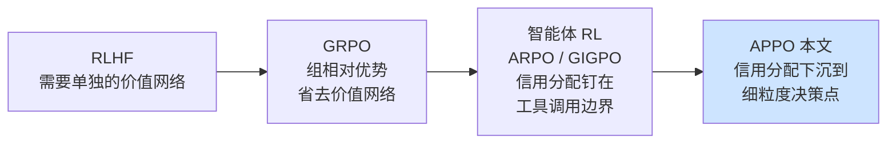
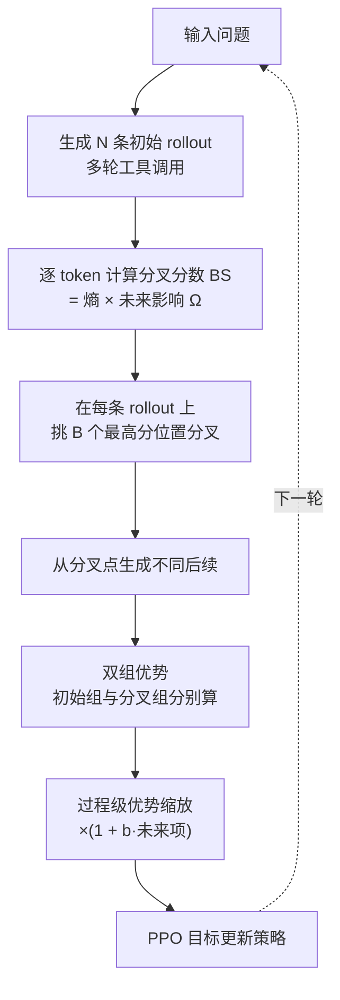
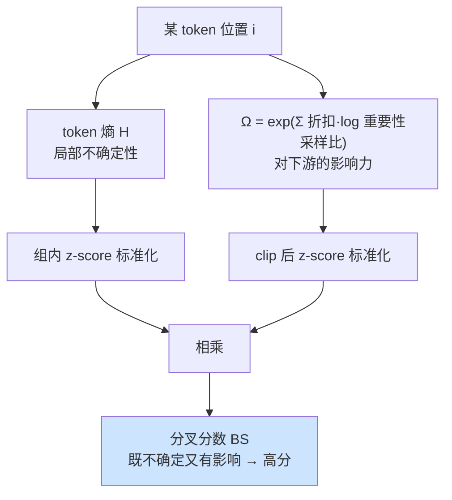

# APPO：面向智能体的过程级策略优化

> **原题**：APPO: Agentic Procedural Policy Optimization
> **作者**：Xucong Wang, Ziyu Ma, Yong Wang, Yuxiang Ji, Shidong Yang, Guanhua Chen, Pengkun Wang, Xiangxiang Chu
> **年份**：2026（arxiv ID 2606.12384）
> **分类**：cs.LG / cs.AI
> **链接**：https://arxiv.org/abs/2606.12384
> **精读日期**：2026-06-15

---

## 阅读须知

### 这篇在领域里的位置

这篇论文属于"用强化学习训练会调用工具的大模型智能体"这一条线。要理解它的位置，需要先把这条线的来路理一理。

最近两三年里，用强化学习（Reinforcement Learning，RL）来对齐和提升大模型的能力，经历了一个明显的简化过程。早期的做法需要单独训练一个价值网络（critic）来估计每一步的好坏，工程上既笨重又不稳定。后来 GRPO（Group Relative Policy Optimization，组相对策略优化）提出了一个取巧的办法：对同一个问题一次性采样出一组答案，用这组答案各自得分相对于组内平均分的高低来当作优势信号，于是价值网络被整个省掉了。这个思路因为简单有效，迅速成了主流。

GRPO 最初是为"一问一答"式的推理任务设计的。可是当大模型变成一个要连续调用搜索、代码执行、计算器等工具，来回好几轮才给出最终答案的智能体时，新的难题就出现了：一条轨迹里有几十上百个 token、好几次工具调用，最后只有一个总的成败信号，到底是哪一步的决定立了功、哪一步埋了雷？这就是所谓的信用分配（credit assignment）问题。为应对它，出现了 ARPO、GIGPO 等一批"智能体版"的 RL 方法，它们大多把信用分配的颗粒度放在工具调用的边界上，也就是默认"每一次工具调用是一个值得单独评价的单元"。

APPO 就站在这一步上往前走。它的核心主张是：值得单独评价的关键决策并不整齐地落在工具调用的边界上，而是零散地分布在整条生成序列的各个 token 位置。因此它把探索与信用分配的颗粒度，从粗糙的"工具调用单元"下沉到细粒度的"决策点"。

### 读完能回答什么

读完这份笔记，应当能回答下面几个问题：

1. 为什么在智能体强化学习里，"按工具调用边界来分配信用"是不够用的？
2. 本文的 Branching Score（分叉分数）是怎样把 token 的不确定性和它对未来的影响结合到一起的，为什么只看 token 熵不行？
3. 过程级优势缩放（procedure-level advantage scaling）在 GRPO 的组相对优势之上，额外加了一个什么样的项？
4. 树状的分叉式采样和 GRPO 那种各自独立的一组采样，本质区别在哪里？
5. APPO 相比 ARPO 这样的强基线，在哪些任务上提升了多少？

### 阅读前置

这份笔记假定读者熟悉 PPO 与 GRPO 的基本机制，具体说就是知道什么是重要性采样比（importance sampling ratio）、什么是 clip 截断、什么是组相对优势。同时假定读者了解大模型智能体多轮调用工具的基本范式，以及 token 熵（衡量模型在某个位置输出有多不确定）这个概念。不预设读者读过具体的智能体 RL 论文，ARPO 与 GIGPO 在正文里会先做铺垫。

### 首次出现的缩写表

- **RL**（Reinforcement Learning，强化学习）
- **RLVR**（RL with Verifiable Rewards，带可验证奖励的强化学习）：奖励来自一个能自动判对错的验证器，例如答案是否正确、代码是否通过测试
- **PPO**（Proximal Policy Optimization，近端策略优化）：经典的策略梯度算法，靠 clip 截断把每一步更新限制在旧策略附近
- **GRPO**（Group Relative Policy Optimization，组相对策略优化）：用一组采样答案的组内相对得分代替价值网络
- **ARPO**（Agentic Reinforced Policy Optimization）：本文的主要对比基线，智能体版的 RL 方法
- **GIGPO**（Group-in-Group Policy Optimization）：另一个智能体 RL 基线
- **APPO**（Agentic Procedural Policy Optimization，面向智能体的过程级策略优化）：本文方法
- **BS**（Branching Score，分叉分数）：本文用来挑选在哪里分叉的指标
- **IS 比**（Importance Sampling ratio，重要性采样比）：当前策略与旧策略在某个 token 上给出概率的比值
- **KL**（Kullback-Leibler divergence）：衡量两个分布差异的散度，这里用来约束新策略不要偏离参考策略太远

---

智能体强化学习这两年进步很快，可是有一个痛点一直没被很好地解决。当一个大模型要连续做几十个决定、来回调用好几次工具，最后才得到一个"对"或"错"的总信号时，训练算法很难判断这一长串决定里到底哪几个真正起了作用。如果信用分配错了位，模型就会去强化一些其实无关紧要的行为，或者放过真正关键的那一步。

过去的智能体 RL 方法大多采取一个偷懒但直观的假设：把每一次工具调用当成一个评价单元，认为关键决定都发生在"要不要调工具、调哪个工具"这些边界上。这个假设的好处是单元划得清楚，坏处是它可能根本不符合事实。很多决定性的转折，发生在模型组织一句推理、选定一个搜索关键词、决定是否要追问的那个具体 token 上，而这些位置未必紧挨着工具调用。换句话说，把信用分配钉死在工具调用边界上，等于一开始就把颗粒度调错了。

之所以现在值得用一篇新论文来处理这件事，是因为随着智能体要解决的任务越来越长、越来越复杂，粗颗粒度信用分配带来的训练噪声会被不断放大。APPO 想验证的，正是把颗粒度下沉到决策点之后，能不能在不显著增加工具调用开销的前提下，把这部分噪声压下去。

## 一、问题

本文要解决的问题，可以从一个朴素的观察落到一个明确的技术陈述。

作者先做了一个探路性的分析（pilot analysis），结论有两条。第一条：真正有影响力的决策点，是广泛散布在整条生成序列里的，并不集中在工具调用的位置。第二条：单看 token 熵并不可靠。token 熵高，往往只说明这个位置用词比较稀有、模型拿不准用哪个词，但这种"局部不确定"未必对应"对最终结果有影响"。这两条观察合在一起，就否定了过去方法的两个隐含前提：既不能假设关键决定都在工具调用边界，也不能简单用熵来找关键决定。

于是问题被拆成两个互相关联的子问题，作者把它们概括为"在哪里分叉"和"分叉之后如何分配信用"。

这里需要先铺垫一下"分叉"是什么。在 GRPO 这一类方法里，为了得到组相对优势，需要对同一个问题采样出一组轨迹。最直接的做法是从头到尾各自独立地生成若干条，彼此之间没有共享的部分。所谓分叉（branching），是另一种采样组织方式：先生成一条主轨迹，然后在中途某些位置"叉开"，从这个位置出发生成不同的后续。这样得到的一组轨迹共享了分叉点之前的前缀，只在分叉点之后才出现差异。分叉式采样的妙处在于，它能把探索的算力精确地投到"换一个决定会带来不同结果"的那些位置上，而不是浪费在从头重采所带来的大量无差别开头上。

把这两个子问题接起来，本文要回答的就是：怎样自动地、可靠地找到那些"换个决定就会改变下游结果"的细粒度决策点，在那里分叉来做有针对性的探索，并在分叉之后把信用按各个决定的真实影响力分配下去。

下面这张图把这条领域脉络和本文的切入点放在一起。

## 二、方法

APPO 整体上是一个 PPO 风格的策略优化框架，它的目标函数仍然是熟悉的那一套：用重要性采样比乘以优势，外面套一个 clip 截断，再减去一个对参考策略的 KL 惩罚项。形式上写作

J(θ) = E[ (1/M) Σ min( ρ·Â , clip(ρ)·Â ) − β·KL(π_θ‖π_ref) ]

其中 ρ 是当前策略与旧策略在某个 token 上的重要性采样比，Â 是该 token 的优势，β 控制 KL 惩罚的强度。APPO 真正的新意不在这个外壳，而在两处零件：怎样挑分叉点（Branching Score），以及分叉之后怎样算优势（过程级优势缩放）。

### 分叉分数 Branching Score

挑分叉点的指标叫分叉分数。它的设计直接回应了前面那条观察：既不能只看熵，也要把"对未来的影响"考虑进去。它把两件事相乘。

第一件事是 token 的局部不确定性，用 token 熵 H_{n,i} 来衡量。第二件事是这个位置对后续的影响力，用一个叫 Ω_{n,i} 的量来衡量。Ω 的定义是从当前位置往后，把每个后续 token 的对数重要性采样比按折扣因子 γ 累加起来再取指数：

Ω_{n,i} = exp( Σ_{i′≥i} γ^{i′−i} · log ρ_{i′}(θ) )

这个量可以这样理解：如果在位置 i 之后，新策略相比旧策略在后续 token 上整体提高了概率，说明从这里往后的这段延续正被策略越来越看好，那么位置 i 就是一个"撬动了下游"的关键点。换句话说，Ω 衡量的是"从这里分叉出去的后续，到底有没有变得更被青睐"。

把两件事各自在一条 rollout 内做 z-score 标准化（记为 Z(·)），再相乘，就得到分叉分数：

BS_{n,i} = Z( clip(Ω_{n,i}, 1−ε′, 1+ε′) ) · Z( H_{n,i} )

相乘这个设计很关键：只有当一个位置既不确定（熵高）又有下游影响（Ω 大）时，分叉分数才会高。那些熵很高但其实只是用词生僻、对结果毫无影响的位置，会因为 Ω 项偏小而被过滤掉。这正好对应了作者那句话：高熵 token 本身并不能可靠地指示决策的重要性。

### 过程级优势缩放

找到分叉点、分叉采样之后，需要给每个 token 算优势。APPO 的基础优势 Â^base 仍然走 GRPO 的组相对路线，不过这里有一个细节：初始 rollout 和分叉出来的 rollout 各自成组、分别计算组相对优势，作者称之为双组优势（dual-group advantage）。这样做是因为分叉轨迹共享了前缀，如果和初始轨迹混在一个组里算相对分，前缀部分会被重复计入，扭曲信号。

在基础优势之上，APPO 再乘一个未来感知的缩放因子：

Â_{n,i} = Â^base_{n,i} · ( 1 + b · Â^fut_{n,i} )

其中 Â^fut 用的还是那个折扣累加的重要性采样比指数（与 Ω 同源，外面套一个 clip），b 控制这一项的权重。它的作用是：对那些下游影响更强的决定，放大它们拿到的信用。于是整个流程里出现了一个一致的主线，无论是挑分叉点还是分配信用，依据的都是"这个决定对后续延续的影响有多大"。

下面两张图分别给出整体的采样与优化流程，以及分叉分数的构成。

## 三、实验

实验在三大类、共 13 个基准上展开，覆盖了从纯推理到需要外部检索的多种任务形态。

数学推理一类包括 AIME24、AIME25、MATH500、GSM8K 与 MATH。知识密集型一类包括 WebWalker、HotpotQA、2WikiMultihopQA、Musique 与 Bamboogle，这些任务需要模型多跳检索、把分散在不同文档里的信息拼起来。深度搜索一类包括 GAIA、Humanity's Last Exam 与 Xbench，难度更高，更考验长链条的工具使用。

对比的基线分两层。智能体专用的一层有 ARPO 与 GIGPO，其中 ARPO 是最主要的强基线。更经典的一层有 GRPO、Reinforce++、DAPO、GPPO、CISPO。主要结果可以概括为：在不同骨干模型上，APPO 相对 ARPO 稳定地带来约 2 到 4 个百分点的平均提升，同时保持了相当的工具调用效率。下表摘录几组有代表性的数字。

| 骨干模型 | 基线（ARPO） | APPO | 提升 |
|---|---|---|---|
| Llama3.1-8B（平均） | 55.3% | 57.4% | +2.1 |
| Qwen2.5-7B（平均） | 58.3% | 62.2% | +3.9 |
| Qwen3-8B（GAIA） | 38.8% | 42.7% | +3.9 |
| Qwen3-14B（GAIA） | 43.7% | 46.6% | +2.9 |

消融实验把每个零件单独拆掉，用来确认它们各自的贡献。最能说明问题的是下面三组。

把分叉分数换回单纯的 token 熵，性能下降约 0.9 到 1.7 个百分点。这一组直接验证了本文的核心论点：只看熵不够，必须把对未来的影响乘进去。

去掉未来感知的优势缩放项 Â^fut，下降幅度最大，在 Qwen2.5 上掉了约 3.4 个百分点。这说明在分叉之后按下游影响力来缩放信用，是整套方法里贡献最大的一块。

去掉双组优势、把初始与分叉轨迹混在一起算相对分，下降约 0.8 到 1.2 个百分点，印证了共享前缀确实需要分组处理。

此外作者还分析了采样预算怎么分配。在总预算固定的前提下，均衡的配置（每个问题开 4 棵初始树、每棵树设 3 个分叉点）优于两种极端：要么开很多树但几乎不分叉（偏多样性），要么只开两棵树却分叉很多次（偏深度）。这说明探索的广度与深度需要一个折中点。

## 四、局限

作者在附录里承认了几处局限，读者也能据此判断这套方法的适用边界。

作者自己点出的部分有以下几点。其一，多次分叉操作带来的计算开销没有被完整刻画，论文更多强调工具调用次数没怎么增加，但分叉本身要生成额外的后续，这部分成本的账没有算细。其二，方法依赖较为准确的奖励信号，在奖励只有稀疏的最终成败、中间没有可验证反馈的任务上，效果可能打折。其三，对若干超参数的敏感性探索有限，例如折扣因子 γ 和截断阈值 ε′，论文没有给出系统的扫描。

读者还能进一步看出一个更根本的边界。整套方法的前提是"过程中确实存在影响力差异很大的关键决定"，分叉分数和优势缩放都建立在这个假设上。一旦面对的任务里各个决定的重要性比较平均、并不存在明显的转折点，那么按影响力做的这一切区分就失去了着力点，APPO 相对粗颗粒度方法的优势会随之缩小。换句话说，它最擅长的是那种"一步走错满盘皆输"的长链条任务，而非决定权重平摊的任务。

## 一句话

把智能体强化学习的探索与信用分配从工具调用边界下沉到"既不确定又影响下游"的细粒度决策点，在 13 个基准上稳定提升约 2 到 4 个百分点。
