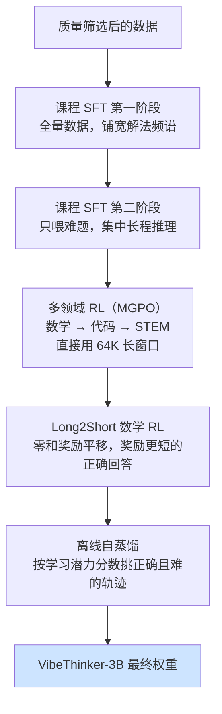
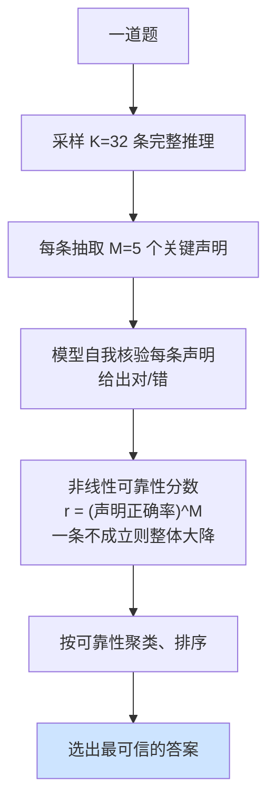

# VibeThinker-3B：把可验证推理推到小模型的边界

> **原题**：VibeThinker-3B: Exploring the Frontier of Verifiable Reasoning in Small Language Models
> **作者**：Sen Xu, Shixi Liu, Wei Wang, Jixin Min, Yingwei Dai, Zhibin Yin, Yirong Chen, Xin Zhou, Junlin Zhang
> **年份**：2026（arxiv ID 2606.16140）
> **分类**：cs.AI / cs.CL
> **链接**：https://arxiv.org/abs/2606.16140
> **精读日期**：2026-06-16

---

## 阅读须知

### 这篇在领域里的位置

这篇论文属于"小参数量的推理模型"这一条线，要理解它的分量，得先把推理模型这两年的来路说清楚。

自从带可验证奖励的强化学习（RL with Verifiable Rewards，RLVR）这套方法被验证有效之后，大模型在数学和代码这类有标准答案的任务上，能力出现了一次跃升。它的逻辑很朴素：既然这类题目能用程序自动判对错，那就让模型反复尝试，答对了给奖励、答错了不给，靠强化学习把会做题的那部分行为放大。沿着这条路，出现了一批以推理见长的旗舰模型，它们动辄几百亿到上万亿参数。

随之而来一个自然的问题：这种推理能力，到底是不是非得靠庞大的参数量才能装下？如果一个很小的模型也能在数学竞赛和编程题上追平那些大几十倍上百倍的旗舰，那就说明"推理"和"规模"之间，并没有人们默认的那种强绑定。

这篇论文正是冲着这个问题去的。它推出一个只有 30 亿参数的稠密模型 VibeThinker-3B，是作者此前 15 亿参数工作的延续，目标是看看在严格限定的小模型规模下，可验证推理究竟能被推到多远。它最终给出的不只是一个模型，还有一个用来解释"为什么能这样"的假说。

### 读完能回答什么

读完这份笔记，应当能回答下面几个问题：

1. 为什么可验证推理可以压进一个 30 亿参数的小模型，而通用知识却压不进去？
2. 本文的 Spectrum-to-Signal（频谱到信号）范式是什么，监督微调与强化学习在其中各自扮演什么角色？
3. 课程式监督微调的两个阶段分别在做什么，为什么第二阶段只喂难题？
4. 声明级的测试时扩展是怎样把 AIME26 的成绩从 94.3 提到 97.1 的？
5. 一个 30 亿参数的模型在哪些任务上能追平六千多亿参数的旗舰，又在哪里追不上？

### 阅读前置

这份笔记假定读者了解大模型训练里"监督微调加强化学习"的两段式范式，知道什么是带可验证奖励的强化学习，也清楚测试时扩展（test-time scaling，即在推理阶段多花算力、比如多采样几次再投票，来换取更高准确率）的基本思路。不预设读者读过具体的小模型推理论文。

### 首次出现的缩写表

- **SFT**（Supervised Fine-Tuning，监督微调）：用人工或筛选过的高质量示范数据，让模型先学会一个任务该怎么做
- **RL**（Reinforcement Learning，强化学习）
- **RLVR**（RL with Verifiable Rewards，带可验证奖励的强化学习）：奖励来自一个能自动判对错的验证器
- **MGPO**（MaxEnt-Guided Policy Optimization，最大熵引导的策略优化）：本文强化学习阶段所用的算法
- **CLR**（Claim-Level Reasoning，声明级推理）：本文提出的一种测试时扩展方法
- **Pass@1 / Pass@K**：只采样一次就答对的比例 / 采样 K 次里至少一次答对的比例
- **OOD**（Out-Of-Distribution，分布外）：测试数据与训练数据不同源，用来检验泛化
- **AIME / HMMT / LiveCodeBench / GPQA / IFEval**：分别是数学竞赛、数学竞赛、编程、研究生级知识问答、指令遵循等评测基准

---

长期以来有一个被默认接受的前提：模型越大越聪明，尤其是推理这种"高级"能力，似乎天然属于大模型。可是这个前提如果成立得这么彻底，会带来一个很现实的代价。能做复杂推理的模型都极其庞大，部署和调用的成本居高不下，普通团队既训不起也用不起。于是一个值得追问的问题浮出水面：推理能力到底是规模的产物，还是训练方法的产物？

如果它更多是方法的产物，那么把一个小模型的训练流程打磨到位，理论上就能在特定能力上逼近甚至追平大模型，而成本只有后者的零头。这不仅是工程上的省钱，更是对"能力从哪里来"这一基础认识的修正。VibeThinker-3B 想验证的，正是这件事：在数学与代码这类能自动判对错的可验证任务上，一个 30 亿参数的模型能不能站到第一梯队里。

## 一、问题

承接上面的动机，本文要解决的问题可以落到一个清晰的陈述：在严格限定的小模型规模下，把可验证推理的能力做到与一线大模型相当，并搞清楚这种"以小搏大"为什么可能、其边界又在哪里。

这里需要先把"可验证推理"这个概念铺垫清楚。所谓可验证，指的是任务的正确与否可以被程序或确定的标准自动判定，典型代表就是数学竞赛题（答案唯一）和编程题（代码能否通过测试用例）。与之相对的是知识密集型任务，比如回答一道冷门的研究生级科学题，它考的是模型有没有记住那个具体事实，而不是会不会推演。这个区分是全文的暗线，到第四节会被升华成一个假说。

前人的路线主要是"大模型加 RLVR"，它确实把推理能力做了上去，但默认了大参数量这个前提。也有一些小模型推理的尝试，包括本文作者自己的 15 亿参数版本，但要么成绩离一线还有明显差距，要么训练流程里存在一些会损伤推理质量的折中。本文要做的，是把小模型的整条后训练流水线重新设计一遍，让它在可验证任务上真正顶到前沿。

下面这张图把领域脉络和本文的切入点放在一起。

## 二、方法

整套训练遵循一个被作者称为 Spectrum-to-Signal（频谱到信号）的后训练范式。这个名字本身就概括了它的两段式思路：先用监督微调铺开一片足够宽的"解法频谱"，再用强化学习从这片频谱里把正确的"信号"放大。换句话说，监督微调负责构造一个尽量多样的候选解空间，让模型见识到一道题有多种走得通的解法和分解方式；强化学习则在这个被铺开的空间里，强化那些真正导向正确答案的推理路径。两者分工明确，前者求广，后者求准。

### 课程式监督微调

监督微调分成两个阶段，体现的是一种由易到难的课程设计。第一阶段在整个经过质量筛选的数据集上训练，并采用序列打包（把多条样本拼进一个长序列以提高效率）来最大化解法的多样性，目的是把解法频谱尽量铺宽。第二阶段则把火力收拢，只在难样本上训练，所谓难样本，指的是推理轨迹超过五千个 token、且被参考模型答错率超过百分之七十五的那些题。之所以专门盯住难题，是因为长链条的复杂推理正是模型最容易在普通数据里被稀释掉的能力，单拎出来强化，才能逼模型把注意力集中到长程推理上。两个阶段都用余弦退火的学习率，从 5×10⁻⁵ 逐步降到 8×10⁻⁸。

### 多领域强化学习

强化学习阶段用的算法是 MGPO（最大熵引导的策略优化），并配合动态的提示加权，让模型把更多精力放在当前还没掌握好的题目上。一个值得记的细节是，相比 15 亿参数的旧版本，VibeThinker-3B 放弃了"逐步扩大上下文窗口"的做法，改成一开始就直接使用一个 64K 的长上下文窗口。原因是作者发现，早期对长序列做截断，会破坏模型已经具备的高质量长推理模式，得不偿失。训练按 数学、代码、STEM 的顺序依次进行，每个阶段都保留检查点。

在主强化学习之后，还有一段名为 Long2Short 的数学强化学习。它的作用是在已经答对的那些轨迹之间重新分配奖励，用一种零和的奖励平移机制，把奖励向更短的正确回答倾斜，从而在不牺牲准确率的前提下鼓励模型把话说短、把推理写得更精炼。

### 离线自蒸馏

最后一步是离线自蒸馏。它从前面所有强化学习的检查点里，挑出高质量且经过验证为正确的推理轨迹，挑选的依据是一个"学习潜力分数"，专门选那些学生模型自己觉得难、但已被验证确实做对了的样本。用这些既正确又有挑战性的轨迹再回过头来训练模型，相当于让模型把散落在各个训练阶段的好经验，浓缩沉淀到最终的权重里。

下面这张图给出整条训练流水线。

### 声明级测试时扩展

除了训练，本文在推理阶段还提出一种叫 CLR（声明级推理）的测试时扩展方法，用来在不大幅增加开销的前提下进一步提分。

它的常规对照是这样的：测试时扩展最朴素的做法，是对同一道题多采样若干条完整回答，再用某种方式投票或打分选出最终答案，但逐条去核验整段长推理代价很高。CLR 的取巧之处在于，它不核验整段推理，而是从每条轨迹里抽取 M（取 5）个关键的、决定成败的声明，对 K（取 32）个采样分别这样处理。模型对这些声明做自我核验，给出二元的对错判断，再映射成一个非线性的可靠性分数：

r_k = ( (1/M) · Σ v_{k,m} )^M

这里 v 是单条声明的核验结果。把指数定为 M 是有意为之：只要有一个关键声明站不住，整条轨迹的可靠性分数就会被显著拉低，这比简单求平均更严格。最后按可靠性把答案聚类、排序，选出最可信的那个。靠这一招，AIME26 的成绩从 94.3 提到了 97.1。

## 三、实验

实验的核心结论是：VibeThinker-3B 这样一个 30 亿参数的模型，在可验证任务上站进了第一梯队，追平甚至超过了大它几十倍到几百倍的旗舰。下表摘录主要数字。

| 基准 | 不用 CLR | 用 CLR | 说明 |
|---|---|---|---|
| AIME26（数学竞赛） | 94.3 | 97.1 | 与 671B 的 DeepSeek V3.2 相当 |
| HMMT25（数学竞赛） | 89.3 | 95.4 | |
| BruMO25（数学竞赛） | - | 99.2 | |
| LiveCodeBench v6（编程） | 80.2 (Pass@1) | - | |
| 近期 LeetCode 竞赛 | 96.1%（123/128 通过） | - | 分布外泛化 |
| IFEval（指令遵循） | 93.4 | - | 极端推理强化没有损伤可控性 |

被拿来对比的大模型包括 DeepSeek V3.2、GLM-5（744B）、Kimi K2.5（1T）、Gemini 3 Pro、GPT-5（high）、Claude Opus 4.5 等，量级普遍在数千亿到上万亿参数。一个 30 亿参数的模型能在数学和代码上与它们平起平坐，是本文最有冲击力的结果。

近期 LeetCode 竞赛那一项尤其值得单独拎出来。这些竞赛在训练数据截止之后才发生，属于严格的分布外测试，模型不可能"背过"，96.1% 的通过率说明它学到的是可迁移的解题能力，而非对训练题的记忆。此外 IFEval 上 93.4 的成绩也排除了一种常见担忧：把模型往极端推理上猛训，往往会损伤它遵循普通指令的能力，而这里并没有发生。

## 四、局限

本文的局限非常诚实，甚至可以说，对局限的承认本身就是它论点的一部分。

作者明确指出，这个 30 亿参数的模型在知识密集型任务上仍与最强的大模型有可见的差距。最典型的是 GPQA-Diamond 这一研究生级科学知识问答，即便用上 CLR，成绩也只是从 70.2 提到 72.9，明显落后。作者直言，不能说一个 3B 模型已经在综合能力上全面取代了主流通用系统，比如广博的百科知识或开放域的指令遵循，它做不到。

这其实正好引出本文最有思想性的一块，作者称之为参数压缩-覆盖假说（Parametric Compression-Coverage Hypothesis）。这个假说的核心主张是：不同的基础能力，在参数里被编码的方式有结构性的差别。可验证推理是"参数稠密"型的，它的核心挑战不在于记住海量开放域事实，而在于做搜索、约束满足、纠错和多步组合，因此可以被压缩进一个紧凑的推理核心；而知识密集型能力是"参数扩张"型的，它要求对事实、概念和长尾场景做广覆盖，这种覆盖没法被压缩，只能靠足够大的参数量去铺。换句话说，小模型能在数学代码上追平大模型却在知识题上追不上，不是训练没做好，而是这两类能力的物理性质本就不同。

读者也能据此看清这套方法的适用边界。它的全部光环都局限在可验证的领域，也就是那些有可执行验证或唯一确定答案的问题；一旦离开这个范围，进入需要广博知识或开放判断的任务，小模型的劣势就会重新显现。因此与其把 VibeThinker-3B 理解成"大模型的廉价替代品"，不如按作者的说法，把它看作一条互补的路径：在参数稠密的能力上，小模型可以是抵达前沿的另一条路，而不是退而求其次的将就。

## 一句话

用频谱到信号的后训练流水线，把一个 30 亿参数小模型在数学与代码等可验证任务上做到第一梯队，并提出压缩-覆盖假说解释推理可压缩、知识需广覆盖。
