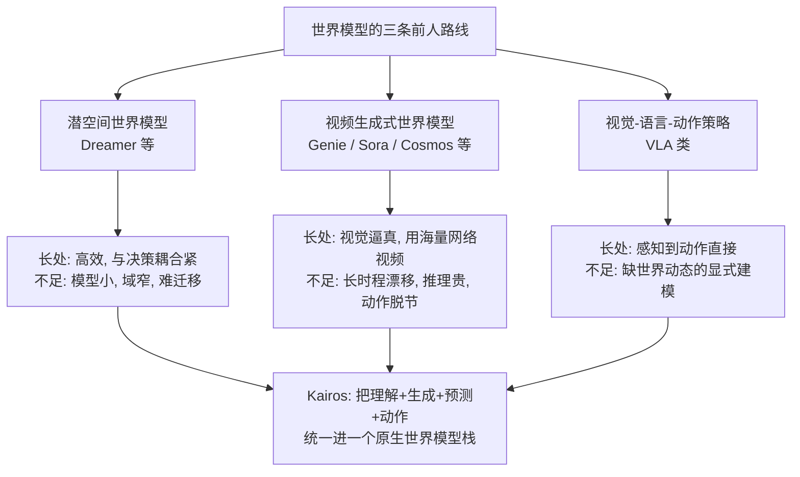
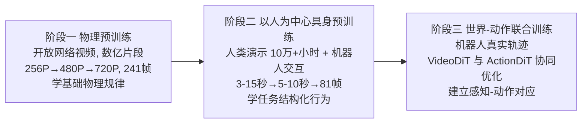
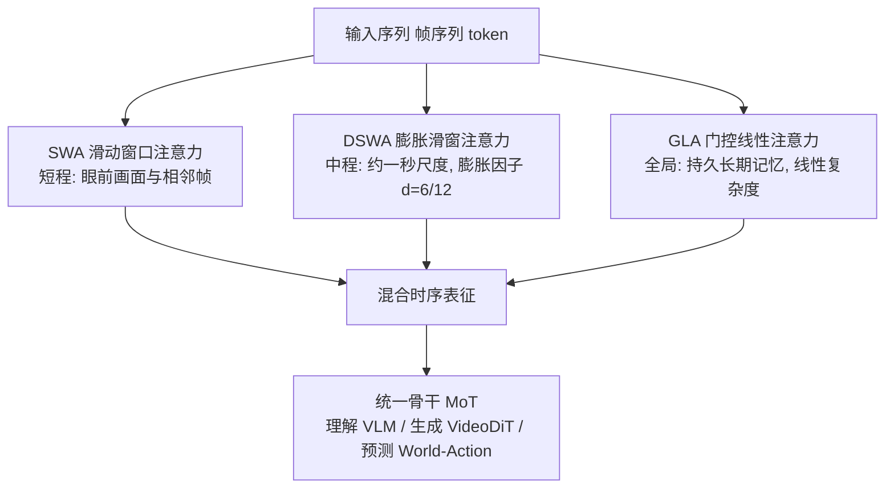

# Kairos：面向物理 AI 的原生世界模型栈

> **原题**：Kairos: A Native World Model Stack for Physical AI
> **作者**：Fei Wang, Shan You, Qiming Zhang, Tao Huang, Zuoyi Fu, Zhisheng Zheng 等，末位为 Dacheng Tao、Xiaogang Wang，共 23 位署名
> **机构**：公开页面未逐一列出，提交信息显示为 Kairos Team
> **年份**：2026（arxiv ID 2606.16533）
> **分类**：cs.AI / cs.CV
> **链接**：https://arxiv.org/abs/2606.16533
> **精读日期**：2026-06-18

## 阅读须知

**这篇在领域里的位置。** 世界模型（world model）这一类工作，最早的用途是给强化学习的智能体提供一个可以在脑子里推演的环境。智能体不必每一步都去真实世界里试错，而是先在一个学出来的"world model"里想象若干步，再决定动作，代表工作是早年的 World Models 与后来的 Dreamer 系列。过去两三年，这条线发生了一次明显的偏移：随着视频生成模型变得足够强，世界模型越来越多地被当成一个"可控的视频生成器"来做，给定当前画面与一个动作，模型预测出接下来若干帧会是什么样子，Genie、Sora 一类的工作以及面向机器人的 Cosmos 系列都属于这个方向。Kairos 这篇论文的立场，是对这一偏移提出修正：它认为把世界模型停留在"生成好看的视频"这一层是不够的，世界模型应当成为物理 AI（Physical AI，指要在真实物理世界里感知与行动的智能系统，典型载体是机器人）的一套可运营的底层基础设施。它要同时承担理解、生成、预测、动作四件事，并且能在真实部署的算力与延迟约束下跑起来。

**读完这份笔记能回答什么。** 第一，为什么作者说世界模型正在从"被动的视觉生成器"转变为"可运营的基础设施"，Kairos 具体补上了过去缺的哪一块。第二，它的跨形态数据课程（Cross-Embodiment Data Curriculum）分成哪三个阶段、每个阶段喂什么数据、为什么要按这个先后顺序来。第三，它的混合线性时序注意力（Hybrid Linear Temporal Attention）由哪三种注意力拼成，各自负责哪一段时间尺度，为什么不能只用一个全局注意力了事。第四，论文给出的那个"误差不随时间无限放大"的理论保证大致在讲什么、凭什么成立。第五，Kairos 在效率与能力之间做了怎样的取舍，这个取舍的代价落在哪里。

**阅读前置。** 这份笔记假定读者熟悉 Transformer 与自注意力的基本结构，知道扩散模型（diffusion model）大致是怎样从噪声里一步步还原出图像或视频的，也大致了解机器人领域的模仿学习与具身智能在做什么。但它不预设读者专门研究过世界模型，也不预设读者读过线性注意力（linear attention）这一支的工作；这两块会在用到时先铺垫再展开。

**首次出现的缩写表。**

- **Physical AI（物理 AI）**：需要在真实物理世界里感知、预测并行动的智能系统，机器人是其主要载体。
- **World Model（世界模型）**：一个学出来的、能根据当前状态与动作预测世界后续演化的模型。
- **MoT（Mixture-of-Transformers，混合 Transformer）**：本文用来把多种功能塞进同一个骨干网络的结构，不同功能走不同的专用参数分支。
- **VLM（Vision-Language Model，视觉语言模型）**：负责"理解"画面与指令的模块。
- **DiT（Diffusion Transformer，扩散 Transformer）**：用 Transformer 做骨干的扩散生成模型；本文分为 VideoDiT（生成视频）与 ActionDiT（生成动作）。
- **CEDC（Cross-Embodiment Data Curriculum，跨形态数据课程）**：把不同来源、不同"身体形态"的数据排成一条由易到难的训练路径。
- **SWA（Sliding-Window Attention，滑动窗口注意力）**：只在一个固定时间窗口内做注意力，管最近的局部动态。
- **DSWA（Dilated Sliding-Window Attention，膨胀滑动窗口注意力）**：在滑窗里按固定间隔跳着取样，管中程依赖。
- **GLA（Gated Linear Attention，门控线性注意力）**：用一个随时间递推的状态矩阵保存长期记忆，复杂度随序列长度线性增长。
- **Flow Matching（流匹配）**：一种训练生成模型的目标，可粗略理解为扩散模型的近亲。
- **DPO（Direct Preference Optimization，直接偏好优化）**：一种用偏好数据直接微调模型的方法。
- **LIBERO-plus / RoboTwin 2.0 / WorldModelBench / DreamGen Bench**：论文用到的几个具身控制与世界模型评测基准。

## 为什么这个问题值得做

要让一台机器人在厨房里把一个鸡蛋从冰箱拿到灶台，它需要的不只是"看懂当前画面"，更要能预判：如果手往这个方向移动，鸡蛋会不会滚下去，水会不会洒出来。这种"预判世界接下来会怎样"的能力，正是世界模型要提供的东西。问题在于，过去把世界模型做成视频生成器的路线，在真正拿去做决策时会撞上三堵墙。

第一堵墙是长时程漂移。视频生成式的世界模型往往只能稳定预测很短的一段，时间一长，画面就会逐渐失真、物体会凭空出现或消失，预测出来的"未来"不再可信。第二堵墙是部署成本。这类模型大多依赖全局自注意力，算力随预测长度二次增长，要在机器人本体那种消费级算力上做到低延迟的实时滚动预测，几乎不现实。第三堵墙是学习方式的割裂：理解画面的模型、生成画面的模型、输出动作的模型常常是三套独立系统拼在一起，彼此之间的世界知识无法共享。Kairos 想做的，是把这三堵墙一起拆掉，并且强调一个"原生"（native）的立场，即从一开始就按"要拿去真实部署、要长期运行、要从异构经验里学"这套要求来设计，而不是先做一个视频生成器、再事后改造成能用的东西。

## 一、问题

把上面的动机落到一个可验证的技术陈述上，Kairos 要解决的问题是：构造一个统一的世界模型，使它能够其一，原生地从异构经验中获取世界知识；其二，在很长的时间跨度上维持一个持续、可靠的状态；其三，在真实部署的算力约束内高效执行感知到动作的闭环。这三条诉求分别对应了上一节的三堵墙。

理解这篇的价值，需要先看清前人三条主流路线各自做对了什么、又在哪里不够用。

第一条是为强化学习服务的潜空间世界模型，以 Dreamer 系列为代表。它的做法是把高维观测压进一个低维的潜空间，在这个潜空间里学习状态如何随动作演化，智能体则在想象出来的轨迹上学策略。这条路线的长处是高效、与决策耦合得紧；它的不足在于模型通常偏小、训练数据局限在单一狭窄的任务域，学到的"世界"很难迁移到开放环境。

第二条是视频生成式世界模型，把问题表述成"给定历史画面与动作，生成未来画面"，借用近年视频扩散模型的强大生成力。它的长处是视觉上逼真、能利用海量无标注网络视频；不足则正是前面说的两点，长时程会漂移，推理代价高，而且生成出来的画面与机器人真正要执行的动作之间往往是脱节的。

第三条是直接的视觉-语言-动作策略模型，给定画面与指令直接回归出动作。它擅长把感知映射到动作，却往往缺少对世界动态的显式建模，也就是说它知道"现在该怎么动"，却不太会"推演这么动之后世界会变成什么样"。



Kairos 的回答，是不在三条路线里选一条，而是把"理解、生成、预测、动作"四件事收进同一个骨干，让它们共享同一套世界知识，再用专门设计的注意力结构与训练课程，分别去对付长时程与部署效率这两个老问题。

## 二、方法

Kairos 的方法可以拆成三根支柱，论文用三个动词来概括：用一套原生预训练范式去"学"世界，用一套统一架构去"维持"世界，用一套面向部署的系统协同设计去"运行"世界。下面依次展开前两根，第三根因为公开正文给出的细节有限，只作简述。

**第一根支柱：跨形态数据课程，决定怎么学。**

所谓课程（curriculum），指的是不把所有数据一股脑混在一起训练，而是排成一条由易到难、由泛到专的路径，让模型像发育一样逐级长本事。Kairos 把这条路径分成三个阶段。

第一阶段是物理预训练，数据来自开放网络视频，规模在"数以亿计的视频片段"这一量级。这一阶段模型只是被动地看，目标是从海量视频里吸收最基础的物理规律，例如重力、质量守恒、流体如何流动。训练本身也按由粗到细推进，先在低分辨率（256P）上做图像预训练，再做图像与视频的混合训练并逐级提分辨率（256P 到 480P 再到 720P），最后做长视频的连续预训练，一次喂进 241 帧。

第二阶段是以人为中心的具身预训练，数据换成人类演示加上机器人交互，其中人类行为数据的规模超过十万小时。这一阶段的重点，是从"被动地看"转向"理解任务结构化的行为"，也就是开始看懂一个动作序列是为了完成什么目标。视频长度也随之调整，人类演示片段为三到十五秒，机器人片段为五到十秒，到目标具身微调时收敛到 81 帧。

第三阶段是世界与动作的联合训练，数据进一步聚焦到机器人的真实交互轨迹。这一阶段让负责生成视频的 VideoDiT 与负责生成动作的 ActionDiT 联合训练，把整套混合 Transformer 栈一起协同优化，目标是建立感知与动作之间的对应关系（perception-action grounding），即让模型对画面的预测和它给出的动作真正咬合在一起。



**第二根支柱：原生统一架构，决定怎么维持。**

Kairos 把三种能力放进同一个骨干，用的是混合 Transformer（MoT）的思路：理解部分由一个视觉语言模型承担，生成部分由 VideoDiT 承担，预测部分则由一个世界-动作模型（World-Action Model）承担，它们共用骨干、但各自走专门的参数分支。这样做的用意，是让"看懂画面"得到的世界知识，能够直接被"生成未来"和"决定动作"复用，而不是三套系统各学各的。

这根支柱里真正的关键，是它如何维持一个跨越很长时间的状态而不崩坏，答案是混合线性时序注意力。它把三种注意力按时间尺度分工组合起来。

最近的一段由滑动窗口注意力（SWA）负责。它只在一个固定大小的时间窗口内做标准注意力，窗口大小记为 L 乘以 window_size，其中 L 是单帧的 token 数。它管的是短程的时空相关，也就是眼前这一瞬间画面里各处之间、以及相邻几帧之间的关系。

中间的一段由膨胀滑动窗口注意力（DSWA）负责。它的窗口大小和 SWA 一样，但在时间维度上引入了一个膨胀因子 d（取值为 6 或 12），也就是在窗口内按固定间隔跳着取样，从而用同样的计算量覆盖更长的时间跨度，论文称它捕捉的是"一秒钟量级"的中程依赖。实现上它通过把输入张量从形状 (B, F·L, D) 重排成 (B·d, F/d·L, D) 来完成这个膨胀。

最长的那一段，也就是真正的全局长期记忆，由门控线性注意力（GLA）负责，它基于 GatedDeltaNet。这里要先铺垫一下线性注意力的基本想法：标准注意力要让每个位置看到所有其他位置，计算量随序列长度二次增长；线性注意力则把"看过的历史"压进一个固定大小的状态矩阵 S，每来一个新位置就更新一次这个矩阵，于是计算量只随长度线性增长。GLA 在此之上加了门控。它的更新规则大致是：先从输入算出查询、键、值和一个门控量，

```
q_t = W_Q x_t,  k_t = W_K x_t,  v_t = W_V x_t,  β_t = σ(W_β x_t)
```

然后用旧状态检索出一个旧值并与新值做插值，

```
v_t^old = S_{t-1} k_t
v_t^new = β_t v_t + (1 - β_t) v_t^old
```

最后做带遗忘门的 delta 更新，得到新的状态矩阵，再由它生成输出：

```
S_t = α_t S_{t-1} - v_t^old k_t^T + v_t^new k_t^T
o_t = S_t q_t
```

其中 α_t 是一个介于零到一之间的遗忘门，由输入算出，作用是自适应地决定旧记忆保留多少。



为什么这样分工能解决长时程漂移，论文给了形式化的理论支撑，核心是两个定理。定理一说明的是"只靠最近窗口不够用"：如果最优的全历史预测器无法从最近这个窗口里完全恢复出来，那么只用局部窗口就一定会带来一个严格大于零的额外风险，这个额外风险等于在给定窗口条件下目标量的条件方差。换句话说，丢掉远处的历史是有代价的，这就解释了为什么还需要一个负责全局记忆的 GLA。

定理二则说明"混合多尺度记忆是足够的"。它给出一个渐近的误差上界，形式上界由两部分相加再平方：一部分来自学习本身的误差上界 ε，另一部分来自门控 delta 更新的扰动，写作 ξ̄ 除以 (1 - ρ)，其中 ρ 是那个门控 delta 更新的收缩因子且严格小于一，ξ̄ 是单步扰动的最大值。这里最关键的一点是，因为 ρ 小于一，更新是收缩性的，所以单步引入的扰动会被一步步压下去而不是被放大，长时间之后误差 e_t 收敛到一个有界的值 ξ̄/(1-ρ)。这就是"误差不随时间无限累积"这一结论的数学来源。

训练目标方面，生成部分用的是流匹配（Flow Matching），后期还引入了直接偏好优化（DPO）与强化学习来做对齐与精调。

**第三根支柱：面向部署的系统协同设计，决定怎么运行。** 这一根的目标是让模型能在服务器以及消费级硬件上做到低延迟的滚动预测，以支撑真实世界里"观测、动作、反馈"的闭环。论文声称推理时间随序列长度线性扩展，这与上面 GLA 的线性复杂度是一致的。不过公开正文里关于这一根的具体工程细节大多落在被截断的章节，本笔记不展开推测。

## 三、实验

论文在三类基准上做评测：具身世界模型类、长时程类、以及动作策略类。公开正文中点到名字的基准包括 LIBERO-plus 与 RoboTwin 2.0 这两个轨迹驱动的具身控制基准，以及 WorldModelBench 与 DreamGen Bench 这两个世界模型生成质量基准。

主要结论有两条。第一条是能力，论文称 Kairos 在具身世界模型与世界-动作模型两类基准上都达到了当前最好水平，并且表示它"匹配甚至超过了规模明显更大的同类模型"。第二条是效率，论文给出的图表显示其推理时间随序列长度线性扩展，相对同类有显著的效率优势。把能力与效率放在一起，论文把 Kairos 的卖点归结为一个良好的效率与能力的权衡。

需要诚实地标注一处缺口。本次能抓取到的公开正文，并没有给出各基准上的具体百分比数值、对比的 baseline 模型的确切名称、以及完整的消融实验表格；正文的目录显示确实存在两组消融实验，分别针对具身世界模型基准与世界-动作模型基准，但具体数据落在被截断的部分。因此下面这张表只能如实区分"已披露"与"未披露"，而不能把不存在的数字填进去。

| 维度 | 已从公开正文确认 | 公开正文未提供 |
| --- | --- | --- |
| 评测基准 | LIBERO-plus、RoboTwin 2.0、WorldModelBench、DreamGen Bench | 各基准上的逐项分数 |
| 性能结论 | 两类基准均称达到 SOTA，称匹配或超过更大模型 | 具体百分比、与各 baseline 的差值 |
| 推理效率 | 推理时间随序列长度线性扩展，图示有显著优势 | 具体延迟（毫秒）、吞吐量数值 |
| 消融实验 | 目录确认存在两组消融 | 消融的具体数据与结论 |
| 跨形态泛化 | 有展示多种机器人类型的图 | 定量的泛化性能指标 |

正因为最有说服力的那部分量化证据落在抓取不到的区域，对这篇的实验强度，目前只能做有保留的判断：方法设计与理论部分是清楚而自洽的，但"SOTA"这一结论的分量，要等读到完整的结果表与消融表之后才能真正确认。

## 四、局限

把作者自己承认的，与读完之后读者能看出来的，分开来讲。

作者承认的部分主要有两处。其一在架构上，GLA 是整套结构里唯一的全局注意力机制，这一安排会限制可用的并行化策略，论文提到为此需要一套定制的、算子级的并行切分方案，这意味着工程实现并不轻松。其二在数据上，论文坦言机器人数据依然稀缺、狭窄、且难以规模化，并指出机器人数据虽然与具身操作最相关，却也最为昂贵，这等于承认第三阶段联合训练所依赖的最关键数据，恰恰是最难拿到的。

读者能进一步看出的潜在问题有三点。第一，那两个漂亮的理论保证是有前提的，定理二要求门控 delta 更新的收缩因子 ρ 严格小于一，也要求学到的混合预测器能把各时间尺度的分量近似到误差 ε 以内；但模型在实践中能否可靠地学到一个满足收缩条件的参数，论文并未给出经验验证，理论的优雅与实践的成立之间还隔着一段没有被填上的距离。第二，部署效率是这篇的主要卖点之一，可是"低延迟""消费级硬件"这些说法在公开正文里缺少具体的延迟数字支撑，一个面向真实闭环的系统，没有端到端的时延数据，其部署可用性就还停留在声称的层面。第三，跨形态是它命名与设计的核心，但目前只看到展示多种机器人类型的定性图，没有看到定量的跨形态泛化指标，因此它到底能在多大程度上把一种身体上学到的技能迁移到另一种身体，仍是未知数。

## 一句话

把理解、生成、预测、动作统一进一个原生世界模型栈，用跨形态数据课程从异构经验里学物理，并以混合线性注意力加理论界来保证长时程状态不漂移。
