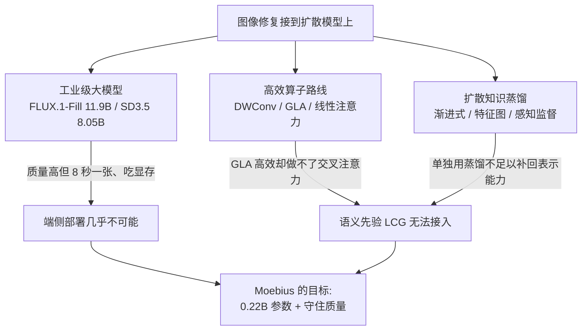
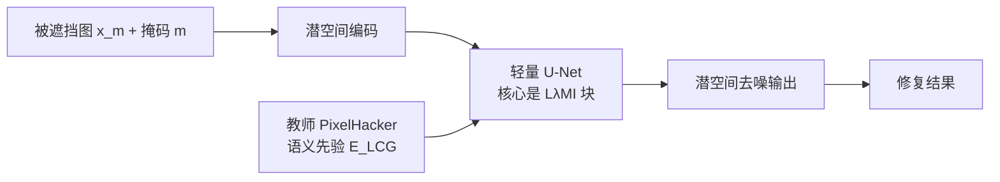
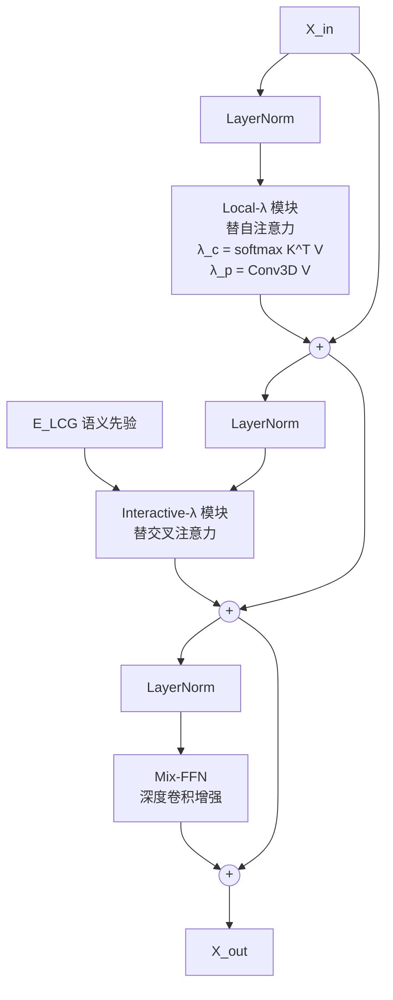
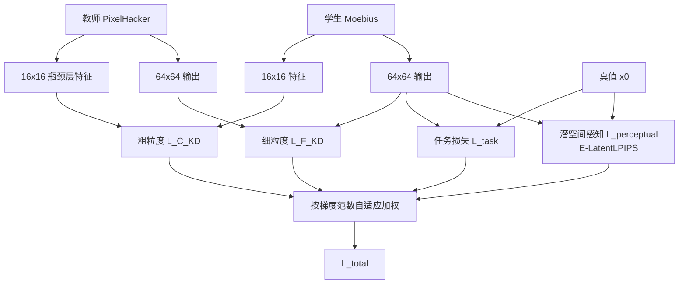

# Moebius：用 0.2B 参数做出 10B 级别的图像修复

> **原题**：Moebius: 0.2B Lightweight Image Inpainting Framework with 10B-Level Performance
> **作者**：Kangsheng Duan, Ziyang Xu, Wenyu Liu, Xiaohu Ruan, Xiaoxin Chen, Xinggang Wang
> **机构**：arxiv 摘要页未明确列出（此处不臆断，以原文为准）
> **年份**：2026（arxiv ID 2606.19195，6 月 17 日提交）
> **分类**：cs.CV
> **链接**：https://arxiv.org/abs/2606.19195
> **精读日期**：2026-06-19

## 阅读须知

### 这篇在领域里的位置

图像修复（inpainting）讲的是这样一件事：给定一张被遮挡或者被抠掉一块的图，模型要把缺失的那一块按周围的内容补回来，补出来的部分既要和周边自然衔接，又要在语义上说得通。这几年这个方向的主流，是把它接到扩散模型（diffusion model）上来做，原因是扩散模型本身就擅长从噪声里一步步生成逼真的图像内容。

沿着这条路走下去，业界出现了一批"工业级地基模型"，例如 FLUX.1-Fill-Dev、SD3.5 Large-Inpainting。它们参数动辄上百亿，修复质量极高，但代价是推理又慢又吃显存。于是另一条线开始反向用力，问的是能不能把模型做小。过去几年压缩扩散模型的常见手段大致分两类：一类是换更省的算子，例如深度可分离卷积与各种线性注意力；另一类是用知识蒸馏，让小模型去模仿大模型。Moebius 这篇正好站在这两条线的交叉口上，它要的不是温和地瘦身，而是把参数压到只有头部模型的百分之二（0.22B 对 11.9B），同时还要把质量守住。

### 读完能回答什么

读完这份笔记，应该能回答下面几个问题：

- 为什么把扩散修复模型"暴力压小"会触发所谓的表示瓶颈，质量究竟会崩在哪里？
- Local-λ Mix Interaction 这个模块，是怎么用固定大小的矩阵绕开标准注意力的平方复杂度的？
- 为什么作者坚持把蒸馏全程放在潜空间里做，而不是解码回像素空间再比对？
- 这套自适应多粒度蒸馏里的几个损失项各自管什么，谁的贡献最大？
- 0.22B 的小模型最终在哪些任务上反超了 11.9B 的 FLUX，又在哪里仍然不如它的老师？

### 阅读前置

假定读者熟悉扩散模型与 Transformer 的基本结构，知道什么是自注意力（self-attention）与交叉注意力（cross-attention），也用过 PyTorch 的常见张量算子；但不预设读者专门做过低层视觉或者图像修复，也不预设熟悉线性注意力的各种变体。文中出现的专业名词，第一次都会先铺垫再展开。

### 缩写表

- **inpainting（图像修复）**：把图像中缺失或被遮挡的区域补全的任务。
- **LDM（Latent Diffusion Model，潜空间扩散模型）**：先用一个自编码器把图像压到低维潜空间，在潜空间里做扩散去噪，最后再解码回图像，借此大幅省显存。
- **L𝜆MI（Local-λ Mix Interaction）**：本文提出的核心模块，用两个 λ 矩阵分别替代自注意力与交叉注意力。
- **GLA（Gated Linear Attention，门控线性注意力）**：一类把注意力复杂度从平方降到线性的算子。本文指出它天生不擅长做交叉注意力。
- **LCG（Latent Categories Guidance，潜类别引导）**：来自教师模型 PixelHacker 的一组语义先验嵌入，用来提示模型"这块缺失区域大概是什么东西"。
- **KD（Knowledge Distillation，知识蒸馏）**：让小的学生模型去模仿大的教师模型的输出或中间特征。
- **DWConv（Depthwise Convolution，深度可分离卷积）**：一种省参数的卷积形式。
- **FID / LPIPS**：两个常用的生成质量指标。前者衡量生成分布与真实分布之间的距离，后者衡量感知层面的相似度，两者都是越低越好。
- **E-LatentLPIPS**：一种直接在潜空间里计算、因而省显存的 LPIPS 变体。

把一张照片里多余的人或物抹掉、再把背景补得天衣无缝，这件事在手机相册、电商图与影楼修图里每天都在大量发生。问题在于，今天质量最好的那批修复模型实在太重了。以 FLUX.1-Fill-Dev 为例，它有 119 亿参数，跑一张图要分几十步去噪，一次推理在 8 秒上下，显存占用也很可观。这样的模型放在云端批量服务尚可，一旦想塞进手机或相机这类端侧设备，几乎没有可能。

那么能不能直接把模型做小？这正是过去这一拨工作卡住的地方。作者把困境点得很直接：当你用深度可分离卷积与轻量注意力去做极端的结构压缩时，模型会遭遇一个严重的表示瓶颈，生成质量出现灾难性的退化。换句话说，省下来的不只是参数，还有模型把上下文信息组织起来的能力。于是真正的问题就不再是"能不能压小"，而是"压到只剩百分之二的参数之后，怎么把丢掉的那部分表示能力重新找回来"。Moebius 给出的回答由两部分组成：一个新的算子模块，加上一套把大模型知识灌进小模型的蒸馏方案。

## 一、问题

把上面那段动机落到一个可验证的技术陈述上，作者要回答的是这样一个问题：一个高度优化、只针对修复这一件事的轻量专才，能不能跨越参数上的巨大鸿沟，去和百亿级别的通才正面掰手腕。这里"专才"与"通才"的对立很关键。FLUX.1-Fill-Dev 这类模型是通才，它什么图都想生成；而 Moebius 只做修复一件事，于是有机会把每一份参数都花在刀刃上。

要理解这条路难在哪里，先要把前人的几条路线摆清楚。第一条是工业级大模型本身，例如 FLUX.1-Fill-Dev（11.9B）与 SD3.5 Large-Inpainting（8.05B），它们在论文里扮演的是质量上限，是被追赶的对象。第二条是高效算子，常见的有深度可分离卷积（用来省下局部特征提取的开销）、门控线性注意力（GLA，用来把自注意力的复杂度降到线性）、各种线性注意力变体以及低秩前馈层。第三条是面向扩散模型的知识蒸馏，包括按时间步压缩的渐进式蒸馏、特征图蒸馏，以及用感知指标做监督的蒸馏。

这三条线各有用处，但拼在一起时会撞上一个结构性的矛盾，而这正是本文的切入点。作者指出：GLA 虽然在自注意力上很高效，但它的形式天生没法做交叉注意力，而交叉注意力恰恰是把外部语义先验（也就是 LCG）整合进来所必需的。换句话说，如果你为了省算力把自注意力换成 GLA，就等于堵死了引入语义引导的通道；而修复任务又特别需要这种"这块缺的东西大概是什么"的语义提示。这一矛盾让"同时优化两种注意力"变得不可能，前人的高效算子路线在这里走不通。



## 二、方法

Moebius 整体仍然是一个潜空间扩散模型。输入有两样东西：一张被遮挡的图，记作 x_m = x ⊙ (1 − m)，也就是用掩码 m 把要修的区域抠掉之后剩下的部分；以及那张二值掩码本身。去噪网络是一个轻量化的 U-Net，但把里面的核心算子换成了本文提出的 L𝜆MI 块。语义引导来自一个教师模型 PixelHacker，它提供一组潜类别引导嵌入 E_LCG ∈ ℝ^(K×D)，相当于把"缺失区域可能属于哪些类别"这件事编码成了 K 个向量。



### L𝜆MI 块：用矩阵替代两种注意力

这篇最核心的设计是 Local-λ Mix Interaction 块，它由三个部分组成，分别对应自注意力、交叉注意力与前馈层。理解它的关键，是抓住一个共同的思路：与其去算那个随序列长度平方增长的注意力图，不如先把上下文信息压缩成一个固定大小的小矩阵，再让查询去和这个小矩阵相乘。这个被反复使用的小矩阵，作者统一记作 λ。

第一部分是 Local-λ 模块，它扮演自注意力的角色。它先把输入 X 投影成多查询的 Q、键 K、值 V，然后构造两个紧凑矩阵。一个是语义内容映射 λ_c = softmax(K)^⊤ V，它把所有位置的内容信息汇总进一个固定大小的矩阵里；另一个是位置映射 λ_p = Conv3D_pos(V)，它用一个三维卷积来补上空间位置信息。最终输出是 Y = Q λ_c + Q λ_p。这里的妙处在于，由于 λ_c 与 λ_p 的尺寸只取决于通道数而不取决于像素个数，计算量就从平方降到了线性。

第二部分是 Interactive-λ 模块，它扮演交叉注意力的角色，专门负责和外部语义先验 E_LCG 交互。它把当前潜变量投影成 Q，把 E_LCG 投影成 K 与 V，再加一个轻量的位置嵌入 E_pos。形式上与前面对称：λ_c = softmax(K)^⊤ V，λ_p = E_pos V，输出 Y = Q λ_c + Q λ_p。作者强调这是第一次把交叉注意力也写成"固定大小矩阵交互"的形式。回到第一节那个矛盾，正是这一步把 GLA 做不了的交叉注意力补了回来，让语义引导重新有了进入模型的通道。

第三部分是 Mix-FFN，它替代标准的稠密前馈层。做法是把普通的稠密投影换成一个带深度卷积增强的结构，据论文报告，仅这一项就省下约 48M 参数并显著降低浮点运算量。

把三部分串起来，一个 L𝜆MI 块的前向过程是这样的（论文式 3，LN 表示层归一化，残差连接用加法）：

```
X1   = Local-λ(LN(X_in)) + X_in
X2   = Interactive-λ(LN(X1), E_LCG) + X1
X_out = Mix-FFN(LN(X2)) + X2
```



### 自适应多粒度蒸馏：全程留在潜空间

光有一个省参数的算子还不够，因为极端压缩之后表示能力会掉，作者要靠蒸馏把它补回来。这里有一个贯穿始终的设计选择：整套蒸馏严格地在潜空间里进行，不解码回高分辨率图像。原因是解码高分辨率潜变量会带来很大的显存开销，而修复又往往是高分辨率任务，于是干脆全程不出潜空间。

蒸馏分三个粒度。第一是粗粒度损失，作用在 U-Net 的 16×16 瓶颈层，写作 L_C_KD = ||x̂_C_T − x̂_C_S||²，它让教师在上采样之前的特征和学生在下采样之后的特征对齐。第二是细粒度损失，作用在 64×64 的输出端，这里同时有任务损失 L_task = ||x0 − x̂_S||²（学生预测和真值之间的差）和细粒度蒸馏损失 L_F_KD = ||x̂_T − x̂_S||²（学生预测和教师预测之间的差）。第三是潜空间感知损失 L_perceptual，用前面提到的省显存的 E-LatentLPIPS 来度量，让结果在感知层面更接近真值。

这么多损失项放在一起，权重怎么定就成了问题。作者没有手工调系数，而是用一种基于梯度范数的自适应平衡：哪一项的梯度偏弱，就给它更大的权重，使各项对参数的推动力大致相当（论文式 4 至式 5）。这样做的好处是省去了大量手工调超参的工作。



## 三、实验

评测用的数据集覆盖自然场景与人像两类。自然场景主要用 Places2，包括 512 分辨率、掩码占比四到五成的 1 万张测试图，以及大小掩码各自的 3.65 万张验证集，还有一个 256 分辨率的版本；人像方面用 CelebA-HQ（512 分辨率，3 千张）与 FFHQ（256 分辨率，1 万张）。指标用 FID 与 LPIPS（都是越低越好），再加上人类偏好的用户研究，以及推理时延。

最直接的对照是 Moebius 与 FLUX.1-Fill-Dev 在效率上的差距。下面这张表把关键数字摆在一起。

| 指标 | Moebius | FLUX.1-Fill-Dev |
|---|---|---|
| 参数量 | 0.22B | 11.9B（约 2% 对照） |
| 浮点运算 | 0.154 TFLOPs | — |
| 单步时延 | 26.01 ms | — |
| 去噪步数 | 20 | 50 |
| 总推理时间 | 0.52 s | 8.05 s（慢 15 倍以上） |

质量上的结果更值得玩味，因为在好几个基准上这个 0.22B 的小模型不只是追平，而是反超了 11.9B 的 FLUX。在 Places2（小掩码、自然场景）上，Moebius 的 FID 为 0.92、LPIPS 为 0.091，略好于 FLUX 的 0.94 与 0.099。在 CelebA-HQ（512，人像）上差距拉得更开，Moebius 的 FID 为 5.39、LPIPS 为 0.122，而 FLUX 是 10.13 与 0.141，FID 上接近腰斩。在 FFHQ（256，人像）上，Moebius 的 FID 为 8.15，对 FLUX 的 11.19，仍是明显领先。

| 基准 | Moebius FID / LPIPS | FLUX.1-Fill-Dev FID / LPIPS |
|---|---|---|
| Places2（小掩码） | 0.92 / 0.091 | 0.94 / 0.099 |
| CelebA-HQ（512） | 5.39 / 0.122 | 10.13 / 0.141 |
| FFHQ（256） | 8.15 / 0.231 | 11.19 / 0.268 |

消融实验把"表示瓶颈"这件事讲得很清楚，也回答了这套方法到底哪一部分在起作用。在一个 GLA 加交叉注意力加前馈层的基线上（526M 参数），FID 是 32.75；如果只是简单粗暴地换上 Local-λ，FID 反而恶化到 37.65；如果只用深度可分离卷积而去掉 λ 模块，FID 崩到 43.58，这就是所谓的灾难性退化。真正的转折发生在加入蒸馏之后：两个 λ 模块在没有蒸馏时 FID 为 33.21，加上蒸馏后直接降到 24.73，一步提升了 8.48。作者另给的一组对照是，极端压缩在没有蒸馏时 FID 为 33.42，蒸馏把它拉回 26.43。换句话说，省参数的算子负责把模型做小，而蒸馏才是把质量守住的那只手。

蒸馏内部的拆解同样有说服力。只用粗粒度损失时 FID 高达 74.20；加上细粒度损失降到 36.17；再加任务损失到 32.59；最后补上潜空间感知损失，降到 26.43。四项逐级叠加，每一项都有可见的贡献，其中感知损失这一步把视觉质量又往前推了一截。

| 蒸馏配置 | FID |
|---|---|
| 仅粗粒度 | 74.20 |
| + 细粒度 | 36.17 |
| + 任务损失 | 32.59 |
| + 潜空间感知损失 | 26.43 |

用户研究里有一个反直觉但合理的结果。在 22 名参与者、每个领域 50 个测试样例的设置下，Moebius 拿到约 31.76% 的平均偏好，几乎贴平它的教师 PixelHacker（32.18%），而远高于 FLUX.1-Fill-Dev 的 23.70% 与 SD3.5 的 12.36%；在人像这一项上 Moebius 甚至以 32.27% 排第一。也就是说，一个学生在人类主观偏好上追平了自己的老师。在效率端，单步时延的对比（L40S 显卡，批量 1，512 分辨率）是 Moebius 26.01 毫秒、PixelHacker 46.89 毫秒、SD3.5 151.02 毫秒、FLUX 161.01 毫秒，差距相当悬殊。

## 四、局限

作者自己承认的局限集中在细节生成上。在那些背景纹理本就极其有限的极端情形里，0.22B 的 Moebius 在恢复细小的几何结构时会力不从心，生成的细节相比它那个约 1B 参数的教师会"略欠合理"。作者把这一点定性为"在严苛的效率、参数、性能三者权衡下可以接受的微小退化"。

除了作者承认的，读完还能看出几处值得留意的边界。其一是对教师的依赖：整套方法建立在 PixelHacker 这个教师以及它产出的 LCG 语义先验之上，蒸馏的质量上限实际上被教师框住了，换一个领域或换一个教师时，这套先验是否还成立需要重新验证。其二是"专才"的代价：Moebius 是专门为修复优化的，论文也反复强调这一点，因此它并不像 FLUX 那样是一个通用生成模型，迁移到别的生成任务上不能想当然。其三是"10B 级别"这个说法需要放在语境里看：它指的是在这些特定基准上对标 FLUX 的质量，而真正被追平的那个对象（教师 PixelHacker）本身参数量并不大，所以这里更准确的描述是"小学生追平了不大的老师，并在这些基准上压过了更大的通才"，而非在所有维度上等价于百亿模型。其四，用户研究里各方法的绝对偏好都在三成上下，说明没有哪一方形成压倒性优势，主观质量的差距其实没有 FID 数字看上去那么大。

## 一句话

用固定大小的 λ 矩阵替代自注意力与交叉注意力，再配合全程留在潜空间的多粒度蒸馏，把图像修复模型压到 0.22B 参数、推理快 15 倍而质量不降。
