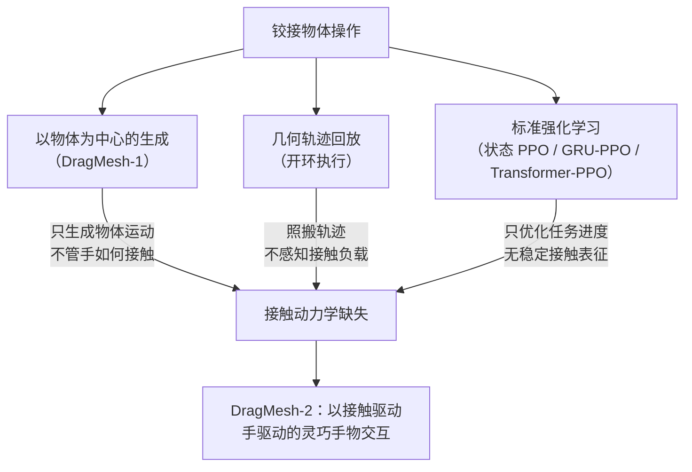
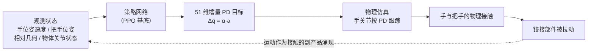
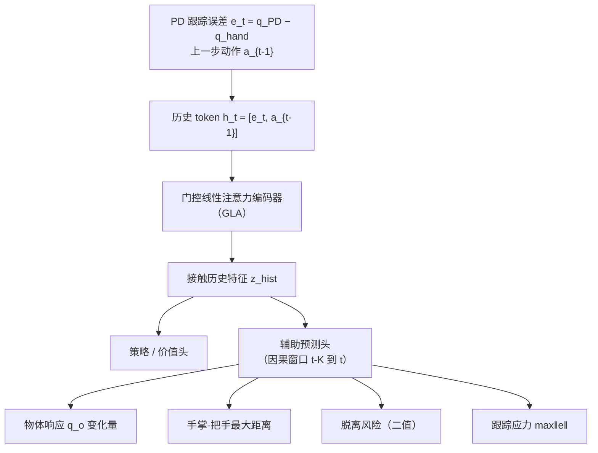
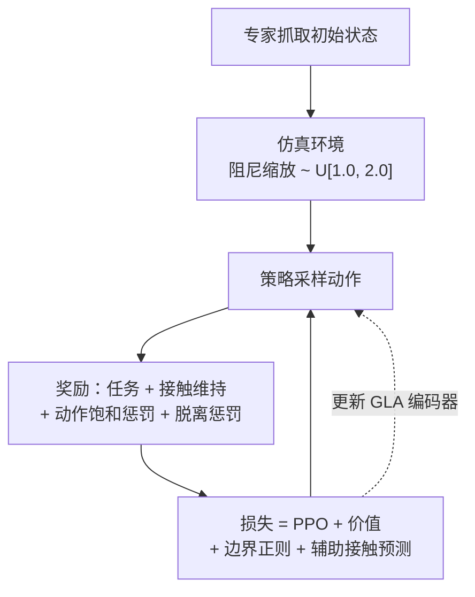

# DragMesh-2：让灵巧手通过物理接触，去拉动铰接物体

> **原题**：DragMesh-2: Physically Plausible Dexterous Hand-Object Interaction with Articulated Objects
> **作者**：Tianshan Zhang, Yijia Duan, Yanjun Li, Zeyu Zhang, Hao Tang
> **机构**：arxiv 摘要页未明确列出，此处不臆断，以原文为准
> **年份**：2026（arxiv ID 2606.15133，6 月 13 日提交）
> **分类**：cs.RO（机器人学）/ cs.CV（计算机视觉）
> **链接**：https://arxiv.org/abs/2606.15133
> **精读日期**：2026-06-20

## 阅读须知

**这篇在领域里的位置。** 这篇论文属于机器人学习里一个正在升温的子方向：用多指灵巧手去操作铰接物体（articulated objects）。所谓铰接物体，指的是自身带有关节、某个部件可以相对主体转动或滑动的日常物件，比如可以拉开的抽屉、能推开的门、向上掀起的微波炉门。过去几年，这个方向上的工作大致分成两条线。第一条线关注的是物体本身，研究如何为这些部件生成一段合理的运动轨迹，知道门应该绕哪根轴转、抽屉应该沿哪个方向滑，这一类被称作以物体为中心（object-centric）的铰接生成，本文的前身 DragMesh-1 正属于此。第二条线关注的是手，研究一只机械手或灵巧手如何把物体抓起来、移动到别处，但它处理的多半是刚性的、不带关节的静态物体。这篇 DragMesh-2 想做的，是把这两条线接起来：不再只是凭空生成物体部件该怎么动，而是让一只灵巧手通过实实在在的物理接触，把那个部件真正拉开。

**读完能回答什么。** 读完这份笔记，应当能回答下面这几个问题：

- 为什么铰接物体的灵巧操作不能照搬抓取静态物体那一套，它真正的难点在哪里。
- PICA 这套训练机制，是怎么在完全没有力觉和触觉传感器的前提下，把物理接触信息注入策略学习的。
- 为什么一个策略「在标称工况下成功率很高」，反而可能是一个危险的信号。
- DragMesh-2 相比纯强化学习、轨迹回放、平行夹爪这几条基线，在接触负载变化时的鲁棒性差距究竟有多大。
- 那个门控线性注意力时序编码器，和它附带的四个辅助预测目标，各自贡献了什么。

**阅读前置。** 这份笔记假定读者熟悉强化学习的基本框架，知道什么是策略、奖励、PPO 这一类策略梯度算法，也大致清楚机器人仿真里关节、自由度、PD 控制这些概念。但不假定读者专门做过灵巧手操作或铰接物体这个细分方向，所有与本子领域相关的术语，都会在首次出现时先铺垫再展开。

**首次出现的缩写表。** 全文会反复用到下面这些缩写，读到中段遇到任意一个，都可以回到这里查：

- **铰接物体（articulated object）**：自身带关节、某部件可相对主体转动或平移的物体，例如门、抽屉、微波炉。
- **旋转关节 / 平移关节（revolute / prismatic joint）**：前者绕一根轴转动（门），后者沿一条直线滑动（抽屉）。
- **DoF（Degrees of Freedom，自由度）**：一个系统可以独立运动的维度数。文中那只手有 51 个自由度。
- **SMPL-X**：一个参数化的人体与手部网格模型，这里被借来当作那只灵巧手的运动学骨架。
- **PD 控制（Proportional-Derivative，比例-微分控制）**：一种经典的底层控制器，根据目标位置与当前位置的差，以及变化速度，算出该施加多大的力。
- **PPO（Proximal Policy Optimization，近端策略优化）**：一种主流的强化学习算法，本文的策略训练以它为基底。
- **GRU（Gated Recurrent Unit，门控循环单元）**：一种处理时序的循环网络结构，被本文当作对比基线之一。
- **GLA（Gated Linear Attention，门控线性注意力）**：本文用来编码接触历史的时序模块。
- **PICA（Physically Informed Contact-Aware，物理信息引导的接触感知）**：本文提出的核心训练机制。
- **GAPartNet**：一个带有可操作部件标注的铰接物体数据集，本文的评测对象取自它。
- **OOD（Out-of-Distribution，分布外）**：测试时遇到的工况，超出了训练时见过的范围。

## 为什么这个问题值得做

设想一个最朴素的家务场景：让机器人去拉开一个抽屉。如果这台机器人装的是一只平行夹爪，也就是那种只能开合两片的简单手，它的做法通常是夹住把手、然后整条手臂往后退。这在抽屉上勉强能用，可一旦换成需要多指配合、施力方向不断变化的场合，比如要稳稳压住一个圆形旋钮再缓缓拉动，两片夹爪就显得过于笨拙。多指灵巧手之所以重要，正是因为它能提供更柔顺、更贴合的接触方式，这是家庭服务、助老助残乃至人形机器人都绕不开的能力。

可是，操作铰接物体有一个抓取静态物体时根本不存在的麻烦。抓一个杯子时，手一旦合拢，杯子就跟着手走，手去哪里它去哪里。但抽屉的滑出、门的转开，机器人是没法直接命令的：策略能控制的只有自己那只手，抽屉那个关节并没有一个可以下指令的通道。换句话说，部件的运动只能作为手与把手之间持续接触的副产品而间接地涌现出来。手必须一直压着、扣着、拉着，那个关节才会动；接触一旦中断，运动立刻停止。

更棘手的是接触负载会变。同样一个抽屉，今天滑轨干涩、阻力很大，明天上了油、轻轻一带就开。如果一个策略只为了「把任务做完」而在固定的动力学条件下训练，它很容易把自己调成专门对付某一种阻力的样子，也就是过拟合到标称的接触负载上。这种策略一旦遇到阻尼变大的抽屉，往往就会失灵，而它偏偏又没有力觉或触觉传感器来察觉「我现在拉得吃力还是轻松」。归根结底，旧路线之所以卡住，是因为它们要么只生成物体该怎么动却不管手怎么接触，要么把手的动作当成开环轨迹照搬一遍，要么用强化学习硬把任务跑通却不去建立一个稳定的接触表征。这篇论文要补的，正是这一块。

## 一、问题

把上面的动机落到一个清晰、可验证的技术陈述上，这篇论文要解决的问题是：训练一只灵巧手的控制策略，让它仅凭运动学层面的观测，在接触负载（具体表现为关节阻尼）发生变化时，依然能稳定地通过物理接触拉开各类铰接部件。这里有两个限定值得专门点出来。其一，观测里没有任何力觉、触觉、深度图或点云，只有手和物体的位置、速度这一类纯几何信息。其二，鲁棒性是相对阻尼变化而言的，训练时见过的阻力范围有限，测试时却要面对成倍放大的阻力。

为了说清楚这篇工作站在哪一步，需要先把前人的几条主流路线摆开，看它们各自做对了什么、又在哪里不够用。

第一条路线是以物体为中心的铰接生成，代表就是本文的前身 DragMesh-1。它的长处在于能为铰接部件提供明确的运动先验，知道门该绕哪根轴转;它的短板在于，这套生成只描述了物体应该如何运动，却完全没有触及一只真实的手要靠怎样的接触才能驱动它，因而无法直接拿去执行。

第二条路线是几何轨迹回放，也就是把一段事先算好的手部轨迹开环地播放一遍。它的问题是开环执行不建模接触动力学：手按既定轨迹走自己的，根本不管此刻有没有真的扣住把手、阻力是大是小，因此一旦阻尼升高，物体跟不上手，任务就失败。

第三条路线是标准的强化学习，文中具体比较了几种变体，包括只用状态输入的 PPO、用门控循环单元的 GRU-PPO、以及用 Transformer 的 Transformer-PPO。这一类的共同毛病是，它们只盯着任务进度去优化，却没有为接触本身建立一个稳定的表征，于是正如论文所说，只为任务进度训练的策略，在接触负载改变时会急剧退化。

下面这张图把这几条路线的关系理一遍：

## 二、方法

DragMesh-2 的整体思路，是把问题严格限定成「手驱动、接触涌现」的形式，再在这个形式上叠一套专门感知接触的训练机制。先看任务是怎么被建模的。

那只手用一个 51 自由度的 SMPL-X 手部模型来表示，其中 6 个自由度是虚拟手腕的整体位姿，另外 45 个是手指各关节。这里要强调的一点是，策略只控制手。物体那个关节没有任何动作通道，它的运动完全要靠接触去间接驱动。

任务什么时候算成功，由一个相对参考轨迹归一化的阈值来定。论文用 q 表示关节的位置量，给出成功阈值（式 1）：

> q_done = q_min^traj + ρ · (q_max^traj − q_min^traj)

这里 q_min^traj 和 q_max^traj 是参考轨迹里关节走过的最小和最大位置，ρ 是一个介于 0 和 1 之间的比例系数。换句话说，不要求把门开到底，只要开过全程的某个比例就算达标。与之配套的是任务进度（式 2）：

> p_t = max(0, (q_t^o − q_start) / (q_goal − q_start))

其中 q_t^o 是物体关节在 t 时刻的实际位置，q_start 和 q_goal 是起点与目标。这个 p_t 衡量的是「这一关节此刻走到了从起点到目标的百分之几」。

再看策略看到什么、又输出什么。观测是一个状态向量，里面装的全是运动学信息：手的 51 维关节位置与速度、把手的位姿、手掌与把手之间的相对几何、物体关节的状态与速度，以及任务尺度的特征（进度、距成功还差多少、运动范围）。这里最关键的一句是，状态里没有 RGB、没有深度、没有点云，也没有力觉和触觉。动作则是一个 51 维的增量式 PD 目标（式 9）：

> Δq_t^h = α · a_t

策略输出 a_t，乘上一个缩放系数 α，再经过截断，就成了对每个关节 PD 控制器下达的位置增量。

下面这张图是 DragMesh-2 在执行时的整体数据流。注意那条从物体运动绕回观测的虚线，它正是「接触涌现」这件事在闭环里的体现：

真正让这套框架与众不同的，是它的训练机制 PICA，也就是物理信息引导的接触感知。它要回答一个很尖锐的问题：在完全没有力觉和触觉的情况下，怎么让策略「感觉到」接触的好坏。PICA 的答案分两层。

第一层是一个接触历史时序编码器。它的输入不是力，而是一个可以从运动学里直接观察到的代理信号：PD 跟踪误差。论文把历史 token 写成（式 3）：

> h_t = [e_t, a_{t−1}]，其中 e_t = q_t^PD − q_t^h

这里 e_t 是 PD 控制器期望手到达的位置 q_t^PD 与手实际到达的位置 q_t^h 之间的差。这个误差为什么有用？因为当手死死压在一个阻力很大的把手上时，它想到达的位置和实际到达的位置之间会拉开一道持续的缝，这道缝就间接反映了接触的吃力程度。把这些历史 token 喂进一个门控线性注意力（GLA）编码器，就提炼出一个接触历史特征 z_t^hist（式 18）。

第二层是给这个编码器加的辅助监督。论文让一个辅助预测头，从 z_t^hist 出发，在一个因果窗口 [t−K, t] 内去预测四个物理量（式 4）：物体的响应（这段窗口里关节动了多少，q_t^o − q_{t−K}^o）、手掌与把手的最大距离、脱离风险（一个二值指示，窗口内最大距离是否超过了脱离阈值 d_detach）、以及跟踪应力（窗口内跟踪误差的最大模长）。这四个量的共同作用，是把那个时序编码器朝着「与接触动力学相一致」的方向去约束，而这一切都不需要任何力传感器。

下面这张图把 PICA 的内部结构画开：

奖励的设计也专门服务于接触。总奖励是若干项的和（式 5）：

> r_t = r_task + r_dist + r_act + r_time + r_detach + r_success + r_bound + r_contact

其中几项值得单独点名。r_dist（式 10）通过手掌与把手的距离来鼓励维持接触;r_bound（式 13）惩罚动作饱和，写成 −w_bound · mean(max(|a_t| − a_sat, 0)²)，也就是当动作幅度超过饱和阈值 a_sat 时按平方惩罚;r_contact（式 14）惩罚靠得过近的危险接触;r_detach 则是一次性的惩罚，专门针对手在接近之后又把接触断掉的情况。

训练时还做了一件关键的事：阻尼随机化。训练阶段把阻尼缩放系数从区间 [1.0, 2.0] 里均匀采样，而评测时则用 ×1、×2、×4 三档去测，其中 ×4 已经超出了训练见过的范围，专门用来检验分布外的鲁棒性。最终的策略损失把几部分合在一起（式 6）：

> ℒ = ℒ_PPO + c_v · ℒ_V + c_b · ℒ_bounds + w_aux · ℒ_aux

也就是在标准 PPO 之上，叠加价值损失、动作边界正则、以及那个辅助的接触响应预测损失。整条训练流程如下：

## 三、实验

评测建在 GAPartNet 数据集上，一共选了 7 个铰接物体：5 个旋转关节（一台洗碗机、三件储物柜、一台微波炉的门）加上 2 个平移关节（两件储物柜的抽屉）。每一个「方法 × 物体 × 阻尼 × 执行方式」的组合都跑 20 个回合，执行方式分确定性（取动作均值）和随机性（按分布采样）两种。所有回合都从一个专家抓取状态出发，这一点在后面的局限里会再提。

主结果看确定性执行下、随着阻尼加大的成功率，最能说明问题。把几条线放在一起对比：

| 方法 | ×1 阻尼 | ×2 阻尼 | ×4 阻尼 |
| --- | ---: | ---: | ---: |
| PICA（本文） | 0.89 | 0.80 | 0.56 |
| 状态 PPO | 0.58 | 0.44 | 0.27 |
| GRU-PPO | 0.51 | 0.33 | 0.30 |
| Transformer-PPO | 0.35 | 0.23 | 0.09 |
| 轨迹跟踪（开环） | 1.00 | 0.71 | 0.71 |
| 平行夹爪基元 | 0.14 | - | - |

这张表里有两处对照很关键。其一，开环的轨迹跟踪在标称阻尼 ×1 下拿到满分 1.00，可一旦阻尼升到 ×2 就跌到 0.71，印证了开环执行在高阻尼下会失效这个判断。其二，平行夹爪基元平均只有 0.14，说明光靠几何复现、缺了灵巧的接触控制，根本不足以完成这类任务。相比之下，PICA 在最严苛的 ×4 分布外阻尼下仍有 0.56，而未经增强的状态 PPO 只有 0.27，差距大约是两倍。

消融实验进一步把 PICA 的两层结构拆开看（同样取 ×1 到 ×4）：

| 配置 | ×1 阻尼 | ×4 阻尼 |
| --- | ---: | ---: |
| 仅 GLA（去掉物理信号） | 0.65 | 0.36 |
| 仅物理信号（去掉 GLA） | 0.75 | 0.43 |
| 完整 PICA | 0.89 | 0.56 |

这组数字说明两层是互补的：物理信号在标称阻尼下帮助更大，GLA 时序编码在随机性的中等阻尼下帮助更大，缺了任何一层，分布外的成功率都会明显下滑。

这篇论文里还有一个相当反直觉、也最值得拎出来单说的发现（对应 Table 4）。随着训练时间拉长，标称 ×1 下的成功率会从 0.90 一路升到 1.00，看上去越练越好;可与此同时，×4 下的成功率却从 0.55 崩到 0.10，而衡量动作饱和的指标 clip_0.99（即动作幅度超过 0.99 的步数占比）则一路爬向 1.0。论文给这个现象起了个很形象的名字：标称成功掩盖了饱和崩溃。换句话说，更长的训练是用「把策略逼进一个动作长期饱和、毫无余量的状态」为代价，去换取标称工况下那点漂亮的成功率的。这恰好从反面证明了，仅看标称成功率会严重误导对一个接触策略的判断，也正是这套带物理信号的训练所要对治的病根。

为了不被单一的成功率骗过，论文还报告了几个辅助指标，包括前面提到的 clip_0.99、脱离失败率 detach_proxy，以及把成功率跨阻尼汇总的两个量：平均鲁棒性 S̄_m（各阻尼档成功率的均值）和最差情形鲁棒性 S^worst_m（各阻尼档里的最小值）。

## 四、局限

先看作者自己承认的局限。

第一是动作接口本身的瓶颈。论文坦言，位置增量式的动作接口在强接触负载下倾向于饱和，而观测里又缺少力觉与触觉，接触状态只能从运动学误差里间接推断，这对于在高阻尼下做稳定的轻拉是不够的。这一点其实就是前面那个「饱和崩溃」现象的根源。

第二是物体之间的异质性。即便用了 PICA，不同物体上的成功率仍然参差不齐，论文直言没有任何单一策略能在每个实例上都占优。

第三是任务范围的刻意收窄。这篇工作把问题孤立成「从一个专家抓取状态出发、做接触驱动的拉动」，并不处理整机的移动、平衡，也不涉及与全身运动的协调。

再看几处论文没有明说、但读完能看出来的潜在问题，这一块与上面分开讲。

其一，所有回合都从专家抓取状态起步，也就是说，「如何先把把手稳稳抓住」这个本身相当困难的环节被直接跳过了，论文回避了抓取获取这一步，只研究抓住之后的拉动。这让结论的适用边界比标题听上去要窄。

其二，整套评测和阻尼随机化都在仿真里完成，全文没有真实机器人的实验，也没有展示从仿真到实物的迁移。因此所谓的鲁棒性，严格说是对仿真阻尼变化的鲁棒性，它和真实世界里千差万别的接触负载是否对得上，仍是未知数。

其三，接触负载的变化只通过阻尼这一个维度来体现，摩擦、质量、把手几何这些同样会改变接触难度的因素并没有被系统地变动过。再加上对象只有 7 个、且全是门和抽屉，类别覆盖偏窄，向形态差异更大的把手能否泛化，论文没有给出答案。

## 一句话

不靠力觉触觉，只把 PD 跟踪误差等运动学信号当接触代理喂进策略，让灵巧手在阻尼成倍变化时仍能稳定拉开铰接部件。
