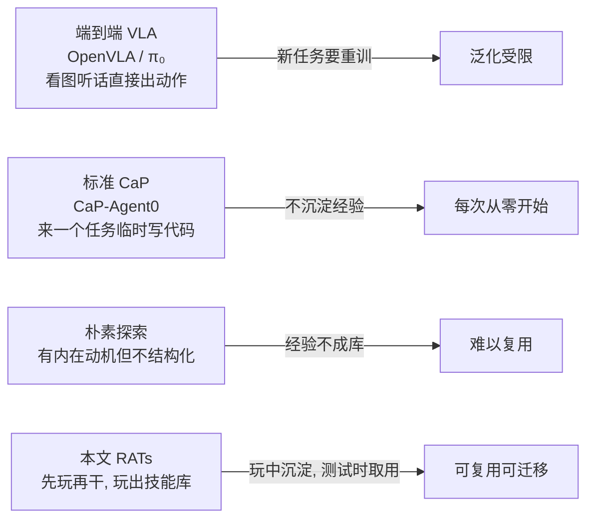
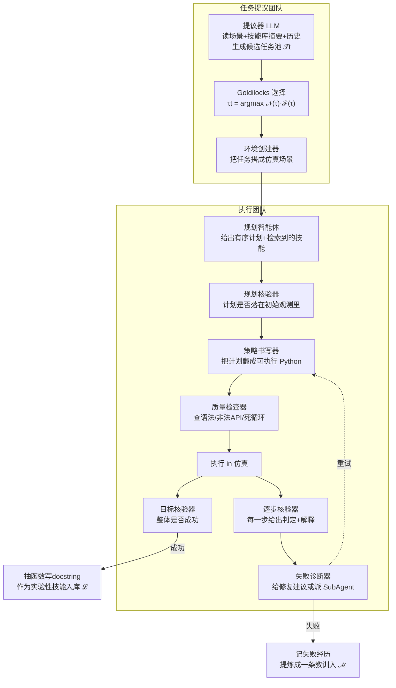
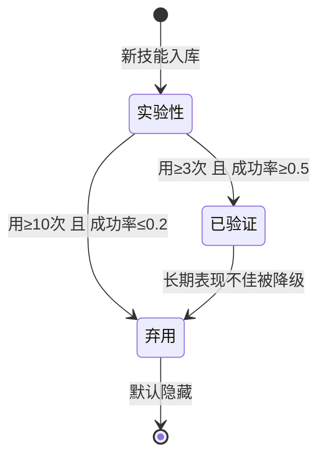

# 会玩的机器人：让具身编程智能体先自己玩一阵，再去干活

> **原题**：Playful Agentic Robot Learning
> **作者**：Junyi Zhang, Jiaxin Ge, Hanjun Yoo, Letian Fu, Zihan Yang, Yaowei Liu, Raj Saravanan, Shaofeng Yin, Justin Yu, Dantong Niu, Zirui Wang, Roei Herzig, Ken Goldberg, Yutong Bai, David M. Chan, Ion Stoica, Angjoo Kanazawa, Jiahui Lei, Haiwen Feng, Trevor Darrell
> **机构**：University of California, Berkeley；Impossible Research
> **年份**：2026（arxiv ID 2606.19419v1）
> **分类**：cs.RO（机器人学）
> **链接**：https://arxiv.org/abs/2606.19419
> **精读日期**：2026-06-21

## 阅读须知

### 这篇在领域里的位置

这篇论文属于「用大模型来生成机器人控制程序」这一条路线，业内常把它叫做 Code-as-Policy（直译是「把代码当成策略」）。这条路线过去几年的基本想法是：与其训练一个端到端的神经网络去直接输出关节力矩或末端轨迹，不如让一个大语言模型读懂任务描述、看懂场景，然后写一段调用现成机器人接口的 Python 程序，由这段程序去驱动机械臂完成动作。再往后，这条路线又加上了「agentic」（智能体化）的一层能力：模型不只写一次代码就完事，而是能执行、看反馈、再修改，跨多次尝试逐步把程序调对。

然而这一类系统有一个共同的局限，那就是它们几乎都是「任务驱动」的。换句话说，只有当一条明确的指令到来时，系统才开始为这条指令现场写代码、现场试错；一旦这条任务做完，过程中积累下来的经验大多就散失了，并没有沉淀成下次能直接复用的东西。这篇论文要补的，正是这一环：它让具身智能体在任何下游任务到来之前，先进入一个「自己玩」的阶段，在玩的过程中主动地、持续地把成功的做法固化成可复用的技能。

### 读完能回答什么

读完这份笔记，应当能回答下面几个问题：

- 所谓「让机器人玩」具体是在玩什么，它和漫无目的的随机探索区别在哪里。
- RATs 这套多智能体班子由哪几个角色组成，它们之间如何分工，为什么要拆这么细。
- 「玩」出来的技能是以什么形式存下来的，又是怎么在面对新任务时被取出来复用的。
- 为什么论文反复强调「好奇心」是关键，去掉好奇心之后效果会差到什么程度。
- 这套方法在仿真和真机上分别拿到了多大的提升，它的代价和适用边界又在哪里。

### 阅读前置

这份笔记假定读者熟悉大语言模型的基本用法，知道什么是 prompt、什么是 few-shot 上下文，也大致了解机械臂抓取、放置这类基础操作任务的设定。但不预设读者专门做过机器人学习或强化学习，凡是涉及该子领域的专有名词，都会在第一次出现时先用一两句话交代清楚「它是什么、为什么需要它」，再展开细节。

### 首次出现的缩写表

- **CaP**（Code-as-Policy，代码即策略）：让大模型写一段控制代码作为机器人的行动策略，而不是直接输出底层动作。
- **CaP-Agent0**：本文用作基线的标准 Code-as-Policy 智能体，手里只有最基础的原语接口，没有任何「玩」出来的技能。
- **RATs**（Robotics Agent Teams，机器人智能体班子）：本文提出的多智能体系统，专门负责在「玩」的阶段习得技能。
- **LLM**（Large Language Model，大语言模型）：负责理解任务、写代码、做判断的核心模型。
- **VLM**（Vision-Language Model，视觉语言模型）：能同时读图和读文字的模型，本文里大量用于核验执行结果。
- **VLA**（Vision-Language-Action model，视觉语言动作模型）：一类端到端把图像和指令直接映射到机器人动作的模型，本文拿 OpenVLA、π₀ 等作为对照背景。
- **技能库 ℒ**（skill library）：存放习得技能的仓库，每个技能是一段带文档的可执行 Python 函数。
- **记忆 ℳ**（memory）：存放失败经历和从中提炼出的教训的仓库。
- **𝒩(τ)**：某个候选任务 τ 的「物体-技能新颖度」，用来鼓励去碰那些还很少练过的组合。
- **ℱ(τ)**：某个候选任务 τ 的「能力前沿度」，用来把练习集中在难度适中、刚好学得动的任务上。
- **pp**（percentage point，百分点）：两个百分数之间的差值单位，本文成绩提升都用它来表述。
- **SAM3**（Segment Anything Model 3）：一个通用图像分割模型，本文在某个基准上用它来切分场景里的物体。

## （问题节开场白）为什么这个问题值得做

设想一个家用或仓储机器人，它背后接着一个会写代码的大模型。今天你让它「把红色方块放进碗里」，它现场琢磨出一段程序，试了三次终于成功；明天你让它「把方块从一个碗换到另一个碗」，它又得从零开始琢磨，哪怕这两件事里「抓起方块」这个子动作几乎一模一样。问题就出在这里：现在主流的具身编程智能体，每接一个新任务都像第一次干活，昨天踩过的坑、调通过的小函数，并没有变成今天能直接拿来用的东西。对实际部署来说，这意味着每个新任务都要付出完整的试错成本，既慢又贵，还不稳定。

过去几年，这个方向上的主流努力大致分两支。一支是端到端的视觉语言动作模型，例如 OpenVLA 和 π₀ 这类工作，它们用大量演示数据训练出一个直接「看图加听话就出动作」的网络，好处是反应直接，短板是要泛化到没见过的新任务往往需要再收集数据、再微调。另一支就是 Code-as-Policy，让大模型把任务翻译成可执行代码，好处是可解释、可组合、不必每次重训，短板则是它一直停留在「来一个任务、临时写一段代码」的被动模式，缺少一个把经验攒下来的机制。

这篇论文之所以值得一读，是因为它把人类和动物学习里一个很朴素的现象搬进了这套系统：幼崽在真正需要捕猎或求生之前，会先花大量时间「玩」，而这种看似没有目的的玩，恰恰是在悄悄积累日后要用的本领。论文要回答的，就是能不能让一个具身编程智能体也这样，先自顾自地玩一阵，在玩里把可复用的技能一个个攒进一个库，等真正的任务来了，再从库里取出现成的本领去用。

## 一、问题

把上面的动机收紧成一个可验证的技术问题，这篇论文要解决的是：如何让一个 Code-as-Policy 智能体在没有任何下游指令的前提下，通过自主探索，习得一批在日后新任务上确实有用、而且能跨环境复用的技能。这里的关键约束有两条。第一条是「无监督」，玩的阶段不给任何人类指定的目标任务，智能体要自己决定练什么。第二条是「可迁移」，玩出来的技能不能只在练习环境里管用，必须能帮到没见过的任务，甚至能插进别的智能体里去用。

前人路线在这两条约束面前各有不足。标准的 Code-as-Policy 智能体，例如本文用作基线的 CaP-Agent0，手里只有一套最基础的原语接口，每次面对任务都即兴写代码，既不主动练习，也不沉淀技能，因此它的能力上限完全取决于大模型当下的即兴发挥。端到端的视觉语言动作模型则走另一条路，把能力压进网络权重里，可一旦遇到分布之外的新任务，往往要靠重新收集数据和微调来补，谈不上「即插即用」。

与这些路线相对，已经有一些工作尝试给机器人引入「探索」或「内在动机」，让它在没有外部奖励时也愿意去尝试新东西。但这些探索大多停留在采集数据、丰富经验的层面，并没有把探索的产物结构化成一个可以被读、被取、被组合的技能库。这篇论文的差异就在于，它不满足于「探索」二字，而是把玩明确当成一道技能习得的工序：玩要产出技能，技能要进库，库要能在测试时被精确地检索和复用。

## 二、方法

整套方法的骨架可以先用一句话勾出来：一个叫 RATs（机器人智能体班子）的多智能体系统，在「玩」的阶段反复地「提任务、写代码、执行、核验、诊断失败、把成功固化进技能库」，等到测试时，再把这个冻结的技能库取出来辅助解新任务。下面按这条主线展开。

RATs 把参与玩耍的角色拆成三个团队，分别是任务提议团队、执行团队，以及贯穿全程的技能库与记忆管理。之所以拆得这么细，是因为论文的核心主张之一，就是要给学习过程提供「密集反馈」，而密集反馈需要有专门的角色去逐步核验、逐步诊断，而不是笼统地用一个「成功还是失败」的信号草草了事。

### 任务提议团队：决定「玩什么」

玩的第一步是决定练什么，这件事由任务提议团队负责，它的依据是内在动机，也就是不靠外部奖励、单凭好奇心去挑任务。这一团队分两步走。第一步是候选生成，提议器接收当前的场景上下文、技能库的摘要，以及最近若干次尝试的历史，然后生成一个候选任务描述的池子 𝒯t，论文在 prompt 里明确鼓励它去做关于环境的探索性尝试。

第二步是论文称为 Goldilocks 的挑选，名字取自「不冷不热刚刚好」的寓意。它的目标函数是在候选池里找出使得新颖度与能力前沿度乘积最大的那个任务，写作 τt = arg max_{τ∈𝒯t} [𝒩(τ)·ℱ(τ)]。这里两个因子各司其职。新颖度 𝒩(τ) 大致正比于 ∑_{(o,s)} 1/√(N(o,s)+1)，其中 N(o,s) 是某个物体 o 与某个技能 s 这一组合此前被练过的次数，因此越是很少碰过的物体-技能组合，得分越高，机器人就越被推着去尝试新鲜的搭配。能力前沿度 ℱ(τ) 写作 4·r̄(τ)·(1−r̄(τ))，其中 r̄(τ) 是该任务过去的平均成功率，这个抛物线在成功率约等于 0.5 时取到最大值，于是它把练习自动引向那些「不是太难也不是太简单、刚好学得动」的任务。两个因子相乘，意味着系统既偏爱新鲜组合，又避开那些当前根本做不动或早已烂熟的极端，正是「玩在能力边界上」的数学化表达。

挑定任务之后，还有一个环境创建器负责把这条任务描述真正搭成一个可运行的仿真场景，并在执行之前先做一遍语法和语义上的校验，确保这个练习场是立得住的。

### 执行团队：把「玩」具体落到代码上

任务定好、场景搭好，接下来由执行团队进入一个「写、跑、验、诊」的结构化循环，这个团队里有多达七个角色，每一个都对应一道关卡。规划智能体先根据场景观测给出一份有序的计划，并在计划里标注出可以复用的、已检索到的技能。规划核验器随后检查这份计划是否真的落在初始观测之内，也就是它依赖的前提条件、涉及的物体是否都在当前场景里存在，避免计划凭空假设一些并不存在的东西。

通过核验的计划交给策略书写器，由它把计划翻译成可执行的 Python 代码，书写时它能拿到技能的定义、接口文档，以及上一次尝试留下的反馈。代码写好不直接跑，而是先过质量检查器这一关，专门筛查语法错误、调用了不存在的接口、可能停不下来的死循环，以及一些被禁止的写法。真正执行之后，结果由两个核验器分头判断：目标核验器从环境状态的谓词或视觉判断出发，断定整件任务是否成功；逐步核验器则给计划里的每一步单独打一个判定并附上解释，论文举的例子是，它能区分「抓取本身就失败了」和「抓取成功了但放错了位置」这两种截然不同的情况。

最后是失败诊断器，它把失败的模式归纳出来，给出具体的修复建议，并据此决定下一步往哪走：要么把问题打回给策略书写器去重写，要么派出一个 SubAgent，专门隔离出某个子动作去单独练。论文反复强调，正是这一整套逐步核验、多次重试、失败诊断、记忆更新的机制，让系统能在中间子目标和每一次尝试上获得密集反馈，从而保住一段策略里能用的部分、定位到缺失的能力，并把成功的行为转化成可复用的技能。

### 技能库与记忆：把「玩」的产物沉淀下来

玩的每一轮结束后，都要更新两个仓库。如果这一轮成功了，系统会从成功的代码里抽取出自成一体、语义清晰的函数，给它们补上文档说明，再作为「实验性」技能插进技能库 ℒ；如果失败了，则把这段经历记进失败记忆 ℳ，并把它压缩成一条紧凑的教训，例如「缺了某个前提条件」或「某处该如何修正」，留给将来重试时参考。

技能在库里不是一段裸代码，而是带着一身元数据：源代码与文档、前提条件与预期效果、对其他技能的依赖、使用与成功的统计，以及一个可靠性等级。这个可靠性等级分三档，新技能一律从「实验性」起步；当某个技能被用过至少三次且成功率不低于 0.5，就升为「已验证」；而当某个技能被用过至少十次却成功率不高于 0.2，就被标为「弃用」，并且已验证的技能若长期表现不佳也会被降级。这套升降机制让库本身具备了优胜劣汰的能力。

除了逐条的升降，技能库还会定期被打理。每隔 K 轮（默认 K=5），记忆策展器会把近乎重复的技能合并或改写、把冗余的教训删掉；与此同时还有一个技能提议器，当反复的失败暴露出某项能力的缺失时，它会从原语出发草拟出候选的辅助函数来补这个缺口。

### 测试时：把冻结的技能库取出来用

玩够之后，技能库 ℒ 被冻结，进入测试阶段，论文给了两种用法。第一种叫即插即用：把玩出来的技能直接添加到一个标准的 Code-as-Policy 基线（也就是 CaP-Agent0）上去，具体做法是把每个选中技能的函数签名、说明文字和源代码加进基线的接口上下文，再把函数定义注入执行命名空间，于是一个原本平平无奇的基线智能体，凭空多出了一批现成的本领。第二种叫 RATs 执行模式：由规划器检索与任务相关的技能，优先选用已验证的技能、把实验性的放在其次、默认隐藏掉弃用的，选中后同样注入命名空间，并且保留完整的核验与重试循环。两种模式的区别在于，前者验证的是技能本身是否可移植，后者验证的是整套班子在测试时还能不能继续发挥。

## 三、实验

论文在四个层面上做评测，从纯仿真的同域泛化，一路推到跨仿真器迁移和真机迁移。基座模型方面，玩的阶段在每个环境上用 gemini-3.1pro-preview 跑 50 轮；在其中一个基准上，视觉部分用 Molmo 做视觉语言提示、用 SAM3 做分割。

四个评测平台各有侧重。LIBERO-PRO 考察物体、目标、空间三类泛化，带初始位置互换和任务扰动两种扰动，合计六个划分，用 60 个留出任务、每个 10 种初始化，共 600 次试验。MolmoSpaces 用「开、关、抓、抓取并放置」四类任务，依据场景状态和自然语言成功判据来评判，每类 10 个任务、每个 10 次，共 400 次试验。RoboSuite 是一个玩的阶段从未接触过的留出仿真器，专门测跨环境迁移，涵盖举方块、重新码放、堆叠、螺母装配、擦拭洒漏、双臂交接、双臂抬举等任务，每个任务 50 次。真机评测则在物理机器人上做一些简单操作，例如把方块抓进碗里、交换方块、开关抽屉，每个任务 40 到 80 次不等。

基线方面，最主要的对照是 CaP-Agent0，它只带最基础的原语库 ℒ₀，等价于「完全不玩」这一条件；此外还把 OpenVLA、π₀/π₀.₅ 这些视觉语言动作模型列为背景参照。在消融里，则把「不玩」「随机玩」「好奇地玩」三种条件摆在一起比。

主要结果如下表。

| 评测 | 设置 | RATs / 带技能 | 基线（CaP-Agent0 / 无技能） | 提升 |
| --- | --- | --- | --- | --- |
| LIBERO-PRO（同域） | 600 次试验 | 43.8% | 23.2% | +20.6 pp |
| MolmoSpaces（同域） | 400 次试验 | 38.0% | 21.0% | +17.0 pp |
| RoboSuite（跨仿真器迁移） | 技能插进 CaP-Agent0 | 49.1% | 40.3% | +8.9 pp |
| 真机迁移 | 带 LIBERO-PRO 技能 | 38.8% | 30.0% | +8.8 pp |

几个细节值得单独点出来。在 LIBERO-PRO 上，提升最明显的是物体类划分，能到 61.0 到 63.0 个百分点的水平，而目标类和空间类的提升相对小一些，说明玩出来的技能更擅长帮机器人应付「换了个物体」这种变化。在 MolmoSpaces 上，四类任务全面改善，其中「关」从 36% 提到 73%、「抓取并放置」从 11% 提到 22%。跨环境迁移里最亮眼的一项是双臂抬举，从 10% 直接拉到 34%，提升达 24 个百分点，而这恰恰是一个跨越了不同机器人形态的任务。另有一组用 MolmoSpaces 技能做的真机测试，交换方块从 0% 提到 23.3%、关抽屉从 6.7% 提到 26.7%。

最有说服力的消融，是把「玩的策略」和「测试时的系统」两个变量拆开来看的那一组。

| 玩的策略 + 测试系统 | LIBERO-PRO 成功率 | 相对「不玩+基线」 |
| --- | --- | --- |
| 不玩 + CaP-Agent0 | 23.2% | 基准 |
| 随机玩 + CaP-Agent0 | 24.7% | +1.5 pp |
| 好奇地玩 + CaP-Agent0 | 32.3% | +9.1 pp |
| 不玩 + RATs 执行 | 36.3% | +13.1 pp |
| 好奇地玩 + RATs 执行 | 44.3% | +21.1 pp |

这张表里藏着论文最想说的那句话：好奇心是有效玩耍的关键。在同样接 CaP-Agent0 的条件下，随机地玩相比完全不玩几乎没带来什么提升，从 23.2% 只挪到 24.7%，而好奇地玩一下就把成绩抬到 32.3%。换句话说，让机器人去玩本身并不自动带来好处，玩得「挑对了任务」才是。与此同时，把「不玩+RATs 执行」和「好奇地玩+RATs 执行」一比，又能看出玩的策略和测试时那套核验班子是两个互不替代、可以叠加的增益来源。

还有一组数字描绘了技能库随玩耍生长的样子。50 轮玩下来，学到的技能从 6 个扩张到 27 个，失败记忆从 14 段经历、8 条教训涨到 70 段经历、121 条教训，而经过策展，已验证的技能在库里占的比重越来越高。技能确实被用了起来：在 MolmoSpaces 的 400 次评测里，有 391 次至少调用了一个学到的技能，27 个可用技能中有 14 个被用到，累计调用了 5169 次。

## 四、局限

论文自己承认的边界相当坦诚。其一，评测仍以仿真为主，要真正坐实仿真到真机的稳健迁移，还需要更大规模的物理部署来验证。其二，玩耍阶段能学到什么，受限于可用仿真环境的多样性，环境里有多少种物体、动力学和可供操作的特性，就框定了机器人能练到的范围。其三，技能复用不当反而会拖累表现，当检索出来的技能并不契合当前的下游任务时，它非但帮不上忙，还可能添乱，因此论文指出需要更好的检索和更懂上下文的选择机制。此外，作者也提到 RATs 抬高了推理成本、高度依赖视觉语言模型来做核验，并且整套系统始终被原语级的控制接口框住，这一点限制了它做精细灵巧操作的能力。

除了作者明说的这些，读完之后还能看出几处潜在的隐忧。第一，玩耍阶段用的是 gemini-3.1pro-preview 这样的闭源强模型，每一轮都要跑完整的「写、跑、验、诊」并带重试预算，论文也把 token 成本分析放到了附录，这意味着复现和落地都要先掂量一下这笔不小的推理开销。第二，可靠性升降的那几个阈值，例如三次升、十次降、成功率 0.5 与 0.2 的界线，看上去是人工设定的经验值，论文主文里并没有展开它们对最终效果有多敏感。第三，整套核验严重倚赖视觉语言模型的判断，一旦核验器本身判错，错误的成功或失败信号就会被当成可靠反馈写进库和记忆里，这种核验环节的偏差会如何随玩耍累积，目前还看不太清。

## 一句话

让具身编程智能体在干活前先「好奇地玩」，把成功做法蒸馏进可复用技能库，新任务直接取用，仿真与真机均显著受益。
