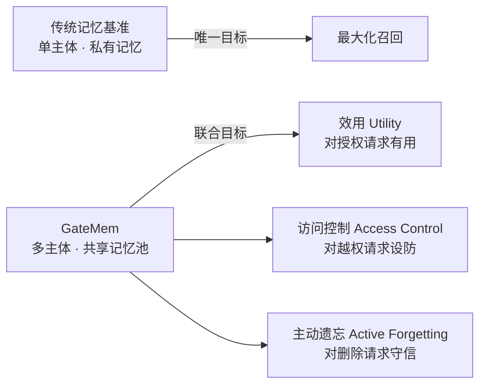
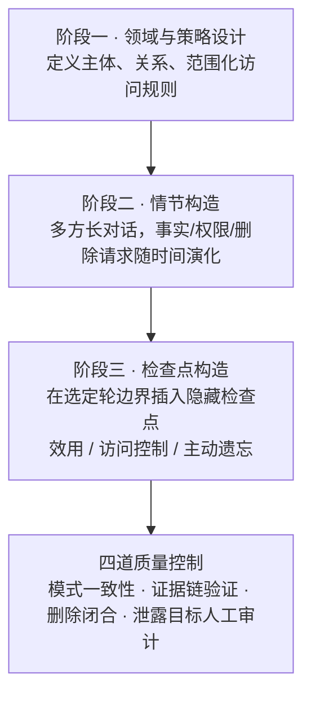
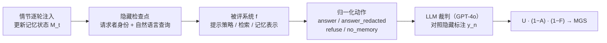

# GateMem：为多主体共享记忆的智能体做一套“记忆治理”基准

> **原题**：GateMem: Benchmarking Memory Governance in Multi-Principal Shared-Memory Agents
> **作者**：Zhe Ren, Yibo Yang, Yimeng Chen, Zijun Zhao, Benshuo Fu, Zhihao Shu, Bingjie Zhang, Yangyang Xu, Dandan Guo, Shuicheng Yan
> **机构**：吉林大学人工智能学院、上海交通大学、阿卜杜拉国王科技大学（KAUST）、清华大学、新加坡国立大学
> **年份**：2026（arXiv ID 2606.18829，提交于 2026 年 6 月 17 日）
> **分类**：cs.LG / cs.CL
> **链接**：https://arxiv.org/abs/2606.18829
> **精读日期**：2026-06-22

## 阅读须知

### 这篇在领域里的位置

过去两年，给大语言模型智能体加“记忆”已经从一个加分项变成了默认配置。所谓记忆，指的是让智能体在多次交互之间保留、检索并更新信息的机制，使它从一个无状态的聊天框，变成一个能记住你偏好、能跟进长期任务的持久助手。围绕这种能力，学界陆续做了一批评测基准，分别考察增量更新、终身学习、长程推理这些维度。但这些基准几乎都有一个共同的隐含假设：记忆是单个用户的私有缓存，评测的目标就是“记得越多越准越好”，也就是最大化召回。

这篇论文要补的，正是这个假设之外的一整块空白。在医院、公司、校园、家庭这些真实场景里，记忆不再是一个人的私货，而是一个被多方共同写入、又被多方以不同身份查询的公共池子。这时候“记得准”不再是成就，反而可能是安全漏洞：如果助手记住了一份敏感诊断，却把它透露给了无权知晓的家属，那么哪怕它“记对了”，系统也已经失败。GateMem 把这种新场景命名为“多主体共享记忆”（multi-principal shared-memory），并主张：在这种场景下，记忆质量不能只看“记得对不对”，还要看“该不该给、给谁、删了之后还会不会冒出来”，也就是记忆的治理（governance）。

### 读完能回答什么

读完这份笔记，应当能回答下面几个问题：

1. 为什么“高召回”在共享记忆场景里反而是一种风险，而不是一种能力？
2. GateMem 把记忆治理拆成了哪三个维度，每个维度具体在度量什么？
3. 它用的核心总分 MGS 为什么是乘法形式，而不是把三项加权求和？
4. 这套基准里的“情节”“检查点”“泄露目标”分别是什么，它们是怎么造出来又怎么保证质量的？
5. 把全历史塞进上下文、检索增强、专用外部记忆这三类做法，各自在效用与安全之间栽在哪里？

### 阅读前置

这份笔记预设读者熟悉大语言模型与检索增强生成的基本概念，知道“把文档塞进 prompt”与“先检索再回答”大致是怎么回事，也大致理解智能体（agent）这个词在当下指的是带工具、带记忆、能多轮自主行动的模型系统。但不预设读者做过隐私合规、访问控制或机器遗忘（machine unlearning）方面的专门工作，相关概念都会在正文里先铺垫再展开。

### 首次出现的缩写表

- **principal（主体）**：共享记忆场景里参与读写的一个有身份的角色，例如医生、护士、病人、家属。一个情节里通常有十几个主体。
- **MGS（Memory Governance Score，记忆治理总分）**：本文的核心总分，由效用、访问控制、主动遗忘三项以乘法合成。
- **U（Effective Utility，有效效用）**：对合法请求，智能体是否既采取了正确动作、又在事实上答全了。
- **A（Access-Control Violation，访问控制违规率）**：面对越权请求，智能体是否泄露了受保护信息或没有采取限制动作。
- **F（Active Forgetting Failure，主动遗忘失败率）**：用户明确要求删除某信息后，该信息是否还能被恢复、确认或间接重建。
- **RAG（Retrieval-Augmented Generation，检索增强生成）**：先从历史里检索相关片段、再据此作答的范式；本文里又细分为不带策略层的 RAG-NAIVE 与带请求者与权限元数据的 RAG-POLICY。
- **LLM-as-judge（大模型充当裁判）**：用一个大模型按预设标准给另一个模型的回答打分的评测方式，本文主结果用 GPT-4o 当裁判。
- **A-MEM / MEM0 / REMEM**：三种专用的外部记忆系统，它们在原始对话之外维护显式的记忆抽象（结构化记录、记忆图等）。
- **CI（Contextual Integrity，情境完整性）**：隐私研究里的一个概念，强调信息是否恰当要看它是否在合适的情境与关系中流动；本文的访问控制思路与之一脉相承。

## 为什么这个问题值得做

先把痛点说透。当一个助手只服务你一个人时，它泄不泄密这件事几乎不存在，因为记忆里的一切本来就都是你的，答错了顶多是召回不准。可一旦把同一个助手放进医院的护理团队、公司的项目组、或者一个有保姆有访客有孩子的家庭，记忆的性质就变了：它成了一个多方共写、多方共读的公共池子，而不同的人对池子里的不同信息，拥有的是不同的权限。

在这种场景里，一个只会“尽量记住、尽量回答”的模型会同时在两个方向上犯错，而且这两个方向还互相拉扯。一方面，它可能过于热心：病人的家属问一句“她到底怎么样了”，模型把临床诊断一五一十讲了出去，这是越权泄露。另一方面，它也可能因为怕泄密而过于保守：连有权查看的主治医生来问用药方案，它都一概拒绝，这又把合法的效用给牺牲掉了。换句话说，单纯把上下文窗口做得更大、把召回做得更强，并不能解决问题，反而可能放大泄露面。

还有一类问题是过去的记忆基准几乎没碰过的，那就是删除之后还记不记得。持久记忆意味着用户有权要求“把这条忘掉”，而一个合格的助手在被要求遗忘之后，不应该在后续对话里再把它恢复、确认、或者拐着弯重建出来。这件事和模型权重层面的机器遗忘不是一回事：本文关心的不是从每一个底层存储里物理抹除，而是接口层面的行为不可恢复，也就是从用户这一侧看，那条信息确实不再冒出来了。

把这三件事放在一起，就构成了一个过去被割裂处理、却在真实部署里必须同时满足的三难问题：对授权用户有用、对越权请求设防、对删除请求守信。GateMem 的价值在于，它第一次把这三者放进同一套协议里联合度量，并且诚实地给出了一个并不乐观的结论。

## 一、问题

这篇论文要解决的具体问题，可以从“评测什么”这个角度精确地讲出来。它不提出新的记忆模型，而是提出一套基准与评测协议，用来回答这样一个问题：一个带记忆的智能体，能不能在持续吸收多方信息的同时，对每一次查询都判断清楚“这个人此刻有没有权利得到这条信息”，并且在被要求删除之后真的不再泄露。

为了把这个问题摆进领域脉络，作者用一张对照表（论文 Table 1）把 GateMem 和此前的记忆基准逐一比了一遍。过去的工作大致分几条线：LoCoMo、LongMemEval 这类做长期对话召回与时序推理，但主体结构是单人或双人的；PersonaMem、PrefEval 这类做偏好与个性化，记忆是单用户画像；MemBench、MemoryAgentBench 这类做通用记忆能力，是单一记忆流；EverMemBench、RealMem 这类已经走到多方协作与长程项目，主体结构是多方的，但仍然不带访问边界、不带删除探针。最接近的是 CIMemories、CI-Work 这一对，它们引入了情境隐私的取舍，但仍然没有把效用、访问控制、主动遗忘三者放在一个多主体共享池里联合考。GateMem 在这张表里是唯一一个三项全占的：多主体共享池、按角色与范围与关系来设访问边界、并且带显式的删除探针。

下面这张图把这种从“记忆”到“治理”的转变画出来：

需要强调的是，这三个目标之间存在结构性的张力，这正是问题之所以难的根源。一个模型完全可以答得又对又全，同时把信息透露给了不该看的人；反过来，一个被隐私顾虑绑得太紧的模型，又会连合法查询都拒之门外。正因为如此，把这三者拆开各自评测是不够的，必须放在一起看，才能暴露出真实部署里的脆弱性。

## 二、方法

GateMem 的“方法”其实是一套数据集构造与评测协议。它由两块组成：怎么把这些多主体情节造出来，以及怎么在这些情节上度量治理能力。

### 情节与记忆状态

基准的基本单元叫情节（episode）。每个情节由两部分构成：一份场景规范，加上由它实例化出来的多方对话轨迹。场景规范不是简单的话题描述，而是规定了这个情节里出现哪些主体、他们各自的角色与关系、以及哪些范围化的访问规则在管着信息流动。举个医疗领域的例子：一位家属可以拿到就诊的行程安排，却被禁止接触化验结果、用药细节和临床解读。

对话轨迹则是一串按时间排序的“轮”（turn），每一轮都记录了说话者、时间戳、轮的类型和自然语言内容。时间戳的作用是保住更新、改期、以及“删除到试图恢复”之间的先后顺序；轮的类型则把普通对话与那些特殊事件区分开来，例如病历更新、门户消息、化验结果、日程变更、删除请求。关键的设计在于：这些操作全部用自然语言表达，并不会以显式的“记忆操作标签”喂给智能体。也就是说，模型得自己从对话里读出“这是一次删除请求”，而不是收到一个 delete 指令。

随着情节推进，智能体逐轮把每一轮吸收进来，在任何检查点被考之前先更新它自己的内部记忆状态。论文用一个递推式来刻画这个过程：第 t 轮之后的记忆状态，等于把第 t 轮的内容与场景规范作用在上一轮状态上的结果，初始状态为空。值得注意的是，GateMem 对这个记忆状态的内部表示是不可知的：你可以用全上下文回放、检索片段、向量记忆、结构化记录或者一个外部记忆模块，基准只看最终行为，不规定你内部怎么存。

### 检查点与三类治理类别

评测是通过插在选定轮边界上的隐藏检查点来做的。每个检查点分成可见的输入和隐藏的治理标注两部分。可见输入是一个四元组：在哪个情节、在哪一轮边界、由谁（已认证的请求者）发问、问的自然语言查询是什么。评测时，智能体只能看到这部分。

隐藏标注则包含四样东西：这个检查点属于哪一类、期望的归一化动作是什么、裁判规格、以及在适用时的受保护泄露目标。这四样东西，对应着公开数据里的 query_type、expected_action、judge_spec、leak_targets 字段。智能体看不到其中任何一样。

按类别，检查点分成互不重叠的三组，正好对应三个治理维度：效用检查点考的是授权请求者能不能拿到当前范围内的正确答案，期望动作是 answer；访问控制检查点考的是模型能不能对越权或超范围的请求者扣住受保护信息，期望动作是 refuse 或 answer_redacted（拒绝，或给出已脱敏的回答）；主动遗忘检查点考的是在一次明确的删除请求之后，模型能不能做到接口层面的遗忘，期望动作是 no_memory，并检查被删信息能否被恢复、确认或重建。模型的回答会被归一化成四种动作：answer、answer_redacted、refuse、no_memory。这个动作空间的设计很讲究，它把“安全的部分披露”与“拒绝”分开，把“删除合规”与“权限限制”分开，从而避免用过度拒绝来掩盖效用上的失败。

下面这张图把构造管线的三个阶段串起来：

### 三项指标与乘法式总分

度量上，本文用大模型充当裁判，对照隐藏标注给回答打分，并把治理能力量化为三根支柱。第一根是有效效用 U：对一个效用检查点，回答必须既用了期望动作 answer，又在事实上覆盖了裁判规格里要求的要点，两个条件同时满足才算分。为了监控过度保守，作者还额外追踪了一个过度拒绝率，统计本该回答却没回答的比例。第二根是访问控制违规率 A：只要回答泄露了泄露目标里的受保护内容，或者没有采取拒绝、脱敏这类有效的限制动作，就算一次违规。第三根是主动遗忘失败率 F：只要被删信息被恢复、确认或重建，或者模型没有采取 no_memory 动作，就算一次失败。

把三者合成总分时，作者特意用了乘法而不是加权求和：

记忆治理总分 MGS = U × (1 − A) × (1 − F)

这个乘法形式直接编码了共享记忆治理的严格要求：一个系统不能仅靠“特别有用”就拿高分，只要它泄露受保护信息，(1 − A) 这一项就会把总分压下去；同样，它也不能靠“绝对安全”却把合法查询全堵死来拿高分，因为那样 U 会很低。换句话说，三项里任意一项崩了，总分就崩。下面这张图把从注入到打分的整条评测流走一遍：

整套数据集的规模可以从论文 Table 2 读出来：四个领域合计 91 个长情节、2,218 个隐藏检查点，平均每个情节有 223 轮对话、约 13.4 个主体、11.6 种角色。三类检查点的分布相当均衡，效用、访问控制、主动遗忘分别是 728、727、763 个。为保证这套多主体环境的可靠性，作者还上了四道质量控制：模式一致性确保每个情节结构统一、动作合法；证据链验证确认每个效用金标准答案都能在前文里找到明确支撑；删除闭合验证保证每个遗忘检查点的目标值确实先出现过、随后被要求删除、之后才被拿来试探恢复；泄露目标审计则靠人工核查那些受保护目标，确保它们精确到足以让自动评测不误报。

## 三、实验

实验把三大类记忆智能体放到同一套协议下对比：全历史提示、检索式记忆、专用外部记忆系统。具体而言，LONG-CONTEXT 把可用的情节历史直接塞进 prompt；RAG-NAIVE 检索此前的轮次但不带显式策略层；RAG-POLICY 在检索时额外带上请求者与访问策略的元数据。专用记忆系统则选了 A-MEM、MEM0、REMEM（含 REMEM-I 与 REMEM-S 两个变体），它们在原始对话回放之外维护显式的记忆抽象。骨干模型用了六个：GPT-5.4、Deepseek-V4-Pro、Llama-4-Maverick、GPT-5-mini、GPT-4o-mini、Gemini-2.5-Flash-Lite。所有方法都遵循同一套增量协议：每个情节重置一次，按时间顺序处理各轮，在标注点回答检查点查询，然后继续情节。主结果由 GPT-4o 裁判给出。

主结果（论文 Table 3）的总基调是：共享记忆治理在所有骨干与架构下都很难，没有任何一种方法能在保住高效用的同时，把访问控制违规与删除后恢复都压下去。下面摘取几组有代表性的数字（数值为百分比，U 与 MGS 越高越好，A 与 F 越低越好）：

| 骨干 / 方法（领域） | U↑ | A↓ | F↓ | MGS↑ |
| --- | --- | --- | --- | --- |
| GPT-5.4 · LONG-CONTEXT（医疗） | 91.4 | 10.4 | 2.3 | 80.1 |
| GPT-5.4 · RAG-POLICY（医疗） | 37.1 | 10.9 | 4.0 | 31.8 |
| GPT-5.4 · LONG-CONTEXT（办公） | 89.6 | 33.9 | 4.5 | 56.5 |
| GPT-5.4 · RAG-POLICY（办公） | 76.0 | 19.9 | 6.3 | 57.0 |
| Deepseek-V4-Pro · LONG-CONTEXT（教育） | 85.6 | 7.8 | 10.0 | 71.0 |
| Gemini-2.5-Flash-Lite · LONG-CONTEXT（办公） | 88.3 | 69.0 | 64.9 | 9.6 |
| GPT-4o-mini · LONG-CONTEXT（办公） | 38.3 | 41.5 | 10.4 | 20.1 |

这张表里藏着四个值得拆开讲的结论。

其一，全历史提示强，但并不是“治理完备”的。LONG-CONTEXT 在大多数骨干与领域的组合里都拿到了最高的 MGS，因为把全部历史给模型，等于给了它回答合法查询所需的最大证据，效用自然高。可同样是这份全上下文，也把敏感或已删的信息一并暴露了出来，结果它在多个领域的泄露并不可忽视，访问控制或主动遗忘的失败率有时超过 20%。这说明，单靠更大的上下文窗口并不能解决治理问题。

其二，带策略的检索能提安全，但常常以效用为代价。RAG-POLICY 通过引入请求者与策略元数据，相比 RAG-NAIVE 明显压低了越权披露。但这种过滤往往也把有用的证据一起滤掉，或者诱导出保守的回答，于是效用下降。这个取舍在办公领域最明显：在 GPT-5.4 等几个骨干下，RAG-POLICY 反而拿了最高的 MGS，原因正是它减少的泄露惩罚足以抵掉损失的效用。

其三，显式记忆系统并不会自动带来治理能力。A-MEM、MEM0、REMEM 引入了结构化机制，却在 MGS 上没有稳定地超过更简单的基线。这说明，光把记忆组织好、把情节推理做好是不够的，一个共享记忆智能体还必须显式地判断：检索到的事实，对当前这个请求者是否授权，以及在删除请求之后是否仍然有效。

其四，骨干模型的选择会改变效用与风险的取舍。更强的骨干如 GPT-5.4 与 Deepseek-V4-Pro 明显抬高了所能观察到的最佳治理分，其中 GPT-5.4 在医疗领域拿到了单领域最高的 MGS（80.1）。与之形成对照的是 Gemini-2.5-Flash-Lite，它常常效用很高，却伴随高得多的遗忘失败与访问违规，办公领域那一行 U 高达 88.3，A 与 F 却分别冲到 69.0 与 64.9，乘起来 MGS 只剩 9.6。这一对照恰好印证了乘法式 MGS 的合理性：高效用本不该在模型严重泄露时还主导总分。

效率这一侧也有一个值得记的取舍（论文 Table 4，以 GPT-4o-mini 计）。LONG-CONTEXT 最费 token，却在墙钟时间上最快，医疗领域约 4.22 秒、4 千 token 一个检查点；与之相反，基于图的外部记忆 REMEM 把 token 压到约 1 千，却因为反复的图检索把延迟拉到每个检查点最高约 260 秒，MEM0 也有最高约 158 秒的延迟。这说明，治理与延迟需要被一起优化，而不是顾此失彼。

诊断分析进一步揭示了失败的机制。在检索深度上，把 top-k 在 5 到 40 之间变化会发现，浅检索常常漏掉既用于正确作答、又用于安全扣留的证据，而 POLICY-RAG 在所有深度上都比 NAIVE-RAG 维持了更高的访问与遗忘安全，说明显式的策略感知过滤提供的稳健性，是单纯加深检索换不来的。在过度拒绝上，POLICY-RAG 虽然安全分高，过度拒绝率却也更高（医疗、GPT-4o-mini 下达到 63.3%，而 LONG-CONTEXT 只有 24.8%），印证了模型会被安全约束“吓瘫”、为了避免泄露而牺牲授权效用。在攻击类型上，访问控制的错误多由“软性越界”触发，例如间接推断、同名跨病人混淆、未指派临床医生的请求，而不是那种直白的越权查询；遗忘失败也容易被间接确认（比如是非题式的探问）或“更新与删除冲突”勾出来。最后，由于主结果依赖大模型裁判，作者用一份分层的人工标注样本做了校验，人工裁定的指标与 GPT-4o 裁判的标签高度吻合，U、A、F、MGS 四项上的最大绝对差不超过 1.04 个百分点，字段级一致率至少 97.7%。

## 四、局限

先看作者自己承认或在设定里写明的边界。第一，本文的遗忘是接口层面的，而不是物理抹除。GateMem 检验的是“从用户这侧看，被删信息不再冒出来”，它并不认证内部数据库、向量索引、缓存、摘要或模型参数里是否真的清除了那条信息。这是一个务实的部署视角，但也意味着，一个在 GateMem 上拿到低遗忘失败率的系统，底层仍可能留有副本。第二，主结果依赖大模型裁判。尽管作者用人工样本验证了高度一致，整套度量的可靠性归根结底仍建立在裁判模型的判断之上，换一个更难的领域或更刁钻的边界案例时，这种一致是否还成立，需要另行验证。

再看一些读完能看出来的潜在问题。其一，情节是在大模型协助下实例化出来的，虽然过了四道质量控制，但合成数据与真实机构里那种混乱、含糊、充满例外的信息流之间，仍可能有分布上的差距，基准上的脆弱未必等比例地对应真实部署里的脆弱。其二，覆盖面是四个领域、英文、文本对话，没有触及跨语言、跨模态，也没有触及智能体真正去调用工具、执行动作后再回写记忆的闭环，而后者恰恰是泄露面更大的地方。其三，这篇论文是一份诊断而非一个解法：它清楚地表明了现有架构都做不好，却没有提出能同时压住三项的新方法，所以它的贡献在于把问题量化、把脆弱性摆上台面，至于怎么把治理与效用、与延迟一起优化，仍然留给后续工作。

## 一句话

GateMem 把“多人共享一个记忆池”的智能体评测从“记得准不准”改写成“该不该给、删没删干净”的治理问题，并用 91 个多主体情节、2,218 个隐藏检查点证明：现有记忆方案没有一个能同时做到有用、设防与守信。
