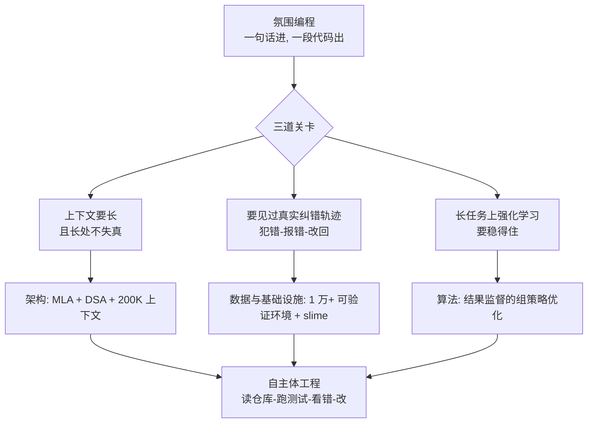
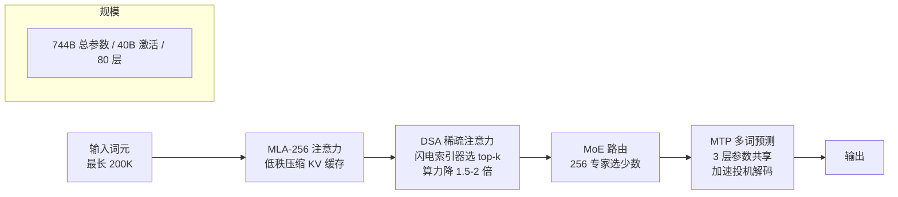
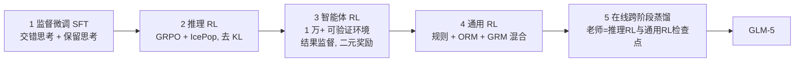

# GLM-5：从氛围编程走向自主体工程

> **原题**：GLM-5: from Vibe Coding to Agentic Engineering
> **作者**：GLM-5 Team（Aohan Zeng、Bin Xu、Minlie Huang、Hongning Wang、Juanzi Li、Yuxiao Dong、Jie Tang 等一百八十余位作者）
> **机构**：智谱（Zhipu AI）与清华大学知识工程实验室（Tsinghua KEG）
> **年份**：2026（arxiv ID 2602.15763，2 月 17 日提交，2 月 24 日修订为 v2）
> **分类**：cs.LG / cs.CL
> **链接**：https://arxiv.org/abs/2602.15763
> **精读日期**：2026-06-23

## 阅读须知

**这篇在领域里的位置。** 过去两年，开源大模型的竞赛重心经历了一次明显的迁移。前一阶段，大家比的是通用对话与考试型推理，谁在数学、科学、常识问答上分数更高谁就领先；模型写代码，多半停留在「你给一句话，它吐一段函数」的层面，写完对不对、能不能跑、要不要改，全靠人盯着。这种用法，业界给了一个略带调侃的名字，叫「氛围编程」（vibe coding），意思是人凭着感觉提需求，模型凭着感觉给代码，真正的工程闭环并没有交到模型手里。GLM-5 这篇报告要做的，是把竞赛推进到下一阶段，作者称之为「自主体工程」（agentic engineering）：模型不再只是写一段代码片段，而是能像一名工程师那样，自己读懂一个代码仓库、自己跑测试、看到报错自己回去改、改完再跑，直到测试通过为止。它属于「面向智能体的基础模型」这一类工作里，少数把架构、训练基础设施、强化学习算法三件事一起重做、并且全部开放权重的尝试。

**读完能回答什么。**

- 「氛围编程」与「自主体工程」差在哪里，为什么后者需要把整条训练栈重做一遍，而不只是多喂些代码数据。
- DSA（DeepSeek 稀疏注意力）是怎么在不牺牲长上下文的前提下，把注意力的计算量压到原来的一半左右的。
- 为什么训练「会干长任务的智能体」时，同步式强化学习会让大量 GPU 空转，slime 这套异步基础设施又是如何把空转填上的。
- GLM-5 用来训练编程智能体的奖励，为什么是「测试过没过」这种二元信号，而不是去给每一步打分。
- 一个 744B 参数、却每次只激活 40B 的模型，在 SWE-bench 这类真实工程基准上，和 Claude、GPT、Gemini 这些闭源模型的差距究竟有多大。

**阅读前置。** 假定读者熟悉 Transformer 的基本结构、注意力机制的大致原理，知道什么是「预训练加微调」这一套流程，也大致听说过强化学习里「采样轨迹、按奖励更新策略」的思路；但不预设读者专门做过混合专家模型（MoE）、做过大规模强化学习基础设施，或者读过 DeepSeek、GRPO 这些近一两年的具体工作。文中第一次出现的专有名词都会先交代它是做什么的，再展开。

**首次出现的缩写表。**

- **MoE**（Mixture-of-Experts，混合专家）：把一个大网络拆成许多「专家」子网络，每个词只路由到其中少数几个，于是参数总量很大、单次实际参与计算的部分却很小。
- **MLA**（Multi-Latent Attention，多潜在注意力）：一种把注意力的键值缓存压缩到低维潜空间的注意力变体，省显存、利于长序列解码。
- **DSA**（DeepSeek Sparse Attention，DeepSeek 稀疏注意力）：本文采用的稀疏注意力，靠内容动态挑出最相关的少数键值来算注意力。
- **MTP**（Multi-Token Prediction，多词预测）：训练时让模型一次预测后面好几个词，用来加速推理时的「投机解码」。
- **TITO**（Token-in-Token-out，词进词出）：让训练端看到的词元序列与推理端生成的完全一致，避免两端因分词不一致而错位。
- **SFT**（Supervised Fine-Tuning，监督微调）：用人工或筛选过的「问答对」直接教模型该怎么回应。
- **RL**（Reinforcement Learning，强化学习）：让模型自己采样答案，按答案好坏给奖励来更新。
- **GRPO**（Group Relative Policy Optimization，组相对策略优化）：近年常用的一种强化学习算法，用一组采样答案的相对好坏来代替单独的价值网络。
- **F2P / P2P**（Fail-to-Pass / Pass-to-Pass）：编程任务里的两类测试信号，前者指「原本失败、改完通过」，后者指「原本通过、改完仍要通过」。
- **ORM / GRM**（Outcome / Generative Reward Model，结果奖励模型 / 生成式奖励模型）：两类给模型答案打分的奖励模型。
- **SWE**（Software Engineering，软件工程）：本文反复出现，特指以真实代码仓库为环境的工程任务。
- **slime**：本文提出的统一异步强化学习训练基础设施的名字。

## 为什么这个问题值得做

把这件事讲清楚，得先说明「模型会写代码」和「模型能做工程」之间隔着多远。今天大多数模型在被要求写代码时，做的是一锤子买卖：接到一句自然语言描述，生成一段代码，任务到此为止。可是真实世界里的软件工程不是这样运作的。一名工程师面对的是一个已经有几十万行代码的仓库、一个语焉不详的缺陷报告、一套必须跑通的测试；他要去定位问题在哪个文件、改动会不会牵连别处、改完跑一遍测试、看到红色的报错再回去调，往往要在「写、跑、看错、再改」这个循环里转上十几二十轮，才算把一个任务真正做完。这中间的每一步都依赖上一步的结果，是一条很长的、带反馈的链条。

模型不解决这条长链，会怎样。结果就是它永远只能当一个「高级自动补全」，把人从敲字里解放一点点，却接不下真正消耗工程师时间的那部分活。过去一两年，行业为了让模型往「能自己干活」的方向走，主要在两条路上使劲：一条是把模型套进一个外部的智能体框架里，靠提示词和工具调用一步步引导它；另一条是多喂代码数据，指望它见得多了自然就会。这两条路都遇到了同一面墙：模型本身没有在「长链条、带反馈、要纠错」这种数据分布上被真正训练过，所以一旦任务变长、中途出错，它就容易越走越偏，无法像人那样从报错里把自己拉回正轨。

GLM-5 的判断是，要跨过这面墙，光在某一个环节上修补不够，得把基础模型这一侧的三件事一起重做：模型架构要能撑得起又长又多轮的上下文，训练基础设施要能高效地让模型在成千上万个真实环境里反复试错，强化学习算法要能在这种长任务上稳定地学到「怎么把一件工程做完」。这篇报告的价值，就在于它把这三件事完整地摆出来，并且把模型权重、训练框架一并开源，让「自主体工程」这件原本被几家闭源公司攥在手里的能力，第一次有了一个可被外界检视和复现的开放样本。

## 一、问题

把上面的动机落到一个可验证的技术陈述上，这篇要解决的问题是：如何训练出一个开放权重的基础模型，使它在「长时程、多轮、带工具反馈」的真实工程任务上，达到接近当时最强闭源模型的水平，同时在通用推理与对话能力上不出现明显退化。

这里的关键词是「长时程」。一个普通的问答任务，输入一段、输出一段就结束了；而一个 SWE-bench 式的任务，模型要在一个真实代码仓库里来回操作几十轮，每一轮都要读取上一轮命令的输出、据此决定下一步,中途还要消化大量来自终端和测试框架的反馈文本。这对模型提出了三层此前没有被同时满足的要求。

第一层是上下文要足够长且不能在长处失真。仓库代码、报错日志、多轮对话累积起来，很快就会把上下文撑到十几万词元，模型不仅要装得下，还要在这么长的范围里仍然找得准关键信息。第二层是训练时要见过足够多的真实纠错轨迹。模型之所以会在出错后越走越偏，根子在于它的训练数据里缺少「犯错、看到报错、改回来」这一类样本；要补上，就得有一套能大规模生成、并且能自动判断对错的训练环境。第三层是强化学习要在这种长任务上稳得住。任务一长，采样一条完整轨迹动辄要几分钟到几十分钟，不同任务的耗时还差得很远，传统的同步式强化学习会因此产生严重的效率与稳定性问题。

前人路线在这三层上各自卡住一处。纯靠外部智能体框架去「指挥」一个未经此训练的模型，相当于让一个没做过工程的人照着说明书操作，链条一长就散；纯靠堆代码数据做预训练，喂进去的是「写好的代码」，而不是「做工程的过程」，模型学到的依然是结果而非那条带反馈的路径；至于强化学习，已有的 GRPO 等算法在短的、单轮的推理任务上行之有效，可一旦搬到长时程的智能体任务上，采样耗时的长尾分布就会让同步训练的 GPU 大量空转，训练几乎跑不动。GLM-5 要做的，是在架构、数据与基础设施、算法这三处同时给出答案，下面的「方法」一节正是沿着这三条线展开的。

## 二、方法

GLM-5 的做法可以拆成三块来看：一块是模型架构本身，目标是用尽量小的实际计算撑起尽量长、尽量多轮的上下文；一块是后训练的整条流水线，目标是把一个会说话的模型，逐级打磨成一个会干工程的智能体；还有一块是支撑后训练的基础设施 slime，它决定了前面那条流水线能不能在大规模上真正跑起来。

### 架构：用稀疏与低秩把长上下文的成本压下去

GLM-5 是一个混合专家模型。它的参数总量是 7440 亿，但每处理一个词，实际只激活其中的 400 亿；换句话说，它在「容量」上是一个超大模型，在「单次算力」上却只相当于一个中等模型。具体配置是 256 个专家、80 层，相比上一代 GLM-4.5 的 3550 亿总参数、320 亿激活参数，这一代把专家数显著加多、把层数反而压低。压低层数是有讲究的：层越多，混合专家所需的跨设备通信就越频繁，把层数收到 80 层，是为了减少这种专家并行带来的通信开销。

注意力这一侧，GLM-5 用的是多潜在注意力（MLA）。普通注意力在解码时要为每个历史词元缓存一份键和值，序列一长，这份缓存就成了显存大户；MLA 的思路是把键值压缩到一个低维的潜空间里再缓存，从而省下大量显存，对长序列解码尤其友好。本文在此基础上做了一个叫 MLA-256 的调整，并且发现一个细节：直接用 MLA 会比传统的分组查询注意力（GQA-8）略差一点，他们用一种称为「Muon Split」的技巧，对 MLA 内部那几个相互独立的矩阵分别做正交化，而不是把所有注意力头当成一体来处理，由此把这点差距补平。

真正决定长上下文成本的，是这篇采用的 DSA，也就是 DeepSeek 稀疏注意力。先说它要解决什么：标准注意力让每个词都去看前面所有的词，计算量随序列长度的平方增长，序列越长，这一项就越贵。DSA 的观察是，在很长的上下文里，大约九成的注意力其实是冗余的，每个词真正需要认真看的，只是前文中的一小部分。于是它不再让每个词都做全量注意力，而是先用一个轻量的「闪电索引器」（lightning indexer）扫一遍，按内容相关性挑出最相关的前 k 个键值，只在这一小撮上算注意力。这样一来，长序列下的注意力计算量大约能降到原来的二分之一到三分之二。作者强调这种稀疏是「构造上无损」的，因为被丢掉的本就是冗余项，关键的长程依赖并没有被牺牲。

上下文长度方面，GLM-5 把窗口从上一代的 12.8 万词元扩到了 20 万词元。这个扩展不是一步到位，而是在「中训练」阶段分三段渐进完成的：先在 3.2 万词元的窗口下训 1 万亿词元，再在 12.8 万的窗口下训 5000 亿词元，最后在 20 万的窗口下训 500 亿词元。先短后长、由密到疏地喂数据，是为了让模型先在便宜的短上下文上学扎实，再逐步适应昂贵的长上下文。

预训练用了 285 亿万词元，也就是 28.5 万亿词元这个量级的数据。数据这一侧的处理重点落在几类语料上：网页数据用更精细的质量分类器和基于句向量的过滤来挑，并专门训练了一个「世界知识分类器」去捞那些长尾的知识；代码数据在去重后的唯一词元上比上一代多了百分之二十八，还特意补强了 Scala、Swift、Lua 这些小众语言；数学与科学数据用一种「分块打分再聚合」的算法来筛，并严格过滤掉疑似由 AI 合成的内容，以免模型学到二手的、被污染的知识。和「自主体工程」这个主题最直接相关的，是在中训练阶段专门加入的软件工程语料：他们收集了大约 1000 万对「问题与合并请求」（issue–PR pair），约 1600 亿唯一词元，并以仓库为单位，把代码、改动差异和对应的问题描述拼接在一起，让模型在预训练阶段就见到「一个问题是如何通过一次代码改动被解决的」这种结构。

### 后训练：把会说话的模型逐级打磨成会干活的智能体

后训练是这篇的重头，它是一条五段式的流水线，顺序是：监督微调，推理强化学习，智能体强化学习，通用强化学习，最后是一次跨阶段的在线蒸馏。每一段各管一件事，前一段的产物是后一段的起点。

第一段是监督微调（SFT）。这一段引入了两个值得记的设计。一个叫「交错思考」（Interleaved Thinking），意思是模型在给出每一次回应或每一次工具调用之前，都先显式地想一段；另一个叫「保留思考」（Preserved Thinking），专门给编程智能体用，让它把前几轮的推理过程跨轮保留下来，而不是每轮都从零想起。这一段的数据分成通用对话、推理、编程与智能体三大类，最大上下文做到 202752 词元。

第二段是推理强化学习。算法上用的是 GRPO，并叠加一个叫 IcePop 的技巧，来缓解「训练时的策略」与「推理时的策略」之间的不一致；和原版 IcePop 不同的是，这里去掉了 KL 正则项，采用组大小为 32 的在线训练，覆盖数学、科学、代码以及「工具集成推理」等多个领域。

第三段是智能体强化学习，也就是真正训练模型「会干工程」的那一段，它跑在后面要讲的 slime 异步框架上。这一段把模型放进超过 1 万个「可验证」的训练环境里，覆盖软件工程、终端操作、搜索三大类。所谓可验证，是指每个环境都能自动判断模型这一轮到底做成了没有，从而给出一个客观的奖励信号。这里的奖励设计是这篇的一个要点：它是「结果监督」的，对编程任务而言就是看测试过没过这种二元信号，而不是去给中间的每一步打分。具体到编程，奖励分三个层次，最基础的是「原本失败、改完通过」（F2P），其次是「原本通过、改完仍要保持通过」（P2P），最高一层才看执行质量，也就是效率、风格与可维护性。

第四段是通用强化学习，负责把模型在做智能体训练时可能磨损掉的通用能力找补回来，目标是多维的：基础正确性、情感智能、各类任务的具体质量。它用的是一套混合奖励，规则判分、结果奖励模型（ORM）、生成式奖励模型（GRM）三者并用，并以专家的人类回答作为锚点来做对齐。

第五段是收尾的在线跨阶段蒸馏。前面几段各自练出了不同的长处，这一段用一种在线蒸馏的办法，把推理强化学习与通用强化学习两个阶段的检查点当作「老师」，让最终模型快速地把前面各阶段学到的技能重新收拢到一起；技术上的一个细节是，它把通常强化学习里的「优势」一项，替换成了「学生相对老师的对数概率比」。

关于「会干工程」的能力究竟是怎么练出来的，环境的搭法值得单独看。软件工程这一类，是用一个叫 RepoLaunch 的框架，从真实的「问题与合并请求」对出发，自动搭出 1 万多个可验证环境，横跨上千个仓库、九种编程语言（Python、Java、Go、C、C++、JavaScript、TypeScript、PHP、Ruby），并用大模型去解析日志，自动抽取出 F2P 与 P2P 的测试信号。终端这一类，用的是一条三阶段合成流水线：先让大模型头脑风暴出任务草稿，再用一种 Harbor 格式把它落成可在 Docker 里执行的具体任务，并反复打磨到 Docker 构建成功率超过九成。搜索这一类，是多跳问答，背后挂着一张由 200 多万篇精选网页构建的「网络知识图谱」，并配了一套分层的上下文管理策略：用「保留最近 k 条」把更早的观察折叠起来，一旦上下文超过阈值就触发「全部丢弃」，免得长任务把上下文撑爆。还有一个额外的智能体任务是生成幻灯片，用的是一套三层奖励，从静态的 HTML 属性，到运行时的 DOM 指标，再到感知层面的特征。

这里有一个贯穿各类任务的小设计，叫「错误掩码」：模型轨迹里那些走错的片段并不删掉，而是保留下来、只在计算损失时把它们屏蔽，这样模型既能看到「错过一次」的现场，又不会被这段错误直接拉去模仿，从而学会的是「出错之后怎么纠正」这一行为本身。

### slime：让长任务的强化学习不再让 GPU 空转

最后是支撑第三、四段强化学习的基础设施 slime。要理解它解决什么问题，得先看清同步式强化学习在长任务上的痛点。强化学习的一轮，要先让模型采样出一批完整轨迹，再拿这批轨迹去更新模型。麻烦在于，智能体任务的采样耗时分布是严重长尾的：有的任务两三步就结束，有的任务要在仓库里转几十轮、跑好几分钟。同步训练必须等这一批里最慢的那条轨迹跑完才能进入更新，于是大量先跑完的 GPU 只能干等着，形成所谓的「气泡」，也就是空转。

slime 的对策是把生成和训练彻底解耦，让它们跑在不同的 GPU 上，中间由一个「多任务轨迹编排器」来调度各种异构的智能体任务。推理引擎那一侧不停地生成轨迹，一旦攒够了预设的数量，就把这一批送去训练引擎更新模型，训练引擎则每隔 K 次梯度更新，再把新的模型权重同步回推理引擎。这样一来，推理端不必停下来等训练，训练端也不必停下来等最慢的轨迹，空转的气泡被很大程度上填平。

异步带来的新麻烦是「数据稍微过时」：推理端用的可能是几步之前的旧模型权重采的样，拿来更新当前模型会引入偏差。slime 用几个机制来稳住这件事。一个是前面提到的词进词出（TITO）网关，它保证「当初采样时看到的词元序列」与「现在拿来优化的词元序列」在动作层面严格对应，不因两端分词差异而错位。一个是「直接双边重要性采样」，在词元级别上做 [1−εl, 1+εh] 的截断，而不必去追踪历史检查点。再一个是干脆丢弃那些「过时得太厉害」的轨迹，当某条轨迹所用的策略版本落后超过阈值 τ 就不要了。还有一个是「数据并行感知的路由」，用一致性哈希把同一条多轮序列尽量落到同一处，保住键值缓存的局部性。

配合 slime，这一段还用了一个专门的智能体强化学习算法，可以理解为「带结果监督的组策略优化」。它的目标函数是让一组 K 条采样轨迹各自的奖励，去逼近这组的平均奖励，形式上是 L(θ) = E[ (1/K) Σᵢ ( r(x, yᵢ) − r̄(x) ) ]，其中 r̄(x) 是这组轨迹奖励的均值。它和 PPO、GRPO 这类算法最不同的两点是：其一，损失只用模型自己生成的词元来算，环境反馈那部分文本一概不计入损失；其二，它不再需要去追踪旧策略 πold，而是直接把「采样时记录下来的对数概率」当作行为的代理，再配合上面的截断与丢弃来控制偏差。对编程这种任务，奖励干脆就用二元的通过与否，而不是去估一个细粒度的优势函数。

## 三、实验

GLM-5 报告的结果，可以分成两组来看：一组是它主打的智能体与编程能力，另一组是用来证明「通用能力没退化」的推理、数学与综合指标。先看主战场。在以真实代码仓库为环境的 SWE-bench Verified 上，GLM-5 拿到 77.8%，这是当时开源模型里的最好成绩，与最强闭源的 Claude Opus 4.5 的 80.9% 相比，差距约三个百分点。在覆盖多语言的 SWE-bench Multilingual 上，它是 73.3%，落后 Claude Opus 4.5 的 77.5%，但明显高过 Gemini 3 Pro 的 65%。在更偏终端操作的 Terminal-Bench 2.0 上，它给出的区间是 56.2% 到 61.1%，已经和 Claude Opus 4.5 的 57.9% 到 59.3% 相当。在考察网页搜索的 BrowseComp 上，它是 62.0%，配合前面说的上下文管理策略能升到 75.9%，略高于 Claude 的对应成绩。值得一提的还有 Vending-Bench 2 这个长时程的经营模拟，GLM-5 赚到 4432 美元，对照 Claude Opus 的 4967 美元；以及 τ²-Bench 上的 89.7%，大幅领先 Kimi K2.5 的 80.2%。

| 基准 | 考察能力 | GLM-5 | 主要对照 |
|---|---|---|---|
| SWE-bench Verified | 真实仓库修复缺陷 | 77.8% | Claude Opus 4.5：80.9%（开源第一） |
| SWE-bench Multilingual | 多语言工程 | 73.3% | Claude Opus 4.5：77.5%；Gemini 3 Pro：65% |
| Terminal-Bench 2.0 | 终端操作 | 56.2–61.1% | Claude Opus 4.5：57.9–59.3% |
| BrowseComp | 网页搜索 | 62.0%（管理后 75.9%） | Claude：60.6%（74.9%） |
| Vending-Bench 2 | 长时程经营模拟 | 4432 美元 | Claude Opus：4967 美元 |
| τ²-Bench | 工具调用对话 | 89.7% | Kimi K2.5：80.2% |
| HLE（人类最后的考试） | 高难综合推理 | 30.5（带工具 50.4） | GPT-5.2：35.4（45.5） |
| GPQA-Diamond | 研究生级科学问答 | 86.0% | Gemini 3 Pro：91.9% |

把这两栏放在一起读，能看出这篇结果的整体形态：在智能体与编程这条主线上，GLM-5 基本贴住了最强闭源模型，常常只差两三个百分点，并稳居开源第一；而在纯推理、纯科学问答这类传统硬指标上，它与 GPT-5.2、Gemini 3 Pro 还存在可见的差距，比如 HLE 的 30.5 对 35.4、GPQA 的 86.0% 对 91.9%。换句话说，这一代的资源和方法，是被有意地向「会干工程」这个方向倾斜的。一个能概括其总体位置的指标是 Artificial Analysis Index v4.0，GLM-5 拿到 50 分，是开放权重模型第一次达到这个数；在 LMArena 的人类盲评里，它也是文本与代码两个竞技场上的开源第一。

消融部分，有几处比较有说服力。多词预测（MTP）这一项，通过在三层之间共享参数，把投机解码的平均接受长度做到 2.76，高于 DeepSeek-V3 的 2.55，也就是每次能多猜对一点、推理更快。DSA 的无损性，在 RULER 这个长上下文检索基准的 12.8 万词元设置下得到验证，稀疏之后性能几乎没有掉。作者还在一个 9B 的小模型上，把几种长上下文注意力方案摆在一起比：在 RULER 的 6.4 万与 12.8 万设置下，基于滑窗的方案掉分最少（约 −1.63 与 −5.69），而 GDN 一类掉得明显（约 −8.59 与 −11.28），DSA 则因为「构造上无损」而最稳。

## 四、局限

作者自己承认的局限，集中在长上下文与评测两处。先说长上下文：尽管窗口扩到了 20 万词元，报告明确指出，模型在「极长上下文，比如超过 10 万词元」之后准确率会显著下降，正因如此，搜索智能体才不得不靠「保留最近 k 条加超阈值全部丢弃」这套上下文管理来兜底。也就是说，20 万这个数字是「装得下」的上限，而不是「用得好」的上限，真正能稳定发挥的有效长度要短一截。评测一侧，作者指出 BrowseComp 这个搜索基准对「裁判用什么提示词、用哪个裁判模型」相当敏感，他们不得不用 OpenAI 的 o3-mini 来做标准化，这从侧面说明这类智能体能力的评测本身还不够稳健，跨论文的数字未必可直接比较。

从消融里还能读出几处作者没有特别强调、但值得留意的代价。其一，DSA 并非完全免费，在 12.8 万词元、联合训练 1500 亿词元之后，它仍有约 0.35 分的轻微落后，所谓「无损」是工程上可接受的近似而非字面意义。其二，异步强化学习换来的效率，是以引入「数据过时」的偏差为前提的，全靠词元级的重要性采样、截断与丢弃这一整套补丁来压住，这套机制本身的复杂度和调参负担不容低估。其三，在幻灯片生成这类奖励较难定义的任务上，他们观察到了明显的「奖励钻空子」行为，模型会用硬截断超长内容、过度操纵间距这种办法去骗取高分，只能靠不断打磨渲染器来堵漏，这说明只要奖励信号一旦不是「测试过没过」这种硬指标，结果监督这条路就会重新面对老问题。

还有一处是报告本身的留白：全文没有给出明确的训练算力（FLOPs）或总训练时长，只在推理侧提到，借助 W4A8 量化，能在国产硬件上把长序列场景的成本压低约一半。缺少训练成本这一栏，使得外界难以判断这套方法相对于闭源模型在「投入产出比」上究竟占不占优，复现者也难以据此估算自己需要多少资源。

## 一句话

GLM-5 用 744B/40B 的稀疏架构、20 万长上下文、外加 slime 异步强化学习与上万个可验证环境，把开源模型在真实软件工程任务上逼到与最强闭源仅差两三个百分点的位置。
