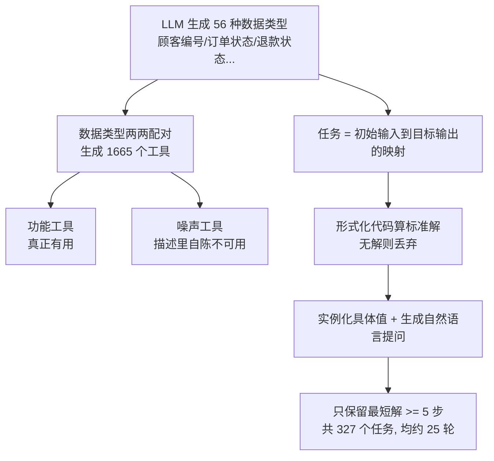
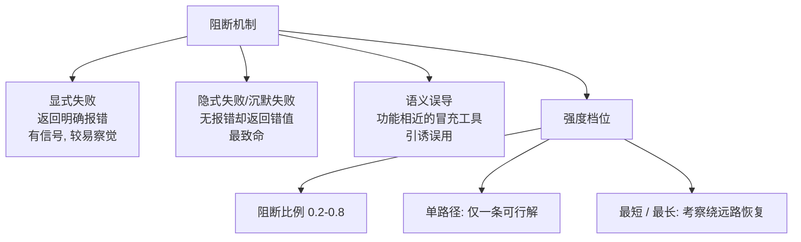
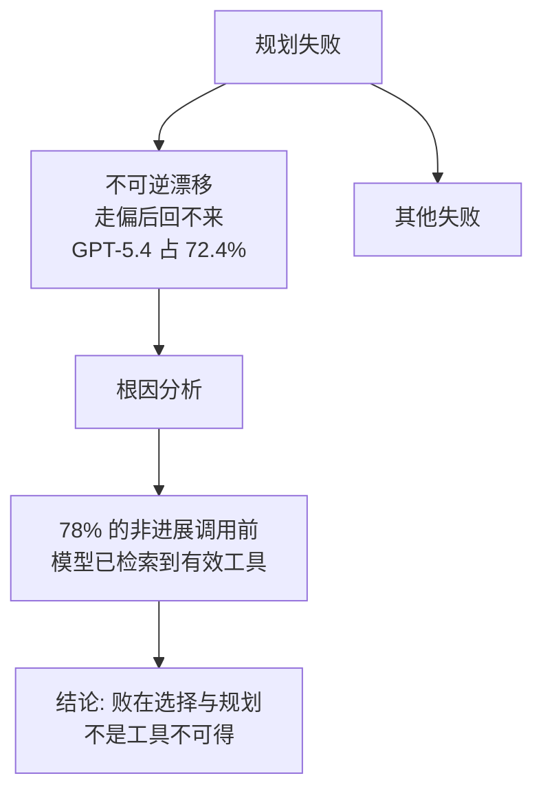

# PlanBench-XL：当工具多到看不全，智能体还会做长程规划吗

> **原题**：PlanBench-XL: Evaluating Long-Horizon Planning of LLM Tool-Use Agents in Large-Scale Tool Ecosystems
> **作者**：Jiayu Liu、Qihan Lin、Cheng Qian、Rui Wang、Emre Can Acikgoz、Xiaocheng Yang、Jiateng Liu、Zhenhailong Wang、Xiusi Chen、Heng Ji、Dilek Hakkani-Tür
> **机构**：伊利诺伊大学厄巴纳-香槟分校（UIUC）等
> **年份**：2026（arxiv ID 2606.22388，6 月 21 日提交）
> **分类**：cs.AI / cs.CL
> **链接**：https://arxiv.org/abs/2606.22388
> **精读日期**：2026-06-23

## 阅读须知

**这篇在领域里的位置。** 过去一年，让大模型「调用工具去完成任务」已经从一个研究话题变成了产品形态，市面上的智能体动辄要在几百上千个 API 或工具之间挑选、组合、连续调用。为了衡量这种能力，社区陆续做出了一批工具调用基准，比较有代表性的是模拟客服场景的 τ-bench、收录大量真实 API 的 ToolBench 一类。可是这些基准大多有一个共同的简化假设：可用的工具会被一次性、完整地摆在模型面前，模型要做的只是从这份已知清单里挑对的来用。现实并非如此。当一个工具生态大到上千个时，没有哪个模型能把全部工具描述都塞进上下文，它只能像人用搜索引擎那样，每一步先去「检索」出一小批可能有用的工具，再从中决定下一步。这篇 PlanBench-XL 要补的，正是这块被普遍跳过的拼图：在「工具可见性受检索限制」的条件下，模型还能不能把一个需要环环相扣、长达几十步的任务规划着做完，尤其是当其中一些工具还会缺失、失灵或冒充时。它属于「智能体评测」这一类工作，但把考察重点从「会不会用一个工具」推到了「在看不全、不可靠的大工具生态里会不会做长程规划」。

**读完能回答什么。**

- 「工具可见性受检索限制」到底是什么意思，它为什么会让一个在小工具集上表现尚可的模型突然变得吃力。
- PlanBench-XL 这套 327 个任务、1665 个工具的基准，是怎么用数据类型两两配对的办法批量造出来的，又怎么保证任务确实有解、且至少要五步才能解。
- 它设计的「阻断」机制有哪三种，分别在模拟现实中的哪一类故障，为什么「沉默失败」那一种最致命。
- 为什么最强的 GPT-5.4 在无阻断时能做到 51.90%，一加上最严重的阻断就崩到 11.36%。
- 论文得出的最关键结论：模型的失败，主要不是因为「没有可用的工具」，而是因为「明明检索到了可用工具却选错了路」。

**阅读前置。** 假定读者知道大模型「调用工具 / 函数」的基本范式，即模型输出一个工具名加参数、环境返回结果、模型据此继续；也大致理解智能体「多轮交互、按观察决定下一步」的循环。不预设读者读过 τ-bench、ToolBench 等具体基准，也不预设熟悉「检索增强」在工具选择上的用法，相关概念都会在文中先交代再展开。

**首次出现的缩写表。**

- **LLM**（Large Language Model，大语言模型）：本文里特指被当作智能体内核、负责决策的那个模型。
- **工具生态**（tool ecosystem）：一个任务环境里全部可调用工具的集合，本文规模是 1665 个。
- **检索受限可见性**（retrieval-limited tool visibility）：模型看不到全部工具，每一步只能通过检索拿到一小批候选，是本文的核心设定。
- **数据类型**（datatype）：本文造任务的基本单位，例如「顾客编号」「订单状态」，工具就是把若干输入数据类型变成若干输出数据类型的函数。
- **阻断机制**（blocking mechanism）：本文用来模拟工具不可靠的可选机制，分显式失败、隐式失败、语义误导三种。
- **ITCR**（Invalid Tool Call Rate，无效工具调用率）：衡量模型在调用工具时出现流程性或结构性错误的比例。
- **EDT**（Explored Datatypes，已探索数据类型数）：衡量模型在过程中新发现了多少中间信息。
- **不可逆漂移**（Irrecoverable Drift）：本文定义的最大一类失败模式，指模型一旦走偏就再也回不到正确路径上。

## 为什么这个问题值得做

要讲清楚这篇的动机，得先把「在小工具集里用工具」和「在大工具生态里做规划」这两件事区分开。在只有十几个工具的环境里，模型面对的是一道选择题：工具清单就在眼前，它只需挑出正确的那个、填对参数。这种设定下，模型表现得好，主要靠的是对单个工具语义的理解。可是当工具数量上到上千个，情况发生了质变。没有任何上下文窗口能同时容纳一千多个工具的完整描述，于是模型被迫进入一个「检索-决策」的循环：每一步先根据当前掌握的信息去检索出一小批候选工具，再从这一小批里判断哪个能让自己离目标更近，调用它、拿到新信息，再据此检索下一批。这时候，决定成败的就不再只是「认不认识某个工具」，而是「在只能看到局部、且要连走几十步的情况下，会不会规划」。

这个问题不解决会怎样。后果是，我们对智能体能力的判断会建立在一个失真的实验室条件上。一个模型可能在「工具全摆出来」的基准上拿到很高的分数，让人以为它已经能胜任真实工作，可一旦放进「工具要自己一批批检索、而且其中有些还会出故障」的真实环境，它的表现会断崖式下跌而我们却毫无预警。更麻烦的是真实世界的工具从来不是完美的：有的接口临时下线，有的看似返回了结果却悄悄给了错的值，有的工具名字和你要的功能很像、实则风马牛不相及。一个能用的智能体，必须能在这些故障里认出此路不通、并临场改道，而现有基准几乎从不考这一项。

过去的努力大致沿两条线展开，都各自留了缺口。一条线是把工具调用做成静态选择题，像早期的若干工具基准那样，把候选工具直接给全，这条线测不出「检索受限」下的规划能力。另一条线是搭真实 API 环境，像 ToolBench 那样规模很大，但真实 API 的成功与否难以稳定判定、任务的最短解法也难以形式化，导致评测既不可控也不好归因。PlanBench-XL 的选择，是走一条中间路线：用合成的方式把整个工具生态和任务从数据类型层面「造」出来，这样既能把规模做到上千个工具、把任务长度拉到几十步，又能为每个任务用形式化的代码算出标准解、精确判定对错，还能可控地往里注入各种故障。正是这种「可控的大规模」，让它能第一次清晰地量出：今天的前沿模型，离「在大而不完美的工具生态里稳健规划」还差多远。

## 一、问题

把动机落到一个可验证的陈述上，这篇要回答的是：当工具数量大到模型无法全部看到、只能逐步检索，并且任务需要把多个工具的输出环环相扣才能完成时，当今的大模型智能体的长程规划能力究竟如何；进一步，当这个工具生态里混入缺失、失灵、误导性的工具时，它们能否在运行时察觉并改道。

这里有两个彼此叠加的难点。第一个难点来自「可见性受限」。模型每一步只能检索到一小批候选工具，这意味着它必须带着对目标的预期去检索，既要往前想「从我现在手里的信息出发能够到达什么」，也要往回想「要拿到最终答案，前一步需要什么」。检索不再是一个被动的查字典动作，而成了规划的一部分。第二个难点来自「长程依赖」。一个任务的最终目标，往往要靠中途若干次工具调用逐步挖出来的「中间证据」才能达成：你得先调一个工具拿到订单状态，才能据此去检索并调用下一个需要订单状态作为输入的工具，如此一环扣一环。链条越长，任何一步走偏被放大的风险就越大。

在此之上，论文还要刻意制造现实里的「不完美」。真实工具生态中的故障可以粗分为三类：有的工具直接报错，明白告诉你它坏了；有的工具不报错，却悄悄返回一个不符合其文档描述的、无用甚至错误的结果；还有的工具描述得跟你要的功能很接近，看上去可以拿来顶替，实则功能并不对路。这三类故障对模型的考验是递增的：第一类有明确的错误信号，至少模型有机会察觉；后两类没有显式信号，模型很容易被悄悄带偏而毫不自知。本文的核心追问之一，就是模型在缺少显式错误信号、并且需要绕远路才能恢复时，会败得有多惨。

## 二、方法

PlanBench-XL 不是一个训练方法，而是一套基准的构造与评测方法，可以拆成三部分来看：工具与任务是怎么从数据类型层面被批量造出来的，智能体在其中如何「检索-调用-作答」地交互，以及阻断机制是怎么把现实的不完美注入进去的。

### 用数据类型两两配对，造出工具与任务

整套基准的基石是「数据类型」这个概念。一个数据类型就是任务世界里的一种信息单位，比如「顾客编号」「订单状态」「退款状态」。本文先让一个大模型生成器提出 56 种零售领域的数据类型，再用另一个大模型把其中含糊或重复的过滤掉，得到一份干净的数据类型清单。

有了数据类型，工具就被定义成「把若干输入数据类型变成若干输出数据类型」的函数。于是只要把数据类型两两、或多对多地配对，就能系统地生成大量工具。举例来说，给定输入「商品名」和「门店名」，可以造出一个工具，它的功能是「查询该商品在该门店是否有货并返回库存状态」。按这种办法，本文一共构造了 1665 个工具。除了这些真正有用的「功能工具」，还特意配上了一批「噪声工具」：它们在描述里就明说自己不可用或不可靠，目的是模拟真实生态里鱼龙混杂的样子，考验模型会不会主动把它们排除掉。所有工具背后挂着一个数据库，为每个零售案例填入具体的值，确保答案没法靠常识猜出来，必须真的去调用工具才能拿到。

任务则被形式化成一个「从初始输入数据类型集合，到目标输出数据类型集合」的映射。换句话说，给你手里已有的几样信息，要你设法得到指定的那样信息。本文用一套三步流水线来造任务并保证质量：第一步，用形式化的代码去计算，从初始输入到目标输出究竟存不存在一条由工具串起来的标准解法序列，凡是算不出解的任务一律丢弃；第二步，从后端数据库实例化出具体的实体与属性值，再让大模型据此写出一句自然语言的用户提问，并按某条合法解法生成标准答案；第三步，只保留那些「最短解法也至少需要五次不同工具调用」的任务，太短太简单的不要。最终留下 327 个任务，平均要走大约 25 轮才能完成，并辅以部分人工抽检来把关。

### 智能体如何在检索受限下交互

模型在这套环境里，每一轮只能从三个动作里选一个：检索、调用工具、或者给出最终答案。它看不到全部 1665 个工具，要用工具就得先检索。本文给的检索器支持三种模式，对应着「双向规划」的思路：一种是「按输入检索」，相当于往前看，问「从我现在手上的信息能够到达什么」；一种是「按输出检索」，相当于往回看，问「要得到我想要的结果，需要哪些前置工具」；还有一种是两个方向的条件同时给。每次检索，检索器最多返回 30 个候选工具，模型整个任务的交互预算上限是 100 轮。

环境在背后维护着一份隐状态，记录三样东西：用户的原始提问、模型到目前为止已经检索发现的可用工具、以及模型通过成功调用工具已经获得的数据类型。每成功调用一个工具，它的输出就会更新「已获得的数据类型」这一项，从而让新的中间证据变得可被下一步检索和调用。一个典型的推进过程是这样的：从「顾客编号」出发，检索到并调用工具 A，拿到「订单状态」；再去检索那些需要「订单状态」作为输入的工具，发现工具 B，调用它拿到「退款状态」；如此一步步把中间证据攒起来，直到够到目标数据类型为止。这条链清楚地体现了长程依赖：后面能做什么，完全取决于前面挖出了什么。

### 阻断机制：把现实的不完美注入进去

这是 PlanBench-XL 区别于一般工具基准的关键设计，它是一个可选开关，开启后会按设定的比例破坏掉一部分解法路径，逼模型在运行时察觉并改道。破坏的方式分三种，对应前面问题一节里讲的三类现实故障。第一种是「显式失败阻断」：被检索到的工具返回一条明确的错误信息，比如「错误：接口不可用」，这种至少给了模型可察觉的信号。第二种是「隐式失败阻断」：工具不报错，却悄悄返回一个违背其文档描述的无用结果，也就是所谓的沉默失败。第三种是「语义误导阻断」：返回一个功能相关但并不相同的工具，让它看上去像个可用的替代品，引诱模型误用。

阻断的强度也分了多个档次。一个维度是「阻断比例」，取 0.2、0.4、0.6、0.8，表示有多大比例的解法路径被禁用。还有几个更细的设定：「单路径」条件下只留下唯一一条可行解，「最短」条件保留最短的那条路，而「最长」条件则只留下需要绕最远才能恢复的那条路。后两者用来专门考察：当恢复需要走一条更长的替代路径时，模型还撑不撑得住。面对阻断，模型必须自己认出哪条分支被破坏了，办法要么是识别出错误信号，要么是察觉到返回值被污染，然后避免把这些坏结果继续往下游传播，并重新规划绕过去。

评测时，论文除了看最终答案对不对的「准确率」，还设了一组更细的指标来刻画过程：用「执行的标准数据类型精度」看模型调用的工具有多少真正服务于任务，用「无效工具调用率」（ITCR）看流程性错误有多少，用「不可信输入拒绝率」看它有没有把噪声工具的脏值挡在外面，用「已探索数据类型数」（EDT）看它挖出了多少新的中间信息，还用「检索与调用之比」看它在搜索和动手之间的平衡。这些过程指标让失败可以被归因，而不只是给一个对错。

## 三、实验

论文在 PlanBench-XL 上测了十个当下有代表性的模型，覆盖开源与闭源、大与小：Qwen3 的 8B、14B、32B 三档，Llama-3.1-8B-Instruct 与 Llama-3.3-70B-Instruct，DeepSeek-V4-Flash，谷歌的 Gemini-3.1-Pro 与 Gemini-3.5-Flash，以及 OpenAI 的 GPT-5.4-Mini 与 GPT-5.4。需要先说明的一点是，这一批里没有包含 Claude 系列。

先看不开阻断的「干净」设定。即便工具生态本身已经够大、任务已经够长，最强的 Gemini-3.1-Pro 也只做到 77.06%，GPT-5.4 是 51.90%，DeepSeek-V4-Flash 是 63.08%，大多数模型都在三分之二以下。更值得注意的是规模的悬崖：Qwen3-8B 和 Llama-3.1-8B 这一档小模型直接是 0.00%，等于完全无法在这种检索受限的大工具生态里完成任务。这说明「在上千工具里做长程规划」本身就是一道高门槛，不是靠堆一点参数就能跨过的。

| 设定 | 模型 | 准确率 |
|---|---|---|
| 无阻断 | Gemini-3.1-Pro | 77.06%（最高） |
| 无阻断 | DeepSeek-V4-Flash | 63.08% |
| 无阻断 | GPT-5.4 | 51.90% |
| 无阻断 | Qwen3-8B / Llama-3.1-8B | 00.00% |
| 最严重阻断 | GPT-5.4 | 11.36% |
| 单路径阻断 | GPT-5.4 | 约 30% |
| 仅余最长路径 | GPT-5.4 | 略高于 10% |

再看开阻断之后的崩塌。以 GPT-5.4 为例，它在无阻断时尚有 51.90%，一旦加上最严重的阻断条件，准确率直接掉到 11.36%。把阻断拆开看更清楚：当只剩单一可行路径时，它跌到约三成；当只留下最长的那条恢复路径时，它进一步跌到只比一成高一点。也就是说，越是需要它认出此路不通、并绕一条更远的路重新规划，它就越力不从心。

这篇最有价值的，是它对失败的归因分析，而不只是给出一串分数。论文定义了几类规划失败，其中占比最大的一类叫「不可逆漂移」：模型一旦走偏，就再也回不到正确路径上。这一类在 GPT-5.4 上占到 72.4%，在 Gemini-3.5-Flash 上占到 71.3%，是失败的主要形态。三种阻断里，沉默失败（隐式失败）造成的准确率最低，也就是最致命，因为它不给任何显式信号，模型察觉不到自己已经踩进坑里。而最反直觉、也最关键的一条发现是：在默认设定下，那些「没有取得进展」的失败调用之前，有 78.0% 的情况，模型其实早已检索到了至少一个能推动任务前进的有效工具。这说明漂移的根子不在于「没有可用工具」，而在于「检索到了却选错了」，问题出在选择与规划，而非工具的可得性。这个结论把改进的方向，从「把检索做得更全」扭向了「让模型在已有候选里做出更对的决策」。

## 四、局限

作者自己承认的主要局限，是这套基准目前只落在零售这一个领域。零售场景的数据类型与工具关系相对规整，能否推广到金融、医疗、企业内部系统等结构更复杂、噪声更难刻画的真实工具生态，还需要验证；不过作者也指出，由于整套生成流水线是可扩展的，把它迁移到别的领域在原理上是行得通的。

除了作者明说的，读完还能看出几处值得留意的边界。其一，整套任务与工具都是合成出来的。这带来了可控与可判定的好处，让标准解能被形式化地算出来、对错能被精确判断，但合成环境与真实 API 之间存在不小的鸿沟：真实接口的语义模糊、参数耦合、状态副作用，远比「数据类型到数据类型」的干净映射要脏，模型在 PlanBench-XL 上的表现，未必能等比例地搬到真实系统上。其二，任务的提问与部分质量把关依赖大模型生成加「部分人工抽检」，这意味着任务集里可能仍混有少量表述不清或解法有歧义的样本，规模化生成的代价之一就是难以做到逐条精校。其三，评测阵容里缺少 Claude 这一支主流模型，使得这张排行榜在横向比较上并不完整，读者不宜把它当作覆盖全部前沿模型的定论。其四，论文重在「诊断」失败，给出的是一个能照见问题的测试台，但对「如何让模型不漂移」这一改进问题，本身并不提供解法，那是留给后续工作的部分。

## 一句话

PlanBench-XL 用 327 个零售任务、1665 个工具的合成基准，证明在「工具看不全、还会出故障」的大生态里，连 GPT-5.4 的长程规划也会从 51.90% 崩到 11.36%，而失败多半源于检索到了好工具却选错路的「不可逆漂移」。
