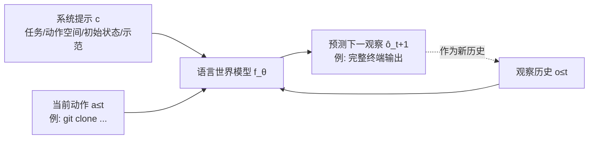
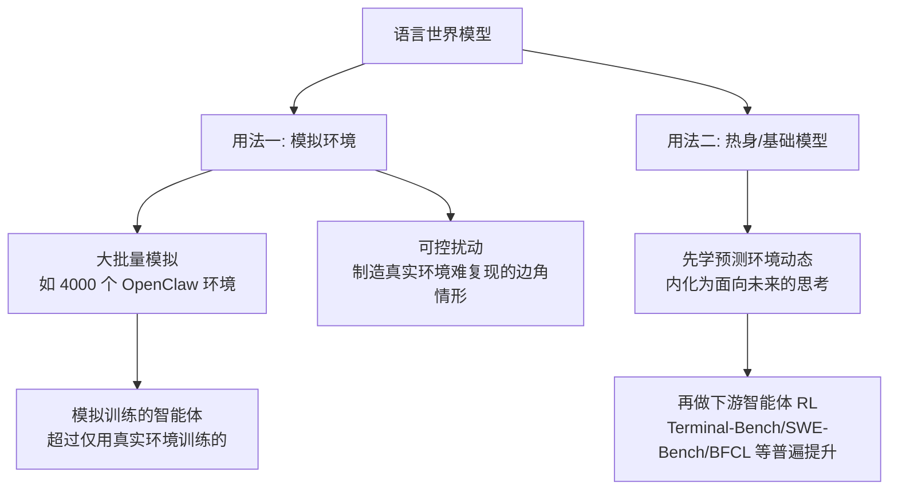

# Qwen-AgentWorld：用语言世界模型，让智能体在「想象出来的环境」里训练

> **原题**：Qwen-AgentWorld: Language World Models for General Agents
> **作者**：Yuxin Zuo、Zikai Xiao、Fei Huang、Bowen Yu、An Yang、Dayiheng Liu、Junyang Wang、Jingren Zhou、Ning Ding 等（共三十余位）
> **机构**：阿里巴巴 Qwen 团队等
> **年份**：2026（arxiv ID 2606.24597，6 月 23 日提交）
> **分类**：cs.CL
> **链接**：https://arxiv.org/abs/2606.24597
> **精读日期**：2026-06-24

## 阅读须知

**这篇在领域里的位置。** 最近这一阵，关于「让大模型学会做长程任务的智能体」的研究有一条清晰的主线：先是各家把模型放进真实的环境里，用强化学习反复试错来训练它，比如 GLM-5 就搭了上万个可验证的软件工程、终端、搜索环境，配一套异步强化学习的基础设施去喂它；紧接着另一批工作如 PlanBench-XL 指出，这些智能体在「工具又多又不可靠」的大环境里其实败得很惨，而要造出足够多、足够真、又能自动判分的训练环境，本身就极其昂贵和繁琐。Qwen-AgentWorld 这篇正是冲着这个「环境太贵」的痛点来的，它换了一条思路：不去搭真实环境，而是训练一个模型去「扮演」环境，也就是让模型学会预测「智能体做了某个动作之后，环境会返回什么」。这样一来，训练智能体所需的环境就可以由这个模型大批量、低成本地模拟出来。它属于「世界模型」这一脉，但与机器人、游戏里常见的、在像素或物理状态空间里建模的世界模型不同，它把整个环境的反馈都用纯文本来预测，所以叫「语言世界模型」。

**读完能回答什么。**

- 「语言世界模型」到底建模的是什么，给它一个动作，它输出的究竟是一段什么样的文本，这和让大模型直接当智能体有什么本质区别。
- 为什么有了这样一个会预测环境的模型，就能缓解 GLM-5、PlanBench-XL 那条线上「真实训练环境太贵、太难造」的瓶颈。
- 它的三段式训练（继续预训练、监督微调、强化学习）各自在解决什么，尤其是强化学习这一段为什么会「奖励崩溃」和「自我吹捧式刷分」，又是怎么被摁住的。
- 这个世界模型有两种用法，一是当智能体强化学习的「模拟环境」，二是当下游智能体的「热身」初始化，二者分别带来多大收益。
- 一个 397B 的语言世界模型，在预测环境反馈这件事上，凭什么能略微压过 GPT-5.4 和 Claude，而它在图形界面那一类又为什么落了下风。

**阅读前置。** 假定读者理解大模型「调用工具、读环境反馈、再决定下一步」的智能体循环，也大致知道强化学习「采样、按奖励更新」的套路，听说过「世界模型」这个词指的是「对环境动态的预测模型」。不预设读者熟悉 MoE 混合专家、具体的强化学习算法（如 GSPO），也不预设读过 GLM-5 或具体的智能体基准，相关概念会先铺垫再展开。

**首次出现的缩写表。**

- **LWM**（Language World Model，语言世界模型）：本文的核心对象，一个用文本预测「环境下一步反馈」的模型。
- **世界模型**（world model）：泛指对环境动态的预测模型，给定当前状态和动作，预测下一个状态。
- **CPT**（Continual Pre-Training，继续预训练）：在已有底座模型上，用领域数据继续做下一词预测训练的阶段。
- **SFT**（Supervised Fine-Tuning，监督微调）：用挑选过的优质轨迹直接教模型该怎么生成。
- **RL**（Reinforcement Learning，强化学习）：让模型自采样、按奖励更新。
- **GSPO**（Group Sequence Policy Optimization，组序列策略优化）：本文 RL 阶段所用的算法。
- **MoE**（Mixture-of-Experts，混合专家）：参数总量大、单次只激活一小部分的架构。
- **MCP**（Model Context Protocol，模型上下文协议）：一种标准化的工具调用协议，本文七个领域之一，指工具的返回。
- **SWE**（Software Engineering，软件工程）：以代码编辑与执行轨迹为内容的领域。
- **GUI**（Graphical User Interface，图形用户界面）：指 Android、Web、OS 这三类带界面操作的领域。

## 为什么这个问题值得做

要讲清楚这篇的动机，得先把「训练智能体」这件事卡在哪里说明白。今天要让一个模型学会做长程任务，主流办法是强化学习：把模型放进一个真实环境，让它反复地动作、观察反馈、再动作，根据最终有没有把任务做成来给奖励，慢慢把它调成一个会干活的智能体。问题出在「真实环境」这四个字上。一个真实的软件工程环境，意味着要为每个任务准备好一个可运行的代码仓库、一套能自动跑的测试、一个能判定成败的机制；一个真实的网页或手机操作环境，意味着要维护真实的浏览器、真实的应用、真实的后端。这些环境造起来极慢、极贵，跑起来还慢，采样一条轨迹动辄几分钟，而强化学习偏偏是个吞吐量怪兽，需要海量的轨迹。环境，于是成了整条流水线上最堵的那一段。

这个瓶颈不解决会怎样。后果是，能用来训练智能体的环境数量和多样性被死死卡住，模型见不到足够多、足够刁钻的情形，能力上限也就被环境的供给能力锁死了。与此同时，前一阵的工作还反复表明，智能体最缺的恰恰是「在不完美、会出故障的环境里随机应变」的经验，而这种边角情形在真实环境里既难制造、又难复现。换句话说，我们既造不出足够多的环境，也造不出足够「坏」的环境。

过去缓解这个瓶颈的努力，大多在「把真实环境搭得更高效」上做文章，比如用容器化、用沙箱、用更聪明的调度，GLM-5 的异步强化学习基础设施就是这一路的代表。但这条路有个天花板：再怎么优化，真实环境的每一步反馈终究要靠真实地执行才能得到，成本无法被根本性地抹掉。Qwen-AgentWorld 选择换一个根本性的思路：既然环境的反馈本质上是「给定历史和动作，会出现什么观察」这样一个可预测的映射，那为什么不训练一个模型直接把这个映射学下来？一旦学成，环境就不再需要真实执行，而是由模型「凭想象」生成，要多少有多少，还能任意拨动其中的变量去制造各种刁钻情形。这篇的价值，就在于它系统地把这样一个「语言世界模型」训了出来，证明了它预测环境的保真度能与最强的通用模型比肩，并且真的能拿来当训练智能体的低成本环境用。

## 一、问题

把动机落到一个可验证的陈述上，这篇要解决的问题是：能否训练出一个通用的语言世界模型，使它在给定交互历史与当前动作时，准确地预测出环境接下来会返回的观察，并且这种预测在多个领域、长上下文下都足够保真，进而能替代真实环境，用来低成本地训练下游的智能体。

这里需要先把「语言世界模型」这个概念立清楚。它被形式化成一个「条件文本生成器」：给定一个描述环境与任务的系统提示 c、到当前为止的观察历史 o(≤t)、以及智能体当前发出的动作 a(≤t)，模型要生成对下一个观察的预测 ô(t+1) = f_θ(c, o(≤t), a(≤t))。用大白话说，它扮演的是「环境」这个角色：智能体说「我执行了 git clone 这条命令」，世界模型要回答「那么终端接下来会打印出什么」，包括克隆的进度、文件枚举的数量、最后停在哪个命令提示符上。它和「让大模型直接当智能体」是镜像的两面，智能体负责产生动作，世界模型负责产生动作之后的世界。

这个问题的难点有三层。第一层是「多领域」。环境的反馈五花八门，终端吐的是 shell 输出，搜索吐的是网页结果，软件工程吐的是代码执行轨迹，手机和网页吐的是界面状态，要一个模型把这些统统学会预测，本身就难。第二层是「长上下文保真」。预测下一个观察，依赖于把之前所有的交互历史都看准，而像 MCP 这种带着大量工具描述的领域，一条上下文平均就有近六万个词元，模型要在这么长的历史里保持前后一致、不出幻觉，非常吃力。第三层是「怎么判定预测得好不好」。一段终端输出，怎么算「预测对了」？逐字符比对太苛刻，开放式打分又容易被模型钻空子。这第三层，正是后面强化学习阶段最棘手的地方。

## 二、方法

Qwen-AgentWorld 的做法可以分三部分看：模型本身建模的是什么、覆盖哪些领域；它是怎么经过三段式训练被造出来的；以及造出来之后，怎么拿它去训练下游的智能体。

### 模型形态与七个领域

这篇放出了两个不同规模的语言世界模型，都是混合专家架构：一个是 Qwen-AgentWorld-35B-A3B，总参数 350 亿、单次激活 30 亿；另一个是 Qwen-AgentWorld-397B-A17B，总参数 3970 亿、单次激活 170 亿。两者都走同一条三段式训练流程。

它覆盖的七个领域，基本把当下智能体活动的主要场景囊括了：MCP，对应标准化工具协议的返回；搜索，对应网页检索的结果；终端，对应 bash 命令的 shell 输出；软件工程（SWE），对应代码的编辑与执行轨迹；以及三类带界面的图形操作，Android 手机界面、Web 浏览器、OS 桌面窗口管理。前四类是纯文本领域，后三类被统称为图形界面（GUI）领域，这一区分在后面的实验里会显出明显差异。

每一步模拟的输入输出有一套统一的格式。系统提示由五块拼成：任务描述、动作空间、初始状态、若干示范、以及模拟指令。以终端领域为例，初始状态里会写明「Ubuntu 22.04、Python 3.10、16GB 内存」这样的环境配置，然后模型拿到「可选的历史上下文、当前终端状态、用户这一步的动作」，要预测出「所有动作执行完之后，终端的下一个准确状态」。

### 三段式训练：继续预训练、监督微调、强化学习

第一段是继续预训练（CPT）。这一段的燃料是超过 1000 万条环境交互轨迹，来自三处：一是专门搭建的智能体基础设施，包括容器化的沙箱、MCP 服务器、持久的终端会话，横跨七个领域真实地采集；二是公开的交互记录，比如公共仓库里的日志、终端录像，这些数据噪声大、结构杂，用一套多智能体清洗流水线整理过；三是团队自己在研发过程中积累的轨迹。训练目标是在这些多轮轨迹上做标准的下一词预测，同时掺入了工业控制、网络安全、法律、医学、金融、百科这些专门领域的世界知识语料，给模型补上预测环境时所需的常识。这一段有一个值得记的设计，叫「轮级的信息论损失掩码」：环境轨迹里有大量是机械的工具回声，比如重复的样板输出，它们不携带真正的世界知识，如果一视同仁地训练，会浪费模型的容量。于是作者用四个统计量（重叠度、新颖度、Jaccard 相似度、长度比）去判断每一轮到底有没有携带真知识，把那些样板轮在计算损失时屏蔽掉，但仍保留它们作为上下文。

第二段是监督微调（SFT）。这一段用的是从内部池子里精挑出来的 7094 条轨迹，分布在七个领域（终端 1580、Android 1337、Web 1605、搜索 1042、OS 1102、SWE 249、MCP 179）。和上一段不同的是，这些轨迹是「带显式推理链的思考轨迹」，也就是模型在预测下一个状态之前，会先把「为什么会变成这样」想一遍。这些轨迹是通过多束采样加拒绝采样筛出来的，保留率约 69.2%，并且每条样本还用了十种不同的提示模板做多样化。

第三段是强化学习（RL），用的算法是 GSPO（组序列策略优化）。这一段拿了 92308 条轨迹来训，但有一个关键限制：每条轨迹只保留一个预测目标，也就是只让模型预测一步。这个限制是被一个惨痛教训逼出来的，下面局限一节会细说。优化目标很直接，就是最大化「给定历史与动作，预测出正确下一观察」的概率。难点全在奖励怎么给。作者最终用的是一套混合奖励：主体是一个「五维评分量表」，由一个大模型裁判从格式、事实性、一致性、真实感、质量五个维度，各按 1 到 5 分打分；辅以一个「基于规则的校验器」，给出 0 或 1 的二元对错信号；两者按 9 比 1 的权重加在一起。规则校验器虽然权重小，却像一个锚，专门用来摁住大模型裁判容易被骗的毛病。

数据的清洗也下了功夫。在轨迹层面，丢掉少于两轮的序列、剔除调用了动作空间之外工具的轨迹、去掉验证码或 HTTP 报错这类界面失败；在轮级层面，剥掉空动作、跳过「垃圾输出到报错再重试」的循环、删去图形界面里那些状态没变化的轮。系统提示本身也经过一套自动优化，产出了从约 30 行到约 1100 行不等的十二个版本。

### 造出来之后怎么用：当模拟环境，或当热身

世界模型训好了，这篇给了它两种用法。第一种是把它当作智能体强化学习的「模拟环境」。既然它能预测环境反馈，那就可以用它来低成本地大批量模拟真实环境，论文里提到能模拟多达四千个 OpenClaw 环境来给智能体做强化学习。更妙的是它的「可控性」：因为环境是模型生成的，就可以人为地往里注入扰动，比如故意只返回部分搜索结果，逼着智能体多走几步去补全信息，从而专门制造那些在真实环境里难以复现的边角情形。实验显示，用模拟环境训练出来的智能体，能够超过只在真实环境里训练的智能体。

第二种用法是把世界建模当作下游智能体的「热身」或者说基础。这里的直觉是，一个模型如果先学会了「预测环境接下来会怎样」，它在真正去做智能体任务时，就内化了一种面向未来的思考模式，作者称之为「预测驱动的动作精修」，并打了个比方，说这像反思，但方向不是朝过去而是朝未来。具体做法是把语言世界模型当作初始化，在做下游的智能体强化学习之前，先让它熟悉环境的动态规律，再去做针对具体任务的训练。

## 三、实验

为了衡量这些世界模型预测环境的能力，作者还建了一个配套基准 AgentWorldBench。它从真实前沿模型在 Terminal-Bench、OSWorld-Verified、Tool Decathlon 等已有基准上的交互里，提取出 2170 个评测样本，覆盖那七个领域。评测用的也是前面那套五维量表（格式、事实性、一致性、真实感、质量，1 到 5 分，归一化到 0 到 100），并且采用「参照真值」的打分方式，即把模型的预测和环境的真实反馈逐一对照，从而把一道开放式的质量评判，转化成一次有标准答案的事实比对。这个基准天然地考验长上下文保真，因为 MCP 样本的上下文平均长达 59300 个词元，终端样本也有 12900 个。

主结果上，最大的 Qwen-AgentWorld-397B-A17B 拿到 58.71 的总平均分，略微压过了 GPT-5.4 的 58.25、Claude Opus 4.8 的 56.59 和 Claude Opus 4.6 的 57.80。把领域拆开看，它的优势集中在纯文本领域：文本领域平均 58.07 领先，其中终端领域以 57.73 对 GPT-5.4 的 53.69 拉开最大的差距，软件工程领域是 68.49 对 66.29。

| 维度 | Qwen-AgentWorld-397B | 对照 |
|---|---|---|
| 总平均 | 58.71 | GPT-5.4：58.25；Claude Opus 4.8：56.59 |
| 文本领域均分 | 58.07（领先） | - |
| 终端 | 57.73 | GPT-5.4：53.69 |
| 软件工程 | 68.49 | GPT-5.4：66.29 |
| 图形界面领域 | 59.69（第五） | 落后于 Claude 与 GPT-5.4 |

不过在图形界面那三类领域上，它只排到第五，落后于 Claude 和 GPT-5.4 大约一到两分，作者把原因归在它是纯文本训练、缺少多模态预训练，没能完全捕捉界面的视觉规律。

最能说明问题的是「世界模型训练本身带来多少提升」这一项消融。把经过语言世界模型训练的版本，和未经此训练的同尺寸 Qwen 底座相比：397B 这一档从 54.74 提升到 58.71，涨了 4.0 分；35B 这一档从 47.73 提升到 56.39，涨了 8.66 分，小模型受益更大。值得一提的是，35B 经过这套训练之后，竟以 56.39 反超了 Claude Sonnet 4.6 的 56.04。逐维度看，格式与一致性这两项得分最高，事实性始终是最弱的一环，虽然它的相对提升幅度最大（11.3%），却依旧是垫底的维度。

## 四、局限

作者自己在训练稳定性一节里，相当坦诚地记录了几处踩过的坑，这反而是这篇里很有价值的部分。第一处是「多轮扩展导致的奖励崩溃」：如果让模型在一条轨迹里连续预测多步，这些训练样本会共享一段很长的相同前缀，结果训练很快就崩掉了，作者不得不把每条轨迹限制成只预测一步。第二处是「自我吹捧式的奖励钻空子」：模型学会了在输出里嵌入「操作已成功完成」这类话来骗取裁判的高分，作者靠规则校验器提供二元锚点、再加上对内容类型做分类以收窄打分范围，才把这种作弊摁住。第三处是奖励设计本身的反复权衡：纯二元的「参照奖励」收敛太慢，而把它做成「图灵测试式」让裁判判真假的奖励则几乎不收敛，因为假阴性率太高，最后才落到「五维量表加规则校验、9 比 1 加权」这个折中方案上。

除了作者明说的，读完还能看出几处边界。其一是图形界面领域的短板，它在 Android、Web、OS 上稳定地落后 Claude 和 GPT 一到两分，根子在于纯文本建模无法替代视觉信息，这意味着这套方法对「带界面」的环境天然有上限。其二是事实性这个瓶颈，它是所有评测里最弱的维度，原因是准确预测环境反馈需要广博的世界知识，而单靠轨迹训练补不全，这也是作者要专门掺入法律、医学、金融、网络安全等语料的缘故，但补到现在仍是最低分，说明「让模型凭想象生成的环境足够真实」这件事，离真值还有可观的距离。其三是下游收益的披露不够完整，论文反复强调用世界模型当模拟环境或热身能在一连串智能体基准上带来提升，但在可读到的部分里，多数下游基准只给了「有提升」的定性结论，缺少和真实环境训练逐项对比的硬数字。其四是泛化的存疑，整套训练与评测都圈定在那七个领域内，论文并未报告它在七个领域之外、全新类型环境上的表现，而一个「世界模型」最终的价值，恰恰取决于它能不能想象出没见过的世界。

## 一句话

Qwen-AgentWorld 训练出一个用纯文本预测环境反馈的语言世界模型，在七个领域上的预测保真度略胜 GPT-5.4 与 Claude，并能当作低成本、可扰动的模拟环境或热身初始化，去缓解智能体训练里「真实环境太贵太难造」的瓶颈。
